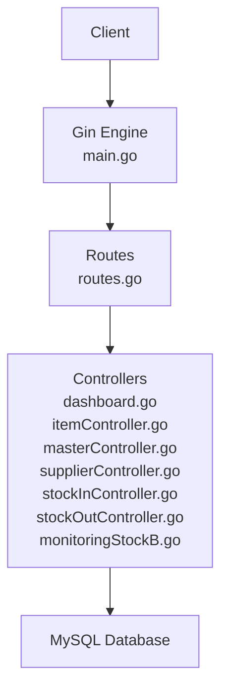
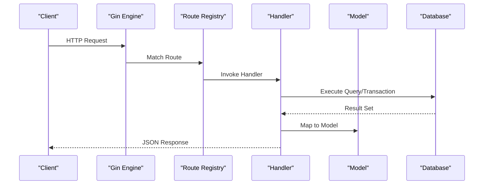
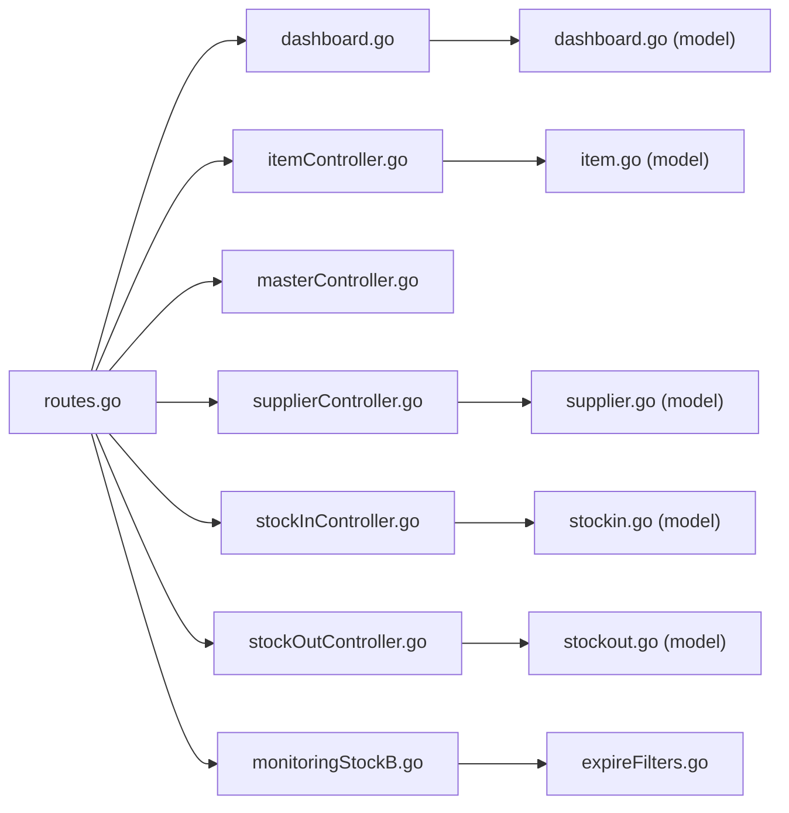

# API Reference

<cite>
**Referenced Files in This Document**
- [main.go](file://backend/main.go)
- [routes.go](file://backend/routes/routes.go)
- [dashboard.go](file://backend/controllers/dashboard.go)
- [itemController.go](file://backend/controllers/itemController.go)
- [masterController.go](file://backend/controllers/masterController.go)
- [supplierController.go](file://backend/controllers/supplierController.go)
- [stockInController.go](file://backend/controllers/stockInController.go)
- [stockOutController.go](file://backend/controllers/stockOutController.go)
- [monitoringStockB.go](file://backend/controllers/monitoringStockB.go)
- [expireFilters.go](file://backend/controllers/expireFilters.go)
- [dashboard.go](file://backend/models/dashboard.go)
- [item.go](file://backend/models/item.go)
- [stockin.go](file://backend/models/stockin.go)
- [stockout.go](file://backend/models/stockout.go)
- [supplier.go](file://backend/models/supplier.go)
</cite>

## Table of Contents
1. [Introduction](#introduction)
2. [Project Structure](#project-structure)
3. [Core Components](#core-components)
4. [Architecture Overview](#architecture-overview)
5. [Detailed Component Analysis](#detailed-component-analysis)
6. [Dependency Analysis](#dependency-analysis)
7. [Performance Considerations](#performance-considerations)
8. [Troubleshooting Guide](#troubleshooting-guide)
9. [Conclusion](#conclusion)
10. [Appendices](#appendices)

## Introduction
This document provides comprehensive API documentation for the PPA system’s RESTful endpoints. It covers HTTP methods, URL patterns, request/response schemas, authentication requirements, parameter specifications, validation rules, error handling, pagination, filtering, rate limiting, and client integration guidelines. Endpoints are organized by functional areas: dashboard analytics, inventory management, stock operations (stock-in and stock-out), and master data services.

## Project Structure
The backend is a Go application using Gin for routing and GORM for database operations. Routes are registered in a central router and mapped to controller functions. Models define JSON schemas returned by endpoints.

**Diagram sources**
- [main.go:12-32](file://backend/main.go#L12-L32)
- [routes.go:9-35](file://backend/routes/routes.go#L9-L35)

**Section sources**
- [main.go:12-32](file://backend/main.go#L12-L32)
- [routes.go:9-35](file://backend/routes/routes.go#L9-L35)

## Core Components
- HTTP server bootstrap initializes CORS and registers routes.
- Central route registry maps endpoints to controller handlers.
- Controllers implement business logic, handle pagination/filtering, and return structured JSON responses.
- Models define response schemas for clients.

**Section sources**
- [main.go:12-32](file://backend/main.go#L12-L32)
- [routes.go:9-35](file://backend/routes/routes.go#L9-L35)

## Architecture Overview
The API follows a layered architecture:
- Entry point: Gin engine and middleware registration.
- Routing: Centralized route definitions.
- Controllers: Request parsing, validation, database queries, transactions, and response formatting.
- Persistence: GORM-backed MySQL queries.

**Diagram sources**
- [main.go:12-32](file://backend/main.go#L12-L32)
- [routes.go:9-35](file://backend/routes/routes.go#L9-L35)
- [dashboard.go:43-305](file://backend/controllers/dashboard.go#L43-L305)
- [stockInController.go:13-383](file://backend/controllers/stockInController.go#L13-L383)
- [stockOutController.go:13-349](file://backend/controllers/stockOutController.go#L13-L349)

## Detailed Component Analysis

### Authentication and Security
- No explicit authentication middleware is configured in the entrypoint. All endpoints are currently unprotected.
- CORS is enabled globally, allowing cross-origin requests.

Recommendations:
- Introduce JWT or session-based authentication middleware.
- Enforce HTTPS and secure headers.
- Apply rate limiting at the gateway or middleware level.

**Section sources**
- [main.go:15-16](file://backend/main.go#L15-L16)

### Base URL and Versioning
- Base URL: http://host:8080/api
- No explicit API versioning is present in routes or headers.

Recommendations:
- Use path-based versioning (/api/v1) or header-based versioning (Accept: application/vnd.company.v1+json).
- Maintain backward compatibility via deprecation notices and migration timelines.

**Section sources**
- [routes.go:10-35](file://backend/routes/routes.go#L10-L35)

### Rate Limiting and Pagination
- Global rate limiting: Not implemented.
- Pagination: Implemented in several endpoints via page and limit query parameters with a max limit enforced where applicable.
- Filtering: Implemented via query parameters (e.g., search, date).

**Section sources**
- [stockInController.go:80-175](file://backend/controllers/stockInController.go#L80-L175)
- [stockOutController.go:116-187](file://backend/controllers/stockOutController.go#L116-L187)
- [dashboard.go:43-305](file://backend/controllers/dashboard.go#L43-L305)

### Dashboard Analytics Endpoints

#### GET /api/dashboard
- Purpose: Retrieve aggregated dashboard metrics with optional pagination for distribution and recent activities.
- Query parameters:
  - golongan_page (integer ≥ 1), default 1
  - golongan_limit (integer ≥ 1), default 10
  - activities_page (integer ≥ 1), default 1
  - activities_limit (integer ≥ 1), default 10
- Response schema:
  - summary: total_items, total_stock, low_stock_count, expiring_soon_count, expired_count, inventory_value
  - golongan_distribution: label, item_count, total_stock
  - location_stock: location, total_stock
  - stock_movement: month, barang_masuk, barang_keluar
  - recent_activities: id, type, kode_brng, nama_brng, qty, activity_date, activity_time, reference_no
  - pagination: golongan and activities pagination metadata
- Example curl:
  - curl "http://localhost:8080/api/dashboard?golongan_page=1&golongan_limit=10&activities_page=1&activities_limit=10"
- Notes:
  - Results are cached for a short TTL to reduce load.

**Section sources**
- [routes.go:23](file://backend/routes/routes.go#L23)
- [dashboard.go:43-305](file://backend/controllers/dashboard.go#L43-L305)
- [dashboard.go:3-60](file://backend/models/dashboard.go#L3-L60)

### Inventory Management APIs

#### GET /api/items
- Purpose: List items with optional search and pagination.
- Query parameters:
  - search (string): fuzzy match on name, code, barcode, batch, or invoice
- Response:
  - total (integer): total records matching filters
  - data (array of Item)
- Example curl:
  - curl "http://localhost:8080/api/items?search=pain"

**Section sources**
- [routes.go:10](file://backend/routes/routes.go#L10)
- [itemController.go:98-215](file://backend/controllers/itemController.go#L98-L215)
- [item.go:3-33](file://backend/models/item.go#L3-L33)

#### GET /api/items/:kodeBrng
- Purpose: Retrieve a single item by internal code.
- Path parameters:
  - kodeBrng (string): item code
- Response:
  - data: Item
- Example curl:
  - curl "http://localhost:8080/api/items/T123"

**Section sources**
- [routes.go:12](file://backend/routes/routes.go#L12)
- [itemController.go:22-96](file://backend/controllers/itemController.go#L22-L96)
- [item.go:3-33](file://backend/models/item.go#L3-L33)

#### PUT /api/items/:kodeBrng
- Purpose: Update item attributes.
- Request body (partial updates):
  - Fields: nama_brng, h_beli, ralan, utama, beliluar, expire, kode_sat, kode_golongan, kdjns, kode_industri, barcode
- Validation:
  - On bind error, returns 400 with error message.
- Example curl:
  - curl -X PUT "http://localhost:8080/api/items/T123" -H "Content-Type: application/json" -d '{}'

**Section sources**
- [routes.go:21](file://backend/routes/routes.go#L21)
- [itemController.go:217-267](file://backend/controllers/itemController.go#L217-L267)

#### DELETE /api/items/:kodeBrng
- Purpose: Remove an item and associated barcode/batch/inventory records.
- Example curl:
  - curl -X DELETE "http://localhost:8080/api/items/T123"

**Section sources**
- [routes.go:22](file://backend/routes/routes.go#L22)
- [itemController.go:269-283](file://backend/controllers/itemController.go#L269-L283)

### Master Data Services

#### GET /api/masters
- Purpose: Retrieve all master lists in a single response.
- Response:
  - golongan: array of { kode, nama }
  - jenis: array of { kdjns, nama }
  - satuan: array of { kode_sat, satuan }
  - suppliers: array of Supplier
- Example curl:
  - curl "http://localhost:8080/api/masters"

**Section sources**
- [routes.go:13](file://backend/routes/routes.go#L13)
- [masterController.go:51-95](file://backend/controllers/masterController.go#L51-L95)
- [supplier.go:3-14](file://backend/models/supplier.go#L3-L14)

#### POST /api/masters/:type
- Purpose: Add a new master entry.
- Path parameters:
  - type: golongan | jenis | satuan
- Request body:
  - code (string), name (string)
- Validation:
  - Trims whitespace; rejects empty code/name; checks uniqueness.
- Example curl:
  - curl -X POST "http://localhost:8080/api/masters/golongan" -H "Content-Type: application/json" -d '{"code":"G01","name":"Generic"}'

**Section sources**
- [routes.go:14](file://backend/routes/routes.go#L14)
- [masterController.go:97-139](file://backend/controllers/masterController.go#L97-L139)

#### PUT /api/masters/:type/:code
- Purpose: Update a master entry by code.
- Path parameters:
  - type: golongan | jenis | satuan
  - code: string
- Request body:
  - name (string)
- Validation:
  - Trims whitespace; rejects empty name; returns 404 if not found.
- Example curl:
  - curl -X PUT "http://localhost:8080/api/masters/jenis/KD01" -H "Content-Type: application/json" -d '{"name":"Updated Type"}'

**Section sources**
- [routes.go:15](file://backend/routes/routes.go#L15)
- [masterController.go:141-178](file://backend/controllers/masterController.go#L141-L178)

#### DELETE /api/masters/:type/:code
- Purpose: Delete a master entry by code.
- Example curl:
  - curl -X DELETE "http://localhost:8080/api/masters/satuan/KS01"

**Section sources**
- [routes.go:16](file://backend/routes/routes.go#L16)
- [masterController.go:180-205](file://backend/controllers/masterController.go#L180-L205)

#### GET /api/suppliers
- Purpose: List suppliers.
- Response:
  - data: array of Supplier
- Example curl:
  - curl "http://localhost:8080/api/suppliers"

**Section sources**
- [routes.go:17](file://backend/routes/routes.go#L17)
- [supplierController.go:10-21](file://backend/controllers/supplierController.go#L10-L21)
- [supplier.go:3-14](file://backend/models/supplier.go#L3-L14)

#### POST /api/suppliers
- Purpose: Create a new supplier.
- Request body: Supplier
- Example curl:
  - curl -X POST "http://localhost:8080/api/suppliers" -H "Content-Type: application/json" -d '{}'

**Section sources**
- [routes.go:18](file://backend/routes/routes.go#L18)
- [supplierController.go:23-41](file://backend/controllers/supplierController.go#L23-L41)
- [supplier.go:3-14](file://backend/models/supplier.go#L3-L14)

#### PUT /api/suppliers/:id
- Purpose: Update a supplier by ID.
- Path parameters:
  - id: string
- Request body: Supplier
- Example curl:
  - curl -X PUT "http://localhost:8080/api/suppliers/SUP001" -H "Content-Type: application/json" -d '{}'

**Section sources**
- [routes.go:19](file://backend/routes/routes.go#L19)
- [supplierController.go:43-65](file://backend/controllers/supplierController.go#L43-L65)
- [supplier.go:3-14](file://backend/models/supplier.go#L3-L14)

#### DELETE /api/suppliers/:id
- Purpose: Delete a supplier by ID.
- Example curl:
  - curl -X DELETE "http://localhost:8080/api/suppliers/SUP001"

**Section sources**
- [routes.go:20](file://backend/routes/routes.go#L20)
- [supplierController.go:67-80](file://backend/controllers/supplierController.go#L67-L80)
- [supplier.go:3-14](file://backend/models/supplier.go#L3-L14)

### Stock Operation Handlers

#### GET /api/stock-in/items
- Purpose: Search stock-in eligible items.
- Query parameters:
  - search (string): fuzzy match on code, name, or barcode
- Response:
  - data: array of StockInItem
- Example curl:
  - curl "http://localhost:8080/api/stock-in/items?search=paracetamol"

**Section sources**
- [routes.go:26](file://backend/routes/routes.go#L26)
- [stockInController.go:13-50](file://backend/controllers/stockInController.go#L13-L50)
- [stockin.go:3-13](file://backend/models/stockin.go#L3-L13)

#### GET /api/stock-in/recent
- Purpose: Retrieve recent stock-in entries.
- Response:
  - data: array of StockInRecent
- Example curl:
  - curl "http://localhost:8080/api/stock-in/recent"

**Section sources**
- [routes.go:27](file://backend/routes/routes.go#L27)
- [stockInController.go:52-78](file://backend/controllers/stockInController.go#L52-L78)
- [stockin.go:15-24](file://backend/models/stockin.go#L15-L24)

#### GET /api/stock-in/history
- Purpose: Retrieve paginated stock-in history with optional filters.
- Query parameters:
  - search (string), date (YYYY-MM-DD), page (integer ≥ 1), limit (integer 1..100)
- Response:
  - data, page, limit, total, total_pages, total_qty, total_value
- Example curl:
  - curl "http://localhost:8080/api/stock-in/history?page=1&limit=100&date=2025-01-01"

**Section sources**
- [routes.go:28](file://backend/routes/routes.go#L28)
- [stockInController.go:80-175](file://backend/controllers/stockInController.go#L80-L175)
- [stockin.go:26-45](file://backend/models/stockin.go#L26-L45)

#### POST /api/stock-in
- Purpose: Record a stock-in transaction.
- Request body (StockInPayload):
  - Required: kode_brng, qty (>0), no_batch, no_faktur, tanggal_pembelian
  - Optional: price, expired
- Validation:
  - Rejects missing required fields; performs transactional updates to inventory, batch, and history tables.
- Response:
  - message, data: { kode_brng, stok_awal, stok_akhir }
- Example curl:
  - curl -X POST "http://localhost:8080/api/stock-in" -H "Content-Type: application/json" -d '{}'

**Section sources**
- [routes.go:29](file://backend/routes/routes.go#L29)
- [stockInController.go:235-383](file://backend/controllers/stockInController.go#L235-L383)
- [stockin.go:47-57](file://backend/models/stockin.go#L47-L57)

#### GET /api/stock-out/items
- Purpose: Search stock-out eligible items.
- Query parameters:
  - search (string): fuzzy match on code, name, barcode, or batch/faktur
- Response:
  - data: array of StockOutItem
- Example curl:
  - curl "http://localhost:8080/api/stock-out/items?search=antibiotic"

**Section sources**
- [routes.go:30](file://backend/routes/routes.go#L30)
- [stockOutController.go:13-63](file://backend/controllers/stockOutController.go#L13-L63)
- [stockout.go:3-17](file://backend/models/stockout.go#L3-L17)

#### GET /api/stock-out/batches
- Purpose: List available batches for a given item with current stock and pricing.
- Query parameters:
  - kode_brng (required)
- Response:
  - data: array of StockOutBatchOption
- Example curl:
  - curl "http://localhost:8080/api/stock-out/batches?kode_brng=T123"

**Section sources**
- [routes.go:31](file://backend/routes/routes.go#L31)
- [stockOutController.go:65-103](file://backend/controllers/stockOutController.go#L65-L103)
- [stockout.go:48-60](file://backend/models/stockout.go#L48-L60)

#### GET /api/stock-out/recent
- Purpose: Retrieve recent stock-out entries.
- Response:
  - data: array of StockOutHistory
- Example curl:
  - curl "http://localhost:8080/api/stock-out/recent"

**Section sources**
- [routes.go:32](file://backend/routes/routes.go#L32)
- [stockOutController.go:105-114](file://backend/controllers/stockOutController.go#L105-L114)
- [stockout.go:19-32](file://backend/models/stockout.go#L19-L32)

#### GET /api/stock-out/history
- Purpose: Retrieve paginated stock-out history with optional filters.
- Query parameters:
  - search (string), date (YYYY-MM-DD), page (integer ≥ 1), limit (integer 1..100)
- Response:
  - data, page, limit, total, total_pages, total_qty, total_value
- Example curl:
  - curl "http://localhost:8080/api/stock-out/history?page=1&limit=100&date=2025-01-01"

**Section sources**
- [routes.go:33](file://backend/routes/routes.go#L33)
- [stockOutController.go:116-187](file://backend/controllers/stockOutController.go#L116-L187)
- [stockout.go:19-46](file://backend/models/stockout.go#L19-L46)

#### POST /api/stock-out
- Purpose: Record a stock-out transaction.
- Request body (StockOutPayload):
  - Required: kode_brng, qty (>0), no_batch, no_faktur, destination
  - Optional: note
- Validation:
  - Rejects missing required fields; verifies sufficient stock; performs transactional updates to inventory, batch, and history tables.
- Response:
  - message, data: { kode_brng, stok_awal, stok_akhir, no_batch, no_faktur }
- Example curl:
  - curl -X POST "http://localhost:8080/api/stock-out" -H "Content-Type: application/json" -d '{}'

**Section sources**
- [routes.go:34](file://backend/routes/routes.go#L34)
- [stockOutController.go:189-281](file://backend/controllers/stockOutController.go#L189-L281)
- [stockout.go:34-41](file://backend/models/stockout.go#L34-L41)

### Monitoring Stock Endpoints

#### GET /api/monitoring-stock
- Purpose: Comprehensive stock monitoring with thresholds and observation windows.
- Query parameters:
  - period: day | month | year | all (default month)
- Response includes:
  - summary: critical_stock_count, restock_needed_count, expiring_soon_count, expired_count
  - low_stock_items, expiring_items, turnover_items, coverage_items, golongan_stats, golongan_values
  - meta: period, observation_days, observation_period, thresholds
- Example curl:
  - curl "http://localhost:8080/api/monitoring-stock?period=month"

**Section sources**
- [routes.go:24](file://backend/routes/routes.go#L24)
- [monitoringStockB.go:83-375](file://backend/controllers/monitoringStockB.go#L83-L375)

#### GET /api/monitoring-stock/details
- Purpose: Filtered details for critical, restock, expiring_soon, or expired items.
- Query parameters:
  - type: critical | restock | expiring_soon | expired
  - search: optional term to filter by name/code
- Response:
  - data: filtered list according to type
- Example curl:
  - curl "http://localhost:8080/api/monitoring-stock/details?type=critical&search=pain"

**Section sources**
- [routes.go:25](file://backend/routes/routes.go#L25)
- [monitoringStockB.go:377-520](file://backend/controllers/monitoringStockB.go#L377-L520)
- [expireFilters.go:3-10](file://backend/controllers/expireFilters.go#L3-L10)

## Dependency Analysis

**Diagram sources**
- [routes.go:9-35](file://backend/routes/routes.go#L9-L35)
- [dashboard.go:43-305](file://backend/controllers/dashboard.go#L43-L305)
- [itemController.go:22-283](file://backend/controllers/itemController.go#L22-L283)
- [masterController.go:51-205](file://backend/controllers/masterController.go#L51-L205)
- [supplierController.go:10-80](file://backend/controllers/supplierController.go#L10-L80)
- [stockInController.go:13-383](file://backend/controllers/stockInController.go#L13-L383)
- [stockOutController.go:13-349](file://backend/controllers/stockOutController.go#L13-L349)
- [monitoringStockB.go:83-520](file://backend/controllers/monitoringStockB.go#L83-L520)
- [expireFilters.go:3-10](file://backend/controllers/expireFilters.go#L3-L10)
- [dashboard.go:3-60](file://backend/models/dashboard.go#L3-L60)
- [item.go:3-33](file://backend/models/item.go#L3-L33)
- [stockin.go:3-57](file://backend/models/stockin.go#L3-L57)
- [stockout.go:3-60](file://backend/models/stockout.go#L3-L60)
- [supplier.go:3-14](file://backend/models/supplier.go#L3-L14)

**Section sources**
- [routes.go:9-35](file://backend/routes/routes.go#L9-L35)

## Performance Considerations
- Dashboard endpoint uses concurrent goroutines to fetch multiple metrics and caches the combined response for a short TTL to improve latency.
- Stock-in/out history endpoints compute summaries differently depending on whether search is applied to reduce join overhead.
- Pagination limits are enforced to prevent excessive loads.

Recommendations:
- Introduce rate limiting and request throttling.
- Add database indexes on frequently filtered columns (e.g., kode_brng, tanggal, no_batch).
- Consider caching strategies for read-heavy endpoints.

**Section sources**
- [dashboard.go:13-305](file://backend/controllers/dashboard.go#L13-L305)
- [stockInController.go:177-233](file://backend/controllers/stockInController.go#L177-L233)
- [stockOutController.go:315-348](file://backend/controllers/stockOutController.go#L315-L348)

## Troubleshooting Guide
Common issues and resolutions:
- 400 Bad Request:
  - Validation failures on item update or stock operations (missing fields, invalid values).
- 404 Not Found:
  - Item or master record not found during update/delete.
- 400 Bad Request (stock-out):
  - Insufficient stock or invalid batch selection.
- 500 Internal Server Error:
  - Database errors during transactions or queries; check logs for SQL exceptions.

Operational tips:
- Verify required fields in payloads for POST/PUT endpoints.
- Use pagination parameters to manage large datasets.
- For monitoring endpoints, adjust period to balance accuracy and performance.

**Section sources**
- [itemController.go:217-267](file://backend/controllers/itemController.go#L217-L267)
- [stockInController.go:235-383](file://backend/controllers/stockInController.go#L235-L383)
- [stockOutController.go:189-281](file://backend/controllers/stockOutController.go#L189-L281)
- [masterController.go:97-139](file://backend/controllers/masterController.go#L97-L139)

## Conclusion
The PPA API provides a comprehensive set of endpoints for inventory and stock operations, master data management, and dashboard analytics. While functional, it requires enhancements in authentication, rate limiting, and API versioning to support production-grade integrations. The included models and examples enable straightforward client development.

## Appendices

### Endpoint Summary Table
- GET /api/dashboard
- GET /api/items
- GET /api/items/:kodeBrng
- PUT /api/items/:kodeBrng
- DELETE /api/items/:kodeBrng
- GET /api/masters
- POST /api/masters/:type
- PUT /api/masters/:type/:code
- DELETE /api/masters/:type/:code
- GET /api/suppliers
- POST /api/suppliers
- PUT /api/suppliers/:id
- DELETE /api/suppliers/:id
- GET /api/stock-in/items
- GET /api/stock-in/recent
- GET /api/stock-in/history
- POST /api/stock-in
- GET /api/stock-out/items
- GET /api/stock-out/batches
- GET /api/stock-out/recent
- GET /api/stock-out/history
- POST /api/stock-out
- GET /api/monitoring-stock
- GET /api/monitoring-stock/details

### Client Integration Guidelines
- Base URL: http://host:8080/api
- Authentication: None configured; implement as per recommendation.
- Pagination: Use page and limit parameters; respect max limit where indicated.
- Filtering: Apply search and date filters as documented.
- Error Handling: Parse JSON error messages for validation and operational failures.