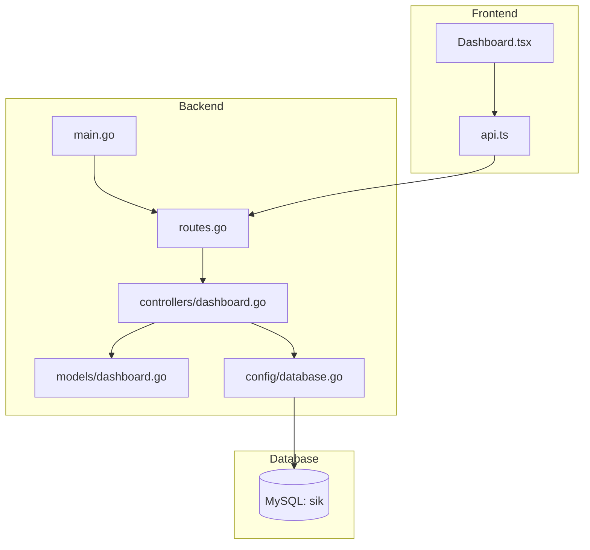
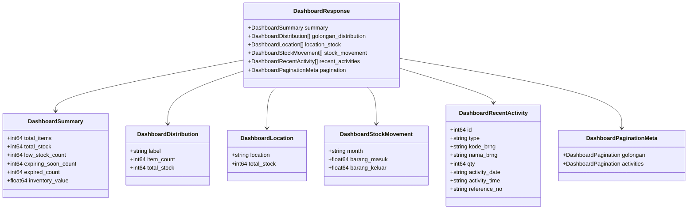
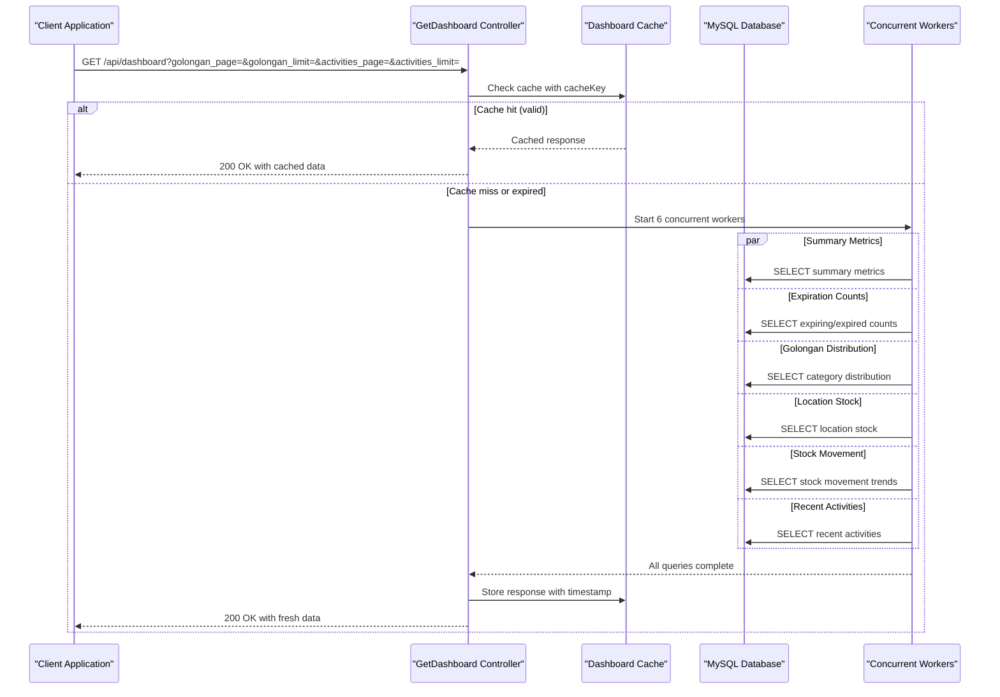
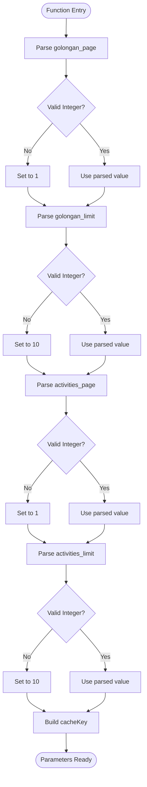
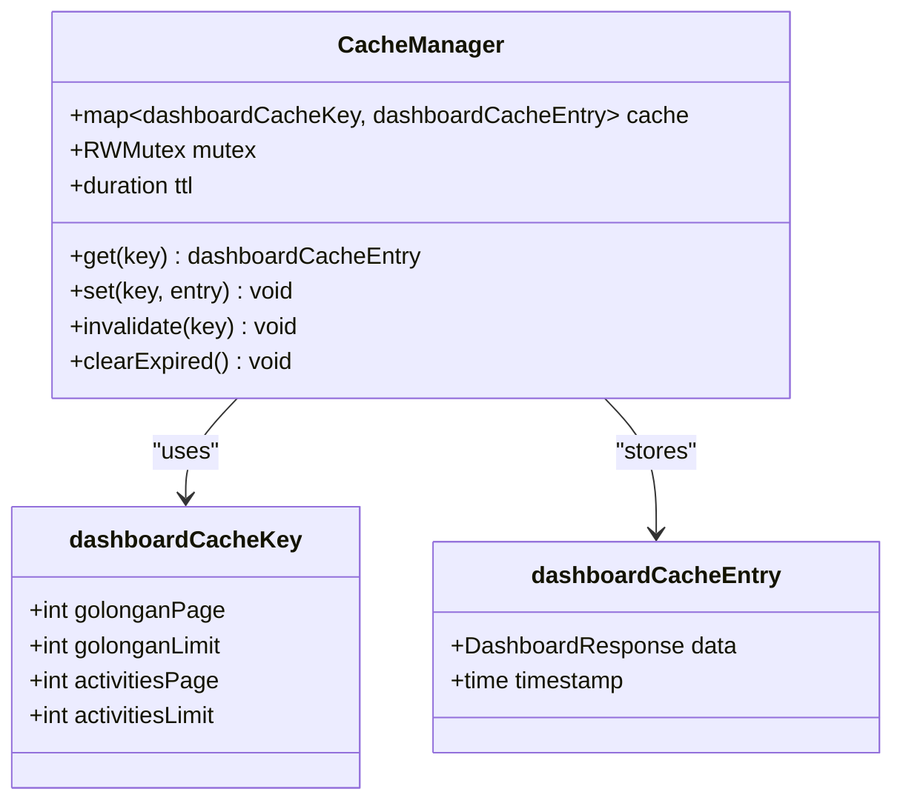
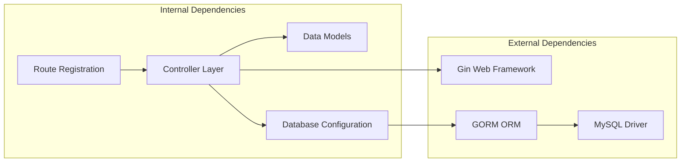
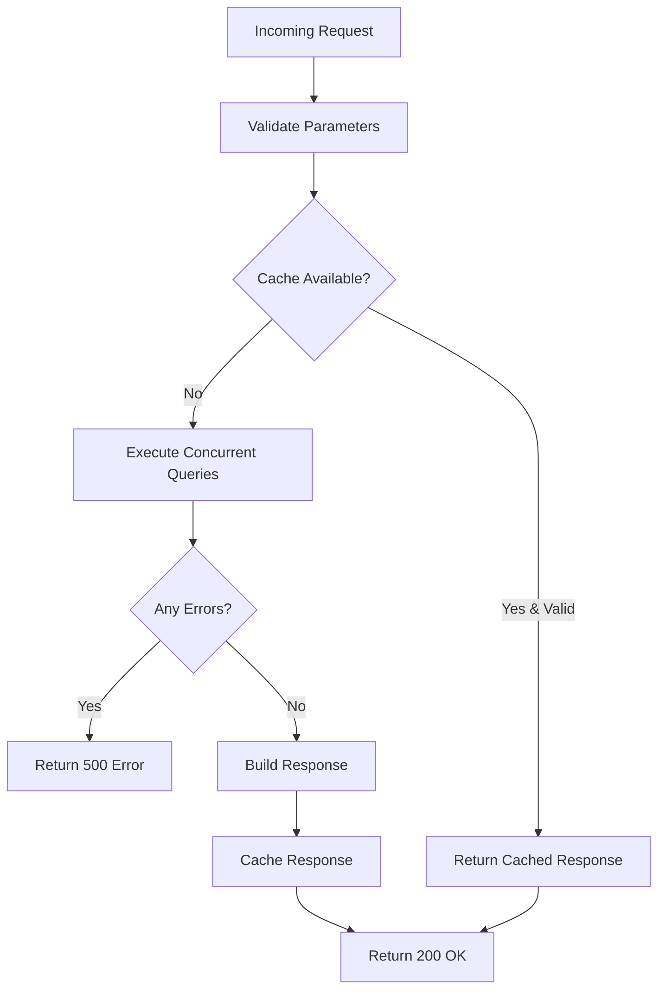

# Dashboard Endpoints

<cite>
**Referenced Files in This Document**
- [dashboard.go](file://backend/controllers/dashboard.go)
- [dashboard.go](file://backend/models/dashboard.go)
- [routes.go](file://backend/routes/routes.go)
- [main.go](file://backend/main.go)
- [database.go](file://backend/config/database.go)
- [Dashboard.tsx](file://frontend/src/components/pages/Dashboard.tsx)
- [api.ts](file://frontend/src/lib/api.ts)
</cite>

## Table of Contents
1. [Introduction](#introduction)
2. [Project Structure](#project-structure)
3. [Core Components](#core-components)
4. [Architecture Overview](#architecture-overview)
5. [Detailed Component Analysis](#detailed-component-analysis)
6. [Dependency Analysis](#dependency-analysis)
7. [Performance Considerations](#performance-considerations)
8. [Troubleshooting Guide](#troubleshooting-guide)
9. [Conclusion](#conclusion)
10. [Appendices](#appendices)

## Introduction
This document provides comprehensive API documentation for the dashboard analytics endpoint. It covers the GET /api/dashboard endpoint, including request parameters, response schema, data aggregation, caching mechanisms, and client integration patterns. The dashboard endpoint consolidates multiple analytics datasets into a single response for efficient client-side rendering.

## Project Structure
The dashboard endpoint is implemented as part of a Go Gin-based backend service with a React Next.js frontend. The backend exposes the endpoint through route registration, while the frontend consumes the endpoint and renders analytics visualizations.



**Diagram sources**
- [main.go:12-32](file://backend/main.go#L12-L32)
- [routes.go:9-24](file://backend/routes/routes.go#L9-L24)
- [dashboard.go:43-305](file://backend/controllers/dashboard.go#L43-L305)
- [dashboard.go:1-60](file://backend/models/dashboard.go#L1-L60)
- [database.go:13-83](file://backend/config/database.go#L13-L83)
- [Dashboard.tsx:173-214](file://frontend/src/components/pages/Dashboard.tsx#L173-L214)
- [api.ts:15-18](file://frontend/src/lib/api.ts#L15-L18)

**Section sources**
- [main.go:12-32](file://backend/main.go#L12-L32)
- [routes.go:9-24](file://backend/routes/routes.go#L9-L24)

## Core Components
The dashboard endpoint consists of several core components that handle request processing, data aggregation, caching, and response formatting.

### Request Parameters
The endpoint accepts four query parameters for pagination and filtering:

- `golongan_page`: Page number for golongan distribution data (default: 1)
- `golongan_limit`: Items per page for golongan distribution (default: 10)
- `activities_page`: Page number for recent activities (default: 1)
- `activities_limit`: Items per page for recent activities (default: 10)

All parameters accept integer values with validation ensuring minimum value of 1.

### Response Schema
The endpoint returns a structured JSON response containing five primary data segments plus pagination metadata:



**Diagram sources**
- [dashboard.go:52-59](file://backend/models/dashboard.go#L52-L59)
- [dashboard.go:3-10](file://backend/models/dashboard.go#L3-L10)
- [dashboard.go:12-21](file://backend/models/dashboard.go#L12-L21)
- [dashboard.go:23-27](file://backend/models/dashboard.go#L23-L27)
- [dashboard.go:29-38](file://backend/models/dashboard.go#L29-L38)
- [dashboard.go:47-50](file://backend/models/dashboard.go#L47-L50)

**Section sources**
- [dashboard.go:43-47](file://backend/controllers/dashboard.go#L43-L47)
- [dashboard.go:276-296](file://backend/controllers/dashboard.go#L276-L296)
- [dashboard.go:52-59](file://backend/models/dashboard.go#L52-L59)

## Architecture Overview
The dashboard endpoint follows a concurrent data fetching pattern with centralized caching to optimize performance and reduce database load.



**Diagram sources**
- [dashboard.go:56-63](file://backend/controllers/dashboard.go#L56-L63)
- [dashboard.go:77-92](file://backend/controllers/dashboard.go#L77-L92)
- [dashboard.go:95-109](file://backend/controllers/dashboard.go#L95-L109)
- [dashboard.go:112-134](file://backend/controllers/dashboard.go#L112-L134)
- [dashboard.go:137-173](file://backend/controllers/dashboard.go#L137-L173)
- [dashboard.go:176-187](file://backend/controllers/dashboard.go#L176-L187)
- [dashboard.go:190-205](file://backend/controllers/dashboard.go#L190-L205)
- [dashboard.go:208-264](file://backend/controllers/dashboard.go#L208-L264)
- [dashboard.go:298-301](file://backend/controllers/dashboard.go#L298-L301)

## Detailed Component Analysis

### Request Parameter Processing
The controller validates and processes all incoming query parameters with robust error handling and defaults.



**Diagram sources**
- [dashboard.go:32-41](file://backend/controllers/dashboard.go#L32-L41)
- [dashboard.go:44-47](file://backend/controllers/dashboard.go#L44-L47)

**Section sources**
- [dashboard.go:32-41](file://backend/controllers/dashboard.go#L32-L41)
- [dashboard.go:44-47](file://backend/controllers/dashboard.go#L44-L47)

### Concurrent Data Fetching Strategy
The endpoint employs Go routines to execute six independent database queries concurrently, maximizing throughput and minimizing response latency.

#### Summary Metrics Query
Retrieves core inventory statistics including total items, total stock, inventory value, and low stock count thresholds.

#### Expiration Monitoring Query
Aggregates expiring and expired medication counts using date-based calculations with null-safe filtering.

#### Category Distribution Query
Provides paginated distribution data by medication categories with total stock aggregation and ordering by stock value.

#### Location Stock Query
Returns warehouse location stock summaries with descending order by total stock.

#### Stock Movement Trends Query
Fetches monthly stock movement data for the last three months with separate inflow and outflow aggregations.

#### Recent Activities Query
Retrieves today's transaction activities with pagination support and comprehensive item details.

**Section sources**
- [dashboard.go:95-109](file://backend/controllers/dashboard.go#L95-L109)
- [dashboard.go:112-134](file://backend/controllers/dashboard.go#L112-L134)
- [dashboard.go:137-173](file://backend/controllers/dashboard.go#L137-L173)
- [dashboard.go:176-187](file://backend/controllers/dashboard.go#L176-L187)
- [dashboard.go:190-205](file://backend/controllers/dashboard.go#L190-L205)
- [dashboard.go:208-264](file://backend/controllers/dashboard.go#L208-L264)

### Caching Mechanism
The endpoint implements an in-memory cache with time-based expiration to reduce database load and improve response times.



**Diagram sources**
- [dashboard.go:15-30](file://backend/controllers/dashboard.go#L15-L30)

**Section sources**
- [dashboard.go:13](file://backend/controllers/dashboard.go#L13)
- [dashboard.go:15-30](file://backend/controllers/dashboard.go#L15-L30)
- [dashboard.go:56-63](file://backend/controllers/dashboard.go#L56-L63)
- [dashboard.go:298-301](file://backend/controllers/dashboard.go#L298-L301)

### Response Formatting and Pagination
The controller constructs a comprehensive response object with pagination metadata for both category distribution and recent activities.

**Section sources**
- [dashboard.go:276-296](file://backend/controllers/dashboard.go#L276-L296)

## Dependency Analysis
The dashboard endpoint has well-defined dependencies across the application stack, with clear separation of concerns between data access, business logic, and presentation.



**Diagram sources**
- [routes.go:3-7](file://backend/routes/routes.go#L3-L7)
- [dashboard.go:3-11](file://backend/controllers/dashboard.go#L3-L11)
- [database.go:3-9](file://backend/config/database.go#L3-L9)

**Section sources**
- [routes.go:3-7](file://backend/routes/routes.go#L3-L7)
- [dashboard.go:3-11](file://backend/controllers/dashboard.go#L3-L11)
- [database.go:3-9](file://backend/config/database.go#L3-L9)

## Performance Considerations
The dashboard endpoint is designed with several performance optimizations to handle concurrent requests efficiently.

### Database Indexing Strategy
The backend ensures optimal query performance through strategic database indexing:

- `riwayat_barang_medis`: Composite index for dashboard recent activities
- `gudangbarang`: Composite index for location-based stock queries  
- `databarang`: Individual indexes for expiration tracking and category filtering

### Concurrency Pattern
The endpoint utilizes goroutines for parallel database queries, reducing overall response time from multiple sequential queries to a single concurrent operation.

### Caching Strategy
- **TTL**: 30-second cache expiration
- **Cache Key**: Combination of pagination parameters
- **Memory Storage**: In-process memory cache
- **Thread Safety**: RWMutex protection for concurrent access

### Response Optimization
- Single JSON response containing all analytics data
- Paginated results for large datasets
- Efficient data structures with minimal serialization overhead

**Section sources**
- [database.go:50-78](file://backend/config/database.go#L50-L78)
- [dashboard.go:13](file://backend/controllers/dashboard.go#L13)
- [dashboard.go:77-92](file://backend/controllers/dashboard.go#L77-L92)

## Troubleshooting Guide

### Common Error Scenarios

#### Database Connection Issues
- **Symptoms**: HTTP 500 errors with database connectivity messages
- **Causes**: MySQL server unavailability, incorrect credentials
- **Resolution**: Verify database connection configuration and network connectivity

#### Query Execution Failures
- **Symptoms**: Partial data responses or missing analytics segments
- **Causes**: SQL syntax errors, missing database indexes, permission issues
- **Resolution**: Check database logs, verify table existence and permissions

#### Cache-related Issues
- **Symptoms**: Stale data persistence beyond TTL
- **Causes**: Cache key parameter variations, memory pressure
- **Resolution**: Monitor cache hit rates, adjust TTL if necessary

#### Frontend Integration Issues
- **Symptoms**: Dashboard not loading, empty charts
- **Causes**: Incorrect API endpoint configuration, CORS issues
- **Resolution**: Verify API base URL configuration, check browser console for errors

### Error Handling Patterns
The backend implements structured error handling with specific response formats:



**Diagram sources**
- [dashboard.go:268-271](file://backend/controllers/dashboard.go#L268-L271)
- [dashboard.go:302-304](file://backend/controllers/dashboard.go#L302-L304)

**Section sources**
- [dashboard.go:268-271](file://backend/controllers/dashboard.go#L268-L271)
- [dashboard.go:302-304](file://backend/controllers/dashboard.go#L302-L304)

## Conclusion
The dashboard analytics endpoint provides a comprehensive solution for inventory monitoring with efficient data aggregation, intelligent caching, and responsive client integration. The implementation balances performance optimization with maintainable code structure, making it suitable for production environments requiring real-time inventory insights.

## Appendices

### API Endpoint Specification

**Endpoint**: `GET /api/dashboard`

**Query Parameters**:
- `golongan_page` (optional): Integer, default: 1
- `golongan_limit` (optional): Integer, default: 10  
- `activities_page` (optional): Integer, default: 1
- `activities_limit` (optional): Integer, default: 10

**Response Format**: JSON object containing:
- `data.summary`: DashboardSummary object
- `data.golongan_distribution`: Array of DashboardDistribution
- `data.location_stock`: Array of DashboardLocation  
- `data.stock_movement`: Array of DashboardStockMovement
- `data.recent_activities`: Array of DashboardRecentActivity
- `data.pagination`: DashboardPaginationMeta object

**Caching**: 30-second TTL with parameter-aware cache keys

### Client Integration Examples

#### JavaScript Fetch Implementation
```javascript
// Basic usage
const params = new URLSearchParams({
  golongan_page: '1',
  golongan_limit: '10',
  activities_page: '1', 
  activities_limit: '10'
});

const response = await fetch(`/api/dashboard?${params.toString()}`);
const data = await response.json();
```

#### React Hook Pattern
```typescript
const [dashboardData, setDashboardData] = useState<DashboardResponse | null>(null);

useEffect(() => {
  const fetchDashboard = async () => {
    const params = new URLSearchParams({
      golongan_page: String(page),
      golongan_limit: '10',
      activities_page: '1',
      activities_limit: '10'
    });
    
    const response = await fetch(`/api/dashboard?${params.toString()}`);
    const result = await response.json();
    setDashboardData(result.data);
  };
  
  fetchDashboard();
}, [page]);
```

**Section sources**
- [Dashboard.tsx:173-214](file://frontend/src/components/pages/Dashboard.tsx#L173-L214)
- [api.ts:15-18](file://frontend/src/lib/api.ts#L15-L18)