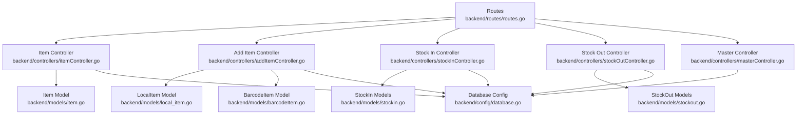
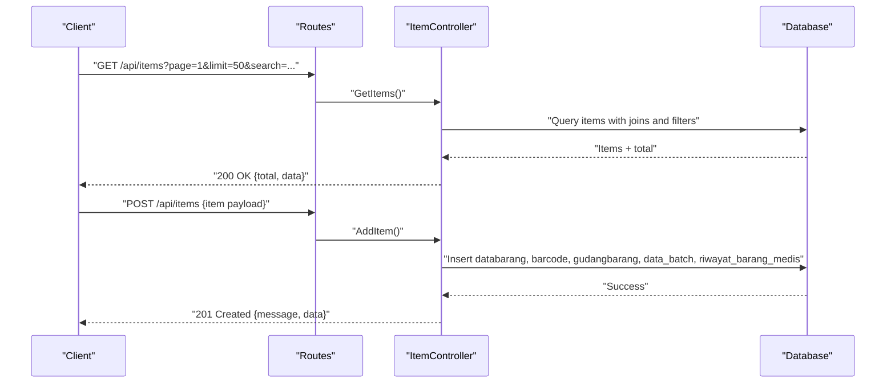
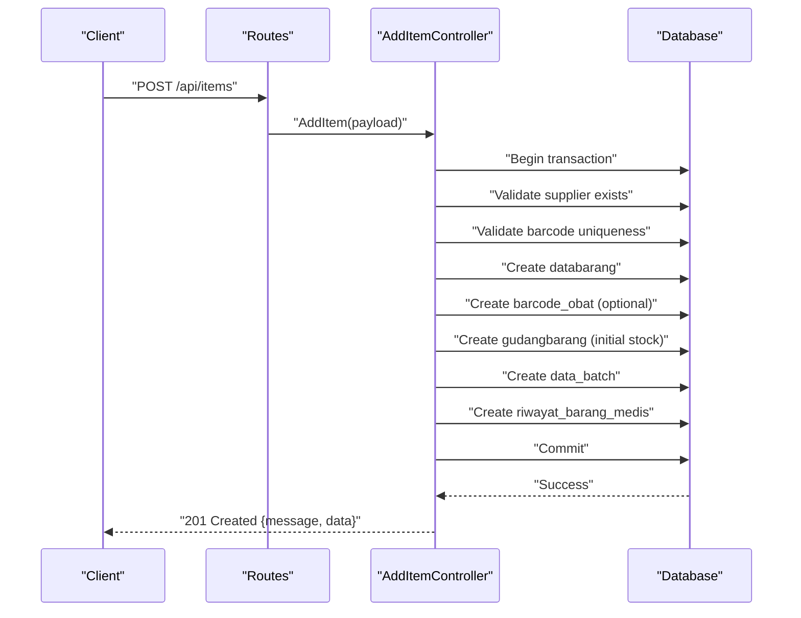
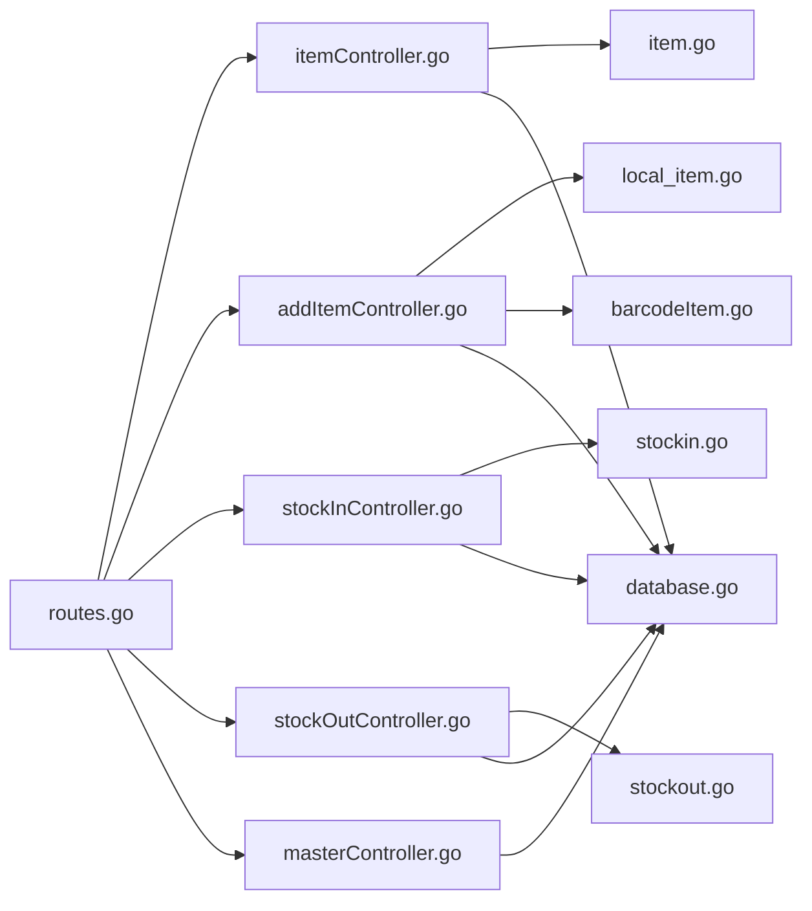

# Inventory Management Endpoints

<cite>
**Referenced Files in This Document**
- [routes.go](file://backend/routes/routes.go)
- [itemController.go](file://backend/controllers/itemController.go)
- [addItemController.go](file://backend/controllers/addItemController.go)
- [stockInController.go](file://backend/controllers/stockInController.go)
- [stockOutController.go](file://backend/controllers/stockOutController.go)
- [masterController.go](file://backend/controllers/masterController.go)
- [item.go](file://backend/models/item.go)
- [local_item.go](file://backend/models/local_item.go)
- [barcodeItem.go](file://backend/models/barcodeItem.go)
- [stockin.go](file://backend/models/stockin.go)
- [stockout.go](file://backend/models/stockout.go)
- [database.go](file://backend/config/database.go)
- [expireFilters.go](file://backend/controllers/expireFilters.go)
</cite>

## Table of Contents
1. [Introduction](#introduction)
2. [Project Structure](#project-structure)
3. [Core Components](#core-components)
4. [Architecture Overview](#architecture-overview)
5. [Detailed Component Analysis](#detailed-component-analysis)
6. [Dependency Analysis](#dependency-analysis)
7. [Performance Considerations](#performance-considerations)
8. [Troubleshooting Guide](#troubleshooting-guide)
9. [Conclusion](#conclusion)
10. [Appendices](#appendices)

## Introduction
This document provides comprehensive API documentation for inventory management endpoints focused on item CRUD operations. It covers:
- Listing items with pagination and filtering
- Adding new items with batch and barcode integration
- Retrieving specific items by kode barang
- Updating items and managing barcode associations
- Deleting items and cascading cleanup
- Supporting inventory tracking, stock level management, and item categorization APIs

The documentation includes request/response schemas, validation rules, error responses, and practical examples for item search, batch operations, and barcode integration patterns.

## Project Structure
The backend follows a layered architecture:
- Routes define endpoint mappings
- Controllers implement business logic and orchestrate database operations
- Models represent domain entities and database schemas
- Config manages database connections and indices

**Diagram sources**
- [routes.go:9-35](file://backend/routes/routes.go#L9-L35)
- [itemController.go:22-283](file://backend/controllers/itemController.go#L22-L283)
- [addItemController.go:27-217](file://backend/controllers/addItemController.go#L27-L217)
- [stockInController.go:13-382](file://backend/controllers/stockInController.go#L13-L382)
- [stockOutController.go:13-348](file://backend/controllers/stockOutController.go#L13-L348)
- [masterController.go:51-205](file://backend/controllers/masterController.go#L51-L205)
- [item.go:3-32](file://backend/models/item.go#L3-L32)
- [local_item.go:5-33](file://backend/models/local_item.go#L5-L33)
- [barcodeItem.go:3-12](file://backend/models/barcodeItem.go#L3-L12)
- [stockin.go:3-56](file://backend/models/stockin.go#L3-L56)
- [stockout.go:3-59](file://backend/models/stockout.go#L3-L59)
- [database.go:13-89](file://backend/config/database.go#L13-L89)

**Section sources**
- [routes.go:9-35](file://backend/routes/routes.go#L9-L35)
- [database.go:13-89](file://backend/config/database.go#L13-L89)

## Core Components
- Routes: Expose endpoints for items, masters, suppliers, and stock operations
- Item Controller: Handles listing, retrieval, updates, and deletions
- Add Item Controller: Manages creation with barcode, batch, and warehouse records
- Stock Controllers: Support stock-in/out operations with batch selection and history
- Master Controller: Provides item categorization data (units, categories, types, suppliers)
- Models: Define JSON and GORM mappings for items, barcodes, and stock operations

Key endpoints:
- GET /api/items
- POST /api/items
- GET /api/items/:kodeBrng
- PUT /api/items/:kodeBrng
- DELETE /api/items/:kodeBrng
- GET /api/masters
- POST /api/masters/:type
- PUT /api/masters/:type/:code
- DELETE /api/masters/:type/:code
- GET /api/stock-in/items
- POST /api/stock-in
- GET /api/stock-out/items
- GET /api/stock-out/batches
- POST /api/stock-out

**Section sources**
- [routes.go:9-35](file://backend/routes/routes.go#L9-L35)
- [itemController.go:22-283](file://backend/controllers/itemController.go#L22-L283)
- [addItemController.go:27-217](file://backend/controllers/addItemController.go#L27-L217)
- [stockInController.go:13-382](file://backend/controllers/stockInController.go#L13-L382)
- [stockOutController.go:13-348](file://backend/controllers/stockOutController.go#L13-L348)
- [masterController.go:51-205](file://backend/controllers/masterController.go#L51-L205)

## Architecture Overview
The system integrates route handlers with database operations and maintains referential integrity across items, batches, warehouse stock, and activity logs.

**Diagram sources**
- [routes.go:10-11](file://backend/routes/routes.go#L10-L11)
- [itemController.go:98-215](file://backend/controllers/itemController.go#L98-L215)
- [addItemController.go:27-217](file://backend/controllers/addItemController.go#L27-L217)

## Detailed Component Analysis

### GET /api/items
Purpose: List items with optional search and pagination.

- Query parameters:
  - search: Text search across name, kode barang, barcode, batch number, and invoice number
  - page: Page number (default 1)
  - limit: Items per page (1–100)
- Response:
  - total: Total matching records
  - data: Array of items with computed fields (stock, supplier, unit, category, group, barcode, batch info, expiry dates)

Validation and behavior:
- Uses INNER JOIN with aggregated warehouse stock grouped by kode barang, batch, and invoice
- Filters support multiple fields with LIKE queries
- Orders by kode barang, purchase date, and batch

Example request:
- GET /api/items?search=paracetamol&page=1&limit=20

Response schema (selected fields):
- total: integer
- data[].kode_brng: string
- data[].nama_brng: string
- data[].stok: number
- data[].supplier: string
- data[].satuan: string
- data[].kategori: string
- data[].golongan: string
- data[].barcode: string
- data[].no_batch: string
- data[].no_faktur: string
- data[].tgl_beli: string
- data[].tgl_kadaluarsa: string
- data[].expire: string

Error responses:
- 500: Database query errors

**Section sources**
- [itemController.go:98-215](file://backend/controllers/itemController.go#L98-L215)

### POST /api/items
Purpose: Add a new item with initial stock, barcode, and batch record.

Request body (LocalItem subset):
- Required fields: nama_barang, supplier, satuan, golongan, jenis, no_batch, no_faktur, tanggal_pembelian, stok
- Optional fields: expired, barcode, harga_beli, harga_umum, harga_utama, harga_beli_luar

Validation rules:
- All required fields must be present
- Supplier must exist in industrifarmasi
- Barcode uniqueness enforced if provided
- Transactional creation across databarang, barcode_obat, gudangbarang, data_batch, riwayat_barang_medis

Response:
- 201 Created with message and created item data

Example request:
- POST /api/items
  - Body: { nama_barang, supplier, satuan, golongan, jenis, no_batch, no_faktur, tanggal_pembelian, stok, expired?, barcode?, harga_beli?, harga_umum?, harga_utama?, harga_beli_luar? }

Success response:
- message: string
- data: LocalItem

Error responses:
- 400: Validation failures (missing fields, invalid supplier, duplicate barcode)
- 500: Transaction or insert errors

**Diagram sources**
- [routes.go:11](file://backend/routes/routes.go#L11)
- [addItemController.go:27-217](file://backend/controllers/addItemController.go#L27-L217)

**Section sources**
- [addItemController.go:27-217](file://backend/controllers/addItemController.go#L27-L217)
- [local_item.go:5-29](file://backend/models/local_item.go#L5-L29)

### GET /api/items/:kodeBrng
Purpose: Retrieve a specific item by kode barang with enriched details.

Behavior:
- Joins multiple lookup tables for supplier, unit, type, category, group, and latest batch info
- Returns item with computed stock, barcode, and expiry fields

Response:
- 200 OK with data: Item

Error responses:
- 404: Item not found

Example request:
- GET /api/items/B000000001

Response schema (selected fields):
- data.kode_brng: string
- data.nama_brng: string
- data.stokminimal: number
- data.expire: string
- data.h_beli: number
- data.ralan: number
- data.utama: number
- data.beliluar: number
- data.kode_sat: string
- data.kode_golongan: string
- data.kdjns: string
- data.kode_industri: string
- data.stok: number
- data.supplier: string
- data.satuan: string
- data.jenis: string
- data.kategori: string
- data.golongan: string
- data.barcode: string
- data.no_batch: string
- data.no_faktur: string
- data.tgl_beli: string
- data.tgl_kadaluarsa: string

**Section sources**
- [itemController.go:22-96](file://backend/controllers/itemController.go#L22-L96)
- [item.go:3-28](file://backend/models/item.go#L3-L28)

### PUT /api/items/:kodeBrng
Purpose: Update item attributes and optionally update barcode.

Behavior:
- Updates databarang with pricing tiers and metadata
- Upserts barcode_obat if barcode is provided

Validation:
- Request body is bound to LocalItem; validation errors return 400

Response:
- 200 OK with message

Error responses:
- 400: Binding/validation errors
- 500: Database update errors

Example request:
- PUT /api/items/B000000001
  - Body: { nama_barang, harga_beli, harga_umum, harga_utama, harga_beli_luar, expired, satuan, golongan, jenis, supplier, barcode? }

**Section sources**
- [itemController.go:217-267](file://backend/controllers/itemController.go#L217-L267)

### DELETE /api/items/:kodeBrng
Purpose: Remove an item and associated records.

Behavior:
- Deletes barcode_obat, gudangbarang, data_batch entries for kode barang
- Deletes the item from databarang

Response:
- 200 OK with message

Error responses:
- 500: Deletion errors

**Section sources**
- [itemController.go:269-283](file://backend/controllers/itemController.go#L269-L283)

### Item Search Functionality
- GET /api/items supports search across name, kode barang, barcode, batch number, and invoice number
- GET /api/stock-in/items and GET /api/stock-out/items provide searchable lists for stock operations

Example requests:
- GET /api/stock-in/items?search=paracetamol
- GET /api/stock-out/items?search=B000000001

**Section sources**
- [itemController.go:202-210](file://backend/controllers/itemController.go#L202-L210)
- [stockInController.go:13-50](file://backend/controllers/stockInController.go#L13-L50)
- [stockOutController.go:13-63](file://backend/controllers/stockOutController.go#L13-L63)

### Batch Operations
- GET /api/stock-out/batches retrieves selectable batches for an item ordered by expiry and purchase date
- POST /api/stock-in adds incoming stock with batch and invoice tracking
- POST /api/stock-out removes stock from a selected batch

Validation and behavior:
- Stock-in ensures sufficient stock exists and updates gudangbarang and data_batch accordingly
- Stock-out validates stock availability and updates batch quantities

Example requests:
- GET /api/stock-out/batches?kode_brng=B000000001
- POST /api/stock-in
  - Body: { kode_brng, qty, no_batch, no_faktur, tanggal_pembelian, expired?, price? }
- POST /api/stock-out
  - Body: { kode_brng, qty, no_batch, no_faktur, destination, note? }

**Section sources**
- [stockOutController.go:65-103](file://backend/controllers/stockOutController.go#L65-L103)
- [stockInController.go:235-382](file://backend/controllers/stockInController.go#L235-L382)
- [stockOutController.go:189-281](file://backend/controllers/stockOutController.go#L189-L281)

### Barcode Integration Patterns
- Creation: Barcode stored in barcode_obat linked to kode barang
- Lookup: Barcode joined during item listing and stock operations
- Update: PUT /api/items/:kodeBrng updates barcode if provided

Constraints:
- Barcode is unique in barcode_obat

**Section sources**
- [addItemController.go:124-130](file://backend/controllers/addItemController.go#L124-L130)
- [itemController.go:255-264](file://backend/controllers/itemController.go#L255-L264)
- [barcodeItem.go:3-12](file://backend/models/barcodeItem.go#L3-L12)

### Inventory Tracking and Stock Level Management
- Warehouse stock aggregation per kode barang, batch, and invoice
- Activity log maintained in riwayat_barang_medis for stock movements
- Expiry filtering constants ensure valid expiry ranges

Key models:
- gudangbarang: warehouse stock per batch/invoice
- data_batch: purchase and expiry tracking
- riwayat_barang_medis: movement history

**Section sources**
- [stockInController.go:13-50](file://backend/controllers/stockInController.go#L13-L50)
- [stockOutController.go:13-63](file://backend/controllers/stockOutController.go#L13-L63)
- [expireFilters.go:3-10](file://backend/controllers/expireFilters.go#L3-L10)

### Item Categorization APIs
- GET /api/masters returns units, types, groups, and suppliers
- POST /api/masters/:type creates new master entries
- PUT /api/masters/:type/:code updates existing entries
- DELETE /api/masters/:type/:code removes entries

Supported types: golongan, jenis, satuan

**Section sources**
- [masterController.go:51-205](file://backend/controllers/masterController.go#L51-L205)

## Dependency Analysis
- Routes depend on controllers for endpoint handling
- Controllers depend on models and database configuration
- Database configuration sets up indices for performance and auto-migrates barcode table

**Diagram sources**
- [routes.go:9-35](file://backend/routes/routes.go#L9-L35)
- [itemController.go:22-283](file://backend/controllers/itemController.go#L22-L283)
- [addItemController.go:27-217](file://backend/controllers/addItemController.go#L27-L217)
- [stockInController.go:13-382](file://backend/controllers/stockInController.go#L13-L382)
- [stockOutController.go:13-348](file://backend/controllers/stockOutController.go#L13-L348)
- [masterController.go:51-205](file://backend/controllers/masterController.go#L51-L205)
- [item.go:3-32](file://backend/models/item.go#L3-L32)
- [local_item.go:5-33](file://backend/models/local_item.go#L5-L33)
- [barcodeItem.go:3-12](file://backend/models/barcodeItem.go#L3-L12)
- [stockin.go:3-56](file://backend/models/stockin.go#L3-L56)
- [stockout.go:3-59](file://backend/models/stockout.go#L3-L59)
- [database.go:13-89](file://backend/config/database.go#L13-L89)

**Section sources**
- [routes.go:9-35](file://backend/routes/routes.go#L9-L35)
- [database.go:13-89](file://backend/config/database.go#L13-L89)

## Performance Considerations
- Indexed lookups:
  - riwayat_barang_medis: dashboard recent, stock-in summary, stock-out summary
  - gudangbarang: bangsal and kode barang composite index
  - databarang: expiry and kode_golongan indexes
- Aggregated queries:
  - Item listing groups warehouse stock by kode barang, batch, and invoice to reduce joins
  - Stock history summaries pre-aggregate per item to minimize I/O
- Pagination:
  - Stock history endpoints support page and limit parameters with safe bounds

Recommendations:
- Use search filters to narrow result sets
- Prefer batch-aware endpoints for accurate stock allocation
- Monitor index usage and adjust as data grows

**Section sources**
- [database.go:50-84](file://backend/config/database.go#L50-L84)
- [stockInController.go:177-233](file://backend/controllers/stockInController.go#L177-L233)
- [stockOutController.go:283-348](file://backend/controllers/stockOutController.go#L283-L348)

## Troubleshooting Guide
Common issues and resolutions:
- Item not found:
  - Verify kode barang spelling and existence
  - Check barcode uniqueness if searching by barcode
- Validation errors (400):
  - Ensure required fields are present for POST /api/items and POST /api/stock-in
  - Confirm supplier code exists in master data
- Insufficient stock (400):
  - Use GET /api/stock-out/batches to select a valid batch
  - Re-check warehouse stock aggregation
- Transaction failures (500):
  - Review database connectivity and permissions
  - Check index creation and migration status

**Section sources**
- [addItemController.go:35-85](file://backend/controllers/addItemController.go#L35-L85)
- [stockOutController.go:209-213](file://backend/controllers/stockOutController.go#L209-L213)
- [database.go:37-48](file://backend/config/database.go#L37-L48)

## Conclusion
The inventory management endpoints provide a robust foundation for item lifecycle operations, integrated with batch tracking, barcode support, and categorized data. By leveraging search, pagination, and batch-aware stock operations, the system supports efficient inventory tracking and reporting.

## Appendices

### Request/Response Schemas

- GET /api/items
  - Query: search (string), page (integer), limit (integer)
  - Response: { total: number, data: Item[] }

- POST /api/items
  - Body: LocalItem (subset)
  - Response: { message: string, data: LocalItem }

- GET /api/items/:kodeBrng
  - Response: { data: Item }

- PUT /api/items/:kodeBrng
  - Body: LocalItem (subset)
  - Response: { message: string }

- DELETE /api/items/:kodeBrng
  - Response: { message: string }

- GET /api/stock-in/items
  - Query: search (string)
  - Response: { data: StockInItem[] }

- POST /api/stock-in
  - Body: StockInPayload
  - Response: { message: string, data: { kode_brng, stok_awal, stok_akhir } }

- GET /api/stock-out/items
  - Query: search (string)
  - Response: { data: StockOutItem[] }

- GET /api/stock-out/batches
  - Query: kode_brng (string)
  - Response: { data: StockOutBatchOption[] }

- POST /api/stock-out
  - Body: StockOutPayload
  - Response: { message: string, data: { kode_brng, stok_awal, stok_akhir, no_batch, no_faktur } }

- GET /api/masters
  - Response: { golongan: [], jenis: [], satuan: [], suppliers: [] }

- POST /api/masters/:type
  - Body: { code: string, name: string }
  - Response: { message: string }

- PUT /api/masters/:type/:code
  - Body: { name: string }
  - Response: { message: string }

- DELETE /api/masters/:type/:code
  - Response: { message: string }

**Section sources**
- [itemController.go:98-215](file://backend/controllers/itemController.go#L98-L215)
- [addItemController.go:27-217](file://backend/controllers/addItemController.go#L27-L217)
- [itemController.go:22-96](file://backend/controllers/itemController.go#L22-L96)
- [itemController.go:217-267](file://backend/controllers/itemController.go#L217-L267)
- [itemController.go:269-283](file://backend/controllers/itemController.go#L269-L283)
- [stockInController.go:13-50](file://backend/controllers/stockInController.go#L13-L50)
- [stockInController.go:235-382](file://backend/controllers/stockInController.go#L235-L382)
- [stockOutController.go:13-63](file://backend/controllers/stockOutController.go#L13-L63)
- [stockOutController.go:65-103](file://backend/controllers/stockOutController.go#L65-L103)
- [stockOutController.go:189-281](file://backend/controllers/stockOutController.go#L189-L281)
- [masterController.go:51-205](file://backend/controllers/masterController.go#L51-L205)
- [item.go:3-28](file://backend/models/item.go#L3-L28)
- [local_item.go:5-29](file://backend/models/local_item.go#L5-L29)
- [stockin.go:3-56](file://backend/models/stockin.go#L3-L56)
- [stockout.go:3-59](file://backend/models/stockout.go#L3-L59)