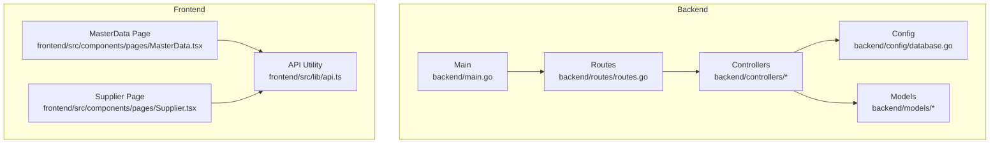
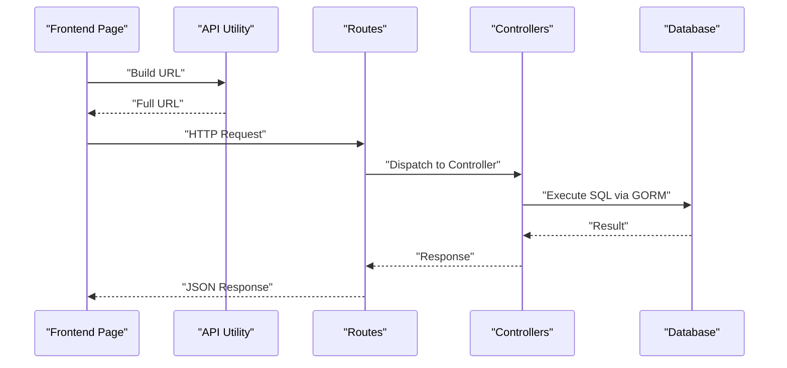
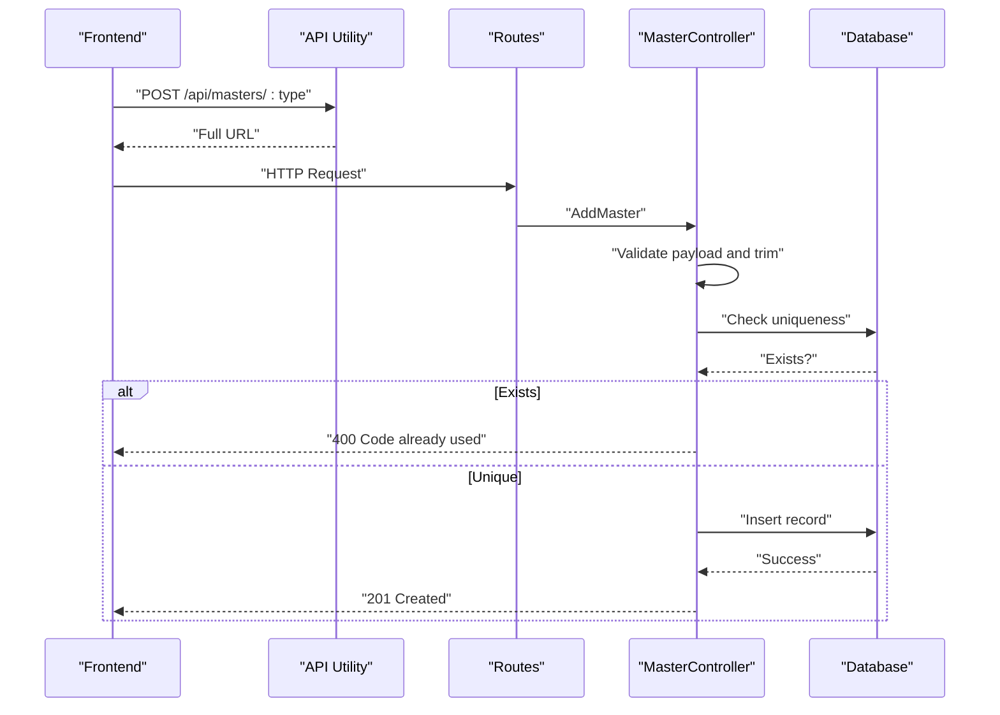
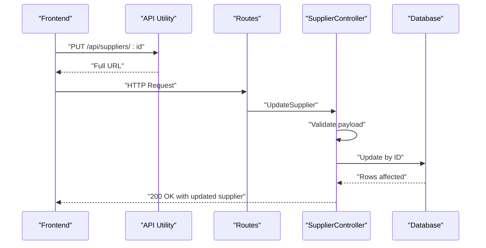
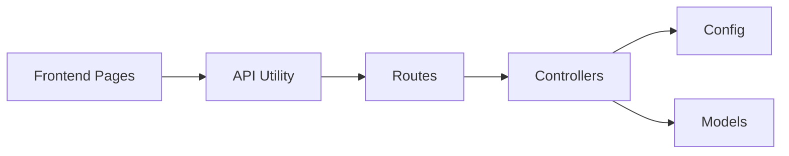

# Master Data Endpoints

<cite>
**Referenced Files in This Document**
- [routes.go](file://backend/routes/routes.go)
- [main.go](file://backend/main.go)
- [database.go](file://backend/config/database.go)
- [masterController.go](file://backend/controllers/masterController.go)
- [supplierController.go](file://backend/controllers/supplierController.go)
- [supplier.go](file://backend/models/supplier.go)
- [item.go](file://backend/models/item.go)
- [MasterData.tsx](file://frontend/src/components/pages/MasterData.tsx)
- [Supplier.tsx](file://frontend/src/components/pages/Supplier.tsx)
- [api.ts](file://frontend/src/lib/api.ts)
</cite>

## Table of Contents
1. [Introduction](#introduction)
2. [Project Structure](#project-structure)
3. [Core Components](#core-components)
4. [Architecture Overview](#architecture-overview)
5. [Detailed Component Analysis](#detailed-component-analysis)
6. [Dependency Analysis](#dependency-analysis)
7. [Performance Considerations](#performance-considerations)
8. [Troubleshooting Guide](#troubleshooting-guide)
9. [Conclusion](#conclusion)
10. [Appendices](#appendices)

## Introduction
This document provides comprehensive API documentation for master data endpoints and supplier management endpoints. It covers:
- Retrieving master data collections via GET /api/masters
- Adding new master records via POST /api/masters/:type
- Updating existing master records via PUT /api/masters/:type/:code
- Removing master records via DELETE /api/masters/:type/:code
- Managing suppliers via GET /api/suppliers, POST /api/suppliers, PUT /api/suppliers/:id, and DELETE /api/suppliers/:id

It also documents request/response schemas, validation rules, and practical integration patterns for lookup tables across the system.

## Project Structure
The backend follows a layered architecture:
- Routes define endpoint mappings
- Controllers implement business logic
- Models represent database entities
- Config manages database connections and migrations

**Diagram sources**
- [routes.go:9-35](file://backend/routes/routes.go#L9-L35)
- [main.go:12-31](file://backend/main.go#L12-L31)
- [database.go:11-89](file://backend/config/database.go#L11-L89)
- [MasterData.tsx:82-118](file://frontend/src/components/pages/MasterData.tsx#L82-L118)
- [Supplier.tsx:33-52](file://frontend/src/components/pages/Supplier.tsx#L33-L52)
- [api.ts:15-18](file://frontend/src/lib/api.ts#L15-L18)

**Section sources**
- [routes.go:9-35](file://backend/routes/routes.go#L9-L35)
- [main.go:12-31](file://backend/main.go#L12-L31)
- [database.go:11-89](file://backend/config/database.go#L11-L89)

## Core Components
- Routes: Define all API endpoints and bind them to controller functions.
- Controllers: Implement CRUD operations for master data and suppliers, including validation and error handling.
- Models: Define entity structures for suppliers and items, including foreign key relationships to master data tables.
- Frontend Pages: Consume the APIs to render and manage master data and suppliers.

Key responsibilities:
- GET /api/masters: Aggregates lookup tables (golongan, jenis, satuan) and suppliers into a single response.
- POST /api/masters/:type: Adds a new record to a specific master table.
- PUT /api/masters/:type/:code: Updates the name of a master record identified by code.
- DELETE /api/masters/:type/:code: Removes a master record by code.
- Supplier endpoints mirror standard CRUD patterns with validation.

**Section sources**
- [routes.go:13-20](file://backend/routes/routes.go#L13-L20)
- [masterController.go:51-95](file://backend/controllers/masterController.go#L51-L95)
- [supplierController.go:10-80](file://backend/controllers/supplierController.go#L10-L80)

## Architecture Overview
The system integrates frontend pages with backend controllers and database tables. The frontend pages call the backend APIs, which interact with the database through GORM.

**Diagram sources**
- [MasterData.tsx:82-118](file://frontend/src/components/pages/MasterData.tsx#L82-L118)
- [Supplier.tsx:33-52](file://frontend/src/components/pages/Supplier.tsx#L33-L52)
- [routes.go:13-20](file://backend/routes/routes.go#L13-L20)
- [masterController.go:51-95](file://backend/controllers/masterController.go#L51-L95)
- [supplierController.go:10-80](file://backend/controllers/supplierController.go#L10-L80)
- [database.go:21-31](file://backend/config/database.go#L21-L31)

## Detailed Component Analysis

### Master Data Endpoints

#### GET /api/masters
- Purpose: Retrieve all master data collections in a single response.
- Response shape:
  - golongan: Array of objects with keys kode and nama
  - jenis: Array of objects with keys kdjns and nama
  - satuan: Array of objects with keys kode_sat and satuan
  - suppliers: Array of supplier objects
- Implementation details:
  - Queries four tables: golongan_barang, jenis, kodesatuan, industrifarmasi
  - Orders satuan and jenis by name; orders golongan by name
  - Returns a single JSON object containing all collections

Validation and behavior:
- No request body required
- Returns 200 OK on success

Integration note:
- Frontend loads this endpoint on page initialization and transforms the response into internal structures.

**Section sources**
- [routes.go:13](file://backend/routes/routes.go#L13)
- [masterController.go:51-95](file://backend/controllers/masterController.go#L51-L95)
- [MasterData.tsx:82-118](file://frontend/src/components/pages/MasterData.tsx#L82-L118)

#### POST /api/masters/:type
- Purpose: Add a new master record to a specific table.
- Path parameters:
  - :type: Allowed values are golongan, jenis, satuan
- Request body:
  - code: String (trimmed)
  - name: String (trimmed)
- Validation rules:
  - Both code and name must be non-empty
  - Code must be unique within the target table
- Responses:
  - 201 Created on successful creation
  - 400 Bad Request on invalid type, binding errors, or empty fields
  - 400 Bad Request when code already exists
  - 500 Internal Server Error on database errors

Implementation highlights:
- Uses a configuration map to resolve table name, code column, and name column based on type
- Trims input values before validation
- Checks uniqueness before insertion

**Section sources**
- [routes.go:14](file://backend/routes/routes.go#L14)
- [masterController.go:97-139](file://backend/controllers/masterController.go#L97-L139)
- [masterController.go:23-49](file://backend/controllers/masterController.go#L23-L49)

#### PUT /api/masters/:type/:code
- Purpose: Update the name of an existing master record.
- Path parameters:
  - :type: Allowed values are golongan, jenis, satuan
  - :code: Record identifier (trimmed)
- Request body:
  - name: String (trimmed)
- Validation rules:
  - name must be non-empty
- Responses:
  - 200 OK on successful update
  - 400 Bad Request on invalid type or binding errors
  - 400 Bad Request when name is empty
  - 404 Not Found when no record matches the code
  - 500 Internal Server Error on database errors

Behavior:
- Trims the code parameter
- Updates only the name field

**Section sources**
- [routes.go:15](file://backend/routes/routes.go#L15)
- [masterController.go:141-178](file://backend/controllers/masterController.go#L141-L178)

#### DELETE /api/masters/:type/:code
- Purpose: Remove a master record by code.
- Path parameters:
  - :type: Allowed values are golongan, jenis, satuan
  - :code: Record identifier (trimmed)
- Responses:
  - 200 OK on successful deletion
  - 400 Bad Request on invalid type
  - 404 Not Found when no record matches the code
  - 500 Internal Server Error on database errors

Behavior:
- Trims the code parameter
- Deletes the record if found

**Section sources**
- [routes.go:16](file://backend/routes/routes.go#L16)
- [masterController.go:180-205](file://backend/controllers/masterController.go#L180-L205)

### Supplier Management Endpoints

#### GET /api/suppliers
- Purpose: Retrieve all suppliers.
- Response shape:
  - data: Array of supplier objects
- Implementation details:
  - Queries the industrifarmasi table
  - Returns a JSON object with a data key

**Section sources**
- [routes.go:17](file://backend/routes/routes.go#L17)
- [supplierController.go:10-21](file://backend/controllers/supplierController.go#L10-L21)

#### POST /api/suppliers
- Purpose: Create a new supplier.
- Request body:
  - Fields correspond to the Supplier model (kode_industri, nama_industri, alamat, kota, no_telp)
- Validation rules:
  - Frontend enforces non-empty nama_industri and kota before sending
- Responses:
  - 201 Created with the created supplier object
  - 400 Bad Request on binding errors

**Section sources**
- [routes.go:18](file://backend/routes/routes.go#L18)
- [supplierController.go:23-41](file://backend/controllers/supplierController.go#L23-L41)
- [Supplier.tsx:82-129](file://frontend/src/components/pages/Supplier.tsx#L82-L129)

#### PUT /api/suppliers/:id
- Purpose: Update an existing supplier by ID.
- Path parameters:
  - :id: Supplier identifier
- Request body:
  - Fields correspond to the Supplier model
- Responses:
  - 200 OK with the updated supplier object
  - 400 Bad Request on binding errors

**Section sources**
- [routes.go:19](file://backend/routes/routes.go#L19)
- [supplierController.go:43-65](file://backend/controllers/supplierController.go#L43-L65)
- [Supplier.tsx:91-129](file://frontend/src/components/pages/Supplier.tsx#L91-L129)

#### DELETE /api/suppliers/:id
- Purpose: Remove a supplier by ID.
- Path parameters:
  - :id: Supplier identifier
- Responses:
  - 200 OK with a simple message
  - 400 Bad Request on binding errors

**Section sources**
- [routes.go:20](file://backend/routes/routes.go#L20)
- [supplierController.go:67-80](file://backend/controllers/supplierController.go#L67-L80)
- [Supplier.tsx:131-143](file://frontend/src/components/pages/Supplier.tsx#L131-L143)

### Data Models and Lookup Table Usage

#### Supplier Model
- Fields:
  - kode_industri: String
  - nama_industri: String
  - alamat: String
  - kota: String
  - no_telp: String

**Section sources**
- [supplier.go:3-14](file://backend/models/supplier.go#L3-L14)

#### Item Model and Lookup Integrations
- Fields relevant to master data:
  - kode_golongan, golongan
  - kdjns, jenis
  - kode_sat, satuan
  - kode_industri, supplier
- These fields indicate foreign key relationships to master tables:
  - golongan_barang (golongan)
  - jenis (jenis)
  - kodesatuan (satuan)
  - industrifarmasi (supplier)

This enables consistent categorization and selection of items using standardized lookup values.

**Section sources**
- [item.go:3-28](file://backend/models/item.go#L3-L28)

### API Workflows

#### Master Data Creation Flow

**Diagram sources**
- [MasterData.tsx:225-257](file://frontend/src/components/pages/MasterData.tsx#L225-L257)
- [routes.go:14](file://backend/routes/routes.go#L14)
- [masterController.go:97-139](file://backend/controllers/masterController.go#L97-L139)

#### Supplier Update Flow

**Diagram sources**
- [Supplier.tsx:91-129](file://frontend/src/components/pages/Supplier.tsx#L91-L129)
- [routes.go:19](file://backend/routes/routes.go#L19)
- [supplierController.go:43-65](file://backend/controllers/supplierController.go#L43-L65)

### Lookup Table Usage Patterns
- Master data types:
  - golongan: Classification group for items
  - jenis: Type or form of items
  - satuan: Unit of usage
- Integration patterns:
  - Items reference master codes (e.g., kode_golongan, kdjns, kode_sat)
  - Suppliers reference kode_industri
  - Frontend pages load master data once and use it for selection and display

**Section sources**
- [masterController.go:23-49](file://backend/controllers/masterController.go#L23-L49)
- [item.go:13-23](file://backend/models/item.go#L13-L23)
- [MasterData.tsx:82-118](file://frontend/src/components/pages/MasterData.tsx#L82-L118)

## Dependency Analysis
- Routes depend on controllers
- Controllers depend on config (database connection) and models
- Frontend pages depend on API utility and route to controllers
- Database connection managed centrally

**Diagram sources**
- [routes.go:9-35](file://backend/routes/routes.go#L9-L35)
- [main.go:12-31](file://backend/main.go#L12-L31)
- [database.go:11-89](file://backend/config/database.go#L11-L89)
- [api.ts:15-18](file://frontend/src/lib/api.ts#L15-L18)

**Section sources**
- [routes.go:9-35](file://backend/routes/routes.go#L9-L35)
- [main.go:12-31](file://backend/main.go#L12-L31)
- [database.go:11-89](file://backend/config/database.go#L11-L89)

## Performance Considerations
- Indexes: Database configuration ensures indexes on frequently queried columns to improve lookup performance.
- Single aggregation: GET /api/masters consolidates multiple queries into one response, reducing round trips.
- Frontend caching: Frontend pages cache master data locally after initial load to minimize repeated requests.

[No sources needed since this section provides general guidance]

## Troubleshooting Guide
Common issues and resolutions:
- 400 Bad Request on master creation:
  - Ensure code and name are provided and non-empty
  - Verify the code is unique within the target table
- 404 Not Found on update/delete:
  - Confirm the code exists in the target table
- 500 Internal Server Error:
  - Check database connectivity and table permissions
  - Review server logs for detailed error messages

**Section sources**
- [masterController.go:105-115](file://backend/controllers/masterController.go#L105-L115)
- [masterController.go:123-126](file://backend/controllers/masterController.go#L123-L126)
- [masterController.go:151-160](file://backend/controllers/masterController.go#L151-L160)
- [masterController.go:172-175](file://backend/controllers/masterController.go#L172-L175)
- [database.go:21-31](file://backend/config/database.go#L21-L31)

## Conclusion
The master data and supplier endpoints provide a robust foundation for managing reference data and supplier information. They support consistent lookup table usage across the system, integrate seamlessly with item models, and offer straightforward CRUD operations with clear validation and error handling.

[No sources needed since this section summarizes without analyzing specific files]

## Appendices

### Endpoint Reference Summary
- GET /api/masters
  - Response: Collections of golongan, jenis, satuan, and suppliers
- POST /api/masters/:type
  - Path params: :type in {golongan, jenis, satuan}
  - Body: { code, name }
  - Responses: 201, 400, 400 (duplicate), 500
- PUT /api/masters/:type/:code
  - Body: { name }
  - Responses: 200, 400, 404, 500
- DELETE /api/masters/:type/:code
  - Responses: 200, 400, 404, 500
- GET /api/suppliers
  - Response: { data: [Supplier] }
- POST /api/suppliers
  - Body: Supplier fields
  - Responses: 201, 400
- PUT /api/suppliers/:id
  - Body: Supplier fields
  - Responses: 200, 400
- DELETE /api/suppliers/:id
  - Responses: 200, 400

**Section sources**
- [routes.go:13-20](file://backend/routes/routes.go#L13-L20)
- [masterController.go:51-95](file://backend/controllers/masterController.go#L51-L95)
- [supplierController.go:10-80](file://backend/controllers/supplierController.go#L10-L80)