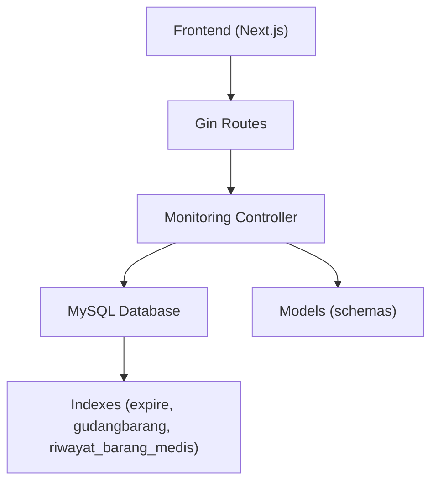
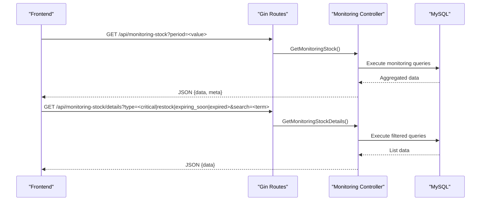
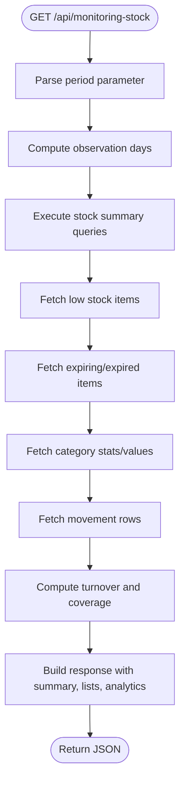
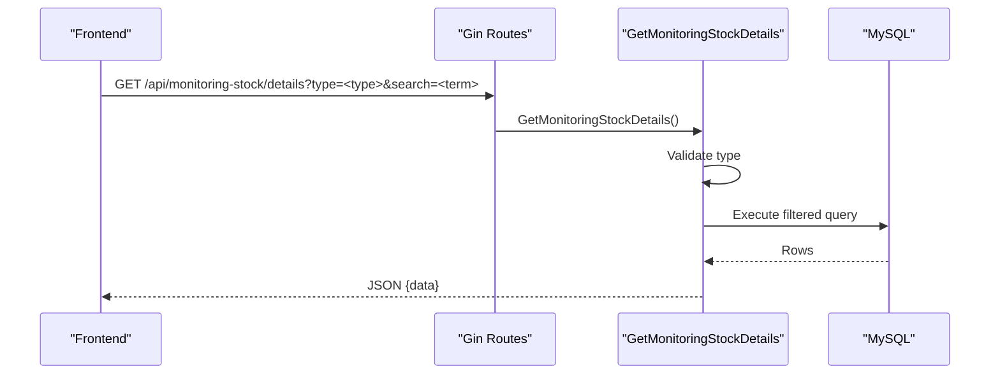
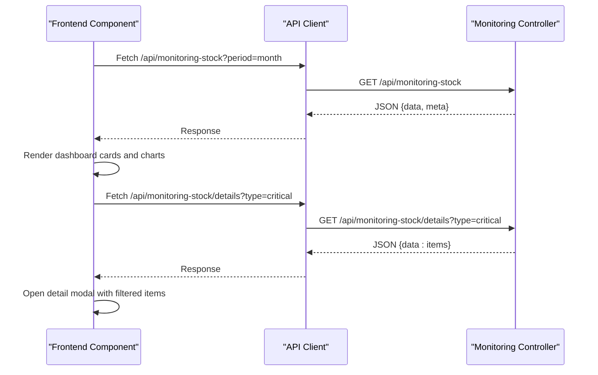
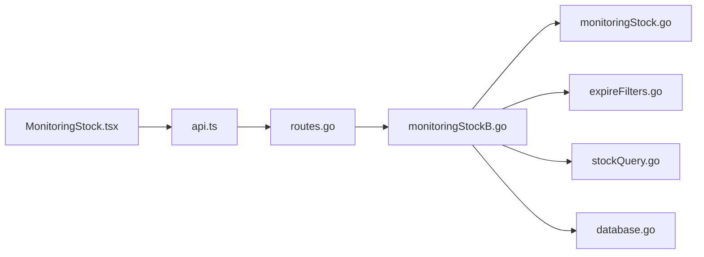

# Monitoring & Reporting Endpoints

<cite>
**Referenced Files in This Document**
- [routes.go](file://backend/routes/routes.go)
- [monitoringStockB.go](file://backend/controllers/monitoringStockB.go)
- [expireFilters.go](file://backend/controllers/expireFilters.go)
- [stockQuery.go](file://backend/controllers/stockQuery.go)
- [monitoringStock.go](file://backend/models/monitoringStock.go)
- [database.go](file://backend/config/database.go)
- [MonitoringStock.tsx](file://frontend/src/components/pages/MonitoringStock.tsx)
- [api.ts](file://frontend/src/lib/api.ts)
</cite>

## Table of Contents
1. [Introduction](#introduction)
2. [Project Structure](#project-structure)
3. [Core Components](#core-components)
4. [Architecture Overview](#architecture-overview)
5. [Detailed Component Analysis](#detailed-component-analysis)
6. [Dependency Analysis](#dependency-analysis)
7. [Performance Considerations](#performance-considerations)
8. [Troubleshooting Guide](#troubleshooting-guide)
9. [Conclusion](#conclusion)

## Introduction
This document provides API documentation for monitoring and reporting endpoints focused on stock monitoring and expiration tracking. It covers:
- GET /api/monitoring-stock for stock level monitoring
- GET /api/monitoring-stock/details for detailed monitoring information
- Expiration-related endpoints with filtering capabilities
It also documents request parameters, response schemas, and practical examples for automated workflows, threshold-based alerts, and integration with expiration date tracking systems. Performance considerations for large datasets and real-time monitoring updates are included.

## Project Structure
The monitoring endpoints are implemented in the backend Go service and consumed by the Next.js frontend:
- Backend routes register the monitoring endpoints
- Controllers implement business logic and database queries
- Models define response schemas
- Frontend components consume the endpoints and render dashboards

**Diagram sources**
- [routes.go:24-25](file://backend/routes/routes.go#L24-L25)
- [monitoringStockB.go:83-375](file://backend/controllers/monitoringStockB.go#L83-L375)
- [monitoringStock.go:3-81](file://backend/models/monitoringStock.go#L3-L81)
- [database.go:50-84](file://backend/config/database.go#L50-L84)

**Section sources**
- [routes.go:9-35](file://backend/routes/routes.go#L9-L35)
- [monitoringStockB.go:83-375](file://backend/controllers/monitoringStockB.go#L83-L375)
- [monitoringStock.go:3-81](file://backend/models/monitoringStock.go#L3-L81)
- [database.go:50-84](file://backend/config/database.go#L50-L84)

## Core Components
- Monitoring Controller: Implements GET /api/monitoring-stock and GET /api/monitoring-stock/details
- Models: Define response schemas for monitoring dashboards, alerts, and reports
- Routes: Register the monitoring endpoints
- Database: Provides indexed access to expiration dates and stock movements
- Frontend: Consumes endpoints and renders real-time dashboards

**Section sources**
- [monitoringStockB.go:83-375](file://backend/controllers/monitoringStockB.go#L83-L375)
- [monitoringStock.go:3-81](file://backend/models/monitoringStock.go#L3-L81)
- [routes.go:24-25](file://backend/routes/routes.go#L24-L25)
- [database.go:50-84](file://backend/config/database.go#L50-L84)

## Architecture Overview
The monitoring architecture integrates frontend dashboards with backend controllers and MySQL:
- Frontend requests monitoring data via GET /api/monitoring-stock and GET /api/monitoring-stock/details
- Controllers compute summaries, lists, and analytics using SQL queries
- Models define the JSON response structure
- Database indexes optimize expiration and stock queries

**Diagram sources**
- [routes.go:24-25](file://backend/routes/routes.go#L24-L25)
- [monitoringStockB.go:83-375](file://backend/controllers/monitoringStockB.go#L83-L375)

## Detailed Component Analysis

### Endpoint: GET /api/monitoring-stock
Purpose: Retrieve a comprehensive monitoring dashboard including stock summaries, low-stock items, expiring/expired items, turnover analytics, coverage analytics, and category statistics.

- Request parameters:
  - period: String. Allowed values: day, month, year, all. Defaults to month. Controls observation windows for stock movements and summaries.
- Response schema (data):
  - summary: MonitoringStockSummary
  - low_stock_items: Array of MonitoringStockLowItem
  - expiring_items: Array of MonitoringStockExpiringItem
  - turnover_items: Array of MonitoringStockTurnover
  - coverage_items: Array of MonitoringStockCoverage
  - golongan_stats: Array of MonitoringStockGolonganStat
  - golongan_values: Array of MonitoringStockGolonganValue
  - observation_days: Integer
  - observation_period: String
- Response schema (meta):
  - period: String
  - observation_days: Integer
  - observation_period: String
  - critical_threshold: Number
  - restock_threshold: Number
  - expiring_soon_days: Number
  - stock_source: String

Processing logic highlights:
- Thresholds:
  - Critical stock: < 20
  - Restock needed: < 50
  - Expiring soon: within 30 days
- Observation windows:
  - day → 30 days
  - year → 365 days
  - all → dynamic based on actual data range
- Queries:
  - Stock summary counts (critical, restock, expiring soon, expired)
  - Low stock items ordered by current stock ascending
  - Expiring/expired items ordered by expiry date ascending
  - Category stats and values grouped by item classification
  - Movement summaries with turnover and coverage calculations

**Diagram sources**
- [monitoringStockB.go:83-375](file://backend/controllers/monitoringStockB.go#L83-L375)

**Section sources**
- [monitoringStockB.go:83-375](file://backend/controllers/monitoringStockB.go#L83-L375)
- [monitoringStock.go:3-81](file://backend/models/monitoringStock.go#L3-L81)
- [stockQuery.go:5-14](file://backend/controllers/stockQuery.go#L5-L14)
- [expireFilters.go:3-10](file://backend/controllers/expireFilters.go#L3-L10)

### Endpoint: GET /api/monitoring-stock/details
Purpose: Retrieve filtered lists for detailed monitoring with optional search and pagination support.

- Request parameters:
  - type: Required. One of critical, restock, expiring_soon, expired
  - search: Optional. Text filter on name or code
- Response schema:
  - data: Array of items matching the requested type
    - For critical/restock: MonitoringStockLowItem
    - For expiring_soon/expired: MonitoringStockExpiringItem

Processing logic highlights:
- Switch on type to build appropriate SQL query
- Apply optional LIKE filters on name/code when search is provided
- Order by relevant criteria (stock ascending for low stock; expiry ascending for expiring/expired)

**Diagram sources**
- [routes.go:25](file://backend/routes/routes.go#L25)
- [monitoringStockB.go:377-519](file://backend/controllers/monitoringStockB.go#L377-L519)

**Section sources**
- [monitoringStockB.go:377-519](file://backend/controllers/monitoringStockB.go#L377-L519)
- [monitoringStock.go:10-26](file://backend/models/monitoringStock.go#L10-L26)

### Response Schemas
- MonitoringStockSummary
  - critical_stock_count: Integer
  - restock_needed_count: Integer
  - expiring_soon_count: Integer
  - expired_count: Integer
- MonitoringStockLowItem
  - kode_brng: String
  - nama_brng: String
  - stok: Number
  - golongan: String
  - status: "critical" | "warning"
  - satuan: String (optional)
- MonitoringStockExpiringItem
  - kode_brng: String
  - nama_brng: String
  - expire: String (YYYY-MM-DD)
  - days_left: Integer
  - batch: String
  - status: "expired" | "expiring_soon" | "normal"
- MonitoringStockTurnover
  - kode_brng: String
  - nama_brng: String
  - barang_keluar: Number
  - persediaan_awal: Number
  - persediaan_akhir: Number
  - rata_rata_persediaan: Number
  - turnover_ratio: Number
  - satuan: String (optional)
- MonitoringStockCoverage
  - kode_brng: String
  - nama_brng: String
  - stok_saat_ini: Number
  - rata_rata_pemakaian_harian: Number
  - coverage_days: Number
  - status: "critical" | "warning" | "good"
  - satuan: String (optional)
- MonitoringStockGolonganStat
  - golongan: String
  - total_stock: Integer
- MonitoringStockGolonganValue
  - golongan: String
  - item_count: Integer
  - total_stock: Integer
  - inventory_value: Number
- MonitoringStockMovementRow
  - kode_brng: String
  - nama_brng: String
  - stok_akhir: Number
  - barang_keluar: Number
  - barang_masuk: Number
  - satuan: String

**Section sources**
- [monitoringStock.go:3-81](file://backend/models/monitoringStock.go#L3-L81)

### Frontend Integration and Real-Time Updates
- The frontend component fetches monitoring data and refreshes periodically when the tab is visible.
- It supports opening detail modals for critical, restock, expiring_soon, and expired items.
- The API base URL is resolved dynamically from environment variables or browser host/port.

**Diagram sources**
- [MonitoringStock.tsx:189-241](file://frontend/src/components/pages/MonitoringStock.tsx#L189-L241)
- [MonitoringStock.tsx:165-182](file://frontend/src/components/pages/MonitoringStock.tsx#L165-L182)
- [api.ts:15-18](file://frontend/src/lib/api.ts#L15-L18)

**Section sources**
- [MonitoringStock.tsx:189-241](file://frontend/src/components/pages/MonitoringStock.tsx#L189-L241)
- [MonitoringStock.tsx:165-182](file://frontend/src/components/pages/MonitoringStock.tsx#L165-L182)
- [api.ts:15-18](file://frontend/src/lib/api.ts#L15-L18)

## Dependency Analysis
- Routes depend on controllers for endpoint handling
- Controllers depend on:
  - Database connection for SQL queries
  - Shared SQL fragments for stock aggregation and expiration filtering
- Models define the contract for responses
- Frontend depends on API base URL resolution and consumes structured JSON

**Diagram sources**
- [routes.go:9-35](file://backend/routes/routes.go#L9-L35)
- [monitoringStockB.go:83-375](file://backend/controllers/monitoringStockB.go#L83-L375)
- [monitoringStock.go:3-81](file://backend/models/monitoringStock.go#L3-L81)
- [expireFilters.go:3-10](file://backend/controllers/expireFilters.go#L3-L10)
- [stockQuery.go:5-14](file://backend/controllers/stockQuery.go#L5-L14)
- [database.go:50-84](file://backend/config/database.go#L50-L84)
- [MonitoringStock.tsx:189-241](file://frontend/src/components/pages/MonitoringStock.tsx#L189-L241)
- [api.ts:15-18](file://frontend/src/lib/api.ts#L15-L18)

**Section sources**
- [routes.go:9-35](file://backend/routes/routes.go#L9-L35)
- [monitoringStockB.go:83-375](file://backend/controllers/monitoringStockB.go#L83-L375)
- [monitoringStock.go:3-81](file://backend/models/monitoringStock.go#L3-L81)
- [expireFilters.go:3-10](file://backend/controllers/expireFilters.go#L3-L10)
- [stockQuery.go:5-14](file://backend/controllers/stockQuery.go#L5-L14)
- [database.go:50-84](file://backend/config/database.go#L50-L84)
- [MonitoringStock.tsx:189-241](file://frontend/src/components/pages/MonitoringStock.tsx#L189-L241)
- [api.ts:15-18](file://frontend/src/lib/api.ts#L15-L18)

## Performance Considerations
- Database indexes:
  - databarang(expire): Optimizes expiration filtering and counting
  - gudangbarang(kd_bangsal, kode_brng): Supports fast stock aggregation per item
  - riwayat_barang_medis(kd_bangsal, tanggal, jam): Improves recent activity and movement summaries
- Query patterns:
  - Aggregation with CASE statements and LIMIT clauses to cap result sizes
  - Date range filters applied via SQL to avoid heavy client-side filtering
- Frontend caching and refresh:
  - Periodic refresh when the tab is visible to keep data fresh without constant polling
- Recommendations:
  - Use pagination for detail endpoints when lists grow large
  - Consider server-side filtering and sorting for detail endpoints
  - Monitor slow query logs and add missing indexes if needed

**Section sources**
- [database.go:50-84](file://backend/config/database.go#L50-L84)
- [monitoringStockB.go:135-300](file://backend/controllers/monitoringStockB.go#L135-L300)
- [MonitoringStock.tsx:223-241](file://frontend/src/components/pages/MonitoringStock.tsx#L223-L241)

## Troubleshooting Guide
- Common errors:
  - 400 Bad Request: Missing or invalid type parameter in details endpoint
  - 500 Internal Server Error: Database query failures during monitoring or details retrieval
- Symptoms and resolutions:
  - Empty lists: Verify period and search parameters; ensure database indexes exist
  - Slow responses: Confirm indexes are present and queries are not scanning entire tables
  - Invalid expiration dates: The backend applies strict validity checks; ensure input data conforms to supported formats
- Logging and diagnostics:
  - Inspect controller logs for SQL execution errors
  - Validate frontend network requests and responses

**Section sources**
- [monitoringStockB.go:381-384](file://backend/controllers/monitoringStockB.go#L381-L384)
- [monitoringStockB.go:141-144](file://backend/controllers/monitoringStockB.go#L141-L144)
- [monitoringStockB.go:417-420](file://backend/controllers/monitoringStockB.go#L417-L420)
- [expireFilters.go:3-10](file://backend/controllers/expireFilters.go#L3-L10)

## Conclusion
The monitoring and reporting endpoints provide a robust foundation for stock and expiration oversight. They offer configurable time windows, threshold-based alerts, and detailed filtering, backed by optimized database queries and responsive frontend dashboards. By leveraging the documented schemas and parameters, teams can implement automated workflows, integrate with expiration tracking systems, and maintain real-time visibility into inventory health.