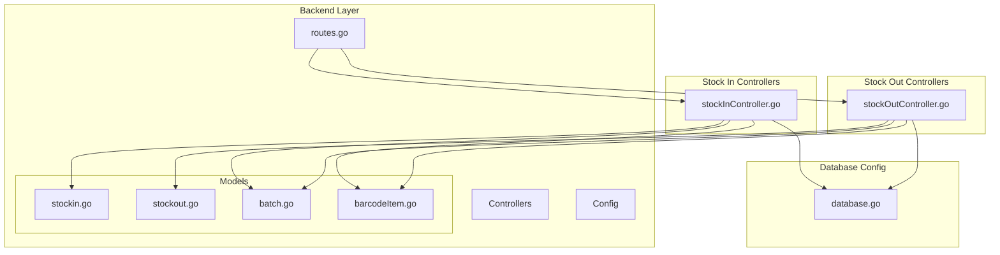
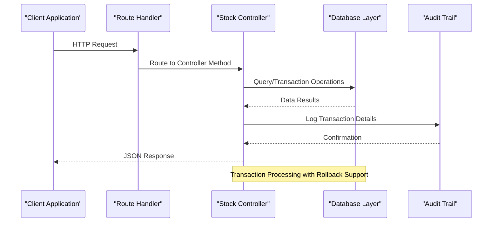
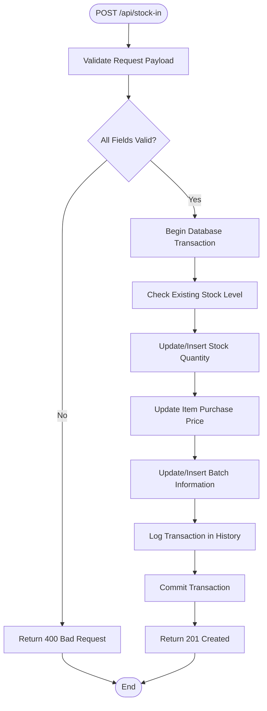
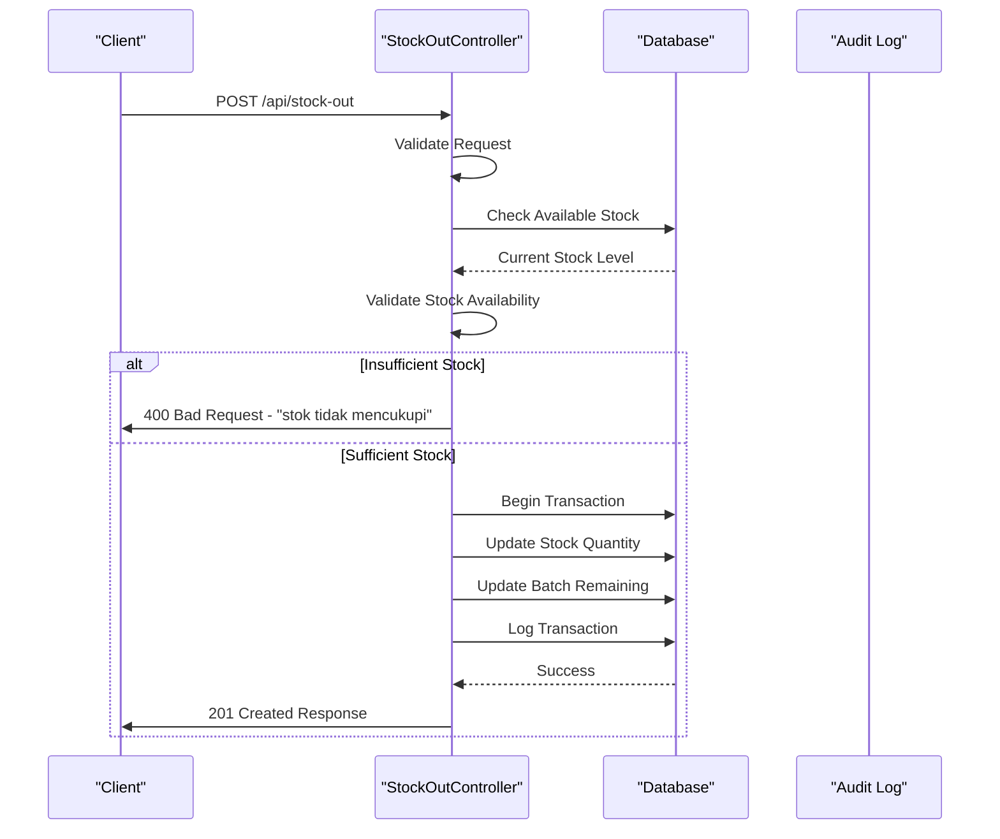
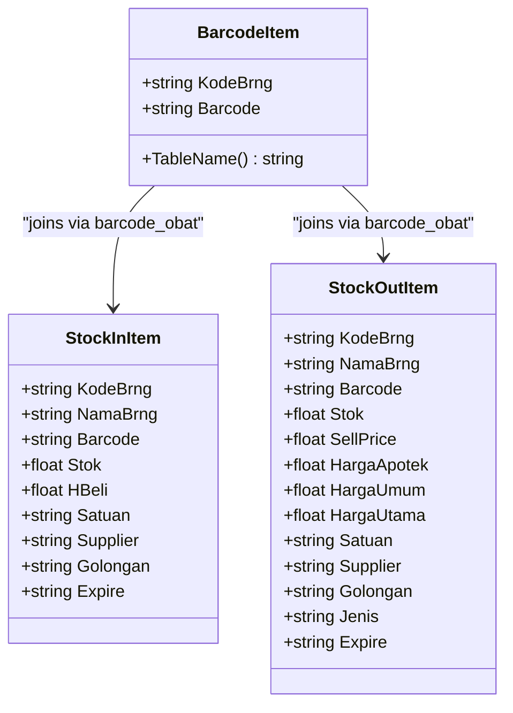
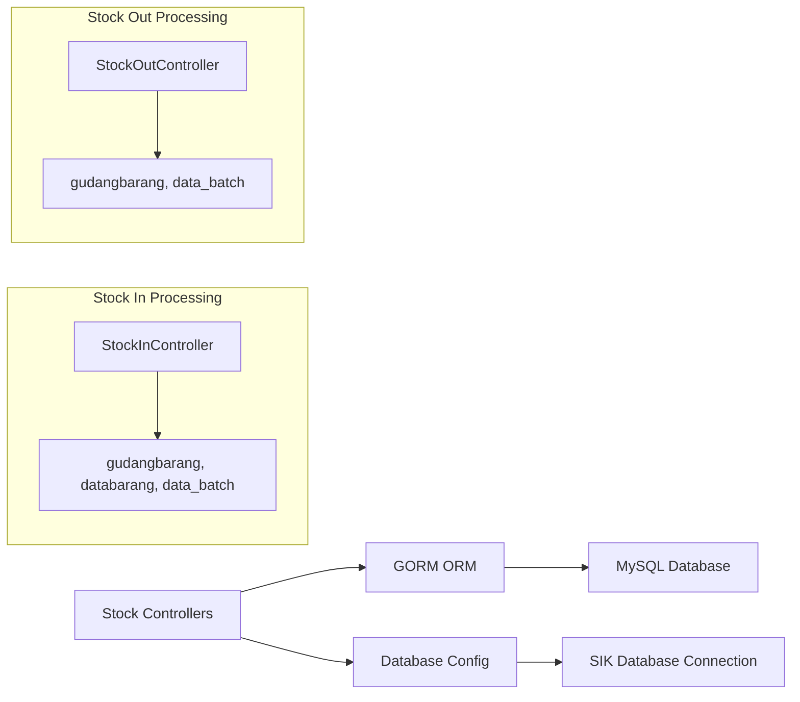

# Stock Operation Endpoints

<cite>
**Referenced Files in This Document**
- [routes.go](file://backend/routes/routes.go)
- [stockInController.go](file://backend/controllers/stockInController.go)
- [stockOutController.go](file://backend/controllers/stockOutController.go)
- [stockin.go](file://backend/models/stockin.go)
- [stockout.go](file://backend/models/stockout.go)
- [batch.go](file://backend/models/batch.go)
- [database.go](file://backend/config/database.go)
- [barcodeItem.go](file://backend/models/barcodeItem.go)
</cite>

## Table of Contents
1. [Introduction](#introduction)
2. [Project Structure](#project-structure)
3. [Core Components](#core-components)
4. [Architecture Overview](#architecture-overview)
5. [Detailed Component Analysis](#detailed-component-analysis)
6. [Dependency Analysis](#dependency-analysis)
7. [Performance Considerations](#performance-considerations)
8. [Troubleshooting Guide](#troubleshooting-guide)
9. [Conclusion](#conclusion)

## Introduction
This document provides comprehensive API documentation for stock operation endpoints focused on stock-in and stock-out transactions. It covers GET endpoints for searching items, batch management, recent transactions, and transaction history, as well as POST endpoints for processing stock-in and stock-out transactions. The documentation includes request schemas, response formats, error handling, transaction processing workflows, and audit trail requirements. Additionally, it provides examples of barcode scanning integration and batch tracking capabilities.

## Project Structure
The stock operation functionality is organized within the backend Go application following a layered architecture:



**Diagram sources**
- [routes.go:9-35](file://backend/routes/routes.go#L9-L35)
- [stockInController.go:1-383](file://backend/controllers/stockInController.go#L1-L383)
- [stockOutController.go:1-377](file://backend/controllers/stockOutController.go#L1-L377)

**Section sources**
- [routes.go:9-35](file://backend/routes/routes.go#L9-L35)

## Core Components
The stock operation system consists of several key components that handle different aspects of inventory management:

### Endpoint Categories
The system provides two main categories of endpoints:

1. **GET Endpoints** - Data retrieval and search operations
2. **POST Endpoints** - Transaction processing and creation

### Database Schema Integration
The system integrates with multiple database tables:
- `databarang` - Item master data
- `gudangbarang` - Warehouse stock inventory
- `riwayat_barang_medis` - Transaction history
- `data_batch` - Batch-specific information
- `barcode_obat` - Barcode item mapping

**Section sources**
- [database.go:21-89](file://backend/config/database.go#L21-L89)

## Architecture Overview
The stock operation architecture follows a RESTful API pattern with clear separation of concerns:



**Diagram sources**
- [routes.go:26-34](file://backend/routes/routes.go#L26-L34)
- [stockInController.go:235-382](file://backend/controllers/stockInController.go#L235-L382)
- [stockOutController.go:189-281](file://backend/controllers/stockOutController.go#L189-L281)

## Detailed Component Analysis

### GET Endpoints

#### Stock-In Item Search
The `/api/stock-in/items` endpoint provides item search functionality with barcode support:

**Endpoint**: `GET /api/stock-in/items?search={term}`

**Query Parameters**:
- `search` (string): Search term for item code, name, or barcode

**Response Format**:
```json
{
  "data": [
    {
      "kode_brng": "string",
      "nama_brng": "string", 
      "barcode": "string",
      "stok": "float",
      "h_beli": "float",
      "satuan": "string",
      "supplier": "string",
      "golongan": "string",
      "expire": "date"
    }
  ]
}
```

**Section sources**
- [stockInController.go:13-50](file://backend/controllers/stockInController.go#L13-L50)
- [stockin.go:3-13](file://backend/models/stockin.go#L3-L13)

#### Recent Stock-In Transactions
The `/api/stock-in/recent` endpoint retrieves the latest 10 stock-in transactions:

**Endpoint**: `GET /api/stock-in/recent`

**Response Format**:
```json
{
  "data": [
    {
      "kode_brng": "string",
      "nama_brng": "string",
      "qty": "float",
      "price": "float",
      "date": "date",
      "time": "time",
      "supplier": "string",
      "note": "string"
    }
  ]
}
```

**Section sources**
- [stockInController.go:52-78](file://backend/controllers/stockInController.go#L52-L78)
- [stockin.go:15-24](file://backend/models/stockin.go#L15-L24)

#### Stock-In History
The `/api/stock-in/history` endpoint provides paginated transaction history with filtering:

**Endpoint**: `GET /api/stock-in/history?page={page}&limit={limit}&search={term}&date={date}`

**Query Parameters**:
- `page` (integer): Page number (default: 1)
- `limit` (integer): Items per page (default: 100, max: 100)
- `search` (string): Search term for item, barcode, supplier, or notes
- `date` (date): Filter by transaction date

**Response Format**:
```json
{
  "data": [
    {
      "kode_brng": "string",
      "nama_brng": "string",
      "barcode": "string",
      "qty": "float",
      "unit": "string",
      "buy_price": "float",
      "total_cost": "float",
      "expired": "date",
      "date": "date",
      "time": "time",
      "supplier": "string",
      "operator": "string",
      "note": "string"
    }
  ],
  "page": "integer",
  "limit": "integer", 
  "total": "integer",
  "total_pages": "integer",
  "total_qty": "float",
  "total_value": "float"
  }
```

**Section sources**
- [stockInController.go:80-175](file://backend/controllers/stockInController.go#L80-L175)
- [stockin.go:26-45](file://backend/models/stockin.go#L26-L45)

#### Stock-Out Item Search
The `/api/stock-out/items` endpoint provides searchable items with stock availability:

**Endpoint**: `GET /api/stock-out/items?search={term}`

**Query Parameters**:
- `search` (string): Search term for item code, name, barcode, or batch/faktur

**Response Format**:
```json
{
  "data": [
    {
      "kode_brng": "string",
      "nama_brng": "string",
      "barcode": "string",
      "stok": "float",
      "sell_price": "float",
      "harga_apotek": "float",
      "harga_umum": "float",
      "harga_utama": "float",
      "satuan": "string",
      "supplier": "string",
      "golongan": "string",
      "jenis": "string",
      "expire": "date"
    }
  ]
}
```

**Section sources**
- [stockOutController.go:13-63](file://backend/controllers/stockOutController.go#L13-L63)
- [stockout.go:3-17](file://backend/models/stockout.go#L3-L17)

#### Stock-Out Batch Management
The `/api/stock-out/batches` endpoint retrieves available batch options for an item:

**Endpoint**: `GET /api/stock-out/batches?kode_brng={item_code}`

**Query Parameters**:
- `kode_brng` (string): Item code (required)

**Response Format**:
```json
{
  "data": [
    {
      "no_batch": "string",
      "no_faktur": "string", 
      "expired": "date",
      "sisa": "float",
      "h_beli": "float",
      "sell_price": "float",
      "harga_apotek": "float",
      "harga_umum": "float",
      "harga_utama": "float",
      "tgl_beli": "date"
    }
  ]
}
```

**Section sources**
- [stockOutController.go:65-103](file://backend/controllers/stockOutController.go#L65-L103)
- [stockout.go:48-60](file://backend/models/stockout.go#L48-L60)

#### Recent Stock-Out Transactions
The `/api/stock-out/recent` endpoint retrieves the latest 10 stock-out transactions:

**Endpoint**: `GET /api/stock-out/recent`

**Response Format**:
```json
{
  "data": [
    {
      "kode_brng": "string",
      "nama_brng": "string",
      "barcode": "string",
      "qty": "float",
      "unit": "string",
      "sell_price": "float",
      "total_revenue": "float",
      "date": "date",
      "time": "time",
      "destination": "string",
      "operator": "string",
      "note": "string"
    }
  ]
}
```

**Section sources**
- [stockOutController.go:105-114](file://backend/controllers/stockOutController.go#L105-L114)
- [stockout.go:19-32](file://backend/models/stockout.go#L19-L32)

#### Stock-Out History
The `/api/stock-out/history` endpoint provides paginated stock-out transaction history:

**Endpoint**: `GET /api/stock-out/history?page={page}&limit={limit}&search={term}&date={date}`

**Query Parameters**:
- `page` (integer): Page number (default: 1)
- `limit` (integer): Items per page (default: 100, max: 100)
- `search` (string): Search term for item, barcode, destination, or notes
- `date` (date): Filter by transaction date

**Response Format**:
```json
{
  "data": [
    {
      "kode_brng": "string",
      "nama_brng": "string", 
      "barcode": "string",
      "qty": "float",
      "unit": "string",
      "sell_price": "float",
      "total_revenue": "float",
      "date": "date",
      "time": "time",
      "destination": "string",
      "operator": "string",
      "note": "string"
    }
  ],
  "page": "integer",
  "limit": "integer",
  "total": "integer",
  "total_pages": "integer",
  "total_qty": "float",
  "total_value": "float"
}
```

**Section sources**
- [stockOutController.go:116-187](file://backend/controllers/stockOutController.go#L116-L187)
- [stockout.go:34-46](file://backend/models/stockout.go#L34-L46)

### POST Endpoints

#### Stock-In Transaction Processing
The `/api/stock-in` endpoint processes incoming stock transactions:

**Endpoint**: `POST /api/stock-in`

**Request Body Schema**:
```json
{
  "kode_brng": "string",
  "qty": "float",
  "price": "float",
  "tanggal_pembelian": "date",
  "expired": "date",
  "no_batch": "string",
  "no_faktur": "string",
  "note": "string"
}
```

**Validation Rules**:
- `kode_brng`: Required (non-empty)
- `qty`: Required (must be > 0)
- `no_batch`: Required (non-empty)
- `no_faktur`: Required (non-empty)
- `tanggal_pembelian`: Required (non-empty)

**Processing Workflow**:



**Diagram sources**
- [stockInController.go:235-382](file://backend/controllers/stockInController.go#L235-L382)

**Response Format**:
```json
{
  "message": "string",
  "data": {
    "kode_brng": "string",
    "stok_awal": "float",
    "stok_akhir": "float"
  }
}
```

**Section sources**
- [stockInController.go:235-382](file://backend/controllers/stockInController.go#L235-L382)
- [stockin.go:47-57](file://backend/models/stockin.go#L47-L57)

#### Stock-Out Transaction Processing
The `/api/stock-out` endpoint processes outgoing stock transactions:

**Endpoint**: `POST /api/stock-out`

**Request Body Schema**:
```json
{
  "kode_brng": "string",
  "qty": "float",
  "no_batch": "string",
  "no_faktur": "string",
  "destination": "string",
  "note": "string"
}
```

**Validation Rules**:
- `kode_brng`: Required (non-empty)
- `qty`: Required (must be > 0)
- `no_batch`: Required (non-empty)
- `no_faktur`: Required (non-empty)
- `destination`: Required (non-empty)

**Processing Workflow**:



**Diagram sources**
- [stockOutController.go:189-281](file://backend/controllers/stockOutController.go#L189-L281)

**Response Format**:
```json
{
  "message": "string",
  "data": {
    "kode_brng": "string",
    "stok_awal": "float",
    "stok_akhir": "float",
    "no_batch": "string",
    "no_faktur": "string"
  }
}
```

**Section sources**
- [stockOutController.go:189-281](file://backend/controllers/stockOutController.go#L189-L281)
- [stockout.go:34-41](file://backend/models/stockout.go#L34-L41)

### Barcode Scanning Integration
The system supports barcode scanning through integrated barcode lookup:



**Diagram sources**
- [barcodeItem.go:3-12](file://backend/models/barcodeItem.go#L3-L12)
- [stockin.go:3-13](file://backend/models/stockin.go#L3-L13)
- [stockout.go:3-17](file://backend/models/stockout.go#L3-L17)

**Section sources**
- [barcodeItem.go:3-12](file://backend/models/barcodeItem.go#L3-L12)
- [stockInController.go:13-50](file://backend/controllers/stockInController.go#L13-L50)
- [stockOutController.go:13-63](file://backend/controllers/stockOutController.go#L13-L63)

## Dependency Analysis

### Database Relationships
The stock operation system relies on several interconnected database tables:

```mermaid
erDiagram
databarang {
string kode_brng PK
string nama_brng
float h_beli
float ralan
float jualbebas
float utama
float beliluar
date expire
}
gudangbarang {
string kode_brng FK
string kd_bangsal
string no_batch
string no_faktur
float stok
}
data_batch {
string kode_brng FK
string no_batch
string no_faktur
date tgl_beli
date tgl_kadaluarsa
float jumlahbeli
float sisa
float dasar
float h_beli
}
riwayat_barang_medis {
string kode_brng FK
float stok_awal
float masuk
float keluar
float stok_akhir
string posisi
date tanggal
time jam
string petugas
string kd_bangsal
string status
string no_batch
string no_faktur
string keterangan
}
barcode_obat {
string kode_brng PK
string barcode UK
}
databarang ||--o{ gudangbarang : "has inventory"
databarang ||--o{ data_batch : "has batches"
databarang ||--o{ riwayat_barang_medis : "transactions"
barcode_obat ||--|| databarang : "maps to"
```



**Diagram sources**
- [stockInController.go:17-42](file://backend/controllers/stockInController.go#L17-L42)
- [stockOutController.go:17-40](file://backend/controllers/stockOutController.go#L17-L40)
- [batch.go:3-24](file://backend/models/batch.go#L3-L24)

### Transaction Processing Dependencies
The stock operation controllers depend on the database configuration and utilize GORM for ORM operations:



**Diagram sources**
- [stockInController.go:3-11](file://backend/controllers/stockInController.go#L3-L11)
- [stockOutController.go:3-11](file://backend/controllers/stockOutController.go#L3-L11)
- [database.go:11-31](file://backend/config/database.go#L11-L31)

**Section sources**
- [stockInController.go:3-11](file://backend/controllers/stockInController.go#L3-L11)
- [stockOutController.go:3-11](file://backend/controllers/stockOutController.go#L3-L11)
- [database.go:11-31](file://backend/config/database.go#L11-L31)

## Performance Considerations

### Database Indexing Strategy
The system implements strategic indexing for optimal query performance:

- **riwayat_barang_medis**: Composite index on (kd_bangsal, tanggal, jam) for recent transactions
- **gudangbarang**: Composite index on (kd_bangsal, kode_brng) for inventory queries  
- **databarang**: Indexes on expire and kode_golongan for filtering operations
- **Summary Queries**: Pre-aggregation strategies to minimize join overhead

### Pagination and Limiting
Both GET endpoints implement pagination with configurable limits:
- Maximum limit: 100 items per page
- Automatic page boundary validation
- Efficient total count calculation

### Query Optimization
The stock-in history endpoint uses conditional aggregation:
- Pre-aggregation when no search is applied
- Full join when search parameters are present
- Optimized for both performance and functionality

**Section sources**
- [database.go:50-89](file://backend/config/database.go#L50-L89)
- [stockInController.go:177-233](file://backend/controllers/stockInController.go#L177-L233)
- [stockOutController.go:315-376](file://backend/controllers/stockOutController.go#L315-L376)

## Troubleshooting Guide

### Common Error Scenarios

#### Validation Errors (400 Bad Request)
- **Stock-In**: Missing required fields (item code, quantity, batch, invoice, purchase date)
- **Stock-Out**: Missing required fields (item code, quantity, batch, invoice, destination)

#### Stock Availability Issues
- **Stock-Out**: Insufficient stock for requested quantity
- **Solution**: Verify available stock using `/api/stock-out/batches` endpoint

#### Database Transaction Failures
- **Rollback Mechanism**: Automatic rollback on any transaction failure
- **Error Messages**: Specific error messages indicate the failing operation

#### Barcode Lookup Issues
- **Missing Barcode**: Items without barcode associations
- **Duplicate Barcodes**: Ensure unique barcode values in `barcode_obat` table

### Audit Trail Requirements
All stock transactions are automatically logged in the `riwayat_barang_medis` table with:
- Timestamps (date and time)
- Operator information
- Transaction details (quantity, batch, invoice)
- Audit trail for compliance and tracking

**Section sources**
- [stockInController.go:242-245](file://backend/controllers/stockInController.go#L242-L245)
- [stockOutController.go:196-199](file://backend/controllers/stockOutController.go#L196-L199)
- [stockOutController.go:209-213](file://backend/controllers/stockOutController.go#L209-L213)

## Conclusion
The stock operation endpoints provide a comprehensive solution for inventory management with robust transaction processing, barcode integration, and detailed audit trails. The system supports both stock-in and stock-out operations with proper validation, error handling, and performance optimizations. The modular architecture ensures maintainability while the database design supports efficient querying and reporting capabilities.

Key strengths of the implementation include:
- Complete transaction lifecycle management with rollback support
- Comprehensive audit trail for compliance requirements
- Efficient database indexing and query optimization
- Flexible search and filtering capabilities
- Barcode scanning integration for streamlined operations
- Scalable pagination for large datasets

The API design follows RESTful principles with clear endpoint categorization and consistent response formats, making it suitable for integration with various client applications.