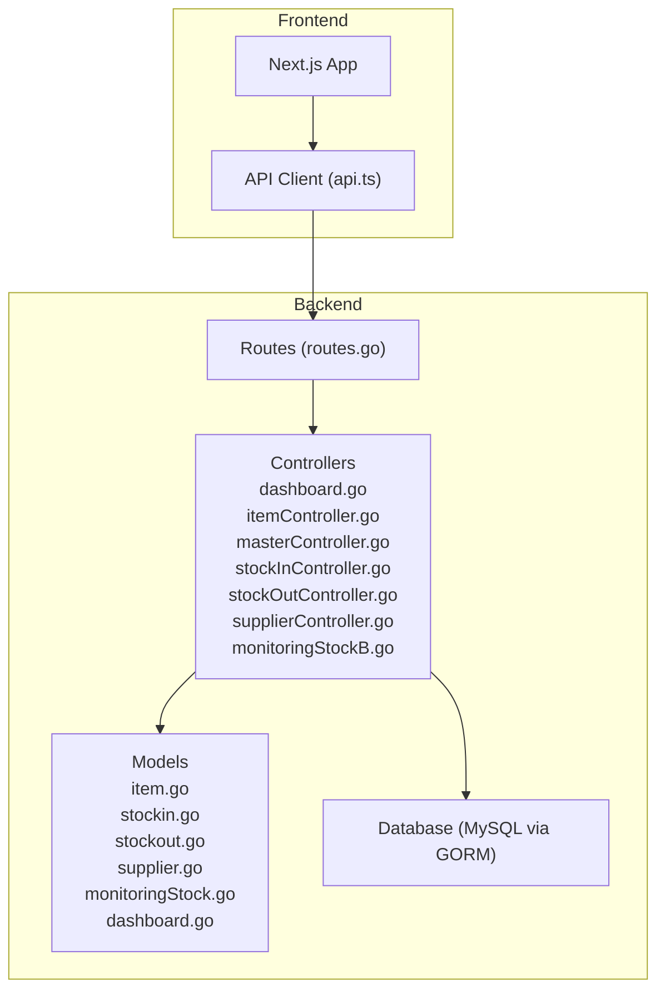
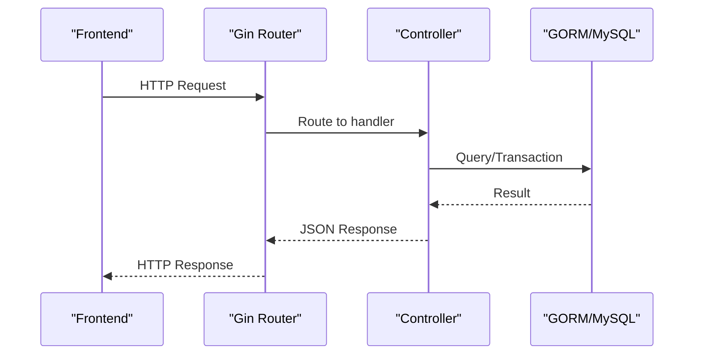
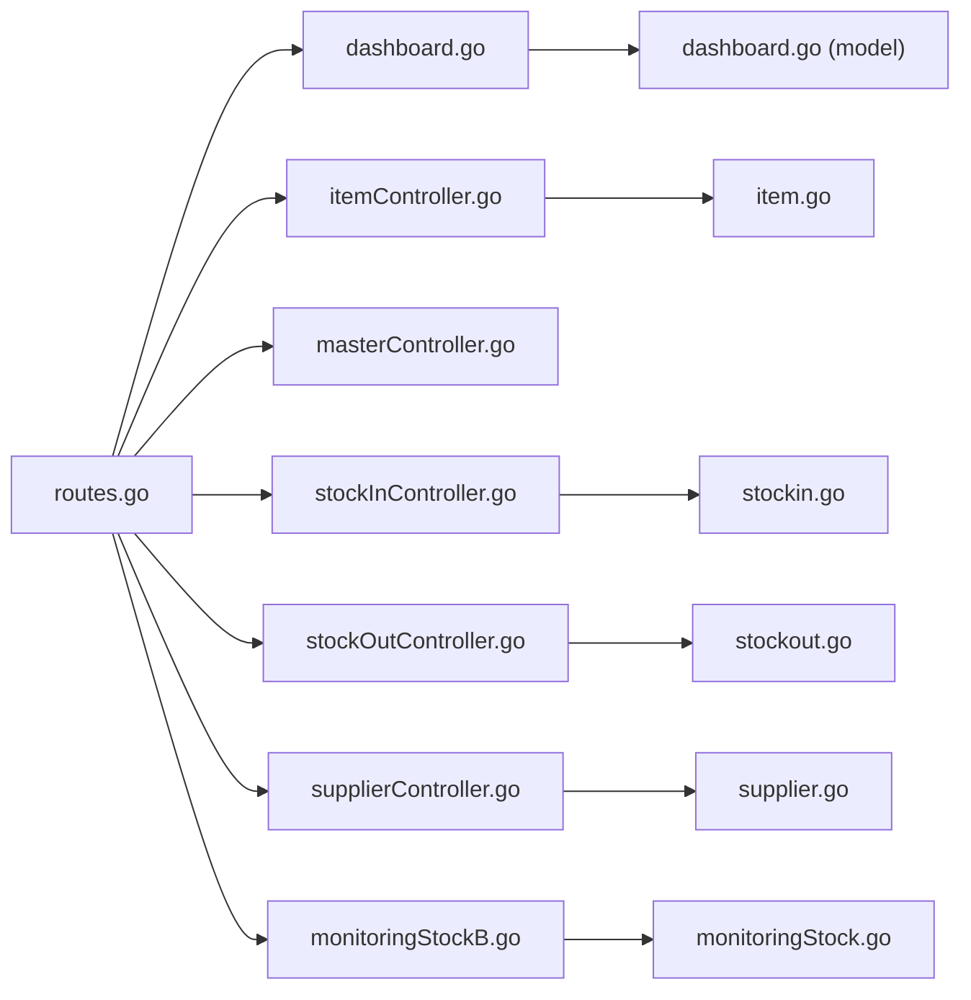

# API Endpoints & Routing

<cite>
**Referenced Files in This Document**
- [main.go](file://backend/main.go)
- [routes.go](file://backend/routes/routes.go)
- [dashboard.go](file://backend/controllers/dashboard.go)
- [itemController.go](file://backend/controllers/itemController.go)
- [masterController.go](file://backend/controllers/masterController.go)
- [stockInController.go](file://backend/controllers/stockInController.go)
- [stockOutController.go](file://backend/controllers/stockOutController.go)
- [supplierController.go](file://backend/controllers/supplierController.go)
- [monitoringStockB.go](file://backend/controllers/monitoringStockB.go)
- [item.go](file://backend/models/item.go)
- [stockin.go](file://backend/models/stockin.go)
- [stockout.go](file://backend/models/stockout.go)
- [supplier.go](file://backend/models/supplier.go)
- [monitoringStock.go](file://backend/models/monitoringStock.go)
- [dashboard.go](file://backend/models/dashboard.go)
- [api.ts](file://frontend/src/lib/api.ts)
</cite>

## Table of Contents
1. [Introduction](#introduction)
2. [Project Structure](#project-structure)
3. [Core Components](#core-components)
4. [Architecture Overview](#architecture-overview)
5. [Detailed Component Analysis](#detailed-component-analysis)
6. [Dependency Analysis](#dependency-analysis)
7. [Performance Considerations](#performance-considerations)
8. [Troubleshooting Guide](#troubleshooting-guide)
9. [Conclusion](#conclusion)
10. [Appendices](#appendices)

## Introduction
This document provides comprehensive API documentation for the PPA backend REST endpoints. It covers HTTP methods, URL patterns, request/response schemas, status codes, pagination, filtering, sorting, and CORS configuration. Authentication, authorization, rate limiting, API versioning, and backward compatibility are discussed conceptually, as no explicit middleware for these is present in the current codebase.

## Project Structure
The backend is a Go Gin application with a clear separation of concerns:
- Routes define endpoint mappings.
- Controllers implement business logic and interact with the database via GORM.
- Models define request/response schemas and database table mappings.
- Frontend consumes the API using a small helper that resolves base URLs.

**Diagram sources**
- [routes.go:1-36](file://backend/routes/routes.go#L1-L36)
- [dashboard.go:1-305](file://backend/controllers/dashboard.go#L1-L305)
- [itemController.go:1-284](file://backend/controllers/itemController.go#L1-L284)
- [masterController.go:1-206](file://backend/controllers/masterController.go#L1-L206)
- [stockInController.go:1-383](file://backend/controllers/stockInController.go#L1-L383)
- [stockOutController.go:1-349](file://backend/controllers/stockOutController.go#L1-L349)
- [supplierController.go:1-80](file://backend/controllers/supplierController.go#L1-L80)
- [monitoringStockB.go:1-520](file://backend/controllers/monitoringStockB.go#L1-L520)
- [item.go:1-33](file://backend/models/item.go#L1-L33)
- [stockin.go:1-57](file://backend/models/stockin.go#L1-L57)
- [stockout.go:1-60](file://backend/models/stockout.go#L1-L60)
- [supplier.go:1-14](file://backend/models/supplier.go#L1-L14)
- [monitoringStock.go:1-81](file://backend/models/monitoringStock.go#L1-L81)
- [dashboard.go:1-60](file://backend/models/dashboard.go#L1-L60)
- [api.ts:1-19](file://frontend/src/lib/api.ts#L1-L19)

**Section sources**
- [main.go:1-33](file://backend/main.go#L1-L33)
- [routes.go:1-36](file://backend/routes/routes.go#L1-L36)
- [api.ts:1-19](file://frontend/src/lib/api.ts#L1-L19)

## Core Components
- Routes: Define all REST endpoints and bind them to controller functions.
- Controllers: Implement CRUD and reporting endpoints, handle pagination, filtering, and transactions.
- Models: Define request/response shapes and GORM mappings.
- Frontend API client: Resolves base URL and builds absolute API paths.

Key runtime behaviors:
- CORS: Enabled globally via default middleware.
- Pagination: Implemented in several endpoints with page and limit parameters.
- Filtering/Search: Implemented via query parameters (e.g., search, date).
- Transactions: Used in stock-in/out operations to maintain consistency.

**Section sources**
- [routes.go:9-35](file://backend/routes/routes.go#L9-L35)
- [dashboard.go:43-305](file://backend/controllers/dashboard.go#L43-L305)
- [stockInController.go:80-175](file://backend/controllers/stockInController.go#L80-L175)
- [stockOutController.go:116-187](file://backend/controllers/stockOutController.go#L116-L187)
- [main.go:15-16](file://backend/main.go#L15-L16)

## Architecture Overview
The API follows a layered architecture:
- HTTP Layer: Gin router registers routes.
- Controller Layer: Handles requests, validates inputs, orchestrates queries.
- Model Layer: Defines DTOs and interacts with the database.
- Data Access: GORM queries against MySQL.

**Diagram sources**
- [main.go:12-31](file://backend/main.go#L12-L31)
- [routes.go:9-35](file://backend/routes/routes.go#L9-L35)
- [stockInController.go:235-382](file://backend/controllers/stockInController.go#L235-L382)
- [stockOutController.go:189-281](file://backend/controllers/stockOutController.go#L189-L281)

## Detailed Component Analysis

### Authentication, Authorization, and Security
- Authentication: No authentication middleware is registered in the Gin engine.
- Authorization: No role-based checks or ACLs are enforced in controllers.
- Security considerations:
  - CORS is enabled globally; consider scoping to trusted origins.
  - Input validation relies on GORM binding and manual checks; consider adding schema validation and sanitization.
  - SQL injection is mitigated by GORM’s parameterized queries.
  - Rate limiting and API versioning are not implemented; introduce middleware for production.

Recommendations:
- Add JWT or session middleware.
- Enforce RBAC roles per endpoint.
- Configure CORS with AllowOrigins and exposed headers/methods.
- Implement rate limiting and API versioning via path/version prefix.

**Section sources**
- [main.go:15-16](file://backend/main.go#L15-L16)
- [routes.go:9-35](file://backend/routes/routes.go#L9-L35)

### CORS Configuration
- Global default CORS is enabled. This allows browsers to call the API from any origin. For production, configure allowed origins, methods, headers, and credentials.

**Section sources**
- [main.go:15-16](file://backend/main.go#L15-L16)

### API Versioning and Backward Compatibility
- Current endpoints use /api/* without a version segment.
- To evolve APIs safely:
  - Introduce /api/v1/ and future versions.
  - Keep v1 stable; deprecate old endpoints gradually.
  - Use semantic versioning and changelog.

**Section sources**
- [routes.go:10-35](file://backend/routes/routes.go#L10-L35)

### Endpoint Catalog and Details

#### Base URL and Client Behavior
- Frontend resolves the API base URL dynamically and constructs absolute paths. The backend listens on port 8080 by default.

**Section sources**
- [api.ts:1-19](file://frontend/src/lib/api.ts#L1-L19)
- [main.go:31](file://backend/main.go#L31)

#### Dashboard
- Purpose: Aggregated KPIs, stock distribution, recent activities, and movement charts.
- Pagination: Supports separate pagination for “golongan” and “activities”.

Endpoints
- GET /api/dashboard
  - Query params:
    - golongan_page (default 1)
    - golongan_limit (default 10)
    - activities_page (default 1)
    - activities_limit (default 10)
  - Response: DashboardResponse with pagination metadata.
  - Status codes: 200 on success, 500 on internal errors.

Example request
- GET /api/dashboard?golongan_page=1&golongan_limit=10&activities_page=1&activities_limit=10

Example response (selected fields)
- data.summary.total_items, data.summary.inventory_value
- data.pagination.golongan.page, data.pagination.golongan.limit
- data.recent_activities[].type, data.recent_activities[].qty

**Section sources**
- [routes.go:23](file://backend/routes/routes.go#L23)
- [dashboard.go:43-305](file://backend/controllers/dashboard.go#L43-L305)
- [dashboard.go:276-296](file://backend/controllers/dashboard.go#L276-L296)

#### Inventory (Items)
- Purpose: List items with stock and batch info, search, update, delete, and fetch by code.

Endpoints
- GET /api/items
  - Query params:
    - search (optional)
  - Response: total (int), data ([]Item)
  - Status codes: 200 on success, 500 on internal errors.

- GET /api/items/:kodeBrng
  - Path param: kodeBrng
  - Response: data (Item)
  - Status codes: 200 on found, 404 if not found.

- PUT /api/items/:kodeBrng
  - Path param: kodeBrng
  - Body: LocalItem-like payload (mapped to databarang updates)
  - Response: message on success
  - Status codes: 200 on success, 400 on bind error, 500 on DB error.

- DELETE /api/items/:kodeBrng
  - Path param: kodeBrng
  - Response: message on success
  - Status codes: 200 on success, 500 on DB error.

Example request (GET /api/items)
- GET /api/items?search=pain

Example response (GET /api/items)
- total: 123
- data[0].kode_brng, data[0].nama_brng, data[0].stok, data[0].expire

Example request (PUT /api/items/:kodeBrng)
- {
  "nama_brng": "Paracetamol 500mg",
  "h_beli": 1200,
  "ralan": 2500,
  "utama": 2300,
  "beliluar": 2600,
  "expire": "2026-12-31",
  "kode_sat": "strip",
  "kdjns": "JNS01",
  "kode_golongan": "GL01",
  "kode_industri": "IND01",
  "satuan": "strip",
  "jenis": "JNS01",
  "golongan": "GL01",
  "supplier": "PT Farma Sejahtera",
  "barcode": "1234567890123"
}

**Section sources**
- [routes.go:10-11](file://backend/routes/routes.go#L10-L11)
- [routes.go:12](file://backend/routes/routes.go#L12)
- [routes.go:21](file://backend/routes/routes.go#L21)
- [routes.go:22](file://backend/routes/routes.go#L22)
- [itemController.go:98-215](file://backend/controllers/itemController.go#L98-L215)
- [itemController.go:22-96](file://backend/controllers/itemController.go#L22-L96)
- [itemController.go:217-267](file://backend/controllers/itemController.go#L217-L267)
- [itemController.go:269-283](file://backend/controllers/itemController.go#L269-L283)
- [item.go:3-28](file://backend/models/item.go#L3-L28)

#### Master Data
- Purpose: Manage lookup entities (golongan, jenis, satuan) and suppliers.

Endpoints
- GET /api/masters
  - Response: { golongan[], jenis[], satuan[], suppliers[] }

- POST /api/masters/:type
  - Path param: type ∈ {golongan, jenis, satuan}
  - Body: { code, name }
  - Response: message on success
  - Status codes: 201 on success, 400 on invalid type or missing fields, 500 on DB error.

- PUT /api/masters/:type/:code
  - Path params: type, code
  - Body: { name }
  - Response: message on success
  - Status codes: 200 on success, 400 on invalid type, 404 if not found, 500 on DB error.

- DELETE /api/masters/:type/:code
  - Path params: type, code
  - Response: message on success
  - Status codes: 200 on success, 400 on invalid type, 404 if not found, 500 on DB error.

Example request (POST /api/masters/golongan)
- {
  "code": "GL01",
  "name": "Generik"
}

**Section sources**
- [routes.go:13](file://backend/routes/routes.go#L13)
- [routes.go:14-16](file://backend/routes/routes.go#L14-L16)
- [masterController.go:51-95](file://backend/controllers/masterController.go#L51-L95)
- [masterController.go:97-139](file://backend/controllers/masterController.go#L97-L139)
- [masterController.go:141-178](file://backend/controllers/masterController.go#L141-L178)
- [masterController.go:180-205](file://backend/controllers/masterController.go#L180-L205)

#### Suppliers
- Purpose: Manage supplier records.

Endpoints
- GET /api/suppliers
  - Response: { data: Supplier[] }

- POST /api/suppliers
  - Body: Supplier
  - Response: { data: Supplier }
  - Status codes: 201 on success, 400 on bind error.

- PUT /api/suppliers/:id
  - Path param: id
  - Body: Supplier
  - Response: { data: Supplier }

- DELETE /api/suppliers/:id
  - Path param: id
  - Response: { message: "deleted" }

Example request (POST /api/suppliers)
- {
  "kode_industri": "IND01",
  "nama_industri": "PT Farma Sejahtera",
  "alamat": "Jl. Merdeka No. 10",
  "kota": "Jakarta",
  "no_telp": "021-123456"
}

**Section sources**
- [routes.go:17-20](file://backend/routes/routes.go#L17-L20)
- [supplierController.go:10-21](file://backend/controllers/supplierController.go#L10-L21)
- [supplierController.go:23-41](file://backend/controllers/supplierController.go#L23-L41)
- [supplierController.go:43-65](file://backend/controllers/supplierController.go#L43-L65)
- [supplierController.go:67-80](file://backend/controllers/supplierController.go#L67-L80)
- [supplier.go:3-14](file://backend/models/supplier.go#L3-L14)

#### Monitoring Stock
- Purpose: Stock health, expiring items, turnover, coverage, and category stats.

Endpoints
- GET /api/monitoring-stock
  - Query params:
    - period ∈ {day, month, year, all} (default month)
  - Response: data (MonitoringStockResponse), meta (thresholds and period info)
  - Status codes: 200 on success, 500 on internal errors.

- GET /api/monitoring-stock/details
  - Query params:
    - type ∈ {critical, restock, expiring_soon, expired}
    - search (optional)
  - Response: data ([]MonitoringStockLowItem or []MonitoringStockExpiringItem)
  - Status codes: 200 on success, 400 on invalid type, 500 on internal errors.

Example request
- GET /api/monitoring-stock?period=year
- GET /api/monitoring-stock/details?type=critical&search=paracetamol

**Section sources**
- [routes.go:24-25](file://backend/routes/routes.go#L24-L25)
- [monitoringStockB.go:83-375](file://backend/controllers/monitoringStockB.go#L83-L375)
- [monitoringStockB.go:377-519](file://backend/controllers/monitoringStockB.go#L377-L519)
- [monitoringStock.go:3-81](file://backend/models/monitoringStock.go#L3-L81)

#### Stock In
- Purpose: Search items, recent entries, history with pagination and filters, and record new stock-in.

Endpoints
- GET /api/stock-in/items
  - Query params:
    - search (optional)
  - Response: data ([]StockInItem)

- GET /api/stock-in/recent
  - Response: data ([]StockInRecent)

- GET /api/stock-in/history
  - Query params:
    - search (optional)
    - date (optional)
    - page (default 1)
    - limit (default 100, max 100)
  - Response: data ([]StockInHistory), pagination fields, totals
  - Status codes: 200 on success, 500 on internal errors.

- POST /api/stock-in
  - Body: StockInPayload
  - Response: { message, data: { kode_brng, stok_awal, stok_akhir } }
  - Status codes: 201 on success, 400 on validation, 500 on transaction failure.

Example request (POST /api/stock-in)
- {
  "kode_brng": "BRG001",
  "qty": 100,
  "price": 1200,
  "tanggal_pembelian": "2025-01-15",
  "expired": "2026-12-31",
  "no_batch": "BATCH001",
  "no_faktur": "FAKTUR001",
  "note": "Delivery via PT Jaya"
}

**Section sources**
- [routes.go:26-29](file://backend/routes/routes.go#L26-L29)
- [stockInController.go:13-50](file://backend/controllers/stockInController.go#L13-L50)
- [stockInController.go:52-78](file://backend/controllers/stockInController.go#L52-L78)
- [stockInController.go:80-175](file://backend/controllers/stockInController.go#L80-L175)
- [stockInController.go:235-382](file://backend/controllers/stockInController.go#L235-L382)
- [stockin.go:3-57](file://backend/models/stockin.go#L3-L57)

#### Stock Out
- Purpose: Search items, batch selection, recent entries, history with pagination and filters, and record new stock-out.

Endpoints
- GET /api/stock-out/items
  - Query params:
    - search (optional)
  - Response: data ([]StockOutItem)

- GET /api/stock-out/batches
  - Query params:
    - kode_brng (required)
  - Response: data ([]StockOutBatchOption)

- GET /api/stock-out/recent
  - Response: data ([]StockOutHistory)

- GET /api/stock-out/history
  - Query params:
    - search (optional)
    - date (optional)
    - page (default 1)
    - limit (default 100, max 100)
  - Response: data ([]StockOutHistory), pagination fields, totals
  - Status codes: 200 on success, 500 on internal errors.

- POST /api/stock-out
  - Body: StockOutPayload
  - Response: { message, data: { kode_brng, stok_awal, stok_akhir, no_batch, no_faktur } }
  - Status codes: 201 on success, 400 on validation or insufficient stock, 500 on transaction failure.

Example request (POST /api/stock-out)
- {
  "kode_brng": "BRG001",
  "qty": 25,
  "no_batch": "BATCH001",
  "no_faktur": "FASKES001",
  "destination": "Faskes",
  "note": "Distribution to remote clinic"
}

**Section sources**
- [routes.go:30-34](file://backend/routes/routes.go#L30-L34)
- [stockOutController.go:13-63](file://backend/controllers/stockOutController.go#L13-L63)
- [stockOutController.go:65-103](file://backend/controllers/stockOutController.go#L65-L103)
- [stockOutController.go:105-114](file://backend/controllers/stockOutController.go#L105-L114)
- [stockOutController.go:116-187](file://backend/controllers/stockOutController.go#L116-L187)
- [stockOutController.go:189-281](file://backend/controllers/stockOutController.go#L189-L281)
- [stockout.go:3-60](file://backend/models/stockout.go#L3-L60)

### Pagination, Filtering, and Sorting
- Pagination:
  - Dashboard: Separate pagination for “golongan” and “activities”.
  - Stock In History: page (default 1), limit (default 100, max 100).
  - Stock Out History: page (default 1), limit (default 100, max 100).
- Filtering/Search:
  - Items: search (name, code, barcode, batch, invoice).
  - Stock In/Out History: search (name, code, barcode, operator, supplier, note), date filter.
  - Monitoring Details: type filter and optional search term.
- Sorting:
  - Items: sort by kode_brng, purchase date, batch.
  - Stock In/Out History: sort by date desc, time desc.
  - Monitoring: various sorts by stock, usage, expiry.

**Section sources**
- [dashboard.go:44-47](file://backend/controllers/dashboard.go#L44-L47)
- [itemController.go:202-212](file://backend/controllers/itemController.go#L202-L212)
- [stockInController.go:123-137](file://backend/controllers/stockInController.go#L123-L137)
- [stockOutController.go:135-149](file://backend/controllers/stockOutController.go#L135-L149)
- [monitoringStockB.go:377-519](file://backend/controllers/monitoringStockB.go#L377-L519)

### Request/Response Schemas
- Items
  - Request (PUT /api/items/:kodeBrng): LocalItem-like fields mapped to databarang columns.
  - Response (GET /api/items): total (int), data ([]Item).
  - Response (GET /api/items/:kodeBrng): data (Item).

- Stock In
  - Request (POST /api/stock-in): StockInPayload.
  - Response (POST /api/stock-in): { message, data }.

- Stock Out
  - Request (POST /api/stock-out): StockOutPayload.
  - Response (POST /api/stock-out): { message, data }.

- Monitoring Stock
  - Response (GET /api/monitoring-stock): data (MonitoringStockResponse), meta (period, thresholds).
  - Response (GET /api/monitoring-stock/details): data ([]MonitoringStockLowItem | []MonitoringStockExpiringItem).

- Dashboard
  - Response (GET /api/dashboard): data (DashboardResponse), pagination metadata.

- Master Data
  - Request (POST /api/masters/:type): { code, name }.
  - Response (POST /api/masters/:type): { message }.

- Suppliers
  - Request (POST /api/suppliers): Supplier.
  - Response (POST /api/suppliers): { data: Supplier }.

**Section sources**
- [itemController.go:217-267](file://backend/controllers/itemController.go#L217-L267)
- [itemController.go:98-215](file://backend/controllers/itemController.go#L98-L215)
- [itemController.go:22-96](file://backend/controllers/itemController.go#L22-L96)
- [stockInController.go:235-382](file://backend/controllers/stockInController.go#L235-L382)
- [stockOutController.go:189-281](file://backend/controllers/stockOutController.go#L189-L281)
- [monitoringStockB.go:83-375](file://backend/controllers/monitoringStockB.go#L83-L375)
- [monitoringStockB.go:377-519](file://backend/controllers/monitoringStockB.go#L377-L519)
- [dashboard.go:276-296](file://backend/controllers/dashboard.go#L276-L296)
- [masterController.go:97-139](file://backend/controllers/masterController.go#L97-L139)
- [supplierController.go:23-41](file://backend/controllers/supplierController.go#L23-L41)
- [item.go:3-28](file://backend/models/item.go#L3-L28)
- [stockin.go:3-57](file://backend/models/stockin.go#L3-L57)
- [stockout.go:3-60](file://backend/models/stockout.go#L3-L60)
- [monitoringStock.go:70-81](file://backend/models/monitoringStock.go#L70-L81)
- [dashboard.go:52-60](file://backend/models/dashboard.go#L52-L60)

### Error Handling
- Validation errors: 400 with error message.
- Not found: 404 with error message.
- Internal errors: 500 with error message.
- Transaction failures: 500 with rollback messages.

**Section sources**
- [itemController.go:221-225](file://backend/controllers/itemController.go#L221-L225)
- [stockInController.go:242-245](file://backend/controllers/stockInController.go#L242-L245)
- [stockOutController.go:196-199](file://backend/controllers/stockOutController.go#L196-L199)
- [stockOutController.go:209-213](file://backend/controllers/stockOutController.go#L209-L213)

## Dependency Analysis

**Diagram sources**
- [routes.go:9-35](file://backend/routes/routes.go#L9-L35)
- [dashboard.go:1-305](file://backend/controllers/dashboard.go#L1-L305)
- [itemController.go:1-284](file://backend/controllers/itemController.go#L1-L284)
- [masterController.go:1-206](file://backend/controllers/masterController.go#L1-L206)
- [stockInController.go:1-383](file://backend/controllers/stockInController.go#L1-L383)
- [stockOutController.go:1-349](file://backend/controllers/stockOutController.go#L1-L349)
- [supplierController.go:1-80](file://backend/controllers/supplierController.go#L1-L80)
- [monitoringStockB.go:1-520](file://backend/controllers/monitoringStockB.go#L1-L520)
- [dashboard.go:1-60](file://backend/models/dashboard.go#L1-L60)
- [item.go:1-33](file://backend/models/item.go#L1-L33)
- [stockin.go:1-57](file://backend/models/stockin.go#L1-L57)
- [stockout.go:1-60](file://backend/models/stockout.go#L1-L60)
- [supplier.go:1-14](file://backend/models/supplier.go#L1-L14)
- [monitoringStock.go:1-81](file://backend/models/monitoringStock.go#L1-L81)

**Section sources**
- [routes.go:9-35](file://backend/routes/routes.go#L9-L35)

## Performance Considerations
- Dashboard uses concurrent queries with WaitGroup and caching to reduce latency.
- Stock history endpoints pre-aggregate where possible to minimize joins and I/O.
- Pagination limits prevent heavy payloads.
- Recommendations:
  - Add database indexes on frequently filtered columns.
  - Consider query result caching for static master data.
  - Monitor slow queries and add EXPLAIN plans.

**Section sources**
- [dashboard.go:77-264](file://backend/controllers/dashboard.go#L77-L264)
- [stockInController.go:177-233](file://backend/controllers/stockInController.go#L177-L233)
- [stockOutController.go:315-348](file://backend/controllers/stockOutController.go#L315-L348)

## Troubleshooting Guide
Common issues and resolutions:
- CORS errors: Ensure frontend origin matches configured allowed origins.
- 400 Bad Request: Validate payload shape against model schemas.
- 404 Not Found: Verify resource ID exists before update/delete.
- 500 Internal Server Error: Inspect server logs for GORM errors; check transactions and rollback messages.
- Pagination anomalies: Confirm page and limit boundaries; adjust to total records.

**Section sources**
- [main.go:15-16](file://backend/main.go#L15-L16)
- [itemController.go:221-225](file://backend/controllers/itemController.go#L221-L225)
- [stockOutController.go:209-213](file://backend/controllers/stockOutController.go#L209-L213)

## Conclusion
The PPA backend exposes a comprehensive set of REST endpoints for inventory, stock operations, master data, monitoring, and dashboards. While functional, production readiness requires implementing authentication, authorization, rate limiting, strict CORS configuration, and API versioning. Pagination and filtering are well supported, and performance is aided by concurrent and aggregated queries.

## Appendices

### Endpoint Categorization by Functionality
- Dashboard
  - GET /api/dashboard
- Inventory
  - GET /api/items, GET /api/items/:kodeBrng, PUT /api/items/:kodeBrng, DELETE /api/items/:kodeBrng
- Stock Operations
  - GET /api/stock-in/items, GET /api/stock-in/recent, GET /api/stock-in/history, POST /api/stock-in
  - GET /api/stock-out/items, GET /api/stock-out/batches, GET /api/stock-out/recent, GET /api/stock-out/history, POST /api/stock-out
- Master Data
  - GET /api/masters, POST /api/masters/:type, PUT /api/masters/:type/:code, DELETE /api/masters/:type/:code
- Suppliers
  - GET /api/suppliers, POST /api/suppliers, PUT /api/suppliers/:id, DELETE /api/suppliers/:id
- Monitoring
  - GET /api/monitoring-stock, GET /api/monitoring-stock/details

**Section sources**
- [routes.go:10-35](file://backend/routes/routes.go#L10-L35)