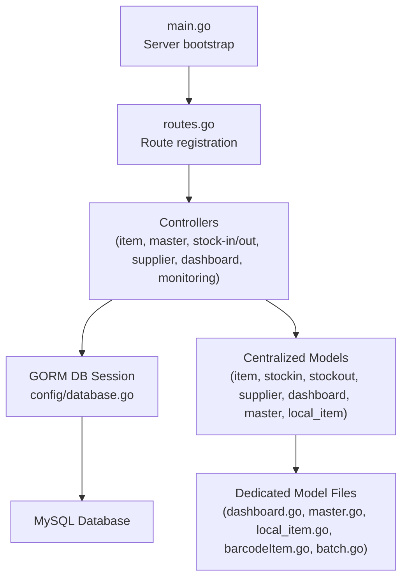
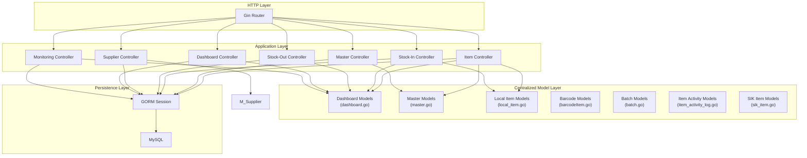
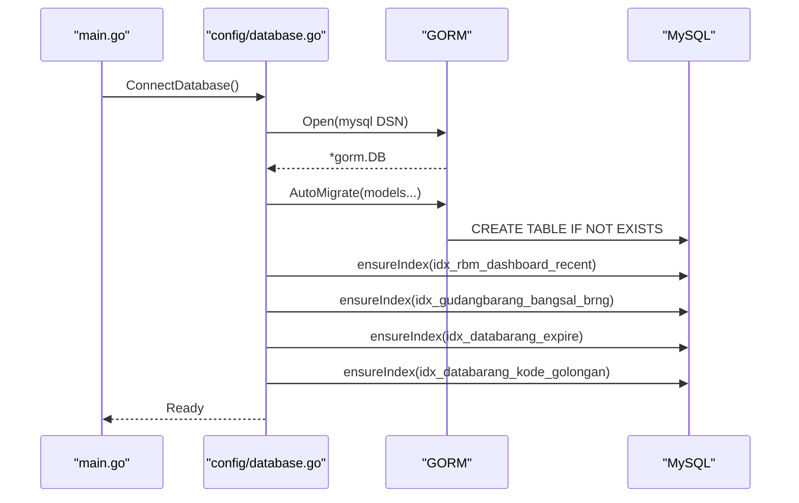
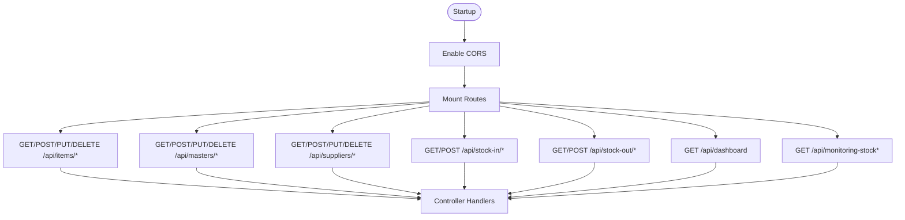
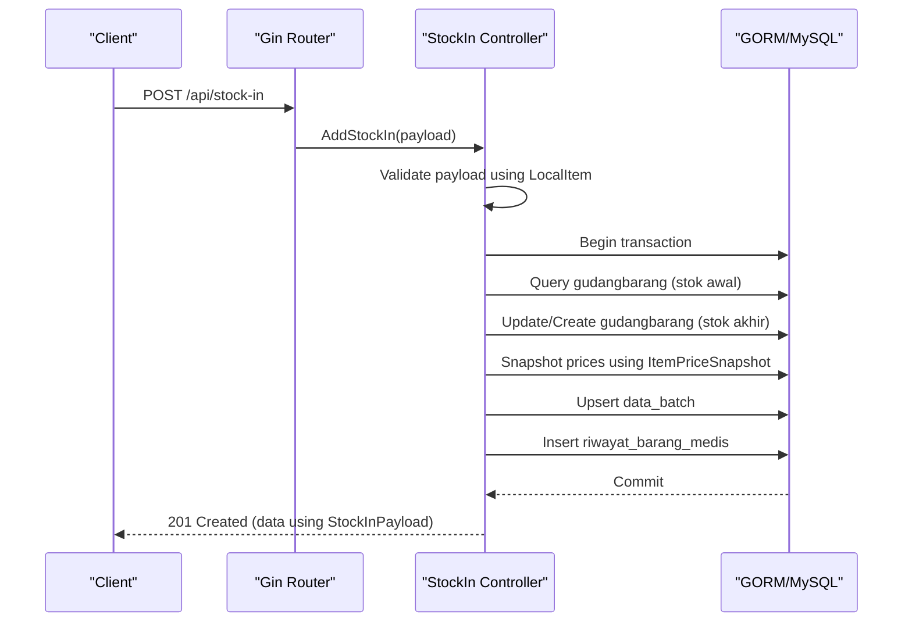
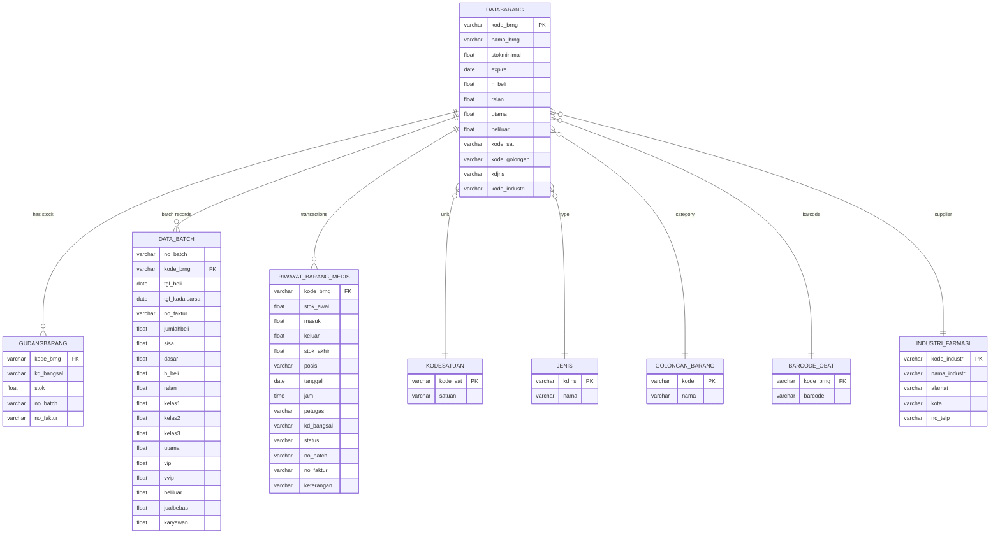
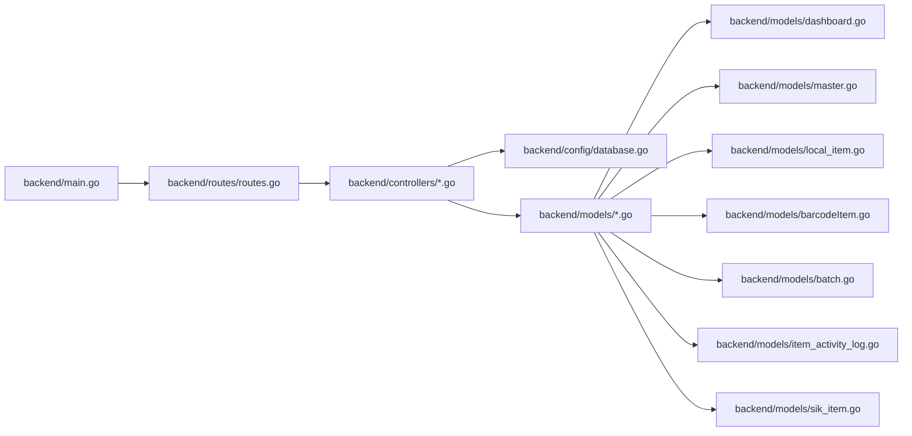

# Backend Architecture

<cite>
**Referenced Files in This Document**
- [main.go](file://backend/main.go)
- [database.go](file://backend/config/database.go)
- [routes.go](file://backend/routes/routes.go)
- [go.mod](file://backend/go.mod)
- [itemController.go](file://backend/controllers/itemController.go)
- [masterController.go](file://backend/controllers/masterController.go)
- [stockInController.go](file://backend/controllers/stockInController.go)
- [stockOutController.go](file://backend/controllers/stockOutController.go)
- [supplierController.go](file://backend/controllers/supplierController.go)
- [dashboard.go](file://backend/controllers/dashboard.go)
- [monitoringStockB.go](file://backend/controllers/monitoringStockB.go)
- [expireFilters.go](file://backend/controllers/expireFilters.go)
- [addItemController.go](file://backend/controllers/addItemController.go)
- [stockQuery.go](file://backend/controllers/stockQuery.go)
- [item.go](file://backend/models/item.go)
- [stockin.go](file://backend/models/stockin.go)
- [stockout.go](file://backend/models/stockout.go)
- [supplier.go](file://backend/models/supplier.go)
- [dashboard.go](file://backend/models/dashboard.go)
- [master.go](file://backend/models/master.go)
- [local_item.go](file://backend/models/local_item.go)
- [barcodeItem.go](file://backend/models/barcodeItem.go)
- [batch.go](file://backend/models/batch.go)
- [item_activity_log.go](file://backend/models/item_activity_log.go)
- [sik_item.go](file://backend/models/sik_item.go)
</cite>

## Update Summary
**Changes Made**
- Updated model layer documentation to reflect centralized model definitions
- Added new model files documentation for improved code organization
- Enhanced controller-model relationship explanations
- Updated architecture diagrams to show proper separation of concerns

## Table of Contents
1. [Introduction](#introduction)
2. [Project Structure](#project-structure)
3. [Core Components](#core-components)
4. [Architecture Overview](#architecture-overview)
5. [Detailed Component Analysis](#detailed-component-analysis)
6. [Model Refactoring and Centralization](#model-refactoring-and-centralization)
7. [Dependency Analysis](#dependency-analysis)
8. [Performance Considerations](#performance-considerations)
9. [Troubleshooting Guide](#troubleshooting-guide)
10. [Conclusion](#conclusion)
11. [Appendices](#appendices)

## Introduction
This document describes the backend architecture of the PPA system, focusing on the Model-View-Controller (MVC) pattern, Gin framework routing, and GORM ORM integration. The system has undergone significant refactoring to centralize model definitions, improving code organization, type safety, and maintainability. It explains database connection management, auto-migration processes, model relationships, controller-layer business logic organization, middleware usage, and API endpoint structure. Architectural decisions, design patterns, system boundaries, scalability considerations, performance optimization strategies, and security implementations are documented alongside the data flow across the backend.

## Project Structure
The backend follows a layered structure with centralized model management:
- Entry point initializes the HTTP server, database connection, CORS middleware, and routes.
- Routes define the API surface and bind handlers from controllers.
- Controllers encapsulate business logic and orchestrate data access via GORM.
- Models are now centrally organized in dedicated files for improved type safety and reusability.
- Config manages database connectivity and schema initialization.



**Diagram sources**
- [main.go:12-32](file://backend/main.go#L12-L32)
- [routes.go:9-35](file://backend/routes/routes.go#L9-L35)
- [database.go:13-83](file://backend/config/database.go#L13-L83)
- [dashboard.go:1-76](file://backend/models/dashboard.go#L1-L76)
- [master.go:1-16](file://backend/models/master.go#L1-L16)
- [local_item.go:1-34](file://backend/models/local_item.go#L1-L34)

**Section sources**
- [main.go:12-32](file://backend/main.go#L12-L32)
- [routes.go:9-35](file://backend/routes/routes.go#L9-L35)
- [database.go:13-83](file://backend/config/database.go#L13-L83)

## Core Components
- **Server Bootstrap and Middleware**
  - Initializes Gin router, registers CORS, health check endpoint, and mounts routes.
  - Uses default Gin middleware stack plus CORS.
- **Database Layer**
  - Establishes a persistent GORM session to MySQL.
  - Performs auto-migrations for core tables and ensures critical indexes.
- **Routing Layer**
  - Defines RESTful endpoints for items, masters, suppliers, stock-in, stock-out, dashboard, and monitoring.
- **Controller Layer**
  - Implements business logic for CRUD operations, transactions, and analytics.
  - Uses GORM for queries and updates, with manual SQL for complex aggregations.
- **Centralized Model Layer**
  - **Updated** Model definitions are now centralized in dedicated files for improved organization and type safety.
  - Includes comprehensive DTOs for dashboard analytics, master data operations, item management, and stock operations.
  - Provides clear separation between domain models and presentation models.

**Section sources**
- [main.go:12-32](file://backend/main.go#L12-L32)
- [database.go:13-83](file://backend/config/database.go#L13-L83)
- [routes.go:9-35](file://backend/routes/routes.go#L9-L35)
- [itemController.go:22-284](file://backend/controllers/itemController.go#L22-L284)
- [masterController.go:51-206](file://backend/controllers/masterController.go#L51-L206)
- [stockInController.go:13-383](file://backend/controllers/stockInController.go#L13-L383)
- [stockOutController.go:13-349](file://backend/controllers/stockOutController.go#L13-L349)
- [supplierController.go:10-80](file://backend/controllers/supplierController.go#L10-L80)
- [dashboard.go:43-305](file://backend/controllers/dashboard.go#L43-L305)
- [monitoringStockB.go:83-375](file://backend/controllers/monitoringStockB.go#L83-L375)
- [item.go:3-33](file://backend/models/item.go#L3-L33)
- [stockin.go:3-57](file://backend/models/stockin.go#L3-L57)
- [stockout.go:3-60](file://backend/models/stockout.go#L3-L60)
- [supplier.go:3-14](file://backend/models/supplier.go#L3-L14)

## Architecture Overview
The system adheres to MVC with centralized model management:
- **Model**: GORM-backed structs mapped to legacy MySQL tables, now organized in dedicated files for better maintainability.
- **View**: JSON responses produced by controllers using centralized model definitions.
- **Controller**: Orchestrates requests, validates payloads, executes transactions, and returns structured responses using shared model types.
- **Router**: Gin routes map HTTP verbs and paths to controller handlers.
- **Persistence**: GORM handles ORM operations; manual SQL used for analytics and joins.



**Diagram sources**
- [routes.go:9-35](file://backend/routes/routes.go#L9-L35)
- [itemController.go:22-284](file://backend/controllers/itemController.go#L22-L284)
- [masterController.go:51-206](file://backend/controllers/masterController.go#L51-L206)
- [stockInController.go:13-383](file://backend/controllers/stockInController.go#L13-L383)
- [stockOutController.go:13-349](file://backend/controllers/stockOutController.go#L13-L349)
- [supplierController.go:10-80](file://backend/controllers/supplierController.go#L10-L80)
- [dashboard.go:43-305](file://backend/controllers/dashboard.go#L43-L305)
- [monitoringStockB.go:83-375](file://backend/controllers/monitoringStockB.go#L83-L375)
- [database.go:13-83](file://backend/config/database.go#L13-L83)
- [dashboard.go:1-76](file://backend/models/dashboard.go#L1-L76)
- [master.go:1-16](file://backend/models/master.go#L1-L16)
- [local_item.go:1-34](file://backend/models/local_item.go#L1-L34)

## Detailed Component Analysis

### Database Connection Management and Auto-Migration
- **Connection**
  - Opens a GORM session to MySQL using a hardcoded DSN.
  - Exposes a global session pointer for use across packages.
- **Auto-Migration**
  - Migrates core tables during startup.
  - Ensures presence of critical indexes for dashboard and inventory analytics.
- **Index Management**
  - Utility checks and conditionally creates indexes to optimize analytics queries.



**Diagram sources**
- [main.go:12-32](file://backend/main.go#L12-L32)
- [database.go:13-83](file://backend/config/database.go#L13-L83)

**Section sources**
- [database.go:13-83](file://backend/config/database.go#L13-L83)
- [main.go:12-32](file://backend/main.go#L12-L32)

### Routing Structure and Middleware
- **Routes**
  - Register GET/POST/PUT/DELETE endpoints under /api for items, masters, suppliers, stock-in, stock-out, dashboard, and monitoring.
- **Middleware**
  - CORS enabled globally via default Gin router.
  - No additional middleware registered in the bootstrap.



**Diagram sources**
- [main.go:15-24](file://backend/main.go#L15-L24)
- [routes.go:9-35](file://backend/routes/routes.go#L9-L35)

**Section sources**
- [routes.go:9-35](file://backend/routes/routes.go#L9-L35)
- [main.go:15-24](file://backend/main.go#L15-L24)

### Controller-Layer Business Logic Organization
- **Item Management**
  - Fetch single item with extensive joins and computed fields using centralized Item model.
  - List items with pagination-like grouping and optional search.
  - Update and delete with barcode synchronization and cascading deletes.
- **Master Data**
  - Generic master endpoints for golongan, jenis, satuan with dynamic table resolution using MasterTableConfig.
  - Validation and CRUD with duplicate checks using MasterPayload.
- **Stock Operations**
  - Stock-in: transactional updates to gudangbarang, data_batch, riwayat_barang_medis using LocalItem and ItemPriceSnapshot.
  - Stock-out: transactional deduction with batch selection and history logging.
- **Suppliers**
  - CRUD for supplier entities using centralized Supplier model.
- **Dashboard**
  - Concurrent aggregation of summary metrics, expiry stats, distribution, location stock, movement, and recent activities using comprehensive Dashboard models.
- **Monitoring**
  - Period-aware stock monitoring with thresholds, turnover, and coverage calculations.



**Diagram sources**
- [stockInController.go:235-383](file://backend/controllers/stockInController.go#L235-L383)
- [routes.go:29](file://backend/routes/routes.go#L29)

**Section sources**
- [itemController.go:22-284](file://backend/controllers/itemController.go#L22-L284)
- [masterController.go:51-206](file://backend/controllers/masterController.go#L51-L206)
- [stockInController.go:13-383](file://backend/controllers/stockInController.go#L13-L383)
- [stockOutController.go:13-349](file://backend/controllers/stockOutController.go#L13-L349)
- [supplierController.go:10-80](file://backend/controllers/supplierController.go#L10-L80)
- [dashboard.go:43-305](file://backend/controllers/dashboard.go#L43-L305)
- [monitoringStockB.go:83-375](file://backend/controllers/monitoringStockB.go#L83-L375)

### Model Relationships and Data Flow
- **Centralized Models**
  - **Dashboard Models**: Comprehensive types for analytics including DashboardSummary, DashboardResponse, and pagination structures.
  - **Master Models**: Type-safe configurations for master data operations using MasterPayload and MasterTableConfig.
  - **Local Item Models**: Structured representation for item creation using LocalItem with proper JSON and GORM tags.
  - **Barcode Models**: Dedicated model for barcode management using BarcodeItem.
  - **Batch Models**: Complete batch tracking with pricing information using DataBatch.
  - **Item Activity Models**: Audit trail with timestamps using ItemActivityLog.
  - **SIK Item Models**: Simplified item representations using SIKItem.
- **Data Flow**
  - Controllers use centralized models for type safety and consistency.
  - GORM queries and raw SQL operate on legacy tables with proper model mappings.
  - Transactions ensure atomicity for stock movements.



**Diagram sources**
- [item.go:3-33](file://backend/models/item.go#L3-L33)
- [stockin.go:3-57](file://backend/models/stockin.go#L3-L57)
- [stockout.go:3-60](file://backend/models/stockout.go#L3-L60)
- [supplier.go:3-14](file://backend/models/supplier.go#L3-L14)
- [itemController.go:22-284](file://backend/controllers/itemController.go#L22-L284)
- [stockInController.go:13-383](file://backend/controllers/stockInController.go#L13-L383)
- [stockOutController.go:13-349](file://backend/controllers/stockOutController.go#L13-L349)
- [dashboard.go:43-305](file://backend/controllers/dashboard.go#L43-L305)
- [monitoringStockB.go:83-375](file://backend/controllers/monitoringStockB.go#L83-L375)

**Section sources**
- [item.go:3-33](file://backend/models/item.go#L3-L33)
- [stockin.go:3-57](file://backend/models/stockin.go#L3-L57)
- [stockout.go:3-60](file://backend/models/stockout.go#L3-L60)
- [supplier.go:3-14](file://backend/models/supplier.go#L3-L14)

### API Endpoint Structure
- **Items**
  - GET /api/items
  - POST /api/items
  - GET /api/items/:kodeBrng
  - PUT /api/items/:kodeBrng
  - DELETE /api/items/:kodeBrng
- **Masters**
  - GET /api/masters
  - POST /api/masters/:type
  - PUT /api/masters/:type/:code
  - DELETE /api/masters/:type/:code
- **Suppliers**
  - GET /api/suppliers
  - POST /api/suppliers
  - PUT /api/suppliers/:id
  - DELETE /api/suppliers/:id
- **Stock-In**
  - GET /api/stock-in/items
  - GET /api/stock-in/recent
  - GET /api/stock-in/history
  - POST /api/stock-in
- **Stock-Out**
  - GET /api/stock-out/items
  - GET /api/stock-out/batches
  - GET /api/stock-out/recent
  - GET /api/stock-out/history
  - POST /api/stock-out
- **Dashboard**
  - GET /api/dashboard
- **Monitoring**
  - GET /api/monitoring-stock
  - GET /api/monitoring-stock/details

**Section sources**
- [routes.go:9-35](file://backend/routes/routes.go#L9-L35)

## Model Refactoring and Centralization

### Centralized Model Architecture
The PPA system has undergone significant refactoring to centralize model definitions, improving code organization and type safety:

- **Dashboard Models** (`models/dashboard.go`)
  - Comprehensive dashboard analytics with cache key structures, response models, and pagination metadata.
  - Includes DashboardSummary, DashboardResponse, and supporting types for concurrent analytics operations.
  
- **Master Models** (`models/master.go`)
  - Type-safe configurations for master data operations using MasterPayload and MasterTableConfig.
  - Enables dynamic table resolution and consistent validation across different master types.
  
- **Local Item Models** (`models/local_item.go`)
  - Structured representation for item creation with proper JSON serialization and GORM tags.
  - Includes comprehensive pricing information and batch tracking for new item additions.
  
- **Barcode Models** (`models/barcodeItem.go`)
  - Dedicated model for barcode management with unique constraints and proper table mapping.
  
- **Batch Models** (`models/batch.go`)
  - Complete batch tracking with pricing information and inventory management capabilities.
  
- **Item Activity Models** (`models/item_activity_log.go`)
  - Audit trail with automatic timestamp generation and indexing for performance.
  
- **SIK Item Models** (`models/sik_item.go`)
  - Simplified item representations for external system integration.

### Benefits of Centralized Model Management
- **Improved Type Safety**: All models are defined in centralized files with proper GORM tags and JSON marshaling.
- **Enhanced Code Organization**: Clear separation between domain models and presentation models.
- **Better Reusability**: Shared model definitions across controllers and services.
- **Maintainable Schema Mapping**: All database table mappings are centralized for easier maintenance.
- **Consistent Naming Conventions**: Standardized naming and structuring across all model files.

```mermaid
graph TB
subgraph "Centralized Model Directory"
ModelsDir["backend/models/"]
DashboardModel["dashboard.go<br/>Dashboard analytics models"]
MasterModel["master.go<br/>Master data models"]
LocalItemModel["local_item.go<br/>Item creation models"]
BarcodeModel["barcodeItem.go<br/>Barcode management"]
BatchModel["batch.go<br/>Batch tracking"]
ItemActivityModel["item_activity_log.go<br/>Audit trail"]
SIKItemModel["sik_item.go<br/>External integration"]
ItemModel["item.go<br/>Core item model"]
StockInModel["stockin.go<br/>Stock-in operations"]
StockOutModel["stockout.go<br/>Stock-out operations"]
SupplierModel["supplier.go<br/>Supplier management"]
End
```

**Diagram sources**
- [dashboard.go:1-76](file://backend/models/dashboard.go#L1-L76)
- [master.go:1-16](file://backend/models/master.go#L1-L16)
- [local_item.go:1-34](file://backend/models/local_item.go#L1-L34)
- [barcodeItem.go:1-12](file://backend/models/barcodeItem.go#L1-L12)
- [batch.go:1-29](file://backend/models/batch.go#L1-L29)
- [item_activity_log.go:1-14](file://backend/models/item_activity_log.go#L1-L14)
- [sik_item.go:1-32](file://backend/models/sik_item.go#L1-L32)
- [item.go:1-49](file://backend/models/item.go#L1-L49)
- [stockin.go:1-57](file://backend/models/stockin.go#L1-L57)
- [stockout.go:1-60](file://backend/models/stockout.go#L1-L60)
- [supplier.go:1-14](file://backend/models/supplier.go#L1-L14)

**Section sources**
- [dashboard.go:1-76](file://backend/models/dashboard.go#L1-L76)
- [master.go:1-16](file://backend/models/master.go#L1-L16)
- [local_item.go:1-34](file://backend/models/local_item.go#L1-L34)
- [barcodeItem.go:1-12](file://backend/models/barcodeItem.go#L1-L12)
- [batch.go:1-29](file://backend/models/batch.go#L1-L29)
- [item_activity_log.go:1-14](file://backend/models/item_activity_log.go#L1-L14)
- [sik_item.go:1-32](file://backend/models/sik_item.go#L1-L32)
- [item.go:1-49](file://backend/models/item.go#L1-L49)
- [stockin.go:1-57](file://backend/models/stockin.go#L1-L57)
- [stockout.go:1-60](file://backend/models/stockout.go#L1-L60)
- [supplier.go:1-14](file://backend/models/supplier.go#L1-L14)

## Dependency Analysis
- **Internal Dependencies**
  - main.go depends on config, models, and routes.
  - routes.go depends on controllers.
  - controllers depend on centralized models for type safety and consistency.
- **External Dependencies**
  - Gin for HTTP routing and middleware.
  - GORM with MySQL driver for ORM.
  - MySQL driver for database connectivity.



**Diagram sources**
- [main.go:3-10](file://backend/main.go#L3-L10)
- [routes.go:3-7](file://backend/routes/routes.go#L3-L7)
- [database.go:3-9](file://backend/config/database.go#L3-L9)
- [go.mod:5-44](file://backend/go.mod#L5-L44)
- [dashboard.go:1-76](file://backend/models/dashboard.go#L1-L76)
- [master.go:1-16](file://backend/models/master.go#L1-L16)
- [local_item.go:1-34](file://backend/models/local_item.go#L1-L34)

**Section sources**
- [go.mod:5-44](file://backend/go.mod#L5-L44)
- [main.go:3-10](file://backend/main.go#L3-L10)
- [routes.go:3-7](file://backend/routes/routes.go#L3-L7)
- [database.go:3-9](file://backend/config/database.go#L3-L9)

## Performance Considerations
- **Concurrency and Caching**
  - Dashboard controller uses goroutines to parallelize multiple analytics queries and caches responses with TTL to reduce repeated heavy computations.
  - **Updated** Centralized model definitions improve cache efficiency through consistent data structures.
- **Query Optimization**
  - Pre-aggregations and indexed views (e.g., gudang AP stock join) minimize expensive joins and improve throughput.
  - Index creation for dashboard and inventory analytics ensures fast filtering and sorting.
- **Pagination and Limits**
  - Stock history endpoints support page and limit parameters with enforced upper bounds to prevent excessive loads.
- **Transactional Integrity**
  - Stock-in and stock-out operations wrap multiple writes in a single transaction to maintain consistency and rollback on errors.
- **Manual SQL for Analytics**
  - Controllers use raw SQL for complex aggregations and time-series analytics to leverage database capabilities efficiently.
- **Model Serialization Efficiency**
  - **Updated** Centralized models with optimized JSON tags reduce serialization overhead and improve response times.

**Section sources**
- [dashboard.go:27-305](file://backend/controllers/dashboard.go#L27-L305)
- [stockInController.go:248-383](file://backend/controllers/stockInController.go#L248-L383)
- [stockOutController.go:201-349](file://backend/controllers/stockOutController.go#L201-L349)
- [stockQuery.go:5-15](file://backend/controllers/stockQuery.go#L5-L15)
- [database.go:50-83](file://backend/config/database.go#L50-L83)

## Troubleshooting Guide
- **Database Connectivity**
  - Verify DSN correctness and network access to MySQL.
  - Check for panic on connection failure during startup.
- **Migration Failures**
  - Review migration logs and ensure target tables are writable.
  - Confirm index creation does not conflict with existing definitions.
- **Controller Errors**
  - Binding errors return 400 with error details.
  - Transaction rollbacks on constraint violations or insufficient stock.
  - Analytics queries return 500 with detailed error messages when aggregation fails.
- **CORS Issues**
  - Ensure client requests include appropriate headers; CORS is enabled globally.
- **Model Definition Issues**
  - **Updated** Verify that centralized model files are properly imported and accessible.
  - Check for GORM tag conflicts and JSON serialization issues.
  - Ensure table name mappings match database schema.

**Section sources**
- [database.go:13-83](file://backend/config/database.go#L13-L83)
- [itemController.go:221-225](file://backend/controllers/itemController.go#L221-L225)
- [stockInController.go:248-272](file://backend/controllers/stockInController.go#L248-L272)
- [stockOutController.go:201-234](file://backend/controllers/stockOutController.go#L201-L234)

## Conclusion
The PPA backend employs a clean MVC separation with Gin and GORM, targeting a legacy MySQL schema. The recent refactoring to centralize model definitions has significantly improved code organization, type safety, and maintainability. The system emphasizes transactional integrity for stock operations, concurrent analytics for dashboards, and pragmatic SQL for performance-critical queries. The centralized model architecture enables scalable enhancements through modular controllers and reusable, type-safe data structures.

## Appendices

### Security Considerations
- **Transport Security**
  - Deploy behind TLS termination (not shown here) to encrypt traffic.
- **Input Validation**
  - Controllers validate payloads and enforce constraints (e.g., positive quantities, required fields).
  - **Updated** Centralized models provide consistent validation through proper struct tags.
- **Access Control**
  - No authentication/authorization middleware is present; consider adding JWT/session middleware and route guards as needed.

### Scalability Recommendations
- **Horizontal Scaling**
  - Stateless controllers; scale out behind a load balancer.
- **Database Scaling**
  - Add read replicas for analytics-heavy endpoints; partition large tables if growth demands.
- **Caching**
  - Expand cache coverage for frequently accessed lists and dashboards.
  - **Updated** Centralized model definitions improve cache hit rates through consistent data structures.
- **Observability**
  - Instrument endpoints with metrics and structured logs for latency and error rates.
- **Model Evolution**
  - **Updated** Centralized model files facilitate easier schema migrations and versioning.
  - Maintain backward compatibility when evolving model structures.