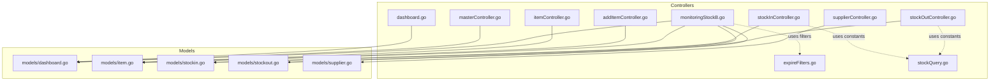
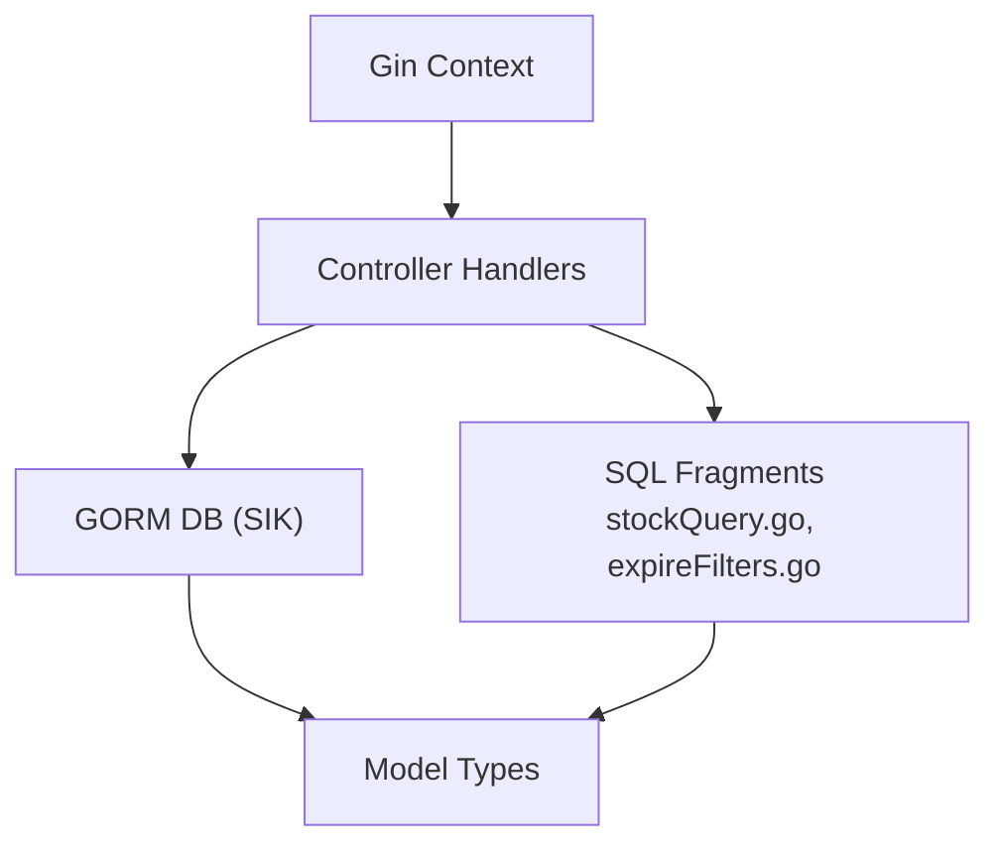
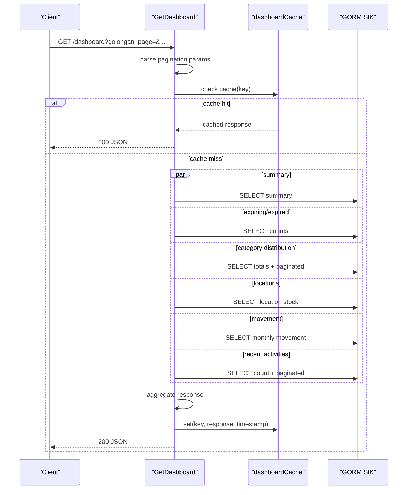
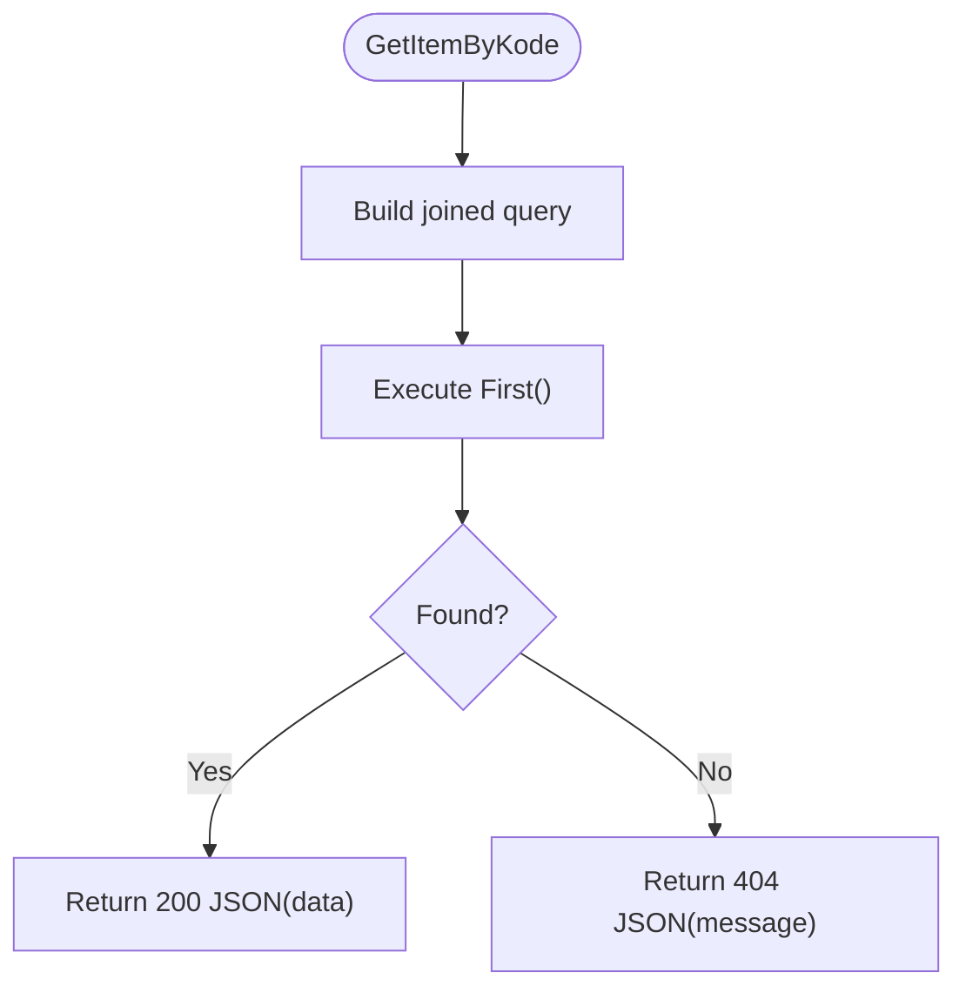
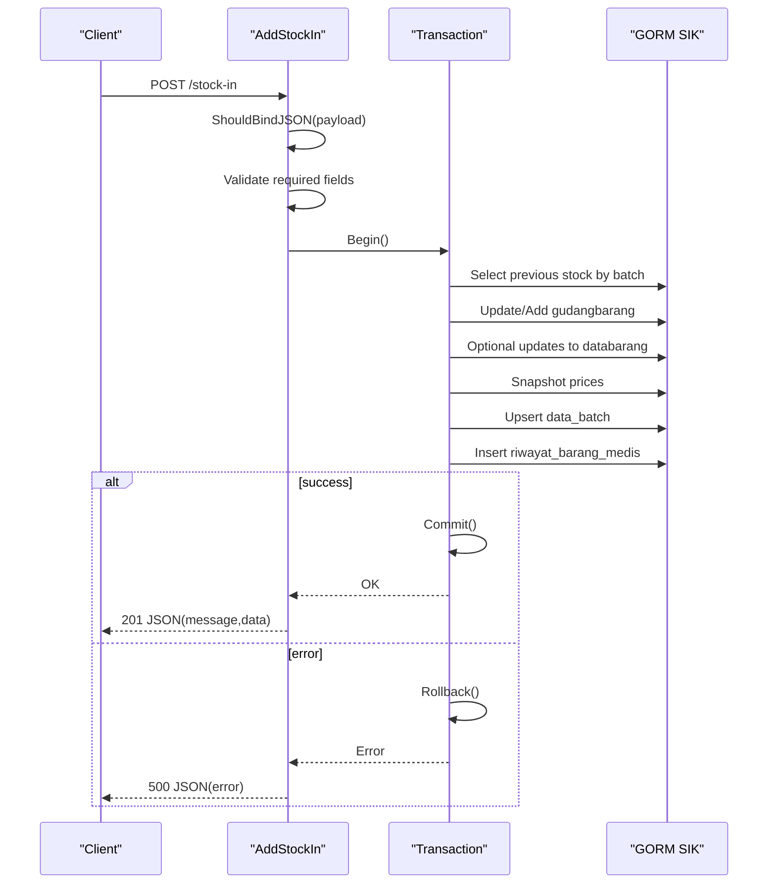
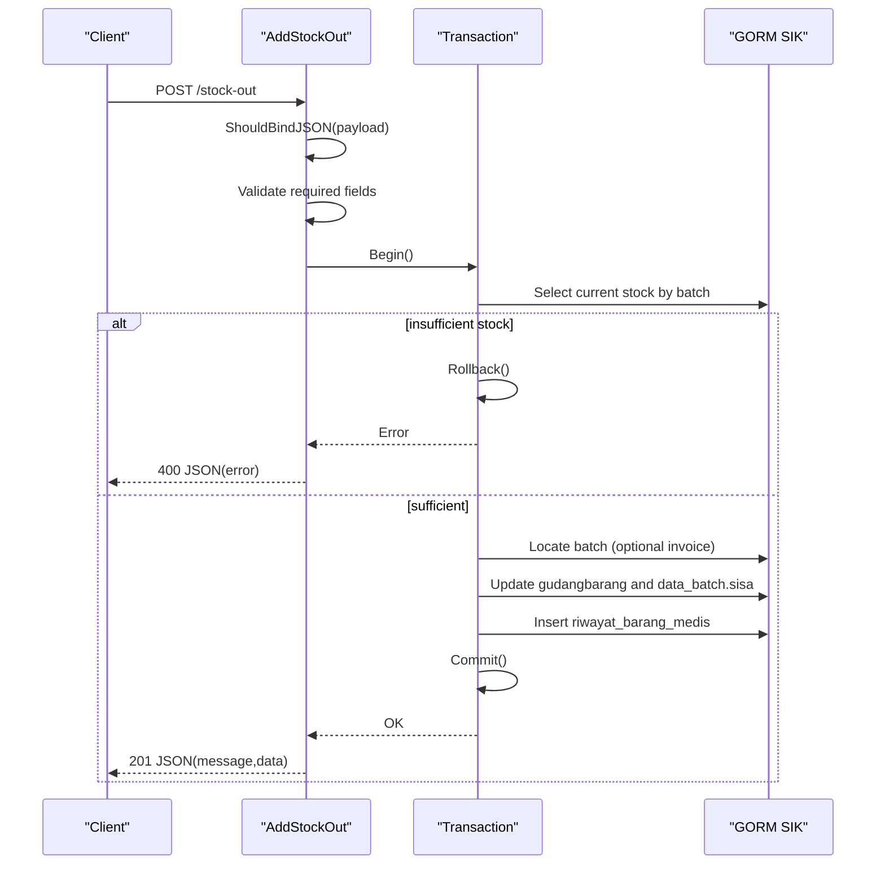
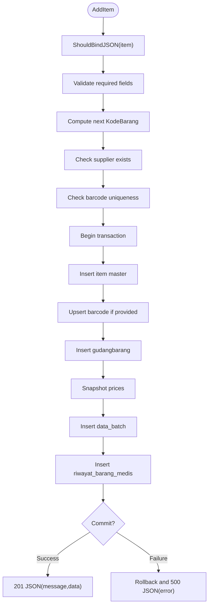
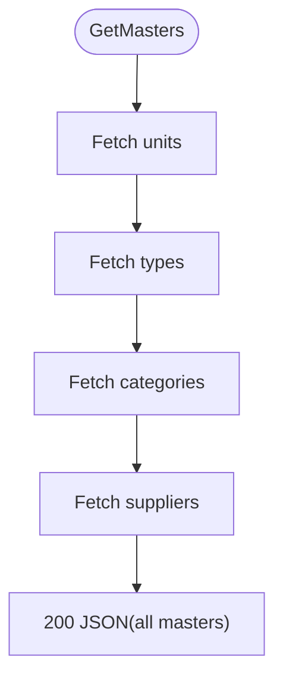
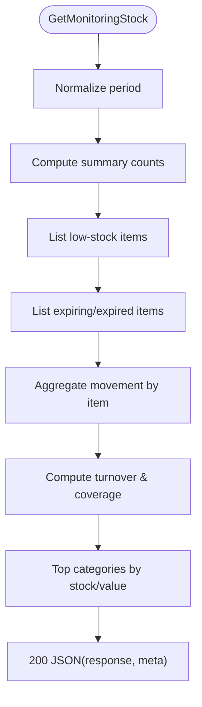
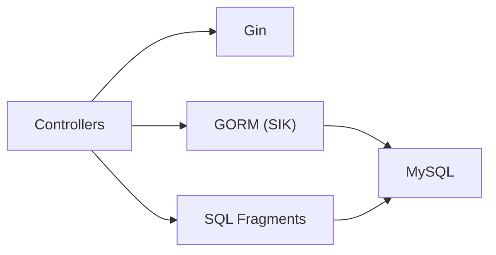

# Controller Layer & Business Logic

<cite>
**Referenced Files in This Document**
- [dashboard.go](file://backend/controllers/dashboard.go)
- [itemController.go](file://backend/controllers/itemController.go)
- [masterController.go](file://backend/controllers/masterController.go)
- [stockInController.go](file://backend/controllers/stockInController.go)
- [stockOutController.go](file://backend/controllers/stockOutController.go)
- [addItemController.go](file://backend/controllers/addItemController.go)
- [supplierController.go](file://backend/controllers/supplierController.go)
- [expireFilters.go](file://backend/controllers/expireFilters.go)
- [monitoringStockB.go](file://backend/controllers/monitoringStockB.go)
- [stockQuery.go](file://backend/controllers/stockQuery.go)
- [dashboard.go](file://backend/models/dashboard.go)
- [item.go](file://backend/models/item.go)
- [stockin.go](file://backend/models/stockin.go)
- [stockout.go](file://backend/models/stockout.go)
- [supplier.go](file://backend/models/supplier.go)
</cite>

## Table of Contents
1. [Introduction](#introduction)
2. [Project Structure](#project-structure)
3. [Core Components](#core-components)
4. [Architecture Overview](#architecture-overview)
5. [Detailed Component Analysis](#detailed-component-analysis)
6. [Dependency Analysis](#dependency-analysis)
7. [Performance Considerations](#performance-considerations)
8. [Troubleshooting Guide](#troubleshooting-guide)
9. [Conclusion](#conclusion)

## Introduction
This document provides comprehensive controller-layer documentation for the PPA system, focusing on the Model-View-Controller (MVC) pattern implementation. Controllers orchestrate business logic, coordinate between models and views, and handle HTTP requests/responses via the Gin framework. It covers:
- Dashboard controller’s multi-threaded analytics, caching, and performance optimization
- Stock operation controllers’ transaction handling, validation, and error management
- Master data controllers’ CRUD operations and data integrity enforcement
- Middleware integration, request validation, and response formatting patterns
- Concurrency, thread safety, and resource management strategies

## Project Structure
Controllers reside under backend/controllers and are organized by domain:
- Dashboard analytics and reporting
- Item lifecycle (CRUD and lookup)
- Stock operations (inbound/outbound)
- Master data maintenance (categories, units, types)
- Suppliers
- Monitoring and expiration tracking

**Diagram sources**
- [dashboard.go:1-307](file://backend/controllers/dashboard.go#L1-L307)
- [itemController.go:1-284](file://backend/controllers/itemController.go#L1-L284)
- [stockInController.go:1-383](file://backend/controllers/stockInController.go#L1-L383)
- [stockOutController.go:1-377](file://backend/controllers/stockOutController.go#L1-L377)
- [addItemController.go:1-218](file://backend/controllers/addItemController.go#L1-L218)
- [masterController.go:1-206](file://backend/controllers/masterController.go#L1-L206)
- [supplierController.go:1-80](file://backend/controllers/supplierController.go#L1-L80)
- [monitoringStockB.go:1-520](file://backend/controllers/monitoringStockB.go#L1-L520)
- [expireFilters.go:1-11](file://backend/controllers/expireFilters.go#L1-L11)
- [stockQuery.go:1-15](file://backend/controllers/stockQuery.go#L1-L15)
- [dashboard.go:1-60](file://backend/models/dashboard.go#L1-L60)
- [item.go:1-33](file://backend/models/item.go#L1-L33)
- [stockin.go:1-57](file://backend/models/stockin.go#L1-L57)
- [stockout.go:1-60](file://backend/models/stockout.go#L1-L60)
- [supplier.go:1-14](file://backend/models/supplier.go#L1-L14)

**Section sources**
- [dashboard.go:1-307](file://backend/controllers/dashboard.go#L1-L307)
- [itemController.go:1-284](file://backend/controllers/itemController.go#L1-L284)
- [stockInController.go:1-383](file://backend/controllers/stockInController.go#L1-L383)
- [stockOutController.go:1-377](file://backend/controllers/stockOutController.go#L1-L377)
- [addItemController.go:1-218](file://backend/controllers/addItemController.go#L1-L218)
- [masterController.go:1-206](file://backend/controllers/masterController.go#L1-L206)
- [supplierController.go:1-80](file://backend/controllers/supplierController.go#L1-L80)
- [monitoringStockB.go:1-520](file://backend/controllers/monitoringStockB.go#L1-L520)
- [expireFilters.go:1-11](file://backend/controllers/expireFilters.go#L1-L11)
- [stockQuery.go:1-15](file://backend/controllers/stockQuery.go#L1-L15)

## Core Components
- Dashboard controller: Aggregates analytics via goroutines, paginates, caches responses, and returns structured JSON.
- Item controller: Retrieves items by code, lists items with search and joins, updates attributes, deletes item records and related entries.
- Stock-in controller: Searches items, fetches recent history, paginated inbound history with summaries, validates payload, and executes atomic transactions.
- Stock-out controller: Searches items, selects batch options, paginated outbound history with summaries, validates payload, and executes atomic transactions.
- Add item controller: Validates new item creation, assigns next code, checks supplier/barcode uniqueness, and performs multi-table inserts within a transaction.
- Master data controller: Generic CRUD for categories, units, and types; enforces uniqueness and entity-specific constraints.
- Supplier controller: CRUD for suppliers with JSON binding and basic validation.
- Monitoring controller: Stock coverage, turnover, expiry alerts, and grouped stats with configurable observation windows.

**Section sources**
- [dashboard.go:43-306](file://backend/controllers/dashboard.go#L43-L306)
- [itemController.go:22-283](file://backend/controllers/itemController.go#L22-L283)
- [stockInController.go:13-382](file://backend/controllers/stockInController.go#L13-L382)
- [stockOutController.go:13-376](file://backend/controllers/stockOutController.go#L13-L376)
- [addItemController.go:27-217](file://backend/controllers/addItemController.go#L27-L217)
- [masterController.go:51-205](file://backend/controllers/masterController.go#L51-L205)
- [supplierController.go:10-79](file://backend/controllers/supplierController.go#L10-L79)
- [monitoringStockB.go:83-374](file://backend/controllers/monitoringStockB.go#L83-L374)

## Architecture Overview
Controllers depend on:
- Gin context for request handling and JSON responses
- GORM v2 via a shared database connection for queries and transactions
- Shared SQL fragments for reusable joins and filters

**Diagram sources**
- [dashboard.go:3-11](file://backend/controllers/dashboard.go#L3-L11)
- [stockInController.go:3-11](file://backend/controllers/stockInController.go#L3-L11)
- [stockOutController.go:3-11](file://backend/controllers/stockOutController.go#L3-L11)
- [addItemController.go:3-10](file://backend/controllers/addItemController.go#L3-L10)
- [masterController.go:3-9](file://backend/controllers/masterController.go#L3-L9)
- [supplierController.go:3-8](file://backend/controllers/supplierController.go#L3-L8)
- [monitoringStockB.go:3-10](file://backend/controllers/monitoringStockB.go#L3-L10)
- [stockQuery.go:3-14](file://backend/controllers/stockQuery.go#L3-L14)
- [expireFilters.go:3-10](file://backend/controllers/expireFilters.go#L3-L10)

## Detailed Component Analysis

### Dashboard Controller
Responsibilities:
- Parse pagination parameters with defaults and sanitization
- Concurrently compute summary metrics, expiring/expired counts, category distribution, location stock, movement trends, and recent activities
- Aggregate results into a single response with pagination metadata
- Cache responses keyed by pagination parameters with TTL
- Return unified JSON response

Concurrency and caching:
- Uses WaitGroup to synchronize six goroutines
- Uses RWMutex to guard an in-memory cache keyed by pagination parameters
- TTL-based cache eviction ensures freshness

Validation and error handling:
- Parses numeric query params with fallback defaults
- Captures first error across goroutines and returns a single error response

**Diagram sources**
- [dashboard.go:43-306](file://backend/controllers/dashboard.go#L43-L306)

**Section sources**
- [dashboard.go:13-306](file://backend/controllers/dashboard.go#L13-L306)
- [dashboard.go:1-60](file://backend/models/dashboard.go#L1-L60)

### Item Controller
Responsibilities:
- Retrieve item by code with rich joins (supplier, unit, category, type, barcode, latest batch)
- List items with optional search across name, code, barcode, batch, and invoice
- Update item attributes and barcode mapping
- Delete item and cascade cleanup across barcode, inventory, and batch tables

Validation and error handling:
- Returns 404 when item not found
- JSON bind errors return 400
- Updates and deletes return 500 on DB errors

**Diagram sources**
- [itemController.go:22-96](file://backend/controllers/itemController.go#L22-L96)

**Section sources**
- [itemController.go:22-283](file://backend/controllers/itemController.go#L22-L283)
- [item.go:1-33](file://backend/models/item.go#L1-L33)

### Stock-In Controller
Responsibilities:
- Search items for inbound entry
- Fetch recent inbound records
- Paginated inbound history with totals and summaries
- Validate payload and execute atomic transaction:
  - Update or insert warehouse stock by batch/invoice
  - Optionally update purchase price and expiry in item master
  - Snapshot current pricing and persist batch ledger
  - Record transaction history

Validation and error handling:
- Payload validation for required fields
- Transaction rollback on any failure
- Returns 400 for insufficient stock or invalid batch
- Returns 500 for DB errors with partial outcomes described

**Diagram sources**
- [stockInController.go:235-382](file://backend/controllers/stockInController.go#L235-L382)

**Section sources**
- [stockInController.go:13-382](file://backend/controllers/stockInController.go#L13-L382)
- [stockin.go:1-57](file://backend/models/stockin.go#L1-L57)

### Stock-Out Controller
Responsibilities:
- Search items for outbound entry
- List batch options with expiry and pricing
- Paginated outbound history with totals and summaries
- Validate payload and execute atomic transaction:
  - Verify sufficient stock
  - Locate matching batch (optionally filtered by invoice)
  - Update warehouse stock and batch residual
  - Record transaction history

Validation and error handling:
- Payload validation for required fields
- Returns 400 for insufficient stock or missing batch
- Transaction rollback on failures
- Returns 500 for DB errors with partial outcomes described

**Diagram sources**
- [stockOutController.go:189-281](file://backend/controllers/stockOutController.go#L189-L281)

**Section sources**
- [stockOutController.go:13-376](file://backend/controllers/stockOutController.go#L13-L376)
- [stockout.go:1-60](file://backend/models/stockout.go#L1-L60)

### Add Item Controller
Responsibilities:
- Validate new item payload and required fields
- Assign next item code based on highest existing code
- Verify supplier existence and barcode uniqueness
- Execute atomic transaction:
  - Insert item master
  - Insert barcode mapping (if provided)
  - Initialize warehouse stock and batch ledger
  - Record initial transaction history

Validation and error handling:
- Returns 400 for missing/invalid fields or unknown supplier
- Returns 400 for duplicate barcode
- Transaction rollback on any failure
- Returns 500 for DB errors with detailed messages

**Diagram sources**
- [addItemController.go:27-217](file://backend/controllers/addItemController.go#L27-L217)

**Section sources**
- [addItemController.go:27-217](file://backend/controllers/addItemController.go#L27-L217)
- [item.go:1-33](file://backend/models/item.go#L1-L33)

### Master Data Controller
Responsibilities:
- Retrieve all master entities (units, types, categories, suppliers) in a single response
- Add master entity with code/name validation and uniqueness check
- Update master entity with name validation
- Delete master entity with existence check

Validation and error handling:
- Returns 400 for invalid type or missing/empty fields
- Returns 404 when updating/deleting non-existent entity
- Returns 500 for DB errors with details

**Diagram sources**
- [masterController.go:51-95](file://backend/controllers/masterController.go#L51-L95)

**Section sources**
- [masterController.go:51-205](file://backend/controllers/masterController.go#L51-L205)

### Supplier Controller
Responsibilities:
- List suppliers
- Add supplier via JSON binding
- Update supplier by ID via JSON binding
- Delete supplier by ID

Validation and error handling:
- Returns 400 for binding errors
- Returns 200/201 with JSON payload

**Section sources**
- [supplierController.go:10-79](file://backend/controllers/supplierController.go#L10-L79)
- [supplier.go:1-14](file://backend/models/supplier.go#L1-L14)

### Monitoring Stock Controller
Responsibilities:
- Compute critical/restock/expired/expiring soon counts
- List low-stock and expiring items with thresholds
- Calculate turnover ratios and coverage days over configurable periods
- Group by category with stock/value metrics
- Support detailed filtering by type and optional search

Validation and error handling:
- Returns 400 for invalid type parameter
- Returns 500 for DB errors with details

**Diagram sources**
- [monitoringStockB.go:83-374](file://backend/controllers/monitoringStockB.go#L83-L374)

**Section sources**
- [monitoringStockB.go:83-519](file://backend/controllers/monitoringStockB.go#L83-L519)
- [expireFilters.go:3-10](file://backend/controllers/expireFilters.go#L3-L10)
- [stockQuery.go:3-14](file://backend/controllers/stockQuery.go#L3-L14)

## Dependency Analysis
- Controllers import Gin and share a single GORM DB instance for all operations.
- Reusable SQL fragments encapsulate common joins and filters to reduce duplication and improve maintainability.
- Models define DTOs aligned to database tables and JSON serialization.

**Diagram sources**
- [dashboard.go:3-11](file://backend/controllers/dashboard.go#L3-L11)
- [stockInController.go:3-11](file://backend/controllers/stockInController.go#L3-L11)
- [stockOutController.go:3-11](file://backend/controllers/stockOutController.go#L3-L11)
- [addItemController.go:3-10](file://backend/controllers/addItemController.go#L3-L10)
- [masterController.go:3-9](file://backend/controllers/masterController.go#L3-L9)
- [supplierController.go:3-8](file://backend/controllers/supplierController.go#L3-L8)
- [monitoringStockB.go:3-10](file://backend/controllers/monitoringStockB.go#L3-L10)
- [stockQuery.go:3-14](file://backend/controllers/stockQuery.go#L3-L14)
- [expireFilters.go:3-10](file://backend/controllers/expireFilters.go#L3-L10)

**Section sources**
- [dashboard.go:3-11](file://backend/controllers/dashboard.go#L3-L11)
- [stockInController.go:3-11](file://backend/controllers/stockInController.go#L3-L11)
- [stockOutController.go:3-11](file://backend/controllers/stockOutController.go#L3-L11)
- [addItemController.go:3-10](file://backend/controllers/addItemController.go#L3-L10)
- [masterController.go:3-9](file://backend/controllers/masterController.go#L3-L9)
- [supplierController.go:3-8](file://backend/controllers/supplierController.go#L3-L8)
- [monitoringStockB.go:3-10](file://backend/controllers/monitoringStockB.go#L3-L10)
- [stockQuery.go:3-14](file://backend/controllers/stockQuery.go#L3-L14)
- [expireFilters.go:3-10](file://backend/controllers/expireFilters.go#L3-L10)

## Performance Considerations
- Dashboard controller:
  - Parallelizes independent queries using goroutines and WaitGroup
  - Uses an in-process cache keyed by pagination parameters with TTL to reduce repeated heavy queries
  - Thread-safe reads/writes guarded by RWMutex
- Stock operations:
  - Uses explicit transactions to ensure atomicity and consistency across multiple writes
  - Pre-aggregations in summary queries reduce join costs when search is absent
- Monitoring:
  - Uses configurable observation windows and pre-aggregation to compute turnover and coverage efficiently
  - Filters out invalid/expired dates early to avoid unnecessary computations

[No sources needed since this section provides general guidance]

## Troubleshooting Guide
Common issues and resolutions:
- Request validation failures:
  - Controllers return 400 with error details when JSON binding fails or required fields are missing
- Database errors:
  - Controllers return 500 with detailed messages when operations fail after transaction start
- Insufficient stock:
  - Outbound endpoint returns 400 when requested quantity exceeds available stock
- Missing or invalid batch:
  - Outbound endpoint returns 404 when batch cannot be located
- Duplicate barcode:
  - New item endpoint returns 400 when barcode is already used
- Unknown supplier:
  - New item endpoint returns 400 when supplier code does not exist
- Cache-related anomalies:
  - Dashboard cache TTL prevents stale data beyond configured interval; verify pagination parameters match to benefit from cache

**Section sources**
- [itemController.go:221-225](file://backend/controllers/itemController.go#L221-L225)
- [stockInController.go:242-245](file://backend/controllers/stockInController.go#L242-L245)
- [stockOutController.go:196-199](file://backend/controllers/stockOutController.go#L196-L199)
- [stockOutController.go:209-213](file://backend/controllers/stockOutController.go#L209-L213)
- [addItemController.go:63-66](file://backend/controllers/addItemController.go#L63-L66)
- [addItemController.go:75-79](file://backend/controllers/addItemController.go#L75-L79)

## Conclusion
The PPA controller layer implements a robust MVC pattern with clear separation of concerns:
- Controllers handle HTTP concerns, validation, transactions, and response formatting
- Models define data contracts and align with database schemas
- Shared SQL fragments and caching strategies optimize performance
- Transactions ensure data integrity across stock operations
- Monitoring and dashboard controllers provide actionable insights with concurrency and caching