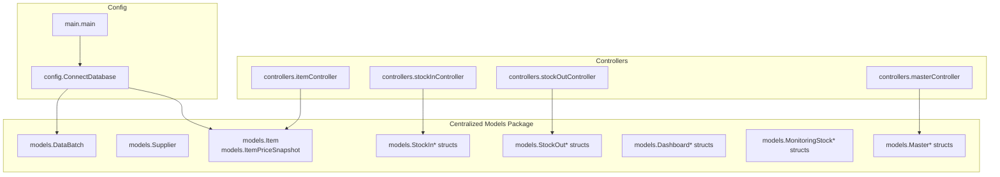
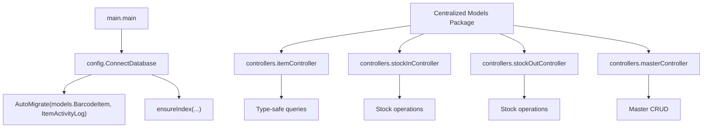
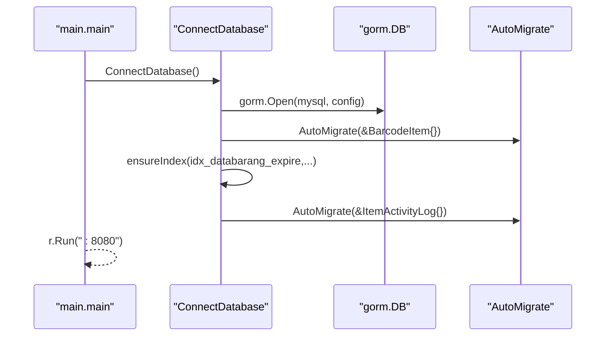
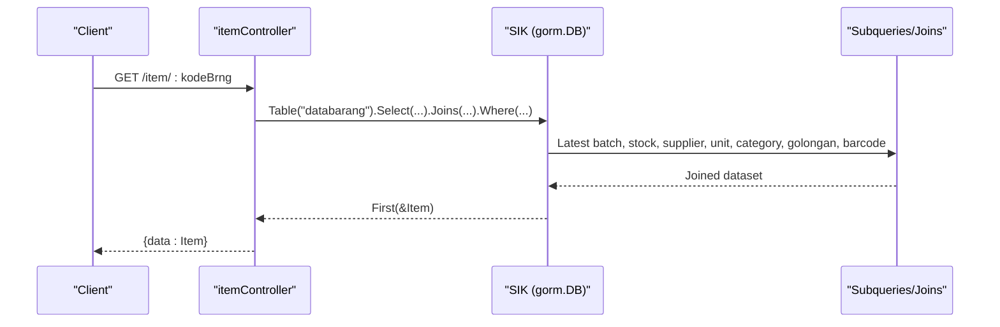
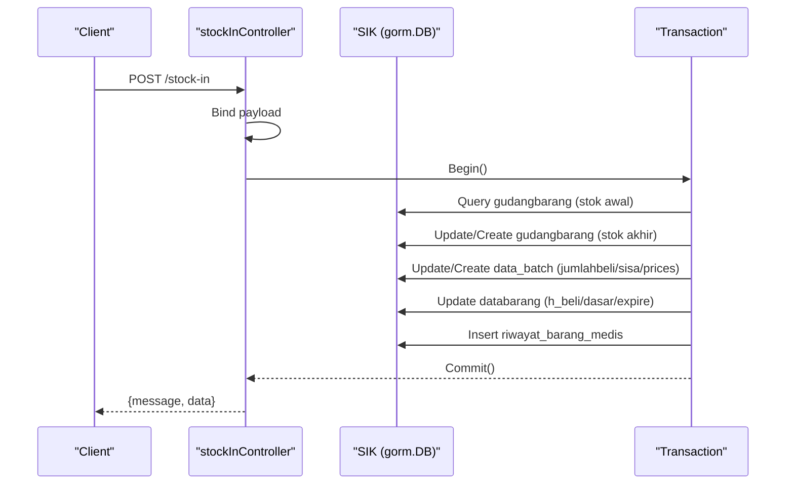
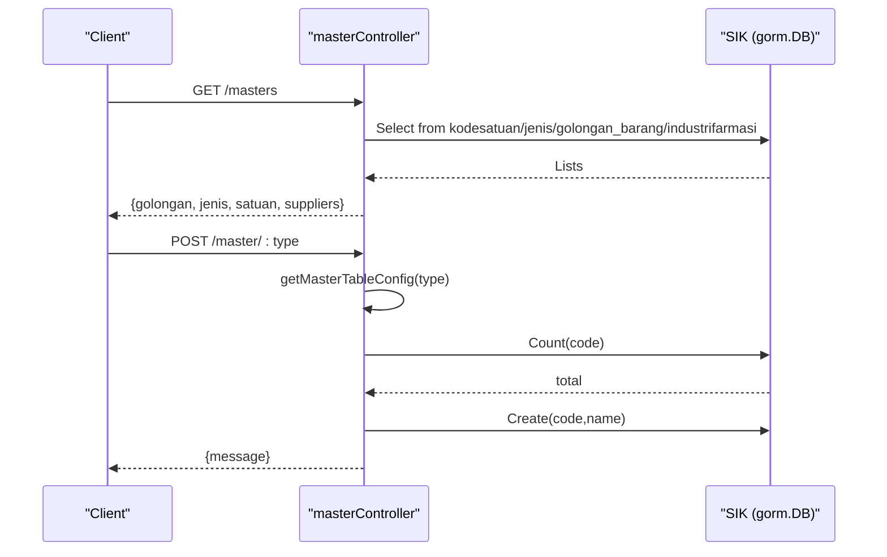
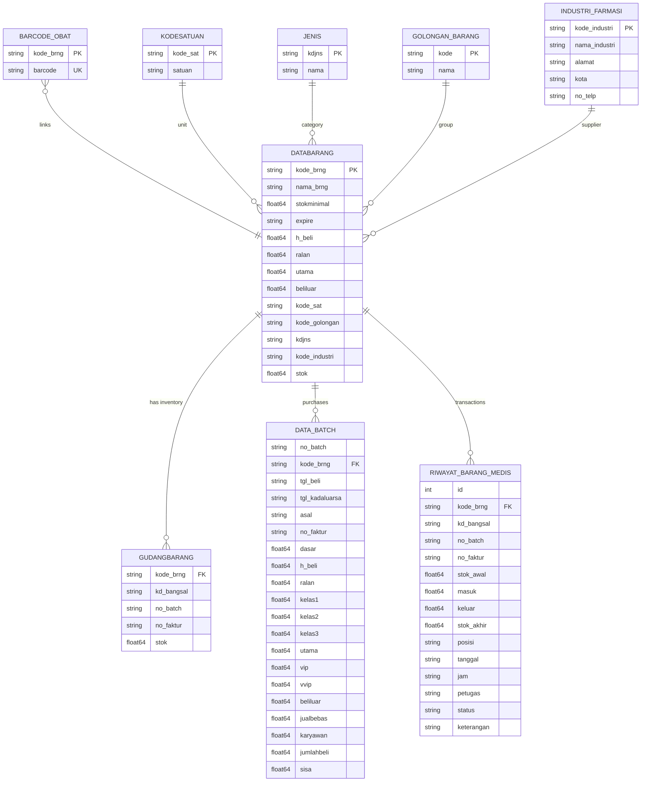
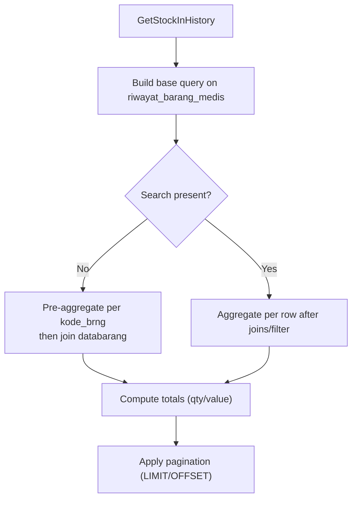
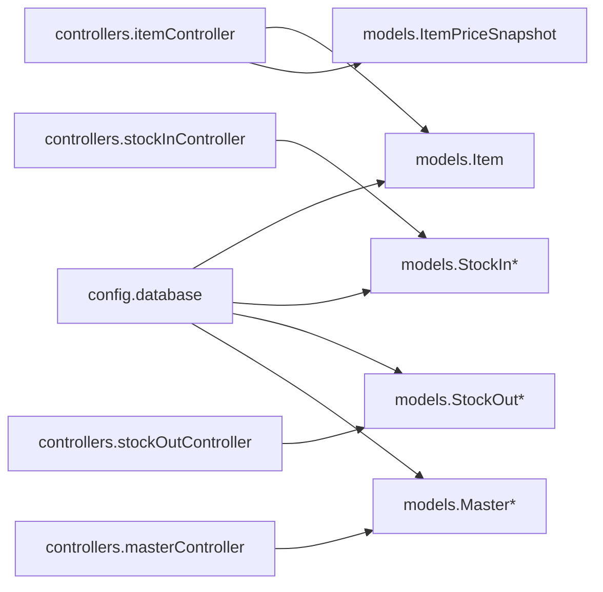

# Data Models & ORM Mapping

<cite>
**Referenced Files in This Document**
- [database.go](file://backend/config/database.go)
- [main.go](file://backend/main.go)
- [item.go](file://backend/models/item.go)
- [supplier.go](file://backend/models/supplier.go)
- [stockin.go](file://backend/models/stockin.go)
- [stockout.go](file://backend/models/stockout.go)
- [batch.go](file://backend/models/batch.go)
- [dashboard.go](file://backend/models/dashboard.go)
- [monitoringStock.go](file://backend/models/monitoringStock.go)
- [master.go](file://backend/models/master.go)
</cite>

## Update Summary
**Changes Made**
- Added documentation for centralized model files that were moved from controllers
- Updated model structure documentation to reflect new ItemPriceSnapshot and MasterTableConfig types
- Enhanced dashboard and monitoring stock model documentation with comprehensive DTO structures
- Expanded stock operation models with detailed payload and response structures
- Updated architecture diagrams to show centralized model organization

## Table of Contents
1. [Introduction](#introduction)
2. [Project Structure](#project-structure)
3. [Core Components](#core-components)
4. [Architecture Overview](#architecture-overview)
5. [Detailed Component Analysis](#detailed-component-analysis)
6. [Centralized Model Organization](#centralized-model-organization)
7. [Dependency Analysis](#dependency-analysis)
8. [Performance Considerations](#performance-considerations)
9. [Troubleshooting Guide](#troubleshooting-guide)
10. [Conclusion](#conclusion)
11. [Appendices](#appendices)

## Introduction
This document provides comprehensive data model documentation for the PPA system's GORM ORM implementation. The system has undergone refactoring to centralize shared data structures in dedicated model files, improving type safety and code organization. The documentation covers model structures, field definitions, JSON tags, associations, and query patterns used across the backend. It also documents database connection, migrations, indexes, and complex queries involving joins, aggregations, and pagination.

## Project Structure
The data models are now organized in a centralized manner under the backend/models package, with dedicated files for different functional domains. The configuration module initializes the database connection and performs auto-migrations and index creation. Controllers import these centralized models for type-safe operations.

**Diagram sources**
- [database.go:13-89](file://backend/config/database.go#L13-L89)
- [main.go:12-32](file://backend/main.go#L12-L32)
- [item.go:3-49](file://backend/models/item.go#L3-L49)
- [stockin.go:3-57](file://backend/models/stockin.go#L3-L57)
- [stockout.go:3-60](file://backend/models/stockout.go#L3-L60)
- [batch.go:3-29](file://backend/models/batch.go#L3-L29)
- [dashboard.go:5-76](file://backend/models/dashboard.go#L5-L76)
- [monitoringStock.go:3-81](file://backend/models/monitoringStock.go#L3-L81)
- [master.go:3-16](file://backend/models/master.go#L3-L16)

**Section sources**
- [database.go:13-89](file://backend/config/database.go#L13-L89)
- [main.go:12-32](file://backend/main.go#L12-L32)

## Core Components
This section outlines the primary data models, their fields, JSON tags, and notable ORM attributes. The models are now organized in centralized files for better type safety and code organization.

### Core Data Models

**Item Model**
- Purpose: Represents a pharmaceutical item with pricing tiers, stock metadata, and category/jenis/golongan references.
- Key fields: KodeBrng, NamaBrng, StokMinimal, Expire, HBeli, Ralan, Utama, Beliluar, Barcode, KodeKategori, KodeGolongan, KDJns, KodeIndustri, Stok, KodeSat, Supplier, Satuan, Jenis, Kategori, Golongan, NoBatch, NoFaktur, TglBeli, TglKadaluarsa.
- JSON tags: snake_case aligned with API responses.
- Table override: TableName returns "databarang".

**ItemPriceSnapshot Model**
- Purpose: Encapsulates comprehensive pricing data for inventory valuation and reporting.
- Fields: Dasar, HBeli, Ralan, Kelas1-Kelas3, Utama, Vip, Vvip, Beliluar, Jualbebas, Karyawan.
- JSON tags: snake_case for API compatibility.

**Supplier Model**
- Purpose: Master supplier entity with address and contact info.
- Fields: KodeIndustri, NamaIndustri, Alamat, Kota, NoTelp.
- JSON tags: camelCase for API exposure.

### Stock Operation Models

**StockIn Models**
- StockInItem: Enriched purchase item view with barcode, unit, supplier, golongan, and formatted expire.
- StockInRecent: Recent purchase transactions with qty, price, date/time, supplier, and note.
- StockInHistory: Complete purchase history with aggregated totals and batch information.
- StockInSummary: Purchase summary metrics with total quantity and value.
- StockInPayload: Input structure for adding new stock-in entries.

**StockOut Models**
- StockOutItem: Enriched sales item view with pricing tiers for different destinations.
- StockOutHistory: Complete sales history with revenue calculation and destination tracking.
- StockOutPayload: Input structure for adding new stock-out entries.
- StockOutHistorySummary: Sales summary metrics with total quantity and revenue.
- StockOutBatchOption: Available batch options with pricing snapshots per batch.

### Supporting Models

**DataBatch Model**
- Purpose: Batch-level purchase record with comprehensive pricing tiers and quantities.
- Fields: NoBatch, KodeBrng, TglBeli, TglKadaluarsa, Asal, NoFaktur, Dasar, HBeli, Ralan, Kelas1..3, Utama, Vip, Vvip, Beliluar, Jualbebas, Karyawan, JumlahBeli, Sisa.
- Table override: TableName returns "data_batch".

**Dashboard Models**
- DashboardCacheKey: Cache key structure for dashboard data optimization.
- DashboardCacheEntry: Cached dashboard response with timestamp.
- DashboardSummary: Inventory overview metrics.
- DashboardDistribution: Category-wise stock distribution.
- DashboardLocation: Location-based stock holdings.
- DashboardStockMovement: Monthly stock inflow/outflow trends.
- DashboardRecentActivity: Recent inventory activities.
- DashboardPagination: Pagination metadata for dashboard queries.
- DashboardResponse: Complete dashboard analytics response.

**MonitoringStock Models**
- MonitoringStockSummary: Critical stock metrics.
- MonitoringStockLowItem: Low stock item identification.
- MonitoringStockExpiringItem: Expiring soon item tracking.
- MonitoringStockTurnover: Inventory turnover analysis.
- MonitoringStockCoverage: Stock coverage days calculation.
- MonitoringStockGolonganValue: Category-wise inventory valuation.
- MonitoringStockGolonganStat: Category stock statistics.
- MonitoringStockMovementRow: Movement trend data.
- MonitoringStockResponse: Complete stock monitoring report.

**Master Models**
- MasterPayload: Request payload for master data operations.
- MasterTableConfig: Dynamic table configuration for CRUD operations.

**Section sources**
- [item.go:3-49](file://backend/models/item.go#L3-L49)
- [supplier.go:3-14](file://backend/models/supplier.go#L3-L14)
- [stockin.go:3-57](file://backend/models/stockin.go#L3-L57)
- [stockout.go:3-60](file://backend/models/stockout.go#L3-L60)
- [batch.go:3-29](file://backend/models/batch.go#L3-L29)
- [dashboard.go:5-76](file://backend/models/dashboard.go#L5-L76)
- [monitoringStock.go:3-81](file://backend/models/monitoringStock.go#L3-L81)
- [master.go:3-16](file://backend/models/master.go#L3-L16)

## Architecture Overview
The system maintains a centralized model organization where shared data structures are defined in dedicated files. The configuration module handles database connections and migrations, while controllers import these models for type-safe operations. This refactoring improves code organization and reduces coupling between controllers and data structures.

**Diagram sources**
- [main.go:12-32](file://backend/main.go#L12-L32)
- [database.go:13-89](file://backend/config/database.go#L13-L89)

## Detailed Component Analysis

### Database Connection and Migration Strategy
- Connection: Opens a MySQL connection to the SIK database and panics on failure.
- Auto-migration: Migrates models.BarcodeItem during initial setup and again during server startup for ItemActivityLog.
- Index management: Creates indexes on frequently filtered/sorted columns using a safe ensureIndex routine that checks information_schema before creating.

**Diagram sources**
- [main.go:12-32](file://backend/main.go#L12-L32)
- [database.go:13-89](file://backend/config/database.go#L13-L89)

**Section sources**
- [database.go:13-89](file://backend/config/database.go#L13-L89)
- [main.go:12-32](file://backend/main.go#L12-L32)

### Item Model and Queries
- Model: Item defines fields mapped to "databarang" with JSON tags for API responses.
- Queries:
  - Single item retrieval: LEFT JOINs gudangbarang (filtered by location), supplier, unit, jenis, golongan, barcode aggregation, and latest batch subquery to enrich pricing and batch info.
  - List/search: Aggregates inventory by kode_brng/no_batch/no_faktur, joins supplier/unit/category/golongan, and applies LIKE filters across name/code/barcode/batch/faktur.
  - Update/Delete: Updates "databarang" fields and manages "barcode_obat", "gudangbarang", and "data_batch" accordingly.

**Diagram sources**
- [itemController.go:22-96](file://backend/controllers/itemController.go#L22-L96)
- [item.go:3-49](file://backend/models/item.go#L3-L49)

**Section sources**
- [item.go:3-49](file://backend/models/item.go#L3-L49)
- [itemController.go:22-96](file://backend/controllers/itemController.go#L22-L96)

### Stock-In Workflow
- Search: Returns top matches with barcode, unit, supplier, golongan, and formatted expire.
- History: Paginates riwayat_barang_medis entries, computes totals via pre-aggregation subqueries when no search is present, otherwise aggregates per-row after filtering.
- AddStockIn: Transactional process updates gudangbarang, data_batch, databarang pricing/expire, and inserts riwayat_barang_medis.

**Diagram sources**
- [stockInController.go:235-382](file://backend/controllers/stockInController.go#L235-L382)
- [stockin.go:3-57](file://backend/models/stockin.go#L3-L57)
- [batch.go:3-29](file://backend/models/batch.go#L3-L29)

**Section sources**
- [stockin.go:3-57](file://backend/models/stockin.go#L3-L57)
- [stockInController.go:13-50](file://backend/controllers/stockInController.go#L13-L50)
- [stockInController.go:177-233](file://backend/controllers/stockInController.go#L177-L233)
- [stockInController.go:235-382](file://backend/controllers/stockInController.go#L235-L382)

### Stock-Out Workflow
- Search: Filters by name/code/barcode/batch/faktur and ensures positive stock in location.
- Batch selection: Groups by batch/faktur, left joins batch dates, and orders by expiry/buy date.
- History: Paginates and computes revenue by applying pricing tiers based on destination (e.g., Apotek/BPJS).
- AddStockOut: Validates stock availability, updates gudangbarang/data_batch, logs riwayat_barang_medis.

**Diagram sources**
- [stockOutController.go:189-281](file://backend/controllers/stockOutController.go#L189-L281)
- [stockout.go:3-60](file://backend/models/stockout.go#L3-L60)

**Section sources**
- [stockout.go:3-60](file://backend/models/stockout.go#L3-L60)
- [stockOutController.go:13-63](file://backend/controllers/stockOutController.go#L13-L63)
- [stockOutController.go:283-376](file://backend/controllers/stockOutController.go#L283-L376)
- [stockOutController.go:189-281](file://backend/controllers/stockOutController.go#L189-L281)

### Master Data Management
- Supported entities: Golongan, Jenis, Satuan, Suppliers.
- Operations: Retrieve lists, add new codes/names, update names, delete by code.
- Implementation: Uses dynamic table configuration and safe existence checks before insert/update/delete.

**Diagram sources**
- [masterController.go:51-95](file://backend/controllers/masterController.go#L51-L95)

**Section sources**
- [master.go:3-16](file://backend/models/master.go#L3-L16)
- [masterController.go:51-95](file://backend/controllers/masterController.go#L51-L95)

### Entity Relationships and Associations
- databarang ↔ gudangbarang: One-to-many by kode_brng; aggregated per no_batch/no_faktur for inventory.
- databarang ↔ data_batch: One-to-many by kode_brng; grouped by no_batch/no_faktur for purchase history and pricing snapshots.
- databarang ↔ barcode_obat: One-to-one via KodeBrng; barcode aggregation used for item search.
- databarang ↔ kodesatuan, jenis, golongan_barang, industrifarmasi: LEFT JOINs to enrich units, categories, suppliers.
- riwayat_barang_medis: Central transaction log for stock movements; linked to location (kd_bangsal), batch (no_batch/no_faktur), and operator.

**Diagram sources**
- [item.go:3-49](file://backend/models/item.go#L3-L49)
- [batch.go:3-29](file://backend/models/batch.go#L3-L29)
- [stockin.go:3-57](file://backend/models/stockin.go#L3-L57)
- [stockout.go:3-60](file://backend/models/stockout.go#L3-L60)

### Validation Rules and Constraints
- Payload validation occurs in controllers:
  - Stock-in requires kode_brng, qty (>0), no_batch, no_faktur, tanggal_pembelian.
  - Stock-out requires kode_brng, qty (>0), no_batch, no_faktur, destination.
- Existence checks:
  - Barcode uniqueness enforced via unique index on barcode_obat.barcode.
  - Indexes on databarang.expire, databarang.kode_golongan, and riwayat_barang_medis dashboard/recent/summary indices.
- Business constraints:
  - Stock-out quantity must not exceed available stock per batch.
  - Batch selection ordered by expiry/buy date to support FIFO-like rotation.

**Section sources**
- [stockin.go:47-57](file://backend/models/stockin.go#L47-L57)
- [stockout.go:34-41](file://backend/models/stockout.go#L34-L41)
- [database.go:50-84](file://backend/config/database.go#L50-L84)

### Serialization and API Mapping
- JSON tags:
  - Item: snake_case for API compatibility (e.g., kode_brng, nama_brng, h_beli).
  - Supplier: camelCase for API exposure (e.g., kodeIndustri, namaIndustri).
  - StockIn/StockOut DTOs: mixed casing to match frontend expectations.
- Controller mapping:
  - Controllers select explicit columns and aliases to populate DTOs, ensuring consistent JSON output.
  - Aggregated fields (e.g., total cost/value, formatted dates) are computed in SQL and returned as scalars or arrays.

**Section sources**
- [item.go:19-44](file://backend/models/item.go#L19-L44)
- [supplier.go:3-14](file://backend/models/supplier.go#L3-L14)
- [stockin.go:3-57](file://backend/models/stockin.go#L3-L57)
- [stockout.go:3-60](file://backend/models/stockout.go#L3-L60)

### Lifecycle Hooks, Soft Deletes, and Audit Trails
- Lifecycle hooks: None observed in models.
- Soft deletes: Not implemented; deletion removes records from related tables before deleting from databarang.
- Audit trails:
  - ItemActivityLog captures item activity events with timestamps.
  - riwayat_barang_medis serves as the primary audit trail for stock movements with operator, reference number, and timestamps.

**Section sources**
- [item_activity_log.go:5-14](file://backend/models/item_activity_log.go#L5-L14)
- [itemController.go:269-283](file://backend/controllers/itemController.go#L269-L283)
- [stockInController.go:348-363](file://backend/controllers/stockInController.go#L348-L363)
- [stockOutController.go:245-260](file://backend/controllers/stockOutController.go#L245-L260)

### Complex Queries, Joins, and Aggregations
- Latest batch selection: Subquery groups data_batch by kode_brng and picks the most recent batch/faktur using string concatenation and substring extraction.
- Inventory aggregation: Groups gudangbarang by kode_brng/no_batch/no_faktur to compute available stock per batch.
- Dashboard analytics: Uses multiple subqueries and CASE expressions to compute summary metrics, distribution, movement, and coverage.
- Pagination: Applies LIMIT/OFFSET with total count derived from Count() to support paginated history views.

**Diagram sources**
- [stockInController.go:177-233](file://backend/controllers/stockInController.go#L177-L233)
- [stockOutController.go:315-376](file://backend/controllers/stockOutController.go#L315-L376)

**Section sources**
- [itemController.go:11-20](file://backend/controllers/itemController.go#L11-L20)
- [itemController.go:104-215](file://backend/controllers/itemController.go#L104-L215)
- [stockInController.go:177-233](file://backend/controllers/stockInController.go#L177-L233)
- [stockOutController.go:315-376](file://backend/controllers/stockOutController.go#L315-L376)

## Centralized Model Organization

### Model File Structure
The refactoring has resulted in a well-organized model structure where each functional domain has its dedicated file:

**Core Domain Models**
- `item.go`: Core item representation and pricing snapshot
- `supplier.go`: Supplier master data
- `batch.go`: Batch-level purchase records

**Operation Domain Models**
- `stockin.go`: Stock-in related DTOs and payloads
- `stockout.go`: Stock-out related DTOs and payloads

**Analytics Domain Models**
- `dashboard.go`: Comprehensive dashboard analytics structures
- `monitoringStock.go`: Stock monitoring and reporting models

**Master Data Models**
- `master.go`: Centralized master data operation structures

### Type Safety Improvements
The centralized approach provides several benefits:
- **Compile-time type checking**: Shared structures prevent runtime type errors
- **Consistent naming**: Standardized field naming across related operations
- **Reduced coupling**: Controllers depend on stable interface contracts
- **Improved maintainability**: Changes to shared structures propagate consistently

### Model Relationships
The centralized models maintain clear relationships:
- ItemPriceSnapshot complements Item with comprehensive pricing data
- StockIn/StockOut models share common field structures for consistency
- Dashboard and MonitoringStock models provide structured analytics responses
- Master models enable dynamic table operations with type safety

**Section sources**
- [item.go:3-49](file://backend/models/item.go#L3-L49)
- [stockin.go:3-57](file://backend/models/stockin.go#L3-L57)
- [stockout.go:3-60](file://backend/models/stockout.go#L3-L60)
- [dashboard.go:5-76](file://backend/models/dashboard.go#L5-L76)
- [monitoringStock.go:3-81](file://backend/models/monitoringStock.go#L3-L81)
- [master.go:3-16](file://backend/models/master.go#L3-L16)

## Dependency Analysis
- Controllers import centralized models for type-safe operations
- Models define table names and JSON tags; some models override TableName to target legacy tables
- Indexes are created proactively to optimize frequent queries
- The centralized model organization reduces circular dependencies

**Diagram sources**
- [itemController.go:22-96](file://backend/controllers/itemController.go#L22-L96)
- [stockInController.go:13-50](file://backend/controllers/stockInController.go#L13-L50)
- [stockOutController.go:13-63](file://backend/controllers/stockOutController.go#L13-L63)
- [masterController.go:51-95](file://backend/controllers/masterController.go#L51-L95)
- [database.go:13-89](file://backend/config/database.go#L13-L89)

**Section sources**
- [itemController.go:22-96](file://backend/controllers/itemController.go#L22-L96)
- [stockInController.go:13-50](file://backend/controllers/stockInController.go#L13-L50)
- [stockOutController.go:13-63](file://backend/controllers/stockOutController.go#L13-L63)
- [masterController.go:51-95](file://backend/controllers/masterController.go#L51-L95)
- [database.go:13-89](file://backend/config/database.go#L13-L89)

## Performance Considerations
- Indexes: Pre-created indexes on expire, kode_golongan, and dashboard/summary keys reduce query times for filtering and sorting.
- Aggregation strategy:
  - Pre-aggregate when possible (e.g., group by kode_brng for stock-in summary) to minimize join I/O.
  - Apply filters before aggregation when search terms are present.
- Pagination: Compute total count and apply LIMIT/OFFSET to avoid loading large datasets.
- Batch ordering: Order by expiry/buy date to support FIFO rotation and timely expiring alerts.
- Centralized models: Reduce memory footprint through shared type definitions and improve compilation performance.

## Troubleshooting Guide
- Connection failures: Verify MySQL credentials and host/port; ensure SIK database exists.
- Migration errors: Confirm AutoMigrate runs for required models and that table names are correct.
- Index creation errors: Check permissions and ensure ensureIndex does not conflict with existing indexes.
- Query errors:
  - Validate JOIN conditions and column aliases.
  - Ensure subqueries for latest batch and inventory aggregation align with actual table schemas.
- Transaction rollbacks:
  - Inspect rollback triggers (e.g., insufficient stock, failed updates) and confirm rollback messages.
- Model import issues:
  - Verify centralized model imports in controllers are correct.
  - Check for circular dependency issues in model relationships.

**Section sources**
- [database.go:13-89](file://backend/config/database.go#L13-L89)
- [stockInController.go:248-273](file://backend/controllers/stockInController.go#L248-L273)
- [stockOutController.go:201-234](file://backend/controllers/stockOutController.go#L201-L234)

## Conclusion
The PPA system's GORM ORM layer has been significantly enhanced through the refactoring of shared data structures into centralized model files. This change improves type safety, code organization, and maintainability while preserving the existing query patterns and database integration. The centralized models provide a robust foundation for extending the system with new features and maintaining consistency across controllers. The comprehensive documentation of these models enables developers to understand and extend the data layer effectively while leveraging the improved organizational structure.

## Appendices
- Model-to-table mapping:
  - Item → databarang
  - DataBatch → data_batch
  - ItemPriceSnapshot → embedded in Item operations
  - StockIn/StockOut → specialized DTOs for operations
  - Dashboard/MonitoringStock → analytics response structures
- Common JSON tag conventions:
  - snake_case for API fields (Item, StockIn, StockOut)
  - camelCase for API fields (Supplier)
  - Mixed casing for analytics DTOs (Dashboard, MonitoringStock)
- Centralized model benefits:
  - Improved type safety through shared interfaces
  - Reduced code duplication across controllers
  - Better maintainability through single source of truth
  - Enhanced developer experience with consistent naming