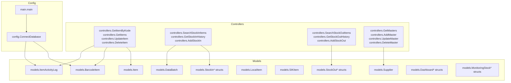
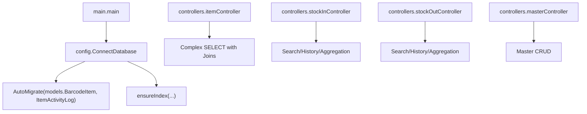
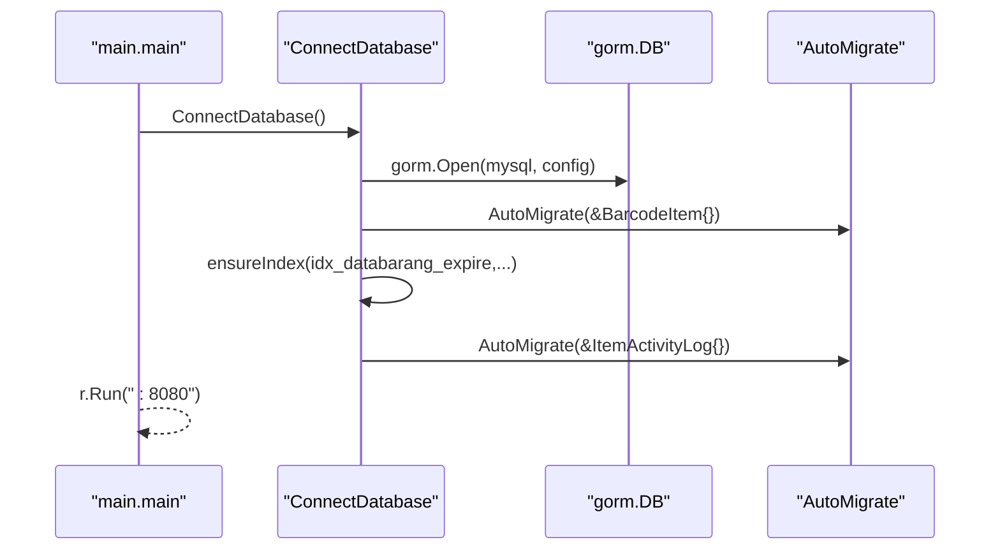
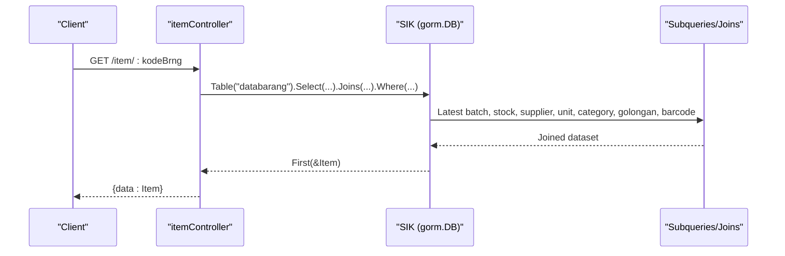
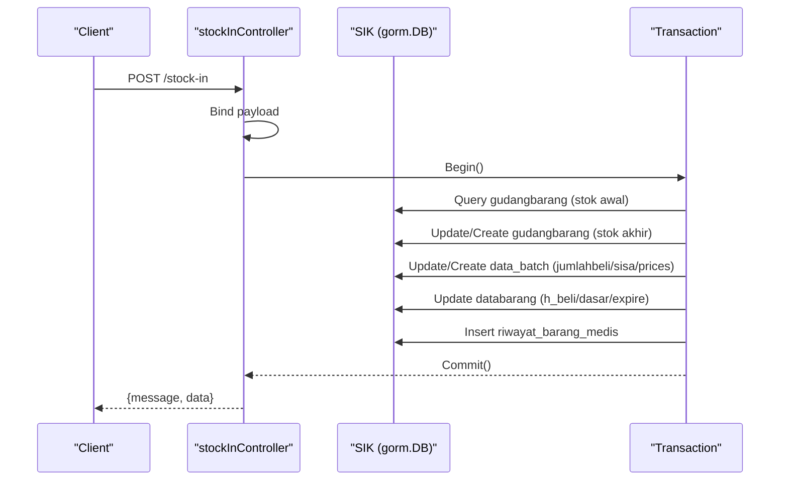
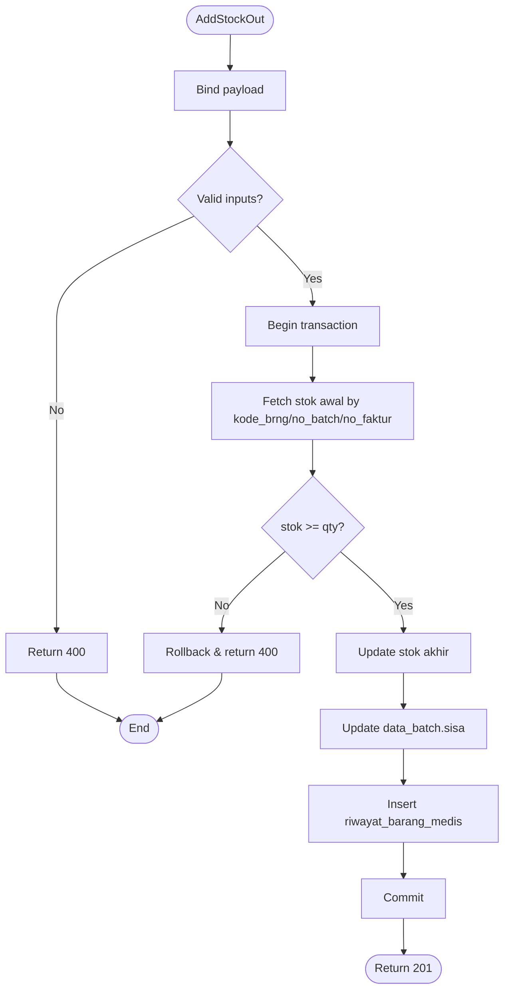
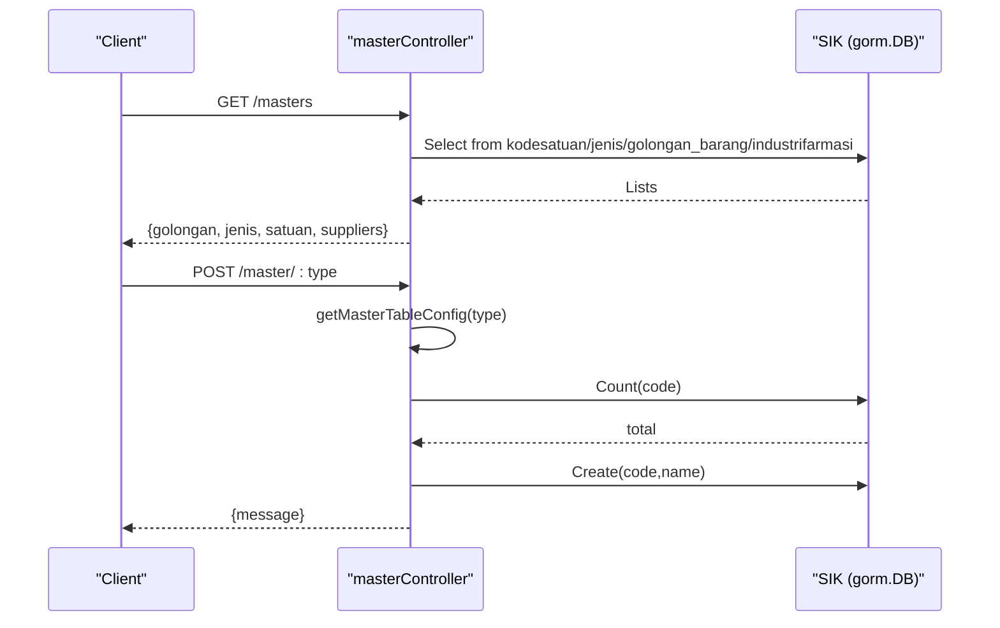
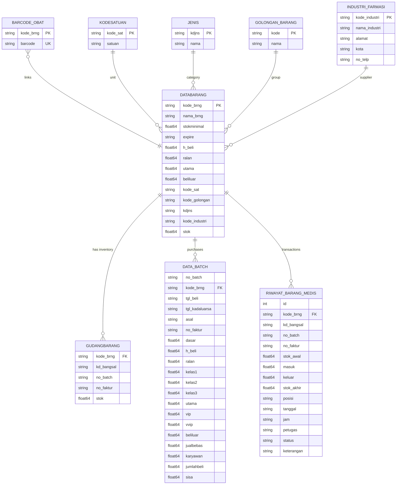
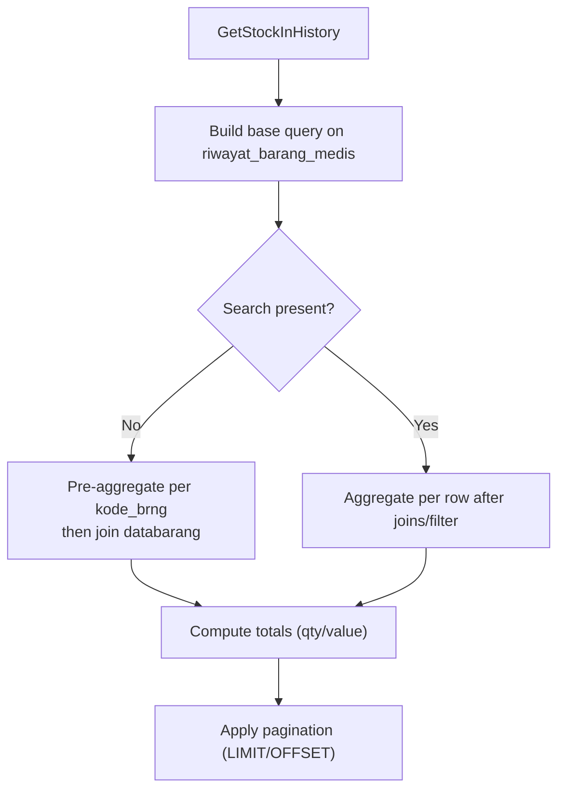
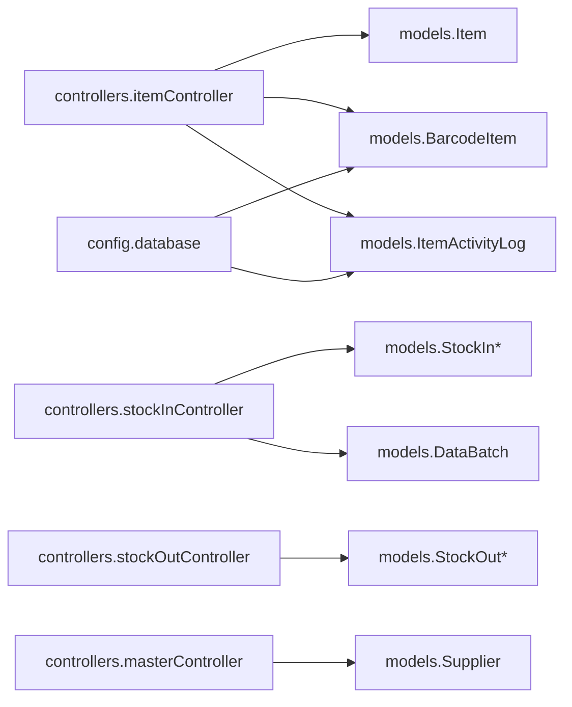

# Data Models & ORM Mapping

<cite>
**Referenced Files in This Document**
- [database.go](file://backend/config/database.go)
- [main.go](file://backend/main.go)
- [item.go](file://backend/models/item.go)
- [supplier.go](file://backend/models/supplier.go)
- [stockin.go](file://backend/models/stockin.go)
- [stockout.go](file://backend/models/stockout.go)
- [batch.go](file://backend/models/batch.go)
- [local_item.go](file://backend/models/local_item.go)
- [sik_item.go](file://backend/models/sik_item.go)
- [barcodeItem.go](file://backend/models/barcodeItem.go)
- [item_activity_log.go](file://backend/models/item_activity_log.go)
- [dashboard.go](file://backend/models/dashboard.go)
- [monitoringStock.go](file://backend/models/monitoringStock.go)
- [itemController.go](file://backend/controllers/itemController.go)
- [stockInController.go](file://backend/controllers/stockInController.go)
- [stockOutController.go](file://backend/controllers/stockOutController.go)
- [masterController.go](file://backend/controllers/masterController.go)
</cite>

## Table of Contents
1. [Introduction](#introduction)
2. [Project Structure](#project-structure)
3. [Core Components](#core-components)
4. [Architecture Overview](#architecture-overview)
5. [Detailed Component Analysis](#detailed-component-analysis)
6. [Dependency Analysis](#dependency-analysis)
7. [Performance Considerations](#performance-considerations)
8. [Troubleshooting Guide](#troubleshooting-guide)
9. [Conclusion](#conclusion)
10. [Appendices](#appendices)

## Introduction
This document provides comprehensive data model documentation for the PPA system’s GORM ORM implementation. It covers model structures, field definitions, JSON tags, associations, and query patterns used across the backend. It also documents database connection, migrations, indexes, and complex queries involving joins, aggregations, and pagination. The goal is to enable developers to understand and extend the data layer effectively while maintaining consistency and performance.

## Project Structure
The data models reside under the backend models package and are used by controllers to build SQL queries against the SIK database. The configuration module initializes the database connection and performs auto-migrations and index creation. Controllers orchestrate CRUD operations and complex analytics queries.

**Diagram sources**
- [database.go:13-89](file://backend/config/database.go#L13-L89)
- [main.go:12-32](file://backend/main.go#L12-L32)
- [item.go:3-32](file://backend/models/item.go#L3-L32)
- [supplier.go:3-14](file://backend/models/supplier.go#L3-L14)
- [stockin.go:3-57](file://backend/models/stockin.go#L3-L57)
- [stockout.go:3-60](file://backend/models/stockout.go#L3-L60)
- [batch.go:3-29](file://backend/models/batch.go#L3-L29)
- [local_item.go:5-34](file://backend/models/local_item.go#L5-L34)
- [sik_item.go:3-32](file://backend/models/sik_item.go#L3-L32)
- [barcodeItem.go:3-12](file://backend/models/barcodeItem.go#L3-L12)
- [item_activity_log.go:5-14](file://backend/models/item_activity_log.go#L5-L14)
- [dashboard.go:3-60](file://backend/models/dashboard.go#L3-L60)
- [monitoringStock.go:3-81](file://backend/models/monitoringStock.go#L3-L81)
- [itemController.go:22-96](file://backend/controllers/itemController.go#L22-L96)
- [stockInController.go:13-50](file://backend/controllers/stockInController.go#L13-L50)
- [stockOutController.go:13-63](file://backend/controllers/stockOutController.go#L13-L63)
- [masterController.go:51-95](file://backend/controllers/masterController.go#L51-L95)

**Section sources**
- [database.go:13-89](file://backend/config/database.go#L13-L89)
- [main.go:12-32](file://backend/main.go#L12-L32)

## Core Components
This section outlines the primary data models, their fields, JSON tags, and notable ORM attributes. It also highlights how controllers consume these models and construct complex queries.

- Item
  - Purpose: Represents a pharmaceutical item with pricing tiers, stock metadata, and category/jenis/golongan references.
  - Key fields: KodeBrng, NamaBrng, StokMinimal, Expire, HBeli, Ralan, Utama, Beliluar, Barcode, KodeKategori, KodeGolongan, KDJns, KodeIndustri, Stok, KodeSat, Supplier, Satuan, Jenis, Kategori, Golongan, NoBatch, NoFaktur, TglBeli, TglKadaluarsa.
  - JSON tags: snake_case aligned with API responses.
  - Table override: TableName returns "databarang".
  - Usage: Controllers compose complex SELECT with LEFT JOINs to enrich item records with stock, supplier, unit, category, and latest batch info.

- Supplier
  - Purpose: Master supplier entity with address and contact info.
  - Fields: KodeIndustri, NamaIndustri, Alamat, Kota, NoTelp.
  - JSON tags: camelCase for API exposure.

- StockInItem, StockInRecent, StockInHistory, StockInSummary, StockInPayload
  - Purpose: Represent purchase entry views and payloads.
  - Fields: KodeBrng, NamaBrng, Barcode, Stok, HBeli, Satuan, Supplier, Golongan, Expire; recent/history add Qty, Price, Date/Time, Operator, Note; summary aggregates totals; payload carries input for adding stock-in.

- StockOutItem, StockOutHistory, StockOutPayload, StockOutHistorySummary, StockOutBatchOption
  - Purpose: Represent sales/disbursement views and payloads.
  - Fields: Similar enrichment to stock-in; batch option includes expiry and pricing snapshots per batch.

- DataBatch
  - Purpose: Batch-level purchase record with pricing tiers and quantities.
  - Fields: NoBatch, KodeBrng, TglBeli, TglKadaluarsa, Asal, NoFaktur, Dasar, HBeli, Ralan, Kelas1..3, Utama, Vip, Vvip, Beliluar, Jualbebas, Karyawan, JumlahBeli, Sisa.
  - Table override: TableName returns "data_batch".

- LocalItem
  - Purpose: Local inventory item representation persisted in a local "items" table.
  - Fields: ID, KodeBarang, NamaBarang, Supplier, Satuan, Kategori, Golongan, Jenis, NoBatch, NoFaktur, TanggalPembelian, HargaBeli, HargaUmum/HargaUtama/HargaBeliLuar, Stok, Expired (time), Barcode, CreatedAt.
  - Table override: TableName returns "items".

- SIKItem
  - Purpose: Lightweight projection of SIK item data for read-only scenarios.
  - Fields: KodeBrng, NamaBrng, Barcode, Expire, HBeli, Ralan, Utama, Beliluar, Stok, Supplier, Satuan, Jenis, Kategori, Golongan.

- BarcodeItem
  - Purpose: Barcode lookup keyed by KodeBrng.
  - Fields: KodeBrng (primary key), Barcode (unique).
  - Table override: TableName returns "barcode_obat".

- ItemActivityLog
  - Purpose: Audit log for item activity events.
  - Fields: ID (primary key), KodeBrng (indexed), CreatedAt (autoCreateTime).
  - Table override: TableName returns "item_activity_logs".

- Dashboard* and MonitoringStock*
  - Purpose: DTOs for dashboard analytics and stock monitoring reports.
  - Fields: Summary metrics, distribution stats, location totals, movement trends, recent activities, pagination metadata, turnover/coVERAGE calculations, and grouped statistics.

**Section sources**
- [item.go:3-32](file://backend/models/item.go#L3-L32)
- [supplier.go:3-14](file://backend/models/supplier.go#L3-L14)
- [stockin.go:3-57](file://backend/models/stockin.go#L3-L57)
- [stockout.go:3-60](file://backend/models/stockout.go#L3-L60)
- [batch.go:3-29](file://backend/models/batch.go#L3-L29)
- [local_item.go:5-34](file://backend/models/local_item.go#L5-L34)
- [sik_item.go:3-32](file://backend/models/sik_item.go#L3-L32)
- [barcodeItem.go:3-12](file://backend/models/barcodeItem.go#L3-L12)
- [item_activity_log.go:5-14](file://backend/models/item_activity_log.go#L5-L14)
- [dashboard.go:3-60](file://backend/models/dashboard.go#L3-L60)
- [monitoringStock.go:3-81](file://backend/models/monitoringStock.go#L3-L81)

## Architecture Overview
The system connects to a MySQL database via GORM, auto-migrates selected models, and creates indexes on frequently queried columns. Controllers issue SQL queries using GORM’s Table/Joins/Where/Scan/Count patterns to fetch enriched datasets and maintain transactional integrity for stock movements.

**Diagram sources**
- [main.go:12-32](file://backend/main.go#L12-L32)
- [database.go:13-89](file://backend/config/database.go#L13-L89)
- [itemController.go:22-96](file://backend/controllers/itemController.go#L22-L96)
- [stockInController.go:13-50](file://backend/controllers/stockInController.go#L13-L50)
- [stockOutController.go:13-63](file://backend/controllers/stockOutController.go#L13-L63)
- [masterController.go:51-95](file://backend/controllers/masterController.go#L51-L95)

## Detailed Component Analysis

### Database Connection and Migration Strategy
- Connection: Opens a MySQL connection to the SIK database and panics on failure.
- Auto-migration: Migrates models.BarcodeItem during initial setup and again during server startup for ItemActivityLog.
- Index management: Creates indexes on frequently filtered/sorted columns (e.g., expire, kode_golongan, dashboard recent, stock summaries) using a safe ensureIndex routine that checks information_schema before creating.

**Diagram sources**
- [main.go:12-32](file://backend/main.go#L12-L32)
- [database.go:13-89](file://backend/config/database.go#L13-L89)

**Section sources**
- [database.go:13-89](file://backend/config/database.go#L13-L89)
- [main.go:12-32](file://backend/main.go#L12-L32)

### Item Model and Queries
- Model: Item defines fields mapped to "databarang" with JSON tags for API responses.
- Queries:
  - Single item retrieval: LEFT JOINs gudangbarang (filtered by location), supplier, unit, jenis, golongan, barcode aggregation, and latest batch subquery to enrich pricing and batch info.
  - List/search: Aggregates inventory by kode_brng/no_batch/no_faktur, joins supplier/unit/category/golongan, and applies LIKE filters across name/code/barcode/batch/faktur.
  - Update/Delete: Updates "databarang" fields and manages "barcode_obat", "gudangbarang", and "data_batch" accordingly.

**Diagram sources**
- [itemController.go:22-96](file://backend/controllers/itemController.go#L22-L96)
- [item.go:3-32](file://backend/models/item.go#L3-L32)

**Section sources**
- [item.go:3-32](file://backend/models/item.go#L3-L32)
- [itemController.go:22-96](file://backend/controllers/itemController.go#L22-L96)

### Stock-In Workflow
- Search: Returns top matches with barcode, unit, supplier, golongan, and formatted expire.
- History: Paginates riwayat_barang_medis entries, computes totals via pre-aggregation subqueries when no search is present, otherwise aggregates per-row after filtering.
- AddStockIn: Transactional process updates gudangbarang, data_batch, databarang pricing/expire, and inserts riwayat_barang_medis.

**Diagram sources**
- [stockInController.go:235-382](file://backend/controllers/stockInController.go#L235-L382)
- [stockin.go:3-57](file://backend/models/stockin.go#L3-L57)
- [batch.go:3-29](file://backend/models/batch.go#L3-L29)

**Section sources**
- [stockInController.go:13-50](file://backend/controllers/stockInController.go#L13-L50)
- [stockInController.go:177-233](file://backend/controllers/stockInController.go#L177-L233)
- [stockInController.go:235-382](file://backend/controllers/stockInController.go#L235-L382)

### Stock-Out Workflow
- Search: Filters by name/code/barcode/batch/faktur and ensures positive stock in location.
- Batch selection: Groups by batch/faktur, left joins batch dates, and orders by expiry/buy date.
- History: Paginates and computes revenue by applying pricing tiers based on destination (e.g., Apotek/BPJS).
- AddStockOut: Validates stock availability, updates gudangbarang/data_batch, logs riwayat_barang_medis.

**Diagram sources**
- [stockOutController.go:189-281](file://backend/controllers/stockOutController.go#L189-L281)
- [stockout.go:3-60](file://backend/models/stockout.go#L3-L60)

**Section sources**
- [stockOutController.go:13-63](file://backend/controllers/stockOutController.go#L13-L63)
- [stockOutController.go:283-376](file://backend/controllers/stockOutController.go#L283-L376)
- [stockOutController.go:189-281](file://backend/controllers/stockOutController.go#L189-L281)

### Master Data Management
- Supported entities: Golongan, Jenis, Satuan, Suppliers.
- Operations: Retrieve lists, add new codes/names, update names, delete by code.
- Implementation: Uses dynamic table configuration and safe existence checks before insert/update/delete.

**Diagram sources**
- [masterController.go:51-95](file://backend/controllers/masterController.go#L51-L95)
- [masterController.go:97-139](file://backend/controllers/masterController.go#L97-L139)

**Section sources**
- [masterController.go:51-95](file://backend/controllers/masterController.go#L51-L95)
- [masterController.go:97-139](file://backend/controllers/masterController.go#L97-L139)

### Entity Relationships and Associations
- databarang ↔ gudangbarang: One-to-many by kode_brng; aggregated per no_batch/no_faktur for inventory.
- databarang ↔ data_batch: One-to-many by kode_brng; grouped by no_batch/no_faktur for purchase history and pricing snapshots.
- databarang ↔ barcode_obat: One-to-one via KodeBrng; barcode aggregation used for item search.
- databarang ↔ kodesatuan, jenis, golongan_barang, industrifarmasi: LEFT JOINs to enrich units, categories, suppliers.
- riwayat_barang_medis: Central transaction log for stock movements; linked to location (kd_bangsal), batch (no_batch/no_faktur), and operator.

**Diagram sources**
- [item.go:3-32](file://backend/models/item.go#L3-L32)
- [stockin.go:3-57](file://backend/models/stockin.go#L3-L57)
- [stockout.go:3-60](file://backend/models/stockout.go#L3-L60)
- [batch.go:3-29](file://backend/models/batch.go#L3-L29)
- [barcodeItem.go:3-12](file://backend/models/barcodeItem.go#L3-L12)
- [supplier.go:3-14](file://backend/models/supplier.go#L3-L14)

### Validation Rules and Constraints
- Payload validation occurs in controllers:
  - Stock-in requires kode_brng, qty (>0), no_batch, no_faktur, tanggal_pembelian.
  - Stock-out requires kode_brng, qty (>0), no_batch, no_faktur, destination.
- Existence checks:
  - Barcode uniqueness enforced via unique index on barcode_obat.barcode.
  - Indexes on databarang.expire, databarang.kode_golongan, and riwayat_barang_medis dashboard/recent/summary indices.
- Business constraints:
  - Stock-out quantity must not exceed available stock per batch.
  - Batch selection ordered by expiry/buy date to support FIFO-like rotation.

**Section sources**
- [stockInController.go:242-245](file://backend/controllers/stockInController.go#L242-L245)
- [stockOutController.go:196-199](file://backend/controllers/stockOutController.go#L196-L199)
- [database.go:50-84](file://backend/config/database.go#L50-L84)
- [barcodeItem.go:7](file://backend/models/barcodeItem.go#L7)

### Serialization and API Mapping
- JSON tags:
  - Item: snake_case for API compatibility (e.g., kode_brng, nama_brng, h_beli).
  - Supplier: camelCase for API exposure (e.g., kodeIndustri, namaIndustri).
  - StockIn/StockOut DTOs: mixed casing to match frontend expectations.
- Controller mapping:
  - Controllers select explicit columns and aliases to populate DTOs, ensuring consistent JSON output.
  - Aggregated fields (e.g., total cost/value, formatted dates) are computed in SQL and returned as scalars or arrays.

**Section sources**
- [item.go:4-27](file://backend/models/item.go#L4-L27)
- [supplier.go:5-13](file://backend/models/supplier.go#L5-L13)
- [stockin.go:3-57](file://backend/models/stockin.go#L3-L57)
- [stockout.go:3-60](file://backend/models/stockout.go#L3-L60)

### Lifecycle Hooks, Soft Deletes, and Audit Trails
- Lifecycle hooks: None observed in models.
- Soft deletes: Not implemented; deletion removes records from related tables before deleting from databarang.
- Audit trails:
  - ItemActivityLog captures item activity events with timestamps.
  - riwayat_barang_medis serves as the primary audit trail for stock movements with operator, reference number, and timestamps.

**Section sources**
- [item_activity_log.go:5-14](file://backend/models/item_activity_log.go#L5-L14)
- [itemController.go:269-283](file://backend/controllers/itemController.go#L269-L283)
- [stockInController.go:348-363](file://backend/controllers/stockInController.go#L348-L363)
- [stockOutController.go:245-260](file://backend/controllers/stockOutController.go#L245-L260)

### Complex Queries, Joins, and Aggregations
- Latest batch selection: Subquery groups data_batch by kode_brng and picks the most recent batch/faktur using string concatenation and substring extraction.
- Inventory aggregation: Groups gudangbarang by kode_brng/no_batch/no_faktur to compute available stock per batch.
- Dashboard analytics: Uses multiple subqueries and CASE expressions to compute summary metrics, distribution, movement, and coverage.
- Pagination: Applies LIMIT/OFFSET with total count derived from Count() to support paginated history views.

**Diagram sources**
- [stockInController.go:177-233](file://backend/controllers/stockInController.go#L177-L233)
- [stockOutController.go:315-376](file://backend/controllers/stockOutController.go#L315-L376)

**Section sources**
- [itemController.go:11-20](file://backend/controllers/itemController.go#L11-L20)
- [itemController.go:104-215](file://backend/controllers/itemController.go#L104-L215)
- [stockInController.go:177-233](file://backend/controllers/stockInController.go#L177-L233)
- [stockOutController.go:315-376](file://backend/controllers/stockOutController.go#L315-L376)

## Dependency Analysis
- Controllers depend on config.SIK for database operations and import models for DTOs and table definitions.
- Models define table names and JSON tags; some models override TableName to target legacy tables.
- Indexes are created proactively to optimize frequent queries.

**Diagram sources**
- [itemController.go:22-96](file://backend/controllers/itemController.go#L22-L96)
- [stockInController.go:13-50](file://backend/controllers/stockInController.go#L13-L50)
- [stockOutController.go:13-63](file://backend/controllers/stockOutController.go#L13-L63)
- [masterController.go:51-95](file://backend/controllers/masterController.go#L51-L95)
- [database.go:13-89](file://backend/config/database.go#L13-L89)

**Section sources**
- [itemController.go:22-96](file://backend/controllers/itemController.go#L22-L96)
- [stockInController.go:13-50](file://backend/controllers/stockInController.go#L13-L50)
- [stockOutController.go:13-63](file://backend/controllers/stockOutController.go#L13-L63)
- [masterController.go:51-95](file://backend/controllers/masterController.go#L51-L95)
- [database.go:13-89](file://backend/config/database.go#L13-L89)

## Performance Considerations
- Indexes: Pre-created indexes on expire, kode_golongan, and dashboard/summary keys reduce query times for filtering and sorting.
- Aggregation strategy:
  - Pre-aggregate when possible (e.g., group by kode_brng for stock-in summary) to minimize join I/O.
  - Apply filters before aggregation when search terms are present.
- Pagination: Compute total count and apply LIMIT/OFFSET to avoid loading large datasets.
- Batch ordering: Order by expiry/buy date to support FIFO rotation and timely expiring alerts.

[No sources needed since this section provides general guidance]

## Troubleshooting Guide
- Connection failures: Verify MySQL credentials and host/port; ensure SIK database exists.
- Migration errors: Confirm AutoMigrate runs for required models and that table names are correct.
- Index creation errors: Check permissions and ensure ensureIndex does not conflict with existing indexes.
- Query errors:
  - Validate JOIN conditions and column aliases.
  - Ensure subqueries for latest batch and inventory aggregation align with actual table schemas.
- Transaction rollbacks:
  - Inspect rollback triggers (e.g., insufficient stock, failed updates) and confirm rollback messages.

**Section sources**
- [database.go:13-89](file://backend/config/database.go#L13-L89)
- [stockInController.go:248-273](file://backend/controllers/stockInController.go#L248-L273)
- [stockOutController.go:201-234](file://backend/controllers/stockOutController.go#L201-L234)

## Conclusion
The PPA system’s GORM ORM layer is centered around a set of lightweight models that mirror SIK database tables and views. Controllers orchestrate complex queries with strategic JOINs, subqueries, and aggregations to deliver enriched inventory insights and maintain transactional integrity for stock movements. Auto-migrations and proactive indexing ensure schema consistency and performance. Extending the system involves adding new DTOs, updating controllers with appropriate joins/aggregations, and ensuring indexes are created for new query paths.

[No sources needed since this section summarizes without analyzing specific files]

## Appendices
- Model-to-table mapping:
  - Item → databarang
  - DataBatch → data_batch
  - BarcodeItem → barcode_obat
  - ItemActivityLog → item_activity_logs
  - LocalItem → items
- Common JSON tag conventions:
  - snake_case for API fields (Item)
  - camelCase for API fields (Supplier)
  - Mixed casing for DTOs (StockIn/StockOut)

[No sources needed since this section provides general guidance]