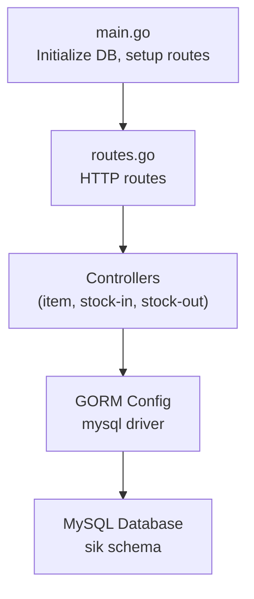
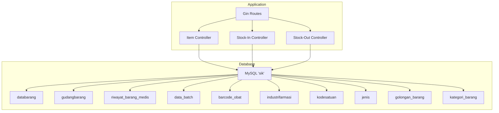
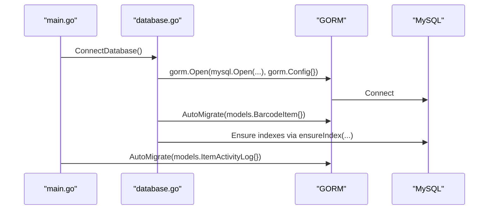
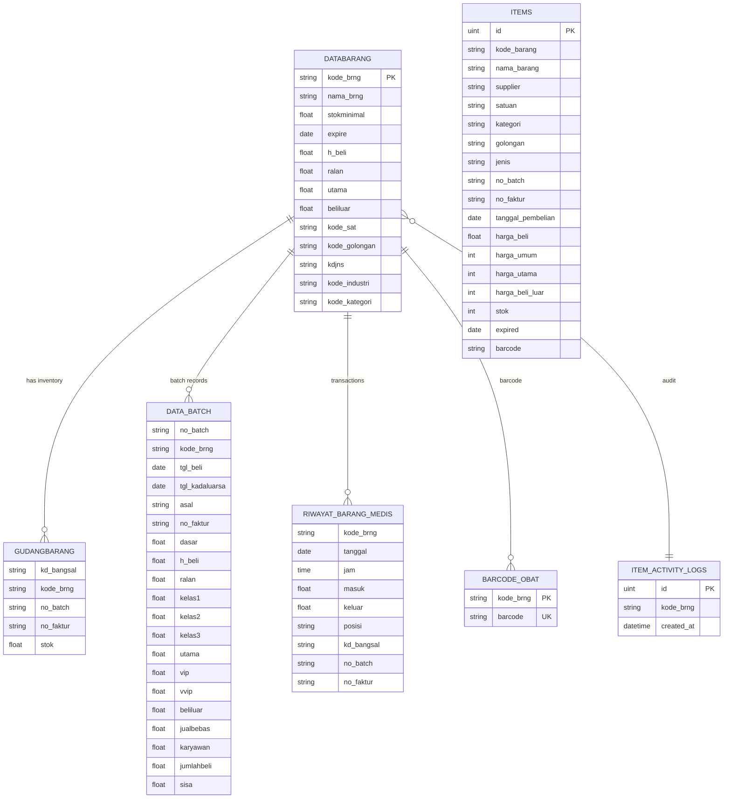
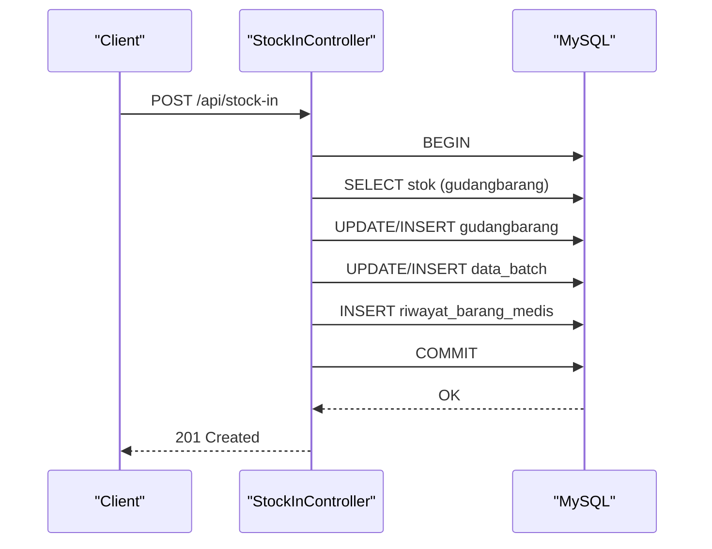
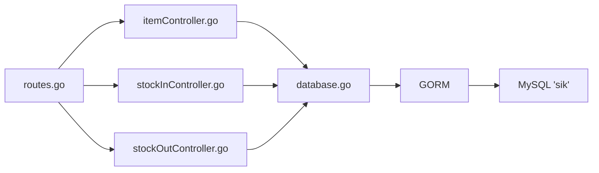

# Database Design & Configuration

<cite>
**Referenced Files in This Document**
- [database.go](file://backend/config/database.go)
- [main.go](file://backend/main.go)
- [routes.go](file://backend/routes/routes.go)
- [item.go](file://backend/models/item.go)
- [local_item.go](file://backend/models/local_item.go)
- [supplier.go](file://backend/models/supplier.go)
- [stockin.go](file://backend/models/stockin.go)
- [stockout.go](file://backend/models/stockout.go)
- [batch.go](file://backend/models/batch.go)
- [barcodeItem.go](file://backend/models/barcodeItem.go)
- [item_activity_log.go](file://backend/models/item_activity_log.go)
- [itemController.go](file://backend/controllers/itemController.go)
- [stockInController.go](file://backend/controllers/stockInController.go)
- [stockOutController.go](file://backend/controllers/stockOutController.go)
</cite>

## Table of Contents
1. [Introduction](#introduction)
2. [Project Structure](#project-structure)
3. [Core Components](#core-components)
4. [Architecture Overview](#architecture-overview)
5. [Detailed Component Analysis](#detailed-component-analysis)
6. [Dependency Analysis](#dependency-analysis)
7. [Performance Considerations](#performance-considerations)
8. [Troubleshooting Guide](#troubleshooting-guide)
9. [Conclusion](#conclusion)
10. [Appendices](#appendices)

## Introduction
This document describes the database design and configuration for the PPA system. It covers the MySQL connection setup, GORM ORM integration, auto-migration behavior, complete schema definition, indexes and constraints, query patterns, and operational considerations such as security, backups, and maintenance.

## Project Structure
The backend uses a layered architecture:
- Entry point initializes the database connection and sets up HTTP routes.
- Routes delegate to controllers that orchestrate queries against the legacy SIK database.
- Models define entity shapes and table mappings for GORM.
- Controllers encapsulate complex SQL joins and transactional updates.

**Diagram sources**
- [main.go:12-32](file://backend/main.go#L12-L32)
- [routes.go:9-35](file://backend/routes/routes.go#L9-L35)
- [database.go:13-83](file://backend/config/database.go#L13-L83)

**Section sources**
- [main.go:12-32](file://backend/main.go#L12-L32)
- [routes.go:9-35](file://backend/routes/routes.go#L9-L35)

## Core Components
- Database connection and migration:
  - Establishes a connection to MySQL using the mysql driver.
  - Performs AutoMigrate for selected models during startup.
  - Ensures critical indexes via a helper that checks existence before creation.
- GORM integration:
  - Uses gorm.DB handle SIK for all operations.
  - Employs Struct-Tag mapping to align Go structs with database columns.
- Index management:
  - Creates composite and single-column indexes on frequently queried columns.
- Controllers:
  - Execute complex SQL queries with multiple JOINs and aggregations.
  - Use transactions for atomic updates across multiple tables.

**Section sources**
- [database.go:13-111](file://backend/config/database.go#L13-L111)
- [main.go:12-32](file://backend/main.go#L12-L32)

## Architecture Overview
The system connects to a legacy database named "sik". Controllers issue SQL queries against multiple tables, joining inventory, pricing, supplier, category, and batch data. Transactions ensure consistency for stock movements.

**Diagram sources**
- [routes.go:9-35](file://backend/routes/routes.go#L9-L35)
- [itemController.go:22-96](file://backend/controllers/itemController.go#L22-L96)
- [stockInController.go:13-78](file://backend/controllers/stockInController.go#L13-L78)
- [stockOutController.go:13-63](file://backend/controllers/stockOutController.go#L13-L63)

## Detailed Component Analysis

### Database Initialization and Migration
- Connection:
  - Opens a MySQL connection to host 127.0.0.1:3306 with database "sik".
  - Uses the GORM mysql driver with default configuration.
- Auto-migration:
  - Runs AutoMigrate for specific models at connect time.
  - Re-runs AutoMigrate for additional models after route setup.
- Index enforcement:
  - Checks information_schema for index existence before creating:
    - riwayat_barang_medis: idx_rbm_dashboard_recent, idx_rbm_stockin_summary
    - gudangbarang: idx_gudangbarang_bangsal_brng
    - databarang: idx_databarang_expire, idx_databarang_kode_golongan

**Diagram sources**
- [main.go:12-32](file://backend/main.go#L12-L32)
- [database.go:13-111](file://backend/config/database.go#L13-L111)

**Section sources**
- [database.go:13-111](file://backend/config/database.go#L13-L111)
- [main.go:12-32](file://backend/main.go#L12-L32)

### Model Definitions and Table Mappings
- databarang
  - Primary table for item master data.
  - Mapped via Item struct with column tags.
- gudangbarang
  - Inventory storage with compound location key (kd_bangsal, kode_brng, no_batch, no_faktur).
- riwayat_barang_medis
  - Transactional movement log (masuk/keluar).
- data_batch
  - Batch-level purchase and pricing records.
- barcode_obat
  - Barcode lookup keyed by kode_brng.
- items (local_item.go)
  - Local staging table for UI-managed items.
- item_activity_logs
  - Audit trail keyed by kode_brng.

**Diagram sources**
- [item.go:3-32](file://backend/models/item.go#L3-L32)
- [batch.go:3-28](file://backend/models/batch.go#L3-L28)
- [stockin.go:3-45](file://backend/models/stockin.go#L3-L45)
- [stockout.go:3-46](file://backend/models/stockout.go#L3-L46)
- [barcodeItem.go:3-12](file://backend/models/barcodeItem.go#L3-L12)
- [local_item.go:5-33](file://backend/models/local_item.go#L5-L33)
- [item_activity_log.go:5-13](file://backend/models/item_activity_log.go#L5-L13)

**Section sources**
- [item.go:3-32](file://backend/models/item.go#L3-L32)
- [batch.go:3-28](file://backend/models/batch.go#L3-L28)
- [stockin.go:3-45](file://backend/models/stockin.go#L3-L45)
- [stockout.go:3-46](file://backend/models/stockout.go#L3-L46)
- [barcodeItem.go:3-12](file://backend/models/barcodeItem.go#L3-L12)
- [local_item.go:5-33](file://backend/models/local_item.go#L5-L33)
- [item_activity_log.go:5-13](file://backend/models/item_activity_log.go#L5-L13)

### Index Strategies and Constraints
- Composite indexes:
  - riwayat_barang_medis: idx_rbm_dashboard_recent (kd_bangsal, tanggal, jam)
  - riwayat_barang_medis: idx_rbm_stockin_summary (kd_bangsal, kode_brng, masuk)
  - gudangbarang: idx_gudangbarang_bangsal_brng (kd_bangsal, kode_brng)
- Single-column indexes:
  - databarang: idx_databarang_expire (expire)
  - databarang: idx_databarang_kode_golongan (kode_golongan)
- Constraints enforced by models:
  - barcode_obat.kode_brng: primary key
  - barcode_obat.barcode: unique
  - item_activity_logs.kode_brng: indexed

**Section sources**
- [database.go:50-78](file://backend/config/database.go#L50-L78)
- [database.go:85-110](file://backend/config/database.go#L85-L110)
- [barcodeItem.go:5-7](file://backend/models/barcodeItem.go#L5-L7)
- [item_activity_log.go:7-8](file://backend/models/item_activity_log.go#L7-L8)

### Query Patterns and Business Logic
- Item retrieval with joins:
  - Left joins to suppliers, units, categories, classes, and latest batch info.
  - Aggregates inventory per kode_brng and batch.
- Stock-in:
  - Transactional update of gudangbarang, data_batch, and riwayat_barang_medis.
  - Price propagation and expiry updates.
- Stock-out:
  - Validates stock availability, selects appropriate batch, and updates inventory.
  - Computes revenue based on destination type.
- Search and filtering:
  - Supports fuzzy search across name, code, barcode, and batch/faktur.

**Diagram sources**
- [stockInController.go:235-382](file://backend/controllers/stockInController.go#L235-L382)

**Section sources**
- [itemController.go:22-96](file://backend/controllers/itemController.go#L22-L96)
- [stockInController.go:13-78](file://backend/controllers/stockInController.go#L13-L78)
- [stockOutController.go:13-63](file://backend/controllers/stockOutController.go#L13-L63)
- [stockInController.go:235-382](file://backend/controllers/stockInController.go#L235-L382)
- [stockOutController.go:189-281](file://backend/controllers/stockOutController.go#L189-L281)

### Data Types, Validation Rules, and Business Constraints
- Data types:
  - Strings for codes and identifiers; floats for quantities/prices; dates/times for expiry and timestamps.
- Validation:
  - Controllers enforce required fields (e.g., stock-in requires kode_brng, qty, no_batch, no_faktur, tanggal_pembelian).
  - Stock-out enforces sufficient stock and valid batch selection.
- Business rules:
  - Pricing propagation from purchase price to various selling tiers.
  - Revenue calculation varies by destination (e.g., Apotek, Utama BPJS).
  - Expiry tracking and expiration alerts via dedicated columns.

**Section sources**
- [stockInController.go:242-245](file://backend/controllers/stockInController.go#L242-L245)
- [stockOutController.go:196-199](file://backend/controllers/stockOutController.go#L196-L199)
- [stockOutController.go:209-213](file://backend/controllers/stockOutController.go#L209-L213)

### Security Measures
- Connection credentials are embedded in the connection string; ensure secrets management in production (e.g., environment variables).
- Queries use parameterized conditions to mitigate injection risks.
- Transactions wrap stock-changing operations to maintain consistency.

**Section sources**
- [database.go:21-27](file://backend/config/database.go#L21-L27)
- [itemController.go:87-88](file://backend/controllers/itemController.go#L87-L88)
- [stockInController.go:255-256](file://backend/controllers/stockInController.go#L255-L256)

### Backup and Maintenance Procedures
- Backups:
  - Use mysqldump or logical backup tools to export the "sik" schema regularly.
- Maintenance:
  - Monitor slow queries and review index coverage.
  - Periodically re-evaluate composite indexes based on query patterns.

[No sources needed since this section provides general guidance]

## Dependency Analysis
- Controllers depend on the shared SIK GORM instance for all database operations.
- Models define table mappings and constraints used by migrations and queries.
- Routes register endpoints that trigger controller logic.

**Diagram sources**
- [routes.go:9-35](file://backend/routes/routes.go#L9-L35)
- [database.go:13-83](file://backend/config/database.go#L13-L83)

**Section sources**
- [routes.go:9-35](file://backend/routes/routes.go#L9-L35)
- [database.go:13-83](file://backend/config/database.go#L13-L83)

## Performance Considerations
- Index utilization:
  - Ensure queries leverage idx_gudangbarang_bangsal_brng for location-scoped inventory.
  - Use idx_databarang_expire and idx_databarang_kode_golongan for filtering.
- Query optimization:
  - Pre-aggregation of stock per batch/faktur reduces join fan-out.
  - Subqueries and derived tables minimize repeated scans.
- Transaction batching:
  - Group related writes within a single transaction to reduce overhead.

[No sources needed since this section provides general guidance]

## Troubleshooting Guide
- Connection failures:
  - Verify host, port, and database name in the connection string.
  - Confirm MySQL service is reachable and credentials are correct.
- Migration errors:
  - Check AutoMigrate logs for constraint conflicts or missing tables.
  - Review ensureIndex logic for existing indexes.
- Slow queries:
  - Analyze query plans for JOIN-heavy endpoints (GetItems, GetStockInHistory, GetStockOutHistory).
  - Confirm index coverage for WHERE and JOIN predicates.

**Section sources**
- [database.go:29-31](file://backend/config/database.go#L29-L31)
- [database.go:42-48](file://backend/config/database.go#L42-L48)
- [database.go:98-109](file://backend/config/database.go#L98-L109)

## Conclusion
The PPA system integrates GORM with a legacy MySQL schema to support inventory operations. It establishes robust connections, ensures essential indexes, and executes complex queries with transactions. Adhering to the outlined security and maintenance practices will help sustain performance and reliability.

## Appendices

### Appendix A: Endpoint-to-Model Mapping
- GET /api/items → Item retrieval with joins and pagination
- POST /api/stock-in → StockInPayload → gudangbarang, data_batch, riwayat_barang_medis
- POST /api/stock-out → StockOutPayload → gudangbarang, data_batch, riwayat_barang_medis

**Section sources**
- [routes.go:10-34](file://backend/routes/routes.go#L10-L34)
- [stockInController.go:235-382](file://backend/controllers/stockInController.go#L235-L382)
- [stockOutController.go:189-281](file://backend/controllers/stockOutController.go#L189-L281)