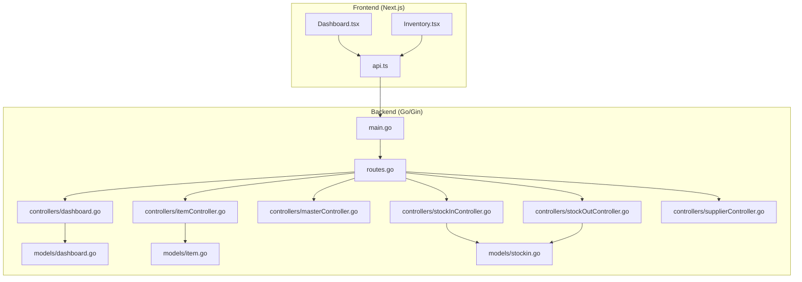
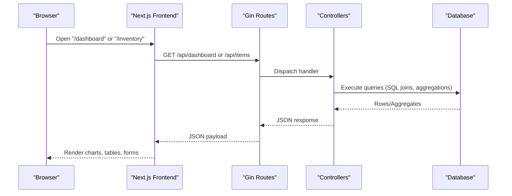
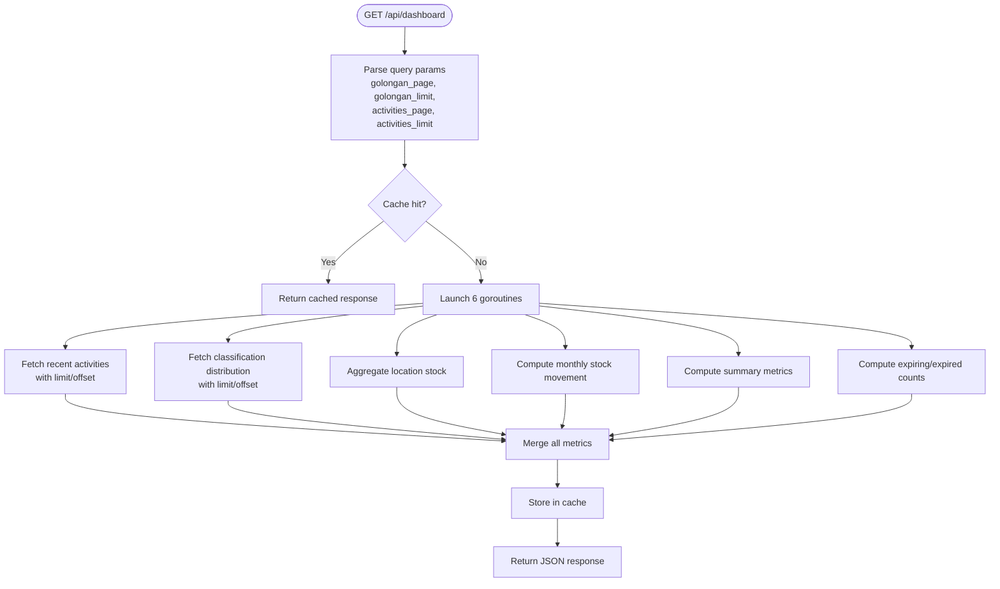
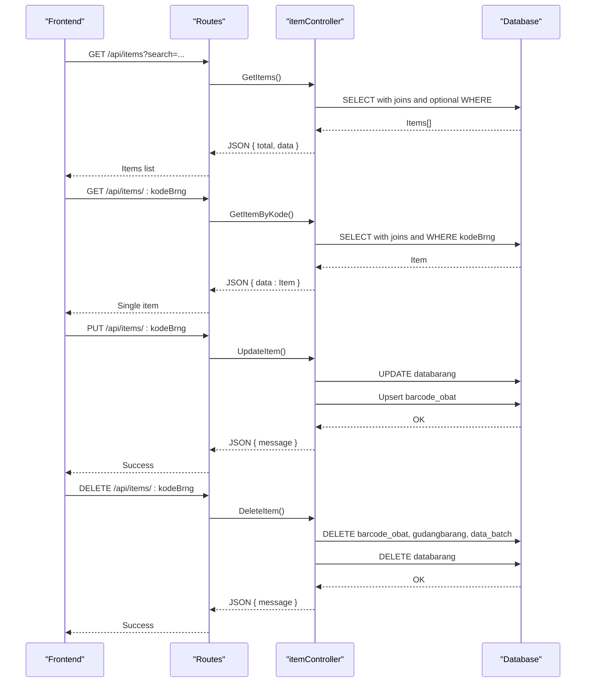
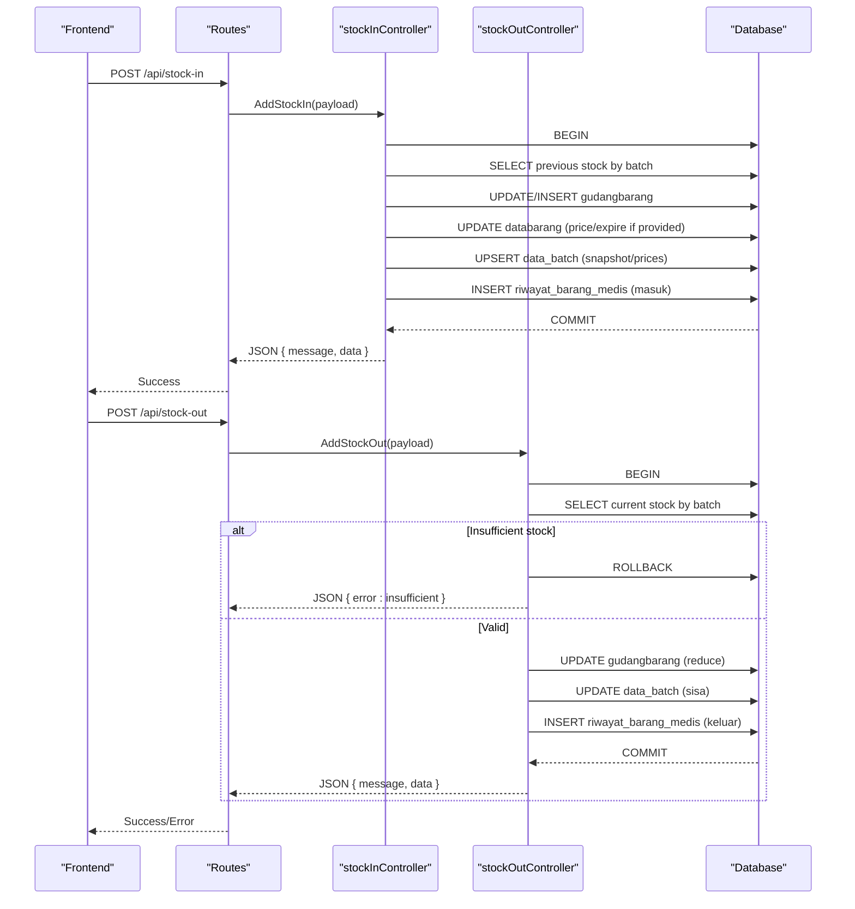
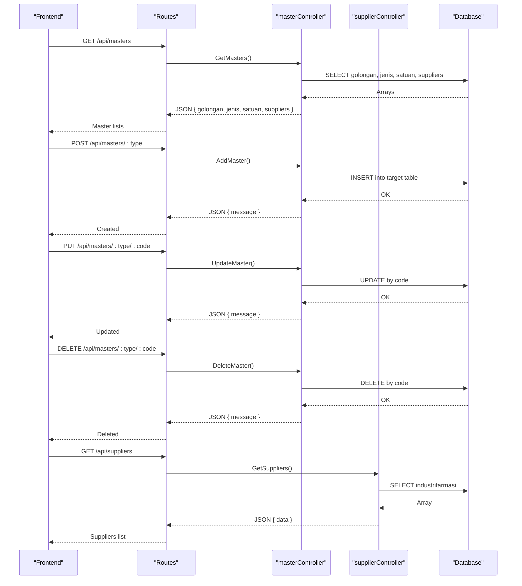
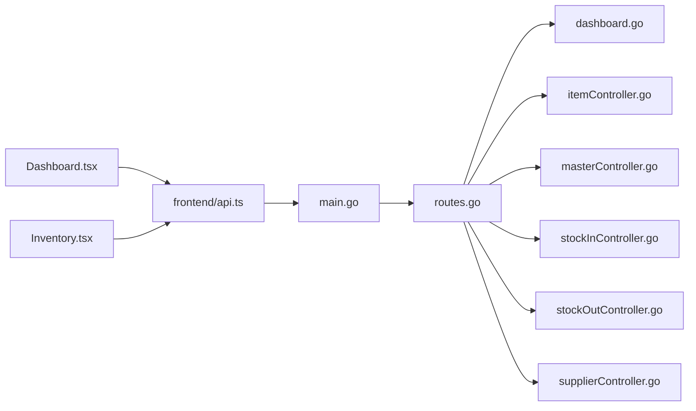
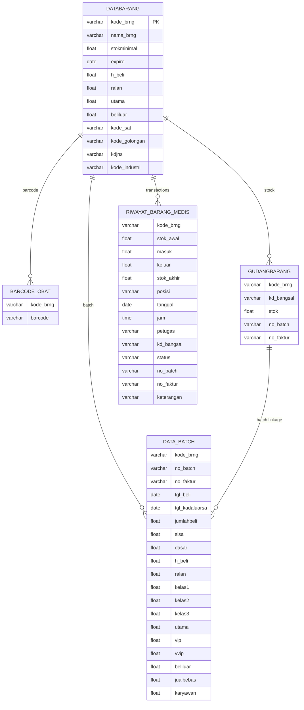

# Core Features

<cite>
**Referenced Files in This Document**
- [backend/main.go](file://backend/main.go)
- [backend/routes/routes.go](file://backend/routes/routes.go)
- [backend/controllers/dashboard.go](file://backend/controllers/dashboard.go)
- [backend/controllers/itemController.go](file://backend/controllers/itemController.go)
- [backend/controllers/masterController.go](file://backend/controllers/masterController.go)
- [backend/controllers/stockInController.go](file://backend/controllers/stockInController.go)
- [backend/controllers/stockOutController.go](file://backend/controllers/stockOutController.go)
- [backend/controllers/supplierController.go](file://backend/controllers/supplierController.go)
- [backend/models/dashboard.go](file://backend/models/dashboard.go)
- [backend/models/item.go](file://backend/models/item.go)
- [backend/models/stockin.go](file://backend/models/stockin.go)
- [frontend/src/components/pages/Dashboard.tsx](file://frontend/src/components/pages/Dashboard.tsx)
- [frontend/src/components/pages/Inventory.tsx](file://frontend/src/components/pages/Inventory.tsx)
- [frontend/src/lib/api.ts](file://frontend/src/lib/api.ts)
</cite>

## Table of Contents
1. [Introduction](#introduction)
2. [Project Structure](#project-structure)
3. [Core Components](#core-components)
4. [Architecture Overview](#architecture-overview)
5. [Detailed Component Analysis](#detailed-component-analysis)
6. [Dependency Analysis](#dependency-analysis)
7. [Performance Considerations](#performance-considerations)
8. [Troubleshooting Guide](#troubleshooting-guide)
9. [Conclusion](#conclusion)
10. [Appendices](#appendices)

## Introduction
This document explains the core features of the PPA inventory management system with a focus on:
- Real-time dashboard analytics
- Inventory management (CRUD and barcode integration)
- Stock operations (in/out with batch tracking)
- Master data management (suppliers and classifications)

It covers feature workflows, user interactions, business logic, feature interdependencies, data relationships, integration patterns, configuration options, customization points, and usage examples.

## Project Structure
The system follows a layered backend (Go/Gin) and a Next.js frontend:
- Backend exposes REST endpoints via Gin, connects to a MySQL-compatible database, and orchestrates controllers and models.
- Frontend consumes the backend APIs, renders dashboards, inventory lists, and transaction histories.

**Diagram sources**
- [backend/main.go:12-32](file://backend/main.go#L12-L32)
- [backend/routes/routes.go:9-35](file://backend/routes/routes.go#L9-L35)
- [backend/controllers/dashboard.go:43-305](file://backend/controllers/dashboard.go#L43-L305)
- [backend/controllers/itemController.go:22-284](file://backend/controllers/itemController.go#L22-L284)
- [backend/controllers/masterController.go:51-206](file://backend/controllers/masterController.go#L51-L206)
- [backend/controllers/stockInController.go:13-383](file://backend/controllers/stockInController.go#L13-L383)
- [backend/controllers/stockOutController.go:13-349](file://backend/controllers/stockOutController.go#L13-L349)
- [backend/controllers/supplierController.go:10-80](file://backend/controllers/supplierController.go#L10-L80)
- [backend/models/dashboard.go:52-60](file://backend/models/dashboard.go#L52-L60)
- [backend/models/item.go:3-33](file://backend/models/item.go#L3-L33)
- [backend/models/stockin.go:42-57](file://backend/models/stockin.go#L42-L57)
- [frontend/src/components/pages/Dashboard.tsx:157-668](file://frontend/src/components/pages/Dashboard.tsx#L157-L668)
- [frontend/src/components/pages/Inventory.tsx:62-606](file://frontend/src/components/pages/Inventory.tsx#L62-L606)
- [frontend/src/lib/api.ts:1-19](file://frontend/src/lib/api.ts#L1-L19)

**Section sources**
- [backend/main.go:12-32](file://backend/main.go#L12-L32)
- [backend/routes/routes.go:9-35](file://backend/routes/routes.go#L9-L35)
- [frontend/src/lib/api.ts:1-19](file://frontend/src/lib/api.ts#L1-L19)

## Core Components
- Dashboard analytics: Aggregates summary metrics, expiring/expired counts, classification distribution, location stock, stock movements, and recent activities with caching and pagination.
- Inventory management: Lists items with filters, updates item attributes and barcode, deletes items and related records.
- Stock operations: Stock-in with batch tracking and pricing updates; stock-out with batch selection and validation.
- Master data: CRUD for classifications (golongan, jenis, satuan) and suppliers.
- Frontend integration: Fetches and displays dashboard data, inventory list, and handles user actions.

**Section sources**
- [backend/controllers/dashboard.go:43-305](file://backend/controllers/dashboard.go#L43-L305)
- [backend/controllers/itemController.go:22-284](file://backend/controllers/itemController.go#L22-L284)
- [backend/controllers/stockInController.go:13-383](file://backend/controllers/stockInController.go#L13-L383)
- [backend/controllers/stockOutController.go:13-349](file://backend/controllers/stockOutController.go#L13-L349)
- [backend/controllers/masterController.go:51-206](file://backend/controllers/masterController.go#L51-L206)
- [backend/controllers/supplierController.go:10-80](file://backend/controllers/supplierController.go#L10-L80)
- [frontend/src/components/pages/Dashboard.tsx:157-668](file://frontend/src/components/pages/Dashboard.tsx#L157-L668)
- [frontend/src/components/pages/Inventory.tsx:62-606](file://frontend/src/components/pages/Inventory.tsx#L62-L606)

## Architecture Overview
The backend initializes the database connection, registers routes, and applies model migrations. Controllers implement feature logic and interact with the database through GORM. The frontend calls the backend endpoints and renders data.

**Diagram sources**
- [backend/main.go:12-32](file://backend/main.go#L12-L32)
- [backend/routes/routes.go:9-35](file://backend/routes/routes.go#L9-L35)
- [backend/controllers/dashboard.go:43-305](file://backend/controllers/dashboard.go#L43-L305)
- [backend/controllers/itemController.go:98-215](file://backend/controllers/itemController.go#L98-L215)
- [frontend/src/lib/api.ts:15-18](file://frontend/src/lib/api.ts#L15-L18)

## Detailed Component Analysis

### Dashboard Analytics
- Real-time metrics aggregation:
  - Total items, total stock, inventory value, low stock threshold.
  - Expiring/expired counts computed from expiration dates.
  - Classification distribution with pagination.
  - Location-wise stock totals.
  - Stock movement trends over a rolling period.
  - Recent activities for the current day with pagination.
- Concurrency and caching:
  - Parallel execution of six metric groups using goroutines and WaitGroup.
  - Shared cache keyed by pagination parameters with TTL.
- Pagination metadata returned alongside data for client-side controls.

**Diagram sources**
- [backend/controllers/dashboard.go:43-305](file://backend/controllers/dashboard.go#L43-L305)
- [backend/models/dashboard.go:52-60](file://backend/models/dashboard.go#L52-L60)

**Section sources**
- [backend/controllers/dashboard.go:43-305](file://backend/controllers/dashboard.go#L43-L305)
- [backend/models/dashboard.go:3-60](file://backend/models/dashboard.go#L3-L60)
- [frontend/src/components/pages/Dashboard.tsx:157-215](file://frontend/src/components/pages/Dashboard.tsx#L157-L215)

### Inventory Management (CRUD + Barcode)
- Retrieve items with search across name, code, barcode, batch, and invoice.
- Retrieve single item with joins to suppliers, units, categories, types, latest batch, and barcode.
- Update item attributes (prices, expiry, unit, classification, supplier) and manage barcode record.
- Delete item cascades to barcode, warehouse stock, and batch records.

**Diagram sources**
- [backend/routes/routes.go:10-22](file://backend/routes/routes.go#L10-L22)
- [backend/controllers/itemController.go:22-284](file://backend/controllers/itemController.go#L22-L284)
- [backend/models/item.go:3-33](file://backend/models/item.go#L3-L33)

**Section sources**
- [backend/controllers/itemController.go:22-284](file://backend/controllers/itemController.go#L22-L284)
- [backend/models/item.go:3-33](file://backend/models/item.go#L3-L33)
- [frontend/src/components/pages/Inventory.tsx:62-132](file://frontend/src/components/pages/Inventory.tsx#L62-L132)

### Stock Operations (In/Out with Batch Tracking)
- Stock-in:
  - Validates presence of item, quantity, batch, invoice, and purchase date.
  - Begins transaction, updates warehouse stock, optionally updates buying price and expiry on item.
  - Maintains batch records with snapshot of pricing and cumulative quantities.
  - Logs history entry with position “Barang Masuk”.
- Stock-out:
  - Validates sufficient stock and matching batch/invoice.
  - Updates warehouse and batch remaining quantities.
  - Logs history entry with position “Barang Keluar”.

**Diagram sources**
- [backend/routes/routes.go:26-34](file://backend/routes/routes.go#L26-L34)
- [backend/controllers/stockInController.go:235-383](file://backend/controllers/stockInController.go#L235-L383)
- [backend/controllers/stockOutController.go:189-281](file://backend/controllers/stockOutController.go#L189-L281)

**Section sources**
- [backend/controllers/stockInController.go:13-383](file://backend/controllers/stockInController.go#L13-L383)
- [backend/controllers/stockOutController.go:13-349](file://backend/controllers/stockOutController.go#L13-L349)

### Master Data Management (Classifications and Suppliers)
- Classifications:
  - Retrieve all golongan, jenis, satuan, and suppliers in one call.
  - Add/update/delete classifications via unified handler with type routing.
- Suppliers:
  - CRUD endpoints for supplier entities.

**Diagram sources**
- [backend/routes/routes.go:13-20](file://backend/routes/routes.go#L13-L20)
- [backend/controllers/masterController.go:51-206](file://backend/controllers/masterController.go#L51-L206)
- [backend/controllers/supplierController.go:10-80](file://backend/controllers/supplierController.go#L10-L80)

**Section sources**
- [backend/controllers/masterController.go:51-206](file://backend/controllers/masterController.go#L51-L206)
- [backend/controllers/supplierController.go:10-80](file://backend/controllers/supplierController.go#L10-L80)

## Dependency Analysis
- Backend entrypoint initializes database and routes.
- Routes map HTTP verbs to controller handlers.
- Controllers depend on GORM for SQL operations and on shared models for request/response shapes.
- Frontend depends on environment variables to resolve API base URL and calls backend endpoints.

**Diagram sources**
- [backend/main.go:12-32](file://backend/main.go#L12-L32)
- [backend/routes/routes.go:9-35](file://backend/routes/routes.go#L9-L35)
- [frontend/src/lib/api.ts:1-19](file://frontend/src/lib/api.ts#L1-L19)

**Section sources**
- [backend/main.go:12-32](file://backend/main.go#L12-L32)
- [backend/routes/routes.go:9-35](file://backend/routes/routes.go#L9-L35)
- [frontend/src/lib/api.ts:1-19](file://frontend/src/lib/api.ts#L1-L19)

## Performance Considerations
- Dashboard concurrency: Six parallel queries reduce latency; ensure database supports concurrent reads/writes.
- Dashboard caching: TTL prevents frequent recomputation; adjust TTL based on acceptable staleness.
- Pagination: Limits on classification and activities prevent oversized payloads.
- Stock-in/out summaries: Pre-aggregation by item reduces join costs when no search is applied.
- Frontend rendering: Large tables paginated client-side; consider server-side pagination for very large datasets.

[No sources needed since this section provides general guidance]

## Troubleshooting Guide
- Dashboard errors: Controller captures first error from goroutines and returns a 500 with details.
- Stock-in failures: Transaction rollback on errors; verify batch existence and invoice matching.
- Stock-out failures: Insufficient stock triggers 400; confirm batch selection and invoice match.
- Item deletion: Cascades remove dependent records; ensure no external references.
- Frontend connectivity: Verify NEXT_PUBLIC_API_URL or host/port; ensure CORS allows requests.

**Section sources**
- [backend/controllers/dashboard.go:268-271](file://backend/controllers/dashboard.go#L268-L271)
- [backend/controllers/stockInController.go:248-252](file://backend/controllers/stockInController.go#L248-L252)
- [backend/controllers/stockOutController.go:209-213](file://backend/controllers/stockOutController.go#L209-L213)
- [frontend/src/lib/api.ts:1-19](file://frontend/src/lib/api.ts#L1-L19)

## Conclusion
The PPA system integrates a robust backend with concurrent dashboard analytics, comprehensive inventory management, precise stock-in/out operations with batch tracking, and centralized master data maintenance. The frontend leverages typed models and environment-driven API resolution to deliver responsive views. The architecture supports scalability through caching, pagination, and transactional integrity.

[No sources needed since this section summarizes without analyzing specific files]

## Appendices

### Feature Workflows and User Interactions
- Dashboard:
  - Load metrics and render charts; paginate classification and recent activities.
- Inventory:
  - Search, filter by classification/type, view details, update attributes, manage barcode, delete with confirmation.
- Stock-in:
  - Select item by search, enter quantity, batch, invoice, purchase date, optional price/expire; submit to create/update stock and batch records.
- Stock-out:
  - Select item, choose batch/invoice, enter quantity and destination; submit to decrement stock and log history.
- Master data:
  - View lists, add entries with validation, update names, delete codes.

**Section sources**
- [frontend/src/components/pages/Dashboard.tsx:157-668](file://frontend/src/components/pages/Dashboard.tsx#L157-L668)
- [frontend/src/components/pages/Inventory.tsx:62-606](file://frontend/src/components/pages/Inventory.tsx#L62-L606)
- [backend/controllers/stockInController.go:13-383](file://backend/controllers/stockInController.go#L13-L383)
- [backend/controllers/stockOutController.go:13-349](file://backend/controllers/stockOutController.go#L13-L349)
- [backend/controllers/masterController.go:51-206](file://backend/controllers/masterController.go#L51-L206)

### Data Relationships
- Items link to suppliers, units, categories, types, and batch records.
- Warehouse stock is partitioned by batch and invoice.
- History tracks inflows/outflows with timestamps and references.

**Diagram sources**
- [backend/controllers/itemController.go:22-215](file://backend/controllers/itemController.go#L22-L215)
- [backend/controllers/stockInController.go:235-383](file://backend/controllers/stockInController.go#L235-L383)
- [backend/controllers/stockOutController.go:189-281](file://backend/controllers/stockOutController.go#L189-L281)

### Configuration and Extension Points
- Environment-driven API base URL in frontend.
- Dashboard cache TTL adjustable in controller constants.
- Pagination limits configurable per endpoint.
- Master data handler supports extensible types via table configuration.
- Transaction boundaries in stock operations ensure atomicity.

**Section sources**
- [frontend/src/lib/api.ts:1-19](file://frontend/src/lib/api.ts#L1-L19)
- [backend/controllers/dashboard.go:13-30](file://backend/controllers/dashboard.go#L13-L30)
- [backend/controllers/masterController.go:23-49](file://backend/controllers/masterController.go#L23-L49)
- [backend/controllers/stockInController.go:248-383](file://backend/controllers/stockInController.go#L248-L383)
- [backend/controllers/stockOutController.go:201-281](file://backend/controllers/stockOutController.go#L201-L281)