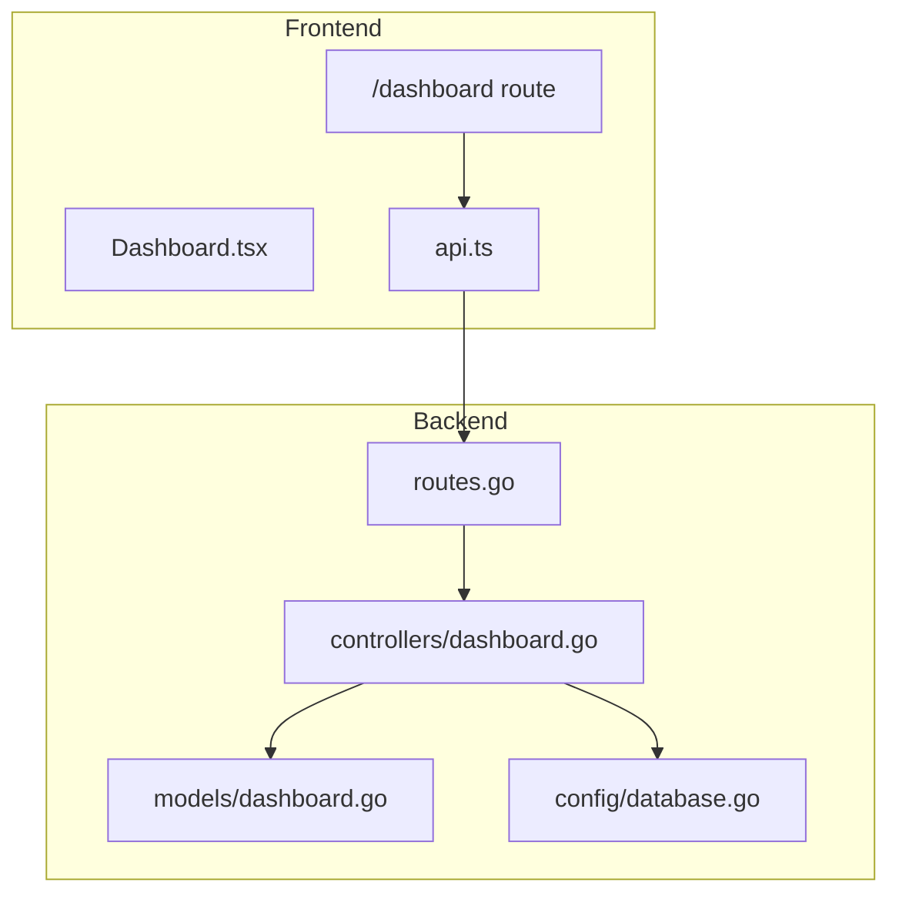
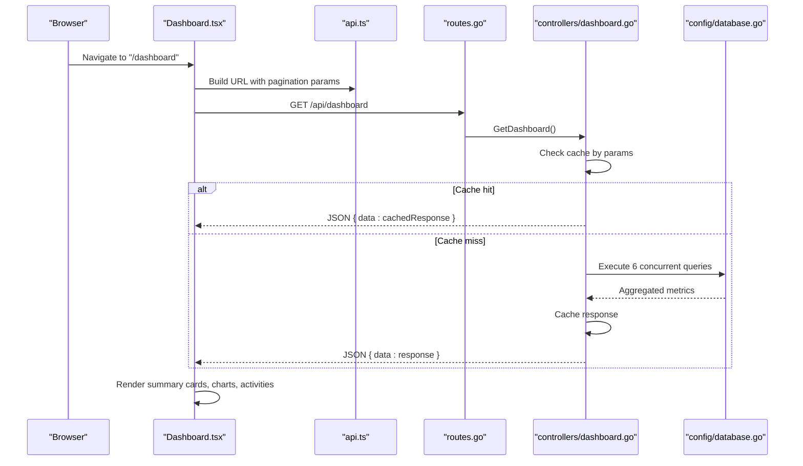
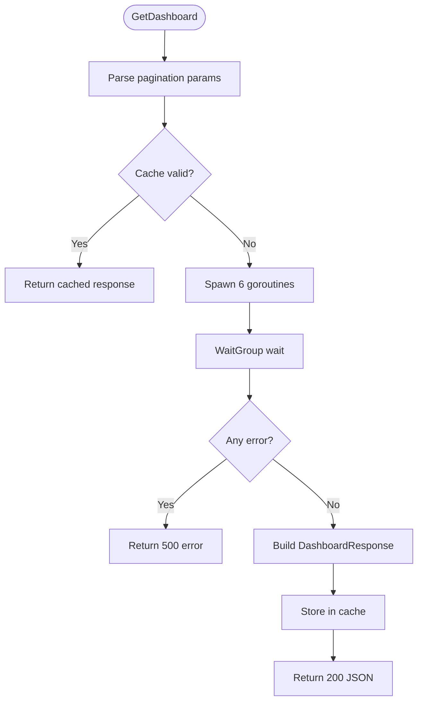
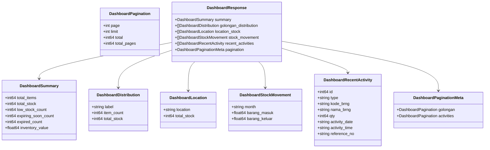
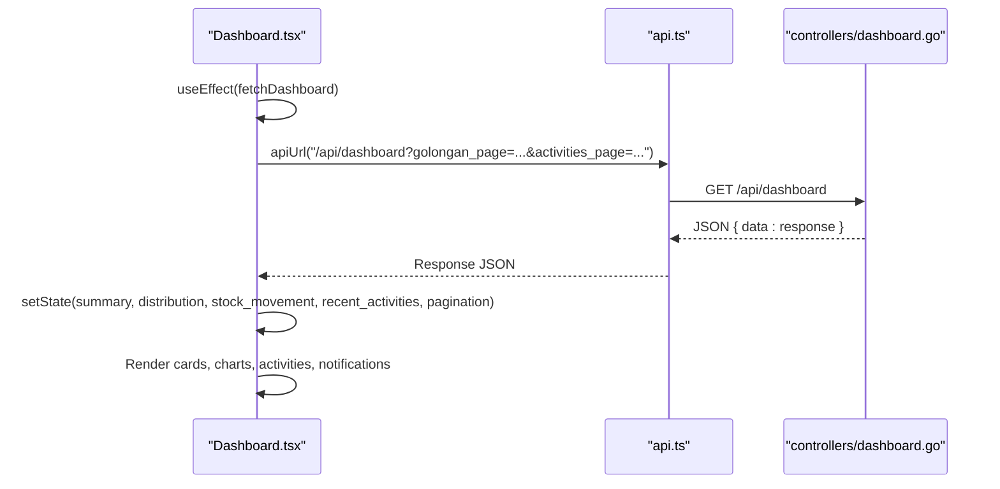
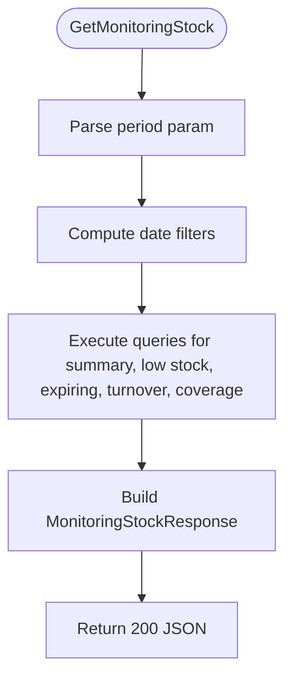
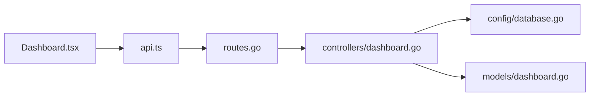

# Dashboard Analytics

<cite>
**Referenced Files in This Document**
- [dashboard.go](file://backend/controllers/dashboard.go)
- [dashboard.go](file://backend/models/dashboard.go)
- [routes.go](file://backend/routes/routes.go)
- [database.go](file://backend/config/database.go)
- [api.ts](file://frontend/src/lib/api.ts)
- [Dashboard.tsx](file://frontend/src/components/pages/Dashboard.tsx)
- [page.tsx](file://frontend/src/app/dashboard/page.tsx)
- [monitoringStockB.go](file://backend/controllers/monitoringStockB.go)
- [monitoringStock.go](file://backend/models/monitoringStock.go)
- [expireFilters.go](file://backend/controllers/expireFilters.go)
</cite>

## Table of Contents
1. [Introduction](#introduction)
2. [Project Structure](#project-structure)
3. [Core Components](#core-components)
4. [Architecture Overview](#architecture-overview)
5. [Detailed Component Analysis](#detailed-component-analysis)
6. [Dependency Analysis](#dependency-analysis)
7. [Performance Considerations](#performance-considerations)
8. [Troubleshooting Guide](#troubleshooting-guide)
9. [Conclusion](#conclusion)

## Introduction
This document provides comprehensive documentation for the Dashboard Analytics feature, focusing on real-time metrics calculation, multi-threaded analytics implementation, caching mechanisms, and dashboard components. It covers the backend controller that orchestrates concurrent metric computations, the frontend components that render summary cards, charts, and recent activity feeds, and the monitoring capabilities for stock expiration and low inventory levels.

## Project Structure
The Dashboard Analytics feature spans both backend and frontend layers:
- Backend: Gin-based REST API with concurrent metric computation and in-memory caching
- Frontend: Next.js React components with Recharts for visualization and paginated lists
- Database: MySQL via GORM with strategic indexes for performance

**Diagram sources**
- [routes.go:9-23](file://backend/routes/routes.go#L9-L23)
- [dashboard.go:43-305](file://backend/controllers/dashboard.go#L43-L305)
- [dashboard.go:1-60](file://backend/models/dashboard.go#L1-L60)
- [database.go:11-83](file://backend/config/database.go#L11-L83)
- [api.ts:15-18](file://frontend/src/lib/api.ts#L15-L18)
- [Dashboard.tsx:173-214](file://frontend/src/components/pages/Dashboard.tsx#L173-L214)

**Section sources**
- [routes.go:9-23](file://backend/routes/routes.go#L9-L23)
- [dashboard.go:43-305](file://backend/controllers/dashboard.go#L43-L305)
- [dashboard.go:1-60](file://backend/models/dashboard.go#L1-L60)
- [database.go:11-83](file://backend/config/database.go#L11-L83)
- [api.ts:15-18](file://frontend/src/lib/api.ts#L15-L18)
- [Dashboard.tsx:173-214](file://frontend/src/components/pages/Dashboard.tsx#L173-L214)

## Core Components
- Backend Dashboard Controller: Orchestrates six concurrent SQL queries for summary metrics, expiring/expired counts, category distribution, location stock, stock movement, and recent activities. Implements an in-memory cache keyed by pagination parameters with a 30-second TTL.
- Backend Models: Define structured response shapes for dashboard metrics, pagination metadata, and related entities.
- Frontend Dashboard Component: Fetches dashboard data, renders summary cards, bar/pie charts, and paginated recent activity feed. Provides notification panel and pagination controls.
- Database Layer: Establishes connection to MySQL and ensures indexes for optimal query performance on frequently accessed columns.

**Section sources**
- [dashboard.go:43-305](file://backend/controllers/dashboard.go#L43-L305)
- [dashboard.go:1-60](file://backend/models/dashboard.go#L1-L60)
- [Dashboard.tsx:157-667](file://frontend/src/components/pages/Dashboard.tsx#L157-L667)
- [database.go:11-83](file://backend/config/database.go#L11-L83)

## Architecture Overview
The system follows a client-server architecture:
- Frontend requests dashboard data with pagination parameters.
- Backend validates parameters, checks cache, and executes concurrent SQL queries.
- Results are aggregated into a unified response and cached.
- Frontend renders summary cards, charts, and recent activity feed.

**Diagram sources**
- [Dashboard.tsx:173-214](file://frontend/src/components/pages/Dashboard.tsx#L173-L214)
- [api.ts:15-18](file://frontend/src/lib/api.ts#L15-L18)
- [routes.go:23](file://backend/routes/routes.go#L23)
- [dashboard.go:43-305](file://backend/controllers/dashboard.go#L43-L305)
- [database.go:11-83](file://backend/config/database.go#L11-L83)

## Detailed Component Analysis

### Backend Dashboard Controller
- Pagination parsing: Validates and defaults pagination parameters for category distribution and recent activities.
- Caching: Uses an in-memory map protected by a RWMutex with a 30-second TTL keyed by page/limit combinations.
- Concurrency: Executes six independent SQL queries concurrently using WaitGroup and captures the first error.
- Metrics:
  - Summary: Total items, total stock, inventory value, low stock count threshold set to 50.
  - Expiration: Counts items expiring soon (within 30 days) and expired.
  - Category distribution: Paginated counts by category with totals and stock aggregation.
  - Locations: Stock totals per location.
  - Stock movement: Monthly inflow/outflow over the last 3 months.
  - Recent activities: Today’s transactions with pagination.

**Diagram sources**
- [dashboard.go:43-305](file://backend/controllers/dashboard.go#L43-L305)

**Section sources**
- [dashboard.go:43-305](file://backend/controllers/dashboard.go#L43-L305)

### Backend Models
- DashboardSummary: Fields for total items, total stock, low stock count, expiring soon count, expired count, and inventory value.
- DashboardResponse: Aggregates summary, category distribution, location stock, stock movement, recent activities, and pagination metadata.
- Supporting types: Distribution, Location, StockMovement, RecentActivity, Pagination, and PaginationMeta.

**Diagram sources**
- [dashboard.go:1-60](file://backend/models/dashboard.go#L1-L60)

**Section sources**
- [dashboard.go:1-60](file://backend/models/dashboard.go#L1-L60)

### Frontend Dashboard Component
- Fetching: Builds query parameters for pagination and fetches from the backend API.
- Rendering:
  - Summary cards: Total stock, low stock, expired, expiring soon, and inventory value.
  - Charts: Stock movement bar chart and category distribution pie chart.
  - Recent activities: Today’s transactions with type indicators and timestamps.
  - Notifications: Inline bell with unread count and notification list.
  - Pagination: Controls for category distribution and recent activities.

**Diagram sources**
- [Dashboard.tsx:173-214](file://frontend/src/components/pages/Dashboard.tsx#L173-L214)
- [api.ts:15-18](file://frontend/src/lib/api.ts#L15-L18)
- [routes.go:23](file://backend/routes/routes.go#L23)
- [dashboard.go:43-305](file://backend/controllers/dashboard.go#L43-L305)

**Section sources**
- [Dashboard.tsx:157-667](file://frontend/src/components/pages/Dashboard.tsx#L157-L667)
- [api.ts:15-18](file://frontend/src/lib/api.ts#L15-L18)

### Monitoring and Alerts (Related Feature)
While the dashboard focuses on aggregated metrics, the monitoring feature provides deeper insights:
- Thresholds: Critical stock (<20), Restock needed (20–50), Expiring soon (≤30 days).
- Coverage status: Based on daily usage and remaining days.
- Period selection: Day, Month, Year, All with dynamic date filters.
- Expiration filtering: Validates dates within acceptable ranges.

**Diagram sources**
- [monitoringStockB.go:83-362](file://backend/controllers/monitoringStockB.go#L83-L362)
- [monitoringStock.go:1-81](file://backend/models/monitoringStock.go#L1-L81)
- [expireFilters.go:1-11](file://backend/controllers/expireFilters.go#L1-L11)

**Section sources**
- [monitoringStockB.go:83-362](file://backend/controllers/monitoringStockB.go#L83-L362)
- [monitoringStock.go:1-81](file://backend/models/monitoringStock.go#L1-L81)
- [expireFilters.go:1-11](file://backend/controllers/expireFilters.go#L1-L11)

## Dependency Analysis
- Route binding: The GET /api/dashboard endpoint delegates to the dashboard controller.
- Controller dependencies: Uses database connection, models, and concurrency primitives.
- Frontend dependencies: Uses api.ts for base URL construction and Recharts for visualization.
- Database indexes: Ensures efficient joins and filtering for dashboard queries.

**Diagram sources**
- [routes.go:9-23](file://backend/routes/routes.go#L9-L23)
- [dashboard.go:43-305](file://backend/controllers/dashboard.go#L43-L305)
- [database.go:11-83](file://backend/config/database.go#L11-L83)
- [Dashboard.tsx:173-214](file://frontend/src/components/pages/Dashboard.tsx#L173-L214)
- [api.ts:15-18](file://frontend/src/lib/api.ts#L15-L18)

**Section sources**
- [routes.go:9-23](file://backend/routes/routes.go#L9-L23)
- [dashboard.go:43-305](file://backend/controllers/dashboard.go#L43-L305)
- [database.go:11-83](file://backend/config/database.go#L11-L83)
- [Dashboard.tsx:173-214](file://frontend/src/components/pages/Dashboard.tsx#L173-L214)
- [api.ts:15-18](file://frontend/src/lib/api.ts#L15-L18)

## Performance Considerations
- Concurrency: Six independent queries executed concurrently reduce total latency.
- Caching: In-memory cache with 30-second TTL minimizes repeated heavy computations for identical pagination parameters.
- Indexing: Strategic indexes on frequently filtered columns improve query performance.
- Pagination: Limits and offsets prevent large result sets and support scalable rendering.
- Frontend rendering: Conditional rendering and responsive charts optimize user experience.

[No sources needed since this section provides general guidance]

## Troubleshooting Guide
- Dashboard fetch errors: The frontend displays an error state and logs to console when the backend returns non-OK responses.
- Cache invalidation: If stale data appears, wait for the 30-second TTL to expire or adjust pagination parameters to bypass cache.
- Database connectivity: Verify MySQL connection and indexes; ensure the SIK database is reachable.
- Monitoring thresholds: Adjust thresholds in the monitoring controller if stock levels require different sensitivity.

**Section sources**
- [Dashboard.tsx:199-208](file://frontend/src/components/pages/Dashboard.tsx#L199-L208)
- [database.go:11-83](file://backend/config/database.go#L11-L83)
- [monitoringStockB.go:12-16](file://backend/controllers/monitoringStockB.go#L12-L16)

## Conclusion
The Dashboard Analytics feature delivers real-time inventory insights through a robust backend controller that performs concurrent metric computations, caches results for performance, and exposes a clean API consumed by frontend components. The frontend renders summary cards, charts, and recent activity feeds with pagination and notifications, while the monitoring feature complements the dashboard with deeper stock and expiration insights.