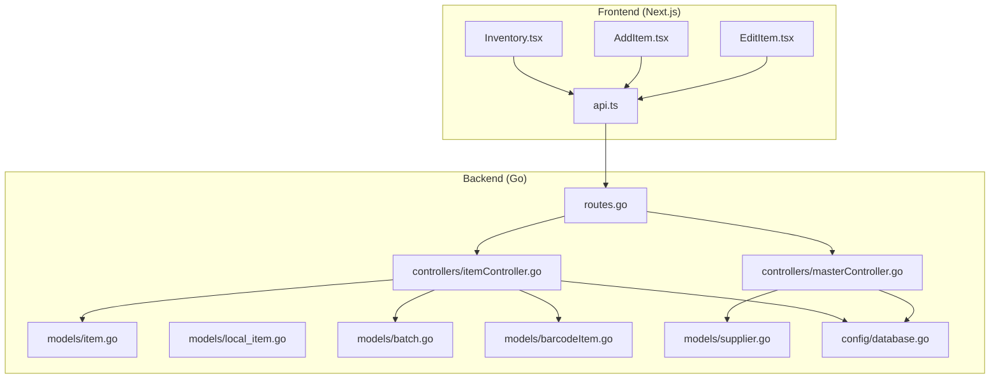
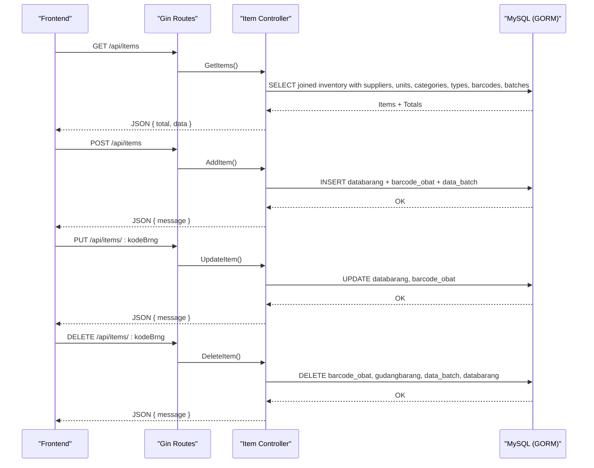
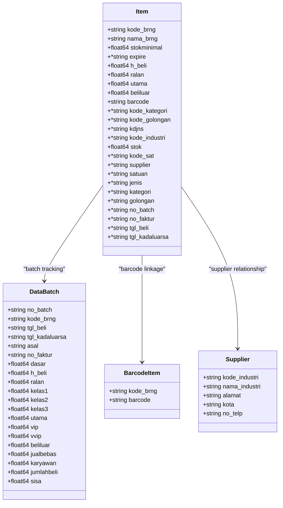
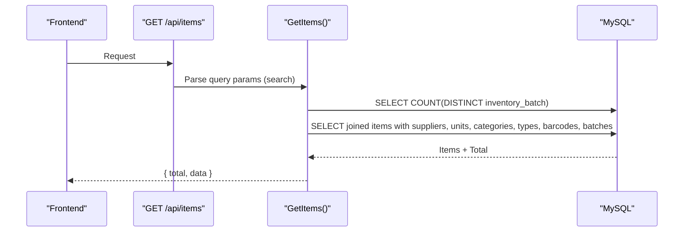
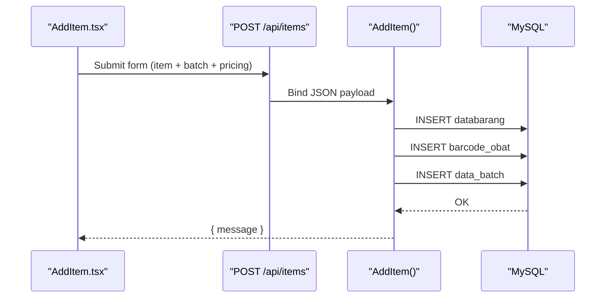
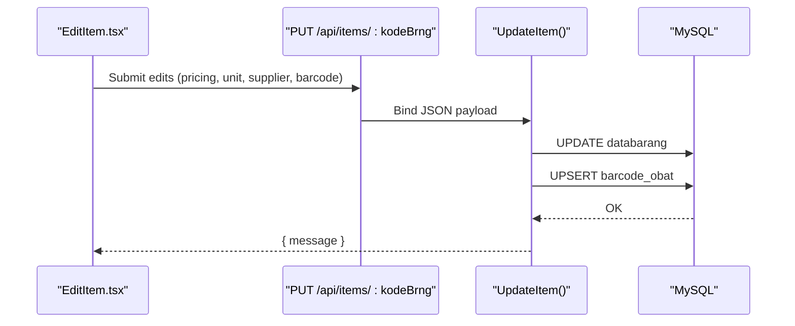
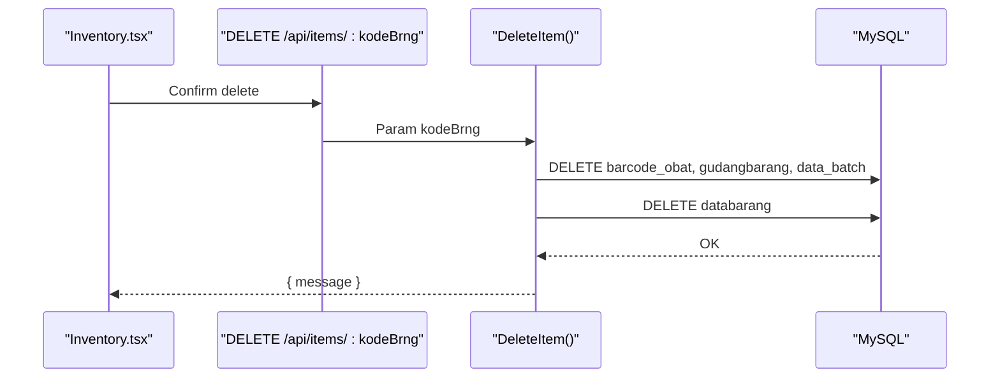
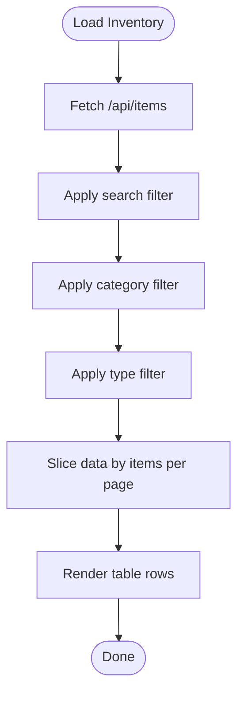
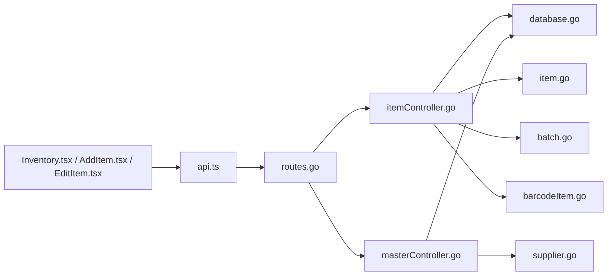

# Inventory Management

<cite>
**Referenced Files in This Document**
- [backend/main.go](file://backend/main.go)
- [backend/config/database.go](file://backend/config/database.go)
- [backend/routes/routes.go](file://backend/routes/routes.go)
- [backend/controllers/itemController.go](file://backend/controllers/itemController.go)
- [backend/controllers/masterController.go](file://backend/controllers/masterController.go)
- [backend/models/item.go](file://backend/models/item.go)
- [backend/models/local_item.go](file://backend/models/local_item.go)
- [backend/models/barcodeItem.go](file://backend/models/barcodeItem.go)
- [backend/models/batch.go](file://backend/models/batch.go)
- [backend/models/supplier.go](file://backend/models/supplier.go)
- [frontend/src/lib/api.ts](file://frontend/src/lib/api.ts)
- [frontend/src/components/pages/Inventory.tsx](file://frontend/src/components/pages/Inventory.tsx)
- [frontend/src/app/inventory/page.tsx](file://frontend/src/app/inventory/page.tsx)
- [frontend/src/components/pages/AddItem.tsx](file://frontend/src/components/pages/AddItem.tsx)
- [frontend/src/app/add-item/page.tsx](file://frontend/src/app/add-item/page.tsx)
- [frontend/src/components/pages/EditItem.tsx](file://frontend/src/components/pages/EditItem.tsx)
</cite>

## Table of Contents
1. [Introduction](#introduction)
2. [Project Structure](#project-structure)
3. [Core Components](#core-components)
4. [Architecture Overview](#architecture-overview)
5. [Detailed Component Analysis](#detailed-component-analysis)
6. [Dependency Analysis](#dependency-analysis)
7. [Performance Considerations](#performance-considerations)
8. [Troubleshooting Guide](#troubleshooting-guide)
9. [Conclusion](#conclusion)
10. [Appendices](#appendices)

## Introduction
This document provides comprehensive documentation for the Inventory Management feature in a healthcare facility inventory system. It covers item CRUD operations (create, read, update, delete), the item data model with medical supply attributes, barcode integration, batch tracking, supplier relationships, search and filtering, pagination, validation rules, categorization/classification systems, and frontend components for listing, adding, and editing items. It also includes API endpoint definitions and user workflows for managing medical inventory.

## Project Structure
The system follows a layered architecture:
- Backend: Go Gin web framework with GORM ORM connecting to a MySQL database
- Frontend: Next.js React application consuming REST APIs
- Routes define endpoints for items, masters, suppliers, stock movements, and dashboards
- Controllers orchestrate requests, query models, and return JSON responses
- Models represent database entities and relationships
- Frontend components render lists, forms, and editors with pagination and filters

**Diagram sources**
- [backend/routes/routes.go:1-36](file://backend/routes/routes.go#L1-L36)
- [backend/controllers/itemController.go:1-284](file://backend/controllers/itemController.go#L1-L284)
- [backend/controllers/masterController.go:1-206](file://backend/controllers/masterController.go#L1-L206)
- [backend/models/item.go:1-33](file://backend/models/item.go#L1-L33)
- [backend/models/local_item.go:1-34](file://backend/models/local_item.go#L1-L34)
- [backend/models/batch.go:1-29](file://backend/models/batch.go#L1-L29)
- [backend/models/barcodeItem.go:1-12](file://backend/models/barcodeItem.go#L1-L12)
- [backend/models/supplier.go:1-14](file://backend/models/supplier.go#L1-L14)
- [backend/config/database.go:1-111](file://backend/config/database.go#L1-L111)
- [frontend/src/lib/api.ts:1-19](file://frontend/src/lib/api.ts#L1-L19)
- [frontend/src/components/pages/Inventory.tsx:1-606](file://frontend/src/components/pages/Inventory.tsx#L1-L606)
- [frontend/src/components/pages/AddItem.tsx:1-708](file://frontend/src/components/pages/AddItem.tsx#L1-L708)
- [frontend/src/components/pages/EditItem.tsx:1-626](file://frontend/src/components/pages/EditItem.tsx#L1-L626)

**Section sources**
- [backend/routes/routes.go:1-36](file://backend/routes/routes.go#L1-L36)
- [backend/config/database.go:1-111](file://backend/config/database.go#L1-L111)
- [frontend/src/lib/api.ts:1-19](file://frontend/src/lib/api.ts#L1-L19)

## Core Components
- Item data model representing medical supplies with pricing tiers, unit, supplier, expiration, and classification fields
- Batch model for tracking purchase batches with quantities, prices, and expiry dates
- Barcode model linking product codes to barcodes
- Master data controllers for suppliers, units, categories, and types
- Item controllers implementing CRUD with joins, search, and pagination
- Frontend pages for listing, adding, and editing items with filters and pagination

**Section sources**
- [backend/models/item.go:1-33](file://backend/models/item.go#L1-L33)
- [backend/models/batch.go:1-29](file://backend/models/batch.go#L1-L29)
- [backend/models/barcodeItem.go:1-12](file://backend/models/barcodeItem.go#L1-L12)
- [backend/controllers/masterController.go:51-95](file://backend/controllers/masterController.go#L51-L95)
- [backend/controllers/itemController.go:22-96](file://backend/controllers/itemController.go#L22-L96)
- [frontend/src/components/pages/Inventory.tsx:62-132](file://frontend/src/components/pages/Inventory.tsx#L62-L132)

## Architecture Overview
The system uses REST endpoints to expose inventory operations. Controllers query the database via GORM, joining multiple tables to enrich item data with supplier, unit, category, type, latest batch, and barcode information. The frontend consumes these endpoints to render lists, forms, and editors.

**Diagram sources**
- [backend/routes/routes.go:10-22](file://backend/routes/routes.go#L10-L22)
- [backend/controllers/itemController.go:98-283](file://backend/controllers/itemController.go#L98-L283)
- [backend/config/database.go:21-31](file://backend/config/database.go#L21-L31)

## Detailed Component Analysis

### Item Data Model
The item model encapsulates essential attributes for medical supplies:
- Product identifiers and names
- Pricing tiers: purchase price, retail, general, main (BPJS), external pharmacy
- Unit, category, type, supplier, and industry code
- Stock quantity and batch/facture metadata
- Expiration date and barcode linkage

**Diagram sources**
- [backend/models/item.go:3-28](file://backend/models/item.go#L3-L28)
- [backend/models/batch.go:3-24](file://backend/models/batch.go#L3-L24)
- [backend/models/barcodeItem.go:3-7](file://backend/models/barcodeItem.go#L3-L7)
- [backend/models/supplier.go:3-13](file://backend/models/supplier.go#L3-L13)

**Section sources**
- [backend/models/item.go:1-33](file://backend/models/item.go#L1-L33)
- [backend/models/batch.go:1-29](file://backend/models/batch.go#L1-L29)
- [backend/models/barcodeItem.go:1-12](file://backend/models/barcodeItem.go#L1-L12)
- [backend/models/supplier.go:1-14](file://backend/models/supplier.go#L1-L14)

### Item CRUD Operations

#### Read: List and Retrieve Items
- List items with pagination and totals using a complex join query that aggregates stock per batch and links supplier, unit, category, type, barcode, and batch dates
- Retrieve a single item by product code with enriched details

**Diagram sources**
- [backend/controllers/itemController.go:98-215](file://backend/controllers/itemController.go#L98-L215)

**Section sources**
- [backend/controllers/itemController.go:22-96](file://backend/controllers/itemController.go#L22-L96)
- [backend/controllers/itemController.go:98-215](file://backend/controllers/itemController.go#L98-L215)

#### Create: Add New Item
- Backend creates the item record and associated barcode and batch records
- Frontend validates required fields, formats currency inputs, and submits JSON payload

**Diagram sources**
- [frontend/src/components/pages/AddItem.tsx:119-224](file://frontend/src/components/pages/AddItem.tsx#L119-L224)
- [backend/controllers/itemController.go:119-120](file://backend/controllers/itemController.go#L119-L120)

**Section sources**
- [frontend/src/components/pages/AddItem.tsx:119-224](file://frontend/src/components/pages/AddItem.tsx#L119-L224)
- [backend/controllers/itemController.go:119-120](file://backend/controllers/itemController.go#L119-L120)

#### Update: Modify Item Details
- Updates item master data and barcode; maintains backward compatibility with legacy pricing fields
- Frontend loads existing values, formats currency, and posts updates

**Diagram sources**
- [frontend/src/components/pages/EditItem.tsx:151-191](file://frontend/src/components/pages/EditItem.tsx#L151-L191)
- [backend/controllers/itemController.go:217-267](file://backend/controllers/itemController.go#L217-L267)

**Section sources**
- [frontend/src/components/pages/EditItem.tsx:151-191](file://frontend/src/components/pages/EditItem.tsx#L151-L191)
- [backend/controllers/itemController.go:217-267](file://backend/controllers/itemController.go#L217-L267)

#### Delete: Remove Item
- Removes barcode, stock, batch records, and the item master record

**Diagram sources**
- [frontend/src/components/pages/Inventory.tsx:134-161](file://frontend/src/components/pages/Inventory.tsx#L134-L161)
- [backend/controllers/itemController.go:269-283](file://backend/controllers/itemController.go#L269-L283)

**Section sources**
- [frontend/src/components/pages/Inventory.tsx:134-161](file://frontend/src/components/pages/Inventory.tsx#L134-L161)
- [backend/controllers/itemController.go:269-283](file://backend/controllers/itemController.go#L269-L283)

### Search, Filtering, and Pagination
- Backend search supports product name, product code, barcode, batch number, and invoice number
- Frontend applies client-side filters for category (golongan), type (jenis), and free-text search
- Pagination is implemented client-side with configurable items per page

**Diagram sources**
- [frontend/src/components/pages/Inventory.tsx:201-234](file://frontend/src/components/pages/Inventory.tsx#L201-L234)

**Section sources**
- [backend/controllers/itemController.go:202-210](file://backend/controllers/itemController.go#L202-L210)
- [frontend/src/components/pages/Inventory.tsx:201-234](file://frontend/src/components/pages/Inventory.tsx#L201-L234)

### Validation Rules
- Required fields during creation: product name, supplier, unit, category, type, expiry, batch number, invoice number, purchase date, purchase price, selling prices, and initial stock
- Currency fields are formatted and sanitized before submission
- Stock must be greater than zero
- Date fields validated for reasonable ranges

**Section sources**
- [frontend/src/components/pages/AddItem.tsx:119-143](file://frontend/src/components/pages/AddItem.tsx#L119-L143)
- [frontend/src/components/pages/EditItem.tsx:151-191](file://frontend/src/components/pages/EditItem.tsx#L151-L191)

### Barcode Integration
- Barcode is stored in a dedicated table linked to product code
- Update operation upserts barcode if present
- Frontend exposes a scan button placeholder for barcode capture

**Section sources**
- [backend/models/barcodeItem.go:1-12](file://backend/models/barcodeItem.go#L1-L12)
- [backend/controllers/itemController.go:255-264](file://backend/controllers/itemController.go#L255-L264)
- [frontend/src/components/pages/AddItem.tsx:306-312](file://frontend/src/components/pages/AddItem.tsx#L306-L312)
- [frontend/src/components/pages/EditItem.tsx:323-329](file://frontend/src/components/pages/EditItem.tsx#L323-L329)

### Categorization and Classification
- Categories: golongan_barang (medical category)
- Types: jenis (product type)
- Units: kodesatuan (unit of measure)
- Suppliers: industrifarmasi (vendor)
- Master endpoints support CRUD for these classifications

**Section sources**
- [backend/controllers/masterController.go:51-95](file://backend/controllers/masterController.go#L51-L95)
- [backend/routes/routes.go:13-16](file://backend/routes/routes.go#L13-L16)

### Frontend Components

#### Inventory Listing
- Displays item table with pricing, stock, supplier, unit, category, type, barcode, batch, and invoice
- Supports search, category/type filters, and pagination
- Provides actions to edit and delete items

**Section sources**
- [frontend/src/components/pages/Inventory.tsx:62-606](file://frontend/src/components/pages/Inventory.tsx#L62-L606)
- [frontend/src/app/inventory/page.tsx:1-12](file://frontend/src/app/inventory/page.tsx#L1-L12)

#### Add Item Form
- Collects product details, pricing tiers, supplier, unit, category, type, barcode, batch, invoice, purchase date, and expiry
- Validates required fields and formats currency inputs
- Submits to backend to create item, barcode, and batch records

**Section sources**
- [frontend/src/components/pages/AddItem.tsx:17-708](file://frontend/src/components/pages/AddItem.tsx#L17-L708)
- [frontend/src/app/add-item/page.tsx:1-12](file://frontend/src/app/add-item/page.tsx#L1-L12)

#### Edit Item Form
- Loads existing item data, formats currency and stock
- Allows updates to pricing, supplier, unit, category, type, barcode, and expiry
- Posts updates to backend

**Section sources**
- [frontend/src/components/pages/EditItem.tsx:55-626](file://frontend/src/components/pages/EditItem.tsx#L55-L626)

## Dependency Analysis
- Routes depend on controllers for business logic
- Controllers depend on GORM models and database configuration
- Frontend depends on API base URL configuration and consumes REST endpoints
- Database indices improve query performance for stock, expiry, and dashboard queries

**Diagram sources**
- [backend/routes/routes.go:1-36](file://backend/routes/routes.go#L1-L36)
- [backend/controllers/itemController.go:1-284](file://backend/controllers/itemController.go#L1-L284)
- [backend/controllers/masterController.go:1-206](file://backend/controllers/masterController.go#L1-L206)
- [backend/config/database.go:1-111](file://backend/config/database.go#L1-L111)
- [frontend/src/lib/api.ts:1-19](file://frontend/src/lib/api.ts#L1-L19)
- [frontend/src/components/pages/Inventory.tsx:1-606](file://frontend/src/components/pages/Inventory.tsx#L1-L606)
- [frontend/src/components/pages/AddItem.tsx:1-708](file://frontend/src/components/pages/AddItem.tsx#L1-L708)
- [frontend/src/components/pages/EditItem.tsx:1-626](file://frontend/src/components/pages/EditItem.tsx#L1-L626)

**Section sources**
- [backend/config/database.go:50-83](file://backend/config/database.go#L50-L83)
- [backend/routes/routes.go:1-36](file://backend/routes/routes.go#L1-L36)

## Performance Considerations
- Database indices exist for stock, expiry, and dashboard-related queries to optimize retrieval performance
- Aggregation queries for inventory leverage grouped selects and joins; ensure appropriate indexing on join keys
- Client-side pagination reduces payload sizes but still requires backend total counts for accurate pagination controls

[No sources needed since this section provides general guidance]

## Troubleshooting Guide
- API base URL resolution: Verify NEXT_PUBLIC_API_URL or fallback host/port configuration
- CORS and routing: Ensure routes match frontend calls (/api/items, /api/masters, etc.)
- Database connectivity: Confirm MySQL credentials and that SIK database connection is established
- Missing indices: Re-run migrations or ensure ensureIndex logic executes successfully

**Section sources**
- [frontend/src/lib/api.ts:1-19](file://frontend/src/lib/api.ts#L1-L19)
- [backend/config/database.go:13-31](file://backend/config/database.go#L13-L31)
- [backend/config/database.go:85-110](file://backend/config/database.go#L85-L110)

## Conclusion
The Inventory Management feature provides a robust foundation for healthcare inventory operations. It integrates item master data, batch tracking, supplier relationships, barcode linkage, and comprehensive search/filtering with pagination. The frontend offers intuitive forms for adding and editing items, while the backend ensures data integrity through validation and structured CRUD operations.

## Appendices

### API Endpoints Summary
- GET /api/items: List items with pagination and totals
- GET /api/items/:kodeBrng: Retrieve item by product code
- POST /api/items: Create item, barcode, and batch
- PUT /api/items/:kodeBrng: Update item and barcode
- DELETE /api/items/:kodeBrng: Delete item and related records
- GET /api/masters: Retrieve master lists (units, types, categories, suppliers)
- POST /api/masters/:type: Add master entry
- PUT /api/masters/:type/:code: Update master entry
- DELETE /api/masters/:type/:code: Delete master entry

**Section sources**
- [backend/routes/routes.go:10-34](file://backend/routes/routes.go#L10-L34)