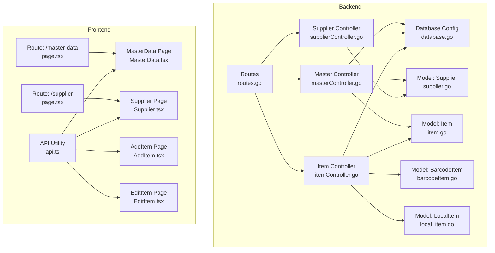
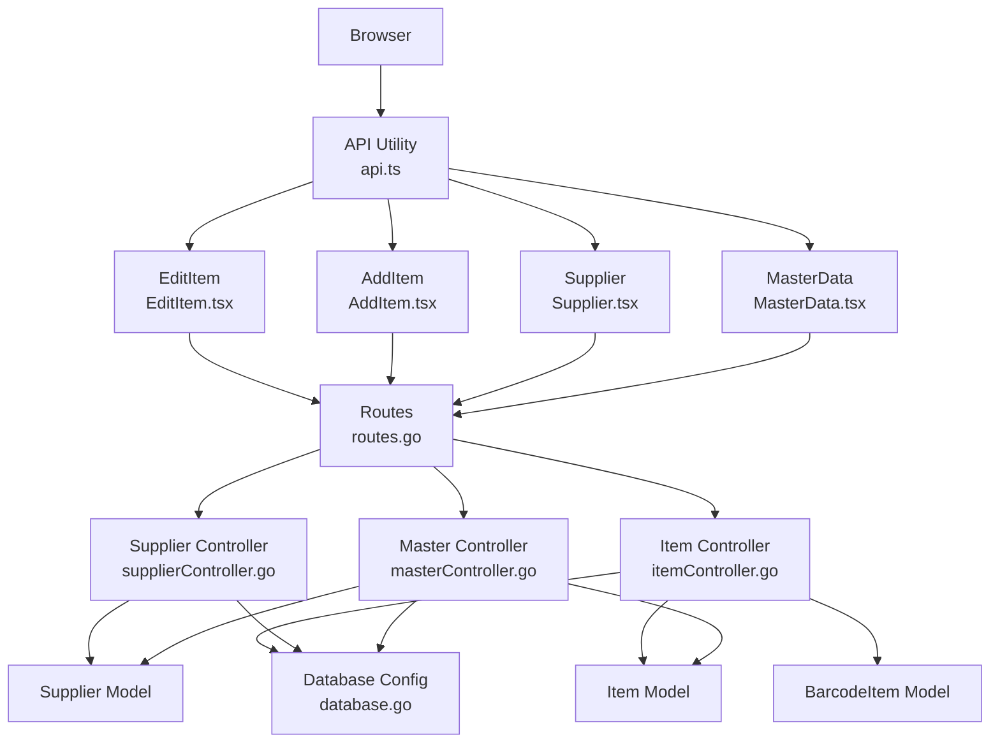
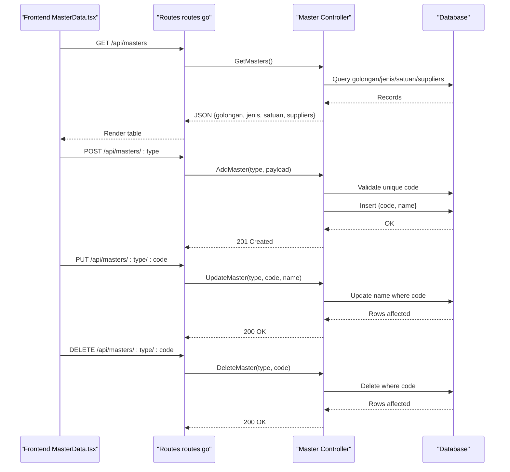
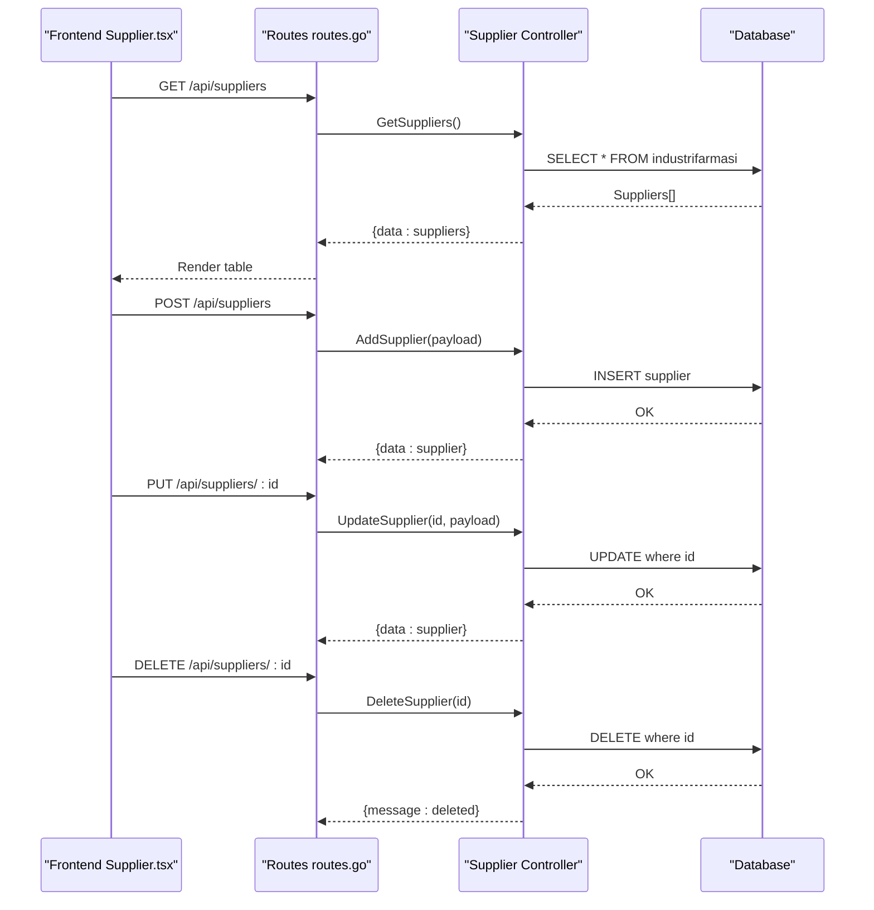
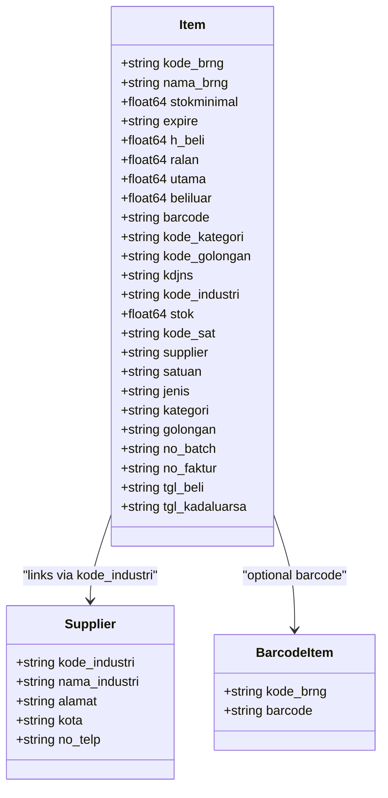
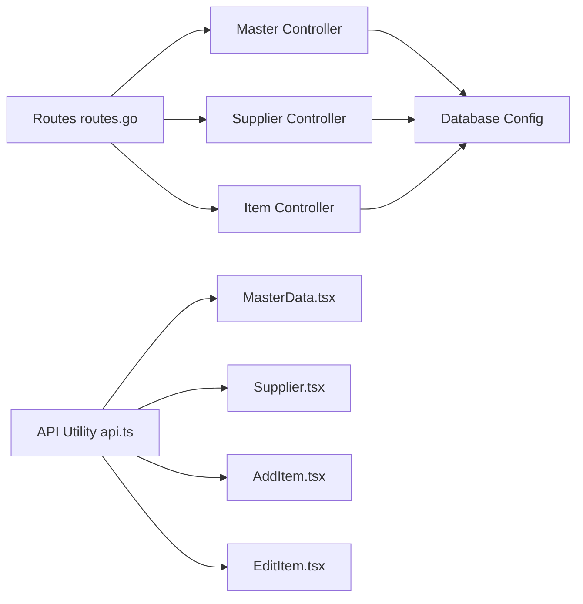

# Master Data Management

<cite>
**Referenced Files in This Document**
- [routes.go](file://backend/routes/routes.go)
- [database.go](file://backend/config/database.go)
- [masterController.go](file://backend/controllers/masterController.go)
- [supplierController.go](file://backend/controllers/supplierController.go)
- [itemController.go](file://backend/controllers/itemController.go)
- [supplier.go](file://backend/models/supplier.go)
- [item.go](file://backend/models/item.go)
- [barcodeItem.go](file://backend/models/barcodeItem.go)
- [local_item.go](file://backend/models/local_item.go)
- [api.ts](file://frontend/src/lib/api.ts)
- [MasterData.tsx](file://frontend/src/components/pages/MasterData.tsx)
- [Supplier.tsx](file://frontend/src/components/pages/Supplier.tsx)
- [AddItem.tsx](file://frontend/src/components/pages/AddItem.tsx)
- [EditItem.tsx](file://frontend/src/components/pages/EditItem.tsx)
- [page.tsx (Master Data)](file://frontend/src/app/master-data/page.tsx)
- [page.tsx (Supplier)](file://frontend/src/app/supplier/page.tsx)
</cite>

## Table of Contents
1. [Introduction](#introduction)
2. [Project Structure](#project-structure)
3. [Core Components](#core-components)
4. [Architecture Overview](#architecture-overview)
5. [Detailed Component Analysis](#detailed-component-analysis)
6. [Dependency Analysis](#dependency-analysis)
7. [Performance Considerations](#performance-considerations)
8. [Troubleshooting Guide](#troubleshooting-guide)
9. [Conclusion](#conclusion)
10. [Appendices](#appendices)

## Introduction
This document describes the Master Data Management feature for the healthcare supply chain application. It covers supplier management, classification and unit-of-measurement management, item classification systems, supplier-item mappings, and data validation rules. It also documents maintenance workflows, lookup table management, data integrity constraints, frontend components for editing and searching, API endpoints for lookup operations, and integration patterns with inventory and stock operations. The goal is to ensure data consistency and referential integrity across suppliers, categories, units, and items.

## Project Structure
The Master Data Management feature spans backend controllers, models, and frontend components:
- Backend routes define endpoints for master data, suppliers, and items.
- Controllers implement CRUD operations against lookup tables and integrate supplier and item data.
- Models represent supplier, item, and barcode entities.
- Frontend pages and components render forms, lists, and validation feedback for master data and supplier management.

**Diagram sources**
- [routes.go:9-35](file://backend/routes/routes.go#L9-L35)
- [database.go:11-89](file://backend/config/database.go#L11-L89)
- [masterController.go:51-205](file://backend/controllers/masterController.go#L51-L205)
- [supplierController.go:10-80](file://backend/controllers/supplierController.go#L10-L80)
- [itemController.go:22-283](file://backend/controllers/itemController.go#L22-L283)
- [supplier.go:3-14](file://backend/models/supplier.go#L3-L14)
- [item.go:3-33](file://backend/models/item.go#L3-L33)
- [barcodeItem.go:3-12](file://backend/models/barcodeItem.go#L3-L12)
- [local_item.go:5-34](file://backend/models/local_item.go#L5-L34)
- [api.ts:15-18](file://frontend/src/lib/api.ts#L15-L18)
- [MasterData.tsx:58-536](file://frontend/src/components/pages/MasterData.tsx#L58-L536)
- [Supplier.tsx:20-483](file://frontend/src/components/pages/Supplier.tsx#L20-L483)
- [AddItem.tsx:17-708](file://frontend/src/components/pages/AddItem.tsx#L17-L708)
- [EditItem.tsx:55-626](file://frontend/src/components/pages/EditItem.tsx#L55-L626)
- [page.tsx (Master Data):6-12](file://frontend/src/app/master-data/page.tsx#L6-L12)
- [page.tsx (Supplier):6-12](file://frontend/src/app/supplier/page.tsx#L6-L12)

**Section sources**
- [routes.go:9-35](file://backend/routes/routes.go#L9-L35)
- [database.go:11-89](file://backend/config/database.go#L11-L89)
- [api.ts:15-18](file://frontend/src/lib/api.ts#L15-L18)

## Core Components
- Lookup master management (golongan, jenis, satuan) via unified controller supporting create, update, delete, and bulk retrieval.
- Supplier management with CRUD operations and search capabilities.
- Item management integrating supplier, unit, category, and pricing with barcode support.
- Frontend pages for master data editing, supplier management, and item creation/editing with validation and messaging.

Key implementation highlights:
- Unified master table configuration and CRUD routing.
- Supplier entity with address, city, and phone fields.
- Item entity linking supplier, unit, category, and classification codes.
- Barcode mapping for items with unique constraint enforcement.
- Frontend forms validating required fields and providing user feedback.

**Section sources**
- [masterController.go:23-49](file://backend/controllers/masterController.go#L23-L49)
- [masterController.go:97-139](file://backend/controllers/masterController.go#L97-L139)
- [masterController.go:141-178](file://backend/controllers/masterController.go#L141-L178)
- [masterController.go:180-205](file://backend/controllers/masterController.go#L180-L205)
- [supplierController.go:10-80](file://backend/controllers/supplierController.go#L10-L80)
- [itemController.go:22-283](file://backend/controllers/itemController.go#L22-L283)
- [supplier.go:3-14](file://backend/models/supplier.go#L3-L14)
- [item.go:3-33](file://backend/models/item.go#L3-L33)
- [barcodeItem.go:3-12](file://backend/models/barcodeItem.go#L3-L12)
- [MasterData.tsx:58-536](file://frontend/src/components/pages/MasterData.tsx#L58-L536)
- [Supplier.tsx:20-483](file://frontend/src/components/pages/Supplier.tsx#L20-L483)
- [AddItem.tsx:17-708](file://frontend/src/components/pages/AddItem.tsx#L17-L708)
- [EditItem.tsx:55-626](file://frontend/src/components/pages/EditItem.tsx#L55-L626)

## Architecture Overview
The system follows a layered architecture:
- Routes define HTTP endpoints for master data, suppliers, and items.
- Controllers orchestrate data retrieval, validation, and persistence.
- Models map to database tables for suppliers, items, and barcodes.
- Frontend pages consume APIs and present validated forms.

**Diagram sources**
- [routes.go:9-35](file://backend/routes/routes.go#L9-L35)
- [masterController.go:51-205](file://backend/controllers/masterController.go#L51-L205)
- [supplierController.go:10-80](file://backend/controllers/supplierController.go#L10-L80)
- [itemController.go:22-283](file://backend/controllers/itemController.go#L22-L283)
- [database.go:11-89](file://backend/config/database.go#L11-L89)
- [api.ts:15-18](file://frontend/src/lib/api.ts#L15-L18)
- [MasterData.tsx:58-536](file://frontend/src/components/pages/MasterData.tsx#L58-L536)
- [Supplier.tsx:20-483](file://frontend/src/components/pages/Supplier.tsx#L20-L483)
- [AddItem.tsx:17-708](file://frontend/src/components/pages/AddItem.tsx#L17-L708)
- [EditItem.tsx:55-626](file://frontend/src/components/pages/EditItem.tsx#L55-L626)

## Detailed Component Analysis

### Master Data Management (Golongan, Jenis, Satuan)
The unified master controller manages three lookup tables:
- golongan_barang (golongan)
- jenis
- kodesatuan (satuan)

Operations supported:
- Bulk retrieval of all lookups
- Create new entries with code/name validation
- Update existing entries
- Delete entries with existence checks

Validation rules:
- Codes and names are trimmed and required for create/update.
- Duplicate codes are prevented before insert.
- Update requires a valid existing code.
- Delete returns not found if code does not exist.

Frontend behavior:
- Tabs for golongan, jenis, satuan with search and action buttons.
- Next code generation for golongan/jenis; satuan code is free-form.
- Modal forms for add/edit with required field validation.
- Refreshes master lists after save/delete.

**Diagram sources**
- [routes.go:13-16](file://backend/routes/routes.go#L13-L16)
- [masterController.go:51-95](file://backend/controllers/masterController.go#L51-L95)
- [masterController.go:97-139](file://backend/controllers/masterController.go#L97-L139)
- [masterController.go:141-178](file://backend/controllers/masterController.go#L141-L178)
- [masterController.go:180-205](file://backend/controllers/masterController.go#L180-L205)

**Section sources**
- [masterController.go:23-49](file://backend/controllers/masterController.go#L23-L49)
- [masterController.go:51-95](file://backend/controllers/masterController.go#L51-L95)
- [masterController.go:97-139](file://backend/controllers/masterController.go#L97-L139)
- [masterController.go:141-178](file://backend/controllers/masterController.go#L141-L178)
- [masterController.go:180-205](file://backend/controllers/masterController.go#L180-L205)
- [MasterData.tsx:58-536](file://frontend/src/components/pages/MasterData.tsx#L58-L536)

### Supplier Management
Supplier management supports:
- Listing suppliers
- Adding suppliers with required fields
- Updating suppliers
- Deleting suppliers

Data model:
- Fields: kode_industri, nama_industri, alamat, kota, no_telp.

Frontend features:
- Search by name/city/address.
- Pagination and statistics cards.
- Modal forms with validation for required fields.
- Confirmation dialogs for deletion.

**Diagram sources**
- [routes.go:17-20](file://backend/routes/routes.go#L17-L20)
- [supplierController.go:10-80](file://backend/controllers/supplierController.go#L10-L80)
- [supplier.go:3-14](file://backend/models/supplier.go#L3-L14)
- [Supplier.tsx:20-483](file://frontend/src/components/pages/Supplier.tsx#L20-L483)

**Section sources**
- [supplierController.go:10-80](file://backend/controllers/supplierController.go#L10-L80)
- [supplier.go:3-14](file://backend/models/supplier.go#L3-L14)
- [Supplier.tsx:20-483](file://frontend/src/components/pages/Supplier.tsx#L20-L483)

### Item Classification and Supplier-Item Mapping
Item management integrates supplier, unit, category, and classification:
- Item entity links supplier, unit, category, and classification codes.
- Price tiers (ralan, utama, beliluar) and purchase price maintained.
- Barcode association enforced with unique constraint.
- Item retrieval joins supplier, unit, category, classification, and latest batch details.

Frontend integration:
- AddItem and EditItem pages fetch masters (golongan, jenis, satuan, suppliers) and populate selects.
- Validation ensures required fields are present before submit.
- EditItem loads existing item data and supports updates.

**Diagram sources**
- [item.go:3-33](file://backend/models/item.go#L3-L33)
- [supplier.go:3-14](file://backend/models/supplier.go#L3-L14)
- [barcodeItem.go:3-12](file://backend/models/barcodeItem.go#L3-L12)

**Section sources**
- [itemController.go:22-283](file://backend/controllers/itemController.go#L22-L283)
- [item.go:3-33](file://backend/models/item.go#L3-L33)
- [supplier.go:3-14](file://backend/models/supplier.go#L3-L14)
- [barcodeItem.go:3-12](file://backend/models/barcodeItem.go#L3-L12)
- [AddItem.tsx:17-708](file://frontend/src/components/pages/AddItem.tsx#L17-L708)
- [EditItem.tsx:55-626](file://frontend/src/components/pages/EditItem.tsx#L55-L626)

### Data Validation Rules
- Master data:
  - Required fields: code and name during create.
  - Unique code per table prevents duplicates.
  - Update requires a valid existing code.
- Supplier:
  - Required fields: nama_industri and kota during create.
- Items:
  - Required fields: nama_barang, supplier, satuan, golongan, jenis, expired, batch/faktur/purchase date, prices, and initial stock.
  - Barcode uniqueness enforced when present.

**Section sources**
- [masterController.go:110-115](file://backend/controllers/masterController.go#L110-L115)
- [masterController.go:156-160](file://backend/controllers/masterController.go#L156-L160)
- [supplierController.go:27-34](file://backend/controllers/supplierController.go#L27-L34)
- [AddItem.tsx:119-143](file://frontend/src/components/pages/AddItem.tsx#L119-L143)
- [EditItem.tsx:151-191](file://frontend/src/components/pages/EditItem.tsx#L151-L191)

### Maintenance Workflows and Data Integrity
- Master data maintenance:
  - Load all lookups once and cache locally.
  - On save/delete, refresh lookup lists to reflect changes.
  - Numeric sorting of codes for consistent ordering.
- Supplier maintenance:
  - Paginated listing with search and stats.
  - Validation and confirmation dialogs for destructive actions.
- Item maintenance:
  - Create item with batch details and initial stock.
  - Update item pricing and supplier mapping.
  - Barcode creation/updating with unique constraint.

Data integrity constraints:
- Unique supplier barcode enforced at database level.
- Indexes on frequently queried columns (expire, kode_golongan, warehouse inventory keys).
- Foreign key-like behavior via join conditions in item queries.

**Section sources**
- [MasterData.tsx:76-118](file://frontend/src/components/pages/MasterData.tsx#L76-L118)
- [Supplier.tsx:29-52](file://frontend/src/components/pages/Supplier.tsx#L29-L52)
- [database.go:91-116](file://backend/config/database.go#L91-L116)
- [itemController.go:255-264](file://backend/controllers/itemController.go#L255-L264)

### Frontend Components for Editing, Search, and Validation
- MasterData page:
  - Tabs for golongan, jenis, satuan.
  - Search box filtering by code/name.
  - Add/Edit/Delete modals with required-field validation.
  - Auto-generated next codes for golongan/jenis.
- Supplier page:
  - Search by name/city/address.
  - Pagination and stats cards.
  - Add/Edit/Delete modals with required-field validation.
- AddItem/EditItem pages:
  - Fetch and populate masters (golongan, jenis, satuan, suppliers).
  - Validation for required fields and numeric formatting.
  - Real-time margin calculation based on purchase price.

**Section sources**
- [MasterData.tsx:58-536](file://frontend/src/components/pages/MasterData.tsx#L58-L536)
- [Supplier.tsx:20-483](file://frontend/src/components/pages/Supplier.tsx#L20-L483)
- [AddItem.tsx:17-708](file://frontend/src/components/pages/AddItem.tsx#L17-L708)
- [EditItem.tsx:55-626](file://frontend/src/components/pages/EditItem.tsx#L55-L626)

### API Endpoints for Lookup Operations
- GET /api/masters
  - Returns golongan, jenis, satuan, and suppliers.
- POST /api/masters/:type
  - Creates a new lookup entry for type (golongan, jenis, satuan).
- PUT /api/masters/:type/:code
  - Updates the name of an existing lookup entry.
- DELETE /api/masters/:type/:code
  - Deletes a lookup entry by code.
- GET /api/suppliers
  - Lists suppliers.
- POST /api/suppliers
  - Adds a supplier.
- PUT /api/suppliers/:id
  - Updates a supplier.
- DELETE /api/suppliers/:id
  - Deletes a supplier.
- GET /api/items
  - Lists items with inventory and batch details.
- GET /api/items/:kodeBrng
  - Retrieves item details with supplier/unit/classification joins.
- PUT /api/items/:kodeBrng
  - Updates item pricing and mappings.
- DELETE /api/items/:kodeBrng
  - Removes item and associated barcode/batch/inventory records.

**Section sources**
- [routes.go:13-22](file://backend/routes/routes.go#L13-L22)
- [masterController.go:51-205](file://backend/controllers/masterController.go#L51-L205)
- [supplierController.go:10-80](file://backend/controllers/supplierController.go#L10-L80)
- [itemController.go:22-283](file://backend/controllers/itemController.go#L22-L283)

### Integration Patterns with Inventory and Stock Operations
- Item retrieval joins supplier, unit, category, classification, and latest batch details for accurate reporting.
- Barcode mapping enables barcode-based item identification.
- Supplier-item mapping ensures traceability and procurement alignment.
- Pricing tiers integrated into item records support billing and stock valuation.

**Section sources**
- [itemController.go:22-283](file://backend/controllers/itemController.go#L22-L283)
- [barcodeItem.go:3-12](file://backend/models/barcodeItem.go#L3-L12)

## Dependency Analysis
The backend relies on:
- Gin router for endpoint routing.
- GORM with MySQL for ORM and migrations.
- Explicit indexes for performance on frequently queried columns.

Frontend depends on:
- API utility for base URL resolution.
- React components for forms and tables.

**Diagram sources**
- [routes.go:9-35](file://backend/routes/routes.go#L9-L35)
- [database.go:11-89](file://backend/config/database.go#L11-L89)
- [api.ts:15-18](file://frontend/src/lib/api.ts#L15-L18)

**Section sources**
- [routes.go:9-35](file://backend/routes/routes.go#L9-L35)
- [database.go:11-89](file://backend/config/database.go#L11-L89)
- [api.ts:15-18](file://frontend/src/lib/api.ts#L15-L18)

## Performance Considerations
- Database indexes:
  - Warehouse inventory key index for efficient item queries.
  - Expiry and golongan indexes for filtering and reporting.
  - Dashboard and stock summary indexes for analytics.
- Query optimization:
  - Joins limit to necessary tables for item retrieval.
  - Latest batch selection aggregated per item to avoid heavy subqueries.
- Frontend:
  - Single master data load with caching and incremental refresh after mutations.
  - Pagination for supplier listings to reduce DOM and network overhead.

Recommendations:
- Monitor slow queries using indexes and consider partitioning for large datasets.
- Cache frequently accessed lookup lists in memory or browser storage.
- Batch updates for large-scale master data modifications.

**Section sources**
- [database.go:50-89](file://backend/config/database.go#L50-L89)
- [itemController.go:11-20](file://backend/controllers/itemController.go#L11-L20)
- [itemController.go:104-214](file://backend/controllers/itemController.go#L104-L214)

## Troubleshooting Guide
Common issues and resolutions:
- Duplicate code errors when adding master data:
  - Ensure code is unique before insert; controller checks count and returns conflict.
- Not found errors on update/delete:
  - Verify the code exists; controller returns not found when rows affected is zero.
- Supplier validation failures:
  - Ensure nama_industri and kota are provided; otherwise, request fails early.
- Item creation failures:
  - Validate all required fields including supplier, unit, category, pricing, and initial stock.
- Barcode conflicts:
  - Unique constraint prevents duplicate barcodes; resolve duplicates before save.
- API connectivity:
  - Frontend resolves base URL from environment or location; confirm NEXT_PUBLIC_API_URL or port configuration.

**Section sources**
- [masterController.go:117-126](file://backend/controllers/masterController.go#L117-L126)
- [masterController.go:172-175](file://backend/controllers/masterController.go#L172-L175)
- [supplierController.go:27-34](file://backend/controllers/supplierController.go#L27-L34)
- [AddItem.tsx:119-143](file://frontend/src/components/pages/AddItem.tsx#L119-L143)
- [barcodeItem.go:7](file://backend/models/barcodeItem.go#L7)
- [api.ts:3-18](file://frontend/src/lib/api.ts#L3-L18)

## Conclusion
The Master Data Management feature provides robust controls for suppliers, classifications, and units, with strong validation and integrity constraints. The unified master controller simplifies maintenance across golongan, jenis, and satuan. Supplier and item management integrate seamlessly with inventory operations, ensuring traceability and accurate reporting. The frontend offers intuitive forms with validation and real-time feedback, while backend indexing and optimized queries support performance at scale.

## Appendices

### API Endpoint Reference
- GET /api/masters
  - Description: Retrieve all lookup tables (golongan, jenis, satuan, suppliers).
  - Response: JSON object containing arrays for each lookup.
- POST /api/masters/:type
  - Description: Create a new lookup entry.
  - Path Params: type in {golongan, jenis, satuan}.
  - Body: { code, name }.
- PUT /api/masters/:type/:code
  - Description: Update an existing lookup entry.
  - Path Params: type in {golongan, jenis, satuan}, code as string.
  - Body: { name }.
- DELETE /api/masters/:type/:code
  - Description: Delete a lookup entry.
  - Path Params: type in {golongan, jenis, satuan}, code as string.
- GET /api/suppliers
  - Description: List suppliers.
  - Response: { data: Supplier[] }.
- POST /api/suppliers
  - Description: Add a supplier.
  - Body: Supplier fields (required: nama_industri, kota).
- PUT /api/suppliers/:id
  - Description: Update a supplier.
  - Path Params: id as integer.
  - Body: Supplier fields.
- DELETE /api/suppliers/:id
  - Description: Delete a supplier.
  - Path Params: id as integer.
- GET /api/items
  - Description: List items with inventory and batch details.
  - Query: search (optional).
  - Response: { total, data: Item[] }.
- GET /api/items/:kodeBrng
  - Description: Retrieve item details with joins.
  - Path Params: kodeBrng as string.
  - Response: { data: Item }.
- PUT /api/items/:kodeBrng
  - Description: Update item pricing and mappings.
  - Path Params: kodeBrng as string.
  - Body: LocalItem fields.
- DELETE /api/items/:kodeBrng
  - Description: Remove item and related records.
  - Path Params: kodeBrng as string.

**Section sources**
- [routes.go:13-22](file://backend/routes/routes.go#L13-L22)
- [masterController.go:51-205](file://backend/controllers/masterController.go#L51-L205)
- [supplierController.go:10-80](file://backend/controllers/supplierController.go#L10-L80)
- [itemController.go:22-283](file://backend/controllers/itemController.go#L22-L283)