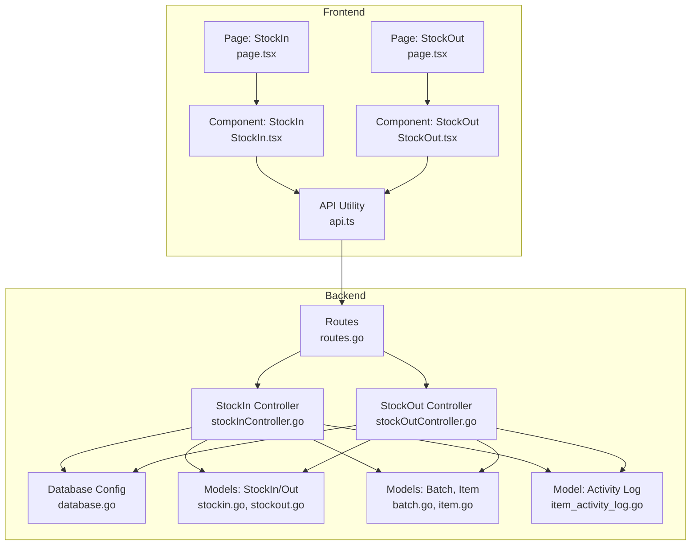
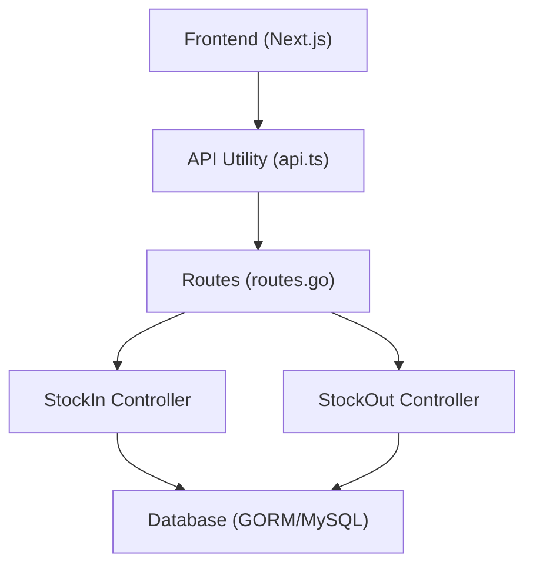
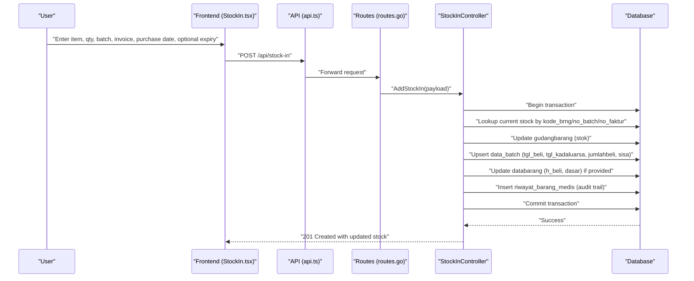
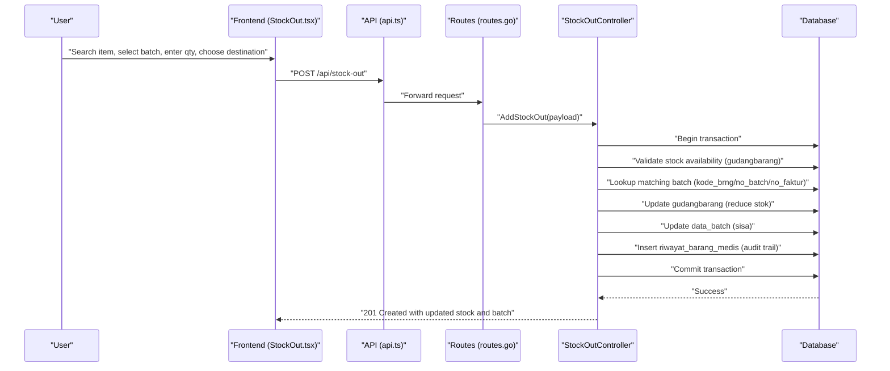
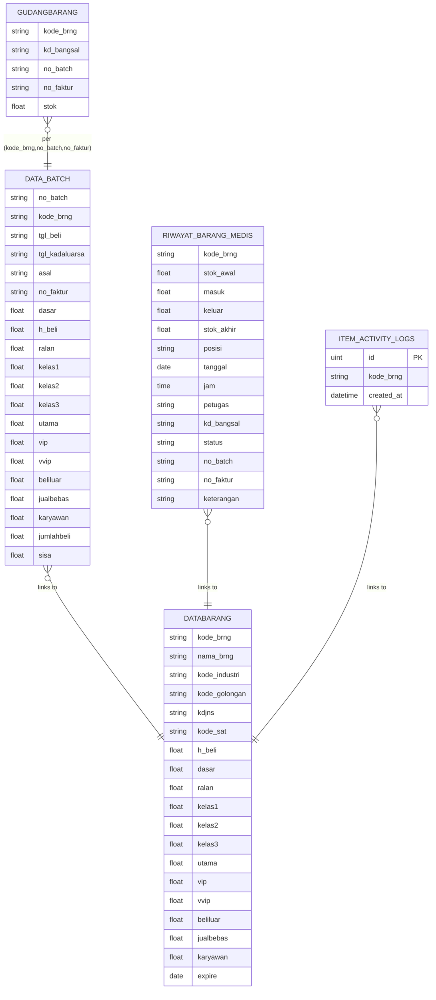
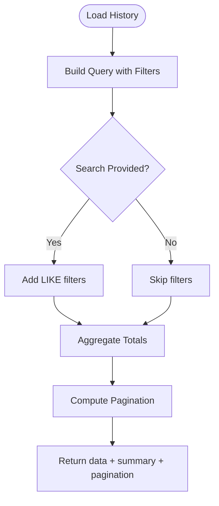
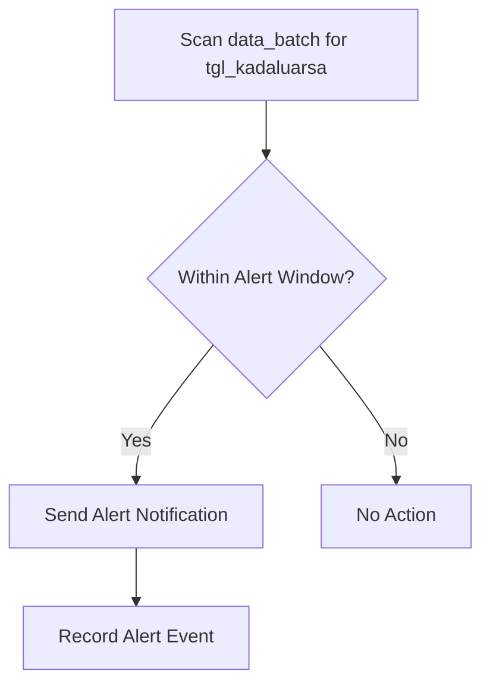
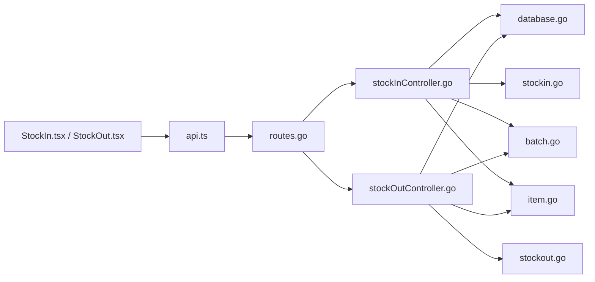

# Stock Operations

<cite>
**Referenced Files in This Document**
- [main.go](file://backend/main.go)
- [routes.go](file://backend/routes/routes.go)
- [database.go](file://backend/config/database.go)
- [stockInController.go](file://backend/controllers/stockInController.go)
- [stockOutController.go](file://backend/controllers/stockOutController.go)
- [stockin.go](file://backend/models/stockin.go)
- [stockout.go](file://backend/models/stockout.go)
- [batch.go](file://backend/models/batch.go)
- [item.go](file://backend/models/item.go)
- [item_activity_log.go](file://backend/models/item_activity_log.go)
- [page.tsx (StockIn)](file://frontend/src/app/stock-in/page.tsx)
- [StockIn.tsx](file://frontend/src/components/pages/StockIn.tsx)
- [page.tsx (StockOut)](file://frontend/src/app/stock-out/page.tsx)
- [StockOut.tsx](file://frontend/src/components/pages/StockOut.tsx)
- [api.ts](file://frontend/src/lib/api.ts)
</cite>

## Table of Contents
1. [Introduction](#introduction)
2. [Project Structure](#project-structure)
3. [Core Components](#core-components)
4. [Architecture Overview](#architecture-overview)
5. [Detailed Component Analysis](#detailed-component-analysis)
6. [Dependency Analysis](#dependency-analysis)
7. [Performance Considerations](#performance-considerations)
8. [Troubleshooting Guide](#troubleshooting-guide)
9. [Conclusion](#conclusion)
10. [Appendices](#appendices)

## Introduction
This document describes the Stock Operations feature for managing medical supply inventory in healthcare environments. It covers:
- Stock in/out transaction processing
- Batch management and expiry date tracking
- Price calculations and revenue valuation
- Supplier integration via item and supplier master data
- Inventory updates and real-time stock visibility
- Transaction history, audit trails, and reporting
- Expiration monitoring and alerts
- Frontend interfaces and API endpoints for daily operations

## Project Structure
The system consists of:
- Backend (Go/Gin):
  - Routes define endpoints for stock operations, item queries, supplier management, and monitoring
  - Controllers implement business logic for stock in/out, including batch selection, pricing, and audit logging
  - Models represent data structures for stock transactions, batches, items, and activity logs
  - Database configuration sets up connections and indexes for performance
- Frontend (Next.js):
  - Pages render StockIn and StockOut views
  - Components handle search, selection, batch picking, quantity validation, and submission to backend APIs
  - API utility resolves base URLs for cross-environment deployment

**Diagram sources**
- [routes.go:1-36](file://backend/routes/routes.go#L1-L36)
- [stockInController.go:1-383](file://backend/controllers/stockInController.go#L1-L383)
- [stockOutController.go:1-377](file://backend/controllers/stockOutController.go#L1-L377)
- [database.go:1-117](file://backend/config/database.go#L1-L117)
- [stockin.go:1-57](file://backend/models/stockin.go#L1-L57)
- [stockout.go:1-60](file://backend/models/stockout.go#L1-L60)
- [batch.go:1-29](file://backend/models/batch.go#L1-L29)
- [item.go:1-33](file://backend/models/item.go#L1-L33)
- [item_activity_log.go:1-14](file://backend/models/item_activity_log.go#L1-L14)
- [page.tsx (StockIn):1-12](file://frontend/src/app/stock-in/page.tsx#L1-L12)
- [page.tsx (StockOut):1-12](file://frontend/src/app/stock-out/page.tsx#L1-L12)
- [StockIn.tsx:1-425](file://frontend/src/components/pages/StockIn.tsx#L1-L425)
- [StockOut.tsx:1-529](file://frontend/src/components/pages/StockOut.tsx#L1-L529)
- [api.ts:1-19](file://frontend/src/lib/api.ts#L1-L19)

**Section sources**
- [main.go:1-33](file://backend/main.go#L1-L33)
- [routes.go:1-36](file://backend/routes/routes.go#L1-L36)
- [database.go:1-117](file://backend/config/database.go#L1-L117)
- [page.tsx (StockIn):1-12](file://frontend/src/app/stock-in/page.tsx#L1-L12)
- [page.tsx (StockOut):1-12](file://frontend/src/app/stock-out/page.tsx#L1-L12)

## Core Components
- Backend routing:
  - Stock in: GET/POST endpoints for searching items, retrieving recent entries, viewing history, and submitting stock-in transactions
  - Stock out: GET endpoints for item search, batch options, recent entries, and history; POST endpoint for stock-out submissions
- Controllers:
  - StockInController: validates payload, performs transaction-safe inventory and batch updates, records audit trail, and computes totals
  - StockOutController: validates availability, selects appropriate batch, updates inventory and batch balances, records audit trail, and computes revenue
- Models:
  - StockIn/Out data transfer objects and summaries
  - Batch model capturing purchase date, expiry, pricing tiers, and quantities
  - Item model linking purchases to suppliers and categories
  - Activity log model for item activity tracking
- Database configuration:
  - Indexes optimized for dashboard queries, stock summaries, and expiry monitoring
- Frontend:
  - StockIn page and component: search, selection, batch entry, and submission
  - StockOut page and component: item search, batch selection, destination choice, and submission
  - API utility resolves backend base URL dynamically

**Section sources**
- [routes.go:9-35](file://backend/routes/routes.go#L9-L35)
- [stockInController.go:13-383](file://backend/controllers/stockInController.go#L13-L383)
- [stockOutController.go:13-377](file://backend/controllers/stockOutController.go#L13-L377)
- [stockin.go:1-57](file://backend/models/stockin.go#L1-L57)
- [stockout.go:1-60](file://backend/models/stockout.go#L1-L60)
- [batch.go:1-29](file://backend/models/batch.go#L1-L29)
- [item.go:1-33](file://backend/models/item.go#L1-L33)
- [item_activity_log.go:1-14](file://backend/models/item_activity_log.go#L1-L14)
- [database.go:50-84](file://backend/config/database.go#L50-L84)
- [StockIn.tsx:1-425](file://frontend/src/components/pages/StockIn.tsx#L1-L425)
- [StockOut.tsx:1-529](file://frontend/src/components/pages/StockOut.tsx#L1-L529)
- [api.ts:1-19](file://frontend/src/lib/api.ts#L1-L19)

## Architecture Overview
The system follows a layered architecture:
- Presentation layer (Next.js): renders forms, handles user interactions, and calls backend APIs
- Application layer (Gin): routes requests to controllers
- Domain layer (Controllers): enforces business rules (batch selection, stock validation, pricing)
- Persistence layer (GORM/MySQL): manages inventory, batches, audit trail, and master data

**Diagram sources**
- [routes.go:1-36](file://backend/routes/routes.go#L1-L36)
- [stockInController.go:1-383](file://backend/controllers/stockInController.go#L1-L383)
- [stockOutController.go:1-377](file://backend/controllers/stockOutController.go#L1-L377)
- [database.go:1-117](file://backend/config/database.go#L1-L117)
- [api.ts:1-19](file://frontend/src/lib/api.ts#L1-L19)

## Detailed Component Analysis

### Stock In Workflow
The stock in process receives medical supplies, updates inventory per batch/faktur, tracks purchase price and expiry, and records an audit trail.

**Diagram sources**
- [StockIn.tsx:147-185](file://frontend/src/components/pages/StockIn.tsx#L147-L185)
- [api.ts:15-18](file://frontend/src/lib/api.ts#L15-L18)
- [routes.go:29](file://backend/routes/routes.go#L29)
- [stockInController.go:235-382](file://backend/controllers/stockInController.go#L235-L382)
- [database.go:1-117](file://backend/config/database.go#L1-L117)

Key behaviors:
- Validation: requires kode_brng, qty, no_batch, no_faktur, tanggal_pembelian
- Inventory update: cumulative stock per batch/faktur
- Batch management: creates or updates data_batch with purchase/expiry/pricing
- Pricing: optionally updates buying price and base price
- Audit: inserts riwayat_barang_medis with timestamp, operator, and notes

**Section sources**
- [stockInController.go:235-382](file://backend/controllers/stockInController.go#L235-L382)
- [stockin.go:47-57](file://backend/models/stockin.go#L47-L57)
- [batch.go:3-24](file://backend/models/batch.go#L3-L24)
- [item.go:3-28](file://backend/models/item.go#L3-L28)

### Stock Out Workflow
The stock out process issues supplies to departments or patients, selects the appropriate batch considering FIFO-like ordering, validates stock availability, and records revenue.

**Diagram sources**
- [StockOut.tsx:225-266](file://frontend/src/components/pages/StockOut.tsx#L225-L266)
- [api.ts:15-18](file://frontend/src/lib/api.ts#L15-L18)
- [routes.go:34](file://backend/routes/routes.go#L34)
- [stockOutController.go:189-281](file://backend/controllers/stockOutController.go#L189-L281)
- [database.go:1-117](file://backend/config/database.go#L1-L117)

Key behaviors:
- Validation: requires kode_brng, qty, no_batch, no_faktur, destination
- Stock validation: ensures sufficient stock exists
- Batch selection: prioritizes nearest expiry and logical purchase order
- Revenue calculation: derives unit price based on destination tier
- Audit: inserts riwayat_barang_medis with timestamp, destination, and notes

**Section sources**
- [stockOutController.go:189-281](file://backend/controllers/stockOutController.go#L189-L281)
- [stockout.go:34-41](file://backend/models/stockout.go#L34-L41)
- [stockout.go:48-60](file://backend/models/stockout.go#L48-L60)

### Data Models and Relationships

**Diagram sources**
- [batch.go:3-24](file://backend/models/batch.go#L3-L24)
- [item.go:3-28](file://backend/models/item.go#L3-L28)
- [stockin.go:1-13](file://backend/models/stockin.go#L1-L13)
- [stockout.go:1-17](file://backend/models/stockout.go#L1-L17)
- [item_activity_log.go:5-13](file://backend/models/item_activity_log.go#L5-L13)

### Transaction History and Reporting
- Stock in history:
  - Supports search across kode_brng, name, barcode, operator, supplier, and notes
  - Supports filtering by date
  - Paginated with configurable page/limit
  - Summary aggregates total quantity and total cost
- Stock out history:
  - Supports search across kode_brng, name, barcode, operator, destination, and notes
  - Supports filtering by date
  - Paginated with configurable page/limit
  - Summary aggregates total quantity and total revenue
- Recent entries:
  - Stock in recent: last 10 entries
  - Stock out recent: last 10 entries

**Diagram sources**
- [stockInController.go:80-175](file://backend/controllers/stockInController.go#L80-L175)
- [stockInController.go:177-233](file://backend/controllers/stockInController.go#L177-L233)
- [stockOutController.go:116-187](file://backend/controllers/stockOutController.go#L116-L187)
- [stockOutController.go:315-376](file://backend/controllers/stockOutController.go#L315-L376)

**Section sources**
- [stockInController.go:80-175](file://backend/controllers/stockInController.go#L80-L175)
- [stockOutController.go:116-187](file://backend/controllers/stockOutController.go#L116-L187)

### Expiration Monitoring and Alerts
- Expiry tracking:
  - Items maintain expire dates in databarang
  - Batch records include tgl_kadaluarsa for precise tracking
  - StockOut batch listing orders by nearest expiry
- Monitoring:
  - Index on databarang(expire) supports expiry scans
  - Dashboard and monitoring endpoints leverage indexed fields for quick retrieval
- Alerts:
  - Not implemented in code; recommended extension: scheduled job to scan near-expiry batches and notify operators

**Diagram sources**
- [database.go:62-72](file://backend/config/database.go#L62-L72)
- [stockOutController.go:65-103](file://backend/controllers/stockOutController.go#L65-L103)
- [batch.go:6](file://backend/models/batch.go#L6)

**Section sources**
- [database.go:62-72](file://backend/config/database.go#L62-L72)
- [stockOutController.go:65-103](file://backend/controllers/stockOutController.go#L65-L103)

### Supplier Integration
- Supplier association:
  - Items link to suppliers via kode_industri
  - Stock in/out history surfaces supplier names for traceability
- Master data endpoints:
  - CRUD endpoints for supplier and item master data support integration workflows

**Section sources**
- [routes.go:10-22](file://backend/routes/routes.go#L10-L22)
- [stockInController.go:28-48](file://backend/controllers/stockInController.go#L28-L48)
- [stockOutController.go:18-40](file://backend/controllers/stockOutController.go#L18-L40)

## Dependency Analysis
- Routes depend on controllers for stock operations
- Controllers depend on GORM for database operations and on models for typed payloads
- Database configuration centralizes connection and index creation
- Frontend components depend on API utility for dynamic base URL resolution

**Diagram sources**
- [routes.go:1-36](file://backend/routes/routes.go#L1-L36)
- [stockInController.go:1-383](file://backend/controllers/stockInController.go#L1-L383)
- [stockOutController.go:1-377](file://backend/controllers/stockOutController.go#L1-L377)
- [database.go:1-117](file://backend/config/database.go#L1-L117)
- [stockin.go:1-57](file://backend/models/stockin.go#L1-L57)
- [stockout.go:1-60](file://backend/models/stockout.go#L1-L60)
- [batch.go:1-29](file://backend/models/batch.go#L1-L29)
- [item.go:1-33](file://backend/models/item.go#L1-L33)
- [StockIn.tsx:1-425](file://frontend/src/components/pages/StockIn.tsx#L1-L425)
- [StockOut.tsx:1-529](file://frontend/src/components/pages/StockOut.tsx#L1-L529)
- [api.ts:1-19](file://frontend/src/lib/api.ts#L1-L19)

**Section sources**
- [routes.go:1-36](file://backend/routes/routes.go#L1-L36)
- [database.go:1-117](file://backend/config/database.go#L1-L117)

## Performance Considerations
- Indexed fields:
  - riwayat_barang_medis(kd_bangsal, tanggal, jam) for dashboard queries
  - gudangbarang(kd_bangsal, kode_brng) for inventory lookups
  - databarang(expire) for expiry scans
  - riwayat_barang_medis(kd_bangsal, kode_brng, masuk/keluar) for summary queries
- Aggregation strategies:
  - Pre-aggregate per kode_brng or (kode_brng, no_faktur) to reduce join overhead in histories
- Pagination:
  - Limit and offset with total pages computed server-side to avoid large result sets

**Section sources**
- [database.go:50-84](file://backend/config/database.go#L50-L84)
- [stockInController.go:177-233](file://backend/controllers/stockInController.go#L177-L233)
- [stockOutController.go:315-376](file://backend/controllers/stockOutController.go#L315-L376)

## Troubleshooting Guide
Common issues and resolutions:
- Transaction failures during stock in/out:
  - Verify database connectivity and indexes
  - Ensure batch/faktur uniqueness and correct kode_brng
  - Confirm sufficient stock for outflows
- Invalid payloads:
  - Required fields: kode_brng, qty (>0), no_batch, no_faktur, tanggal_pembelian for stock in; destination for stock out
- Frontend connectivity:
  - Confirm NEXT_PUBLIC_API_URL or host/port alignment with backend
  - Check CORS configuration in Gin

**Section sources**
- [stockInController.go:242-245](file://backend/controllers/stockInController.go#L242-L245)
- [stockOutController.go:196-199](file://backend/controllers/stockOutController.go#L196-L199)
- [api.ts:3-13](file://frontend/src/lib/api.ts#L3-L13)
- [main.go:15-16](file://backend/main.go#L15-L16)

## Conclusion
The Stock Operations feature provides a robust foundation for managing medical supply inventory with:
- Accurate batch and expiry tracking
- Real-time stock visibility and validation
- Comprehensive audit trails and reporting
- Practical frontend interfaces for daily operations
Future enhancements could include automated expiry alerts, supplier performance dashboards, and exportable reports.

## Appendices

### API Endpoints Summary
- Stock In
  - GET /api/stock-in/items?search=...
  - GET /api/stock-in/recent
  - GET /api/stock-in/history?page=&limit=&search=&date=
  - POST /api/stock-in
- Stock Out
  - GET /api/stock-out/items?search=...
  - GET /api/stock-out/batches?kode_brng=
  - GET /api/stock-out/recent
  - GET /api/stock-out/history?page=&limit=&search=&date=
  - POST /api/stock-out

**Section sources**
- [routes.go:26-34](file://backend/routes/routes.go#L26-L34)

### Example Payloads and Responses
- Stock In Payload
  - Fields: kode_brng, qty, price, tanggal_pembelian, expired, no_batch, no_faktur, note
  - Response: 201 with updated stock and audit trail
- Stock Out Payload
  - Fields: kode_brng, qty, no_batch, no_faktur, destination, note
  - Response: 201 with updated stock and audit trail

**Section sources**
- [stockin.go:47-57](file://backend/models/stockin.go#L47-L57)
- [stockout.go:34-41](file://backend/models/stockout.go#L34-L41)
- [stockInController.go:235-382](file://backend/controllers/stockInController.go#L235-L382)
- [stockOutController.go:189-281](file://backend/controllers/stockOutController.go#L189-L281)