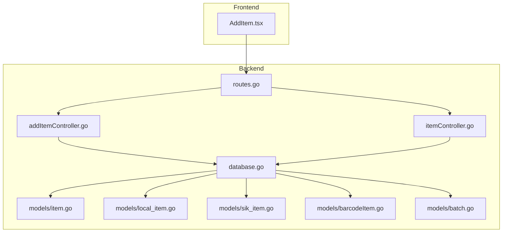
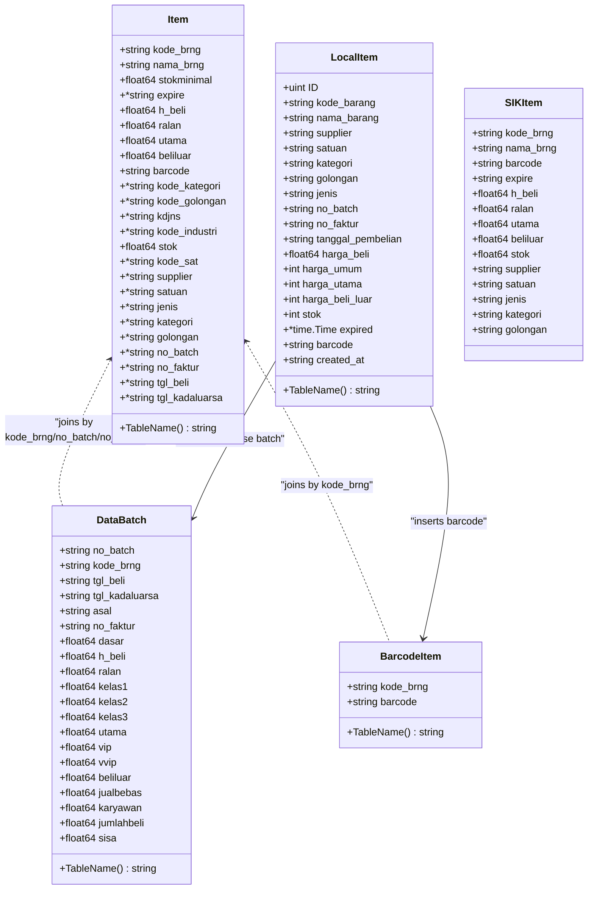
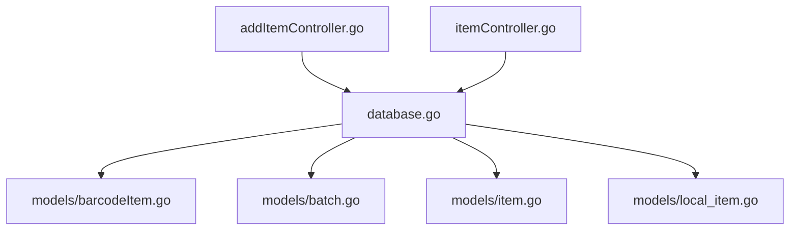

# Core Inventory Models

<cite>
**Referenced Files in This Document**
- [item.go](file://backend/models/item.go)
- [local_item.go](file://backend/models/local_item.go)
- [sik_item.go](file://backend/models/sik_item.go)
- [barcodeItem.go](file://backend/models/barcodeItem.go)
- [batch.go](file://backend/models/batch.go)
- [itemController.go](file://backend/controllers/itemController.go)
- [addItemController.go](file://backend/controllers/addItemController.go)
- [database.go](file://backend/config/database.go)
- [routes.go](file://backend/routes/routes.go)
- [AddItem.tsx](file://frontend/src/components/pages/AddItem.tsx)
</cite>

## Table of Contents
1. [Introduction](#introduction)
2. [Project Structure](#project-structure)
3. [Core Components](#core-components)
4. [Architecture Overview](#architecture-overview)
5. [Detailed Component Analysis](#detailed-component-analysis)
6. [Dependency Analysis](#dependency-analysis)
7. [Performance Considerations](#performance-considerations)
8. [Troubleshooting Guide](#troubleshooting-guide)
9. [Conclusion](#conclusion)

## Introduction
This document provides comprehensive documentation for the core inventory models in the PPA system. It focuses on:
- The Item model representing unified product data from multiple sources
- LocalItem and SIKItem models for distinct inventory sources
- BarcodeItem for barcode integration
- Batch model for expiration and purchase tracking
It explains GORM struct tags, field mappings, validations, and business rules enforced at the model level. It also demonstrates practical usage in controllers and common query patterns.

## Project Structure
The inventory domain spans backend models, controllers, database configuration, and frontend integration:
- Models define data structures and GORM mappings
- Controllers orchestrate queries and transactions
- Database configuration sets up connections and indices
- Routes expose endpoints for inventory operations
- Frontend components submit data that maps to LocalItem

**Diagram sources**
- [routes.go:9-35](file://backend/routes/routes.go#L9-L35)
- [database.go:13-83](file://backend/config/database.go#L13-L83)
- [itemController.go:22-283](file://backend/controllers/itemController.go#L22-L283)
- [addItemController.go:27-217](file://backend/controllers/addItemController.go#L27-L217)
- [item.go:3-32](file://backend/models/item.go#L3-L32)
- [local_item.go:5-33](file://backend/models/local_item.go#L5-L33)
- [sik_item.go:3-31](file://backend/models/sik_item.go#L3-L31)
- [barcodeItem.go:3-12](file://backend/models/barcodeItem.go#L3-L12)
- [batch.go:3-28](file://backend/models/batch.go#L3-L28)

**Section sources**
- [routes.go:9-35](file://backend/routes/routes.go#L9-L35)
- [database.go:13-83](file://backend/config/database.go#L13-L83)

## Core Components
This section documents the core inventory models with their fields, GORM tags, and relationships.

### Item Model (Unified Product View)
The Item model aggregates product attributes from the SIK database and joins with related master tables and batch data. It is mapped to the databarang table and includes computed fields via joins.

Key fields and mappings:
- kode_brng: string, JSON: kode_brng, GORM column: kode_brng
- nama_brng: string, JSON: nama_brng, GORM column: nama_brng
- stokminimal: float64, JSON: stokminimal, GORM column: stokminimal
- expire: pointer to string, JSON: expire, GORM column: expire
- h_beli: float64, JSON: h_beli, GORM column: h_beli
- ralan: float64, JSON: ralan, GORM column: ralan
- utama: float64, JSON: utama, GORM column: utama
- beliluar: float64, JSON: beliluar, GORM column: beliluar
- barcode: string, JSON: barcode, GORM column: barcode
- kode_kategori: pointer to string, JSON: kode_kategori, GORM column: kode_kategori
- kode_golongan: pointer to string, JSON: kode_golongan, GORM column: kode_golongan
- kdjns: pointer to string, JSON: kdjns, GORM column: kdjns
- kode_industri: pointer to string, JSON: kode_industri, GORM column: kode_industri
- stok: float64, JSON: stok, GORM column: stok
- kode_sat: pointer to string, JSON: kode_sat, GORM column: kode_sat
- supplier: pointer to string, JSON: supplier
- satuan: pointer to string, JSON: satuan
- jenis: pointer to string, JSON: jenis
- kategori: pointer to string, JSON: kategori
- golongan: pointer to string, JSON: golongan
- no_batch: pointer to string, JSON: no_batch, GORM column: no_batch
- no_faktur: pointer to string, JSON: no_faktur, GORM column: no_faktur
- tgl_beli: pointer to string, JSON: tgl_beli, GORM column: tgl_beli
- tgl_kadaluarsa: pointer to string, JSON: tgl_kadaluarsa, GORM column: tgl_kadaluarsa

Constraints and business rules:
- Table mapping: databarang
- Computed fields via joins (stok, supplier, satuan, jenis, kategori, golongan, barcode, latest batch info)
- Expiration date may come from either the product record or batch dates

Usage in controllers:
- Single item retrieval with joins to gudangbarang, industrifarmasi, kodesatuan, jenis, golongan_barang, and barcode_obat
- Listing items with inventory aggregation per batch and price/date joins

**Section sources**
- [item.go:3-32](file://backend/models/item.go#L3-L32)
- [itemController.go:22-96](file://backend/controllers/itemController.go#L22-L96)
- [itemController.go:98-215](file://backend/controllers/itemController.go#L98-L215)

### LocalItem Model (Local Inventory Source)
The LocalItem model represents locally managed inventory with explicit primary key and comprehensive fields for creation and updates.

Key fields and mappings:
- ID: uint, JSON: id, GORM primary key
- kode_barang: string, JSON: kode_barang
- nama_barang: string, JSON: nama_barang
- supplier: string, JSON: supplier
- satuan: string, JSON: satuan
- kategori: string, JSON: kategori
- golongan: string, JSON: golongan
- jenis: string, JSON: jenis
- no_batch: string, JSON: no_batch
- no_faktur: string, JSON: no_faktur
- tanggal_pembelian: string, JSON: tanggal_pembelian
- harga_beli: float64, JSON: harga_beli
- harga_umum: int, JSON: harga_umum
- harga_utama: int, JSON: harga_utama
- harga_beli_luar: int, JSON: harga_beli_luar
- stok: int, JSON: stok
- expired: pointer to time.Time, JSON: expired
- barcode: string, JSON: barcode
- created_at: string, JSON: created_at

Constraints and business rules:
- Table mapping: items
- Primary key: ID
- Validation performed in controller for required fields (including batch, invoice, purchase date, and stock quantity)

Usage in controllers:
- Creation flow inserts into databarang, barcode_obat, gudangbarang, data_batch, and riwayat_barang_medis
- Updates map LocalItem fields to databarang columns

**Section sources**
- [local_item.go:5-33](file://backend/models/local_item.go#L5-L33)
- [addItemController.go:27-217](file://backend/controllers/addItemController.go#L27-L217)
- [itemController.go:217-267](file://backend/controllers/itemController.go#L217-L267)

### SIKItem Model (SIK Source Representation)
The SIKItem model mirrors product data from the SIK database for direct consumption.

Key fields and mappings:
- kode_brng: string, JSON: kode_brng
- nama_brng: string, JSON: nama_brng
- barcode: string, JSON: barcode
- expire: string, JSON: expire
- h_beli: float64, JSON: h_beli
- ralan: float64, JSON: ralan
- utama: float64, JSON: utama
- beliluar: float64, JSON: beliluar
- stok: float64, JSON: stok
- supplier: string, JSON: supplier
- satuan: string, JSON: satuan
- jenis: string, JSON: jenis
- kategori: string, JSON: kategori
- golongan: string, JSON: golongan

Constraints and business rules:
- No explicit GORM tags for column mapping; relies on JSON field names
- Used primarily for data transfer and display

**Section sources**
- [sik_item.go:3-31](file://backend/models/sik_item.go#L3-L31)

### BarcodeItem Model (Barcode Integration)
The BarcodeItem model manages barcode-to-product associations with uniqueness constraints.

Key fields and mappings:
- kode_brng: string, GORM primary key, size: 15
- barcode: string, GORM unique

Constraints and business rules:
- Primary key: kode_brng
- Unique constraint on barcode enforced by GORM tag
- Table mapping: barcode_obat

Usage in controllers:
- Creation and update of barcode entries linked to product code
- Deletion cascades when deleting products

**Section sources**
- [barcodeItem.go:3-12](file://backend/models/barcodeItem.go#L3-L12)
- [itemController.go:255-264](file://backend/controllers/itemController.go#L255-L264)
- [addItemController.go:124-130](file://backend/controllers/addItemController.go#L124-L130)

### Batch Model (Expiration and Purchase Tracking)
The DataBatch model tracks purchase batches with pricing tiers and remaining quantities.

Key fields and mappings:
- no_batch: string, JSON: no_batch, GORM column: no_batch
- kode_brng: string, JSON: kode_brng, GORM column: kode_brng
- tgl_beli: string, JSON: tgl_beli, GORM column: tgl_beli
- tgl_kadaluarsa: string, JSON: tgl_kadaluarsa, GORM column: tgl_kadaluarsa
- asal: string, JSON: asal, GORM column: asal
- no_faktur: string, JSON: no_faktur, GORM column: no_faktur
- dasar: float64, JSON: dasar, GORM column: dasar
- h_beli: float64, JSON: h_beli, GORM column: h_beli
- ralan: float64, JSON: ralan, GORM column: ralan
- kelas1: float64, JSON: kelas1, GORM column: kelas1
- kelas2: float64, JSON: kelas2, GORM column: kelas2
- kelas3: float64, JSON: kelas3, GORM column: kelas3
- utama: float64, JSON: utama, GORM column: utama
- vip: float64, JSON: vip, GORM column: vip
- vvip: float64, JSON: vvip, GORM column: vvip
- beliluar: float64, JSON: beliluar, GORM column: beliluar
- jualbebas: float64, JSON: jualbebas, GORM column: jualbebas
- karyawan: float64, JSON: karyawan, GORM column: karyawan
- jumlahbeli: float64, JSON: jumlahbeli, GORM column: jumlahbeli
- sisa: float64, JSON: sisa, GORM column: sisa

Constraints and business rules:
- Table mapping: data_batch
- Tracks purchase date, expiry date, invoice number, and per-tier pricing
- Used to compute latest batch and expiry dates in queries

**Section sources**
- [batch.go:3-28](file://backend/models/batch.go#L3-L28)
- [itemController.go:164-172](file://backend/controllers/itemController.go#L164-L172)
- [addItemController.go:159-184](file://backend/controllers/addItemController.go#L159-L184)

## Architecture Overview
The inventory architecture integrates frontend forms, backend controllers, and database models. Controllers query and mutate data across multiple tables, while models define the structure and constraints.

**Diagram sources**
- [item.go:3-32](file://backend/models/item.go#L3-L32)
- [local_item.go:5-33](file://backend/models/local_item.go#L5-L33)
- [sik_item.go:3-31](file://backend/models/sik_item.go#L3-L31)
- [barcodeItem.go:3-12](file://backend/models/barcodeItem.go#L3-L12)
- [batch.go:3-28](file://backend/models/batch.go#L3-L28)

## Detailed Component Analysis

### Item Model Analysis
The Item model serves as a unified representation of product data, combining master data, pricing, stock, and batch information. It is populated via complex SQL joins in controllers.

Processing logic highlights:
- Single item retrieval: Joins gudangbarang (warehouse stock), industrifarmasi (supplier), kodesatuan (unit), jenis (category), golongan_barang (group), barcode_obat (barcode), and a derived latest batch subquery
- Listing items: Aggregates stock per batch, computes expiry from batch or product record, and enriches with master data and pricing

Common query patterns:
- Select specific columns from databarang and join multiple reference tables
- Group and aggregate warehouse stock per product and batch
- Compute latest batch and expiry date using subqueries

**Section sources**
- [itemController.go:22-96](file://backend/controllers/itemController.go#L22-L96)
- [itemController.go:98-215](file://backend/controllers/itemController.go#L98-L215)

### LocalItem Model Analysis
The LocalItem model encapsulates the creation and update lifecycle for new inventory items. It enforces business rules at the controller level and persists data across multiple tables.

Processing logic highlights:
- Creation: Validates required fields, generates product code, checks supplier existence, ensures barcode uniqueness, and performs a transactional insert into databarang, barcode_obat, gudangbarang, data_batch, and riwayat_barang_medis
- Update: Maps LocalItem fields to databarang columns and synchronizes barcode records

Validation rules:
- Required fields: nama_barang, supplier, satuan, golongan, jenis, no_batch, no_faktur, tanggal_pembelian, stok
- Supplier lookup against industrifarmasi
- Barcode uniqueness check against barcode_obat

**Section sources**
- [local_item.go:5-33](file://backend/models/local_item.go#L5-L33)
- [addItemController.go:27-217](file://backend/controllers/addItemController.go#L27-L217)
- [itemController.go:217-267](file://backend/controllers/itemController.go#L217-L267)

### SIKItem Model Analysis
The SIKItem model mirrors product data from SIK for direct consumption. It does not enforce GORM tags for column mapping, relying on JSON field names.

Relationships:
- Used alongside Item for display and API responses
- Provides a simplified view of product attributes for external systems

**Section sources**
- [sik_item.go:3-31](file://backend/models/sik_item.go#L3-L31)

### BarcodeItem Model Analysis
The BarcodeItem model ensures barcode uniqueness and links barcodes to product codes.

Processing logic highlights:
- Primary key: kode_brng
- Unique constraint on barcode prevents duplicates
- Creation and update handled in controllers during item creation/update

**Section sources**
- [barcodeItem.go:3-12](file://backend/models/barcodeItem.go#L3-L12)
- [itemController.go:255-264](file://backend/controllers/itemController.go#L255-L264)
- [addItemController.go:124-130](file://backend/controllers/addItemController.go#L124-L130)

### Batch Model Analysis
The DataBatch model captures purchase batch details and pricing tiers.

Processing logic highlights:
- Inserted during item creation with purchase snapshot from databarang
- Used to compute latest batch and expiry dates in item listings

**Section sources**
- [batch.go:3-28](file://backend/models/batch.go#L3-L28)
- [addItemController.go:159-184](file://backend/controllers/addItemController.go#L159-L184)

### Controller Usage Examples
- Retrieving a single item by kode_brng with joins to suppliers, units, categories, groups, and barcode
- Listing items with aggregated stock per batch, computed expiry, and pricing snapshots
- Creating new items with transactional persistence across multiple tables
- Updating existing items and synchronizing barcode records

**Section sources**
- [itemController.go:22-96](file://backend/controllers/itemController.go#L22-L96)
- [itemController.go:98-215](file://backend/controllers/itemController.go#L98-L215)
- [addItemController.go:27-217](file://backend/controllers/addItemController.go#L27-L217)

## Dependency Analysis
The models and controllers depend on the shared database connection and rely on specific table relationships.

**Diagram sources**
- [database.go:13-83](file://backend/config/database.go#L13-L83)
- [addItemController.go:27-217](file://backend/controllers/addItemController.go#L27-L217)
- [itemController.go:22-283](file://backend/controllers/itemController.go#L22-L283)
- [item.go:3-32](file://backend/models/item.go#L3-L32)
- [local_item.go:5-33](file://backend/models/local_item.go#L5-L33)
- [barcodeItem.go:3-12](file://backend/models/barcodeItem.go#L3-L12)
- [batch.go:3-28](file://backend/models/batch.go#L3-L28)

**Section sources**
- [database.go:13-83](file://backend/config/database.go#L13-L83)
- [routes.go:9-35](file://backend/routes/routes.go#L9-L35)

## Performance Considerations
- Indexes: Database configuration creates indexes on frequently queried columns (e.g., expire, kode_golongan, warehouse stock, dashboard views) to improve query performance
- Aggregation: Controllers use grouped queries to aggregate stock per batch and compute latest batch/expiry efficiently
- Transactions: Multi-table writes during item creation use transactions to maintain consistency and reduce partial writes

[No sources needed since this section provides general guidance]

## Troubleshooting Guide
Common issues and resolutions:
- Supplier not found: Ensure supplier code exists in industrifarmasi before creating items
- Duplicate barcode: Barcode must be unique; check barcode_obat for existing entries
- Transaction failures: Creation flow rolls back on errors; inspect returned error messages for specific failure points
- Missing joins: Item retrieval depends on proper joins; verify table relationships and column mappings

**Section sources**
- [addItemController.go:57-79](file://backend/controllers/addItemController.go#L57-L79)
- [itemController.go:255-264](file://backend/controllers/itemController.go#L255-L264)

## Conclusion
The core inventory models in the PPA system provide a structured foundation for managing products, barcodes, and batch information. The Item model unifies data from multiple sources, LocalItem governs local inventory creation and updates, BarcodeItem ensures barcode integrity, and DataBatch tracks purchase and expiry details. Controllers orchestrate complex queries and transactions, while database configuration maintains performance through strategic indexing. Together, these components support robust inventory operations with clear constraints and business rules.