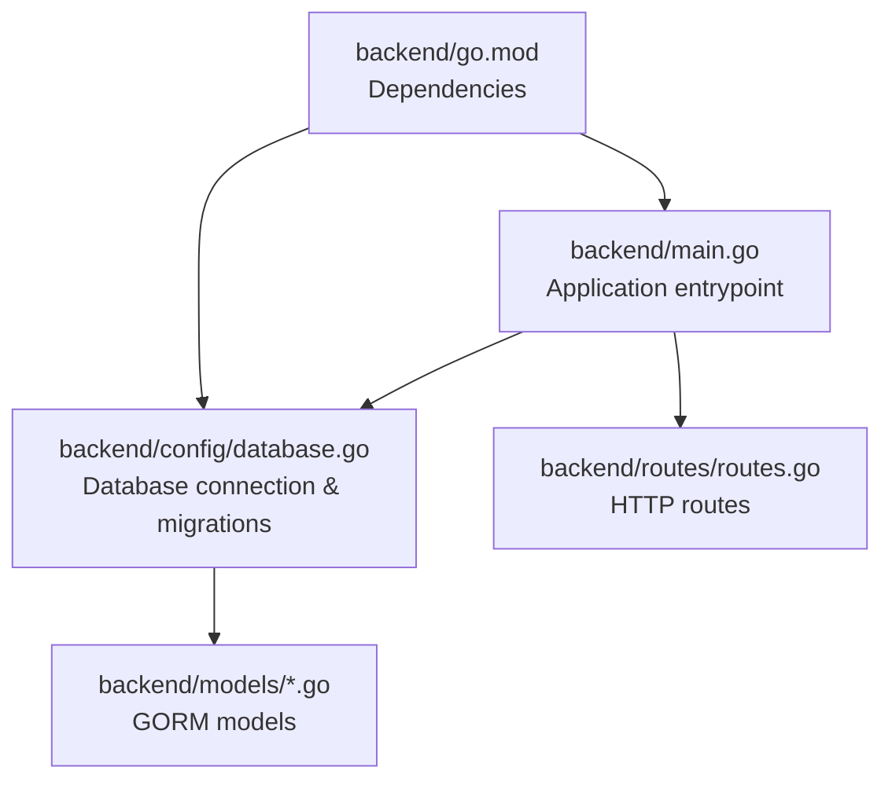
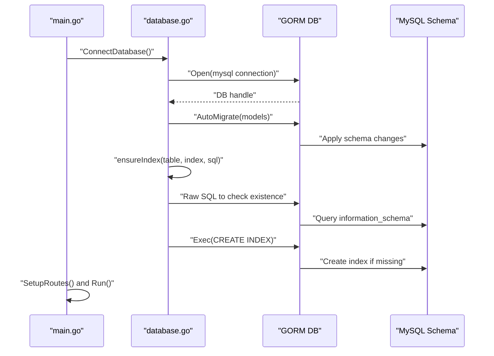
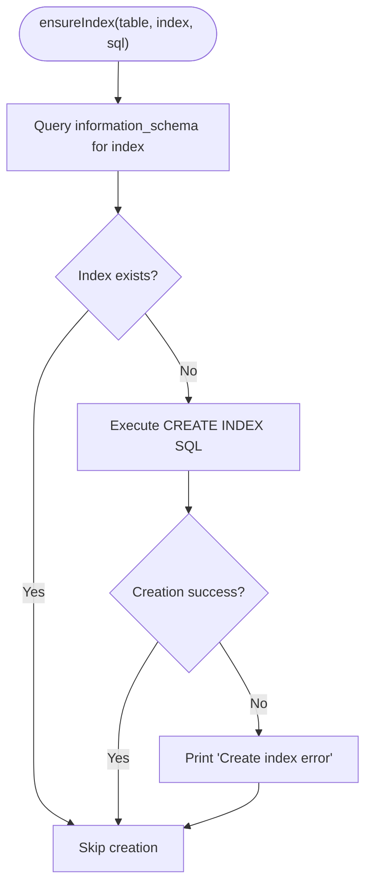
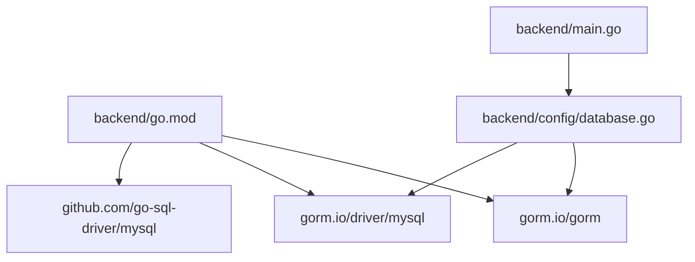

# Database Configuration & Migrations

<cite>
**Referenced Files in This Document**
- [database.go](file://backend/config/database.go)
- [main.go](file://backend/main.go)
- [go.mod](file://backend/go.mod)
- [routes.go](file://backend/routes/routes.go)
- [item.go](file://backend/models/item.go)
- [barcodeItem.go](file://backend/models/barcodeItem.go)
- [item_activity_log.go](file://backend/models/item_activity_log.go)
</cite>

## Table of Contents
1. [Introduction](#introduction)
2. [Project Structure](#project-structure)
3. [Core Components](#core-components)
4. [Architecture Overview](#architecture-overview)
5. [Detailed Component Analysis](#detailed-component-analysis)
6. [Dependency Analysis](#dependency-analysis)
7. [Performance Considerations](#performance-considerations)
8. [Troubleshooting Guide](#troubleshooting-guide)
9. [Conclusion](#conclusion)

## Introduction
This document explains the database configuration and migration processes used in the backend service. It covers database connection setup with GORM, connection parameters, automatic schema migration, custom index creation for performance, and maintenance routines. It also provides guidance for updating database schemas and resolving common connectivity issues.

## Project Structure
The database-related code is organized under the backend module with a dedicated configuration package, model definitions, route setup, and application entrypoint.

**Diagram sources**
- [main.go:12-32](file://backend/main.go#L12-L32)
- [database.go:13-89](file://backend/config/database.go#L13-L89)
- [routes.go:9-35](file://backend/routes/routes.go#L9-L35)
- [go.mod:1-45](file://backend/go.mod#L1-L45)

**Section sources**
- [main.go:12-32](file://backend/main.go#L12-L32)
- [database.go:13-89](file://backend/config/database.go#L13-L89)
- [routes.go:9-35](file://backend/routes/routes.go#L9-L35)
- [go.mod:1-45](file://backend/go.mod#L1-L45)

## Core Components
- Database connection and initialization: Establishes a MySQL connection using GORM and performs initial migrations.
- Automatic migration: Applies schema changes for models during startup.
- Index management: Ensures required indexes exist via a maintenance routine.
- Model definitions: Define table mappings and column attributes for GORM.

Key responsibilities:
- Centralized connection setup and error handling.
- Idempotent index creation to maintain performance.
- Startup-time schema synchronization.

**Section sources**
- [database.go:13-89](file://backend/config/database.go#L13-L89)
- [main.go:26-29](file://backend/main.go#L26-L29)

## Architecture Overview
The application initializes the database connection at startup, applies migrations, and ensures indexes. Routes are registered afterward, and controllers can access the shared GORM instance.

**Diagram sources**
- [main.go:12-32](file://backend/main.go#L12-L32)
- [database.go:13-89](file://backend/config/database.go#L13-L89)

## Detailed Component Analysis

### Database Connection and Initialization
- Connection string: Uses a MySQL driver with a hardcoded connection string for a local database.
- GORM configuration: Initializes GORM with default settings.
- Error handling: Panics on connection failure; prints errors for migration failures.
- Initial migration: Automatically migrates a specific model during connection setup.

Operational notes:
- The connection string is embedded in the configuration file.
- Migration runs twice: once during connection setup and again after routes are initialized.

**Section sources**
- [database.go:13-48](file://backend/config/database.go#L13-L48)
- [main.go:12-32](file://backend/main.go#L12-L32)

### Automatic Migration and Schema Evolution
- Startup migrations: Two migration steps occur—once during connection and again after route registration.
- Model-driven schema: Migrations derive table/column definitions from GORM model structs.
- Example models involved:
  - BarcodeItem: Defines primary key and unique constraints.
  - ItemActivityLog: Includes indexed foreign key and timestamps.

Migration behavior:
- Adds tables and columns as needed.
- Skips existing structures to avoid breaking changes.
- Maintains referential integrity based on model tags.

**Section sources**
- [main.go:26-29](file://backend/main.go#L26-L29)
- [database.go:37-48](file://backend/config/database.go#L37-L48)
- [barcodeItem.go:3-8](file://backend/models/barcodeItem.go#L3-L8)
- [item_activity_log.go:5-13](file://backend/models/item_activity_log.go#L5-L13)

### Index Management and Performance Optimization
Custom indexes created for performance:
- idx_rbm_dashboard_recent on riwayat_barang_medis for recent activity dashboards.
- idx_gudangbarang_bangsal_brng for warehouse item queries.
- idx_databarang_expire for expiration-based filtering.
- Additional indexes maintained for summary and stock movement analytics.

Index maintenance routine:
- Checks information_schema for existing indexes.
- Creates missing indexes using raw SQL.
- Prints errors for both existence checks and creation attempts.

**Diagram sources**
- [database.go:91-116](file://backend/config/database.go#L91-L116)

**Section sources**
- [database.go:50-84](file://backend/config/database.go#L50-L84)
- [database.go:91-116](file://backend/config/database.go#L91-L116)

### Model Definitions and Table Mappings
- Item: Maps to databarang table; includes stock, pricing, and expiration fields.
- BarcodeItem: Maps to barcode_obat table; enforces unique barcode and primary key.
- ItemActivityLog: Maps to item_activity_logs table; includes indexed foreign key and timestamps.

These models inform GORM’s migration process and define column-level attributes used by queries.

**Section sources**
- [item.go:3-32](file://backend/models/item.go#L3-L32)
- [barcodeItem.go:3-12](file://backend/models/barcodeItem.go#L3-L12)
- [item_activity_log.go:5-13](file://backend/models/item_activity_log.go#L5-L13)

### Route Registration and Database Access
- Routes are registered after database initialization.
- Controllers can access the shared GORM instance for database operations.
- No explicit middleware is shown for database transactions in the provided files.

**Section sources**
- [routes.go:9-35](file://backend/routes/routes.go#L9-L35)
- [main.go:24-24](file://backend/main.go#L24-L24)

## Dependency Analysis
External dependencies relevant to database configuration:
- GORM ORM and MySQL driver are declared in go.mod.
- Gin web framework integrates with the database via routes and controllers.

**Diagram sources**
- [go.mod:1-45](file://backend/go.mod#L1-L45)
- [database.go:3-9](file://backend/config/database.go#L3-L9)
- [main.go:3-10](file://backend/main.go#L3-L10)

**Section sources**
- [go.mod:1-45](file://backend/go.mod#L1-L45)
- [database.go:3-9](file://backend/config/database.go#L3-L9)
- [main.go:3-10](file://backend/main.go#L3-L10)

## Performance Considerations
- Index coverage: The ensureIndex routine creates composite indexes tailored for dashboard and reporting queries.
- Query patterns: Composite indexes on frequently filtered columns improve scan performance for reports and summaries.
- Maintenance cost: Index creation is idempotent and safe to run at startup.

Recommendations:
- Monitor slow queries and add targeted indexes based on analytics.
- Keep indexes aligned with evolving report requirements.
- Periodically review unused indexes to reduce write overhead.

[No sources needed since this section provides general guidance]

## Troubleshooting Guide
Common connectivity and migration issues:

- Connection refused or invalid credentials
  - Verify the connection string and MySQL server availability.
  - Ensure the database user has permissions to create tables and indexes.
  - Confirm the database name exists and is reachable from the host/port specified.

- Migration failures
  - Review printed errors during AutoMigrate.
  - Check model definitions for conflicting tags or unsupported types.
  - Validate that the database supports required SQL features.

- Index creation errors
  - Confirm the table exists before creating indexes.
  - Check for duplicate index names or reserved keywords in column names.
  - Review logs for “Create index error” messages.

- Startup panic on connection
  - The connection function panics on failure; address underlying cause before restarting.

**Section sources**
- [database.go:29-31](file://backend/config/database.go#L29-L31)
- [database.go:42-48](file://backend/config/database.go#L42-L48)
- [database.go:104-107](file://backend/config/database.go#L104-L107)
- [database.go:113-115](file://backend/config/database.go#L113-L115)

## Conclusion
The backend initializes a MySQL connection using GORM, applies schema migrations at startup, and maintains essential indexes for performance. The ensureIndex routine provides a safe, idempotent mechanism to keep indexes in place. By leveraging model-driven migrations and targeted indexing, the system supports reliable schema evolution and efficient reporting.

[No sources needed since this section summarizes without analyzing specific files]