# Database Schema & Models

<cite>
**Referenced Files in This Document**
- [main.go](file://backend/main.go)
- [database.go](file://backend/config/database.go)
- [routes.go](file://backend/routes/routes.go)
- [itemController.go](file://backend/controllers/itemController.go)
- [masterController.go](file://backend/controllers/masterController.go)
- [item.go](file://backend/models/item.go)
- [supplier.go](file://backend/models/supplier.go)
- [stockin.go](file://backend/models/stockin.go)
- [stockout.go](file://backend/models/stockout.go)
- [item_activity_log.go](file://backend/models/item_activity_log.go)
- [barcodeItem.go](file://backend/models/barcodeItem.go)
- [batch.go](file://backend/models/batch.go)
- [local_item.go](file://backend/models/local_item.go)
- [sik_item.go](file://backend/models/sik_item.go)
</cite>

## Table of Contents
1. [Introduction](#introduction)
2. [Project Structure](#project-structure)
3. [Core Components](#core-components)
4. [Architecture Overview](#architecture-overview)
5. [Detailed Component Analysis](#detailed-component-analysis)
6. [Dependency Analysis](#dependency-analysis)
7. [Performance Considerations](#performance-considerations)
8. [Troubleshooting Guide](#troubleshooting-guide)
9. [Conclusion](#conclusion)

## Introduction
This document provides comprehensive database schema and model documentation for the PPA inventory management system. It covers core tables (items, stock transactions, suppliers, and activity logs), field definitions, data types, constraints, entity relationships, foreign keys, indexing strategies, migration processes, auto-migration configuration, schema evolution patterns, GORM model definitions, struct tags, relationship mappings, data integrity rules, validation constraints, and business logic enforcement at the database level. It also includes performance optimization strategies, query patterns, and data access techniques.

## Project Structure
The backend uses GORM with MySQL to manage the inventory database. The application connects to a MySQL database named “sik” and performs auto-migrations for selected models. Indexes are ensured for frequently queried columns to improve performance.

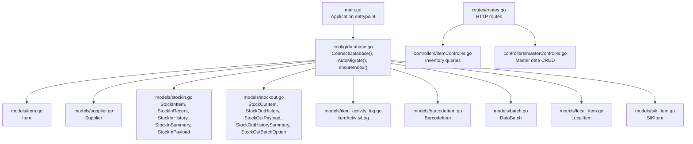

**Diagram sources**
- [main.go:12-32](file://backend/main.go#L12-L32)
- [database.go:13-83](file://backend/config/database.go#L13-L83)
- [routes.go:9-35](file://backend/routes/routes.go#L9-L35)

**Section sources**
- [main.go:12-32](file://backend/main.go#L12-L32)
- [database.go:13-83](file://backend/config/database.go#L13-L83)
- [routes.go:9-35](file://backend/routes/routes.go#L9-L35)

## Core Components
This section documents the primary database entities and their GORM models, including table names, fields, data types, constraints, and relationships inferred from the codebase.

- Items (databarang)
  - Purpose: Core product catalog with pricing tiers, supplier, unit, category, and batch metadata.
  - Key fields: kode_brng (PK), nama_brng, stokminimal, expire, h_beli, ralan, utama, beliluar, barcode, kode_kategori, kode_golongan, kdjns, kode_industri, stok, kode_sat, supplier, satuan, jenis, kategori, golongan, no_batch, no_faktur, tgl_beli, tgl_kadaluarsa.
  - Constraints: Struct tags define column mappings; no explicit GORM primary key annotation implies external constraint or composite key behavior is handled by application logic.
  - Relationships: Joined with gudangbarang (warehouse stock), barcode_obat (barcode), industrifarmasi (supplier), kodesatuan (unit), jenis, golongan_barang, kategori_barang, and data_batch (batch dates).
  - Notes: Batch-related fields (no_batch, no_faktur) are derived via joins; expiration date prioritizes batch date over item-level expire.

- Suppliers (industrifarmasi)
  - Purpose: Supplier master data.
  - Fields: kode_industri (PK), nama_industri, alamat, kota, no_telp.
  - Constraints: No explicit GORM PK annotation; PK enforced externally.

- StockIn (riwayat_barang_medis)
  - Purpose: Stock-in transaction history and recent entries.
  - Types:
    - StockInItem: kode_brng, nama_brng, barcode, stok, h_beli, satuan, supplier, golongan, expire.
    - StockInRecent: kode_brng, nama_brng, qty, price, date, time, supplier, note.
    - StockInHistory: kode_brng, nama_brng, barcode, qty, unit, buy_price, total_cost, expired, date, time, supplier, operator, note.
    - StockInSummary: total_qty, total_value.
    - StockInPayload: kode_brng, qty, price, tanggal_pembelian, expired, no_batch, no_faktur, note.
  - Constraints: Struct tags define column mappings; no explicit PK annotations imply composite or application-managed keys.

- StockOut (riwayat_barang_medis)
  - Purpose: Stock-out transaction history and recent entries.
  - Types:
    - StockOutItem: kode_brng, nama_brng, barcode, stok, sell_price, harga_apotek, harga_umum, harga_utama, satuan, supplier, golongan, jenis, expire.
    - StockOutHistory: kode_brng, nama_brng, barcode, qty, unit, sell_price, total_revenue, date, time, destination, operator, note.
    - StockOutPayload: kode_brng, qty, no_batch, no_faktur, destination, note.
    - StockOutHistorySummary: total_qty, total_value.
    - StockOutBatchOption: no_batch, no_faktur, expired, sisa, h_beli, sell_price, harga_apotek, harga_umum, harga_utama, tgl_beli.
  - Constraints: Struct tags define column mappings; no explicit PK annotations imply composite or application-managed keys.

- Item Activity Logs (item_activity_logs)
  - Purpose: Track item activity events with timestamps.
  - Fields: id (PK), kode_brng (indexed), created_at (auto-time).
  - Constraints: GORM primary key; kode_brng indexed via struct tag.

- Barcode Items (barcode_obat)
  - Purpose: Barcode-to-item mapping.
  - Fields: kode_brng (PK), barcode (unique).
  - Constraints: Primary key and unique constraints enforced via GORM tags.

- Data Batch (data_batch)
  - Purpose: Batch-level purchase and pricing details.
  - Fields: no_batch, kode_brng, tgl_beli, tgl_kadaluarsa, asal, no_faktur, dasar, h_beli, ralan, kelas1, kelas2, kelas3, utama, vip, vvip, beliluar, jualbebas, karyawan, jumlahbeli, sisa.
  - Constraints: Struct tags define column mappings; no explicit PK annotation.

- Local Items (items)
  - Purpose: Local inventory items with pricing tiers and batch metadata.
  - Fields: id (PK), kode_barang, nama_barang, supplier, satuan, kategori, golongan, jenis, no_batch, no_faktur, tanggal_pembelian, harga_beli, harga_umum, harga_utama, harga_beli_luar, stok, expired, barcode, created_at.
  - Constraints: Struct tags define column mappings; primary key via GORM.

- SIK Items (SIKItem)
  - Purpose: Legacy or mirrored item representation.
  - Fields: kode_brng, nama_brng, barcode, expire, h_beli, ralan, utama, beliluar, stok, supplier, satuan, jenis, kategori, golongan.
  - Constraints: Struct tags define column mappings; no explicit PK annotation.

**Section sources**
- [item.go:3-32](file://backend/models/item.go#L3-L32)
- [supplier.go:3-14](file://backend/models/supplier.go#L3-L14)
- [stockin.go:3-57](file://backend/models/stockin.go#L3-L57)
- [stockout.go:3-60](file://backend/models/stockout.go#L3-L60)
- [item_activity_log.go:5-13](file://backend/models/item_activity_log.go#L5-L13)
- [barcodeItem.go:3-12](file://backend/models/barcodeItem.go#L3-L12)
- [batch.go:3-29](file://backend/models/batch.go#L3-L29)
- [local_item.go:5-34](file://backend/models/local_item.go#L5-L34)
- [sik_item.go:3-32](file://backend/models/sik_item.go#L3-L32)

## Architecture Overview
The system architecture integrates GORM with MySQL to support inventory operations. The application initializes database connections, auto-migrates selected models, ensures indexes, and exposes REST endpoints for CRUD operations and reporting.

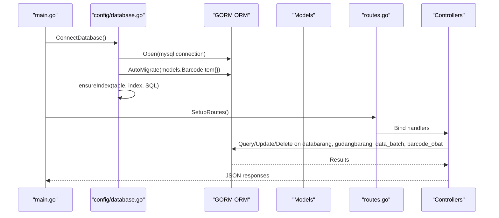

**Diagram sources**
- [main.go:12-32](file://backend/main.go#L12-L32)
- [database.go:13-83](file://backend/config/database.go#L13-L83)
- [routes.go:9-35](file://backend/routes/routes.go#L9-L35)

## Detailed Component Analysis

### Items (databarang)
- Purpose: Central product record with pricing tiers, supplier, unit, category, and batch metadata.
- GORM Model: Item struct mapped to databarang table.
- Joins and Views:
  - Left join with gudangbarang to compute warehouse stock for a specific department.
  - Left join with barcode_obat to derive barcode.
  - Left joins with supplier, unit, jenis, golongan_barang, kategori_barang, and data_batch for enriched attributes.
- Business Logic:
  - Expiration date selection prefers batch-level tgl_kadaluarsa over item-level expire.
  - Latest batch derivation via GROUP_CONCAT and substring extraction.
- Integrity:
  - No explicit GORM PK; PK likely enforced externally or via composite key behavior.

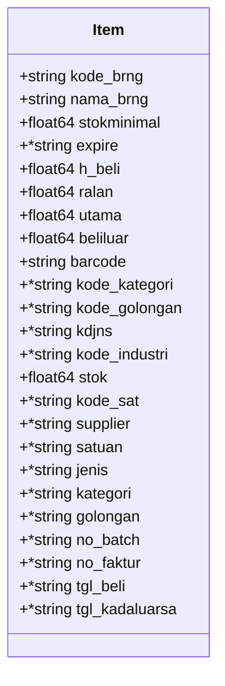

**Diagram sources**
- [item.go:3-32](file://backend/models/item.go#L3-L32)

**Section sources**
- [item.go:3-32](file://backend/models/item.go#L3-L32)
- [itemController.go:22-96](file://backend/controllers/itemController.go#L22-L96)

### Suppliers (industrifarmasi)
- Purpose: Supplier master data.
- GORM Model: Supplier struct mapped to industrifarmasi table.
- Constraints: No explicit GORM PK; PK enforced externally.

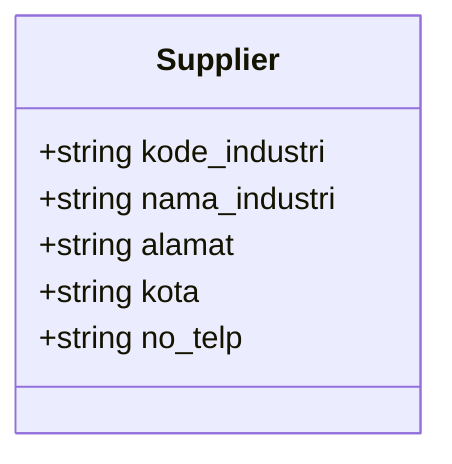

**Diagram sources**
- [supplier.go:3-14](file://backend/models/supplier.go#L3-L14)

**Section sources**
- [supplier.go:3-14](file://backend/models/supplier.go#L3-L14)
- [itemController.go:174-176](file://backend/controllers/itemController.go#L174-L176)

### StockIn (riwayat_barang_medis)
- Purpose: Stock-in records and summaries.
- Types:
  - StockInItem: Lightweight item view for stock-in operations.
  - StockInRecent: Recent stock-in entries with date/time and supplier.
  - StockInHistory: Full audit trail with cost and operator.
  - StockInSummary: Aggregated quantities and values.
  - StockInPayload: Request payload for adding stock-in entries.
- Constraints: Struct tags define column mappings; no explicit PK annotations imply composite or application-managed keys.

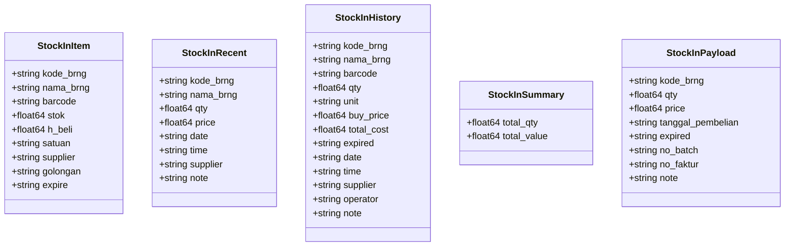

**Diagram sources**
- [stockin.go:3-57](file://backend/models/stockin.go#L3-L57)

**Section sources**
- [stockin.go:3-57](file://backend/models/stockin.go#L3-L57)

### StockOut (riwayat_barang_medis)
- Purpose: Stock-out records and summaries.
- Types:
  - StockOutItem: Lightweight item view for stock-out operations.
  - StockOutHistory: Full audit trail with revenue and destination.
  - StockOutPayload: Request payload for adding stock-out entries.
  - StockOutHistorySummary: Aggregated quantities and values.
  - StockOutBatchOption: Batch-level pricing and availability for stock-out selection.
- Constraints: Struct tags define column mappings; no explicit PK annotations imply composite or application-managed keys.

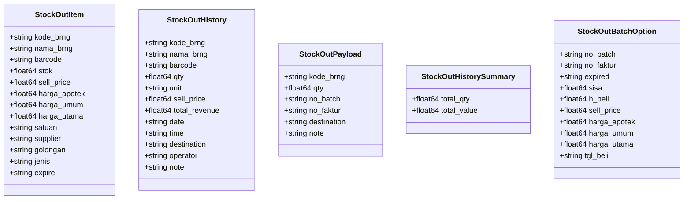

**Diagram sources**
- [stockout.go:3-60](file://backend/models/stockout.go#L3-L60)

**Section sources**
- [stockout.go:3-60](file://backend/models/stockout.go#L3-L60)

### Item Activity Logs (item_activity_logs)
- Purpose: Track item activity events with timestamps.
- GORM Model: ItemActivityLog struct mapped to item_activity_logs table.
- Constraints: Primary key id; kode_brng indexed via struct tag.

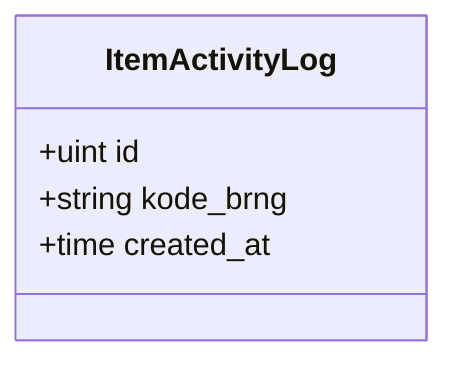

**Diagram sources**
- [item_activity_log.go:5-13](file://backend/models/item_activity_log.go#L5-L13)

**Section sources**
- [item_activity_log.go:5-13](file://backend/models/item_activity_log.go#L5-L13)

### Barcode Items (barcode_obat)
- Purpose: Barcode-to-item mapping.
- GORM Model: BarcodeItem struct mapped to barcode_obat table.
- Constraints: Primary key kode_brng; unique barcode enforced via GORM.

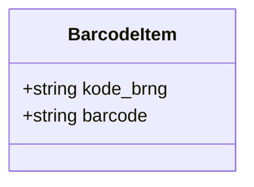

**Diagram sources**
- [barcodeItem.go:3-12](file://backend/models/barcodeItem.go#L3-L12)

**Section sources**
- [barcodeItem.go:3-12](file://backend/models/barcodeItem.go#L3-L12)

### Data Batch (data_batch)
- Purpose: Batch-level purchase and pricing details.
- GORM Model: DataBatch struct mapped to data_batch table.
- Constraints: Struct tags define column mappings; no explicit PK annotation.

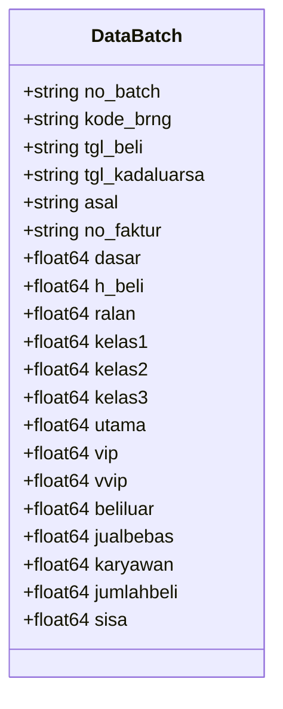

**Diagram sources**
- [batch.go:3-29](file://backend/models/batch.go#L3-L29)

**Section sources**
- [batch.go:3-29](file://backend/models/batch.go#L3-L29)

### Local Items (items)
- Purpose: Local inventory items with pricing tiers and batch metadata.
- GORM Model: LocalItem struct mapped to items table.
- Constraints: Primary key id; struct tags define column mappings.

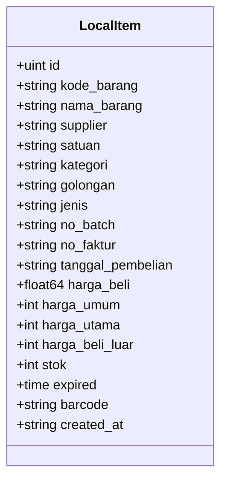

**Diagram sources**
- [local_item.go:5-34](file://backend/models/local_item.go#L5-L34)

**Section sources**
- [local_item.go:5-34](file://backend/models/local_item.go#L5-L34)

### SIK Items (SIKItem)
- Purpose: Legacy or mirrored item representation.
- GORM Model: SIKItem struct mapped to SIK data sources.
- Constraints: Struct tags define column mappings; no explicit PK annotation.

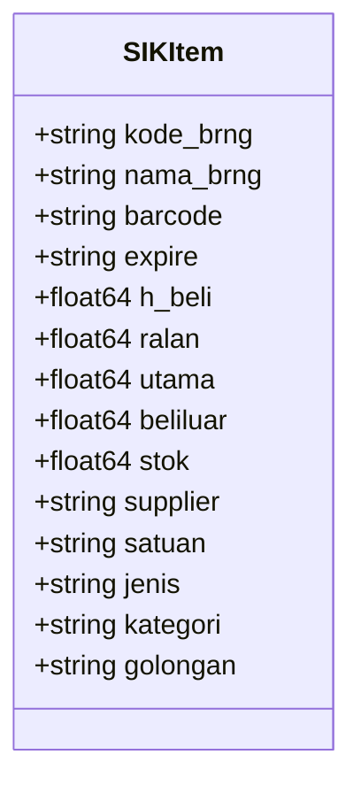

**Diagram sources**
- [sik_item.go:3-32](file://backend/models/sik_item.go#L3-L32)

**Section sources**
- [sik_item.go:3-32](file://backend/models/sik_item.go#L3-L32)

## Dependency Analysis
The application depends on GORM for ORM operations and MySQL for persistence. Controllers orchestrate queries against multiple tables to assemble enriched item views and transaction histories. Routes bind HTTP endpoints to controller handlers.

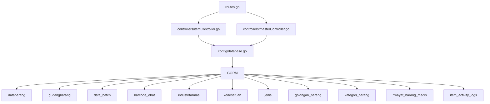

**Diagram sources**
- [routes.go:9-35](file://backend/routes/routes.go#L9-L35)
- [itemController.go:22-96](file://backend/controllers/itemController.go#L22-L96)
- [masterController.go:51-95](file://backend/controllers/masterController.go#L51-L95)
- [database.go:13-83](file://backend/config/database.go#L13-L83)

**Section sources**
- [routes.go:9-35](file://backend/routes/routes.go#L9-L35)
- [itemController.go:22-96](file://backend/controllers/itemController.go#L22-L96)
- [masterController.go:51-95](file://backend/controllers/masterController.go#L51-L95)
- [database.go:13-83](file://backend/config/database.go#L13-L83)

## Performance Considerations
- Indexing Strategy:
  - riwayat_barang_medis: idx_rbm_dashboard_recent (kd_bangsal, tanggal, jam), idx_rbm_stockin_summary (kd_bangsal, kode_brng, masuk).
  - gudangbarang: idx_gudangbarang_bangsal_brng (kd_bangsal, kode_brng).
  - databarang: idx_databarang_expire (expire), idx_databarang_kode_golongan (kode_golongan).
- Query Patterns:
  - LEFT JOINs with aggregations (SUM, MIN, MAX) to compute stock and batch dates.
  - Subqueries and GROUP_CONCAT to derive latest batch information.
  - DATE_FORMAT and COALESCE to normalize and enrich data.
- Data Access Optimization:
  - Use selective SELECT lists to reduce bandwidth.
  - Prefer indexed columns in WHERE clauses and JOIN conditions.
  - Avoid unnecessary scans by leveraging pre-created indexes.

**Section sources**
- [database.go:50-78](file://backend/config/database.go#L50-L78)
- [itemController.go:104-215](file://backend/controllers/itemController.go#L104-L215)

## Troubleshooting Guide
- Migration Issues:
  - Auto-migration runs for BarcodeItem during initial connect and later for BarcodeItem and ItemActivityLog during runtime. Ensure database credentials and permissions are correct.
- Index Creation:
  - ensureIndex checks information_schema before creating indexes. Verify that the database user has privileges to create indexes.
- Data Integrity:
  - Barcode uniqueness is enforced via GORM unique tag. Duplicate barcodes will cause constraint violations.
  - Supplier and unit joins rely on external referential integrity; ensure master tables are populated before querying items.
- Query Failures:
  - Complex joins and subqueries require careful column aliases and table prefixes. Validate SQL correctness and table/column names.

**Section sources**
- [main.go:26-29](file://backend/main.go#L26-L29)
- [database.go:37-48](file://backend/config/database.go#L37-L48)
- [database.go:85-110](file://backend/config/database.go#L85-L110)
- [barcodeItem.go:7](file://backend/models/barcodeItem.go#L7)

## Conclusion
The PPA inventory management system employs a robust relational schema centered around items, suppliers, stock transactions, and activity logs. GORM simplifies ORM operations, while carefully designed indexes and optimized queries ensure efficient data access. Auto-migration and index enforcement streamline schema evolution, and controller-level joins assemble enriched views for the frontend. Adhering to the documented constraints and indexing strategies will help maintain data integrity and performance as the system scales.