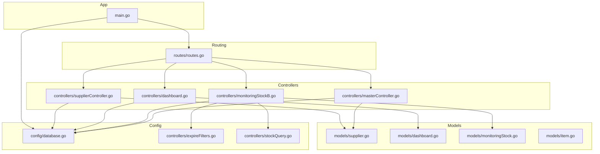
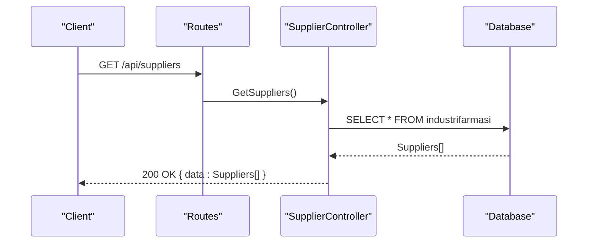
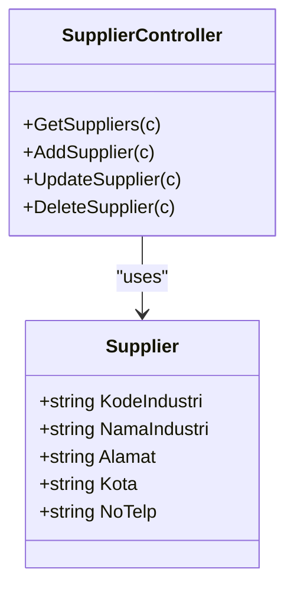
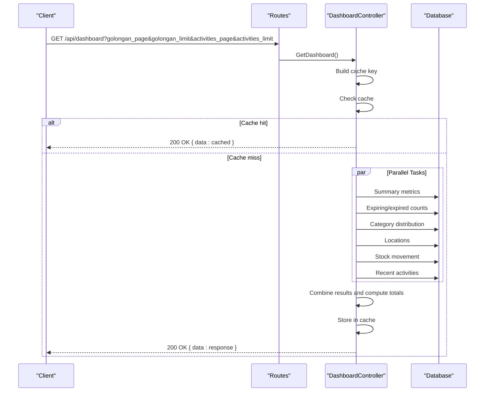
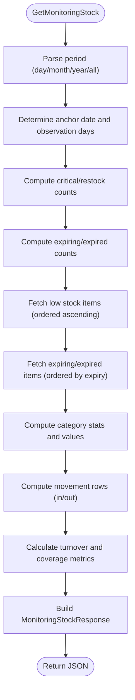
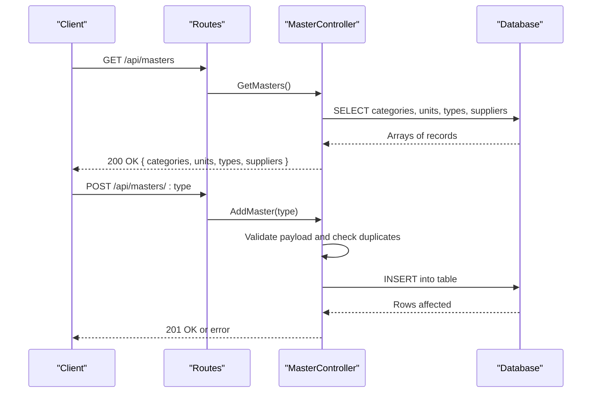
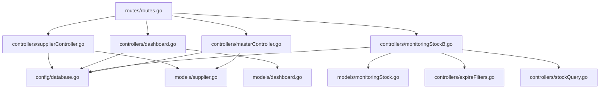

# Master Data Models

<cite>
**Referenced Files in This Document**
- [supplier.go](file://backend/models/supplier.go)
- [dashboard.go](file://backend/models/dashboard.go)
- [monitoringStock.go](file://backend/models/monitoringStock.go)
- [item.go](file://backend/models/item.go)
- [supplierController.go](file://backend/controllers/supplierController.go)
- [dashboard.go](file://backend/controllers/dashboard.go)
- [monitoringStockB.go](file://backend/controllers/monitoringStockB.go)
- [masterController.go](file://backend/controllers/masterController.go)
- [routes.go](file://backend/routes/routes.go)
- [database.go](file://backend/config/database.go)
- [main.go](file://backend/main.go)
- [expireFilters.go](file://backend/controllers/expireFilters.go)
- [stockQuery.go](file://backend/controllers/stockQuery.go)
</cite>

## Table of Contents
1. [Introduction](#introduction)
2. [Project Structure](#project-structure)
3. [Core Components](#core-components)
4. [Architecture Overview](#architecture-overview)
5. [Detailed Component Analysis](#detailed-component-analysis)
6. [Dependency Analysis](#dependency-analysis)
7. [Performance Considerations](#performance-considerations)
8. [Troubleshooting Guide](#troubleshooting-guide)
9. [Conclusion](#conclusion)
10. [Appendices](#appendices)

## Introduction
This document provides comprehensive documentation for the master data models and analytics dashboards used in the inventory management system. It focuses on:
- Supplier model for supplier management and contact information
- Dashboard model for analytics data aggregation
- MonitoringStock model for stock level monitoring and reporting
It also explains GORM configurations, relationship mappings, data validation rules, and how these models support inventory operations and reporting features. Examples of supplier integration, dashboard data aggregation, and stock monitoring workflows are included.

## Project Structure
The backend is organized around models, controllers, routes, and configuration. The models define the data structures and GORM mappings. Controllers orchestrate data retrieval and transformations, while routes expose endpoints. The configuration connects to the database and sets up indexes for performance.

**Diagram sources**
- [main.go:12-32](file://backend/main.go#L12-L32)
- [routes.go:9-35](file://backend/routes/routes.go#L9-L35)
- [database.go:13-89](file://backend/config/database.go#L13-L89)
- [supplier.go:3-14](file://backend/models/supplier.go#L3-L14)
- [dashboard.go:3-60](file://backend/models/dashboard.go#L3-L60)
- [monitoringStock.go:3-81](file://backend/models/monitoringStock.go#L3-L81)
- [item.go:3-33](file://backend/models/item.go#L3-L33)
- [supplierController.go:10-80](file://backend/controllers/supplierController.go#L10-L80)
- [dashboard.go:43-307](file://backend/controllers/dashboard.go#L43-L307)
- [monitoringStockB.go:83-375](file://backend/controllers/monitoringStockB.go#L83-L375)
- [masterController.go:51-95](file://backend/controllers/masterController.go#L51-L95)
- [expireFilters.go:1-200](file://backend/controllers/expireFilters.go#L1-L200)
- [stockQuery.go:1-200](file://backend/controllers/stockQuery.go#L1-L200)

**Section sources**
- [main.go:12-32](file://backend/main.go#L12-L32)
- [routes.go:9-35](file://backend/routes/routes.go#L9-L35)
- [database.go:13-89](file://backend/config/database.go#L13-L89)

## Core Components
This section documents the core models and their roles in the system.

- Supplier model
  - Purpose: Stores supplier metadata and contact information for procurement and vendor management.
  - Fields: Industry code, industry name, address, city, phone number.
  - GORM mapping: Struct tags define JSON serialization and column mapping for database fields.
  - Validation: No explicit validation rules in the model; validation occurs in controllers during create/update operations.

- Dashboard models
  - Purpose: Aggregates analytics data for the dashboard, including summary metrics, distributions, locations, movements, and recent activities.
  - Types: Summary, Distribution, Location, Stock Movement, Recent Activity, Pagination, Pagination Meta, and Response container.
  - GORM mapping: Struct tags define JSON serialization and column mapping for selected fields.

- MonitoringStock models
  - Purpose: Provides stock monitoring insights including low stock alerts, expiring/expired items, turnover ratios, coverage days, and category statistics.
  - Types: Summary, Low Stock Item, Expiring Item, Turnover, Coverage, Category Stats, Category Values, Movement Row, and Response container.
  - GORM mapping: Struct tags define JSON serialization and column mapping for selected fields.

- Item model
  - Purpose: Represents inventory items with attributes such as stock levels, expiration dates, pricing, categories, units, and supplier linkage.
  - GORM mapping: TableName override binds to the central inventory table; foreign keys and relationships are implied via joins in queries.

**Section sources**
- [supplier.go:3-14](file://backend/models/supplier.go#L3-L14)
- [dashboard.go:3-60](file://backend/models/dashboard.go#L3-L60)
- [monitoringStock.go:3-81](file://backend/models/monitoringStock.go#L3-L81)
- [item.go:3-33](file://backend/models/item.go#L3-L33)

## Architecture Overview
The system follows a layered architecture:
- Routes define HTTP endpoints.
- Controllers handle requests, apply validation, and orchestrate data retrieval.
- Models define data structures and GORM mappings.
- Config manages database connection and index creation.
- Queries leverage raw SQL with GORM for performance and complex aggregations.

**Diagram sources**
- [routes.go:17-20](file://backend/routes/routes.go#L17-L20)
- [supplierController.go:10-21](file://backend/controllers/supplierController.go#L10-L21)
- [database.go:21-31](file://backend/config/database.go#L21-L31)

## Detailed Component Analysis

### Supplier Model and Controller
The Supplier model encapsulates supplier metadata and contact information. The SupplierController handles CRUD operations against the supplier table.

- Supplier model fields
  - Industry code: Unique identifier for the supplier.
  - Industry name: Display name of the supplier.
  - Address: Physical address of the supplier.
  - City: City of the supplier.
  - Phone number: Contact phone number.

- GORM configuration
  - Struct tags specify JSON field names and GORM column mappings.
  - No primary key annotation is present; the underlying table schema defines the primary key.

- Controller operations
  - Retrieve all suppliers: Queries the supplier table and returns a JSON array.
  - Add supplier: Validates JSON payload and inserts a new record.
  - Update supplier: Validates JSON payload and updates by ID.
  - Delete supplier: Deletes a supplier by ID.

- Data validation rules
  - JSON binding errors return a 400 response with the error message.
  - Update and delete operations rely on the client-provided ID.

**Diagram sources**
- [supplier.go:3-14](file://backend/models/supplier.go#L3-L14)
- [supplierController.go:10-80](file://backend/controllers/supplierController.go#L10-L80)

**Section sources**
- [supplier.go:3-14](file://backend/models/supplier.go#L3-L14)
- [supplierController.go:10-80](file://backend/controllers/supplierController.go#L10-L80)

### Dashboard Analytics
The Dashboard controller aggregates analytics data using concurrent goroutines and caches results for performance.

- Data aggregation tasks
  - Summary metrics: Total items, total stock, inventory value, and low stock count.
  - Expiring/expired counts: Combined computation using date comparisons.
  - Category distribution: Paginated groupings by category with item counts and stock totals.
  - Locations: Stock totals grouped by storage location.
  - Stock movement: Monthly inflows/outflows over a rolling window.
  - Recent activities: Today’s transactions with pagination.

- Concurrency and caching
  - Six concurrent tasks fetch data in parallel.
  - A cache stores responses keyed by pagination parameters and TTL.
  - On cache hit, the cached response is returned immediately.

- Pagination meta
  - Calculates total pages for categories and activities based on counts and limits.

**Diagram sources**
- [routes.go:23](file://backend/routes/routes.go#L23)
- [dashboard.go:43-307](file://backend/controllers/dashboard.go#L43-L307)
- [database.go:50-84](file://backend/config/database.go#L50-L84)

**Section sources**
- [dashboard.go:43-307](file://backend/controllers/dashboard.go#L43-L307)
- [dashboard.go:3-60](file://backend/models/dashboard.go#L3-L60)

### Monitoring Stock
The MonitoringStock controller provides comprehensive stock monitoring with thresholds and computed metrics.

- Thresholds and periods
  - Critical stock threshold: Items below this level are flagged as critical.
  - Restock threshold: Items between critical and restock levels require restocking.
  - Expiring soon days: Items expiring within this window are flagged.
  - Observation periods: Day, month, year, or all-time windows for usage calculations.

- Computed metrics
  - Turnover ratio: Cost of goods sold divided by average inventory.
  - Coverage days: Current stock divided by average daily usage.
  - Status indicators: Critical, warning, or good based on thresholds and usage.

- Data sources and filters
  - Uses raw SQL with joins to inventory and transaction tables.
  - Applies date filters for observation windows and validates expiration dates.

**Diagram sources**
- [monitoringStockB.go:83-375](file://backend/controllers/monitoringStockB.go#L83-L375)
- [expireFilters.go:1-200](file://backend/controllers/expireFilters.go#L1-L200)
- [stockQuery.go:1-200](file://backend/controllers/stockQuery.go#L1-L200)

**Section sources**
- [monitoringStockB.go:83-375](file://backend/controllers/monitoringStockB.go#L83-L375)
- [monitoringStock.go:3-81](file://backend/models/monitoringStock.go#L3-L81)

### Master Data Integration
The master controller consolidates multiple master tables (categories, units, types) and suppliers into a single response for UI consumption.

- Supported master types
  - Categories (by code and name)
  - Units (by code and unit name)
  - Types (by code and name)
  - Suppliers (from the supplier table)

- Validation and CRUD
  - Validation ensures non-empty code/name for additions.
  - Prevents duplicate codes for existing entries.
  - Updates and deletes operate by code with appropriate error handling.

**Diagram sources**
- [routes.go:13-16](file://backend/routes/routes.go#L13-L16)
- [masterController.go:51-95](file://backend/controllers/masterController.go#L51-L95)

**Section sources**
- [masterController.go:51-95](file://backend/controllers/masterController.go#L51-L95)

## Dependency Analysis
This section maps dependencies among components and highlights external integrations.

**Diagram sources**
- [routes.go:9-35](file://backend/routes/routes.go#L9-L35)
- [supplierController.go:10-80](file://backend/controllers/supplierController.go#L10-L80)
- [dashboard.go:43-307](file://backend/controllers/dashboard.go#L43-L307)
- [monitoringStockB.go:83-375](file://backend/controllers/monitoringStockB.go#L83-L375)
- [masterController.go:51-95](file://backend/controllers/masterController.go#L51-L95)
- [dashboard.go:3-60](file://backend/models/dashboard.go#L3-L60)
- [monitoringStock.go:3-81](file://backend/models/monitoringStock.go#L3-L81)
- [supplier.go:3-14](file://backend/models/supplier.go#L3-L14)
- [expireFilters.go:1-200](file://backend/controllers/expireFilters.go#L1-L200)
- [stockQuery.go:1-200](file://backend/controllers/stockQuery.go#L1-L200)

**Section sources**
- [routes.go:9-35](file://backend/routes/routes.go#L9-L35)
- [database.go:50-84](file://backend/config/database.go#L50-L84)

## Performance Considerations
- Indexes
  - Dashboard recent activities: Composite index on storage location, date, and time to optimize sorting and filtering.
  - Warehouse stock: Composite index on location and item code for fast stock lookups.
  - Expiration dates: Index on expiration date for expiring/expired queries.
  - Category and supplier joins: Indexes on category code and supplier code improve join performance.

- Concurrency
  - Dashboard uses goroutines to parallelize six data fetches, reducing overall latency.

- Caching
  - Dashboard responses are cached with a TTL to minimize repeated heavy computations.

- Query optimization
  - Raw SQL with explicit joins and aggregations reduces ORM overhead for complex analytics.

**Section sources**
- [database.go:50-84](file://backend/config/database.go#L50-L84)
- [dashboard.go:13-30](file://backend/controllers/dashboard.go#L13-L30)
- [dashboard.go:56-63](file://backend/controllers/dashboard.go#L56-L63)

## Troubleshooting Guide
- Supplier endpoint issues
  - Verify JSON payload structure matches the Supplier model fields.
  - Check database connectivity and table existence.

- Dashboard endpoint issues
  - Confirm pagination parameters are positive integers.
  - Review cache TTL and clear cache if stale data is suspected.
  - Inspect database indexes if queries are slow.

- Monitoring stock issues
  - Validate observation period and ensure anchor date is available.
  - Check expiration date validity and date range constraints.
  - Review computed metrics for division by zero or negative values.

- General
  - Enable logging for database queries to diagnose performance bottlenecks.
  - Monitor error responses for detailed messages indicating failures.

**Section sources**
- [supplierController.go:27-34](file://backend/controllers/supplierController.go#L27-L34)
- [dashboard.go:269-272](file://backend/controllers/dashboard.go#L269-L272)
- [monitoringStockB.go:141-144](file://backend/controllers/monitoringStockB.go#L141-L144)

## Conclusion
The master data models and analytics components provide a robust foundation for supplier management, inventory analytics, and stock monitoring. GORM configurations, raw SQL queries, and strategic indexing enable efficient data retrieval and aggregation. The controllers enforce validation and coordinate complex workflows, supporting accurate reporting and informed decision-making.

## Appendices

### Supplier Integration Example
- Endpoint: GET /api/suppliers
- Behavior: Returns all suppliers from the supplier table.
- Typical response: Array of supplier objects with industry code, name, address, city, and phone number.

**Section sources**
- [routes.go:17-20](file://backend/routes/routes.go#L17-L20)
- [supplierController.go:10-21](file://backend/controllers/supplierController.go#L10-L21)

### Dashboard Data Aggregation Example
- Endpoint: GET /api/dashboard
- Behavior: Computes summary metrics, category distribution, location stock, stock movement, and recent activities using concurrent queries and caches results.
- Pagination: Supports configurable page and limit for category distribution and recent activities.

**Section sources**
- [routes.go:23](file://backend/routes/routes.go#L23)
- [dashboard.go:43-307](file://backend/controllers/dashboard.go#L43-L307)

### Stock Monitoring Workflow Example
- Endpoint: GET /api/monitoring-stock
- Behavior: Computes critical and restock counts, expiring/expired counts, low stock items, expiring items, turnover ratios, coverage days, and category statistics for a selected observation period.
- Details endpoint: GET /api/monitoring-stock/details?type=search
- Behavior: Filters and retrieves detailed lists for critical, restock, expiring soon, or expired items with optional search term.

**Section sources**
- [routes.go:24-25](file://backend/routes/routes.go#L24-L25)
- [monitoringStockB.go:83-375](file://backend/controllers/monitoringStockB.go#L83-L375)