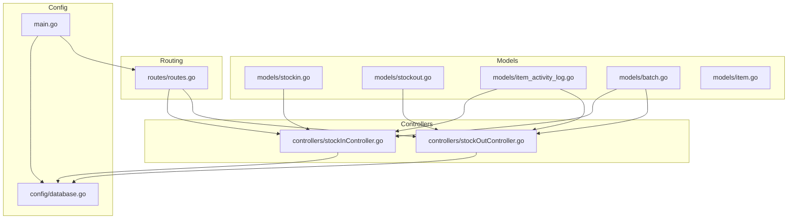
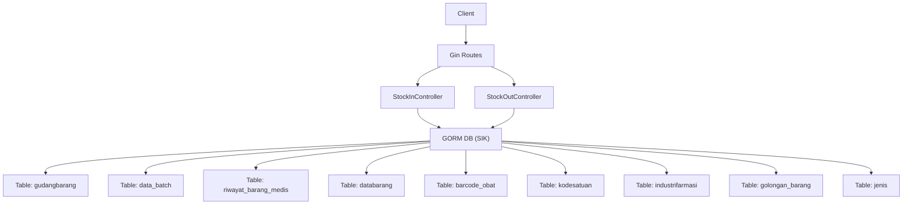
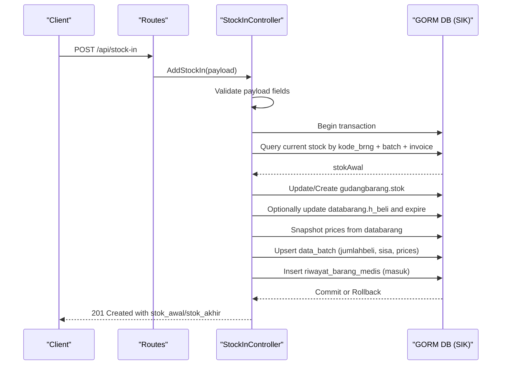
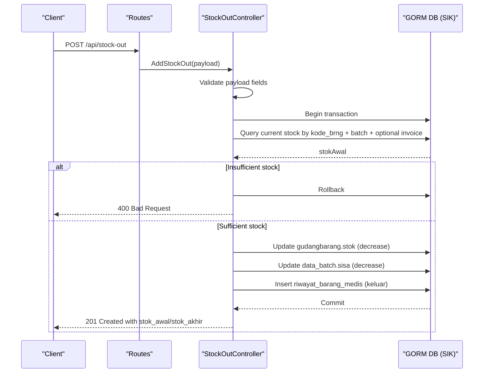
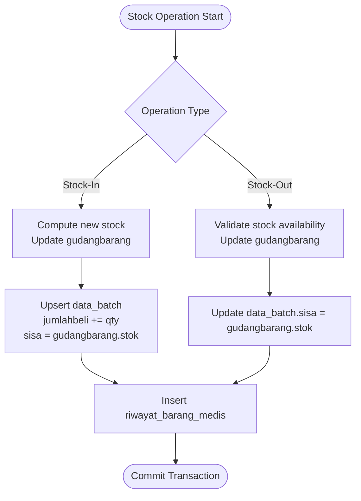
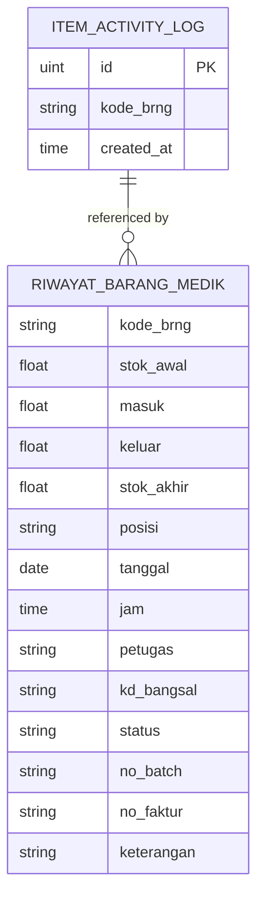
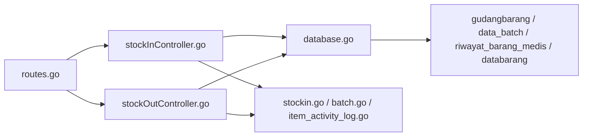

# Stock Transaction Models

<cite>
**Referenced Files in This Document**
- [stockin.go](file://backend/models/stockin.go)
- [stockout.go](file://backend/models/stockout.go)
- [item_activity_log.go](file://backend/models/item_activity_log.go)
- [batch.go](file://backend/models/batch.go)
- [stockInController.go](file://backend/controllers/stockInController.go)
- [stockOutController.go](file://backend/controllers/stockOutController.go)
- [database.go](file://backend/config/database.go)
- [routes.go](file://backend/routes/routes.go)
- [main.go](file://backend/main.go)
- [item.go](file://backend/models/item.go)
</cite>

## Table of Contents
1. [Introduction](#introduction)
2. [Project Structure](#project-structure)
3. [Core Components](#core-components)
4. [Architecture Overview](#architecture-overview)
5. [Detailed Component Analysis](#detailed-component-analysis)
6. [Dependency Analysis](#dependency-analysis)
7. [Performance Considerations](#performance-considerations)
8. [Troubleshooting Guide](#troubleshooting-guide)
9. [Conclusion](#conclusion)

## Introduction
This document provides comprehensive documentation for the stock transaction models and workflows in the PPA system. It focuses on:
- StockIn and StockOut models and their field definitions
- Quantity tracking, price management, and batch associations
- Audit trail via ItemActivityLog and transaction history
- GORM relationships, foreign key constraints, and validation rules
- Examples of transaction processing workflows, batch management, and audit log generation
- Business logic for stock level updates and inventory reconciliation

## Project Structure
The stock transaction system spans models, controllers, routing, and database configuration:
- Models define data structures for stock transactions, batch data, and activity logs
- Controllers implement business logic for stock-in/out operations, validations, and audit logging
- Routes expose endpoints for stock operations
- Database configuration manages connections and indexes for performance

**Diagram sources**
- [stockin.go:1-57](file://backend/models/stockin.go#L1-L57)
- [stockout.go:1-60](file://backend/models/stockout.go#L1-L60)
- [item_activity_log.go:1-14](file://backend/models/item_activity_log.go#L1-L14)
- [batch.go:1-29](file://backend/models/batch.go#L1-L29)
- [item.go:1-33](file://backend/models/item.go#L1-L33)
- [stockInController.go:1-383](file://backend/controllers/stockInController.go#L1-L383)
- [stockOutController.go:1-377](file://backend/controllers/stockOutController.go#L1-L377)
- [routes.go:1-36](file://backend/routes/routes.go#L1-L36)
- [database.go:1-117](file://backend/config/database.go#L1-L117)
- [main.go:1-33](file://backend/main.go#L1-L33)

**Section sources**
- [routes.go:1-36](file://backend/routes/routes.go#L1-L36)
- [database.go:1-117](file://backend/config/database.go#L1-L117)
- [main.go:1-33](file://backend/main.go#L1-L33)

## Core Components
This section documents the primary models used for stock transactions and their roles.

- StockInPayload: Defines the input payload for stock-in operations including item code, quantity, purchase price, purchase date, expiry date, batch number, invoice number, and notes.
- StockOutPayload: Defines the input payload for stock-out operations including item code, quantity, batch number, invoice number, destination, and notes.
- DataBatch: Represents batch-level inventory data including purchase date, expiry date, origin, invoice number, base price, purchase price, selling prices for various categories, cumulative purchased quantity, and remaining quantity.
- ItemActivityLog: Stores audit entries for item activities with item code and creation timestamp.

Key characteristics:
- Field definitions align with database tables for seamless GORM mapping
- Payloads encapsulate transaction inputs validated in controllers
- Batch model supports FIFO-like tracking and pricing per batch

**Section sources**
- [stockin.go:47-57](file://backend/models/stockin.go#L47-L57)
- [stockout.go:34-41](file://backend/models/stockout.go#L34-L41)
- [batch.go:3-24](file://backend/models/batch.go#L3-L24)
- [item_activity_log.go:5-13](file://backend/models/item_activity_log.go#L5-L13)

## Architecture Overview
The stock transaction architecture follows a layered pattern:
- HTTP layer: Gin routes
- Controller layer: Stock-in and stock-out handlers
- Persistence layer: GORM with MySQL connection
- Data models: Structured DTOs and entity mappings

**Diagram sources**
- [routes.go:1-36](file://backend/routes/routes.go#L1-L36)
- [stockInController.go:1-383](file://backend/controllers/stockInController.go#L1-L383)
- [stockOutController.go:1-377](file://backend/controllers/stockOutController.go#L1-L377)
- [database.go:1-117](file://backend/config/database.go#L1-L117)

## Detailed Component Analysis

### StockIn Model and Workflow
Stock-in operations update warehouse stock, synchronize batch records, optionally update item purchase price and expiry, and record transaction history.

**Diagram sources**
- [stockInController.go:235-382](file://backend/controllers/stockInController.go#L235-L382)
- [routes.go](file://backend/routes/routes.go#L29)

Key behaviors:
- Validation ensures mandatory fields are present
- Transaction wraps all writes to maintain consistency
- Stock calculation uses batch+invoice key to avoid cross-batch interference
- Price snapshot ensures batch pricing reflects current item prices
- History records reflect incoming stock movement

**Section sources**
- [stockInController.go:235-382](file://backend/controllers/stockInController.go#L235-L382)

### StockOut Model and Workflow
Stock-out operations validate sufficient stock, update warehouse and batch quantities, and record transaction history.

**Diagram sources**
- [stockOutController.go:189-281](file://backend/controllers/stockOutController.go#L189-L281)
- [routes.go](file://backend/routes/routes.go#L34)

Key behaviors:
- Stock sufficiency check prevents negative inventory
- Batch selection supports invoice filtering when provided
- History records outgoing stock movement with destination metadata

**Section sources**
- [stockOutController.go:189-281](file://backend/controllers/stockOutController.go#L189-L281)

### Batch Management During Stock Operations
Batch data is central to accurate stock valuation and FIFO tracking. The system maintains separate records per batch/invoice combination.

**Diagram sources**
- [stockInController.go:254-346](file://backend/controllers/stockInController.go#L254-L346)
- [stockOutController.go:207-242](file://backend/controllers/stockOutController.go#L207-L242)

**Section sources**
- [stockInController.go:254-346](file://backend/controllers/stockInController.go#L254-L346)
- [stockOutController.go:207-242](file://backend/controllers/stockOutController.go#L207-L242)

### Audit Trail and Transaction History
Audit logs are generated through the riwayat_barang_medis table and the ItemActivityLog model.

- riwayat_barang_medis captures each transaction with item code, initial/ending stock, quantity moved, position (incoming/outgoing), date/time, operator, location, batch/invoice, and notes.
- ItemActivityLog stores item activity entries with item code and timestamp, enabling audit trails.

**Diagram sources**
- [item_activity_log.go:5-13](file://backend/models/item_activity_log.go#L5-L13)
- [stockInController.go:348-367](file://backend/controllers/stockInController.go#L348-L367)
- [stockOutController.go:245-264](file://backend/controllers/stockOutController.go#L245-L264)

**Section sources**
- [item_activity_log.go:5-13](file://backend/models/item_activity_log.go#L5-L13)
- [stockInController.go:348-367](file://backend/controllers/stockInController.go#L348-L367)
- [stockOutController.go:245-264](file://backend/controllers/stockOutController.go#L245-L264)

### GORM Relationships and Foreign Keys
The system relies on explicit joins and table operations rather than auto-generated GORM associations. Key relationships observed:
- Items: databarang joined with barcode_obat, kodesatuan, industrifarmasi, golongan_barang, jenis
- Stock movements: gudangbarang linked to databarang and data_batch via kode_brng, batch, and invoice
- History: riwayat_barang_medis references databarang and supports summaries grouped by kode_brng and no_faktur

Constraints and keys:
- gudangbarang: composite key (kd_bangsal, kode_brng, no_batch, no_faktur) implied by queries
- data_batch: composite key (kode_brng, no_batch, no_faktur) implied by queries
- riwayat_barang_medis: composite key (kd_bangsal, kode_brng, tanggal, jam) implied by indexes

Indexes for performance:
- riwayat_barang_medis: dashboard recent, stockin summary, stockout summary
- gudangbarang: (kd_bangsal, kode_brng)
- databarang: expire, kode_golongan

**Section sources**
- [stockInController.go:17-47](file://backend/controllers/stockInController.go#L17-L47)
- [stockOutController.go:17-62](file://backend/controllers/stockOutController.go#L17-L62)
- [database.go:50-84](file://backend/config/database.go#L50-L84)

## Dependency Analysis
The controllers depend on the database configuration and models to enforce business rules and maintain data integrity.

**Diagram sources**
- [routes.go:1-36](file://backend/routes/routes.go#L1-L36)
- [stockInController.go:1-383](file://backend/controllers/stockInController.go#L1-L383)
- [stockOutController.go:1-377](file://backend/controllers/stockOutController.go#L1-L377)
- [database.go:1-117](file://backend/config/database.go#L1-L117)

**Section sources**
- [routes.go:1-36](file://backend/routes/routes.go#L1-L36)
- [stockInController.go:1-383](file://backend/controllers/stockInController.go#L1-L383)
- [stockOutController.go:1-377](file://backend/controllers/stockOutController.go#L1-L377)
- [database.go:1-117](file://backend/config/database.go#L1-L117)

## Performance Considerations
- Indexes: Strategic indexes on riwayat_barang_medis and gudangbarang improve query performance for summaries and recent transactions.
- Aggregation optimization: Pre-aggregation by kode_brng (and no_faktur for stock-out) reduces join overhead and I/O.
- Pagination: Controllers support pagination with configurable limits to manage large histories efficiently.

Recommendations:
- Monitor slow queries on history endpoints and consider adding composite indexes for frequent filters.
- Validate batch selection queries to ensure proper use of indexes on (kode_brng, no_batch, no_faktur).

**Section sources**
- [database.go:50-84](file://backend/config/database.go#L50-L84)
- [stockInController.go:177-233](file://backend/controllers/stockInController.go#L177-L233)
- [stockOutController.go:283-376](file://backend/controllers/stockOutController.go#L283-L376)

## Troubleshooting Guide
Common issues and resolutions:
- Validation failures: Ensure all required fields are provided in payloads for stock-in/out operations.
- Insufficient stock: Stock-out requests with qty exceeding available stock are rejected.
- Batch not found: Stock-out requires a valid batch/invoice combination; missing combinations cause errors.
- Transaction rollbacks: Errors during writes trigger rollbacks; inspect controller logs for detailed messages.
- History recording: If stock updates succeed but history insertion fails, the transaction is rolled back and an error is returned.

Operational checks:
- Verify database connectivity and indexes exist.
- Confirm that batch and invoice combinations match warehouse records.
- Review audit logs in riwayat_barang_medis for discrepancies.

**Section sources**
- [stockInController.go:242-245](file://backend/controllers/stockInController.go#L242-L245)
- [stockOutController.go:196-199](file://backend/controllers/stockOutController.go#L196-L199)
- [stockOutController.go:209-213](file://backend/controllers/stockOutController.go#L209-L213)
- [stockOutController.go:223-227](file://backend/controllers/stockOutController.go#L223-L227)

## Conclusion
The stock transaction system integrates robust validation, batch-aware inventory updates, and comprehensive audit logging. Controllers encapsulate business logic for stock-in and stock-out operations, while database indexes and aggregation strategies ensure performance. The models and controllers collectively support accurate stock level updates and reliable inventory reconciliation.