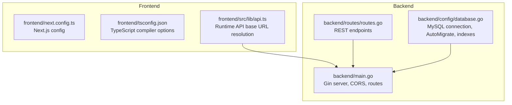
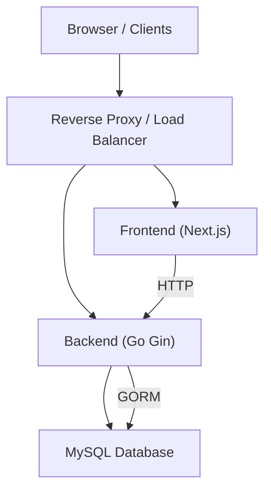
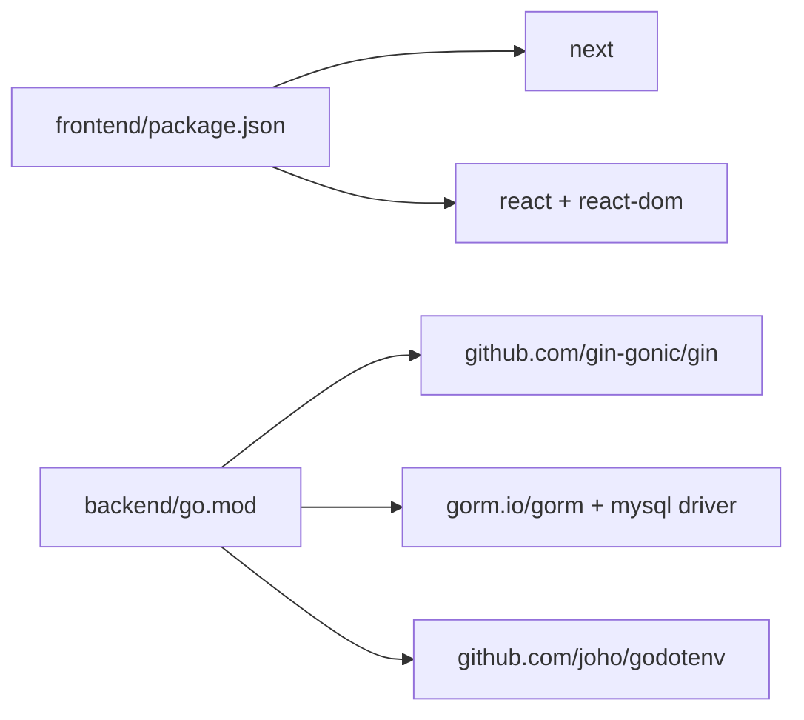

# Deployment & Configuration

<cite>
**Referenced Files in This Document**
- [backend/main.go](file://backend/main.go)
- [backend/config/database.go](file://backend/config/database.go)
- [backend/routes/routes.go](file://backend/routes/routes.go)
- [backend/go.mod](file://backend/go.mod)
- [backend/.gitignore](file://backend/.gitignore)
- [frontend/package.json](file://frontend/package.json)
- [frontend/next.config.ts](file://frontend/next.config.ts)
- [frontend/tsconfig.json](file://frontend/tsconfig.json)
- [frontend/src/lib/api.ts](file://frontend/src/lib/api.ts)
</cite>

## Table of Contents
1. [Introduction](#introduction)
2. [Project Structure](#project-structure)
3. [Core Components](#core-components)
4. [Architecture Overview](#architecture-overview)
5. [Detailed Component Analysis](#detailed-component-analysis)
6. [Dependency Analysis](#dependency-analysis)
7. [Performance Considerations](#performance-considerations)
8. [Troubleshooting Guide](#troubleshooting-guide)
9. [Conclusion](#conclusion)
10. [Appendices](#appendices)

## Introduction
This document provides comprehensive deployment and configuration guidance for the PPA system, covering both backend and frontend components. It outlines production-grade strategies for environment configuration, database setup, reverse proxy configuration, containerization, cloud deployment, environment variable management, security configurations, performance tuning, monitoring and logging, health checks, backup and disaster recovery, and scaling considerations. The goal is to enable reliable, secure, and scalable deployments in production environments.

## Project Structure
The PPA system consists of:
- Backend service written in Go using Gin and GORM for MySQL connectivity.
- Frontend built with Next.js (React) configured via TypeScript and Tailwind CSS.

Key runtime characteristics:
- Backend listens on port 8080 by default.
- Frontend communicates with the backend using a configurable base URL and port via environment variables.

**Diagram sources**
- [backend/main.go:12-32](file://backend/main.go#L12-L32)
- [backend/config/database.go:13-83](file://backend/config/database.go#L13-L83)
- [backend/routes/routes.go:9-35](file://backend/routes/routes.go#L9-L35)
- [frontend/next.config.ts:1-7](file://frontend/next.config.ts#L1-L7)
- [frontend/tsconfig.json:1-35](file://frontend/tsconfig.json#L1-L35)
- [frontend/src/lib/api.ts:1-18](file://frontend/src/lib/api.ts#L1-L18)

**Section sources**
- [backend/main.go:12-32](file://backend/main.go#L12-L32)
- [backend/config/database.go:13-83](file://backend/config/database.go#L13-L83)
- [backend/routes/routes.go:9-35](file://backend/routes/routes.go#L9-L35)
- [frontend/src/lib/api.ts:1-18](file://frontend/src/lib/api.ts#L1-L18)

## Core Components
- Backend HTTP server: Initializes database connections, registers routes, applies CORS middleware, and starts the server on port 8080.
- Database connector: Establishes a MySQL connection to a local database by default and performs schema migrations and index creation.
- Routing layer: Exposes REST endpoints for items, masters, suppliers, dashboard, monitoring, and stock-in/out operations.
- Frontend API client: Resolves the backend base URL from environment variables with a fallback to localhost and a default port.

Operational defaults and environment overrides:
- Backend port: 8080 (hardcoded in main).
- Frontend API base URL: Resolved from NEXT_PUBLIC_API_URL; otherwise derived from window location or localhost with NEXT_PUBLIC_API_PORT.

Security and transport:
- CORS is enabled globally in the backend.
- No TLS termination is configured in the backend; use a reverse proxy for HTTPS and certificate management.

**Section sources**
- [backend/main.go:12-32](file://backend/main.go#L12-L32)
- [backend/config/database.go:13-83](file://backend/config/database.go#L13-L83)
- [backend/routes/routes.go:9-35](file://backend/routes/routes.go#L9-L35)
- [frontend/src/lib/api.ts:1-18](file://frontend/src/lib/api.ts#L1-L18)

## Architecture Overview
The production architecture typically comprises:
- Reverse Proxy (e.g., Nginx or Traefik) terminating TLS, load balancing, and routing traffic to the backend.
- Backend service handling REST requests, connecting to MySQL, and serving JSON responses.
- Frontend Next.js application served statically or via Next.js server mode behind the reverse proxy.
- Optional monitoring and logging stack external to the application.

[No sources needed since this diagram shows conceptual workflow, not actual code structure]

## Detailed Component Analysis

### Backend Deployment
Production considerations:
- Environment variables: Use .env files managed outside version control. The backend currently loads environment variables via a library present in dependencies but does not explicitly use them in the main entrypoint. Define database credentials and any additional secrets via environment variables and inject them at runtime.
- Database connectivity: The backend connects to a MySQL instance. For production, configure host, port, database name, username, and password via environment variables and ensure network policies allow access from the backend host.
- Schema migration and indexes: The backend performs AutoMigrate and creates indexes on specific tables. Ensure the database user has sufficient privileges for DDL operations during startup.
- Health endpoint: Add a dedicated health check route returning 200 OK when the service and database are reachable.
- Logging: Configure structured logging (e.g., JSON) and integrate with centralized logging systems. Redirect standard output for container log collection.
- Security:
  - Enforce HTTPS via reverse proxy; disable HTTP if possible.
  - Apply rate limiting and request size limits at the reverse proxy level.
  - Restrict CORS origins to trusted domains only.
  - Rotate secrets regularly and avoid embedding credentials in code.
- Performance tuning:
  - Tune GORM connection pool settings (max open/idle connections, connection lifetime).
  - Enable compression at the reverse proxy.
  - Use caching strategies (e.g., Redis) for frequently accessed data.
- Monitoring:
  - Expose Prometheus metrics from the backend.
  - Integrate with APM tools for tracing.
  - Set up log aggregation and alerting.

Containerization:
- Build a minimal image using multi-stage builds.
- Copy compiled binary and static assets.
- Run as a non-root user with read-only root filesystem where possible.
- Mount persistent volumes for logs if needed.

Cloud deployment:
- Kubernetes: Deploy backend as a Deployment with readiness/liveness probes, expose via Service/Ingress, and manage secrets/configmaps.
- Platform-as-a-Service: Use managed databases and container services; configure environment variables and health checks accordingly.

**Section sources**
- [backend/main.go:12-32](file://backend/main.go#L12-L32)
- [backend/config/database.go:13-83](file://backend/config/database.go#L13-L83)
- [backend/go.mod:1-45](file://backend/go.mod#L1-L45)
- [backend/.gitignore:1-3](file://backend/.gitignore#L1-L3)

### Frontend Deployment
Production considerations:
- Build artifacts: Use the Next.js build script to generate optimized static assets.
- Base URL resolution: Configure NEXT_PUBLIC_API_URL to point to the backend endpoint exposed by the reverse proxy.
- Port override: Use NEXT_PUBLIC_API_PORT to align with backend port if different from 8080.
- Static hosting: Serve the Next.js output via Nginx, CDN, or a static hosting provider.
- Caching: Configure cache headers for static assets; leverage browser caching effectively.
- Security:
  - Enforce Content-Security-Policy headers via reverse proxy.
  - Use HTTPS and HSTS.
  - Sanitize user inputs and apply input validation on the backend.

Environment variable management:
- NEXT_PUBLIC_API_URL: Overrides the default backend base URL resolution.
- NEXT_PUBLIC_API_PORT: Overrides the default backend port used by the frontend when resolving the base URL.

**Section sources**
- [frontend/package.json:5-10](file://frontend/package.json#L5-L10)
- [frontend/src/lib/api.ts:1-18](file://frontend/src/lib/api.ts#L1-L18)
- [frontend/next.config.ts:1-7](file://frontend/next.config.ts#L1-L7)
- [frontend/tsconfig.json:1-35](file://frontend/tsconfig.json#L1-L35)

### Database Setup
- Connection string: The backend opens a MySQL connection with a default local configuration. Replace the connection string with environment variables for production.
- Migrations: AutoMigrate is executed for specific models; ensure the database user has ALTER privilege.
- Indexes: The backend ensures specific indexes exist; verify index creation succeeded and monitor index usage.
- Backup strategy: Schedule regular logical backups (mysqldump) and continuous backups (binary logs) for point-in-time recovery.
- Disaster recovery: Test restore procedures and maintain offsite backups. Consider replication for high availability.

**Section sources**
- [backend/config/database.go:13-83](file://backend/config/database.go#L13-L83)

### Reverse Proxy Configuration
Recommended setup:
- Terminate TLS with a valid certificate and strong cipher suite.
- Route /api/* to the backend service.
- Serve frontend static assets or Next.js server behind the same domain.
- Apply rate limiting, request size limits, and security headers.
- Enable keep-alive and compression.

Health checks:
- Backend: Implement a lightweight health endpoint returning service status and database connectivity.
- Reverse proxy: Configure upstream health checks to drain unhealthy instances.

**Section sources**
- [backend/routes/routes.go:9-35](file://backend/routes/routes.go#L9-L35)
- [backend/main.go:18-22](file://backend/main.go#L18-L22)

### Containerization and Cloud Deployment
- Docker:
  - Multi-stage build to produce a small runtime image.
  - Copy compiled binary and set executable permissions.
  - Set environment variables via docker-compose or Kubernetes manifests.
  - Run as non-root user.
- Kubernetes:
  - Deployment with resource requests/limits.
  - ConfigMap for environment variables and Secrets for sensitive data.
  - Service for internal routing and Ingress for external exposure.
  - PodDisruptionBudget and HPA for resilience and autoscaling.

**Section sources**
- [backend/go.mod:1-45](file://backend/go.mod#L1-L45)
- [frontend/package.json:5-10](file://frontend/package.json#L5-L10)

## Dependency Analysis
External dependencies influencing deployment:
- Gin web framework and CORS support for the backend.
- GORM and MySQL driver for persistence.
- godotenv present in dependencies; ensure environment variables are injected at runtime.
- Next.js and React for the frontend; build and runtime dependencies managed via package.json.

**Diagram sources**
- [backend/go.mod:5-44](file://backend/go.mod#L5-L44)
- [frontend/package.json:11-21](file://frontend/package.json#L11-L21)

**Section sources**
- [backend/go.mod:5-44](file://backend/go.mod#L5-L44)
- [frontend/package.json:11-21](file://frontend/package.json#L11-L21)

## Performance Considerations
- Backend:
  - Tune GORM connection pool settings to match workload.
  - Enable gzip/deflate compression at the reverse proxy.
  - Cache frequently accessed dashboard data using in-memory or Redis cache.
  - Monitor slow queries and add missing indexes as needed.
- Frontend:
  - Optimize asset delivery via CDN and compression.
  - Minimize initial bundle size and use code splitting.
- Infrastructure:
  - Scale horizontally with multiple backend replicas behind a load balancer.
  - Use read replicas for reporting-heavy dashboards.

[No sources needed since this section provides general guidance]

## Troubleshooting Guide
Common deployment issues and resolutions:
- Backend fails to connect to MySQL:
  - Verify host, port, credentials, and database name in environment variables.
  - Confirm network connectivity and firewall rules.
  - Check database user privileges for DDL operations.
- Frontend cannot reach backend:
  - Ensure NEXT_PUBLIC_API_URL points to the correct backend endpoint.
  - Validate reverse proxy routing for /api/*.
  - Confirm CORS configuration allows the frontend origin.
- Health checks failing:
  - Implement and test a dedicated health endpoint.
  - Verify reverse proxy health checks and backend readiness.
- Performance degradation:
  - Review database query performance and add indexes.
  - Inspect backend logs for errors and latency spikes.
  - Scale replicas and optimize resource limits.

**Section sources**
- [backend/config/database.go:13-83](file://backend/config/database.go#L13-L83)
- [frontend/src/lib/api.ts:1-18](file://frontend/src/lib/api.ts#L1-L18)
- [backend/main.go:18-22](file://backend/main.go#L18-L22)

## Conclusion
Deploying the PPA system in production requires careful attention to environment configuration, database setup, reverse proxy configuration, and security hardening. By leveraging a reverse proxy for TLS and routing, containerizing the backend with proper runtime configuration, and optimizing both backend and frontend performance, you can achieve a robust, scalable, and secure deployment. Implement comprehensive monitoring, logging, backup, and disaster recovery procedures to ensure operational reliability.

[No sources needed since this section summarizes without analyzing specific files]

## Appendices

### Environment Variables Reference
- Backend:
  - Database connection string: Configure via environment variables (host, port, user, password, dbname).
  - Additional secrets: Inject via environment variables and load them at runtime.
- Frontend:
  - NEXT_PUBLIC_API_URL: Overrides the default backend base URL.
  - NEXT_PUBLIC_API_PORT: Overrides the default backend port used by the frontend.

**Section sources**
- [backend/.gitignore:1-3](file://backend/.gitignore#L1-L3)
- [frontend/src/lib/api.ts:1-18](file://frontend/src/lib/api.ts#L1-L18)