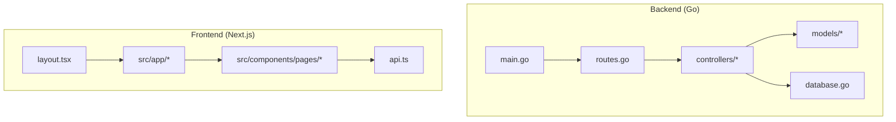
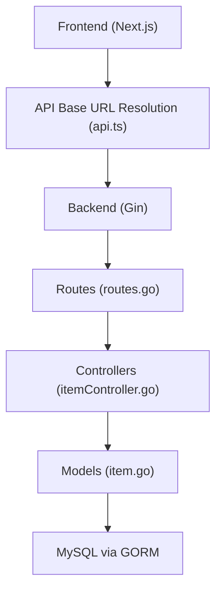
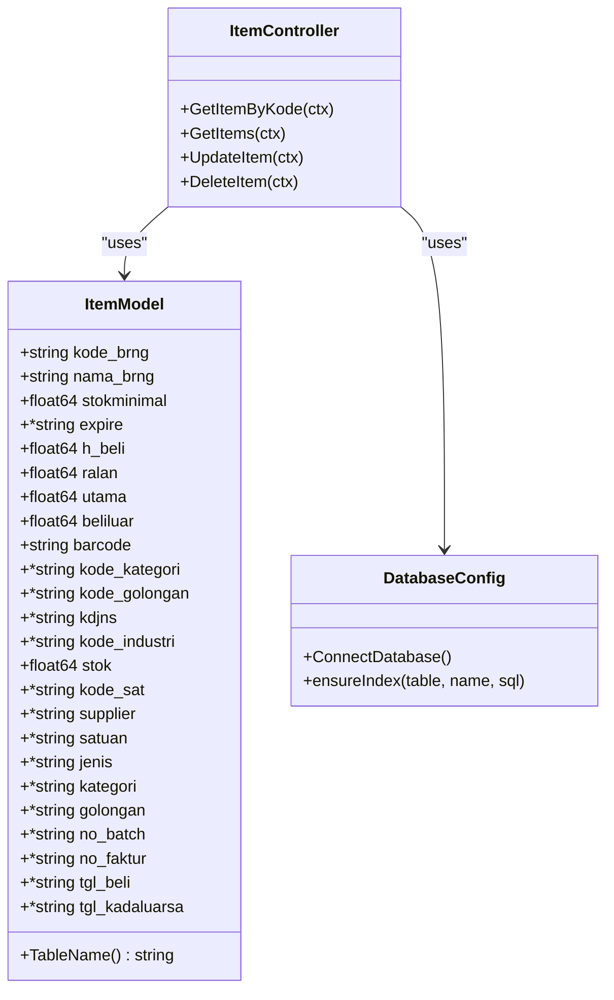
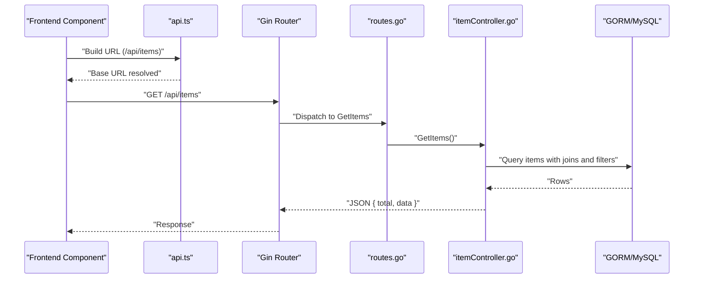
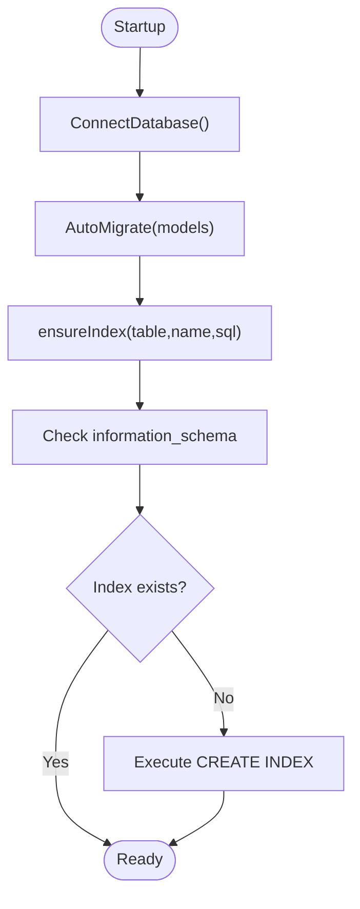
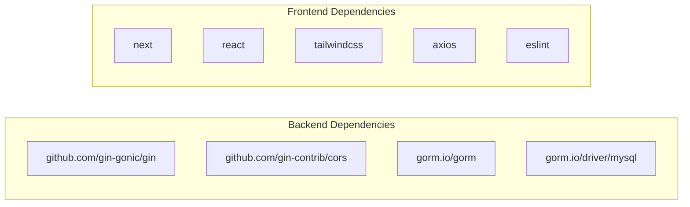

# Development Guide

<cite>
**Referenced Files in This Document**
- [backend/main.go](file://backend/main.go)
- [backend/route.go](file://backend/routes/routes.go)
- [backend/config/database.go](file://backend/config/database.go)
- [backend/controller/itemController.go](file://backend/controllers/itemController.go)
- [backend/model/item.go](file://backend/models/item.go)
- [frontend/src/app/layout.tsx](file://frontend/src/app/layout.tsx)
- [frontend/src/lib/api.ts](file://frontend/src/lib/api.ts)
- [frontend/package.json](file://frontend/package.json)
- [frontend/tsconfig.json](file://frontend/tsconfig.json)
- [frontend/eslint.config.mjs](file://frontend/eslint.config.mjs)
- [frontend/next.config.ts](file://frontend/next.config.ts)
- [backend/go.mod](file://backend/go.mod)
- [backend/.gitignore](file://backend/.gitignore)
</cite>

## Table of Contents
1. [Introduction](#introduction)
2. [Project Structure](#project-structure)
3. [Core Components](#core-components)
4. [Architecture Overview](#architecture-overview)
5. [Detailed Component Analysis](#detailed-component-analysis)
6. [Dependency Analysis](#dependency-analysis)
7. [Performance Considerations](#performance-considerations)
8. [Testing Strategies](#testing-strategies)
9. [Code Review Processes](#code-review-processes)
10. [Contribution Guidelines](#contribution-guidelines)
11. [Debugging Techniques](#debugging-techniques)
12. [Development Tools Setup](#development-tools-setup)
13. [Local Development Environment Configuration](#local-development-environment-configuration)
14. [Code Quality Standards](#code-quality-standards)
15. [Security Considerations](#security-considerations)
16. [Extending Functionality](#extending-functionality)
17. [Troubleshooting Guide](#troubleshooting-guide)
18. [Conclusion](#conclusion)

## Introduction
This development guide provides a comprehensive overview of the PPA (Ampelgading Medical Centre Inventory) system for contributors. It documents the backend and frontend architectures, the MVC pattern implementation, component organization, naming conventions, testing strategies, code review processes, contribution guidelines, debugging techniques, development tools setup, local environment configuration, code quality standards, performance optimization practices, and security considerations. The guide aims to help maintain consistency and accelerate development across the codebase.

## Project Structure
The project follows a clear separation of concerns:
- Backend: Go-based REST API using Gin, GORM, and MySQL.
- Frontend: Next.js 16 application with TypeScript, Tailwind CSS, and React 19.
- Shared configuration: Environment variables and API base URL resolution.

**Diagram sources**
- [backend/main.go:12-32](file://backend/main.go#L12-L32)
- [backend/route.go:9-35](file://backend/routes/routes.go#L9-L35)
- [backend/config/database.go:13-83](file://backend/config/database.go#L13-L83)
- [backend/controller/itemController.go:22-96](file://backend/controllers/itemController.go#L22-L96)
- [backend/model/item.go:3-28](file://backend/models/item.go#L3-L28)
- [frontend/src/app/layout.tsx:20-33](file://frontend/src/app/layout.tsx#L20-L33)
- [frontend/src/lib/api.ts:1-19](file://frontend/src/lib/api.ts#L1-L19)

**Section sources**
- [backend/main.go:12-32](file://backend/main.go#L12-L32)
- [backend/route.go:9-35](file://backend/routes/routes.go#L9-L35)
- [backend/config/database.go:13-83](file://backend/config/database.go#L13-L83)
- [frontend/src/app/layout.tsx:20-33](file://frontend/src/app/layout.tsx#L20-L33)
- [frontend/src/lib/api.ts:1-19](file://frontend/src/lib/api.ts#L1-L19)

## Core Components
- Backend entrypoint initializes CORS, connects to the database, sets up routes, performs auto-migrations, and starts the server.
- Routes map HTTP endpoints to controller handlers.
- Controllers orchestrate requests, interact with models via GORM, and return JSON responses.
- Models define data structures and table mappings for GORM.
- Frontend layout defines the root HTML structure and metadata.
- Frontend API module resolves the backend base URL from environment variables or defaults.

**Section sources**
- [backend/main.go:12-32](file://backend/main.go#L12-L32)
- [backend/route.go:9-35](file://backend/routes/routes.go#L9-L35)
- [backend/controller/itemController.go:22-96](file://backend/controllers/itemController.go#L22-L96)
- [backend/model/item.go:3-28](file://backend/models/item.go#L3-L28)
- [frontend/src/app/layout.tsx:15-33](file://frontend/src/app/layout.tsx#L15-L33)
- [frontend/src/lib/api.ts:1-19](file://frontend/src/lib/api.ts#L1-L19)

## Architecture Overview
The system follows a layered architecture:
- Presentation Layer (Frontend): Next.js app with React components and pages.
- Application Layer (Backend): Gin router and controllers.
- Data Access Layer (Backend): GORM with MySQL.
- Data Models (Backend): Structs mapped to database tables.

**Diagram sources**
- [frontend/src/lib/api.ts:1-19](file://frontend/src/lib/api.ts#L1-L19)
- [backend/main.go:12-32](file://backend/main.go#L12-L32)
- [backend/route.go:9-35](file://backend/routes/routes.go#L9-L35)
- [backend/controller/itemController.go:22-96](file://backend/controllers/itemController.go#L22-L96)
- [backend/model/item.go:3-28](file://backend/models/item.go#L3-L28)
- [backend/config/database.go:13-83](file://backend/config/database.go#L13-L83)

## Detailed Component Analysis

### Backend MVC Pattern Implementation
- Model: Defines the Item struct and table mapping for GORM.
- View: JSON responses returned by controllers.
- Controller: Handles HTTP requests, queries the database via GORM, and returns structured JSON.

**Diagram sources**
- [backend/model/item.go:3-33](file://backend/models/item.go#L3-L33)
- [backend/controller/itemController.go:22-284](file://backend/controllers/itemController.go#L22-L284)
- [backend/config/database.go:13-111](file://backend/config/database.go#L13-L111)

**Section sources**
- [backend/model/item.go:3-33](file://backend/models/item.go#L3-L33)
- [backend/controller/itemController.go:22-284](file://backend/controllers/itemController.go#L22-L284)
- [backend/config/database.go:13-111](file://backend/config/database.go#L13-L111)

### API Workflow: Fetch Items

**Diagram sources**
- [frontend/src/lib/api.ts:15-18](file://frontend/src/lib/api.ts#L15-L18)
- [backend/route.go:10-10](file://backend/routes/routes.go#L10-L10)
- [backend/controller/itemController.go:98-215](file://backend/controllers/itemController.go#L98-L215)
- [backend/config/database.go:13-83](file://backend/config/database.go#L13-L83)

**Section sources**
- [frontend/src/lib/api.ts:1-19](file://frontend/src/lib/api.ts#L1-L19)
- [backend/route.go:10-10](file://backend/routes/routes.go#L10-L10)
- [backend/controller/itemController.go:98-215](file://backend/controllers/itemController.go#L98-L215)

### Database Index Management

**Diagram sources**
- [backend/config/database.go:13-111](file://backend/config/database.go#L13-L111)

**Section sources**
- [backend/config/database.go:13-111](file://backend/config/database.go#L13-L111)

### Frontend Layout and API Base URL Resolution
- The root layout sets metadata and applies fonts.
- The API base URL is derived from environment variables or defaults to localhost with port 8080.

**Section sources**
- [frontend/src/app/layout.tsx:15-33](file://frontend/src/app/layout.tsx#L15-L33)
- [frontend/src/lib/api.ts:1-19](file://frontend/src/lib/api.ts#L1-L19)

## Dependency Analysis
- Backend dependencies include Gin, GORM, MySQL driver, and CORS middleware.
- Frontend dependencies include Next.js, React, Tailwind CSS, Axios, and ESLint.

**Diagram sources**
- [backend/go.mod:5-44](file://backend/go.mod#L5-L44)
- [frontend/package.json:11-31](file://frontend/package.json#L11-L31)

**Section sources**
- [backend/go.mod:5-44](file://backend/go.mod#L5-L44)
- [frontend/package.json:11-31](file://frontend/package.json#L11-L31)

## Performance Considerations
- Database indexing: Ensure indexes exist for frequently queried columns (e.g., expire, kode_golongan, dashboard indices).
- Query optimization: Prefer selective queries with joins and filters; avoid N+1 queries.
- Pagination: Use pagination parameters to limit result sets.
- Caching: Consider caching static master data and frequently accessed dashboards.
- Network latency: Minimize round trips by batching requests where appropriate.
- Frontend rendering: Defer heavy computations and use responsive charts efficiently.

[No sources needed since this section provides general guidance]

## Testing Strategies
- Unit tests for controllers: Mock GORM operations and assert JSON responses.
- Integration tests: Spin up a test database, seed data, and verify end-to-end flows.
- Frontend tests: Use React Testing Library to test components and API interactions.
- API contract tests: Validate route correctness and response schemas.
- Load tests: Simulate concurrent users to measure throughput and latency.

[No sources needed since this section provides general guidance]

## Code Review Processes
- Pull Request Template: Define acceptance criteria, testing requirements, and security checks.
- Linting: Enforce ESLint and Go vetting rules.
- Dependency Review: Scan for vulnerable packages.
- Security Review: Validate CORS, input sanitization, and secrets management.
- Performance Review: Benchmark critical paths and verify index usage.

[No sources needed since this section provides general guidance]

## Contribution Guidelines
- Branching: Feature branches merged via pull requests.
- Commit Messages: Clear, imperative style with issue references.
- Coding Standards: Follow Go and TypeScript style guides; use consistent naming.
- Documentation: Update README and inline comments for significant changes.
- Environment Variables: Never commit secrets; use .gitignore entries.

**Section sources**
- [backend/.gitignore:1-3](file://backend/.gitignore#L1-L3)

## Debugging Techniques
- Backend: Enable Gin logging, inspect SQL queries, and log errors.
- Frontend: Use browser devtools, network tab, and React DevTools.
- Database: Verify indexes, check slow queries, and monitor connections.
- Environment: Confirm API base URL resolution and CORS configuration.

[No sources needed since this section provides general guidance]

## Development Tools Setup
- Backend: Install Go, MySQL, and IDE with Go extensions.
- Frontend: Install Node.js, pnpm/yarn/npm, and VS Code with recommended extensions.
- Linting: Configure ESLint and TypeScript strict mode.
- Formatting: Use Prettier and editorconfig for consistency.

**Section sources**
- [frontend/package.json:5-10](file://frontend/package.json#L5-L10)
- [frontend/eslint.config.mjs:1-19](file://frontend/eslint.config.mjs#L1-L19)
- [frontend/tsconfig.json:7-24](file://frontend/tsconfig.json#L7-L24)

## Local Development Environment Configuration
- Backend:
  - Set up MySQL and configure credentials.
  - Run migrations and ensure indexes are created.
  - Start the server on port 8080.
- Frontend:
  - Configure NEXT_PUBLIC_API_PORT and NEXT_PUBLIC_API_URL.
  - Start the Next.js dev server.
- CORS:
  - Default CORS is enabled; adjust origins as needed.

**Section sources**
- [backend/main.go:12-32](file://backend/main.go#L12-L32)
- [backend/config/database.go:13-83](file://backend/config/database.go#L13-L83)
- [frontend/src/lib/api.ts:1-19](file://frontend/src/lib/api.ts#L1-L19)

## Code Quality Standards
- Naming Conventions:
  - Go: CamelCase for exported identifiers; lowercase for unexported.
  - TypeScript: PascalCase for components; camelCase for variables and functions.
- File Organization:
  - Group related files by feature or layer.
  - Keep controllers thin; delegate business logic to services if introduced.
- Comments and Documentation:
  - Document exported functions and structs.
  - Add TODOs for future improvements.
- Error Handling:
  - Propagate errors with context; avoid empty catch blocks.
  - Return structured JSON errors with appropriate HTTP status codes.

[No sources needed since this section provides general guidance]

## Security Considerations
- Secrets Management: Store database credentials and API keys in environment variables; exclude from version control.
- Input Validation: Sanitize and validate all inputs; use parameterized queries.
- CORS: Restrict origins and methods; avoid wildcard configurations.
- Authentication and Authorization: Implement middleware for protected routes.
- Dependency Updates: Regularly update dependencies to address vulnerabilities.

[No sources needed since this section provides general guidance]

## Extending Functionality
- Adding a New Endpoint:
  - Define route in routes.go.
  - Implement handler in a controller.
  - Add model if needed; ensure GORM tags and TableName.
  - Write tests for the new endpoint.
- Frontend Pages:
  - Create a new page under src/app/<feature>.
  - Build reusable components under src/components/pages.
  - Integrate with API using api.ts helpers.
- Database Changes:
  - Add or modify models; run auto-migrations.
  - Ensure indexes for new query patterns.
- UI Components:
  - Place shared components under src/components/ui.
  - Use Tailwind classes and maintain design consistency.

[No sources needed since this section provides general guidance]

## Troubleshooting Guide
- Backend startup fails:
  - Verify MySQL connectivity and credentials.
  - Check for migration errors and missing indexes.
- Frontend cannot connect to backend:
  - Confirm NEXT_PUBLIC_API_PORT and NEXT_PUBLIC_API_URL.
  - Ensure CORS allows the frontend origin.
- Slow queries:
  - Review query plans and add missing indexes.
  - Optimize joins and filters.
- Type errors in frontend:
  - Enable strict TypeScript and fix type mismatches.
  - Align API response shapes with TypeScript interfaces.

**Section sources**
- [backend/config/database.go:13-111](file://backend/config/database.go#L13-L111)
- [frontend/src/lib/api.ts:1-19](file://frontend/src/lib/api.ts#L1-L19)
- [frontend/tsconfig.json:7-24](file://frontend/tsconfig.json#L7-L24)

## Conclusion
This guide outlines the PPA system’s architecture, development workflows, and best practices for contributors. By adhering to the documented standards, leveraging the provided tools, and following the outlined processes, contributors can develop features efficiently while maintaining code quality, performance, and security.