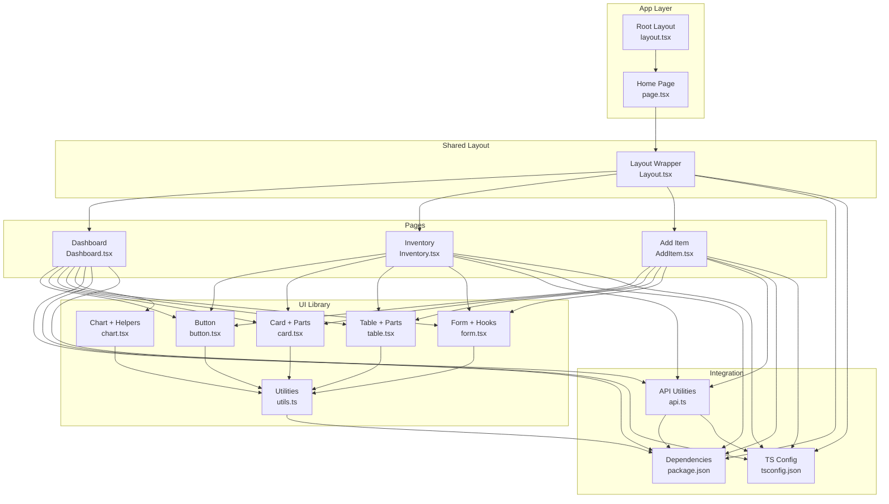
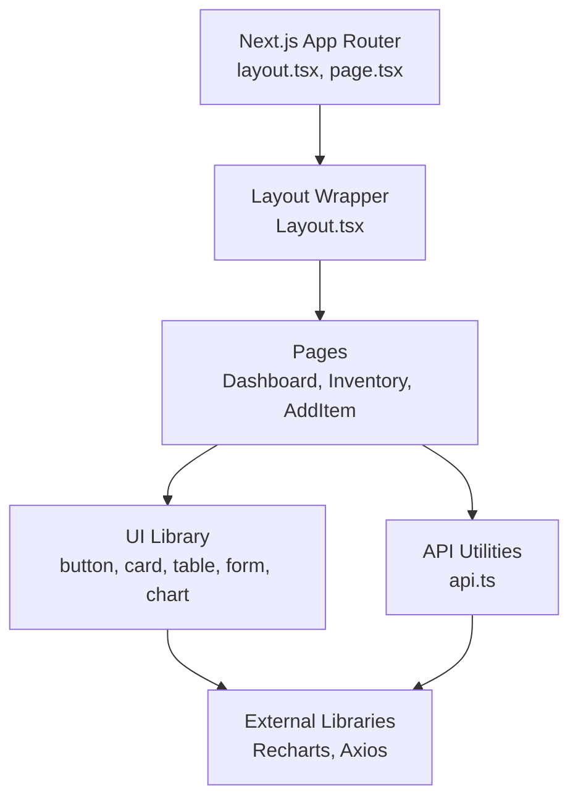
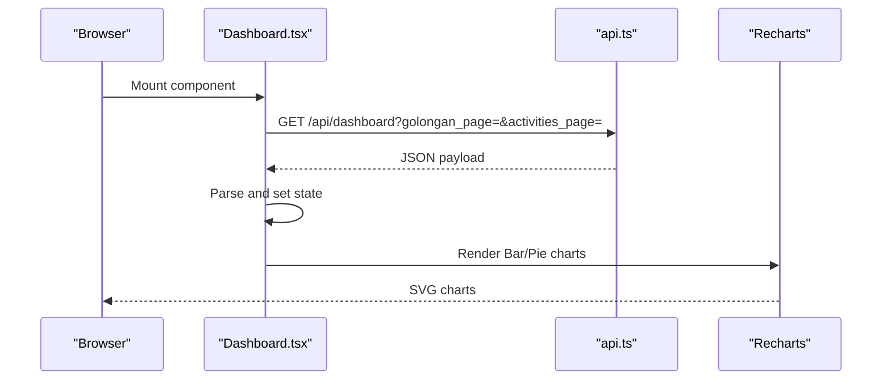
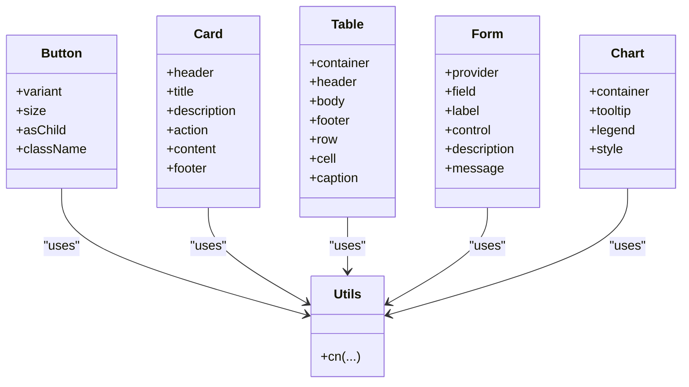
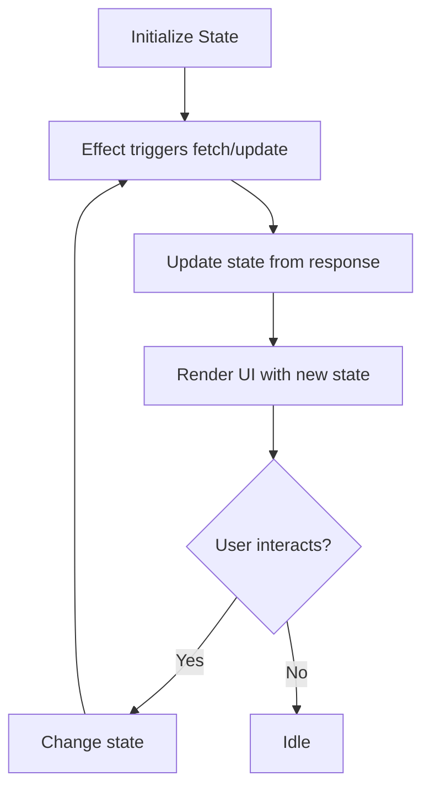
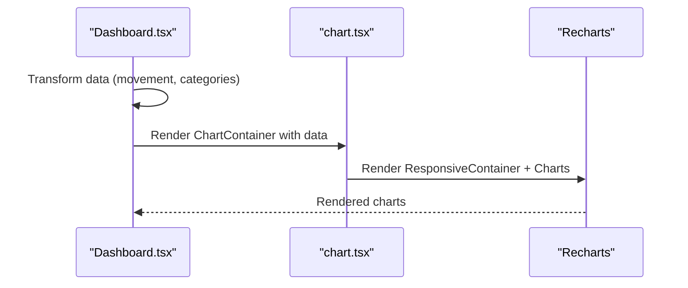
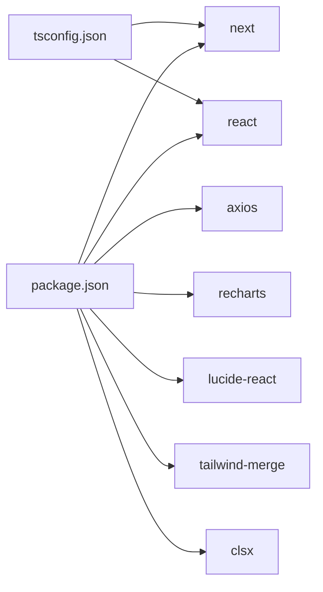

# Component System & Organization

<cite>
**Referenced Files in This Document**
- [layout.tsx](file://frontend/src/app/layout.tsx)
- [page.tsx](file://frontend/src/app/page.tsx)
- [Layout.tsx](file://frontend/src/components/Layout.tsx)
- [button.tsx](file://frontend/src/components/ui/button.tsx)
- [card.tsx](file://frontend/src/components/ui/card.tsx)
- [table.tsx](file://frontend/src/components/ui/table.tsx)
- [form.tsx](file://frontend/src/components/ui/form.tsx)
- [chart.tsx](file://frontend/src/components/ui/chart.tsx)
- [utils.ts](file://frontend/src/components/ui/utils.ts)
- [Dashboard.tsx](file://frontend/src/components/pages/Dashboard.tsx)
- [Inventory.tsx](file://frontend/src/components/pages/Inventory.tsx)
- [AddItem.tsx](file://frontend/src/components/pages/AddItem.tsx)
- [api.ts](file://frontend/src/lib/api.ts)
- [package.json](file://frontend/package.json)
- [tsconfig.json](file://frontend/tsconfig.json)
</cite>

## Table of Contents
1. [Introduction](#introduction)
2. [Project Structure](#project-structure)
3. [Core Components](#core-components)
4. [Architecture Overview](#architecture-overview)
5. [Detailed Component Analysis](#detailed-component-analysis)
6. [Dependency Analysis](#dependency-analysis)
7. [Performance Considerations](#performance-considerations)
8. [Troubleshooting Guide](#troubleshooting-guide)
9. [Conclusion](#conclusion)

## Introduction
This document describes the PPA frontend component system built with Next.js and TypeScript. It explains the component hierarchy, page-based organization, and the reusable UI component library. It also covers component composition patterns, prop interfaces, state management, layout structure, page-level components, design system approach, customization options, and integration with external libraries such as Recharts.

## Project Structure
The frontend follows a Next.js App Router structure with a clear separation between:
- App-level routing and layout: [layout.tsx](file://frontend/src/app/layout.tsx), [page.tsx](file://frontend/src/app/page.tsx)
- Shared layout wrapper: [Layout.tsx](file://frontend/src/components/Layout.tsx)
- Reusable UI components: [button.tsx](file://frontend/src/components/ui/button.tsx), [card.tsx](file://frontend/src/components/ui/card.tsx), [table.tsx](file://frontend/src/components/ui/table.tsx), [form.tsx](file://frontend/src/components/ui/form.tsx), [chart.tsx](file://frontend/src/components/ui/chart.tsx), [utils.ts](file://frontend/src/components/ui/utils.ts)
- Page-level components: [Dashboard.tsx](file://frontend/src/components/pages/Dashboard.tsx), [Inventory.tsx](file://frontend/src/components/pages/Inventory.tsx), [AddItem.tsx](file://frontend/src/components/pages/AddItem.tsx)
- API utilities: [api.ts](file://frontend/src/lib/api.ts)
- Dependencies and configuration: [package.json](file://frontend/package.json), [tsconfig.json](file://frontend/tsconfig.json)

**Diagram sources**
- [layout.tsx:1-34](file://frontend/src/app/layout.tsx#L1-L34)
- [page.tsx:1-12](file://frontend/src/app/page.tsx#L1-L12)
- [Layout.tsx:1-161](file://frontend/src/components/Layout.tsx#L1-L161)
- [button.tsx:1-59](file://frontend/src/components/ui/button.tsx#L1-L59)
- [card.tsx:1-93](file://frontend/src/components/ui/card.tsx#L1-L93)
- [table.tsx:1-117](file://frontend/src/components/ui/table.tsx#L1-L117)
- [form.tsx:1-169](file://frontend/src/components/ui/form.tsx#L1-L169)
- [chart.tsx:1-354](file://frontend/src/components/ui/chart.tsx#L1-L354)
- [utils.ts:1-7](file://frontend/src/components/ui/utils.ts#L1-L7)
- [Dashboard.tsx:1-668](file://frontend/src/components/pages/Dashboard.tsx#L1-L668)
- [Inventory.tsx:1-606](file://frontend/src/components/pages/Inventory.tsx#L1-L606)
- [AddItem.tsx:1-708](file://frontend/src/components/pages/AddItem.tsx#L1-L708)
- [api.ts:1-19](file://frontend/src/lib/api.ts#L1-L19)
- [package.json:1-33](file://frontend/package.json#L1-L33)
- [tsconfig.json:1-35](file://frontend/tsconfig.json#L1-L35)

**Section sources**
- [layout.tsx:1-34](file://frontend/src/app/layout.tsx#L1-L34)
- [page.tsx:1-12](file://frontend/src/app/page.tsx#L1-L12)
- [Layout.tsx:1-161](file://frontend/src/components/Layout.tsx#L1-L161)
- [button.tsx:1-59](file://frontend/src/components/ui/button.tsx#L1-L59)
- [card.tsx:1-93](file://frontend/src/components/ui/card.tsx#L1-L93)
- [table.tsx:1-117](file://frontend/src/components/ui/table.tsx#L1-L117)
- [form.tsx:1-169](file://frontend/src/components/ui/form.tsx#L1-L169)
- [chart.tsx:1-354](file://frontend/src/components/ui/chart.tsx#L1-L354)
- [utils.ts:1-7](file://frontend/src/components/ui/utils.ts#L1-L7)
- [Dashboard.tsx:1-668](file://frontend/src/components/pages/Dashboard.tsx#L1-L668)
- [Inventory.tsx:1-606](file://frontend/src/components/pages/Inventory.tsx#L1-L606)
- [AddItem.tsx:1-708](file://frontend/src/components/pages/AddItem.tsx#L1-L708)
- [api.ts:1-19](file://frontend/src/lib/api.ts#L1-L19)
- [package.json:1-33](file://frontend/package.json#L1-L33)
- [tsconfig.json:1-35](file://frontend/tsconfig.json#L1-L35)

## Core Components
This section outlines the foundational building blocks of the UI library and their roles.

- Design system utilities
  - Utility class merging: [utils.ts:1-7](file://frontend/src/components/ui/utils.ts#L1-L7) provides a composable class names utility used across UI components.
- Primitive UI components
  - Button: [button.tsx:1-59](file://frontend/src/components/ui/button.tsx#L1-L59) defines variants and sizes via a variant system and supports radix slot composition.
  - Card: [card.tsx:1-93](file://frontend/src/components/ui/card.tsx#L1-L93) exposes a semantic grouping of content with header, title, description, action, content, and footer parts.
  - Table: [table.tsx:1-117](file://frontend/src/components/ui/table.tsx#L1-L117) provides container and cell parts for tabular data rendering.
  - Form: [form.tsx:1-169](file://frontend/src/components/ui/form.tsx#L1-L169) integrates react-hook-form with accessible labeling and validation messaging.
  - Chart: [chart.tsx:1-354](file://frontend/src/components/ui/chart.tsx#L1-L354) wraps Recharts primitives with theming and configuration support.
- Page-level components
  - Dashboard: [Dashboard.tsx:1-668](file://frontend/src/components/pages/Dashboard.tsx#L1-L668) orchestrates charts, summaries, and paginated lists.
  - Inventory: [Inventory.tsx:1-606](file://frontend/src/components/pages/Inventory.tsx#L1-L606) manages filtering, pagination, and CRUD actions.
  - Add Item: [AddItem.tsx:1-708](file://frontend/src/components/pages/AddItem.tsx#L1-L708) handles master data-driven forms and pricing calculations.
- Shared layout
  - Layout wrapper: [Layout.tsx:1-161](file://frontend/src/components/Layout.tsx#L1-L161) renders navigation, mobile menu, and content area.

**Section sources**
- [utils.ts:1-7](file://frontend/src/components/ui/utils.ts#L1-L7)
- [button.tsx:1-59](file://frontend/src/components/ui/button.tsx#L1-L59)
- [card.tsx:1-93](file://frontend/src/components/ui/card.tsx#L1-L93)
- [table.tsx:1-117](file://frontend/src/components/ui/table.tsx#L1-L117)
- [form.tsx:1-169](file://frontend/src/components/ui/form.tsx#L1-L169)
- [chart.tsx:1-354](file://frontend/src/components/ui/chart.tsx#L1-L354)
- [Dashboard.tsx:1-668](file://frontend/src/components/pages/Dashboard.tsx#L1-L668)
- [Inventory.tsx:1-606](file://frontend/src/components/pages/Inventory.tsx#L1-L606)
- [AddItem.tsx:1-708](file://frontend/src/components/pages/AddItem.tsx#L1-L708)
- [Layout.tsx:1-161](file://frontend/src/components/Layout.tsx#L1-L161)

## Architecture Overview
The system follows a layered architecture:
- App layer: Next.js App Router sets up global metadata and root layout.
- Shared layout: A client-side layout wrapper injects navigation and content area.
- UI library: Composable, theme-aware components with consistent APIs.
- Pages: Feature-specific components that orchestrate data fetching, state, and UI composition.
- Integration: API utilities centralize base URL resolution and endpoint construction.

**Diagram sources**
- [layout.tsx:1-34](file://frontend/src/app/layout.tsx#L1-L34)
- [page.tsx:1-12](file://frontend/src/app/page.tsx#L1-L12)
- [Layout.tsx:1-161](file://frontend/src/components/Layout.tsx#L1-L161)
- [button.tsx:1-59](file://frontend/src/components/ui/button.tsx#L1-L59)
- [card.tsx:1-93](file://frontend/src/components/ui/card.tsx#L1-L93)
- [table.tsx:1-117](file://frontend/src/components/ui/table.tsx#L1-L117)
- [form.tsx:1-169](file://frontend/src/components/ui/form.tsx#L1-L169)
- [chart.tsx:1-354](file://frontend/src/components/ui/chart.tsx#L1-L354)
- [Dashboard.tsx:1-668](file://frontend/src/components/pages/Dashboard.tsx#L1-L668)
- [Inventory.tsx:1-606](file://frontend/src/components/pages/Inventory.tsx#L1-L606)
- [AddItem.tsx:1-708](file://frontend/src/components/pages/AddItem.tsx#L1-L708)
- [api.ts:1-19](file://frontend/src/lib/api.ts#L1-L19)
- [package.json:1-33](file://frontend/package.json#L1-L33)

## Detailed Component Analysis

### Layout Component Structure
The shared layout provides responsive navigation and content area:
- Desktop sidebar with active-state highlighting based on pathname.
- Mobile hamburger menu with backdrop and close affordance.
- Content area that receives page children.

**Diagram sources**
- [Layout.tsx:19-161](file://frontend/src/components/Layout.tsx#L19-L161)

**Section sources**
- [Layout.tsx:1-161](file://frontend/src/components/Layout.tsx#L1-L161)

### Page-Level Components Organization
- Dashboard
  - Fetches summary, distribution, movement, and recent activity data.
  - Renders KPI cards, stacked bar chart, pie chart, and paginated activity list.
  - Integrates Recharts for visualization and Tailwind for styling.
- Inventory
  - Loads items and master data (categories, types).
  - Implements search, category/type filters, and pagination.
  - Supports delete confirmation modal and toast-like messages.
- Add Item
  - Drives master data selection and form state.
  - Computes margins based on purchase price.
  - Submits to API and resets form on success.

**Diagram sources**
- [Dashboard.tsx:173-214](file://frontend/src/components/pages/Dashboard.tsx#L173-L214)
- [api.ts:15-18](file://frontend/src/lib/api.ts#L15-L18)

**Section sources**
- [Dashboard.tsx:1-668](file://frontend/src/components/pages/Dashboard.tsx#L1-L668)
- [Inventory.tsx:1-606](file://frontend/src/components/pages/Inventory.tsx#L1-L606)
- [AddItem.tsx:1-708](file://frontend/src/components/pages/AddItem.tsx#L1-L708)
- [api.ts:1-19](file://frontend/src/lib/api.ts#L1-L19)

### UI Component Library Implementation
- Button
  - Variants: default, destructive, outline, secondary, ghost, link.
  - Sizes: default, sm, lg, icon.
  - Uses slot composition for semantic tag rendering.
- Card
  - Semantic parts: header, title, description, action, content, footer.
  - Data attributes for styling hooks.
- Table
  - Container and parts for table, header, body, footer, rows, cells, caption.
- Form
  - Integrates react-hook-form with accessible labels and validation messages.
- Chart
  - Provides container, tooltip, legend, and theming helpers for Recharts.

**Diagram sources**
- [button.tsx:37-56](file://frontend/src/components/ui/button.tsx#L37-L56)
- [card.tsx:5-92](file://frontend/src/components/ui/card.tsx#L5-L92)
- [table.tsx:7-116](file://frontend/src/components/ui/table.tsx#L7-L116)
- [form.tsx:19-168](file://frontend/src/components/ui/form.tsx#L19-L168)
- [chart.tsx:37-70](file://frontend/src/components/ui/chart.tsx#L37-L70)
- [utils.ts:4-6](file://frontend/src/components/ui/utils.ts#L4-L6)

**Section sources**
- [button.tsx:1-59](file://frontend/src/components/ui/button.tsx#L1-L59)
- [card.tsx:1-93](file://frontend/src/components/ui/card.tsx#L1-L93)
- [table.tsx:1-117](file://frontend/src/components/ui/table.tsx#L1-L117)
- [form.tsx:1-169](file://frontend/src/components/ui/form.tsx#L1-L169)
- [chart.tsx:1-354](file://frontend/src/components/ui/chart.tsx#L1-L354)
- [utils.ts:1-7](file://frontend/src/components/ui/utils.ts#L1-L7)

### Component Composition Patterns
- Prop interfaces
  - Props are typed explicitly for each component (e.g., Button props, Card parts props).
- Composition
  - Button supports asChild to render different underlying elements.
  - Card exposes parts to compose headers, actions, and content.
  - Table provides container and parts for flexible markup.
  - Form integrates with react-hook-form for controlled inputs and validation.
- Theming and styling
  - Utilities merge classes consistently.
  - Chart theming adapts to light/dark modes via CSS variables.

**Section sources**
- [button.tsx:37-56](file://frontend/src/components/ui/button.tsx#L37-L56)
- [card.tsx:18-92](file://frontend/src/components/ui/card.tsx#L18-L92)
- [table.tsx:22-116](file://frontend/src/components/ui/table.tsx#L22-L116)
- [form.tsx:21-168](file://frontend/src/components/ui/form.tsx#L21-L168)
- [chart.tsx:8-103](file://frontend/src/components/ui/chart.tsx#L8-L103)
- [utils.ts:4-6](file://frontend/src/components/ui/utils.ts#L4-L6)

### State Management Within Components
- Dashboard
  - Manages summary, distribution, movement, recent activities, pagination, and loading/error states.
  - Uses effect to fetch data when pagination changes.
- Inventory
  - Tracks items, filters, page, and messages.
  - Uses effect to load items and master data on mount.
- Add Item
  - Maintains form state, computed margins, and submission feedback.
  - Resets form after successful submission.

**Diagram sources**
- [Dashboard.tsx:173-214](file://frontend/src/components/pages/Dashboard.tsx#L173-L214)
- [Inventory.tsx:77-132](file://frontend/src/components/pages/Inventory.tsx#L77-L132)
- [AddItem.tsx:101-117](file://frontend/src/components/pages/AddItem.tsx#L101-L117)

**Section sources**
- [Dashboard.tsx:157-214](file://frontend/src/components/pages/Dashboard.tsx#L157-L214)
- [Inventory.tsx:62-132](file://frontend/src/components/pages/Inventory.tsx#L62-L132)
- [AddItem.tsx:17-117](file://frontend/src/components/pages/AddItem.tsx#L17-L117)

### Event Handling Patterns
- Navigation
  - Layout toggles mobile menu and highlights active nav items based on pathname.
- Forms
  - Controlled inputs update state; submit validates and posts to API.
- Lists and Modals
  - Click handlers trigger state updates for delete confirmations and pagination.

**Section sources**
- [Layout.tsx:24-161](file://frontend/src/components/Layout.tsx#L24-L161)
- [Inventory.tsx:134-161](file://frontend/src/components/pages/Inventory.tsx#L134-L161)
- [AddItem.tsx:119-224](file://frontend/src/components/pages/AddItem.tsx#L119-L224)

### Component Communication Strategies
- Parent-to-child
  - Layout passes children to page components; pages receive props from effects and state.
- Child-to-parent
  - Buttons and links trigger state changes; modals close by updating parent state.
- Cross-component coordination
  - API utilities centralize endpoint construction; UI components remain presentation-focused.

**Section sources**
- [Layout.tsx:19-161](file://frontend/src/components/Layout.tsx#L19-L161)
- [Inventory.tsx:474-524](file://frontend/src/components/pages/Inventory.tsx#L474-L524)
- [api.ts:15-18](file://frontend/src/lib/api.ts#L15-L18)

### Design System Approach and Customization
- Consistent tokens
  - Variants and sizes unify visual language across components.
- Theming
  - Chart theming adapts to light/dark modes via CSS variables.
- Accessibility
  - Form components integrate with react-hook-form for labeling and validation.
- Extensibility
  - Slot-based components allow rendering different underlying elements.
  - Utilities enable composing complex class names.

**Section sources**
- [button.tsx:7-35](file://frontend/src/components/ui/button.tsx#L7-L35)
- [chart.tsx:8-103](file://frontend/src/components/ui/chart.tsx#L8-L103)
- [form.tsx:90-157](file://frontend/src/components/ui/form.tsx#L90-L157)
- [utils.ts:4-6](file://frontend/src/components/ui/utils.ts#L4-L6)

### Integration Patterns with External Libraries (Recharts)
- Dashboard integrates Recharts primitives for bar and pie charts.
- Chart component wraps Recharts with a container, tooltip, legend, and theming.
- Data transformations occur in components prior to rendering charts.

**Diagram sources**
- [Dashboard.tsx:216-233](file://frontend/src/components/pages/Dashboard.tsx#L216-L233)
- [chart.tsx:37-70](file://frontend/src/components/ui/chart.tsx#L37-L70)

**Section sources**
- [Dashboard.tsx:474-516](file://frontend/src/components/pages/Dashboard.tsx#L474-L516)
- [chart.tsx:1-354](file://frontend/src/components/ui/chart.tsx#L1-L354)

## Dependency Analysis
- Runtime dependencies
  - Next.js, React, Tailwind utilities, Recharts, Lucide icons, Axios.
- Build-time dependencies
  - TypeScript, ESLint, Tailwind PostCSS plugin.
- Path aliases
  - TypeScript path mapping resolves @/* to src/.

**Diagram sources**
- [package.json:11-21](file://frontend/package.json#L11-L21)
- [tsconfig.json:21-23](file://frontend/tsconfig.json#L21-L23)

**Section sources**
- [package.json:1-33](file://frontend/package.json#L1-L33)
- [tsconfig.json:1-35](file://frontend/tsconfig.json#L1-L35)

## Performance Considerations
- Client-side hydration
  - Layout and pages use client directives to enable interactivity.
- Rendering optimization
  - Prefer memoization for derived data (e.g., transformed chart data).
  - Virtualize large tables if pagination becomes heavy.
- Network efficiency
  - Centralize API URLs and reuse base URL logic.
- Bundle size
  - Keep UI components small and avoid unnecessary re-renders.

## Troubleshooting Guide
- API connectivity
  - Verify base URL resolution and endpoint construction in [api.ts:1-19](file://frontend/src/lib/api.ts#L1-L19).
- Form validation
  - Ensure required fields are present before submission in [AddItem.tsx:119-143](file://frontend/src/components/pages/AddItem.tsx#L119-L143).
- Pagination and filters
  - Confirm state updates reset page index and that filtered datasets compute totals correctly in [Inventory.tsx:201-233](file://frontend/src/components/pages/Inventory.tsx#L201-L233).
- Chart rendering
  - Ensure data arrays are non-empty before rendering charts in [Dashboard.tsx:474-522](file://frontend/src/components/pages/Dashboard.tsx#L474-L522).

**Section sources**
- [api.ts:1-19](file://frontend/src/lib/api.ts#L1-L19)
- [AddItem.tsx:119-143](file://frontend/src/components/pages/AddItem.tsx#L119-L143)
- [Inventory.tsx:201-233](file://frontend/src/components/pages/Inventory.tsx#L201-L233)
- [Dashboard.tsx:474-522](file://frontend/src/components/pages/Dashboard.tsx#L474-L522)

## Conclusion
The PPA frontend employs a structured, component-driven architecture with a strong emphasis on composability, theming, and integration with external libraries. The shared layout, robust UI library, and page-level components collectively deliver a scalable and maintainable system. By leveraging TypeScript, React patterns, and centralized utilities, the system balances flexibility and consistency across features such as dashboards, inventory management, and item creation.