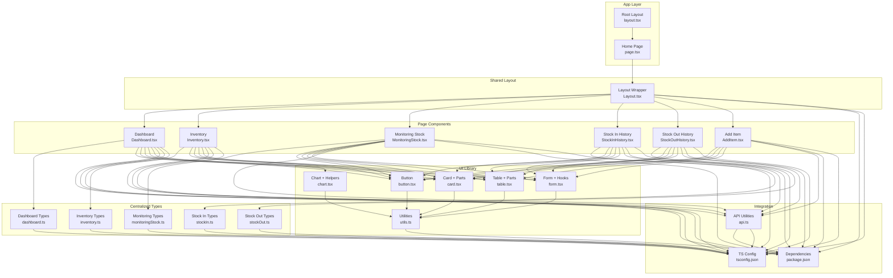
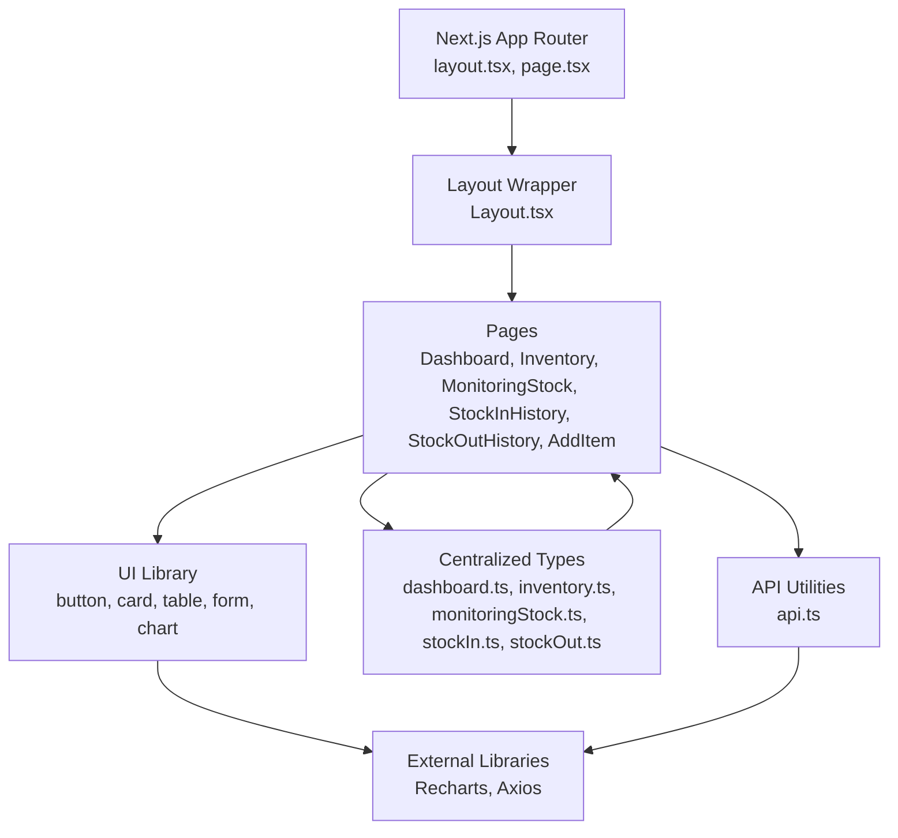
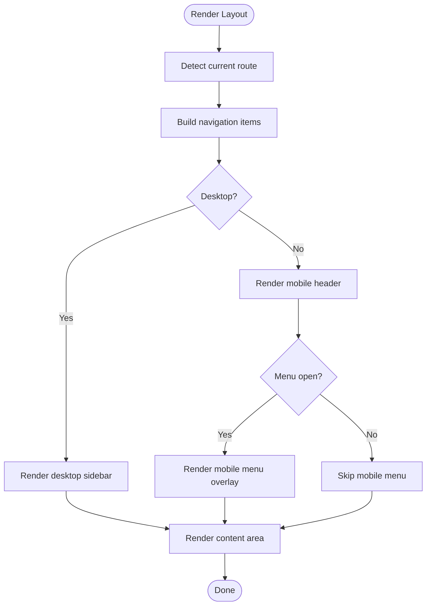
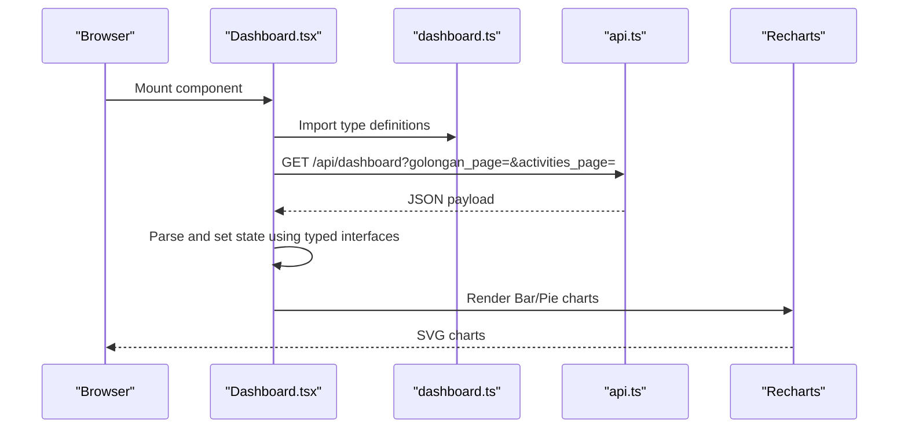
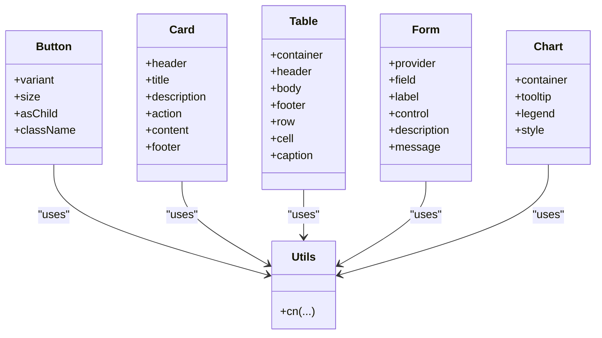
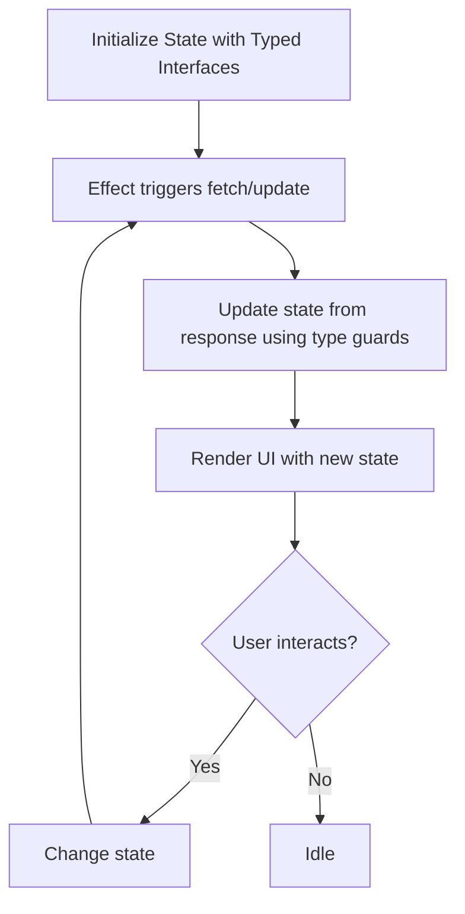
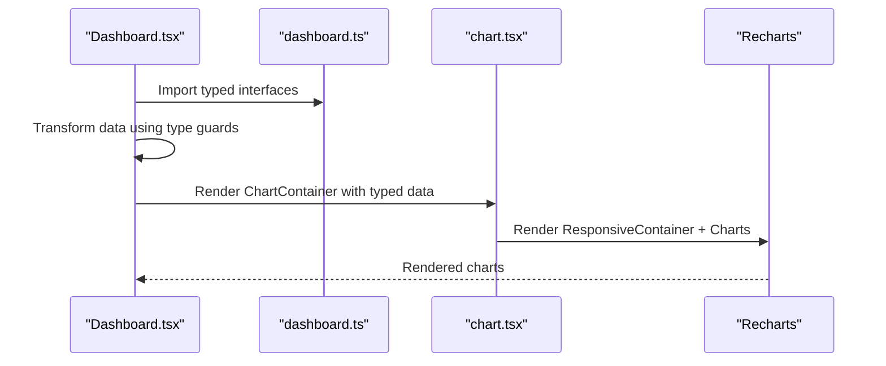
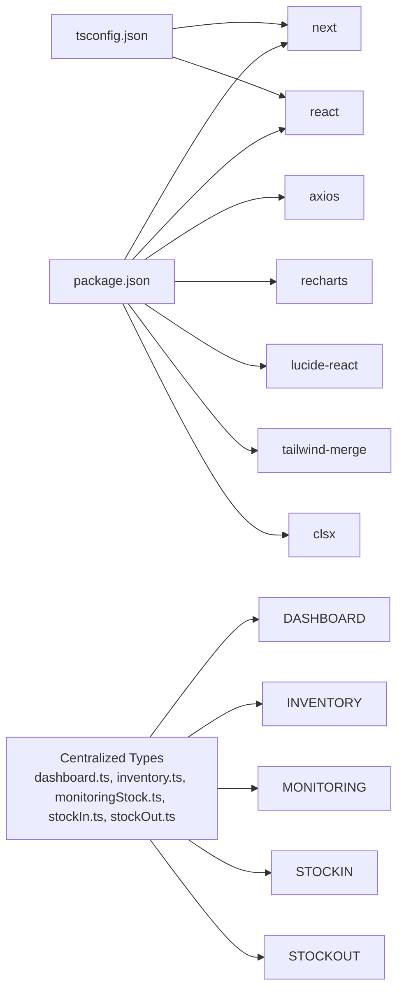

# Component System & Organization

<cite>
**Referenced Files in This Document**
- [layout.tsx](file://frontend/src/app/layout.tsx)
- [page.tsx](file://frontend/src/app/page.tsx)
- [Layout.tsx](file://frontend/src/components/Layout.tsx)
- [button.tsx](file://frontend/src/components/ui/button.tsx)
- [card.tsx](file://frontend/src/components/ui/card.tsx)
- [table.tsx](file://frontend/src/components/ui/table.tsx)
- [form.tsx](file://frontend/src/components/ui/form.tsx)
- [chart.tsx](file://frontend/src/components/ui/chart.tsx)
- [utils.ts](file://frontend/src/components/ui/utils.ts)
- [Dashboard.tsx](file://frontend/src/components/pages/Dashboard.tsx)
- [Inventory.tsx](file://frontend/src/components/pages/Inventory.tsx)
- [MonitoringStock.tsx](file://frontend/src/components/pages/MonitoringStock.tsx)
- [StockInHistory.tsx](file://frontend/src/components/pages/StockInHistory.tsx)
- [StockOutHistory.tsx](file://frontend/src/components/pages/StockOutHistory.tsx)
- [AddItem.tsx](file://frontend/src/components/pages/AddItem.tsx)
- [api.ts](file://frontend/src/lib/api.ts)
- [package.json](file://frontend/package.json)
- [tsconfig.json](file://frontend/tsconfig.json)
- [dashboard.ts](file://frontend/src/types/dashboard.ts)
- [inventory.ts](file://frontend/src/types/inventory.ts)
- [monitoringStock.ts](file://frontend/src/types/monitoringStock.ts)
- [stockIn.ts](file://frontend/src/types/stockIn.ts)
- [stockOut.ts](file://frontend/src/types/stockOut.ts)
</cite>

## Update Summary
**Changes Made**
- Added comprehensive documentation for centralized TypeScript type system
- Updated component analysis to reflect imported type definitions from dedicated files
- Enhanced type safety documentation for page-level components
- Added type system architecture overview
- Updated dependency analysis to include centralized type files

## Table of Contents
1. [Introduction](#introduction)
2. [Project Structure](#project-structure)
3. [Core Components](#core-components)
4. [Architecture Overview](#architecture-overview)
5. [Centralized Type System](#centralized-type-system)
6. [Detailed Component Analysis](#detailed-component-analysis)
7. [Dependency Analysis](#dependency-analysis)
8. [Performance Considerations](#performance-considerations)
9. [Troubleshooting Guide](#troubleshooting-guide)
10. [Conclusion](#conclusion)

## Introduction
This document describes the PPA frontend component system built with Next.js and TypeScript. It explains the component hierarchy, page-based organization, and the reusable UI component library. The system has been enhanced with a centralized type definition architecture that improves maintainability and type safety across components. It also covers component composition patterns, prop interfaces, state management, layout structure, page-level components, design system approach, customization options, and integration with external libraries such as Recharts.

## Project Structure
The frontend follows a Next.js App Router structure with a clear separation between:
- App-level routing and layout: [layout.tsx](file://frontend/src/app/layout.tsx), [page.tsx](file://frontend/src/app/page.tsx)
- Shared layout wrapper: [Layout.tsx](file://frontend/src/components/Layout.tsx)
- Reusable UI components: [button.tsx](file://frontend/src/components/ui/button.tsx), [card.tsx](file://frontend/src/components/ui/card.tsx), [table.tsx](file://frontend/src/components/ui/table.tsx), [form.tsx](file://frontend/src/components/ui/form.tsx), [chart.tsx](file://frontend/src/components/ui/chart.tsx), [utils.ts](file://frontend/src/components/ui/utils.ts)
- Page-level components with centralized type imports: [Dashboard.tsx](file://frontend/src/components/pages/Dashboard.tsx), [Inventory.tsx](file://frontend/src/components/pages/Inventory.tsx), [MonitoringStock.tsx](file://frontend/src/components/pages/MonitoringStock.tsx), [StockInHistory.tsx](file://frontend/src/components/pages/StockInHistory.tsx), [StockOutHistory.tsx](file://frontend/src/components/pages/StockOutHistory.tsx), [AddItem.tsx](file://frontend/src/components/pages/AddItem.tsx)
- Centralized type definitions: [dashboard.ts](file://frontend/src/types/dashboard.ts), [inventory.ts](file://frontend/src/types/inventory.ts), [monitoringStock.ts](file://frontend/src/types/monitoringStock.ts), [stockIn.ts](file://frontend/src/types/stockIn.ts), [stockOut.ts](file://frontend/src/types/stockOut.ts)
- API utilities: [api.ts](file://frontend/src/lib/api.ts)
- Dependencies and configuration: [package.json](file://frontend/package.json), [tsconfig.json](file://frontend/tsconfig.json)



**Diagram sources**
- [layout.tsx:1-34](file://frontend/src/app/layout.tsx#L1-L34)
- [page.tsx:1-12](file://frontend/src/app/page.tsx#L1-L12)
- [Layout.tsx:1-161](file://frontend/src/components/Layout.tsx#L1-L161)
- [button.tsx:1-59](file://frontend/src/components/ui/button.tsx#L1-L59)
- [card.tsx:1-93](file://frontend/src/components/ui/card.tsx#L1-L93)
- [table.tsx:1-117](file://frontend/src/components/ui/table.tsx#L1-L117)
- [form.tsx:1-169](file://frontend/src/components/ui/form.tsx#L1-L169)
- [chart.tsx:1-354](file://frontend/src/components/ui/chart.tsx#L1-L354)
- [utils.ts:1-7](file://frontend/src/components/ui/utils.ts#L1-L7)
- [Dashboard.tsx:1-618](file://frontend/src/components/pages/Dashboard.tsx#L1-L618)
- [Inventory.tsx:1-571](file://frontend/src/components/pages/Inventory.tsx#L1-L571)
- [MonitoringStock.tsx:1-859](file://frontend/src/components/pages/MonitoringStock.tsx#L1-L859)
- [StockInHistory.tsx:1-379](file://frontend/src/components/pages/StockInHistory.tsx#L1-L379)
- [StockOutHistory.tsx:1-373](file://frontend/src/components/pages/StockOutHistory.tsx#L1-L373)
- [AddItem.tsx:1-708](file://frontend/src/components/pages/AddItem.tsx#L1-L708)
- [api.ts:1-19](file://frontend/src/lib/api.ts#L1-L19)
- [package.json:1-33](file://frontend/package.json#L1-L33)
- [tsconfig.json:1-35](file://frontend/tsconfig.json#L1-L35)
- [dashboard.ts:1-60](file://frontend/src/types/dashboard.ts#L1-L60)
- [inventory.ts:1-36](file://frontend/src/types/inventory.ts#L1-L36)
- [monitoringStock.ts:1-72](file://frontend/src/types/monitoringStock.ts#L1-L72)
- [stockIn.ts:1-27](file://frontend/src/types/stockIn.ts#L1-L27)
- [stockOut.ts:1-26](file://frontend/src/types/stockOut.ts#L1-L26)

**Section sources**
- [layout.tsx:1-34](file://frontend/src/app/layout.tsx#L1-L34)
- [page.tsx:1-12](file://frontend/src/app/page.tsx#L1-L12)
- [Layout.tsx:1-161](file://frontend/src/components/Layout.tsx#L1-L161)
- [button.tsx:1-59](file://frontend/src/components/ui/button.tsx#L1-L59)
- [card.tsx:1-93](file://frontend/src/components/ui/card.tsx#L1-L93)
- [table.tsx:1-117](file://frontend/src/components/ui/table.tsx#L1-L117)
- [form.tsx:1-169](file://frontend/src/components/ui/form.tsx#L1-L169)
- [chart.tsx:1-354](file://frontend/src/components/ui/chart.tsx#L1-L354)
- [utils.ts:1-7](file://frontend/src/components/ui/utils.ts#L1-L7)
- [Dashboard.tsx:1-618](file://frontend/src/components/pages/Dashboard.tsx#L1-L618)
- [Inventory.tsx:1-571](file://frontend/src/components/pages/Inventory.tsx#L1-L571)
- [MonitoringStock.tsx:1-859](file://frontend/src/components/pages/MonitoringStock.tsx#L1-L859)
- [StockInHistory.tsx:1-379](file://frontend/src/components/pages/StockInHistory.tsx#L1-L379)
- [StockOutHistory.tsx:1-373](file://frontend/src/components/pages/StockOutHistory.tsx#L1-L373)
- [AddItem.tsx:1-708](file://frontend/src/components/pages/AddItem.tsx#L1-L708)
- [api.ts:1-19](file://frontend/src/lib/api.ts#L1-L19)
- [package.json:1-33](file://frontend/package.json#L1-L33)
- [tsconfig.json:1-35](file://frontend/tsconfig.json#L1-L35)

## Core Components
This section outlines the foundational building blocks of the UI library and their roles, now enhanced with centralized type definitions.

- Design system utilities
  - Utility class merging: [utils.ts:1-7](file://frontend/src/components/ui/utils.ts#L1-L7) provides a composable class names utility used across UI components.
- Primitive UI components
  - Button: [button.tsx:1-59](file://frontend/src/components/ui/button.tsx#L1-L59) defines variants and sizes via a variant system and supports radix slot composition.
  - Card: [card.tsx:1-93](file://frontend/src/components/ui/card.tsx#L1-L93) exposes a semantic grouping of content with header, title, description, action, content, and footer parts.
  - Table: [table.tsx:1-117](file://frontend/src/components/ui/table.tsx#L1-L117) provides container and cell parts for tabular data rendering.
  - Form: [form.tsx:1-169](file://frontend/src/components/ui/form.tsx#L1-L169) integrates react-hook-form with accessible labeling and validation messaging.
  - Chart: [chart.tsx:1-354](file://frontend/src/components/ui/chart.tsx#L1-L354) wraps Recharts primitives with theming and configuration support.
- Page-level components with centralized type imports
  - Dashboard: [Dashboard.tsx:29-38](file://frontend/src/components/pages/Dashboard.tsx#L29-L38) imports type definitions from [dashboard.ts:1-60](file://frontend/src/types/dashboard.ts#L1-L60)
  - Inventory: [Inventory.tsx:9](file://frontend/src/components/pages/Inventory.tsx#L9](file://frontend/src/components/pages/Inventory.tsx#L9)) imports type definitions from [inventory.ts:1-36](file://frontend/src/types/inventory.ts#L1-L36)
  - Monitoring Stock: [MonitoringStock.tsx:8-18](file://frontend/src/components/pages/MonitoringStock.tsx#L8-L18) imports type definitions from [monitoringStock.ts:1-72](file://frontend/src/types/monitoringStock.ts#L1-L72)
  - Stock In History: [StockInHistory.tsx:8](file://frontend/src/components/pages/StockInHistory.tsx#L8](file://frontend/src/components/pages/StockInHistory.tsx#L8)) imports type definitions from [stockIn.ts:1-27](file://frontend/src/types/stockIn.ts#L1-L27)
  - Stock Out History: [StockOutHistory.tsx:8](file://frontend/src/components/pages/StockOutHistory.tsx#L8](file://frontend/src/components/pages/StockOutHistory.tsx#L8)) imports type definitions from [stockOut.ts:1-26](file://frontend/src/types/stockOut.ts#L1-L26)
  - Add Item: [AddItem.tsx](file://frontend/src/components/pages/AddItem.tsx) maintains its existing structure with internal type definitions.
- Shared layout
  - Layout wrapper: [Layout.tsx:1-161](file://frontend/src/components/Layout.tsx#L1-L161) renders navigation, mobile menu, and content area.

**Section sources**
- [utils.ts:1-7](file://frontend/src/components/ui/utils.ts#L1-L7)
- [button.tsx:1-59](file://frontend/src/components/ui/button.tsx#L1-L59)
- [card.tsx:1-93](file://frontend/src/components/ui/card.tsx#L1-L93)
- [table.tsx:1-117](file://frontend/src/components/ui/table.tsx#L1-L117)
- [form.tsx:1-169](file://frontend/src/components/ui/form.tsx#L1-L169)
- [chart.tsx:1-354](file://frontend/src/components/ui/chart.tsx#L1-L354)
- [Dashboard.tsx:29-38](file://frontend/src/components/pages/Dashboard.tsx#L29-L38)
- [Inventory.tsx:9](file://frontend/src/components/pages/Inventory.tsx#L9)
- [MonitoringStock.tsx:8-18](file://frontend/src/components/pages/MonitoringStock.tsx#L8-L18)
- [StockInHistory.tsx:8](file://frontend/src/components/pages/StockInHistory.tsx#L8)
- [StockOutHistory.tsx:8](file://frontend/src/components/pages/StockOutHistory.tsx#L8)
- [AddItem.tsx:1-708](file://frontend/src/components/pages/AddItem.tsx#L1-L708)
- [Layout.tsx:1-161](file://frontend/src/components/Layout.tsx#L1-L161)

## Architecture Overview
The system follows a layered architecture with enhanced type safety through centralized type definitions:
- App layer: Next.js App Router sets up global metadata and root layout.
- Shared layout: A client-side layout wrapper injects navigation and content area.
- UI library: Composable, theme-aware components with consistent APIs.
- Pages: Feature-specific components that orchestrate data fetching, state, and UI composition with centralized type imports.
- Centralized types: Dedicated type definition files improve maintainability and reduce code duplication.
- Integration: API utilities centralize base URL resolution and endpoint construction.



**Diagram sources**
- [layout.tsx:1-34](file://frontend/src/app/layout.tsx#L1-L34)
- [page.tsx:1-12](file://frontend/src/app/page.tsx#L1-L12)
- [Layout.tsx:1-161](file://frontend/src/components/Layout.tsx#L1-L161)
- [button.tsx:1-59](file://frontend/src/components/ui/button.tsx#L1-L59)
- [card.tsx:1-93](file://frontend/src/components/ui/card.tsx#L1-L93)
- [table.tsx:1-117](file://frontend/src/components/ui/table.tsx#L1-L117)
- [form.tsx:1-169](file://frontend/src/components/ui/form.tsx#L1-L169)
- [chart.tsx:1-354](file://frontend/src/components/ui/chart.tsx#L1-L354)
- [Dashboard.tsx:29-38](file://frontend/src/components/pages/Dashboard.tsx#L29-L38)
- [Inventory.tsx:9](file://frontend/src/components/pages/Inventory.tsx#L9)
- [MonitoringStock.tsx:8-18](file://frontend/src/components/pages/MonitoringStock.tsx#L8-L18)
- [StockInHistory.tsx:8](file://frontend/src/components/pages/StockInHistory.tsx#L8)
- [StockOutHistory.tsx:8](file://frontend/src/components/pages/StockOutHistory.tsx#L8)
- [AddItem.tsx:1-708](file://frontend/src/components/pages/AddItem.tsx#L1-L708)
- [api.ts:1-19](file://frontend/src/lib/api.ts#L1-L19)
- [package.json:1-33](file://frontend/package.json#L1-L33)

## Centralized Type System
The PPA frontend implements a comprehensive centralized type definition system that enhances maintainability and type safety across components.

### Type Definition Organization
- **Dashboard Types**: [dashboard.ts:1-60](file://frontend/src/types/dashboard.ts#L1-L60) defines interfaces for dashboard data structures including summaries, distributions, movements, and pagination.
- **Inventory Types**: [inventory.ts:1-36](file://frontend/src/types/inventory.ts#L1-L36) provides types for inventory items, master data, and filter options.
- **Monitoring Types**: [monitoringStock.ts:1-72](file://frontend/src/types/monitoringStock.ts#L1-L72) contains types for stock monitoring data including summaries, low stock items, expiring items, and turnover metrics.
- **Stock In Types**: [stockIn.ts:1-27](file://frontend/src/types/stockIn.ts#L1-L27) defines types for stock in history transactions and responses.
- **Stock Out Types**: [stockOut.ts:1-26](file://frontend/src/types/stockOut.ts#L1-L26) provides types for stock out history transactions and responses.

### Benefits of Centralized Types
- **Improved Maintainability**: Type definitions are consolidated in single files, reducing code duplication.
- **Enhanced Type Safety**: Components import strongly-typed interfaces, enabling better compile-time error detection.
- **Better Code Organization**: Clear separation between component logic and type definitions.
- **Easier Refactoring**: Changes to data structures can be made in one location affecting all dependent components.

### Component Integration Pattern
Components import types using named imports from the centralized type files:
```typescript
import type {
  DashboardSummary,
  DashboardDistribution,
  DashboardStockMovement,
  DashboardRecentActivity,
  DashboardResponse
} from "@/types/dashboard";
```

**Section sources**
- [dashboard.ts:1-60](file://frontend/src/types/dashboard.ts#L1-L60)
- [inventory.ts:1-36](file://frontend/src/types/inventory.ts#L1-L36)
- [monitoringStock.ts:1-72](file://frontend/src/types/monitoringStock.ts#L1-L72)
- [stockIn.ts:1-27](file://frontend/src/types/stockIn.ts#L1-L27)
- [stockOut.ts:1-26](file://frontend/src/types/stockOut.ts#L1-L26)
- [Dashboard.tsx:29-38](file://frontend/src/components/pages/Dashboard.tsx#L29-L38)
- [Inventory.tsx:9](file://frontend/src/components/pages/Inventory.tsx#L9)
- [MonitoringStock.tsx:8-18](file://frontend/src/components/pages/MonitoringStock.tsx#L8-L18)
- [StockInHistory.tsx:8](file://frontend/src/components/pages/StockInHistory.tsx#L8)
- [StockOutHistory.tsx:8](file://frontend/src/components/pages/StockOutHistory.tsx#L8)

## Detailed Component Analysis

### Layout Component Structure
The shared layout provides responsive navigation and content area:
- Desktop sidebar with active-state highlighting based on pathname.
- Mobile hamburger menu with backdrop and close affordance.
- Content area that receives page children.



**Diagram sources**
- [Layout.tsx:19-161](file://frontend/src/components/Layout.tsx#L19-L161)

**Section sources**
- [Layout.tsx:1-161](file://frontend/src/components/Layout.tsx#L1-L161)

### Page-Level Components Organization
- **Dashboard**
  - Imports type definitions from centralized [dashboard.ts:1-60](file://frontend/src/types/dashboard.ts#L1-L60)
  - Fetches summary, distribution, movement, and recent activity data.
  - Renders KPI cards, stacked bar chart, pie chart, and paginated activity list.
  - Integrates Recharts for visualization and Tailwind for styling.
- **Inventory**
  - Imports type definitions from centralized [inventory.ts:1-36](file://frontend/src/types/inventory.ts#L1-L36)
  - Loads items and master data (categories, types).
  - Implements search, category/type filters, and pagination.
  - Supports delete confirmation modal and toast-like messages.
- **Monitoring Stock**
  - Imports type definitions from centralized [monitoringStock.ts:1-72](file://frontend/src/types/monitoringStock.ts#L1-L72)
  - Manages stock monitoring data with automatic refresh capabilities.
  - Displays critical stock alerts, expiring items, and turnover metrics.
- **Stock In History**
  - Imports type definitions from centralized [stockIn.ts:1-27](file://frontend/src/types/stockIn.ts#L1-L27)
  - Handles stock in transaction history with search and filtering.
  - Manages pagination and summary statistics.
- **Stock Out History**
  - Imports type definitions from centralized [stockOut.ts:1-26](file://frontend/src/types/stockOut.ts#L1-L26)
  - Handles stock out transaction history with search and filtering.
  - Manages pagination and summary statistics.
- **Add Item**
  - Maintains internal type definitions within the component file.
  - Drives master data selection and form state.
  - Computes margins based on purchase price.
  - Submits to API and resets form on success.



**Diagram sources**
- [Dashboard.tsx:29-38](file://frontend/src/components/pages/Dashboard.tsx#L29-L38)
- [dashboard.ts:1-60](file://frontend/src/types/dashboard.ts#L1-L60)
- [Dashboard.tsx:173-214](file://frontend/src/components/pages/Dashboard.tsx#L173-L214)
- [api.ts:15-18](file://frontend/src/lib/api.ts#L15-L18)

**Section sources**
- [Dashboard.tsx:1-618](file://frontend/src/components/pages/Dashboard.tsx#L1-L618)
- [Inventory.tsx:1-571](file://frontend/src/components/pages/Inventory.tsx#L1-L571)
- [MonitoringStock.tsx:1-859](file://frontend/src/components/pages/MonitoringStock.tsx#L1-L859)
- [StockInHistory.tsx:1-379](file://frontend/src/components/pages/StockInHistory.tsx#L1-L379)
- [StockOutHistory.tsx:1-373](file://frontend/src/components/pages/StockOutHistory.tsx#L1-L373)
- [AddItem.tsx:1-708](file://frontend/src/components/pages/AddItem.tsx#L1-L708)
- [api.ts:1-19](file://frontend/src/lib/api.ts#L1-L19)

### UI Component Library Implementation
- **Button**
  - Variants: default, destructive, outline, secondary, ghost, link.
  - Sizes: default, sm, lg, icon.
  - Uses slot composition for semantic tag rendering.
- **Card**
  - Semantic parts: header, title, description, action, content, footer.
  - Data attributes for styling hooks.
- **Table**
  - Container and parts for table, header, body, footer, rows, cells, caption.
- **Form**
  - Integrates react-hook-form with accessible labels and validation messages.
- **Chart**
  - Provides container, tooltip, legend, and theming helpers for Recharts.



**Diagram sources**
- [button.tsx:37-56](file://frontend/src/components/ui/button.tsx#L37-L56)
- [card.tsx:5-92](file://frontend/src/components/ui/card.tsx#L5-L92)
- [table.tsx:7-116](file://frontend/src/components/ui/table.tsx#L7-L116)
- [form.tsx:19-168](file://frontend/src/components/ui/form.tsx#L19-L168)
- [chart.tsx:37-70](file://frontend/src/components/ui/chart.tsx#L37-L70)
- [utils.ts:4-6](file://frontend/src/components/ui/utils.ts#L4-L6)

**Section sources**
- [button.tsx:1-59](file://frontend/src/components/ui/button.tsx#L1-L59)
- [card.tsx:1-93](file://frontend/src/components/ui/card.tsx#L1-L93)
- [table.tsx:1-117](file://frontend/src/components/ui/table.tsx#L1-L117)
- [form.tsx:1-169](file://frontend/src/components/ui/form.tsx#L1-L169)
- [chart.tsx:1-354](file://frontend/src/components/ui/chart.tsx#L1-L354)
- [utils.ts:1-7](file://frontend/src/components/ui/utils.ts#L1-L7)

### Component Composition Patterns
- **Prop interfaces with centralized types**
  - Dashboard imports [DashboardSummary:1-8](file://frontend/src/types/dashboard.ts#L1-L8), [DashboardDistribution:10-14](file://frontend/src/types/dashboard.ts#L10-L14), [DashboardStockMovement:22-26](file://frontend/src/types/dashboard.ts#L22-L26), [DashboardRecentActivity:28-37](file://frontend/src/types/dashboard.ts#L28-L37), and [DashboardResponse:51-59](file://frontend/src/types/dashboard.ts#L51-L59) interfaces.
  - Inventory imports [FilterOption:1-5](file://frontend/src/types/inventory.ts#L1-L5), [MasterGolongan:7-10](file://frontend/src/types/inventory.ts#L7-L10), [MasterJenis:12-15](file://frontend/src/types/inventory.ts#L12-L15), and [InventoryItem:17-35](file://frontend/src/types/inventory.ts#L17-L35) types.
  - Monitoring Stock imports [MonitoringPeriod](file://frontend/src/types/monitoringStock.ts#L1), [MonitoringStockSummary:3-8](file://frontend/src/types/monitoringStock.ts#L3-L8), [MonitoringStockLowItem:10-17](file://frontend/src/types/monitoringStock.ts#L10-L17), [MonitoringStockExpiringItem:19-26](file://frontend/src/types/monitoringStock.ts#L19-L26), [MonitoringStockTurnover:28-37](file://frontend/src/types/monitoringStock.ts#L28-L37), [MonitoringStockCoverage:39-47](file://frontend/src/types/monitoringStock.ts#L39-L47), [MonitoringStockGolonganStat:49-52](file://frontend/src/types/monitoringStock.ts#L49-L52), [MonitoringStockGolonganValue:54-59](file://frontend/src/types/monitoringStock.ts#L54-L59), and [MonitoringStockResponse:61-71](file://frontend/src/types/monitoringStock.ts#L61-L71) types.
  - Stock In History imports [StockInHistoryItem:1-15](file://frontend/src/types/stockIn.ts#L1-L15) and [StockInHistoryResponse:17-26](file://frontend/src/types/stockIn.ts#L17-L26) types.
  - Stock Out History imports [StockOutHistoryItem:1-14](file://frontend/src/types/stockOut.ts#L1-L14) and [StockOutHistoryResponse:16-25](file://frontend/src/types/stockOut.ts#L16-L25) types.
- **Composition**
  - Button supports asChild to render different underlying elements.
  - Card exposes parts to compose headers, actions, and content.
  - Table provides container and parts for flexible markup.
  - Form integrates with react-hook-form for controlled inputs and validation.
- **Theming and styling**
  - Utilities merge classes consistently.
  - Chart theming adapts to light/dark modes via CSS variables.

**Section sources**
- [Dashboard.tsx:29-38](file://frontend/src/components/pages/Dashboard.tsx#L29-L38)
- [Inventory.tsx:9](file://frontend/src/components/pages/Inventory.tsx#L9)
- [MonitoringStock.tsx:8-18](file://frontend/src/components/pages/MonitoringStock.tsx#L8-L18)
- [StockInHistory.tsx:8](file://frontend/src/components/pages/StockInHistory.tsx#L8)
- [StockOutHistory.tsx:8](file://frontend/src/components/pages/StockOutHistory.tsx#L8)
- [button.tsx:37-56](file://frontend/src/components/ui/button.tsx#L37-L56)
- [card.tsx:18-92](file://frontend/src/components/ui/card.tsx#L18-L92)
- [table.tsx:22-116](file://frontend/src/components/ui/table.tsx#L22-L116)
- [form.tsx:21-168](file://frontend/src/components/ui/form.tsx#L21-L168)
- [chart.tsx:8-103](file://frontend/src/components/ui/chart.tsx#L8-L103)
- [utils.ts:4-6](file://frontend/src/components/ui/utils.ts#L4-L6)

### State Management Within Components
- **Dashboard**
  - Manages summary, distribution, movement, recent activities, pagination, and loading/error states using typed interfaces.
  - Uses effect to fetch data when pagination changes.
- **Inventory**
  - Tracks items, filters, page, and messages using [InventoryItem:17-35](file://frontend/src/types/inventory.ts#L17-L35) and related types.
  - Uses effect to load items and master data on mount.
- **Monitoring Stock**
  - Manages monitoring data with automatic refresh capabilities using [MonitoringStockResponse:61-71](file://frontend/src/types/monitoringStock.ts#L61-L71).
  - Implements periodic data refresh with visibility change detection.
- **Stock In History**
  - Handles stock in transaction history with search, date filtering, and pagination using [StockInHistoryResponse:17-26](file://frontend/src/types/stockIn.ts#L17-L26).
  - Manages loading states and error handling.
- **Stock Out History**
  - Handles stock out transaction history with search, date filtering, and pagination using [StockOutHistoryResponse:16-25](file://frontend/src/types/stockOut.ts#L16-L25).
  - Manages loading states and error handling.
- **Add Item**
  - Maintains form state, computed margins, and submission feedback.
  - Resets form after successful submission.



**Diagram sources**
- [Dashboard.tsx:173-214](file://frontend/src/components/pages/Dashboard.tsx#L173-L214)
- [Inventory.tsx:77-132](file://frontend/src/components/pages/Inventory.tsx#L77-L132)
- [MonitoringStock.tsx:128-156](file://frontend/src/components/pages/MonitoringStock.tsx#L128-L156)
- [StockInHistory.tsx:44-94](file://frontend/src/components/pages/StockInHistory.tsx#L44-L94)
- [StockOutHistory.tsx:44-94](file://frontend/src/components/pages/StockOutHistory.tsx#L44-L94)
- [AddItem.tsx:101-117](file://frontend/src/components/pages/AddItem.tsx#L101-L117)

**Section sources**
- [Dashboard.tsx:157-214](file://frontend/src/components/pages/Dashboard.tsx#L157-L214)
- [Inventory.tsx:62-132](file://frontend/src/components/pages/Inventory.tsx#L62-L132)
- [MonitoringStock.tsx:91-180](file://frontend/src/components/pages/MonitoringStock.tsx#L91-L180)
- [StockInHistory.tsx:32-106](file://frontend/src/components/pages/StockInHistory.tsx#L32-L106)
- [StockOutHistory.tsx:32-106](file://frontend/src/components/pages/StockOutHistory.tsx#L32-L106)
- [AddItem.tsx:17-117](file://frontend/src/components/pages/AddItem.tsx#L17-L117)

### Event Handling Patterns
- **Navigation**
  - Layout toggles mobile menu and highlights active nav items based on pathname.
- **Forms**
  - Controlled inputs update state; submit validates and posts to API.
- **Lists and Modals**
  - Click handlers trigger state updates for delete confirmations and pagination.
- **Search and Filtering**
  - Components implement debounced search with automatic pagination reset.
- **Automatic Refresh**
  - Monitoring Stock implements periodic refresh with visibility change detection.

**Section sources**
- [Layout.tsx:24-161](file://frontend/src/components/Layout.tsx#L24-L161)
- [Inventory.tsx:134-161](file://frontend/src/components/pages/Inventory.tsx#L134-L161)
- [MonitoringStock.tsx:104-126](file://frontend/src/components/pages/MonitoringStock.tsx#L104-L126)
- [StockInHistory.tsx:177-188](file://frontend/src/components/pages/StockInHistory.tsx#L177-L188)
- [StockOutHistory.tsx:177-189](file://frontend/src/components/pages/StockOutHistory.tsx#L177-L189)
- [AddItem.tsx:119-224](file://frontend/src/components/pages/AddItem.tsx#L119-L224)

### Component Communication Strategies
- **Parent-to-child**
  - Layout passes children to page components; pages receive props from effects and state.
- **Child-to-parent**
  - Buttons and links trigger state changes; modals close by updating parent state.
- **Cross-component coordination**
  - API utilities centralize endpoint construction; UI components remain presentation-focused.
- **Type-safe communication**
  - Centralized type definitions ensure consistent data structures across component boundaries.

**Section sources**
- [Layout.tsx:19-161](file://frontend/src/components/Layout.tsx#L19-L161)
- [Inventory.tsx:474-524](file://frontend/src/components/pages/Inventory.tsx#L474-L524)
- [MonitoringStock.tsx:104-126](file://frontend/src/components/pages/MonitoringStock.tsx#L104-L126)
- [api.ts:15-18](file://frontend/src/lib/api.ts#L15-L18)

### Design System Approach and Customization
- **Consistent tokens**
  - Variants and sizes unify visual language across components.
- **Theming**
  - Chart theming adapts to light/dark modes via CSS variables.
- **Accessibility**
  - Form components integrate with react-hook-form for labeling and validation.
- **Extensibility**
  - Slot-based components allow rendering different underlying elements.
  - Utilities enable composing complex class names.
- **Type Safety**
  - Centralized type definitions provide compile-time guarantees for component interfaces.

**Section sources**
- [button.tsx:7-35](file://frontend/src/components/ui/button.tsx#L7-L35)
- [chart.tsx:8-103](file://frontend/src/components/ui/chart.tsx#L8-L103)
- [form.tsx:90-157](file://frontend/src/components/ui/form.tsx#L90-L157)
- [utils.ts:4-6](file://frontend/src/components/ui/utils.ts#L4-L6)

### Integration Patterns with External Libraries (Recharts)
- **Dashboard integrates Recharts primitives** for bar and pie charts using typed data structures.
- **Chart component wraps Recharts** with a container, tooltip, legend, and theming.
- **Data transformations occur** in components prior to rendering charts using centralized type definitions.
- **Monitoring Stock uses Recharts** for displaying turnover and coverage metrics with proper type casting.



**Diagram sources**
- [Dashboard.tsx:29-38](file://frontend/src/components/pages/Dashboard.tsx#L29-L38)
- [dashboard.ts:1-60](file://frontend/src/types/dashboard.ts#L1-L60)
- [Dashboard.tsx:216-233](file://frontend/src/components/pages/Dashboard.tsx#L216-L233)
- [chart.tsx:37-70](file://frontend/src/components/ui/chart.tsx#L37-L70)

**Section sources**
- [Dashboard.tsx:474-516](file://frontend/src/components/pages/Dashboard.tsx#L474-L516)
- [MonitoringStock.tsx:128-156](file://frontend/src/components/pages/MonitoringStock.tsx#L128-L156)
- [chart.tsx:1-354](file://frontend/src/components/ui/chart.tsx#L1-L354)

## Dependency Analysis
- **Runtime dependencies**
  - Next.js, React, Tailwind utilities, Recharts, Lucide icons, Axios.
- **Build-time dependencies**
  - TypeScript, ESLint, Tailwind PostCSS plugin.
- **Path aliases**
  - TypeScript path mapping resolves @/* to src/.
- **Type System Dependencies**
  - Centralized type files provide compile-time type checking and IntelliSense support.



**Diagram sources**
- [package.json:11-21](file://frontend/package.json#L11-L21)
- [tsconfig.json:21-23](file://frontend/tsconfig.json#L21-L23)

**Section sources**
- [package.json:1-33](file://frontend/package.json#L1-L33)
- [tsconfig.json:1-35](file://frontend/tsconfig.json#L1-L35)

## Performance Considerations
- **Client-side hydration**
  - Layout and pages use client directives to enable interactivity.
- **Rendering optimization**
  - Prefer memoization for derived data (e.g., transformed chart data).
  - Virtualize large tables if pagination becomes heavy.
- **Network efficiency**
  - Centralize API URLs and reuse base URL logic.
- **Bundle size**
  - Keep UI components small and avoid unnecessary re-renders.
- **TypeScript compilation**
  - Centralized type definitions improve compile-time performance and reduce bundle size through better tree-shaking.
- **Memory management**
  - Proper cleanup of intervals and event listeners in components like MonitoringStock.

## Troubleshooting Guide
- **API connectivity**
  - Verify base URL resolution and endpoint construction in [api.ts:1-19](file://frontend/src/lib/api.ts#L1-L19).
- **Form validation**
  - Ensure required fields are present before submission in [AddItem.tsx:119-143](file://frontend/src/components/pages/AddItem.tsx#L119-L143).
- **Pagination and filters**
  - Confirm state updates reset page index and that filtered datasets compute totals correctly in [Inventory.tsx:201-233](file://frontend/src/components/pages/Inventory.tsx#L201-L233).
- **Chart rendering**
  - Ensure data arrays are non-empty before rendering charts in [Dashboard.tsx:474-522](file://frontend/src/components/pages/Dashboard.tsx#L474-L522).
- **Type errors**
  - Check type imports in components match corresponding type definitions in centralized files.
  - Verify type casting is performed correctly when parsing API responses.
- **Monitoring data refresh**
  - Ensure proper cleanup of intervals and event listeners in [MonitoringStock.tsx:162-179](file://frontend/src/components/pages/MonitoringStock.tsx#L162-L179).

**Section sources**
- [api.ts:1-19](file://frontend/src/lib/api.ts#L1-L19)
- [AddItem.tsx:119-143](file://frontend/src/components/pages/AddItem.tsx#L119-L143)
- [Inventory.tsx:201-233](file://frontend/src/components/pages/Inventory.tsx#L201-L233)
- [Dashboard.tsx:474-522](file://frontend/src/components/pages/Dashboard.tsx#L474-L522)
- [MonitoringStock.tsx:162-179](file://frontend/src/components/pages/MonitoringStock.tsx#L162-L179)

## Conclusion
The PPA frontend employs a structured, component-driven architecture with a strong emphasis on composability, theming, and integration with external libraries. The recent introduction of centralized type definitions significantly enhances maintainability and type safety across the system. The shared layout, robust UI library, and page-level components with centralized type imports collectively deliver a scalable and maintainable system. By leveraging TypeScript, React patterns, centralized utilities, and organized type definitions, the system balances flexibility and consistency across features such as dashboards, inventory management, stock monitoring, and transaction histories. The centralized type system ensures better developer experience, improved code quality, and easier maintenance as the application grows.