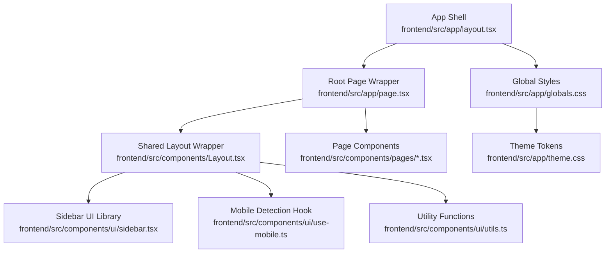
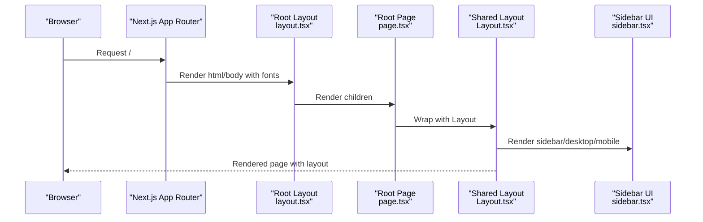
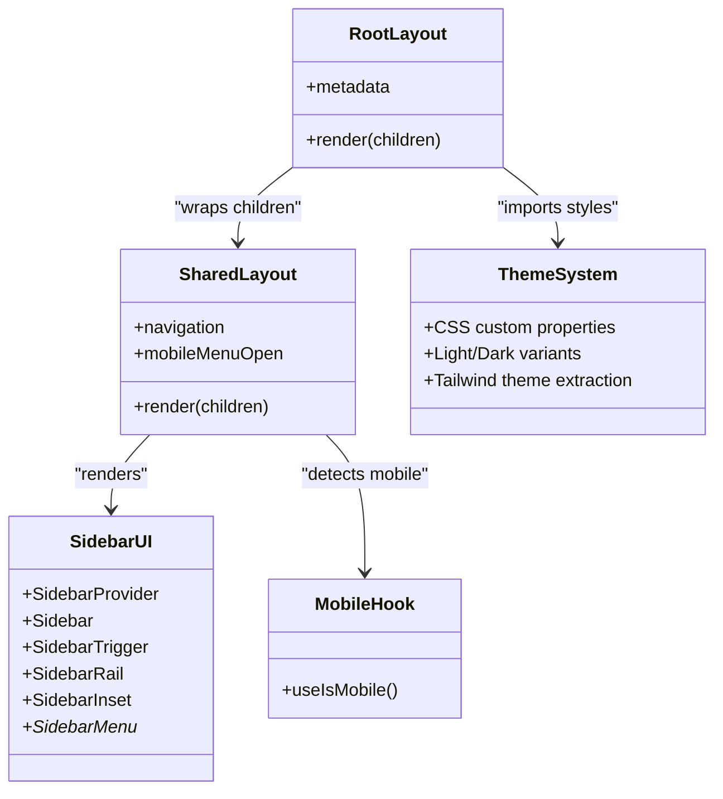
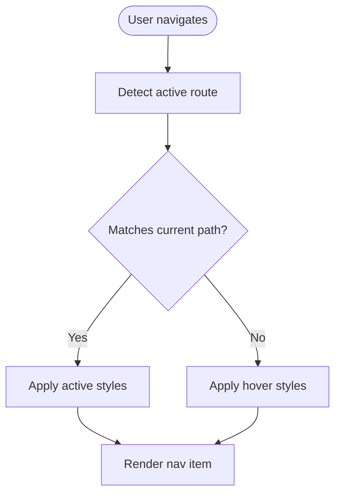
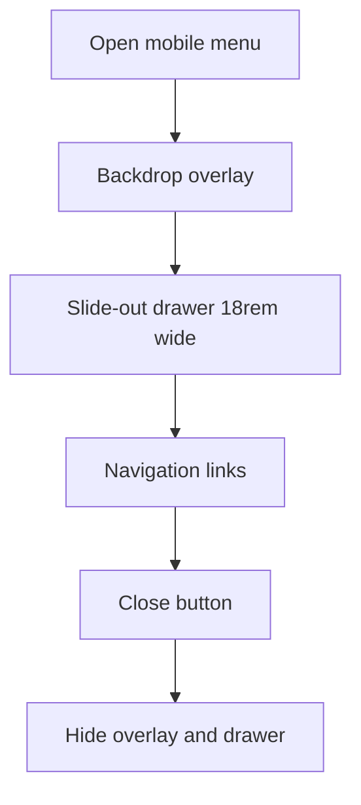
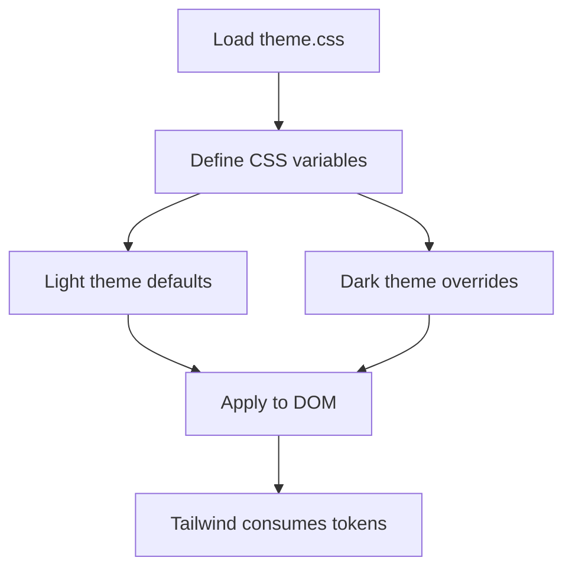
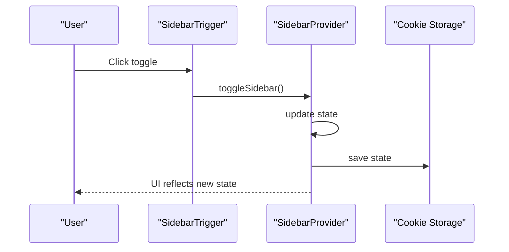
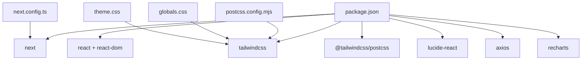

# Layout System

<cite>
**Referenced Files in This Document**
- [layout.tsx](file://frontend/src/app/layout.tsx)
- [Layout.tsx](file://frontend/src/components/Layout.tsx)
- [globals.css](file://frontend/src/app/globals.css)
- [theme.css](file://frontend/src/app/theme.css)
- [sidebar.tsx](file://frontend/src/components/ui/sidebar.tsx)
- [use-mobile.ts](file://frontend/src/components/ui/use-mobile.ts)
- [utils.ts](file://frontend/src/components/ui/utils.ts)
- [page.tsx](file://frontend/src/app/page.tsx)
- [Dashboard.tsx](file://frontend/src/components/pages/Dashboard.tsx)
- [Inventory.tsx](file://frontend/src/components/pages/Inventory.tsx)
- [api.ts](file://frontend/src/lib/api.ts)
- [dateFormat.ts](file://frontend/src/utils/dateFormat.ts)
- [next.config.ts](file://frontend/next.config.ts)
- [postcss.config.mjs](file://frontend/postcss.config.mjs)
- [package.json](file://frontend/package.json)
</cite>

## Table of Contents
1. [Introduction](#introduction)
2. [Project Structure](#project-structure)
3. [Core Components](#core-components)
4. [Architecture Overview](#architecture-overview)
5. [Detailed Component Analysis](#detailed-component-analysis)
6. [Dependency Analysis](#dependency-analysis)
7. [Performance Considerations](#performance-considerations)
8. [Troubleshooting Guide](#troubleshooting-guide)
9. [Conclusion](#conclusion)

## Introduction
This document describes the PPA layout system architecture built with Next.js App Router. It covers the global layout configuration, page wrapper components, responsive design patterns, theme management via CSS custom properties, and the sidebar navigation implementation. It also explains how page-level layouts compose with the shared layout, how navigation is handled, and how the system integrates with page components.

## Project Structure
The layout system spans three primary areas:
- Global application shell and fonts: configured in the root App Router layout
- Shared layout wrapper: a client component that renders the sidebar, mobile menu, and main content area
- Theme and design tokens: centralized CSS custom properties with light/dark variants

**Diagram sources**
- [layout.tsx:1-34](file://frontend/src/app/layout.tsx#L1-L34)
- [page.tsx:1-12](file://frontend/src/app/page.tsx#L1-L12)
- [Layout.tsx:1-161](file://frontend/src/components/Layout.tsx#L1-L161)
- [sidebar.tsx:1-727](file://frontend/src/components/ui/sidebar.tsx#L1-L727)
- [use-mobile.ts:1-22](file://frontend/src/components/ui/use-mobile.ts#L1-L22)
- [utils.ts:1-7](file://frontend/src/components/ui/utils.ts#L1-L7)
- [globals.css:1-2](file://frontend/src/app/globals.css#L1-L2)
- [theme.css:1-128](file://frontend/src/app/theme.css#L1-L128)

**Section sources**
- [layout.tsx:1-34](file://frontend/src/app/layout.tsx#L1-L34)
- [page.tsx:1-12](file://frontend/src/app/page.tsx#L1-L12)
- [Layout.tsx:1-161](file://frontend/src/components/Layout.tsx#L1-L161)
- [globals.css:1-2](file://frontend/src/app/globals.css#L1-L2)
- [theme.css:1-128](file://frontend/src/app/theme.css#L1-L128)

## Core Components
- Root App Shell: Provides HTML document structure, typography fonts, and global styles.
- Shared Layout Wrapper: Implements desktop sidebar, mobile hamburger menu, and main content container.
- Sidebar UI Library: A reusable sidebar system with provider, trigger, rail, inset, and menu components.
- Theme System: CSS custom properties with light/dark variants and Tailwind theme extraction.
- Mobile Detection: A hook that detects mobile breakpoints consistently across components.

**Section sources**
- [layout.tsx:1-34](file://frontend/src/app/layout.tsx#L1-L34)
- [Layout.tsx:1-161](file://frontend/src/components/Layout.tsx#L1-L161)
- [sidebar.tsx:1-727](file://frontend/src/components/ui/sidebar.tsx#L1-L727)
- [theme.css:1-128](file://frontend/src/app/theme.css#L1-L128)
- [use-mobile.ts:1-22](file://frontend/src/components/ui/use-mobile.ts#L1-L22)

## Architecture Overview
The layout system follows Next.js App Router conventions:
- Root layout defines the HTML document and global fonts.
- Root page wraps content with the shared layout.
- The shared layout manages navigation and responsive behavior.
- Theme tokens are injected via CSS and consumed by Tailwind utilities.

**Diagram sources**
- [layout.tsx:15-33](file://frontend/src/app/layout.tsx#L15-L33)
- [page.tsx:6-11](file://frontend/src/app/page.tsx#L6-L11)
- [Layout.tsx:38-158](file://frontend/src/components/Layout.tsx#L38-L158)
- [sidebar.tsx:154-254](file://frontend/src/components/ui/sidebar.tsx#L154-L254)

## Detailed Component Analysis

### Root Layout (HTML Shell)
- Defines metadata and installs Google Fonts with CSS variables for typography.
- Wraps children with a flex column body to support sticky headers and scrollable content.

**Section sources**
- [layout.tsx:15-33](file://frontend/src/app/layout.tsx#L15-L33)

### Shared Layout Wrapper
Responsibilities:
- Desktop sidebar with navigation items and active state detection.
- Mobile header with hamburger menu and logo.
- Mobile slide-out menu with navigation items.
- Main content container with left padding for desktop sidebar.

Navigation handling:
- Uses Next.js pathname to compute active navigation state.
- Desktop uses Link for navigation; mobile closes menu after selection.

Responsive behavior:
- Desktop sidebar fixed at 16rem width.
- Mobile menu overlays with backdrop blur and close button.

State management:
- Local state toggles mobile menu visibility.
- Active item highlighting based on current route.

**Section sources**
- [Layout.tsx:19-161](file://frontend/src/components/Layout.tsx#L19-L161)

### Sidebar UI Library
Capabilities:
- Provider manages expanded/collapsed state, cookies persistence, and keyboard shortcuts.
- Supports offcanvas, icon-only, and none collapsible modes.
- Mobile-first rendering with Sheet overlay.
- Desktop with rail, trigger, and inset/floating variants.
- Rich composition primitives: menu, group, button, action, badge, skeleton, sub-menu.

Cookie persistence:
- Stores sidebar open state in a cookie to persist across sessions.

Keyboard shortcut:
- Toggle with Ctrl/Cmd + B.

Accessibility:
- Proper ARIA roles and screen-reader-friendly Sheet headers.

**Section sources**
- [sidebar.tsx:28-152](file://frontend/src/components/ui/sidebar.tsx#L28-L152)
- [sidebar.tsx:154-254](file://frontend/src/components/ui/sidebar.tsx#L154-L254)
- [sidebar.tsx:256-280](file://frontend/src/components/ui/sidebar.tsx#L256-L280)
- [sidebar.tsx:307-319](file://frontend/src/components/ui/sidebar.tsx#L307-L319)
- [sidebar.tsx:454-546](file://frontend/src/components/ui/sidebar.tsx#L454-L546)

### Theme Management and Design Tokens
Design system:
- CSS custom properties define color tokens, radii, and chart colors.
- Light and dark variants under a custom dark selector.
- Tailwind theme extraction maps custom properties to Tailwind utilities.

Usage:
- Components consume CSS variables for consistent theming.
- Dark mode activated via a dark class on the root element.

**Section sources**
- [theme.css:3-46](file://frontend/src/app/theme.css#L3-L46)
- [theme.css:48-83](file://frontend/src/app/theme.css#L48-L83)
- [theme.css:85-128](file://frontend/src/app/theme.css#L85-L128)

### Mobile Responsiveness
Detection:
- A dedicated hook checks media queries and window width to decide mobile behavior.

Integration:
- Sidebar UI library uses the hook to render Sheet on mobile.
- Shared layout toggles mobile menu overlay and adjusts content padding.

**Section sources**
- [use-mobile.ts:3-21](file://frontend/src/components/ui/use-mobile.ts#L3-L21)
- [sidebar.tsx:69-94](file://frontend/src/components/ui/sidebar.tsx#L69-L94)

### Page-Level Layout Composition
- Root page wraps the Dashboard component with the shared Layout.
- Other pages would similarly wrap their content with Layout to inherit navigation and responsive behavior.

**Section sources**
- [page.tsx:6-11](file://frontend/src/app/page.tsx#L6-L11)

### Page Components Integration
- Dashboard: Demonstrates notification bell, charts, and paginated lists styled with theme tokens.
- Inventory: Shows advanced filtering, table layout, and modal dialogs styled consistently.

**Section sources**
- [Dashboard.tsx:157-667](file://frontend/src/components/pages/Dashboard.tsx#L157-L667)
- [Inventory.tsx:62-606](file://frontend/src/components/pages/Inventory.tsx#L62-L606)

### Utility Functions
- cn: Merges and deduplicates Tailwind classes using clsx and tailwind-merge.

**Section sources**
- [utils.ts:4-6](file://frontend/src/components/ui/utils.ts#L4-L6)

## Architecture Overview

**Diagram sources**
- [layout.tsx:15-33](file://frontend/src/app/layout.tsx#L15-L33)
- [Layout.tsx:19-161](file://frontend/src/components/Layout.tsx#L19-L161)
- [sidebar.tsx:56-152](file://frontend/src/components/ui/sidebar.tsx#L56-L152)
- [use-mobile.ts:5-21](file://frontend/src/components/ui/use-mobile.ts#L5-L21)
- [theme.css:1-128](file://frontend/src/app/theme.css#L1-L128)

## Detailed Component Analysis

### Navigation Patterns
Desktop navigation highlights active items based on pathname prefixes. Mobile navigation uses a slide-out menu with immediate close-on-select behavior.

**Diagram sources**
- [Layout.tsx:59-72](file://frontend/src/components/Layout.tsx#L59-L72)

**Section sources**
- [Layout.tsx:27-84](file://frontend/src/components/Layout.tsx#L27-L84)

### Responsive Design Implementation
- Desktop: Fixed sidebar with 16rem width; main content receives left padding to avoid overlap.
- Mobile: Hamburger menu opens a full-height overlay; backdrop click closes menu.

**Diagram sources**
- [Layout.tsx:105-150](file://frontend/src/components/Layout.tsx#L105-L150)

**Section sources**
- [Layout.tsx:86-158](file://frontend/src/components/Layout.tsx#L86-L158)

### Theme Switching Capabilities
- CSS variables define theme tokens; dark variant overrides them under a dark class.
- Tailwind theme extraction exposes tokens for utility classes.
- Pages consume tokens via CSS variables and Tailwind utilities.

**Diagram sources**
- [theme.css:3-46](file://frontend/src/app/theme.css#L3-L46)
- [theme.css:48-83](file://frontend/src/app/theme.css#L48-L83)
- [theme.css:85-128](file://frontend/src/app/theme.css#L85-L128)

**Section sources**
- [theme.css:1-128](file://frontend/src/app/theme.css#L1-L128)

### Sidebar Navigation Composition
- Provider stores open state and persists via cookie.
- Trigger toggles sidebar; Rail provides hover area to toggle.
- Inset/Floating variants adjust spacing and shadows.

**Diagram sources**
- [sidebar.tsx:260-280](file://frontend/src/components/ui/sidebar.tsx#L260-L280)
- [sidebar.tsx:76-94](file://frontend/src/components/ui/sidebar.tsx#L76-L94)
- [sidebar.tsx:85-87](file://frontend/src/components/ui/sidebar.tsx#L85-L87)

**Section sources**
- [sidebar.tsx:56-152](file://frontend/src/components/ui/sidebar.tsx#L56-L152)
- [sidebar.tsx:256-280](file://frontend/src/components/ui/sidebar.tsx#L256-L280)

### Page-Level Layout Integration
- Root page composes the shared layout around page-specific components.
- This pattern ensures consistent navigation and responsive behavior across pages.

**Section sources**
- [page.tsx:6-11](file://frontend/src/app/page.tsx#L6-L11)

### Layout State Management
- Shared layout maintains mobile menu state locally.
- Sidebar provider manages expand/collapse state and persists it.
- Mobile detection is centralized to avoid duplication.

**Section sources**
- [Layout.tsx:24-25](file://frontend/src/components/Layout.tsx#L24-L25)
- [sidebar.tsx:74-94](file://frontend/src/components/ui/sidebar.tsx#L74-L94)
- [use-mobile.ts:5-21](file://frontend/src/components/ui/use-mobile.ts#L5-L21)

## Dependency Analysis

**Diagram sources**
- [package.json:11-31](file://frontend/package.json#L11-L31)
- [next.config.ts:3-5](file://frontend/next.config.ts#L3-L5)
- [postcss.config.mjs:1-8](file://frontend/postcss.config.mjs#L1-L8)
- [globals.css:1-2](file://frontend/src/app/globals.css#L1-L2)
- [theme.css:1-128](file://frontend/src/app/theme.css#L1-L128)

**Section sources**
- [package.json:11-31](file://frontend/package.json#L11-L31)
- [next.config.ts:3-5](file://frontend/next.config.ts#L3-L5)
- [postcss.config.mjs:1-8](file://frontend/postcss.config.mjs#L1-L8)

## Performance Considerations
- Prefer client components only where necessary (e.g., Layout, Sidebar provider). Keep server-rendered pages for initial load.
- Use CSS custom properties for theming to minimize re-renders.
- Leverage Tailwind utilities to avoid ad-hoc CSS and reduce bundle size.
- Memoize derived values (e.g., chart data) in page components to prevent unnecessary recalculations.

## Troubleshooting Guide
- Navigation not highlighting: Verify pathname logic and ensure route prefixes match.
- Mobile menu not closing: Confirm click handlers and state updates.
- Sidebar not persisting state: Check cookie write permissions and expiration.
- Theme not applying: Ensure dark class propagation and CSS variable availability.
- API errors in pages: Validate NEXT_PUBLIC_API_URL and port configuration.

**Section sources**
- [Layout.tsx:59-72](file://frontend/src/components/Layout.tsx#L59-L72)
- [Layout.tsx:127-146](file://frontend/src/components/Layout.tsx#L127-L146)
- [sidebar.tsx:85-87](file://frontend/src/components/ui/sidebar.tsx#L85-L87)
- [theme.css:1-128](file://frontend/src/app/theme.css#L1-L128)
- [api.ts:3-18](file://frontend/src/lib/api.ts#L3-L18)

## Conclusion
The PPA layout system combines Next.js App Router conventions with a cohesive design system. The shared layout wrapper centralizes navigation and responsiveness, while the sidebar UI library offers flexible composition. CSS custom properties enable robust theming across light and dark modes. Page components integrate seamlessly by wrapping content with the shared layout, ensuring consistent UX and maintainable code.