# Page Components

<cite>
**Referenced Files in This Document**
- [layout.tsx](file://frontend/src/app/layout.tsx)
- [Layout.tsx](file://frontend/src/components/Layout.tsx)
- [api.ts](file://frontend/src/lib/api.ts)
- [page.tsx](file://frontend/src/app/page.tsx)
- [Dashboard.tsx](file://frontend/src/components/pages/Dashboard.tsx)
- [Inventory.tsx](file://frontend/src/components/pages/Inventory.tsx)
- [StockIn.tsx](file://frontend/src/components/pages/StockIn.tsx)
- [StockOut.tsx](file://frontend/src/components/pages/StockOut.tsx)
- [MasterData.tsx](file://frontend/src/components/pages/MasterData.tsx)
- [Supplier.tsx](file://frontend/src/components/pages/Supplier.tsx)
- [StockInHistory.tsx](file://frontend/src/components/pages/StockInHistory.tsx)
- [StockOutHistory.tsx](file://frontend/src/components/pages/StockOutHistory.tsx)
- [MonitoringStock.tsx](file://frontend/src/components/pages/MonitoringStock.tsx)
- [AddItem.tsx](file://frontend/src/components/pages/AddItem.tsx)
- [EditItem.tsx](file://frontend/src/components/pages/EditItem.tsx)
</cite>

## Table of Contents
1. [Introduction](#introduction)
2. [Project Structure](#project-structure)
3. [Core Components](#core-components)
4. [Architecture Overview](#architecture-overview)
5. [Detailed Component Analysis](#detailed-component-analysis)
6. [Dependency Analysis](#dependency-analysis)
7. [Performance Considerations](#performance-considerations)
8. [Troubleshooting Guide](#troubleshooting-guide)
9. [Conclusion](#conclusion)

## Introduction
This document describes the PPA page components system, focusing on the Next.js frontend architecture and the React page components that power the inventory management application. It covers routing via Next.js App Router, component composition, state management, data fetching strategies, and integration with the backend API. It also documents the global layout, error handling, loading states, and user interaction flows across the Dashboard, Inventory, Stock operations (StockIn, StockOut, History), Monitoring, Master data, and Supplier management pages.

## Project Structure
The frontend follows a conventional Next.js App Router layout:
- Global application layout and root page define the base shell and initial route.
- A reusable client-side Layout component wraps page content with navigation and responsive mobile menu.
- Page components under src/components/pages implement domain-specific views and interactions.
- Shared API utilities centralize endpoint construction and environment-based base URL resolution.
- Utility modules support formatting and date handling.

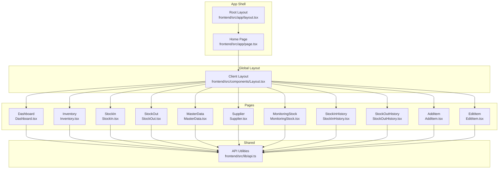

**Diagram sources**
- [layout.tsx:1-34](file://frontend/src/app/layout.tsx#L1-L34)
- [page.tsx:1-12](file://frontend/src/app/page.tsx#L1-L12)
- [Layout.tsx:1-161](file://frontend/src/components/Layout.tsx#L1-L161)
- [Dashboard.tsx:1-668](file://frontend/src/components/pages/Dashboard.tsx#L1-L668)
- [Inventory.tsx:1-606](file://frontend/src/components/pages/Inventory.tsx#L1-L606)
- [StockIn.tsx:1-425](file://frontend/src/components/pages/StockIn.tsx#L1-L425)
- [StockOut.tsx:1-529](file://frontend/src/components/pages/StockOut.tsx#L1-L529)
- [MasterData.tsx:1-536](file://frontend/src/components/pages/MasterData.tsx#L1-L536)
- [Supplier.tsx:1-483](file://frontend/src/components/pages/Supplier.tsx#L1-L483)
- [MonitoringStock.tsx:1-920](file://frontend/src/components/pages/MonitoringStock.tsx#L1-L920)
- [StockInHistory.tsx:1-405](file://frontend/src/components/pages/StockInHistory.tsx#L1-L405)
- [StockOutHistory.tsx:1-398](file://frontend/src/components/pages/StockOutHistory.tsx#L1-L398)
- [AddItem.tsx:1-708](file://frontend/src/components/pages/AddItem.tsx#L1-L708)
- [EditItem.tsx:1-626](file://frontend/src/components/pages/EditItem.tsx#L1-L626)
- [api.ts:1-19](file://frontend/src/lib/api.ts#L1-L19)

**Section sources**
- [layout.tsx:1-34](file://frontend/src/app/layout.tsx#L1-L34)
- [page.tsx:1-12](file://frontend/src/app/page.tsx#L1-L12)
- [Layout.tsx:1-161](file://frontend/src/components/Layout.tsx#L1-L161)
- [api.ts:1-19](file://frontend/src/lib/api.ts#L1-L19)

## Core Components
- Root Layout: Provides HTML document shell and global CSS classes.
- Home Page: Wraps the Dashboard inside the global Layout.
- Global Layout: Implements responsive navigation, active link highlighting, and mobile menu.
- API Utilities: Builds absolute URLs from environment variables and path segments.

Key responsibilities:
- Routing: Next.js App Router maps routes to page files and nested layouts.
- Composition: Pages render within the global Layout, ensuring consistent navigation and branding.
- Data Access: All pages consume a shared API utility for endpoint construction.

**Section sources**
- [layout.tsx:1-34](file://frontend/src/app/layout.tsx#L1-L34)
- [page.tsx:1-12](file://frontend/src/app/page.tsx#L1-L12)
- [Layout.tsx:1-161](file://frontend/src/components/Layout.tsx#L1-L161)
- [api.ts:1-19](file://frontend/src/lib/api.ts#L1-L19)

## Architecture Overview
The system uses a client-side rendered React architecture with:
- Centralized API utilities for endpoint construction.
- Strict separation of concerns: global layout, page components, and shared utilities.
- Environment-driven configuration for API base URL resolution.

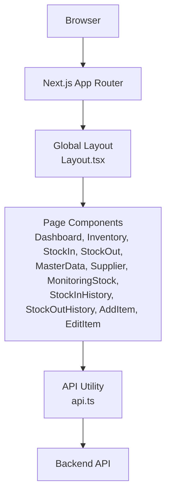

**Diagram sources**
- [Layout.tsx:1-161](file://frontend/src/components/Layout.tsx#L1-L161)
- [Dashboard.tsx:1-668](file://frontend/src/components/pages/Dashboard.tsx#L1-L668)
- [Inventory.tsx:1-606](file://frontend/src/components/pages/Inventory.tsx#L1-L606)
- [StockIn.tsx:1-425](file://frontend/src/components/pages/StockIn.tsx#L1-L425)
- [StockOut.tsx:1-529](file://frontend/src/components/pages/StockOut.tsx#L1-L529)
- [MasterData.tsx:1-536](file://frontend/src/components/pages/MasterData.tsx#L1-L536)
- [Supplier.tsx:1-483](file://frontend/src/components/pages/Supplier.tsx#L1-L483)
- [MonitoringStock.tsx:1-920](file://frontend/src/components/pages/MonitoringStock.tsx#L1-L920)
- [StockInHistory.tsx:1-405](file://frontend/src/components/pages/StockInHistory.tsx#L1-L405)
- [StockOutHistory.tsx:1-398](file://frontend/src/components/pages/StockOutHistory.tsx#L1-L398)
- [AddItem.tsx:1-708](file://frontend/src/components/pages/AddItem.tsx#L1-L708)
- [EditItem.tsx:1-626](file://frontend/src/components/pages/EditItem.tsx#L1-L626)
- [api.ts:1-19](file://frontend/src/lib/api.ts#L1-L19)

## Detailed Component Analysis

### Dashboard Analytics Page
Purpose:
- Present high-level inventory summaries, charts, recent activity, and notification panel.

Props and state:
- Uses local state for summary metrics, distribution data, stock movement, recent activities, pagination meta, and notifications.
- Manages loading and error states during data fetch.

Data fetching:
- Fetches dashboard data with pagination parameters for grouped categories and recent activities.
- Uses the API utility to construct endpoint URLs.

Lifecycle and UX:
- On mount, triggers data fetch with default pagination pages.
- Supports pagination controls for category distribution and recent activities.
- Renders charts with responsive containers and formatted tooltips.
- Provides a notification bell with dropdown and read/unread indicators.

Integration patterns:
- Integrates with the global Layout for consistent navigation.
- Uses recharts for visualization and date formatting utilities for display.

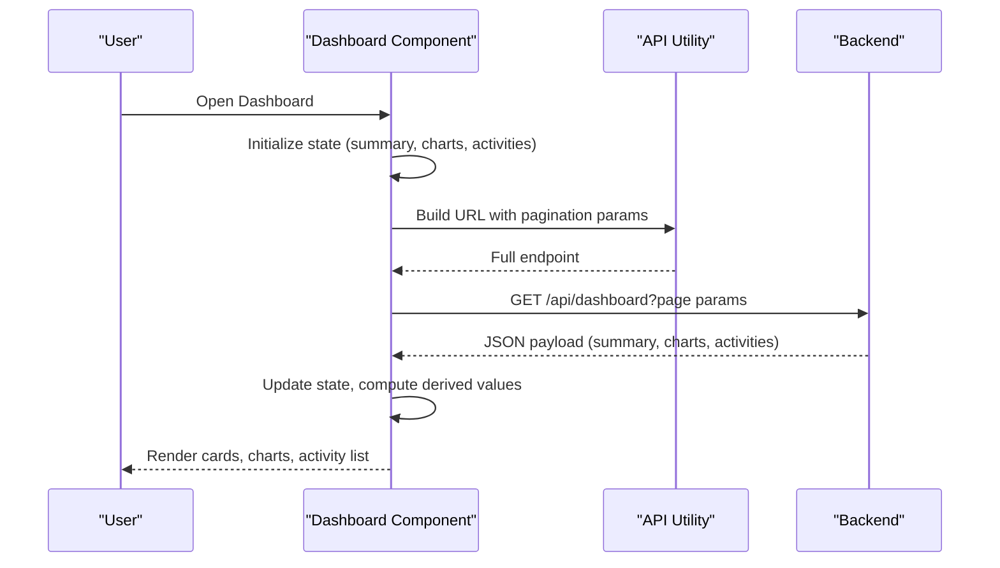

**Diagram sources**
- [Dashboard.tsx:173-214](file://frontend/src/components/pages/Dashboard.tsx#L173-L214)
- [api.ts:15-18](file://frontend/src/lib/api.ts#L15-L18)

**Section sources**
- [Dashboard.tsx:1-668](file://frontend/src/components/pages/Dashboard.tsx#L1-L668)

### Inventory Management Page
Purpose:
- List, search, filter, and manage inventory items with pagination and actions.

Props and state:
- Maintains lists of items, master categories/types, and UI state (search, filters, pagination, messages).

Data fetching:
- Loads items and master data on mount.
- Supports real-time filtering and pagination.

Lifecycle and UX:
- Search debounced with controlled pagination resets.
- Category and type filters apply to the dataset.
- Delete confirmation modal with immediate feedback.
- Edit action navigates to EditItem page.

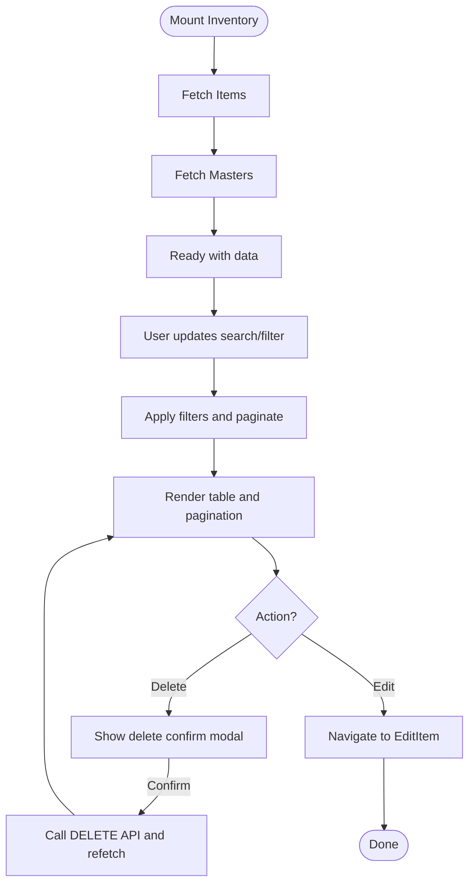

**Diagram sources**
- [Inventory.tsx:77-132](file://frontend/src/components/pages/Inventory.tsx#L77-L132)
- [Inventory.tsx:134-173](file://frontend/src/components/pages/Inventory.tsx#L134-L173)

**Section sources**
- [Inventory.tsx:1-606](file://frontend/src/components/pages/Inventory.tsx#L1-L606)

### Stock Operations: StockIn
Purpose:
- Record incoming stock with item lookup, quantity, pricing, expiry, and batch/facture details.

Props and state:
- Tracks search term, item suggestions, selected item, form fields, and recent transactions.

Data fetching:
- Debounced search for items with minimal debounce delay.
- Fetches recent stock-in entries.

Lifecycle and UX:
- Item selection auto-fills price and expiry if available.
- Form validation ensures required fields and positive quantities.
- Loading state during submission; success/error messaging.
- Auto-refresh of recent transactions after successful submit.

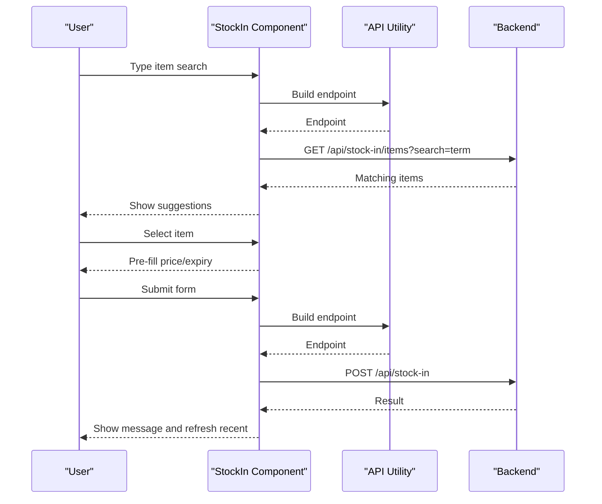

**Diagram sources**
- [StockIn.tsx:84-109](file://frontend/src/components/pages/StockIn.tsx#L84-L109)
- [StockIn.tsx:111-119](file://frontend/src/components/pages/StockIn.tsx#L111-L119)
- [StockIn.tsx:147-185](file://frontend/src/components/pages/StockIn.tsx#L147-L185)
- [api.ts:15-18](file://frontend/src/lib/api.ts#L15-L18)

**Section sources**
- [StockIn.tsx:1-425](file://frontend/src/components/pages/StockIn.tsx#L1-L425)

### Stock Operations: StockOut
Purpose:
- Record outgoing stock with batch selection, destination, quantity, and revenue calculation.

Props and state:
- Manages item search, batch options, destination selection, and recent transactions.

Data fetching:
- Debounced item search.
- Fetches batch options for selected item.
- Fetches recent stock-out entries.

Lifecycle and UX:
- Batch selection drives availability checks and price derivation by destination.
- Real-time stock validation prevents overselling.
- Form validation and loading states.
- Auto-refresh of recent transactions after successful submit.

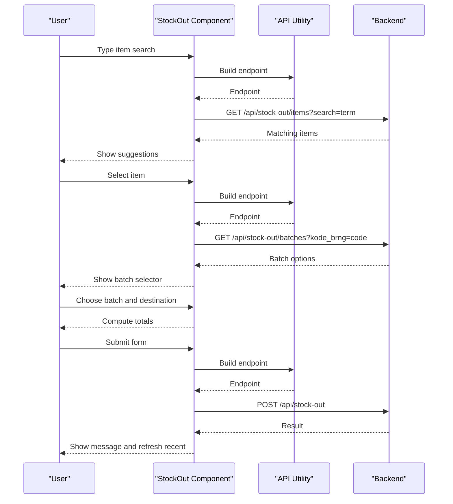

**Diagram sources**
- [StockOut.tsx:133-156](file://frontend/src/components/pages/StockOut.tsx#L133-L156)
- [StockOut.tsx:166-184](file://frontend/src/components/pages/StockOut.tsx#L166-L184)
- [StockOut.tsx:225-266](file://frontend/src/components/pages/StockOut.tsx#L225-L266)
- [api.ts:15-18](file://frontend/src/lib/api.ts#L15-L18)

**Section sources**
- [StockOut.tsx:1-529](file://frontend/src/components/pages/StockOut.tsx#L1-L529)

### Stock Operation Histories
Purpose:
- Comprehensive audit trails for stock movements with filtering, pagination, and summary stats.

Patterns:
- Both StockInHistory and StockOutHistory share similar patterns:
  - Debounced search and date filters.
  - Paginated data retrieval with page size constants.
  - Error handling with user-friendly messages.
  - Summary cards for totals.

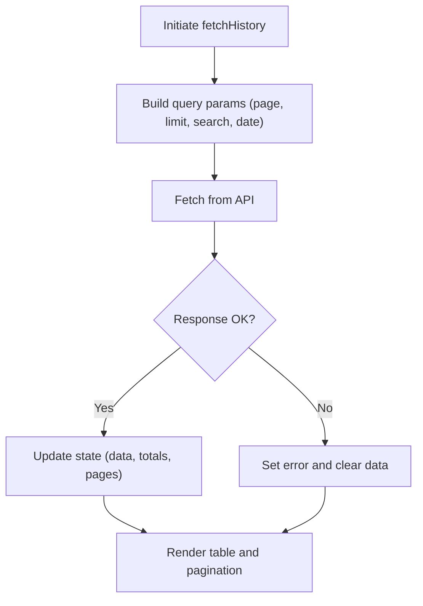

**Diagram sources**
- [StockInHistory.tsx:70-120](file://frontend/src/components/pages/StockInHistory.tsx#L70-L120)
- [StockOutHistory.tsx:69-120](file://frontend/src/components/pages/StockOutHistory.tsx#L69-L120)

**Section sources**
- [StockInHistory.tsx:1-405](file://frontend/src/components/pages/StockInHistory.tsx#L1-L405)
- [StockOutHistory.tsx:1-398](file://frontend/src/components/pages/StockOutHistory.tsx#L1-L398)

### Monitoring Stock Page
Purpose:
- Real-time monitoring of stock health, turnover, coverage, and expiry status.

Props and state:
- Period selector, summary, lists, and detail modal state.
- Background refresh when tab becomes visible.

Data fetching:
- Fetches monitoring data with configurable periods.
- Opens detail modals to fetch detailed lists by type.

Lifecycle and UX:
- Automatic periodic refresh while the page is visible.
- Clickable summary cards to drill into details.
- Responsive charts for stock distribution and coverage.

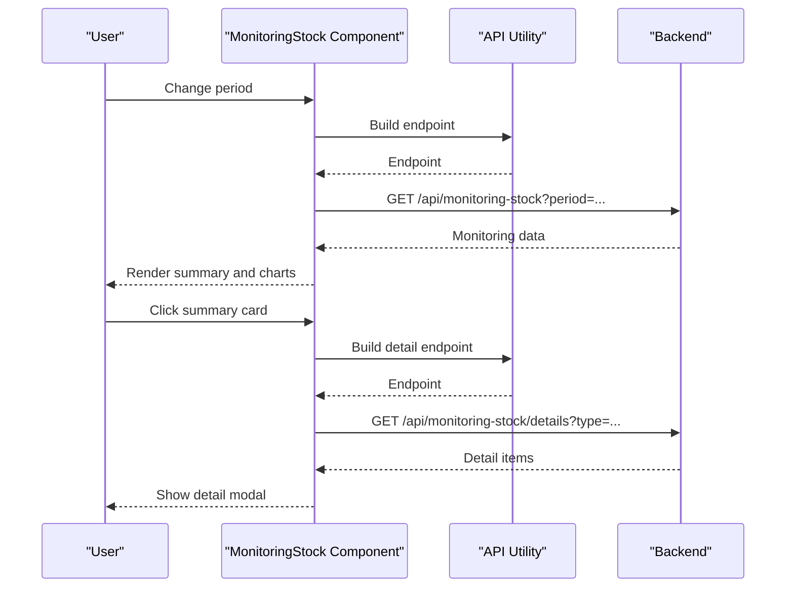

**Diagram sources**
- [MonitoringStock.tsx:189-217](file://frontend/src/components/pages/MonitoringStock.tsx#L189-L217)
- [MonitoringStock.tsx:165-182](file://frontend/src/components/pages/MonitoringStock.tsx#L165-L182)
- [api.ts:15-18](file://frontend/src/lib/api.ts#L15-L18)

**Section sources**
- [MonitoringStock.tsx:1-920](file://frontend/src/components/pages/MonitoringStock.tsx#L1-L920)

### Master Data Management
Purpose:
- Manage classification data: groups, types, and units.

Props and state:
- Active master type, records list, search, modal visibility, and CRUD forms.

Data fetching:
- Loads all master data on mount.
- Refreshes after create/update/delete.

Lifecycle and UX:
- Tabs to switch between master types.
- Search within current type.
- Modal forms for add/edit with validation.
- Delete confirmation dialog.

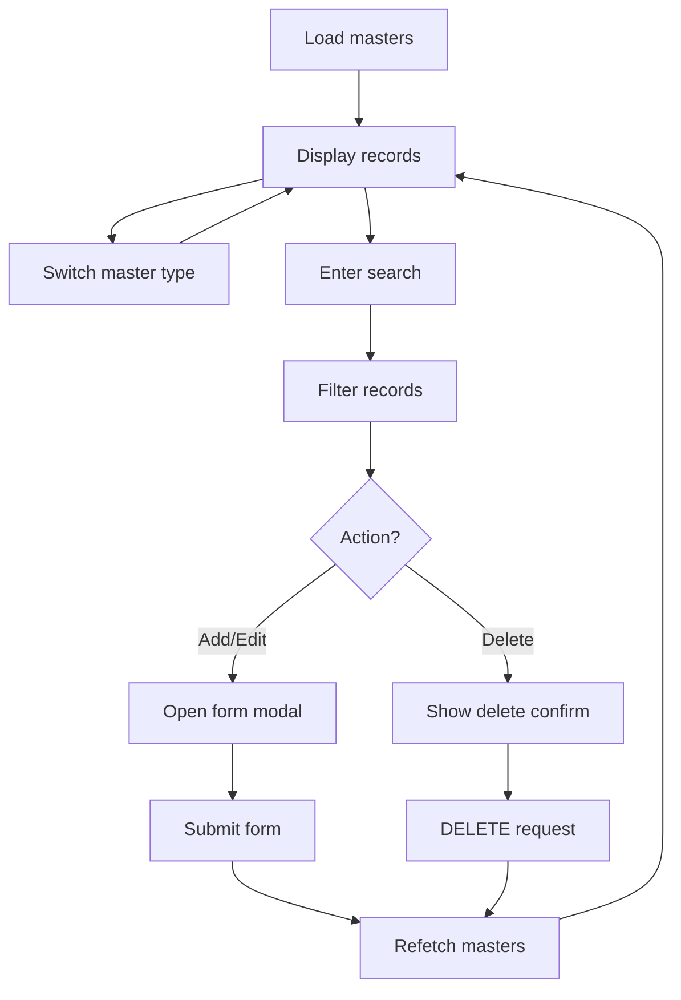

**Diagram sources**
- [MasterData.tsx:76-118](file://frontend/src/components/pages/MasterData.tsx#L76-L118)
- [MasterData.tsx:225-281](file://frontend/src/components/pages/MasterData.tsx#L225-L281)

**Section sources**
- [MasterData.tsx:1-536](file://frontend/src/components/pages/MasterData.tsx#L1-L536)

### Supplier Management
Purpose:
- Manage supplier records with search, pagination, and CRUD operations.

Props and state:
- Suppliers list, search, pagination, modal visibility, and form state.

Data fetching:
- Loads suppliers on mount.
- Updates list after create/update/delete.

Lifecycle and UX:
- Search across name, city, and address.
- Stats cards for counts.
- Modal forms for add/edit with validation.
- Delete confirmation dialog.

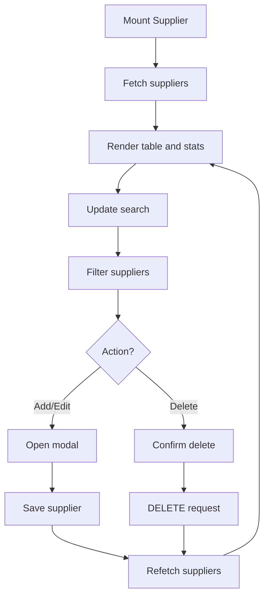

**Diagram sources**
- [Supplier.tsx:29-52](file://frontend/src/components/pages/Supplier.tsx#L29-L52)
- [Supplier.tsx:82-129](file://frontend/src/components/pages/Supplier.tsx#L82-L129)

**Section sources**
- [Supplier.tsx:1-483](file://frontend/src/components/pages/Supplier.tsx#L1-L483)

### Add Item Page
Purpose:
- Create new inventory items with pricing tiers and expiry handling.

Props and state:
- Form state for item attributes and pricing.
- Master data for dropdowns.
- Validation and submission handling.

Data fetching:
- Loads master data on mount.
- Submits new item via POST to items endpoint.

Lifecycle and UX:
- Toggle between “Obat” and “Non-Obat” affects available fields.
- Auto-computed margins based on purchase price.
- Immediate feedback on success/error.

**Section sources**
- [AddItem.tsx:1-708](file://frontend/src/components/pages/AddItem.tsx#L1-L708)

### Edit Item Page
Purpose:
- Update existing inventory items with synchronized master data.

Props and state:
- Form state hydrated from fetched item data.
- Master data for dropdowns.
- Navigation and update handling.

Data fetching:
- Loads master data on mount.
- Loads item details by route param.
- Updates item via PUT to items endpoint.

Lifecycle and UX:
- Route params drive item hydration.
- Back navigation after successful update.
- Immediate feedback on success/error.

**Section sources**
- [EditItem.tsx:1-626](file://frontend/src/components/pages/EditItem.tsx#L1-L626)

## Dependency Analysis
Component relationships and external dependencies:
- All page components depend on the API utility for endpoint construction.
- Global Layout depends on Next.js navigation primitives and Lucide icons.
- Dashboard integrates charting libraries for visualization.
- Inventory, StockIn, StockOut, MonitoringStock integrate with date formatting utilities.
- AddItem and EditItem rely on master data for dropdowns.

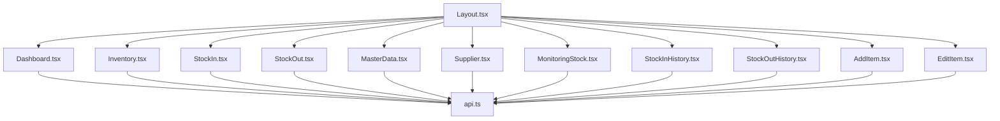

**Diagram sources**
- [api.ts:1-19](file://frontend/src/lib/api.ts#L1-L19)
- [Layout.tsx:1-161](file://frontend/src/components/Layout.tsx#L1-L161)
- [Dashboard.tsx:1-668](file://frontend/src/components/pages/Dashboard.tsx#L1-L668)
- [Inventory.tsx:1-606](file://frontend/src/components/pages/Inventory.tsx#L1-L606)
- [StockIn.tsx:1-425](file://frontend/src/components/pages/StockIn.tsx#L1-L425)
- [StockOut.tsx:1-529](file://frontend/src/components/pages/StockOut.tsx#L1-L529)
- [MasterData.tsx:1-536](file://frontend/src/components/pages/MasterData.tsx#L1-L536)
- [Supplier.tsx:1-483](file://frontend/src/components/pages/Supplier.tsx#L1-L483)
- [MonitoringStock.tsx:1-920](file://frontend/src/components/pages/MonitoringStock.tsx#L1-L920)
- [StockInHistory.tsx:1-405](file://frontend/src/components/pages/StockInHistory.tsx#L1-L405)
- [StockOutHistory.tsx:1-398](file://frontend/src/components/pages/StockOutHistory.tsx#L1-L398)
- [AddItem.tsx:1-708](file://frontend/src/components/pages/AddItem.tsx#L1-L708)
- [EditItem.tsx:1-626](file://frontend/src/components/pages/EditItem.tsx#L1-L626)

**Section sources**
- [api.ts:1-19](file://frontend/src/lib/api.ts#L1-L19)
- [Layout.tsx:1-161](file://frontend/src/components/Layout.tsx#L1-L161)

## Performance Considerations
- Debounced search: StockIn, StockOut, and history pages debounce user input to reduce network requests.
- Minimal re-renders: Use of controlled components and memoization patterns where applicable.
- Pagination: Large datasets are paginated to avoid rendering overhead.
- Lazy initialization: Some components fetch data on mount and update state efficiently.
- Background refresh: Monitoring page refreshes periodically when the tab is visible to keep data fresh without manual refresh.

## Troubleshooting Guide
Common issues and resolutions:
- API connectivity errors:
  - Symptoms: Empty lists, error banners, or failed submissions.
  - Causes: Network issues, backend downtime, invalid base URL.
  - Resolution: Verify environment variables for API base URL, check backend status, retry actions.
- Validation failures:
  - Symptoms: Immediate error messages on forms.
  - Causes: Missing required fields, invalid numeric inputs, stock oversell.
  - Resolution: Fill required fields, correct numeric formatting, ensure sufficient stock.
- Pagination anomalies:
  - Symptoms: Incorrect page counts or missing items.
  - Resolution: Reset filters, reload page, verify backend pagination parameters.
- Expiry and date handling:
  - Symptoms: Invalid date formats or unexpected expiry warnings.
  - Resolution: Use supported date formats, validate expiry dates against reasonable ranges.

**Section sources**
- [StockIn.tsx:147-185](file://frontend/src/components/pages/StockIn.tsx#L147-L185)
- [StockOut.tsx:225-266](file://frontend/src/components/pages/StockOut.tsx#L225-L266)
- [StockInHistory.tsx:84-120](file://frontend/src/components/pages/StockInHistory.tsx#L84-L120)
- [StockOutHistory.tsx:86-120](file://frontend/src/components/pages/StockOutHistory.tsx#L86-L120)
- [MonitoringStock.tsx:189-217](file://frontend/src/components/pages/MonitoringStock.tsx#L189-L217)

## Conclusion
The PPA page components system demonstrates a clean separation of concerns with a robust global layout, centralized API utilities, and modular page components. Each page implements consistent data fetching, state management, and user interaction patterns tailored to its domain. The architecture supports scalability, maintainability, and a smooth user experience across inventory operations, reporting, and master data management.