# UI Component Library

<cite>
**Referenced Files in This Document**
- [button.tsx](file://frontend/src/components/ui/button.tsx)
- [input.tsx](file://frontend/src/components/ui/input.tsx)
- [textarea.tsx](file://frontend/src/components/ui/textarea.tsx)
- [label.tsx](file://frontend/src/components/ui/label.tsx)
- [table.tsx](file://frontend/src/components/ui/table.tsx)
- [form.tsx](file://frontend/src/components/ui/form.tsx)
- [dialog.tsx](file://frontend/src/components/ui/dialog.tsx)
- [select.tsx](file://frontend/src/components/ui/select.tsx)
- [card.tsx](file://frontend/src/components/ui/card.tsx)
- [badge.tsx](file://frontend/src/components/ui/badge.tsx)
- [alert.tsx](file://frontend/src/components/ui/alert.tsx)
- [tabs.tsx](file://frontend/src/components/ui/tabs.tsx)
- [accordion.tsx](file://frontend/src/components/ui/accordion.tsx)
- [checkbox.tsx](file://frontend/src/components/ui/checkbox.tsx)
- [radio-group.tsx](file://frontend/src/components/ui/radio-group.tsx)
- [switch.tsx](file://frontend/src/components/ui/switch.tsx)
- [utils.ts](file://frontend/src/components/ui/utils.ts)
</cite>

## Table of Contents
1. [Introduction](#introduction)
2. [Project Structure](#project-structure)
3. [Core Components](#core-components)
4. [Architecture Overview](#architecture-overview)
5. [Detailed Component Analysis](#detailed-component-analysis)
6. [Dependency Analysis](#dependency-analysis)
7. [Performance Considerations](#performance-considerations)
8. [Accessibility Features](#accessibility-features)
9. [Responsive Behavior](#responsive-responsive-behavior)
10. [Usage Examples and Composition Patterns](#usage-examples-and-composition-patterns)
11. [Troubleshooting Guide](#troubleshooting-guide)
12. [Conclusion](#conclusion)

## Introduction
This document describes the PPA UI component library built with React and styled using Tailwind CSS. It covers reusable components, their props, styling options, and behavioral patterns. It also explains the design system, Tailwind integration, responsive behavior, accessibility features, and composition strategies. Utility functions and shared styling patterns are documented to enable consistent theming and customization across components.

## Project Structure
The UI components live under frontend/src/components/ui and are organized by atomic design: base primitives (Button, Input, Label), composite controls (Select, Dialog, Tabs, Accordion), layout containers (Card), indicators (Badge, Alert), and form helpers (Form). Shared styling utilities are centralized in a single cn function.

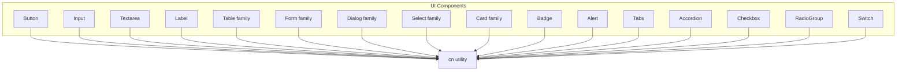

**Diagram sources**
- [button.tsx:1-59](file://frontend/src/components/ui/button.tsx#L1-L59)
- [input.tsx:1-22](file://frontend/src/components/ui/input.tsx#L1-L22)
- [textarea.tsx:1-19](file://frontend/src/components/ui/textarea.tsx#L1-L19)
- [label.tsx:1-25](file://frontend/src/components/ui/label.tsx#L1-L25)
- [table.tsx:1-117](file://frontend/src/components/ui/table.tsx#L1-L117)
- [form.tsx:1-169](file://frontend/src/components/ui/form.tsx#L1-L169)
- [dialog.tsx:1-136](file://frontend/src/components/ui/dialog.tsx#L1-L136)
- [select.tsx:1-190](file://frontend/src/components/ui/select.tsx#L1-L190)
- [card.tsx:1-93](file://frontend/src/components/ui/card.tsx#L1-L93)
- [badge.tsx:1-47](file://frontend/src/components/ui/badge.tsx#L1-L47)
- [alert.tsx:1-67](file://frontend/src/components/ui/alert.tsx#L1-L67)
- [tabs.tsx:1-67](file://frontend/src/components/ui/tabs.tsx#L1-L67)
- [accordion.tsx:1-67](file://frontend/src/components/ui/accordion.tsx#L1-L67)
- [checkbox.tsx:1-33](file://frontend/src/components/ui/checkbox.tsx#L1-L33)
- [radio-group.tsx:1-46](file://frontend/src/components/ui/radio-group.tsx#L1-L46)
- [switch.tsx:1-32](file://frontend/src/components/ui/switch.tsx#L1-L32)
- [utils.ts:1-7](file://frontend/src/components/ui/utils.ts#L1-L7)

**Section sources**
- [utils.ts:1-7](file://frontend/src/components/ui/utils.ts#L1-L7)

## Core Components
This section summarizes the primary components, their roles, and shared patterns.

- Button: Variants and sizes with focus-visible rings and disabled states.
- Input and Textarea: Consistent focus-visible rings, invalid state styling, and responsive text sizing.
- Table family: Container plus head/body/footer/row/cell/caption parts.
- Form family: Provider, Field, Label, Control, Description, Message with accessibility attributes.
- Dialog family: Root, Trigger, Portal, Overlay, Content, Header/Footer, Title, Description.
- Select family: Root, Trigger, Content, Item, Label, Scroll buttons, Separator.
- Card family: Card, Header, Title, Description, Action, Content, Footer.
- Badge: Variants with focus-visible rings and optional child rendering.
- Alert: Variants with icon grid layout and description styling.
- Tabs, Accordion: Primitive-driven with consistent focus-visible rings and transitions.
- Checkbox, RadioGroup, Switch: Primitive-driven with indicator visuals and focus-visible rings.

**Section sources**
- [button.tsx:1-59](file://frontend/src/components/ui/button.tsx#L1-L59)
- [input.tsx:1-22](file://frontend/src/components/ui/input.tsx#L1-L22)
- [textarea.tsx:1-19](file://frontend/src/components/ui/textarea.tsx#L1-L19)
- [table.tsx:1-117](file://frontend/src/components/ui/table.tsx#L1-L117)
- [form.tsx:1-169](file://frontend/src/components/ui/form.tsx#L1-L169)
- [dialog.tsx:1-136](file://frontend/src/components/ui/dialog.tsx#L1-L136)
- [select.tsx:1-190](file://frontend/src/components/ui/select.tsx#L1-L190)
- [card.tsx:1-93](file://frontend/src/components/ui/card.tsx#L1-L93)
- [badge.tsx:1-47](file://frontend/src/components/ui/badge.tsx#L1-L47)
- [alert.tsx:1-67](file://frontend/src/components/ui/alert.tsx#L1-L67)
- [tabs.tsx:1-67](file://frontend/src/components/ui/tabs.tsx#L1-L67)
- [accordion.tsx:1-67](file://frontend/src/components/ui/accordion.tsx#L1-L67)
- [checkbox.tsx:1-33](file://frontend/src/components/ui/checkbox.tsx#L1-L33)
- [radio-group.tsx:1-46](file://frontend/src/components/ui/radio-group.tsx#L1-L46)
- [switch.tsx:1-32](file://frontend/src/components/ui/switch.tsx#L1-L32)

## Architecture Overview
The component library follows a consistent pattern:
- Base components accept className and spread props to underlying DOM nodes.
- Focus-visible rings and invalid-state styling are applied via Tailwind utilities.
- Composite components wrap Radix UI primitives to expose accessible, styled APIs.
- A central cn utility merges clsx and tailwind-merge for deterministic class merging.

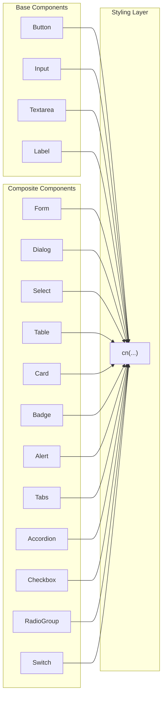

**Diagram sources**
- [utils.ts:1-7](file://frontend/src/components/ui/utils.ts#L1-L7)
- [button.tsx:1-59](file://frontend/src/components/ui/button.tsx#L1-L59)
- [input.tsx:1-22](file://frontend/src/components/ui/input.tsx#L1-L22)
- [textarea.tsx:1-19](file://frontend/src/components/ui/textarea.tsx#L1-L19)
- [label.tsx:1-25](file://frontend/src/components/ui/label.tsx#L1-L25)
- [form.tsx:1-169](file://frontend/src/components/ui/form.tsx#L1-L169)
- [dialog.tsx:1-136](file://frontend/src/components/ui/dialog.tsx#L1-L136)
- [select.tsx:1-190](file://frontend/src/components/ui/select.tsx#L1-L190)
- [table.tsx:1-117](file://frontend/src/components/ui/table.tsx#L1-L117)
- [card.tsx:1-93](file://frontend/src/components/ui/card.tsx#L1-L93)
- [badge.tsx:1-47](file://frontend/src/components/ui/badge.tsx#L1-L47)
- [alert.tsx:1-67](file://frontend/src/components/ui/alert.tsx#L1-L67)
- [tabs.tsx:1-67](file://frontend/src/components/ui/tabs.tsx#L1-L67)
- [accordion.tsx:1-67](file://frontend/src/components/ui/accordion.tsx#L1-L67)
- [checkbox.tsx:1-33](file://frontend/src/components/ui/checkbox.tsx#L1-L33)
- [radio-group.tsx:1-46](file://frontend/src/components/ui/radio-group.tsx#L1-L46)
- [switch.tsx:1-32](file://frontend/src/components/ui/switch.tsx#L1-L32)

## Detailed Component Analysis

### Button
- Purpose: Primary action affordance with variants and sizes.
- Props:
  - variant: default, destructive, outline, secondary, ghost, link
  - size: default, sm, lg, icon
  - asChild: render as Radix Slot
  - Additional button props (e.g., onClick, disabled)
- Styling:
  - Focus-visible ring with configurable color intensity
  - Disabled state opacity and pointer-events
  - SVG sizing and alignment helpers
- Accessibility:
  - Inherits native button semantics
  - Focus-visible ring for keyboard navigation

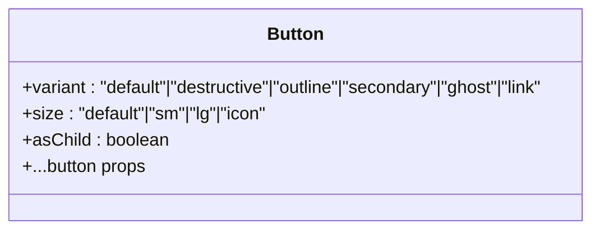

**Diagram sources**
- [button.tsx:37-56](file://frontend/src/components/ui/button.tsx#L37-L56)

**Section sources**
- [button.tsx:1-59](file://frontend/src/components/ui/button.tsx#L1-L59)

### Input
- Purpose: Single-line text input with consistent focus and invalid states.
- Props:
  - type: input type
  - className: additional classes
  - Other input props
- Styling:
  - Focus-visible ring with ring color
  - Invalid state ring and border
  - Responsive text size adjustments
- Accessibility:
  - Proper labeling via parent FormLabel or external label

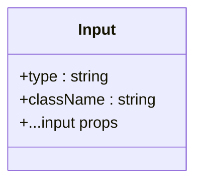

**Diagram sources**
- [input.tsx:5-19](file://frontend/src/components/ui/input.tsx#L5-L19)

**Section sources**
- [input.tsx:1-22](file://frontend/src/components/ui/input.tsx#L1-L22)

### Textarea
- Purpose: Multi-line text area with resize control disabled.
- Props:
  - className: additional classes
  - Other textarea props
- Styling:
  - Focus-visible ring and invalid state styling
  - Responsive text size
- Accessibility:
  - Proper labeling via FormLabel

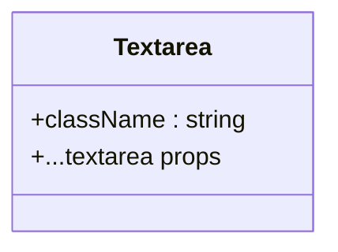

**Diagram sources**
- [textarea.tsx:5-18](file://frontend/src/components/ui/textarea.tsx#L5-L18)

**Section sources**
- [textarea.tsx:1-19](file://frontend/src/components/ui/textarea.tsx#L1-L19)

### Label
- Purpose: Associates text with form controls.
- Props:
  - className: additional classes
  - Other label props
- Styling:
  - Disabled state handling via group/disabled selectors
- Accessibility:
  - Uses Radix UI label primitive for proper association

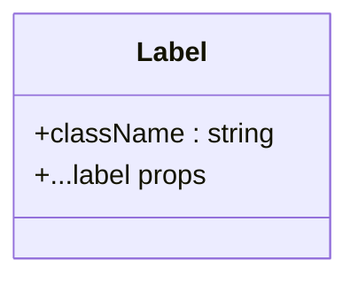

**Diagram sources**
- [label.tsx:8-22](file://frontend/src/components/ui/label.tsx#L8-L22)

**Section sources**
- [label.tsx:1-25](file://frontend/src/components/ui/label.tsx#L1-L25)

### Table family
- Purpose: Semantic data display with responsive container.
- Components:
  - Table, TableHeader, TableBody, TableFooter, TableRow, TableHead, TableCell, TableCaption
- Styling:
  - Hover and selected states
  - Responsive horizontal scrolling container
  - Focus-visible ring helpers on interactive rows
- Accessibility:
  - Semantic HTML table structure

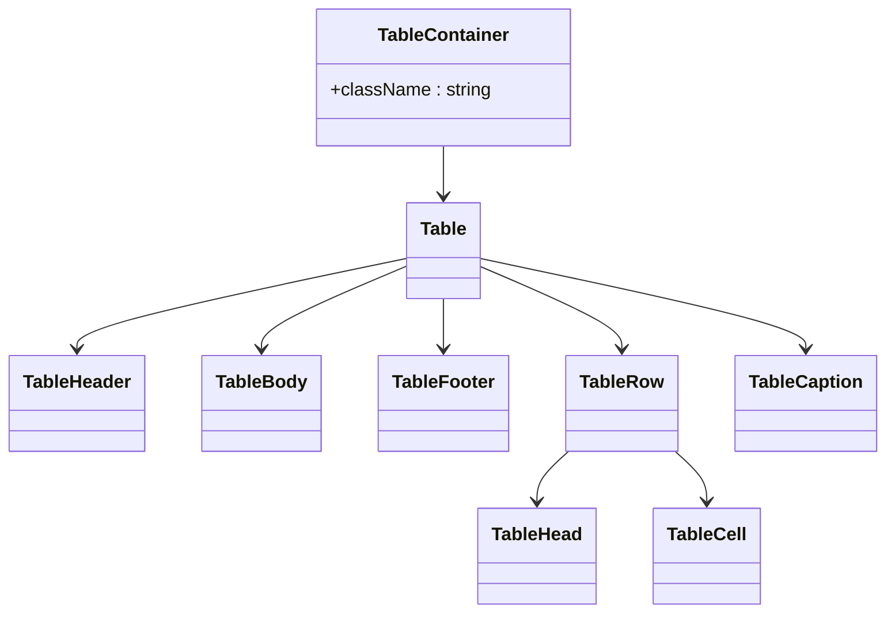

**Diagram sources**
- [table.tsx:7-116](file://frontend/src/components/ui/table.tsx#L7-L116)

**Section sources**
- [table.tsx:1-117](file://frontend/src/components/ui/table.tsx#L1-L117)

### Form family
- Purpose: Integrates react-hook-form with accessible labels and messages.
- Components:
  - Form (FormProvider), FormItem, FormLabel, FormControl, FormDescription, FormMessage, FormField
- Behaviors:
  - useFormField reads field state and generates aria-* attributes
  - Controlled integration with Radix UI label and slot primitives
- Accessibility:
  - aria-describedby and aria-invalid propagation
  - Unique ids per field item

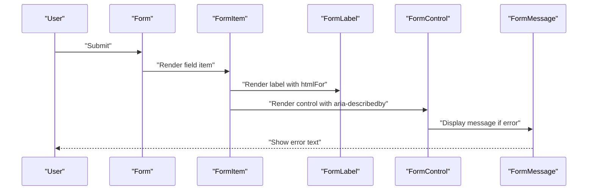

**Diagram sources**
- [form.tsx:19-168](file://frontend/src/components/ui/form.tsx#L19-L168)

**Section sources**
- [form.tsx:1-169](file://frontend/src/components/ui/form.tsx#L1-L169)

### Dialog family
- Purpose: Modal overlay with focus trapping and close affordance.
- Components:
  - Dialog, DialogTrigger, DialogPortal, DialogOverlay, DialogContent, DialogHeader, DialogFooter, DialogTitle, DialogDescription
- Behaviors:
  - Overlay animation on open/close
  - Centered content with max width constraints
  - Close button with screen reader text
- Accessibility:
  - Focus trap via portal and overlay
  - Proper roles and labels

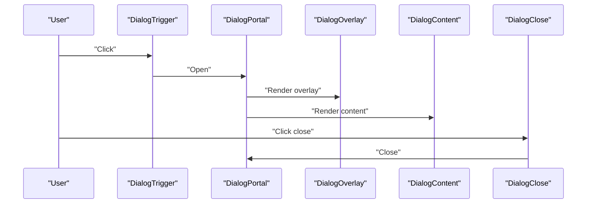

**Diagram sources**
- [dialog.tsx:9-73](file://frontend/src/components/ui/dialog.tsx#L9-L73)

**Section sources**
- [dialog.tsx:1-136](file://frontend/src/components/ui/dialog.tsx#L1-L136)

### Select family
- Purpose: Accessible dropdown with keyboard navigation and scrollable viewport.
- Components:
  - Select, SelectGroup, SelectValue, SelectTrigger (with size), SelectContent (with position), SelectLabel, SelectItem, SelectSeparator, SelectScrollUpButton, SelectScrollDownButton
- Behaviors:
  - Trigger supports two sizes
  - Content supports popper positioning
  - Items render check indicators
- Accessibility:
  - Uses Radix UI Select primitives
  - Scroll buttons for large option sets

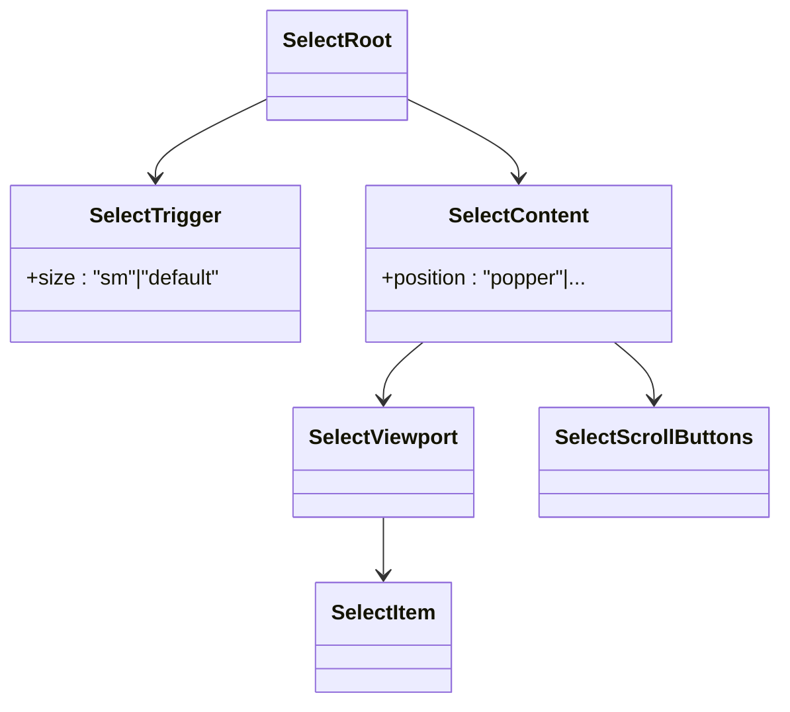

**Diagram sources**
- [select.tsx:13-189](file://frontend/src/components/ui/select.tsx#L13-L189)

**Section sources**
- [select.tsx:1-190](file://frontend/src/components/ui/select.tsx#L1-L190)

### Card family
- Purpose: Content grouping with header, title, description, action, content, footer.
- Components:
  - Card, CardHeader, CardTitle, CardDescription, CardAction, CardContent, CardFooter
- Styling:
  - Grid-based header layout with optional action column
  - Consistent spacing and border radius

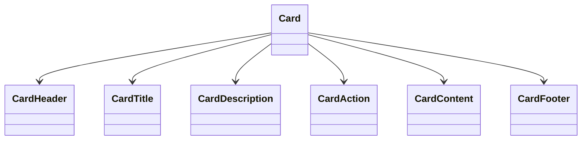

**Diagram sources**
- [card.tsx:5-92](file://frontend/src/components/ui/card.tsx#L5-L92)

**Section sources**
- [card.tsx:1-93](file://frontend/src/components/ui/card.tsx#L1-L93)

### Badge
- Purpose: Short status or metadata labels.
- Props:
  - variant: default, secondary, destructive, outline
  - asChild: render as Radix Slot
  - Additional span props
- Styling:
  - Focus-visible ring and invalid state styling
  - Gap and size helpers for icons

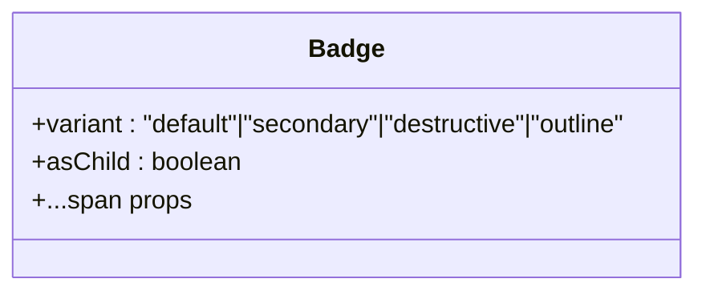

**Diagram sources**
- [badge.tsx:28-44](file://frontend/src/components/ui/badge.tsx#L28-L44)

**Section sources**
- [badge.tsx:1-47](file://frontend/src/components/ui/badge.tsx#L1-L47)

### Alert
- Purpose: Non-modal notifications with optional icon and description.
- Props:
  - variant: default, destructive
  - Additional div props
- Styling:
  - Icon grid layout when an icon is present
  - Variant-specific text and background colors

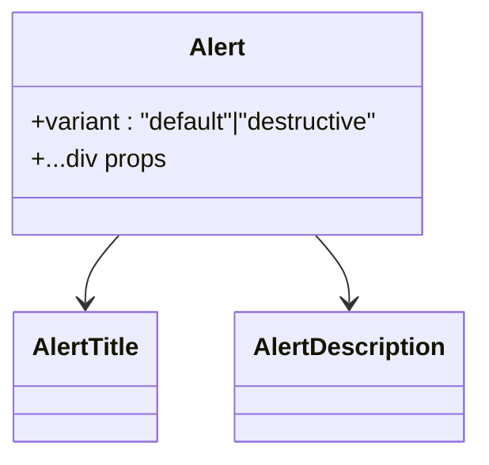

**Diagram sources**
- [alert.tsx:22-66](file://frontend/src/components/ui/alert.tsx#L22-L66)

**Section sources**
- [alert.tsx:1-67](file://frontend/src/components/ui/alert.tsx#L1-L67)

### Tabs
- Purpose: Organize content into selectable sections.
- Components:
  - Tabs, TabsList, TabsTrigger, TabsContent
- Styling:
  - Focus-visible ring and transitions
  - Active state styling

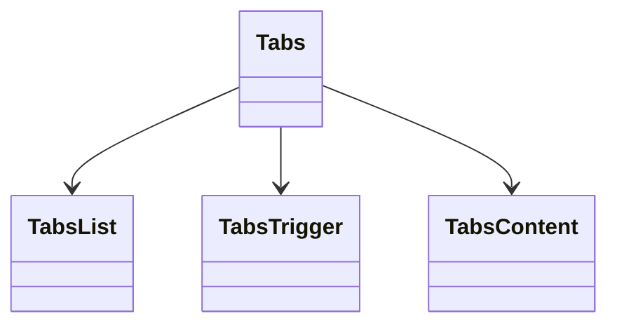

**Diagram sources**
- [tabs.tsx:8-66](file://frontend/src/components/ui/tabs.tsx#L8-L66)

**Section sources**
- [tabs.tsx:1-67](file://frontend/src/components/ui/tabs.tsx#L1-L67)

### Accordion
- Purpose: Collapsible content sections.
- Components:
  - Accordion, AccordionItem, AccordionTrigger, AccordionContent
- Behaviors:
  - Animated open/close with chevron rotation
  - Focus-visible ring and transitions

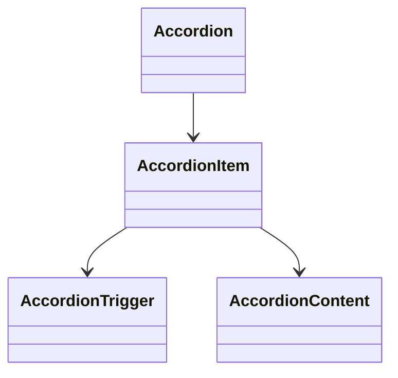

**Diagram sources**
- [accordion.tsx:9-66](file://frontend/src/components/ui/accordion.tsx#L9-L66)

**Section sources**
- [accordion.tsx:1-67](file://frontend/src/components/ui/accordion.tsx#L1-L67)

### Checkbox
- Purpose: Binary selection with visual indicator.
- Props:
  - className: additional classes
  - Other checkbox props
- Styling:
  - Focus-visible ring and checked state background/text
  - Disabled state handling

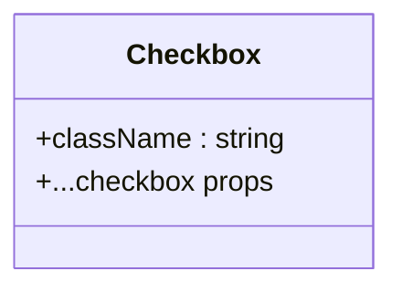

**Diagram sources**
- [checkbox.tsx:9-30](file://frontend/src/components/ui/checkbox.tsx#L9-L30)

**Section sources**
- [checkbox.tsx:1-33](file://frontend/src/components/ui/checkbox.tsx#L1-L33)

### RadioGroup
- Purpose: Single-selection among multiple options.
- Components:
  - RadioGroup, RadioGroupItem
- Styling:
  - Focus-visible ring and checked indicator
  - Disabled state handling

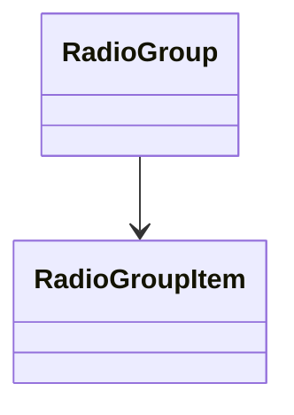

**Diagram sources**
- [radio-group.tsx:9-45](file://frontend/src/components/ui/radio-group.tsx#L9-L45)

**Section sources**
- [radio-group.tsx:1-46](file://frontend/src/components/ui/radio-group.tsx#L1-L46)

### Switch
- Purpose: Toggle state with thumb animation.
- Props:
  - className: additional classes
  - Other switch props
- Styling:
  - Checked/unchecked backgrounds and thumb translation
  - Focus-visible ring

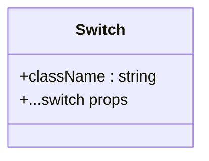

**Diagram sources**
- [switch.tsx:8-29](file://frontend/src/components/ui/switch.tsx#L8-L29)

**Section sources**
- [switch.tsx:1-32](file://frontend/src/components/ui/switch.tsx#L1-L32)

## Dependency Analysis
- Internal dependencies:
  - All components depend on the cn utility for class merging.
  - Composite components wrap Radix UI primitives for accessibility and behavior.
- External dependencies:
  - class-variance-authority for variant-based styling
  - lucide-react for icons
  - @radix-ui/react-* for accessible primitives
  - react-hook-form for form integration

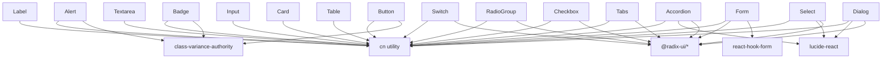

**Diagram sources**
- [utils.ts:1-7](file://frontend/src/components/ui/utils.ts#L1-L7)
- [button.tsx:1-59](file://frontend/src/components/ui/button.tsx#L1-L59)
- [dialog.tsx:1-136](file://frontend/src/components/ui/dialog.tsx#L1-L136)
- [select.tsx:1-190](file://frontend/src/components/ui/select.tsx#L1-L190)
- [form.tsx:1-169](file://frontend/src/components/ui/form.tsx#L1-L169)
- [accordion.tsx:1-67](file://frontend/src/components/ui/accordion.tsx#L1-L67)
- [tabs.tsx:1-67](file://frontend/src/components/ui/tabs.tsx#L1-L67)
- [checkbox.tsx:1-33](file://frontend/src/components/ui/checkbox.tsx#L1-L33)
- [radio-group.tsx:1-46](file://frontend/src/components/ui/radio-group.tsx#L1-L46)
- [switch.tsx:1-32](file://frontend/src/components/ui/switch.tsx#L1-L32)
- [table.tsx:1-117](file://frontend/src/components/ui/table.tsx#L1-L117)
- [card.tsx:1-93](file://frontend/src/components/ui/card.tsx#L1-L93)
- [badge.tsx:1-47](file://frontend/src/components/ui/badge.tsx#L1-L47)
- [alert.tsx:1-67](file://frontend/src/components/ui/alert.tsx#L1-L67)
- [input.tsx:1-22](file://frontend/src/components/ui/input.tsx#L1-L22)
- [textarea.tsx:1-19](file://frontend/src/components/ui/textarea.tsx#L1-L19)
- [label.tsx:1-25](file://frontend/src/components/ui/label.tsx#L1-L25)

**Section sources**
- [utils.ts:1-7](file://frontend/src/components/ui/utils.ts#L1-L7)
- [button.tsx:1-59](file://frontend/src/components/ui/button.tsx#L1-L59)
- [dialog.tsx:1-136](file://frontend/src/components/ui/dialog.tsx#L1-L136)
- [select.tsx:1-190](file://frontend/src/components/ui/select.tsx#L1-L190)
- [form.tsx:1-169](file://frontend/src/components/ui/form.tsx#L1-L169)
- [accordion.tsx:1-67](file://frontend/src/components/ui/accordion.tsx#L1-L67)
- [tabs.tsx:1-67](file://frontend/src/components/ui/tabs.tsx#L1-L67)
- [checkbox.tsx:1-33](file://frontend/src/components/ui/checkbox.tsx#L1-L33)
- [radio-group.tsx:1-46](file://frontend/src/components/ui/radio-group.tsx#L1-L46)
- [switch.tsx:1-32](file://frontend/src/components/ui/switch.tsx#L1-L32)
- [table.tsx:1-117](file://frontend/src/components/ui/table.tsx#L1-L117)
- [card.tsx:1-93](file://frontend/src/components/ui/card.tsx#L1-L93)
- [badge.tsx:1-47](file://frontend/src/components/ui/badge.tsx#L1-L47)
- [alert.tsx:1-67](file://frontend/src/components/ui/alert.tsx#L1-L67)
- [input.tsx:1-22](file://frontend/src/components/ui/input.tsx#L1-L22)
- [textarea.tsx:1-19](file://frontend/src/components/ui/textarea.tsx#L1-L19)
- [label.tsx:1-25](file://frontend/src/components/ui/label.tsx#L1-L25)

## Performance Considerations
- Prefer variant-based styling with class-variance-authority to minimize runtime conditionals.
- Use the cn utility to merge classes efficiently and avoid redundant Tailwind rules.
- Limit heavy animations to visible states (e.g., dialog open/close) and keep transitions short.
- For large tables, rely on the horizontal scroll container to avoid layout thrashing.
- Defer expensive computations inside event handlers; leverage controlled components from react-hook-form.

## Accessibility Features
- Focus management:
  - Buttons, inputs, selects, and dialogs apply focus-visible rings for keyboard navigation.
- ARIA attributes:
  - Form components set aria-describedby and aria-invalid based on field state.
  - Dialogs use role and semantic labels for overlays and content.
- Semantics:
  - Tables use thead/tbody/tfoot/tr/th/td for screen readers.
  - Labels associate with controls via htmlFor.
- Keyboard support:
  - Select, Tabs, Accordion, and Switch are keyboard navigable via Radix UI primitives.

## Responsive Behavior
- Typography scales with responsive text size utilities.
- Inputs and textareas adapt to mobile and desktop text sizes.
- Dialog content centers and constrains width with max-width utilities.
- Tables use horizontal scrolling to remain usable on small screens.

## Usage Examples and Composition Patterns
- Button variants and sizes:
  - Use variant="destructive" for danger actions; variant="outline" for secondary actions; variant="link" for inline actions.
  - Use size="sm" or "lg" to fit compact or spacious layouts; size="icon" for IconButton patterns.
- Input and Textarea:
  - Pair Input with FormLabel and FormMessage for accessible forms.
  - Use invalid state styling by setting aria-invalid on inputs.
- Table:
  - Wrap data in Table with TableHeader/TableBody/TableFooter; use TableRow and TableCell consistently.
- Form:
  - Wrap fields in FormItem; pair FormLabel with FormControl; show FormMessage when errors occur.
- Dialog:
  - Use DialogTrigger to open; place DialogHeader/DialogFooter around content; include DialogTitle and DialogDescription.
- Select:
  - Use SelectTrigger with size="sm" for compact dropdowns; SelectContent with position="popper" for standard placement.
- Card:
  - Use CardHeader with CardTitle and optional CardAction; place controls in CardContent and actions in CardFooter.
- Badge:
  - Use variant="secondary" for neutral badges; variant="destructive" for error-related badges.
- Alert:
  - Use variant="destructive" for error notifications; include an icon for emphasis.
- Tabs, Accordion:
  - Use Tabs for horizontal navigation; use Accordion for vertical collapsible sections.
- Checkbox, RadioGroup, Switch:
  - Use consistent focus-visible rings and disabled states for accessible interactions.

## Troubleshooting Guide
- Button focus ring not visible:
  - Ensure focus-visible ring utilities are included in Tailwind configuration.
- Input invalid state not applying:
  - Verify aria-invalid is set on the input element; confirm variant styles are not overridden.
- Dialog not closing:
  - Confirm DialogTrigger and DialogClose are wired correctly; ensure Portal renders in the DOM.
- Select options not visible:
  - Check SelectContent position and viewport sizing; ensure SelectScrollUpButton/DownButton are present for long lists.
- Form validation not reflected:
  - Ensure useFormField is called within FormField; verify react-hook-form state updates.
- Table overflow issues:
  - Confirm the Table container has overflow-x-auto; adjust column widths to prevent wrapping.

**Section sources**
- [button.tsx:1-59](file://frontend/src/components/ui/button.tsx#L1-L59)
- [input.tsx:1-22](file://frontend/src/components/ui/input.tsx#L1-L22)
- [dialog.tsx:1-136](file://frontend/src/components/ui/dialog.tsx#L1-L136)
- [select.tsx:1-190](file://frontend/src/components/ui/select.tsx#L1-L190)
- [form.tsx:1-169](file://frontend/src/components/ui/form.tsx#L1-L169)
- [table.tsx:1-117](file://frontend/src/components/ui/table.tsx#L1-L117)

## Conclusion
The PPA UI component library provides a cohesive, accessible, and theme-friendly set of React components styled with Tailwind CSS. By leveraging class-variance-authority, Radix UI primitives, and a centralized cn utility, components maintain consistent behavior and appearance while enabling flexible customization. The documented patterns and examples facilitate rapid development and reliable user experiences across diverse contexts.