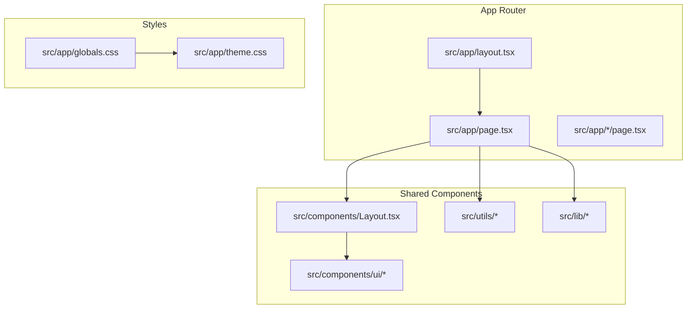
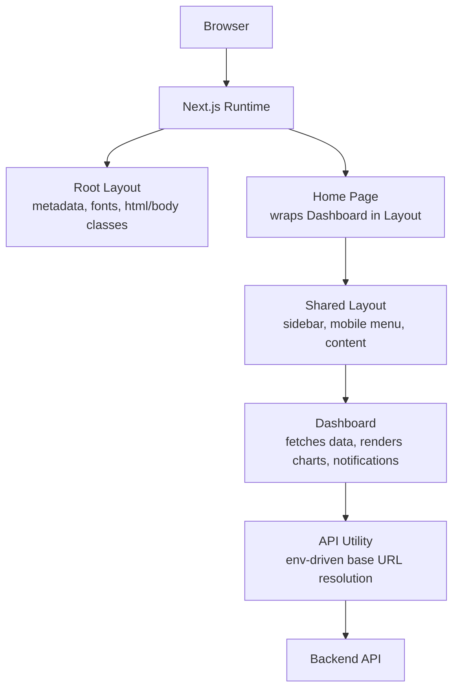
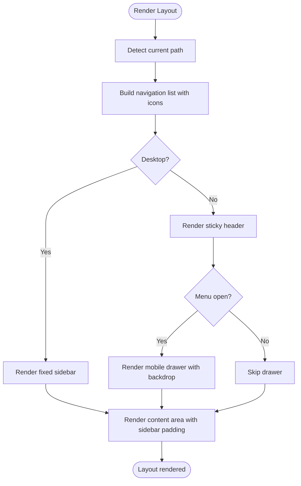
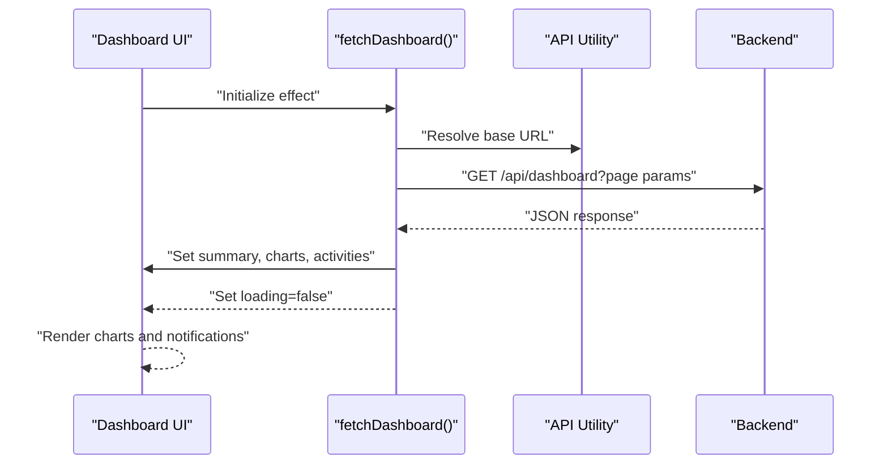
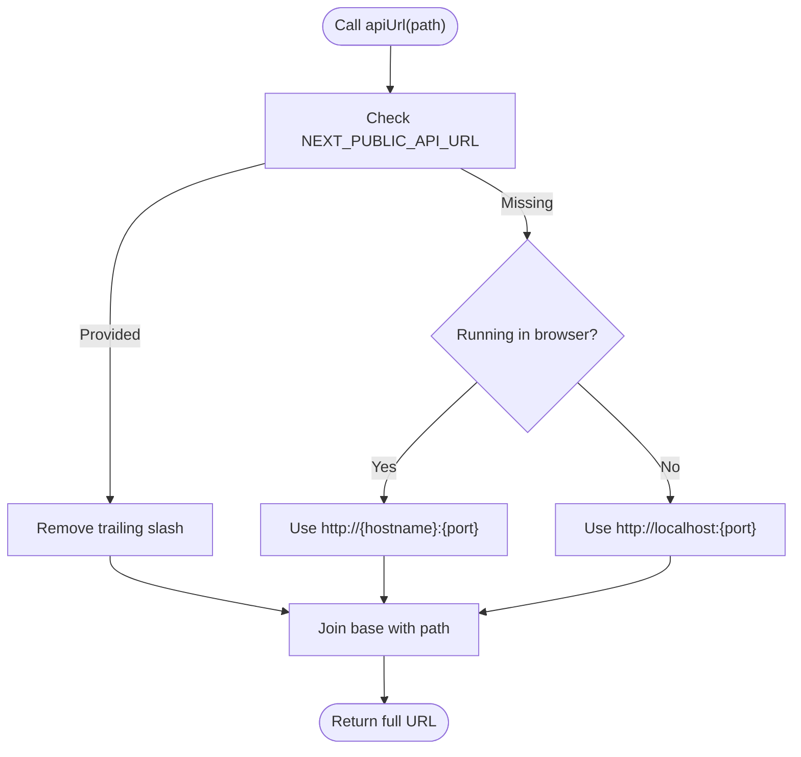
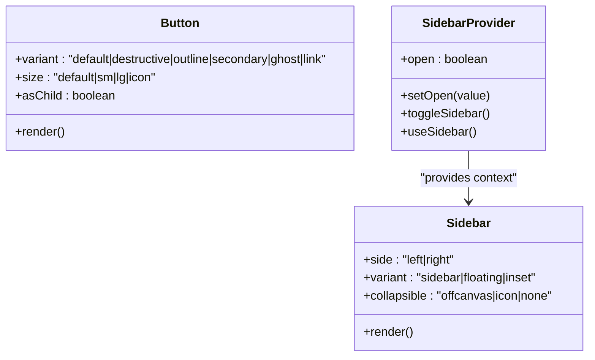
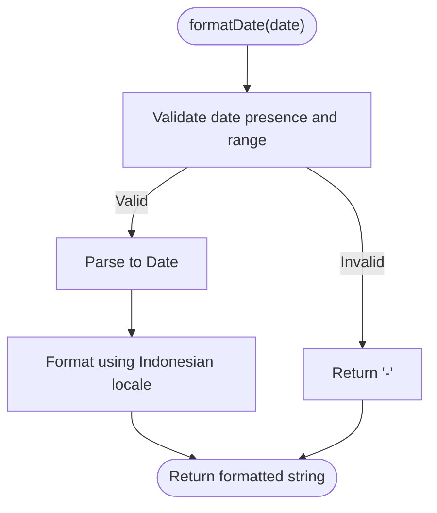
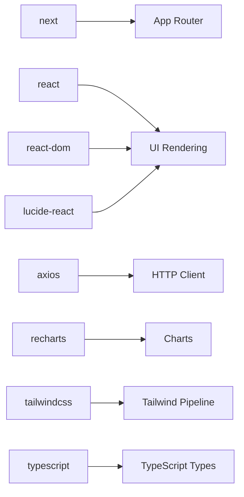

# Frontend Architecture

<cite>
**Referenced Files in This Document**
- [layout.tsx](file://frontend/src/app/layout.tsx)
- [page.tsx](file://frontend/src/app/page.tsx)
- [Layout.tsx](file://frontend/src/components/Layout.tsx)
- [Dashboard.tsx](file://frontend/src/components/pages/Dashboard.tsx)
- [api.ts](file://frontend/src/lib/api.ts)
- [sidebar.tsx](file://frontend/src/components/ui/sidebar.tsx)
- [button.tsx](file://frontend/src/components/ui/button.tsx)
- [utils.ts](file://frontend/src/components/ui/utils.ts)
- [globals.css](file://frontend/src/app/globals.css)
- [theme.css](file://frontend/src/app/theme.css)
- [dateFormat.ts](file://frontend/src/utils/dateFormat.ts)
- [package.json](file://frontend/package.json)
- [tsconfig.json](file://frontend/tsconfig.json)
- [next.config.ts](file://frontend/next.config.ts)
</cite>

## Table of Contents
1. [Introduction](#introduction)
2. [Project Structure](#project-structure)
3. [Core Components](#core-components)
4. [Architecture Overview](#architecture-overview)
5. [Detailed Component Analysis](#detailed-component-analysis)
6. [Dependency Analysis](#dependency-analysis)
7. [Performance Considerations](#performance-considerations)
8. [Troubleshooting Guide](#troubleshooting-guide)
9. [Conclusion](#conclusion)
10. [Appendices](#appendices)

## Introduction
This document describes the frontend architecture of the PPA Next.js application. It covers the page-based routing model, component hierarchy, state management patterns, TypeScript integration, Tailwind CSS styling approach, reusable component library organization, API integration layer, data fetching strategies, error handling mechanisms, layout system, responsive design, UI patterns, component composition, prop drilling solutions, performance optimizations, and frontend-backend communication.

## Project Structure
The frontend follows Next.js App Router conventions with a strict separation between pages and shared components:
- Pages under src/app define route segments and page components.
- Shared UI components live under src/components/ui organized by atomic design.
- Page-specific components are under src/components/pages.
- Global styles and theme are defined in src/app/globals.css and src/app/theme.css.
- Utilities and helpers reside under src/utils and src/lib.

**Diagram sources**
- [layout.tsx:1-34](file://frontend/src/app/layout.tsx#L1-L34)
- [page.tsx:1-12](file://frontend/src/app/page.tsx#L1-L12)
- [Layout.tsx:1-161](file://frontend/src/components/Layout.tsx#L1-L161)
- [globals.css:1-2](file://frontend/src/app/globals.css#L1-L2)
- [theme.css](file://frontend/src/app/theme.css)

**Section sources**
- [layout.tsx:1-34](file://frontend/src/app/layout.tsx#L1-L34)
- [page.tsx:1-12](file://frontend/src/app/page.tsx#L1-L12)
- [globals.css:1-2](file://frontend/src/app/globals.css#L1-L2)

## Core Components
- Root layout and metadata are defined in the root layout file, setting fonts and global classes.
- The home page composes the shared Layout wrapper and the Dashboard page component.
- The Layout component provides a responsive sidebar navigation, mobile menu, and content container.
- The Dashboard component orchestrates data fetching, state updates, charts rendering, and paginated lists.

Key responsibilities:
- Root layout: metadata, font loading, HTML and body classes.
- Home page: minimal composition to wrap content with Layout.
- Layout: navigation, responsive sidebar, mobile drawer, and content area.
- Dashboard: API integration, state management, charts, notifications, and pagination.

**Section sources**
- [layout.tsx:1-34](file://frontend/src/app/layout.tsx#L1-L34)
- [page.tsx:1-12](file://frontend/src/app/page.tsx#L1-L12)
- [Layout.tsx:1-161](file://frontend/src/components/Layout.tsx#L1-L161)
- [Dashboard.tsx:1-668](file://frontend/src/components/pages/Dashboard.tsx#L1-L668)

## Architecture Overview
The frontend uses Next.js App Router with a single-page shell pattern. The Layout component acts as a shell around pages, providing persistent navigation and responsive behavior. Data is fetched via a centralized API utility that resolves base URLs from environment variables or browser context.

**Diagram sources**
- [layout.tsx:1-34](file://frontend/src/app/layout.tsx#L1-L34)
- [page.tsx:1-12](file://frontend/src/app/page.tsx#L1-L12)
- [Layout.tsx:1-161](file://frontend/src/components/Layout.tsx#L1-L161)
- [Dashboard.tsx:1-668](file://frontend/src/components/pages/Dashboard.tsx#L1-L668)
- [api.ts:1-19](file://frontend/src/lib/api.ts#L1-L19)

## Detailed Component Analysis

### Layout Component
The Layout component encapsulates:
- Navigation items mapped from a static list with icons and active state detection.
- Desktop sidebar with hover and active styles.
- Mobile drawer with backdrop and close controls.
- Content area with left padding to accommodate the sidebar.

Implementation highlights:
- Uses Next.js usePathname for active link detection.
- Mobile menu toggled via local state.
- Responsive breakpoints using Tailwind utilities.

**Diagram sources**
- [Layout.tsx:19-161](file://frontend/src/components/Layout.tsx#L19-L161)

**Section sources**
- [Layout.tsx:1-161](file://frontend/src/components/Layout.tsx#L1-L161)

### Dashboard Component
The Dashboard component demonstrates:
- TypeScript interfaces for API responses and local state.
- Async data fetching with URLSearchParams for pagination.
- Error handling with fallback UI and console logging.
- Recharts integration for bar and pie charts.
- Local state for notifications visibility and pagination.
- Formatting utilities for dates and currency-like values.

**Diagram sources**
- [Dashboard.tsx:173-214](file://frontend/src/components/pages/Dashboard.tsx#L173-L214)
- [api.ts:15-18](file://frontend/src/lib/api.ts#L15-L18)

**Section sources**
- [Dashboard.tsx:1-668](file://frontend/src/components/pages/Dashboard.tsx#L1-L668)
- [api.ts:1-19](file://frontend/src/lib/api.ts#L1-L19)

### API Integration Layer
The API utility centralizes base URL resolution:
- Reads NEXT_PUBLIC_API_URL if provided.
- Falls back to window.location hostname with NEXT_PUBLIC_API_PORT.
- Defaults to localhost:8080 when running server-side.
- Provides a helper to normalize paths.

**Diagram sources**
- [api.ts:1-19](file://frontend/src/lib/api.ts#L1-L19)

**Section sources**
- [api.ts:1-19](file://frontend/src/lib/api.ts#L1-L19)

### Reusable UI Library Organization
The UI library follows a component-first approach:
- Variants and sizes are standardized using class-variance-authority and Tailwind classes.
- Utilities like cn combine clsx and tailwind-merge for robust class merging.
- Components expose consistent props and data attributes for styling hooks.

Examples:
- Button component defines variants and sizes with a consistent API.
- Sidebar component provides a provider/context pattern for stateful behavior across nested components.

**Diagram sources**
- [button.tsx:1-59](file://frontend/src/components/ui/button.tsx#L1-L59)
- [sidebar.tsx:56-152](file://frontend/src/components/ui/sidebar.tsx#L56-L152)

**Section sources**
- [button.tsx:1-59](file://frontend/src/components/ui/button.tsx#L1-L59)
- [sidebar.tsx:1-727](file://frontend/src/components/ui/sidebar.tsx#L1-L727)
- [utils.ts:1-7](file://frontend/src/components/ui/utils.ts#L1-L7)

### Date Formatting Utilities
The dateFormat module provides:
- Validation for expiration dates within acceptable bounds.
- Formatting for Indonesian locale date and combined date-time strings.

**Diagram sources**
- [dateFormat.ts:20-48](file://frontend/src/utils/dateFormat.ts#L20-L48)

**Section sources**
- [dateFormat.ts:1-49](file://frontend/src/utils/dateFormat.ts#L1-L49)

## Dependency Analysis
External dependencies relevant to architecture:
- next: framework runtime and App Router.
- react, react-dom: UI rendering and DOM integration.
- lucide-react: UI icons used in layouts and buttons.
- axios: HTTP client (declared but not used in the analyzed files).
- recharts: Charting library used in Dashboard.
- tailwindcss and related packages: Styling pipeline.
- typescript and @types: Type safety.

**Diagram sources**
- [package.json:11-31](file://frontend/package.json#L11-L31)

**Section sources**
- [package.json:1-33](file://frontend/package.json#L1-L33)

## Performance Considerations
- Client directive usage: The 'use client' directive is applied in Layout and Dashboard to enable client-side interactivity and state.
- Lazy loading: Consider dynamic imports for heavy components like charts to defer load until needed.
- Memoization: Use React.memo for stable child components and useMemo/useCallback for derived values in Dashboard.
- Image optimization: Utilize Next.js Image component for optimized assets.
- CSS optimization: Keep global styles minimal and scoped; leverage Tailwind utilities to avoid duplication.
- API caching: Implement request deduplication and caching strategies at the component level to reduce redundant network calls.
- Pagination: Already implemented in Dashboard reduces initial payload sizes.

[No sources needed since this section provides general guidance]

## Troubleshooting Guide
Common areas to inspect:
- Environment variables for API base URL resolution.
- Network errors during fetch calls and error boundaries.
- Active navigation highlighting logic in Layout.
- Chart rendering conditions and empty states.
- Notification panel visibility and click-outside handling.

Actions:
- Verify NEXT_PUBLIC_API_URL and NEXT_PUBLIC_API_PORT values.
- Check browser console for fetch errors and logs.
- Confirm pathname matching logic for active links.
- Ensure proper cleanup of event listeners and timers.

**Section sources**
- [api.ts:1-19](file://frontend/src/lib/api.ts#L1-L19)
- [Layout.tsx:24-80](file://frontend/src/components/Layout.tsx#L24-L80)
- [Dashboard.tsx:173-214](file://frontend/src/components/pages/Dashboard.tsx#L173-L214)

## Conclusion
The PPA Next.js frontend employs a clean, modular architecture with a strong emphasis on:
- Clear separation of concerns between pages, shared components, and utilities.
- A responsive layout with a robust sidebar and mobile drawer.
- Centralized API utilities for flexible backend integration.
- Strong TypeScript typing and Tailwind-based styling.
- Practical data fetching patterns with error handling and pagination.

This foundation supports scalability, maintainability, and a consistent developer experience across the application.

[No sources needed since this section summarizes without analyzing specific files]

## Appendices

### TypeScript Configuration
- Strict mode enabled with modern JSX transform and bundler module resolution.
- Path aliases configured to simplify imports.

**Section sources**
- [tsconfig.json:1-35](file://frontend/tsconfig.json#L1-L35)

### Next.js Configuration
- Minimal configuration file present; defaults apply.

**Section sources**
- [next.config.ts:1-8](file://frontend/next.config.ts#L1-L8)

### Global Styles and Theme
- Global CSS imports Tailwind and theme files.
- Theme variables and tokens are defined centrally.

**Section sources**
- [globals.css:1-2](file://frontend/src/app/globals.css#L1-L2)
- [theme.css](file://frontend/src/app/theme.css)