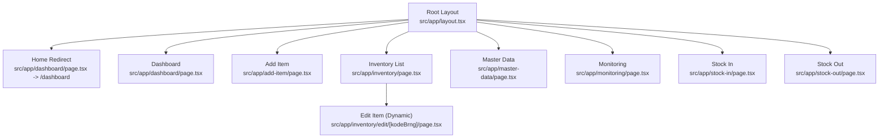
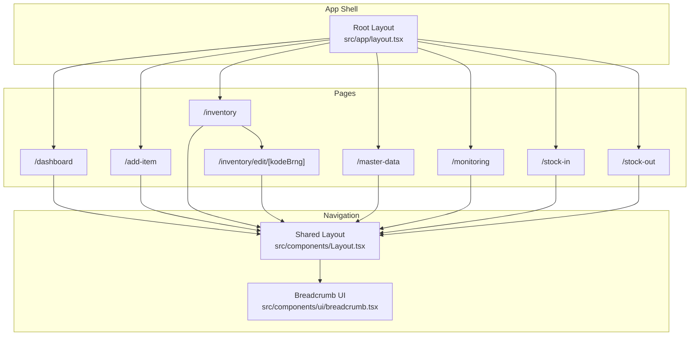
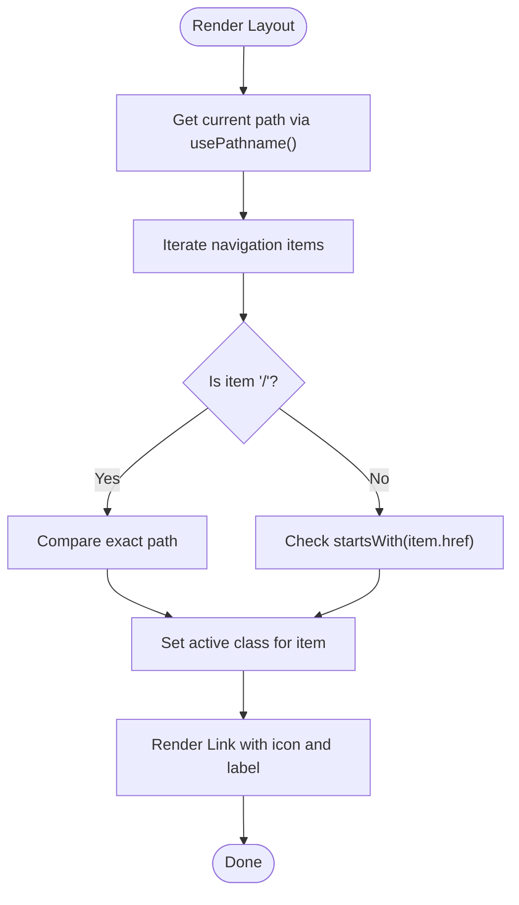
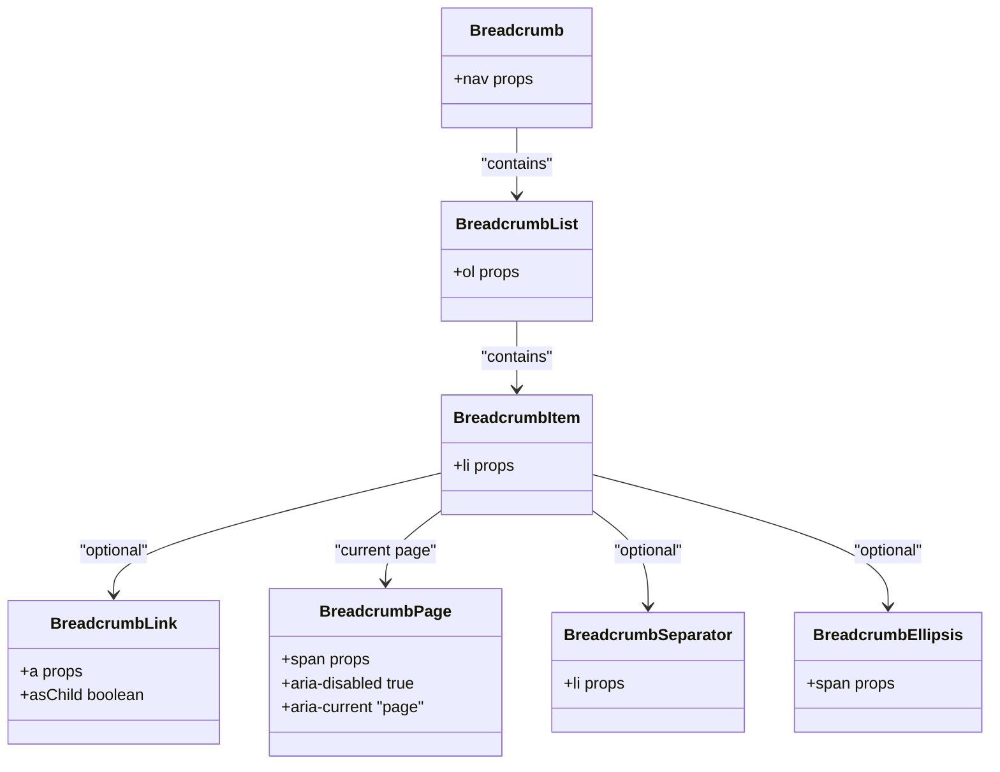
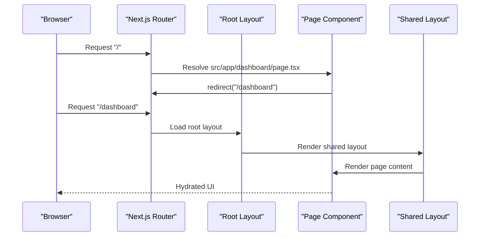
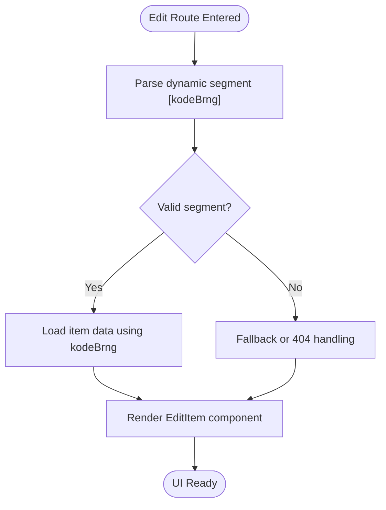
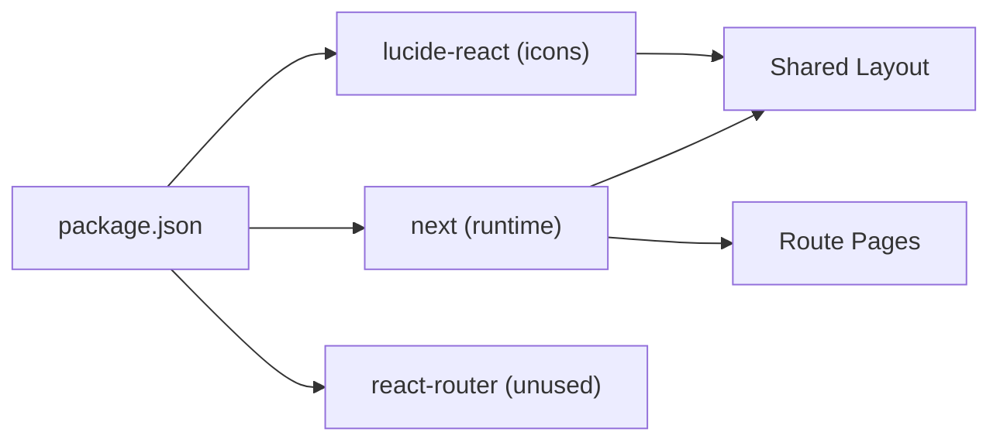

# Routing & Navigation

<cite>
**Referenced Files in This Document**
- [layout.tsx](file://frontend/src/app/layout.tsx)
- [Layout.tsx](file://frontend/src/components/Layout.tsx)
- [breadcrumb.tsx](file://frontend/src/components/ui/breadcrumb.tsx)
- [next.config.ts](file://frontend/next.config.ts)
- [package.json](file://frontend/package.json)
- [page.tsx](file://frontend/src/app/page.tsx)
- [dashboard/page.tsx](file://frontend/src/app/dashboard/page.tsx)
- [add-item/page.tsx](file://frontend/src/app/add-item/page.tsx)
- [inventory/page.tsx](file://frontend/src/app/inventory/page.tsx)
- [inventory/edit/[kodeBrng]/page.tsx](file://frontend/src/app/inventory/edit/[kodeBrng]/page.tsx)
- [master-data/page.tsx](file://frontend/src/app/master-data/page.tsx)
- [monitoring/page.tsx](file://frontend/src/app/monitoring/page.tsx)
- [stock-in/page.tsx](file://frontend/src/app/stock-in/page.tsx)
- [stock-out/page.tsx](file://frontend/src/app/stock-out/page.tsx)
</cite>

## Table of Contents
1. [Introduction](#introduction)
2. [Project Structure](#project-structure)
3. [Core Components](#core-components)
4. [Architecture Overview](#architecture-overview)
5. [Detailed Component Analysis](#detailed-component-analysis)
6. [Dependency Analysis](#dependency-analysis)
7. [Performance Considerations](#performance-considerations)
8. [Troubleshooting Guide](#troubleshooting-guide)
9. [Conclusion](#conclusion)

## Introduction
This document explains the Next.js routing system and navigation patterns used in the PPA frontend. It covers the page-based routing architecture, dynamic routing, navigation flow, layout integration, active link highlighting, breadcrumbs, client-side navigation, and performance considerations. The goal is to help developers understand how URLs map to pages, how navigation works across sections, and how to extend or optimize the routing system.

## Project Structure
The frontend follows Next.js App Router conventions under the src/app directory. Each route is represented by a folder with a page.tsx file. Dynamic segments are supported via square bracket notation. A shared root layout wraps all pages, while a reusable client-side Layout component manages navigation and responsive behavior.

**Diagram sources**
- [layout.tsx:1-34](file://frontend/src/app/layout.tsx#L1-L34)
- [dashboard/page.tsx:1-5](file://frontend/src/app/dashboard/page.tsx#L1-L5)
- [add-item/page.tsx:1-12](file://frontend/src/app/add-item/page.tsx#L1-L12)
- [inventory/page.tsx:1-12](file://frontend/src/app/inventory/page.tsx#L1-L12)
- [inventory/edit/[kodeBrng]/page.tsx](file://frontend/src/app/inventory/edit/[kodeBrng]/page.tsx#L1-L12)
- [master-data/page.tsx:1-13](file://frontend/src/app/master-data/page.tsx#L1-L13)
- [monitoring/page.tsx:1-12](file://frontend/src/app/monitoring/page.tsx#L1-L12)
- [stock-in/page.tsx:1-12](file://frontend/src/app/stock-in/page.tsx#L1-L12)
- [stock-out/page.tsx:1-12](file://frontend/src/app/stock-out/page.tsx#L1-L12)

**Section sources**
- [layout.tsx:1-34](file://frontend/src/app/layout.tsx#L1-L34)
- [dashboard/page.tsx:1-5](file://frontend/src/app/dashboard/page.tsx#L1-L5)
- [add-item/page.tsx:1-12](file://frontend/src/app/add-item/page.tsx#L1-L12)
- [inventory/page.tsx:1-12](file://frontend/src/app/inventory/page.tsx#L1-L12)
- [inventory/edit/[kodeBrng]/page.tsx](file://frontend/src/app/inventory/edit/[kodeBrng]/page.tsx#L1-L12)
- [master-data/page.tsx:1-13](file://frontend/src/app/master-data/page.tsx#L1-L13)
- [monitoring/page.tsx:1-12](file://frontend/src/app/monitoring/page.tsx#L1-L12)
- [stock-in/page.tsx:1-12](file://frontend/src/app/stock-in/page.tsx#L1-L12)
- [stock-out/page.tsx:1-12](file://frontend/src/app/stock-out/page.tsx#L1-L12)

## Core Components
- Root Layout: Provides global metadata and HTML wrapper for all pages.
- Shared Layout: Implements sidebar navigation, mobile menu, and active link highlighting using Next.js client-side hooks.
- Breadcrumb UI: Reusable component for hierarchical navigation indicators.
- Pages: Each route is a small page component that renders the shared Layout and a feature-specific component.

Key routing and navigation behaviors:
- Static routes: mapped directly to folders under src/app.
- Dynamic route: inventory edit uses a catch-all segment [kodeBrng].
- Active link detection: compares current path with navigation item href; special handling for root path.
- Client-side navigation: Next.js Link and usePathname enable SPA-like transitions.

**Section sources**
- [layout.tsx:1-34](file://frontend/src/app/layout.tsx#L1-L34)
- [Layout.tsx:1-161](file://frontend/src/components/Layout.tsx#L1-L161)
- [breadcrumb.tsx:1-110](file://frontend/src/components/ui/breadcrumb.tsx#L1-L110)
- [page.tsx:1-12](file://frontend/src/app/page.tsx#L1-L12)
- [dashboard/page.tsx:1-5](file://frontend/src/app/dashboard/page.tsx#L1-L5)
- [inventory/edit/[kodeBrng]/page.tsx](file://frontend/src/app/inventory/edit/[kodeBrng]/page.tsx#L1-L12)

## Architecture Overview
The routing architecture combines Next.js App Router with a custom client-side Layout component. The root layout sets global metadata and HTML attributes. Each page composes the shared Layout, which encapsulates navigation, responsive behavior, and active state styling.

**Diagram sources**
- [layout.tsx:1-34](file://frontend/src/app/layout.tsx#L1-L34)
- [Layout.tsx:1-161](file://frontend/src/components/Layout.tsx#L1-L161)
- [breadcrumb.tsx:1-110](file://frontend/src/components/ui/breadcrumb.tsx#L1-L110)
- [dashboard/page.tsx:1-5](file://frontend/src/app/dashboard/page.tsx#L1-L5)
- [add-item/page.tsx:1-12](file://frontend/src/app/add-item/page.tsx#L1-L12)
- [inventory/page.tsx:1-12](file://frontend/src/app/inventory/page.tsx#L1-L12)
- [inventory/edit/[kodeBrng]/page.tsx](file://frontend/src/app/inventory/edit/[kodeBrng]/page.tsx#L1-L12)
- [master-data/page.tsx:1-13](file://frontend/src/app/master-data/page.tsx#L1-L13)
- [monitoring/page.tsx:1-12](file://frontend/src/app/monitoring/page.tsx#L1-L12)
- [stock-in/page.tsx:1-12](file://frontend/src/app/stock-in/page.tsx#L1-L12)
- [stock-out/page.tsx:1-12](file://frontend/src/app/stock-out/page.tsx#L1-L12)

## Detailed Component Analysis

### Root Layout
- Purpose: Sets global metadata and wraps all pages with HTML and body classes.
- Behavior: Provides font variables and base HTML attributes for consistent rendering.

**Section sources**
- [layout.tsx:1-34](file://frontend/src/app/layout.tsx#L1-L34)

### Shared Layout (Navigation and Active States)
- Navigation items: Defined statically and rendered into sidebar and mobile menus.
- Active link detection:
  - Root path "/" requires exact match.
  - Other paths use prefix matching to highlight parent sections.
- Mobile responsiveness: Toggles a modal overlay with navigation list.
- Integration: Each page renders this Layout to inherit navigation and styles.

**Diagram sources**
- [Layout.tsx:24-80](file://frontend/src/components/Layout.tsx#L24-L80)

**Section sources**
- [Layout.tsx:1-161](file://frontend/src/components/Layout.tsx#L1-L161)

### Breadcrumb UI
- Composition: Breadcrumb, BreadcrumbList, BreadcrumbItem, BreadcrumbLink, BreadcrumbPage, BreadcrumbSeparator, BreadcrumbEllipsis.
- Accessibility: Uses roles and aria attributes to indicate current page and separators.
- Flexibility: Supports both anchor and slot-based composition.

**Diagram sources**
- [breadcrumb.tsx:7-109](file://frontend/src/components/ui/breadcrumb.tsx#L7-L109)

**Section sources**
- [breadcrumb.tsx:1-110](file://frontend/src/components/ui/breadcrumb.tsx#L1-L110)

### Pages and Route Mapping
- Home redirect: The root route redirects to the dashboard path.
- Static routes: Each feature area has a dedicated folder with a page.tsx.
- Dynamic route: The edit route accepts a parameterized segment for item codes.

**Diagram sources**
- [page.tsx:1-12](file://frontend/src/app/page.tsx#L1-L12)
- [dashboard/page.tsx:1-5](file://frontend/src/app/dashboard/page.tsx#L1-L5)
- [layout.tsx:1-34](file://frontend/src/app/layout.tsx#L1-L34)
- [Layout.tsx:1-161](file://frontend/src/components/Layout.tsx#L1-L161)

**Section sources**
- [page.tsx:1-12](file://frontend/src/app/page.tsx#L1-L12)
- [dashboard/page.tsx:1-5](file://frontend/src/app/dashboard/page.tsx#L1-L5)
- [add-item/page.tsx:1-12](file://frontend/src/app/add-item/page.tsx#L1-L12)
- [inventory/page.tsx:1-12](file://frontend/src/app/inventory/page.tsx#L1-L12)
- [inventory/edit/[kodeBrng]/page.tsx](file://frontend/src/app/inventory/edit/[kodeBrng]/page.tsx#L1-L12)
- [master-data/page.tsx:1-13](file://frontend/src/app/master-data/page.tsx#L1-L13)
- [monitoring/page.tsx:1-12](file://frontend/src/app/monitoring/page.tsx#L1-L12)
- [stock-in/page.tsx:1-12](file://frontend/src/app/stock-in/page.tsx#L1-L12)
- [stock-out/page.tsx:1-12](file://frontend/src/app/stock-out/page.tsx#L1-L12)

### Dynamic Routing Implementation
- Segment pattern: [kodeBrng] enables dynamic routing for editing items.
- Parameter access: The dynamic segment is available to the page component and can be used to load or render specific item data.
- Usage: The edit page imports the EditItem component and renders it inside the shared Layout.

**Diagram sources**
- [inventory/edit/[kodeBrng]/page.tsx](file://frontend/src/app/inventory/edit/[kodeBrng]/page.tsx#L1-L12)

**Section sources**
- [inventory/edit/[kodeBrng]/page.tsx](file://frontend/src/app/inventory/edit/[kodeBrng]/page.tsx#L1-L12)

### Navigation State Management
- Active state: Determined by comparing the current path with navigation items; root uses exact match, others use prefix matching.
- Mobile state: Controlled by a local state flag toggled via UI actions.
- Styling: Conditional classes apply active styles based on the active state.

**Section sources**
- [Layout.tsx:24-80](file://frontend/src/components/Layout.tsx#L24-L80)
- [Layout.tsx:106-150](file://frontend/src/components/Layout.tsx#L106-L150)

### Route Protection Mechanisms
- Current implementation: No explicit route protection is present in the analyzed files.
- Recommended approach: Introduce middleware or guards at the page level to check authentication/authorization before rendering protected routes.

[No sources needed since this section provides general guidance]

### Navigation Component Usage and Active Link Highlighting
- Link component: next/link is used for client-side navigation.
- Active highlighting: Computed per item using the current path; root and nested routes handled distinctly.
- Icon integration: Icons from lucide-react are rendered conditionally based on active state.

**Section sources**
- [Layout.tsx:27-80](file://frontend/src/components/Layout.tsx#L27-L80)
- [Layout.tsx:127-146](file://frontend/src/components/Layout.tsx#L127-L146)

### Breadcrumb Implementation
- Structure: Composed of list items with links and separators; current page indicated with aria attributes.
- Composition: Supports both anchor and slot-based rendering for flexibility.
- Styling: Tailwind utility classes applied for responsive behavior and hover states.

**Section sources**
- [breadcrumb.tsx:1-110](file://frontend/src/components/ui/breadcrumb.tsx#L1-L110)

### Client-Side Navigation and Prefetching Strategies
- Client-side navigation: Implemented via next/link and next/navigation hooks.
- Prefetching: Next.js automatically prefetches visible links; additional prefetching can be configured per page or globally.
- Performance: Keep navigation lists concise and avoid unnecessary re-renders by leveraging stable references.

**Section sources**
- [Layout.tsx:3-4](file://frontend/src/components/Layout.tsx#L3-L4)
- [Layout.tsx:24-25](file://frontend/src/components/Layout.tsx#L24-L25)

## Dependency Analysis
- Next.js runtime: Version pinned in package.json; ensures compatibility with App Router and navigation features.
- UI icons: lucide-react provides icons for navigation items.
- Navigation library: react-router is included but not used in the App Router setup; focus remains on Next.js Link and navigation hooks.

**Diagram sources**
- [package.json:11-21](file://frontend/package.json#L11-L21)
- [Layout.tsx:1-161](file://frontend/src/components/Layout.tsx#L1-L161)

**Section sources**
- [package.json:1-33](file://frontend/package.json#L1-L33)

## Performance Considerations
- Keep navigation lists minimal to reduce DOM and re-render costs.
- Use shallow routing patterns for frequent updates within a single page.
- Leverage Next.js automatic prefetching; avoid manual prefetching unless necessary.
- Lazy-load heavy components on demand to improve initial load times.

[No sources needed since this section provides general guidance]

## Troubleshooting Guide
- Incorrect active link highlighting:
  - Verify exact vs prefix matching logic for root and nested routes.
  - Ensure pathname comparisons align with expected href values.
- Dynamic route parameter handling:
  - Confirm the dynamic segment name matches the folder name.
  - Validate parameter extraction and fallback behavior in the page component.
- Redirect loops:
  - Check redirect destinations to avoid cycles.
- Mobile menu state:
  - Ensure state toggles are bound to proper event handlers and overlays close on click outside.

**Section sources**
- [Layout.tsx:24-80](file://frontend/src/components/Layout.tsx#L24-L80)
- [Layout.tsx:106-150](file://frontend/src/components/Layout.tsx#L106-L150)
- [dashboard/page.tsx:1-5](file://frontend/src/app/dashboard/page.tsx#L1-L5)

## Conclusion
The PPA frontend leverages Next.js App Router to implement a clean, page-based routing model with a shared Layout component managing navigation and responsive behavior. Static and dynamic routes are straightforwardly mapped, and active link highlighting is handled efficiently. Extending the system involves adding new pages, integrating route protection, and optionally enhancing breadcrumbs and prefetching strategies.