# State Management & Data Flow

<cite>
**Referenced Files in This Document**
- [api.ts](file://frontend/src/lib/api.ts)
- [dateFormat.ts](file://frontend/src/utils/dateFormat.ts)
- [Dashboard.tsx](file://frontend/src/components/pages/Dashboard.tsx)
- [AddItem.tsx](file://frontend/src/components/pages/AddItem.tsx)
- [Inventory.tsx](file://frontend/src/components/pages/Inventory.tsx)
- [StockIn.tsx](file://frontend/src/components/pages/StockIn.tsx)
- [StockOut.tsx](file://frontend/src/components/pages/StockOut.tsx)
- [MasterData.tsx](file://frontend/src/components/pages/MasterData.tsx)
- [Layout.tsx](file://frontend/src/components/Layout.tsx)
- [page.tsx](file://frontend/src/app/page.tsx)
- [package.json](file://frontend/package.json)
</cite>

## Table of Contents
1. [Introduction](#introduction)
2. [Project Structure](#project-structure)
3. [Core Components](#core-components)
4. [Architecture Overview](#architecture-overview)
5. [Detailed Component Analysis](#detailed-component-analysis)
6. [Dependency Analysis](#dependency-analysis)
7. [Performance Considerations](#performance-considerations)
8. [Troubleshooting Guide](#troubleshooting-guide)
9. [Conclusion](#conclusion)

## Introduction
This document explains state management and data flow patterns in the PPA frontend. It covers how components fetch and manage data, how loading and error states are handled, and how user interactions update component state. It also documents data transformation utilities, date formatting helpers, and validation approaches used across the application. The frontend relies on native browser APIs for data fetching and React hooks for state management, without external state libraries.

## Project Structure
The frontend is a Next.js application organized by feature pages under the app directory and shared components under components. Shared utilities for API base URLs and date formatting live under lib and utils respectively. The application uses a single global layout component to render page-specific components.

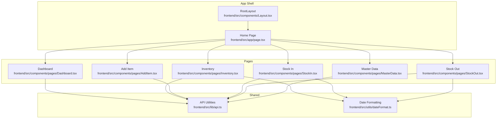

**Diagram sources**
- [Layout.tsx:19-160](file://frontend/src/components/Layout.tsx#L19-L160)
- [page.tsx:1-12](file://frontend/src/app/page.tsx#L1-L12)
- [Dashboard.tsx:1-668](file://frontend/src/components/pages/Dashboard.tsx#L1-L668)
- [Inventory.tsx:1-606](file://frontend/src/components/pages/Inventory.tsx#L1-L606)
- [AddItem.tsx:1-708](file://frontend/src/components/pages/AddItem.tsx#L1-L708)
- [StockIn.tsx:1-425](file://frontend/src/components/pages/StockIn.tsx#L1-L425)
- [StockOut.tsx:1-529](file://frontend/src/components/pages/StockOut.tsx#L1-L529)
- [MasterData.tsx:1-536](file://frontend/src/components/pages/MasterData.tsx#L1-L536)
- [api.ts:1-19](file://frontend/src/lib/api.ts#L1-L19)
- [dateFormat.ts:1-49](file://frontend/src/utils/dateFormat.ts#L1-L49)

**Section sources**
- [Layout.tsx:19-160](file://frontend/src/components/Layout.tsx#L19-L160)
- [page.tsx:1-12](file://frontend/src/app/page.tsx#L1-L12)
- [api.ts:1-19](file://frontend/src/lib/api.ts#L1-L19)
- [dateFormat.ts:1-49](file://frontend/src/utils/dateFormat.ts#L1-L49)

## Core Components
- API utilities: Centralize base URL resolution and endpoint construction to avoid duplication and ensure consistency across network requests.
- Date formatting: Provide robust validation and formatting for expiration and transaction dates, ensuring consistent display and safe fallbacks.
- Page components: Each page encapsulates its own state, data fetching, and rendering logic, using React hooks and browser-native fetch/axios.

Key responsibilities:
- API utilities: Build absolute URLs for backend endpoints.
- Date formatting: Validate and format dates for display.
- Pages: Manage local state, loading/error indicators, and user interactions; fetch data on mount or on demand; update UI accordingly.

**Section sources**
- [api.ts:1-19](file://frontend/src/lib/api.ts#L1-L19)
- [dateFormat.ts:1-49](file://frontend/src/utils/dateFormat.ts#L1-L49)
- [Dashboard.tsx:157-214](file://frontend/src/components/pages/Dashboard.tsx#L157-L214)
- [Inventory.tsx:62-132](file://frontend/src/components/pages/Inventory.tsx#L62-L132)
- [AddItem.tsx:17-117](file://frontend/src/components/pages/AddItem.tsx#L17-L117)
- [StockIn.tsx:46-82](file://frontend/src/components/pages/StockIn.tsx#L46-L82)
- [StockOut.tsx:92-131](file://frontend/src/components/pages/StockOut.tsx#L92-L131)
- [MasterData.tsx:58-118](file://frontend/src/components/pages/MasterData.tsx#L58-L118)

## Architecture Overview
The frontend follows a straightforward data flow:
- Components declare local state via React hooks.
- On mount or user action, components fetch data from backend endpoints.
- Responses are parsed and stored in component-local state.
- UI renders based on current state, including loading and error indicators.
- Mutations trigger updates (e.g., adding items, deleting inventory) and refresh lists.

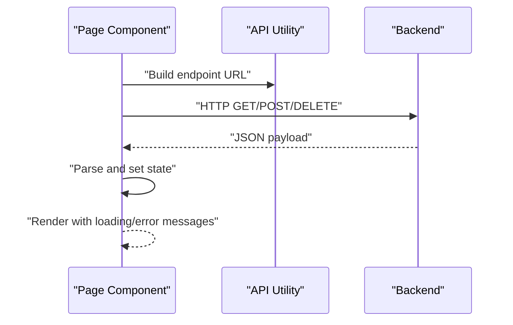

**Diagram sources**
- [Dashboard.tsx:173-214](file://frontend/src/components/pages/Dashboard.tsx#L173-L214)
- [Inventory.tsx:77-132](file://frontend/src/components/pages/Inventory.tsx#L77-L132)
- [AddItem.tsx:101-117](file://frontend/src/components/pages/AddItem.tsx#L101-L117)
- [StockIn.tsx:61-82](file://frontend/src/components/pages/StockIn.tsx#L61-L82)
- [StockOut.tsx:110-131](file://frontend/src/components/pages/StockOut.tsx#L110-L131)
- [MasterData.tsx:76-118](file://frontend/src/components/pages/MasterData.tsx#L76-L118)
- [api.ts:15-18](file://frontend/src/lib/api.ts#L15-L18)

## Detailed Component Analysis

### Dashboard
- State: Manages summary metrics, distribution data, stock movement charts, recent activities, pagination, and error/loading flags.
- Fetching: Uses fetch with URLSearchParams for pagination and sets state upon successful response; clears state and sets error on failure.
- Rendering: Displays KPI cards, charts, and paginated activity list; shows loading or error placeholders while data is pending.
- Data transformation: Converts backend arrays into chart-ready structures and formats dates for display.

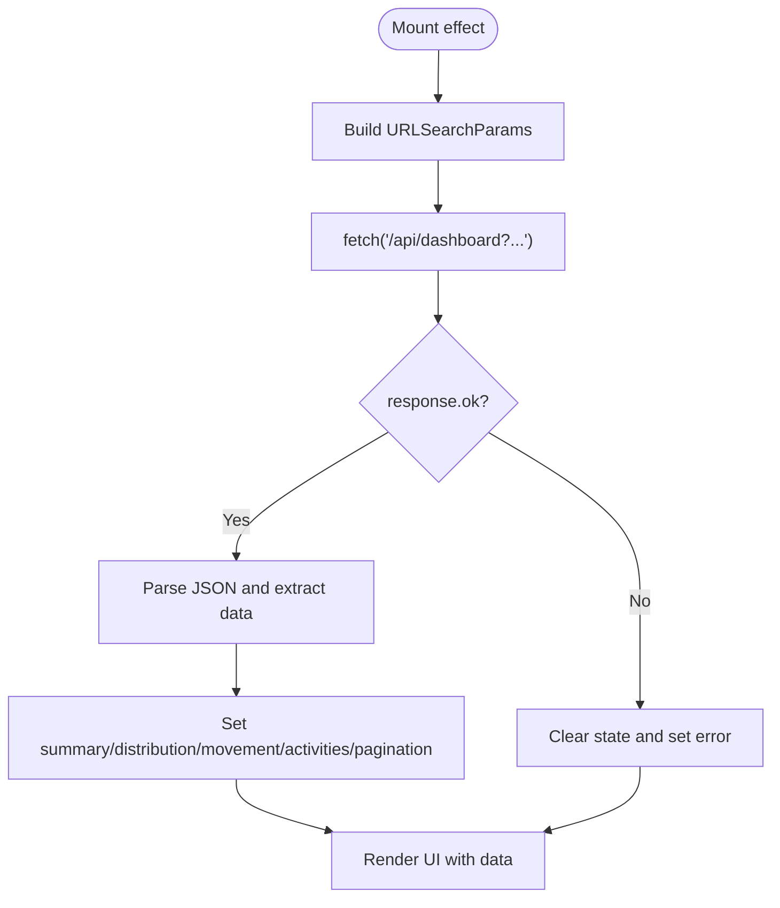

**Diagram sources**
- [Dashboard.tsx:173-214](file://frontend/src/components/pages/Dashboard.tsx#L173-L214)

**Section sources**
- [Dashboard.tsx:157-214](file://frontend/src/components/pages/Dashboard.tsx#L157-L214)
- [Dashboard.tsx:216-256](file://frontend/src/components/pages/Dashboard.tsx#L216-L256)
- [Dashboard.tsx:384-461](file://frontend/src/components/pages/Dashboard.tsx#L384-L461)

### Inventory
- State: Holds items list, master filters (medicine types, item types), search query, selected filters, pagination page, and temporary messages.
- Fetching: Loads items and master data concurrently on mount; uses axios for GET requests; supports manual refresh via a dedicated function.
- Filtering and pagination: Client-side filtering and slicing; maintains page state and recalculates total pages.
- Deletion: Confirms deletion, performs DELETE request, resets confirmation state, shows feedback, and refreshes items.

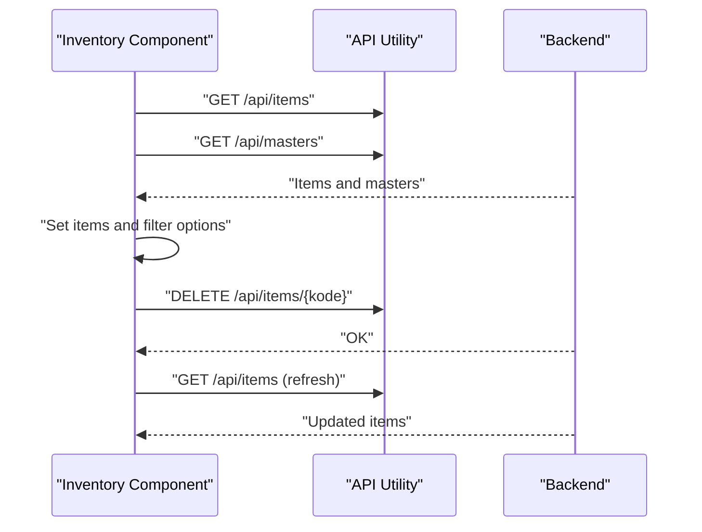

**Diagram sources**
- [Inventory.tsx:77-132](file://frontend/src/components/pages/Inventory.tsx#L77-L132)
- [Inventory.tsx:134-173](file://frontend/src/components/pages/Inventory.tsx#L134-L173)

**Section sources**
- [Inventory.tsx:62-132](file://frontend/src/components/pages/Inventory.tsx#L62-L132)
- [Inventory.tsx:134-173](file://frontend/src/components/pages/Inventory.tsx#L134-L173)
- [Inventory.tsx:201-233](file://frontend/src/components/pages/Inventory.tsx#L201-L233)

### Add Item
- State: Tracks form inputs, pricing calculations, and master options (units, categories, suppliers).
- Fetching: Loads master data on mount; submits new item via POST with transformed numeric values and formatted dates.
- Validation: Checks required fields and positive stock before submission; displays success/error messages with auto-dismiss.
- Pricing: Computes margins based on purchase price and updates suggested selling prices.

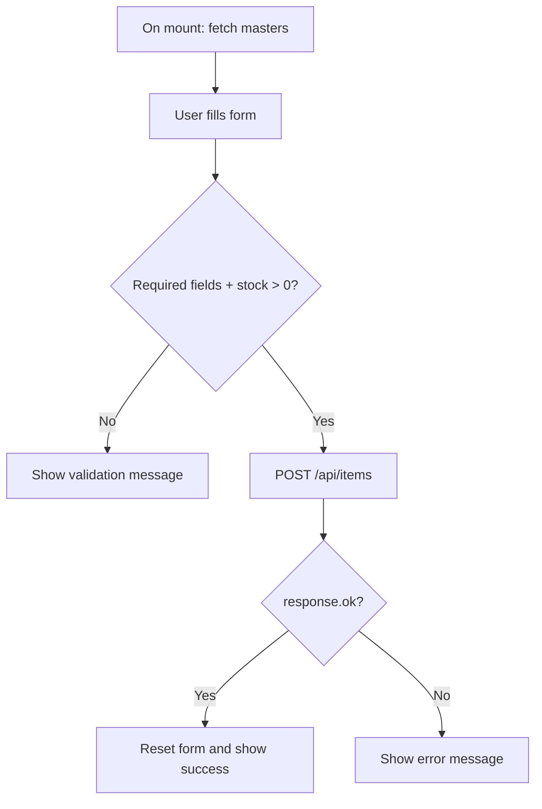

**Diagram sources**
- [AddItem.tsx:101-117](file://frontend/src/components/pages/AddItem.tsx#L101-L117)
- [AddItem.tsx:119-224](file://frontend/src/components/pages/AddItem.tsx#L119-L224)

**Section sources**
- [AddItem.tsx:17-117](file://frontend/src/components/pages/AddItem.tsx#L17-L117)
- [AddItem.tsx:119-224](file://frontend/src/components/pages/AddItem.tsx#L119-L224)

### Stock In
- State: Stores search term, item suggestions, selected item, recent transactions, and form fields (quantity, price, batch/facture, purchase date, expiry).
- Fetching: Debounced search via fetch; loads recent stock-in history on mount; submits form to create new stock-in record.
- Validation: Ensures selection, quantity, and required identifiers; shows temporary messages for feedback.
- Formatting: Formats currency and numbers for user input and display.

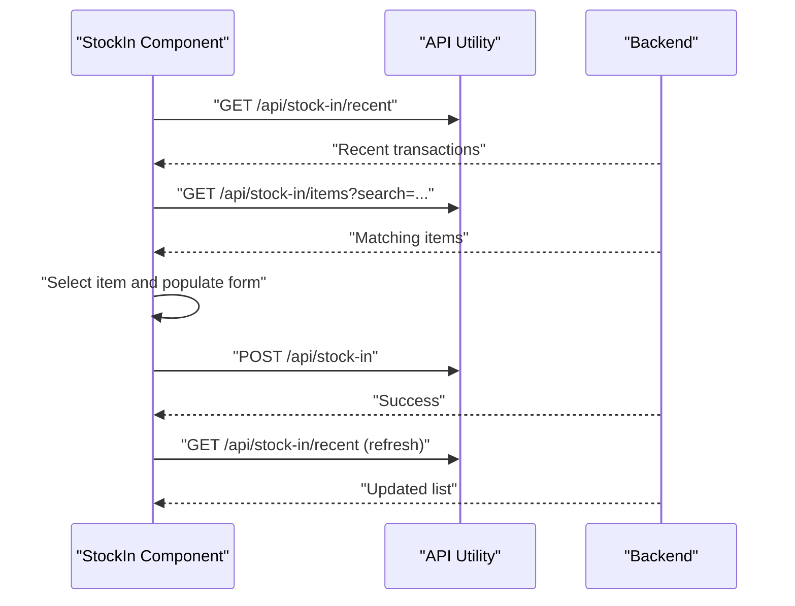

**Diagram sources**
- [StockIn.tsx:61-82](file://frontend/src/components/pages/StockIn.tsx#L61-L82)
- [StockIn.tsx:84-109](file://frontend/src/components/pages/StockIn.tsx#L84-L109)
- [StockIn.tsx:147-185](file://frontend/src/components/pages/StockIn.tsx#L147-L185)

**Section sources**
- [StockIn.tsx:46-109](file://frontend/src/components/pages/StockIn.tsx#L46-L109)
- [StockIn.tsx:111-185](file://frontend/src/components/pages/StockIn.tsx#L111-L185)

### Stock Out
- State: Manages search, items, selected item, batch options, recent transactions, quantity, destination, and note.
- Fetching: Debounced search; loads batches for selected item; loads recent stock-out history; submits form to create new stock-out record.
- Validation: Prevents submission if quantity exceeds available stock; shows real-time computed revenue; handles server errors gracefully.
- Parsing: Robust JSON parsing with readable error messages for malformed responses.

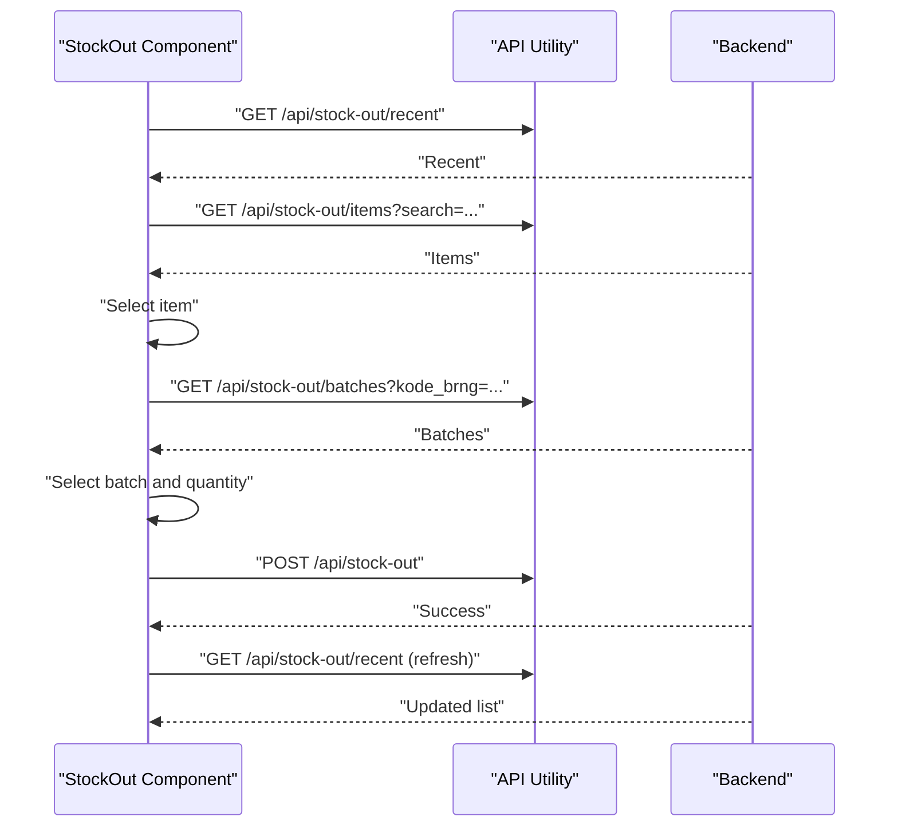

**Diagram sources**
- [StockOut.tsx:110-131](file://frontend/src/components/pages/StockOut.tsx#L110-L131)
- [StockOut.tsx:133-156](file://frontend/src/components/pages/StockOut.tsx#L133-L156)
- [StockOut.tsx:158-189](file://frontend/src/components/pages/StockOut.tsx#L158-L189)
- [StockOut.tsx:225-266](file://frontend/src/components/pages/StockOut.tsx#L225-L266)

**Section sources**
- [StockOut.tsx:92-156](file://frontend/src/components/pages/StockOut.tsx#L92-L156)
- [StockOut.tsx:158-189](file://frontend/src/components/pages/StockOut.tsx#L158-L189)
- [StockOut.tsx:225-266](file://frontend/src/components/pages/StockOut.tsx#L225-L266)

### Master Data
- State: Tracks active master type, records list, search query, modal visibility, editing record, and temporary messages.
- Fetching: Loads master data on mount; refreshes after save/delete operations.
- CRUD: Supports add/edit (modal), delete (confirmation), and code generation for new entries.
- Sorting and filtering: Sorts records by code; filters by code/name; supports quick switching between master types.

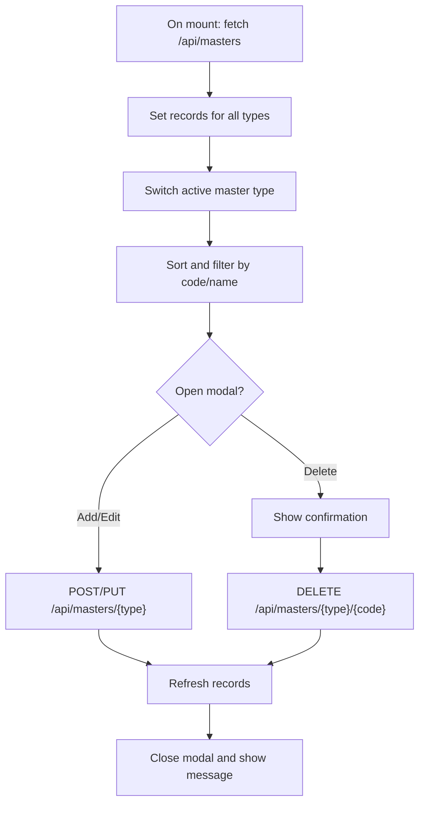

**Diagram sources**
- [MasterData.tsx:76-118](file://frontend/src/components/pages/MasterData.tsx#L76-L118)
- [MasterData.tsx:141-159](file://frontend/src/components/pages/MasterData.tsx#L141-L159)
- [MasterData.tsx:225-281](file://frontend/src/components/pages/MasterData.tsx#L225-L281)

**Section sources**
- [MasterData.tsx:58-118](file://frontend/src/components/pages/MasterData.tsx#L58-L118)
- [MasterData.tsx:120-159](file://frontend/src/components/pages/MasterData.tsx#L120-L159)
- [MasterData.tsx:225-281](file://frontend/src/components/pages/MasterData.tsx#L225-L281)

### API Integration Layer
- Base URL resolution: Determines API base URL from environment variables or window location; ensures trailing slash normalization.
- Endpoint construction: Provides a helper to join base URL with path segments.
- Usage: All pages construct endpoints using this helper to maintain consistency.

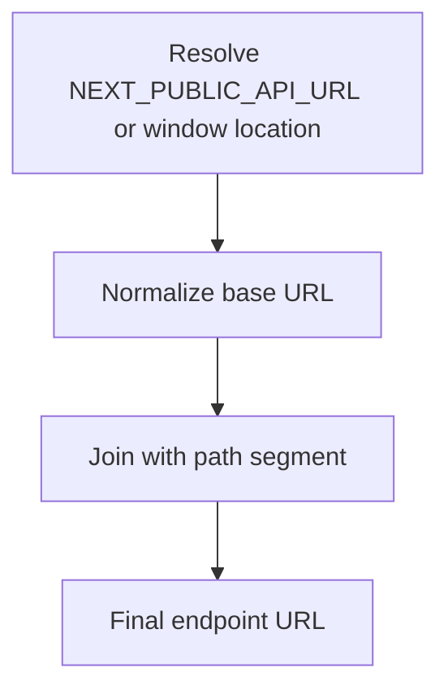

**Diagram sources**
- [api.ts:3-18](file://frontend/src/lib/api.ts#L3-L18)

**Section sources**
- [api.ts:1-19](file://frontend/src/lib/api.ts#L1-L19)
- [Dashboard.tsx:28-183](file://frontend/src/components/pages/Dashboard.tsx#L28-L183)
- [Inventory.tsx:82-94](file://frontend/src/components/pages/Inventory.tsx#L82-L94)
- [AddItem.tsx:103-104](file://frontend/src/components/pages/AddItem.tsx#L103-L104)
- [StockIn.tsx:66-95](file://frontend/src/components/pages/StockIn.tsx#L66-L95)
- [StockOut.tsx:115-142](file://frontend/src/components/pages/StockOut.tsx#L115-L142)
- [MasterData.tsx:82-83](file://frontend/src/components/pages/MasterData.tsx#L82-L83)

### Data Transformation and Validation
- Date formatting: Validates expiry and purchase dates, formats them for Indonesian locale, and returns safe defaults for invalid inputs.
- Currency and number formatting: Used in inventory and stock-out pages to present monetary values and numeric quantities consistently.
- Input sanitization: Removes non-digits for numeric fields and normalizes currency strings.

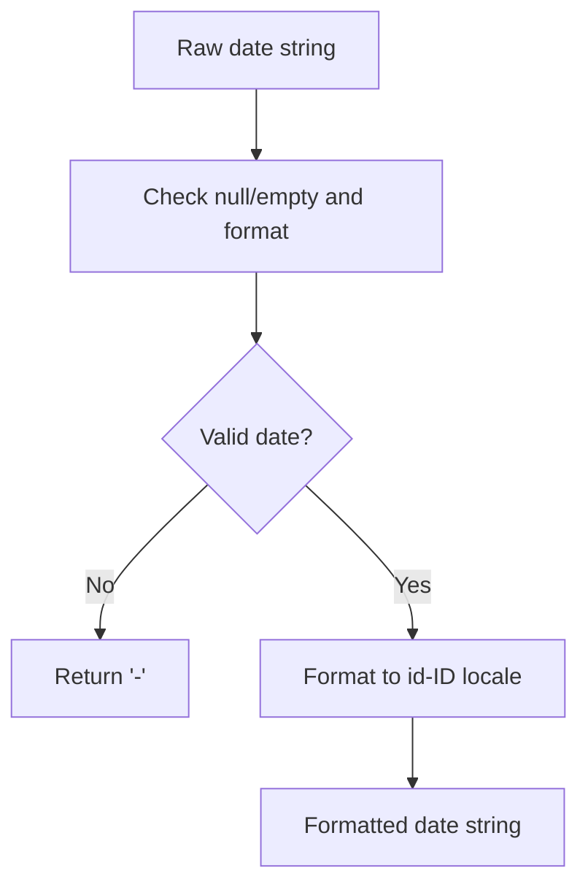

**Diagram sources**
- [dateFormat.ts:4-40](file://frontend/src/utils/dateFormat.ts#L4-L40)

**Section sources**
- [dateFormat.ts:1-49](file://frontend/src/utils/dateFormat.ts#L1-L49)
- [Inventory.tsx:193-199](file://frontend/src/components/pages/Inventory.tsx#L193-L199)
- [StockIn.tsx:32-44](file://frontend/src/components/pages/StockIn.tsx#L32-L44)
- [StockOut.tsx:57-63](file://frontend/src/components/pages/StockOut.tsx#L57-L63)

### Error Handling and Loading States
- Error handling: Components set explicit error state on failed requests and clear state on success; UI renders error messages or placeholders.
- Loading states: Components set and clear loading flags around async operations; UI shows loading placeholders until data arrives.
- Temporary messages: Success and error feedback is shown briefly to inform users without blocking the UI.

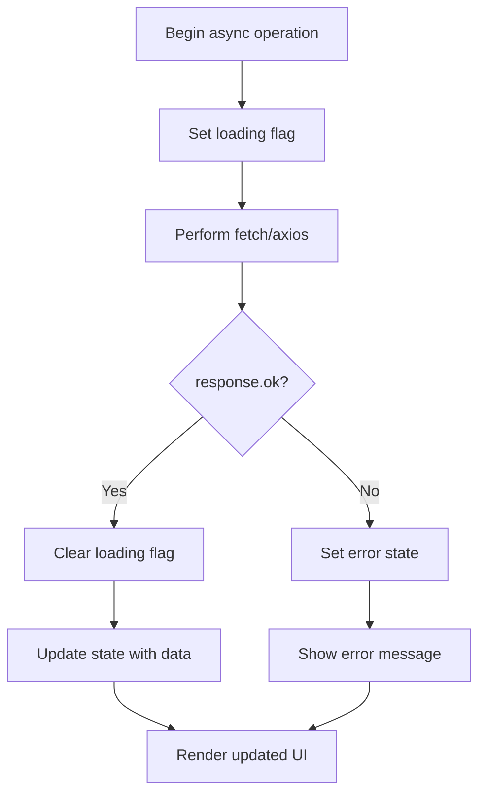

**Diagram sources**
- [Dashboard.tsx:173-214](file://frontend/src/components/pages/Dashboard.tsx#L173-L214)
- [Inventory.tsx:77-90](file://frontend/src/components/pages/Inventory.tsx#L77-L90)
- [StockIn.tsx:111-119](file://frontend/src/components/pages/StockIn.tsx#L111-L119)
- [StockOut.tsx:191-199](file://frontend/src/components/pages/StockOut.tsx#L191-L199)
- [MasterData.tsx:79-110](file://frontend/src/components/pages/MasterData.tsx#L79-L110)

**Section sources**
- [Dashboard.tsx:164-210](file://frontend/src/components/pages/Dashboard.tsx#L164-L210)
- [Inventory.tsx:77-90](file://frontend/src/components/pages/Inventory.tsx#L77-L90)
- [StockIn.tsx:111-119](file://frontend/src/components/pages/StockIn.tsx#L111-L119)
- [StockOut.tsx:191-199](file://frontend/src/components/pages/StockOut.tsx#L191-L199)
- [MasterData.tsx:79-110](file://frontend/src/components/pages/MasterData.tsx#L79-L110)

### Optimistic Updates and Real-time Behavior
- Current behavior: Components update state after receiving server responses; there is no optimistic write implementation.
- Real-time updates: Pages refresh data after mutations (e.g., after adding an item or deleting inventory) to reflect server state.
- Suggestions: To improve perceived performance, consider implementing optimistic updates (e.g., immediately appending new items to the list) followed by rollback on failure.

[No sources needed since this section provides general guidance]

## Dependency Analysis
- Internal dependencies:
  - All pages depend on API utilities for endpoint construction.
  - Inventory, StockIn, and StockOut depend on date formatting utilities for consistent date display.
- External dependencies:
  - Axios is imported in Inventory but not used for data fetching; the project primarily uses native fetch/URL APIs.
  - Next.js runtime and React are used for routing and component rendering.

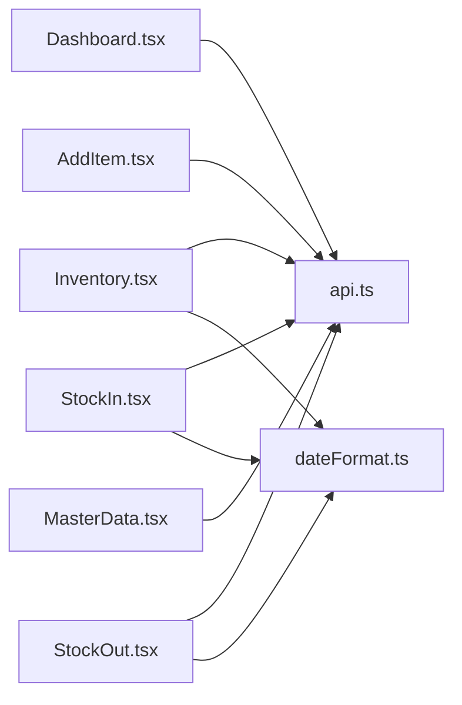

**Diagram sources**
- [Dashboard.tsx:28-183](file://frontend/src/components/pages/Dashboard.tsx#L28-L183)
- [Inventory.tsx:3-8](file://frontend/src/components/pages/Inventory.tsx#L3-L8)
- [AddItem.tsx](file://frontend/src/components/pages/AddItem.tsx#L5)
- [StockIn.tsx:6-7](file://frontend/src/components/pages/StockIn.tsx#L6-L7)
- [StockOut.tsx:6-7](file://frontend/src/components/pages/StockOut.tsx#L6-L7)
- [MasterData.tsx](file://frontend/src/components/pages/MasterData.tsx#L5)
- [api.ts:1-19](file://frontend/src/lib/api.ts#L1-L19)
- [dateFormat.ts:1-49](file://frontend/src/utils/dateFormat.ts#L1-L49)

**Section sources**
- [package.json:11-21](file://frontend/package.json#L11-L21)
- [Inventory.tsx:3-8](file://frontend/src/components/pages/Inventory.tsx#L3-L8)
- [StockIn.tsx:6-7](file://frontend/src/components/pages/StockIn.tsx#L6-L7)
- [StockOut.tsx:6-7](file://frontend/src/components/pages/StockOut.tsx#L6-L7)
- [MasterData.tsx](file://frontend/src/components/pages/MasterData.tsx#L5)
- [Dashboard.tsx:28-183](file://frontend/src/components/pages/Dashboard.tsx#L28-L183)

## Performance Considerations
- Client-side pagination: Inventory uses in-memory slicing for large lists; consider virtualizing the table or server-side pagination for very large datasets.
- Debounced search: StockIn and StockOut debounce search requests to reduce network calls; keep debounce delay reasonable to balance responsiveness and bandwidth.
- Avoid redundant requests: Components fetch data on mount; ensure unnecessary refetches are prevented by checking for existing data.
- Memory efficiency: Prefer lightweight state shapes; avoid storing derived data redundantly; clear timeouts and abort controllers on unmount.
- Rendering cost: Memoize expensive computations (e.g., sorting/filtering) using useMemo where appropriate to prevent unnecessary re-renders.

[No sources needed since this section provides general guidance]

## Troubleshooting Guide
- Network errors:
  - Verify API base URL resolution and environment variables.
  - Ensure endpoints match backend routes and handle non-2xx responses gracefully.
- Date validation failures:
  - Confirm date strings conform to expected formats; use date formatting utilities to normalize inputs.
- Input parsing issues:
  - Remove non-numeric characters before converting to numbers; format currency strings with thousand separators.
- UI feedback:
  - Use temporary messages for success and error states; ensure messages clear automatically to avoid clutter.

**Section sources**
- [api.ts:3-18](file://frontend/src/lib/api.ts#L3-L18)
- [dateFormat.ts:4-40](file://frontend/src/utils/dateFormat.ts#L4-L40)
- [StockIn.tsx:32-44](file://frontend/src/components/pages/StockIn.tsx#L32-L44)
- [StockOut.tsx:57-63](file://frontend/src/components/pages/StockOut.tsx#L57-L63)
- [MasterData.tsx:220-223](file://frontend/src/components/pages/MasterData.tsx#L220-L223)

## Conclusion
The PPA frontend implements straightforward, predictable state management using React hooks and native browser APIs. Each page manages its data lifecycle independently, with centralized URL construction and shared utilities for date formatting. The approach is easy to understand and maintain, with clear loading and error handling. For future enhancements, consider adopting a shared state library for cross-page state, implementing optimistic updates for smoother interactions, and introducing server-side pagination for large datasets.