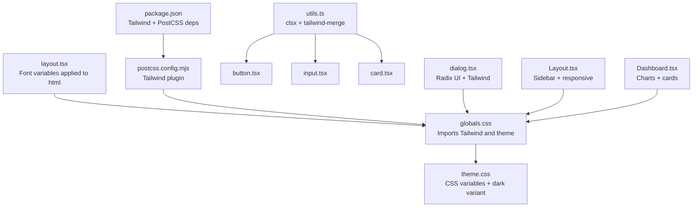
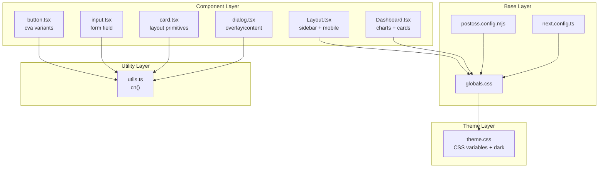
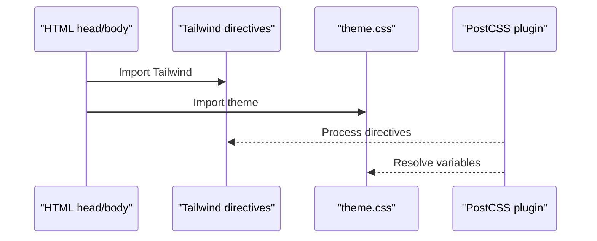
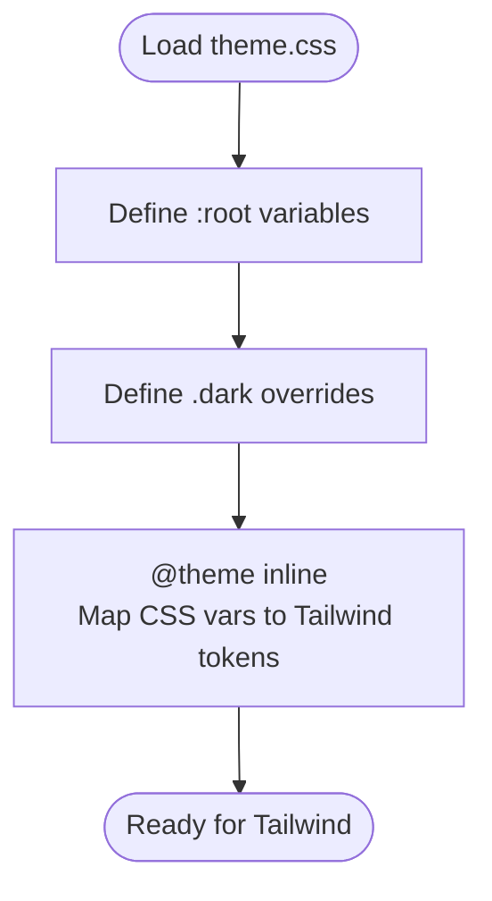
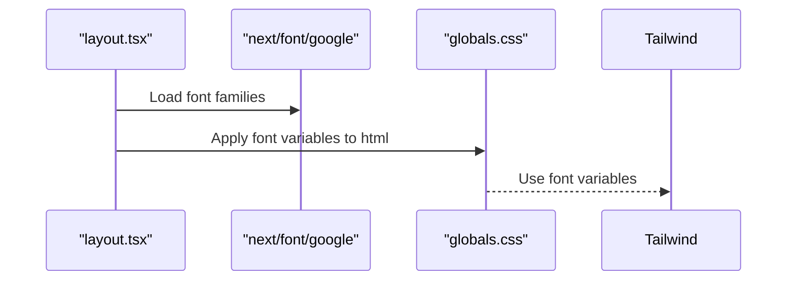
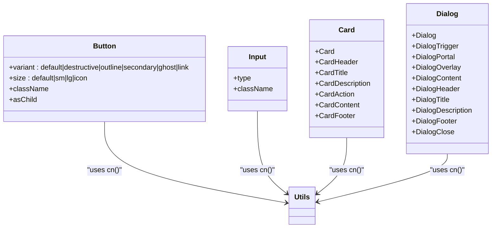
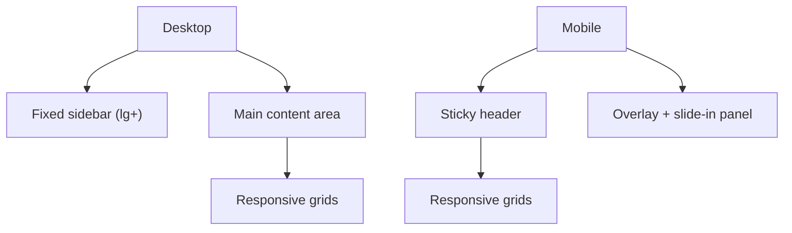
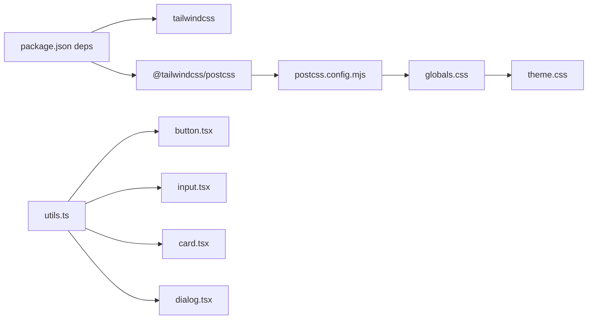

# Styling & Theming

<cite>
**Referenced Files in This Document**
- [globals.css](file://frontend/src/app/globals.css)
- [theme.css](file://frontend/src/app/theme.css)
- [layout.tsx](file://frontend/src/app/layout.tsx)
- [postcss.config.mjs](file://frontend/postcss.config.mjs)
- [package.json](file://frontend/package.json)
- [next.config.ts](file://frontend/next.config.ts)
- [utils.ts](file://frontend/src/components/ui/utils.ts)
- [button.tsx](file://frontend/src/components/ui/button.tsx)
- [input.tsx](file://frontend/src/components/ui/input.tsx)
- [card.tsx](file://frontend/src/components/ui/card.tsx)
- [dialog.tsx](file://frontend/src/components/ui/dialog.tsx)
- [Layout.tsx](file://frontend/src/components/Layout.tsx)
- [Dashboard.tsx](file://frontend/src/components/pages/Dashboard.tsx)
</cite>

## Table of Contents
1. [Introduction](#introduction)
2. [Project Structure](#project-structure)
3. [Core Components](#core-components)
4. [Architecture Overview](#architecture-overview)
5. [Detailed Component Analysis](#detailed-component-analysis)
6. [Dependency Analysis](#dependency-analysis)
7. [Performance Considerations](#performance-considerations)
8. [Troubleshooting Guide](#troubleshooting-guide)
9. [Conclusion](#conclusion)

## Introduction
This document explains the styling and theming architecture of the PPA frontend. It covers Tailwind CSS integration, the custom theme built with CSS variables, the design system implemented via Radix UI primitives and Tailwind utilities, and the responsive patterns used across components. It also documents color palettes, typography, spacing, animations, dark/light mode, and practical guidance for performance, compatibility, and accessibility.

## Project Structure
The styling system is organized around three pillars:
- Global base styles and Tailwind integration
- A centralized theme CSS module defining CSS variables and dark mode variants
- Component-level styling using Tailwind utilities and Radix UI primitives

**Diagram sources**
- [globals.css:1-2](file://frontend/src/app/globals.css#L1-L2)
- [theme.css:1-128](file://frontend/src/app/theme.css#L1-L128)
- [layout.tsx:1-34](file://frontend/src/app/layout.tsx#L1-L34)
- [postcss.config.mjs:1-8](file://frontend/postcss.config.mjs#L1-L8)
- [package.json:1-33](file://frontend/package.json#L1-L33)
- [utils.ts:1-7](file://frontend/src/components/ui/utils.ts#L1-L7)
- [button.tsx:1-59](file://frontend/src/components/ui/button.tsx#L1-L59)
- [input.tsx:1-22](file://frontend/src/components/ui/input.tsx#L1-L22)
- [card.tsx:1-93](file://frontend/src/components/ui/card.tsx#L1-L93)
- [dialog.tsx:1-136](file://frontend/src/components/ui/dialog.tsx#L1-L136)
- [Layout.tsx:1-161](file://frontend/src/components/Layout.tsx#L1-L161)
- [Dashboard.tsx:1-668](file://frontend/src/components/pages/Dashboard.tsx#L1-L668)

**Section sources**
- [globals.css:1-2](file://frontend/src/app/globals.css#L1-L2)
- [theme.css:1-128](file://frontend/src/app/theme.css#L1-L128)
- [layout.tsx:1-34](file://frontend/src/app/layout.tsx#L1-L34)
- [postcss.config.mjs:1-8](file://frontend/postcss.config.mjs#L1-L8)
- [package.json:1-33](file://frontend/package.json#L1-L33)

## Core Components
- Tailwind integration: Tailwind is imported globally and PostCSS pipeline is configured to process it.
- Theme system: CSS variables define tokens for colors, radii, and chart colors; dark mode toggles variables under a `.dark` class.
- Design system: Radix UI primitives are styled with Tailwind utilities and a consistent spacing/color palette.
- Utilities: A shared cn() helper merges and deduplicates Tailwind classes safely.

Key implementation references:
- Tailwind import and theme import in globals
- CSS variables and dark variant in theme
- Font variables applied at the root html element
- PostCSS plugin configuration
- Utility class merging helper
- Component variants and sizes using class-variance-authority

**Section sources**
- [globals.css:1-2](file://frontend/src/app/globals.css#L1-L2)
- [theme.css:1-128](file://frontend/src/app/theme.css#L1-L128)
- [layout.tsx:1-34](file://frontend/src/app/layout.tsx#L1-L34)
- [postcss.config.mjs:1-8](file://frontend/postcss.config.mjs#L1-L8)
- [utils.ts:1-7](file://frontend/src/components/ui/utils.ts#L1-L7)
- [button.tsx:1-59](file://frontend/src/components/ui/button.tsx#L1-L59)

## Architecture Overview
The styling architecture follows a layered approach:
- Base layer: Tailwind directives and global imports
- Theme layer: CSS variables mapped to Tailwind theme tokens
- Component layer: Styled Radix UI primitives and semantic containers
- Utility layer: Helper functions for safe class composition

**Diagram sources**
- [globals.css:1-2](file://frontend/src/app/globals.css#L1-L2)
- [postcss.config.mjs:1-8](file://frontend/postcss.config.mjs#L1-L8)
- [next.config.ts:1-8](file://frontend/next.config.ts#L1-L8)
- [theme.css:1-128](file://frontend/src/app/theme.css#L1-L128)
- [button.tsx:1-59](file://frontend/src/components/ui/button.tsx#L1-L59)
- [input.tsx:1-22](file://frontend/src/components/ui/input.tsx#L1-L22)
- [card.tsx:1-93](file://frontend/src/components/ui/card.tsx#L1-L93)
- [dialog.tsx:1-136](file://frontend/src/components/ui/dialog.tsx#L1-L136)
- [Layout.tsx:1-161](file://frontend/src/components/Layout.tsx#L1-L161)
- [Dashboard.tsx:1-668](file://frontend/src/components/pages/Dashboard.tsx#L1-L668)
- [utils.ts:1-7](file://frontend/src/components/ui/utils.ts#L1-L7)

## Detailed Component Analysis

### Tailwind Integration and Build Pipeline
- Tailwind is imported globally and theme CSS is included after Tailwind.
- PostCSS configuration enables the Tailwind plugin.
- No explicit Tailwind config file is present; defaults apply.

**Diagram sources**
- [globals.css:1-2](file://frontend/src/app/globals.css#L1-L2)
- [postcss.config.mjs:1-8](file://frontend/postcss.config.mjs#L1-L8)

**Section sources**
- [globals.css:1-2](file://frontend/src/app/globals.css#L1-L2)
- [postcss.config.mjs:1-8](file://frontend/postcss.config.mjs#L1-L8)
- [package.json:22-31](file://frontend/package.json#L22-L31)

### Theme System and Dark Mode
- CSS variables define color tokens, radii, and chart colors for light mode.
- A dark variant selector updates variables for dark mode.
- Tailwind theme tokens are generated from CSS variables for consistent design tokens.

**Diagram sources**
- [theme.css:1-128](file://frontend/src/app/theme.css#L1-L128)

**Section sources**
- [theme.css:1-128](file://frontend/src/app/theme.css#L1-L128)

### Typography and Fonts
- Google Fonts (Geist family) are loaded and exposed as CSS variables for consistent typography across the app.
- Variables are attached to the html element so Tailwind can consume them.

**Diagram sources**
- [layout.tsx:1-34](file://frontend/src/app/layout.tsx#L1-L34)
- [globals.css:1-2](file://frontend/src/app/globals.css#L1-L2)

**Section sources**
- [layout.tsx:1-34](file://frontend/src/app/layout.tsx#L1-L34)
- [globals.css:1-2](file://frontend/src/app/globals.css#L1-L2)

### Color Palette and Tokens
- Primary palette: Cyan-based primary with contrasting foregrounds.
- Semantic colors: muted/accent for backgrounds, destructive for errors, success/warning for statuses.
- Sidebar tokens: dedicated tokens for sidebar backgrounds and accents.
- Chart palette: multiple chart colors for visualizations.

These are defined as CSS variables and mirrored into Tailwind tokens via @theme.

**Section sources**
- [theme.css:3-46](file://frontend/src/app/theme.css#L3-L46)
- [theme.css:85-128](file://frontend/src/app/theme.css#L85-L128)

### Spacing and Radius Conventions
- Consistent spacing derived from a base radius token with small/medium/large/larger variants.
- Components use padding/margin utilities aligned with the spacing scale.

**Section sources**
- [theme.css:37-46](file://frontend/src/app/theme.css#L37-L46)
- [theme.css:116-119](file://frontend/src/app/theme.css#L116-L119)

### Component Styling Patterns
- Buttons: Variants and sizes defined via class-variance-authority; focus/ring and invalid states integrated.
- Inputs: Focus ring, selection styles, and aria-invalid states; dark mode input backgrounds.
- Cards: Semantic slots for header/title/description/content/footer; responsive grid behavior.
- Dialogs: Overlay/content with animations; close button with focus-visible styles.

**Diagram sources**
- [button.tsx:1-59](file://frontend/src/components/ui/button.tsx#L1-L59)
- [input.tsx:1-22](file://frontend/src/components/ui/input.tsx#L1-L22)
- [card.tsx:1-93](file://frontend/src/components/ui/card.tsx#L1-L93)
- [dialog.tsx:1-136](file://frontend/src/components/ui/dialog.tsx#L1-L136)
- [utils.ts:1-7](file://frontend/src/components/ui/utils.ts#L1-L7)

**Section sources**
- [button.tsx:1-59](file://frontend/src/components/ui/button.tsx#L1-L59)
- [input.tsx:1-22](file://frontend/src/components/ui/input.tsx#L1-L22)
- [card.tsx:1-93](file://frontend/src/components/ui/card.tsx#L1-L93)
- [dialog.tsx:1-136](file://frontend/src/components/ui/dialog.tsx#L1-L136)
- [utils.ts:1-7](file://frontend/src/components/ui/utils.ts#L1-L7)

### Responsive Design Patterns
- Breakpoints: lg-based sidebar and mobile-first navigation.
- Mobile header and overlay-driven mobile menu.
- Grid layouts adapt from single column to multi-column on larger screens.
- Charts use responsive containers for adaptive sizing.

**Diagram sources**
- [Layout.tsx:1-161](file://frontend/src/components/Layout.tsx#L1-L161)
- [Dashboard.tsx:1-668](file://frontend/src/components/pages/Dashboard.tsx#L1-L668)

**Section sources**
- [Layout.tsx:1-161](file://frontend/src/components/Layout.tsx#L1-L161)
- [Dashboard.tsx:1-668](file://frontend/src/components/pages/Dashboard.tsx#L1-L668)

### Animation Utilities
- Dialogs use radix-ui animate-in/out classes for fade/zoom transitions.
- Hover/focus states use ring and shadow utilities for feedback.
- Interactive elements apply transitions for smooth state changes.

**Section sources**
- [dialog.tsx:33-73](file://frontend/src/components/ui/dialog.tsx#L33-L73)

### Accessibility Considerations
- Focus-visible rings and outlines for keyboard navigation.
- Proper contrast with semantic color tokens.
- aria-invalid states for form controls.
- Screen-reader friendly close buttons with sr-only labels.

**Section sources**
- [button.tsx:8-35](file://frontend/src/components/ui/button.tsx#L8-L35)
- [input.tsx:10-15](file://frontend/src/components/ui/input.tsx#L10-L15)
- [dialog.tsx:66-69](file://frontend/src/components/ui/dialog.tsx#L66-L69)

## Dependency Analysis
- Tailwind CSS is enabled via PostCSS plugin.
- CSS variables are consumed by Tailwind through @theme mapping.
- Component utilities depend on clsx and tailwind-merge for safe class composition.

**Diagram sources**
- [package.json:1-33](file://frontend/package.json#L1-L33)
- [postcss.config.mjs:1-8](file://frontend/postcss.config.mjs#L1-L8)
- [globals.css:1-2](file://frontend/src/app/globals.css#L1-L2)
- [theme.css:85-128](file://frontend/src/app/theme.css#L85-L128)
- [utils.ts:1-7](file://frontend/src/components/ui/utils.ts#L1-L7)
- [button.tsx:1-59](file://frontend/src/components/ui/button.tsx#L1-L59)
- [input.tsx:1-22](file://frontend/src/components/ui/input.tsx#L1-L22)
- [card.tsx:1-93](file://frontend/src/components/ui/card.tsx#L1-L93)
- [dialog.tsx:1-136](file://frontend/src/components/ui/dialog.tsx#L1-L136)

**Section sources**
- [package.json:1-33](file://frontend/package.json#L1-L33)
- [postcss.config.mjs:1-8](file://frontend/postcss.config.mjs#L1-L8)
- [globals.css:1-2](file://frontend/src/app/globals.css#L1-L2)
- [theme.css:85-128](file://frontend/src/app/theme.css#L85-L128)
- [utils.ts:1-7](file://frontend/src/components/ui/utils.ts#L1-L7)

## Performance Considerations
- Keep the number of unique CSS variables minimal; reuse tokens consistently.
- Prefer Tailwind utilities over ad-hoc custom CSS to leverage purging and caching.
- Use responsive variants judiciously to avoid excessive media queries.
- Ensure charts and heavy components are conditionally rendered to reduce initial paint cost.
- Test dark mode transitions for smoothness; avoid expensive animations on low-end devices.

## Troubleshooting Guide
- Theme not applying:
  - Verify globals.css imports Tailwind and theme.
  - Confirm CSS variables are defined and @theme mapping exists.
- Dark mode not toggling:
  - Ensure the .dark class is applied to the root element.
  - Check that .dark overrides are present and correctly scoped.
- Button/input styles inconsistent:
  - Use the cn() helper to merge classes safely.
  - Confirm variant props match the intended cva configuration.
- Dialog overlay/content misalignment:
  - Ensure Portal and Overlay are used together.
  - Verify focus-visible and ring utilities are applied for accessibility.

**Section sources**
- [globals.css:1-2](file://frontend/src/app/globals.css#L1-L2)
- [theme.css:1-128](file://frontend/src/app/theme.css#L1-L128)
- [button.tsx:1-59](file://frontend/src/components/ui/button.tsx#L1-L59)
- [input.tsx:1-22](file://frontend/src/components/ui/input.tsx#L1-L22)
- [dialog.tsx:1-136](file://frontend/src/components/ui/dialog.tsx#L1-L136)
- [utils.ts:1-7](file://frontend/src/components/ui/utils.ts#L1-L7)

## Conclusion
The PPA frontend employs a clean, maintainable styling architecture centered on Tailwind CSS, a robust theme built with CSS variables, and a design system of styled Radix UI components. The approach ensures consistent spacing, color semantics, and responsive behavior while supporting dark/light mode through a simple variant mechanism. Following the patterns documented here will help maintain visual coherence and performance across the application.