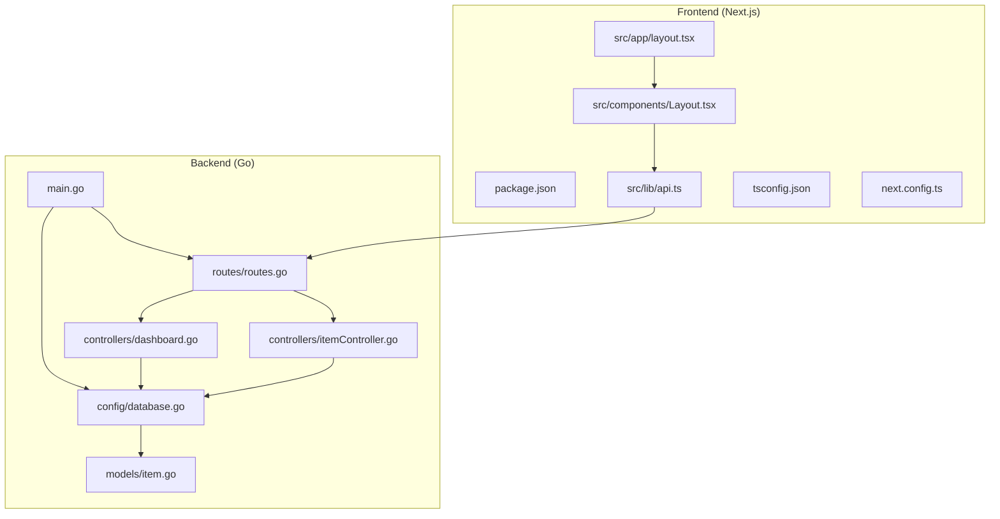
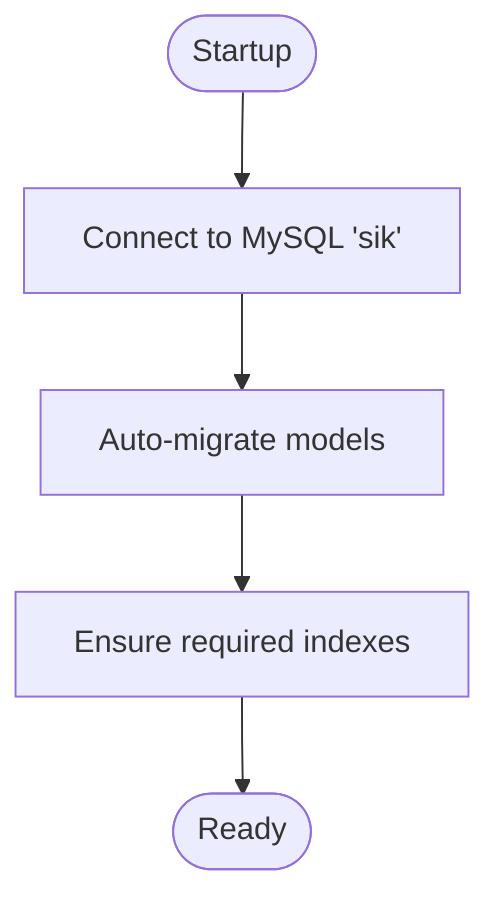
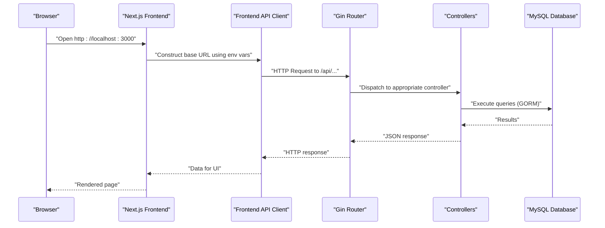
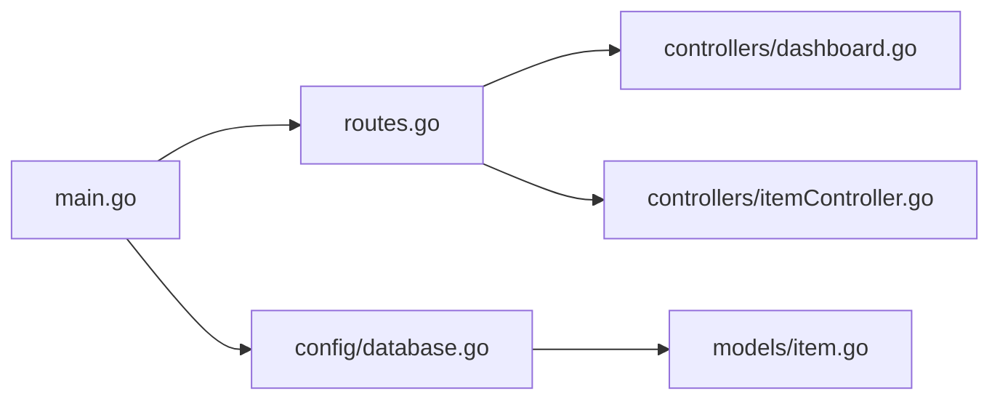
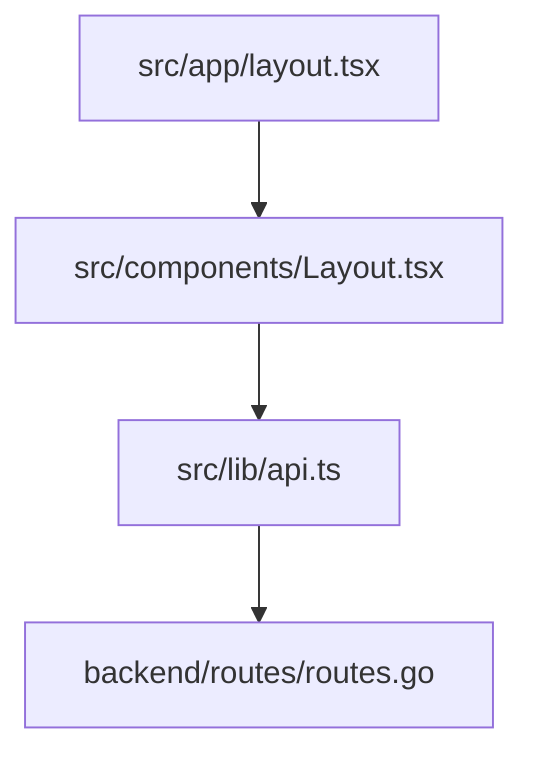
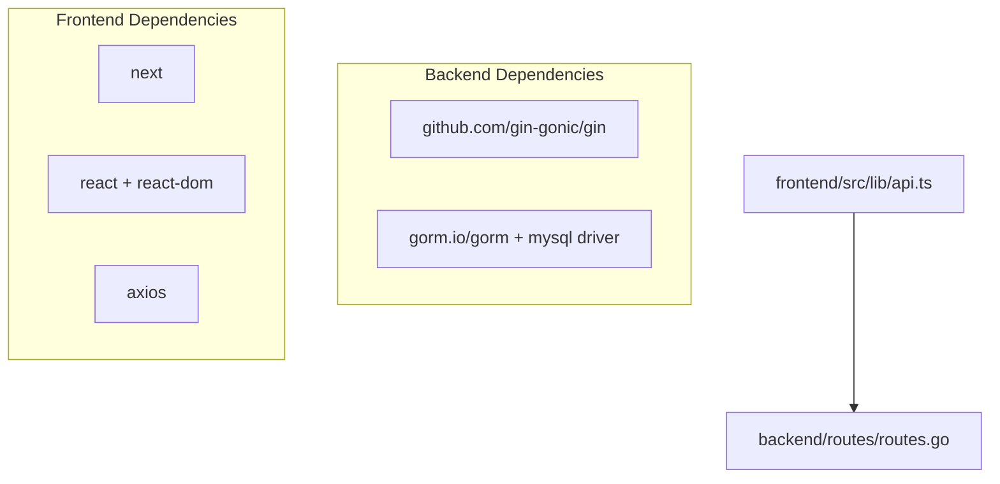

# Getting Started

<cite>
**Referenced Files in This Document**
- [go.mod](file://backend/go.mod)
- [main.go](file://backend/main.go)
- [database.go](file://backend/config/database.go)
- [routes.go](file://backend/routes/routes.go)
- [dashboard.go](file://backend/controllers/dashboard.go)
- [itemController.go](file://backend/controllers/itemController.go)
- [api.ts](file://frontend/src/lib/api.ts)
- [.gitignore (backend)](file://backend/.gitignore)
- [.gitignore (frontend)](file://frontend/.gitignore)
- [package.json](file://frontend/package.json)
- [README.md (frontend)](file://frontend/README.md)
- [layout.tsx](file://frontend/src/app/layout.tsx)
- [Layout.tsx](file://frontend/src/components/Layout.tsx)
- [tsconfig.json](file://frontend/tsconfig.json)
- [next.config.ts](file://frontend/next.config.ts)
- [item.go](file://backend/models/item.go)
</cite>

## Table of Contents
1. [Introduction](#introduction)
2. [Project Structure](#project-structure)
3. [Prerequisites](#prerequisites)
4. [Installation](#installation)
5. [Environment Variables](#environment-variables)
6. [Database Setup and Migration](#database-setup-and-migration)
7. [Development Server Startup](#development-server-startup)
8. [Initial Database Seeding](#initial-database-seeding)
9. [Basic System Verification](#basic-system-verification)
10. [Architecture Overview](#architecture-overview)
11. [Detailed Component Analysis](#detailed-component-analysis)
12. [Dependency Analysis](#dependency-analysis)
13. [Performance Considerations](#performance-considerations)
14. [Troubleshooting Guide](#troubleshooting-guide)
15. [IDE Configuration Recommendations](#ide-configuration-recommendations)
16. [Development Workflow Guidance](#development-workflow-guidance)
17. [Quick Start Examples](#quick-start-examples)
18. [Conclusion](#conclusion)

## Introduction
This guide helps you install, configure, and run the PPA inventory management system locally. It covers backend and frontend setup, environment configuration, database preparation, and basic usage to verify the system works correctly.

## Project Structure
The project is split into two primary parts:
- Backend: Go-based REST API using Gin and GORM for MySQL
- Frontend: Next.js application using TypeScript and React

**Diagram sources**
- [main.go:1-33](file://backend/main.go#L1-L33)
- [database.go:1-105](file://backend/config/database.go#L1-L105)
- [routes.go:1-36](file://backend/routes/routes.go#L1-L36)
- [dashboard.go:1-305](file://backend/controllers/dashboard.go#L1-L305)
- [itemController.go:1-284](file://backend/controllers/itemController.go#L1-L284)
- [item.go:1-33](file://backend/models/item.go#L1-L33)
- [package.json:1-33](file://frontend/package.json#L1-L33)
- [layout.tsx:1-34](file://frontend/src/app/layout.tsx#L1-L34)
- [Layout.tsx:1-161](file://frontend/src/components/Layout.tsx#L1-L161)
- [api.ts:1-19](file://frontend/src/lib/api.ts#L1-L19)
- [tsconfig.json:1-35](file://frontend/tsconfig.json#L1-L35)
- [next.config.ts:1-8](file://frontend/next.config.ts#L1-L8)

**Section sources**
- [main.go:1-33](file://backend/main.go#L1-L33)
- [routes.go:1-36](file://backend/routes/routes.go#L1-L36)
- [package.json:1-33](file://frontend/package.json#L1-L33)

## Prerequisites
- Go 1.26.2
- Node.js (compatible with Next.js 16.2.6)
- MySQL server (tested against 8.x)
- Development tools: Git, a terminal/console, and a code editor

Notes:
- The backend module explicitly requires Go 1.26.2.
- The frontend depends on Next.js 16.2.6 and React 19.2.4.

**Section sources**
- [go.mod:1-45](file://backend/go.mod#L1-L45)
- [package.json:1-33](file://frontend/package.json#L1-L33)

## Installation
Follow these steps to prepare the environment and install dependencies.

### Backend Setup
1. Navigate to the backend directory.
2. Install Go dependencies:
   - Run: go mod tidy
3. Verify the Go version matches the project requirement (1.26.2).

**Section sources**
- [go.mod:1-45](file://backend/go.mod#L1-L45)

### Frontend Setup
1. Navigate to the frontend directory.
2. Install Node.js dependencies:
   - Run: npm install
3. Confirm the installed packages match the project configuration.

**Section sources**
- [package.json:1-33](file://frontend/package.json#L1-L33)

## Environment Variables
The system uses environment variables for configuration. The backend connects to MySQL using a hardcoded connection string in the current code. The frontend reads the API base URL from environment variables.

### Backend Database Connection
- Current behavior: The backend opens a MySQL connection to root@tcp(127.0.0.1:3306)/sik.
- Recommendation: Move this to environment variables for flexibility and security.

### Frontend API Base URL
- NEXT_PUBLIC_API_URL: Overrides the API base URL.
- NEXT_PUBLIC_API_PORT: Controls the port used when API URL is not provided (default 8080).
- The frontend constructs the base URL using the hostname and port.

**Section sources**
- [database.go:21-27](file://backend/config/database.go#L21-L27)
- [api.ts:1-19](file://frontend/src/lib/api.ts#L1-L19)

## Database Setup and Migration
The backend performs automatic migrations and index creation during startup.

### What Happens on Startup
- Connects to MySQL database named sik.
- Creates/updates tables for barcode items and activity logs.
- Ensures several database indexes exist for performance.

### Manual Steps (Optional)
- Ensure MySQL is running.
- Create the database named sik if it does not exist.
- Run the backend; it will apply migrations and indexes automatically.

**Diagram sources**
- [database.go:13-77](file://backend/config/database.go#L13-L77)

**Section sources**
- [database.go:13-77](file://backend/config/database.go#L13-L77)

## Development Server Startup
Start the backend and frontend servers in separate terminals.

### Backend
- Directory: backend
- Command: go run main.go
- Port: 8080 (hardcoded in main.go)
- CORS: Enabled globally via Gin middleware

Verification endpoint:
- GET http://localhost:8080/

**Section sources**
- [main.go:12-32](file://backend/main.go#L12-L32)

### Frontend
- Directory: frontend
- Command: npm run dev
- Port: 3000 (standard Next.js dev server)
- Open: http://localhost:3000

**Section sources**
- [README.md (frontend):5-17](file://frontend/README.md#L5-L17)
- [package.json:5-10](file://frontend/package.json#L5-L10)

## Initial Database Seeding
The current backend code does not include explicit seed logic. To populate initial data:
- Use the frontend application to add suppliers, master data, and items.
- Alternatively, connect to the MySQL database and insert records directly into the target tables.

Note: The backend exposes endpoints for managing suppliers and master data, which can be used to seed the system.

**Section sources**
- [routes.go:13-20](file://backend/routes/routes.go#L13-L20)

## Basic System Verification
After starting both servers:

1. Backend health check
   - Endpoint: GET http://localhost:8080/
   - Expected: Status 200 with a message indicating the backend is running.

2. Frontend accessibility
   - Visit: http://localhost:3000
   - Expect: The Next.js app loads with the configured layout and navigation.

3. API connectivity
   - The frontend constructs API URLs using NEXT_PUBLIC_API_PORT (default 8080).
   - Ensure the backend is reachable at http://localhost:8080.

**Section sources**
- [main.go:18-22](file://backend/main.go#L18-L22)
- [README.md (frontend):17-17](file://frontend/README.md#L17-L17)
- [api.ts:1-19](file://frontend/src/lib/api.ts#L1-L19)

## Architecture Overview
High-level flow of requests from the frontend to the backend:

**Diagram sources**
- [api.ts:1-19](file://frontend/src/lib/api.ts#L1-L19)
- [routes.go:9-35](file://backend/routes/routes.go#L9-L35)
- [dashboard.go:43-305](file://backend/controllers/dashboard.go#L43-L305)
- [itemController.go:22-96](file://backend/controllers/itemController.go#L22-L96)

## Detailed Component Analysis

### Backend Entry Point and Routing
- main.go initializes the database connection, sets up CORS, registers routes, runs automigrations, and starts the server on port 8080.
- routes.go defines endpoints for items, suppliers, master data, dashboard, and stock operations.

**Diagram sources**
- [main.go:12-32](file://backend/main.go#L12-L32)
- [routes.go:9-35](file://backend/routes/routes.go#L9-L35)
- [dashboard.go:43-305](file://backend/controllers/dashboard.go#L43-L305)
- [itemController.go:22-96](file://backend/controllers/itemController.go#L22-L96)
- [database.go:13-77](file://backend/config/database.go#L13-L77)
- [item.go:30-33](file://backend/models/item.go#L30-L33)

**Section sources**
- [main.go:12-32](file://backend/main.go#L12-L32)
- [routes.go:9-35](file://backend/routes/routes.go#L9-L35)

### Frontend Application Structure
- layout.tsx configures the root layout and metadata.
- Layout.tsx provides the navigation sidebar and responsive mobile menu.
- api.ts resolves the API base URL from environment variables.

**Diagram sources**
- [layout.tsx:15-18](file://frontend/src/app/layout.tsx#L15-L18)
- [Layout.tsx:19-84](file://frontend/src/components/Layout.tsx#L19-L84)
- [api.ts:1-19](file://frontend/src/lib/api.ts#L1-L19)
- [routes.go:9-35](file://backend/routes/routes.go#L9-L35)

**Section sources**
- [layout.tsx:15-18](file://frontend/src/app/layout.tsx#L15-L18)
- [Layout.tsx:19-84](file://frontend/src/components/Layout.tsx#L19-L84)
- [api.ts:1-19](file://frontend/src/lib/api.ts#L1-L19)

## Dependency Analysis
- Backend dependencies include Gin for routing, GORM for ORM, and the MySQL driver.
- Frontend dependencies include Next.js, React, Tailwind-based UI components, and Axios for HTTP requests.

**Diagram sources**
- [go.mod:5-44](file://backend/go.mod#L5-L44)
- [package.json:11-21](file://frontend/package.json#L11-L21)
- [api.ts:1-19](file://frontend/src/lib/api.ts#L1-L19)
- [routes.go:3-7](file://backend/routes/routes.go#L3-L7)

**Section sources**
- [go.mod:5-44](file://backend/go.mod#L5-L44)
- [package.json:11-21](file://frontend/package.json#L11-L21)

## Performance Considerations
- The dashboard controller uses concurrent goroutines to fetch multiple metrics and caches responses for a short TTL to reduce repeated heavy queries.
- Database indexes are ensured during startup to improve query performance on frequently accessed columns.

Recommendations:
- Monitor query performance after adding data volumes.
- Consider tuning index coverage and cache TTL based on usage patterns.

**Section sources**
- [dashboard.go:13-30](file://backend/controllers/dashboard.go#L13-L30)
- [dashboard.go:56-63](file://backend/controllers/dashboard.go#L56-L63)
- [database.go:79-104](file://backend/config/database.go#L79-L104)

## Troubleshooting Guide
Common setup issues and resolutions:

- Backend fails to connect to MySQL
  - Symptom: Panic or error during startup related to database connection.
  - Actions:
    - Verify MySQL is running locally.
    - Ensure the database named sik exists.
    - Review the connection string in the backend configuration.
    - Consider externalizing credentials via environment variables.

- Frontend cannot reach the backend
  - Symptom: Network errors when loading data.
  - Actions:
    - Confirm backend is running on port 8080.
    - Check NEXT_PUBLIC_API_PORT and NEXT_PUBLIC_API_URL in the frontend environment.
    - Ensure CORS is enabled (already configured in main.go).

- TypeScript or build errors in the frontend
  - Symptom: Type checking or build failures.
  - Actions:
    - Align Node.js and package versions with the project configuration.
    - Clean node_modules and reinstall dependencies.
    - Validate tsconfig.json settings.

- Git ignore conflicts
  - Symptom: Unexpected files being tracked or ignored.
  - Actions:
    - Review backend and frontend .gitignore files to avoid committing secrets or build artifacts.

**Section sources**
- [database.go:21-31](file://backend/config/database.go#L21-L31)
- [main.go:16-16](file://backend/main.go#L16-L16)
- [api.ts:1-13](file://frontend/src/lib/api.ts#L1-L13)
- [.gitignore (backend):1-3](file://backend/.gitignore#L1-L3)
- [.gitignore (frontend):33-34](file://frontend/.gitignore#L33-L34)

## IDE Configuration Recommendations
- Backend (Go):
  - Enable gofmt and golangci-lint integration.
  - Configure the working directory to the backend folder.
  - Set Go version to 1.26.2.

- Frontend (TypeScript/Next.js):
  - Enable ESLint and Prettier integrations.
  - Configure path aliases (@/*) according to tsconfig.json.
  - Use TypeScript strict mode as configured.

**Section sources**
- [go.mod:3-3](file://backend/go.mod#L3-L3)
- [tsconfig.json:21-23](file://frontend/tsconfig.json#L21-L23)

## Development Workflow Guidance
- Backend
  - Make changes to controllers or models, then restart the Go server.
  - Use database migrations or auto-migrations for schema updates.

- Frontend
  - Run the dev server and navigate to http://localhost:3000.
  - Use the navigation bar to access dashboard, inventory, stock in/out, monitoring, master data, and supplier screens.

- API Interaction
  - The frontend constructs API endpoints using the base URL derived from environment variables.
  - Routes are registered in the backend and mapped to controllers.

**Section sources**
- [README.md (frontend):5-17](file://frontend/README.md#L5-L17)
- [Layout.tsx:27-36](file://frontend/src/components/Layout.tsx#L27-L36)
- [api.ts:1-19](file://frontend/src/lib/api.ts#L1-L19)
- [routes.go:9-35](file://backend/routes/routes.go#L9-L35)

## Quick Start Examples
- Access the dashboard
  - Open: http://localhost:3000
  - Use the sidebar navigation to reach the dashboard screen.

- Add a new item
  - Navigate to the "Tambah Barang" page.
  - Fill in item details and submit.

- View inventory
  - Go to the "Data Barang" page to browse items and search by name, code, barcode, batch, or invoice.

- Record stock in/out
  - Use the "Barang Masuk" and "Barang Keluar" pages to log transactions.

- Monitor stock
  - Access the "Monitoring Stok" page for stock movement and alerts.

**Section sources**
- [Layout.tsx:27-36](file://frontend/src/components/Layout.tsx#L27-L36)
- [routes.go:10-34](file://backend/routes/routes.go#L10-L34)

## Conclusion
You now have the prerequisites, installation steps, environment configuration, and operational guidance to run the PPA inventory management system locally. Start both servers, verify connectivity, and explore the frontend to manage inventory and monitor stock.