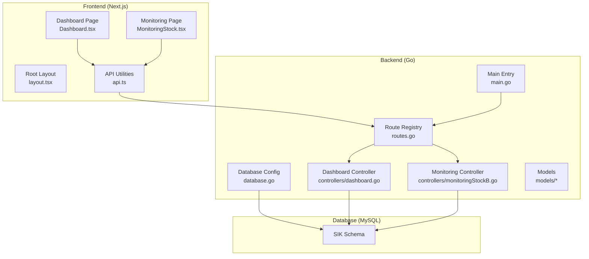
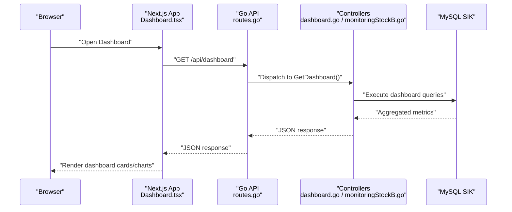
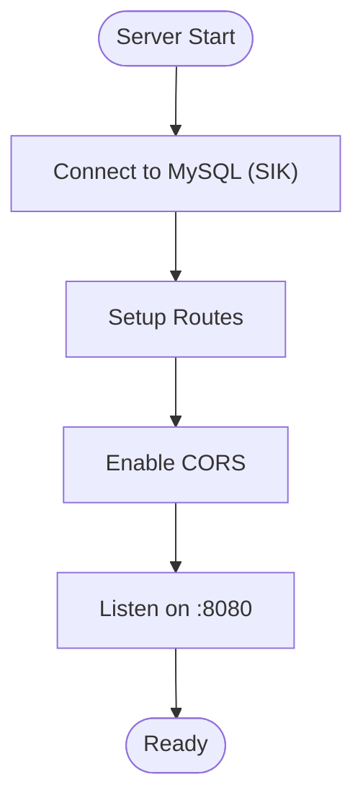
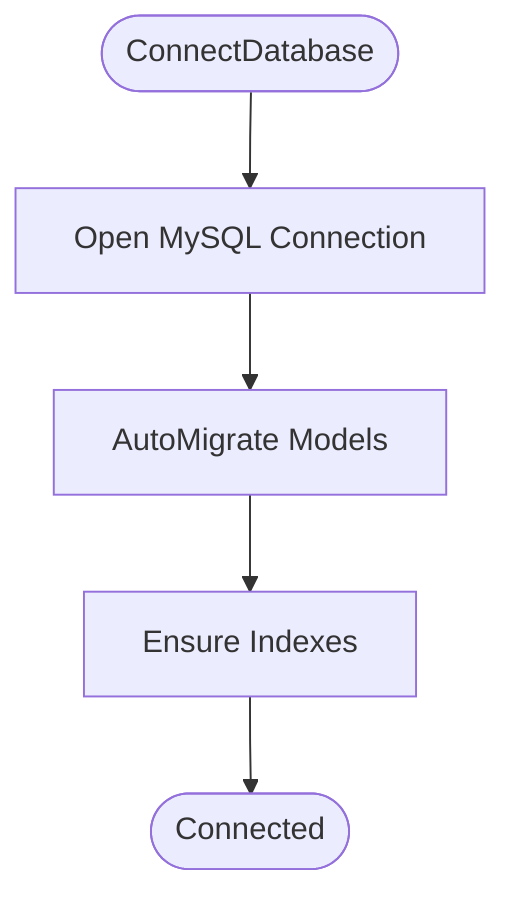
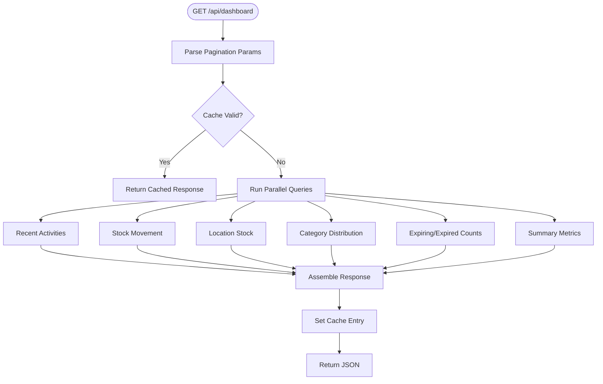
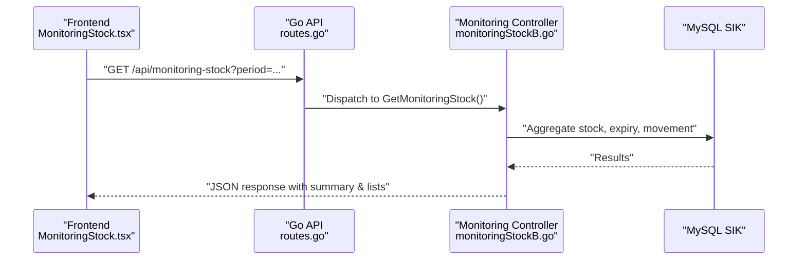
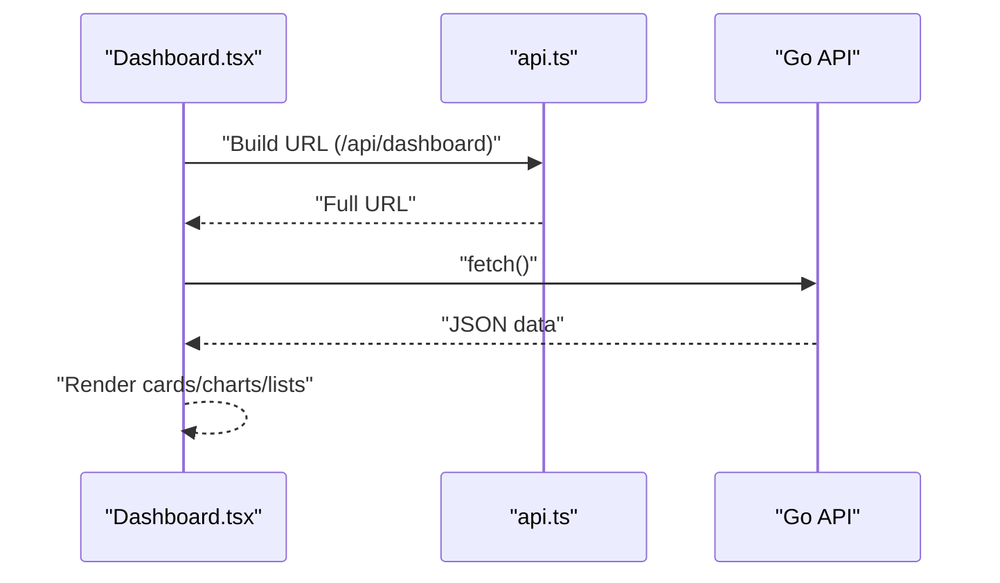
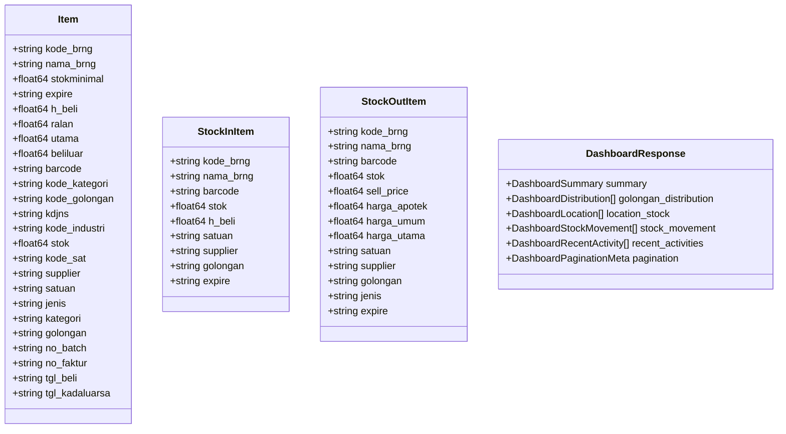
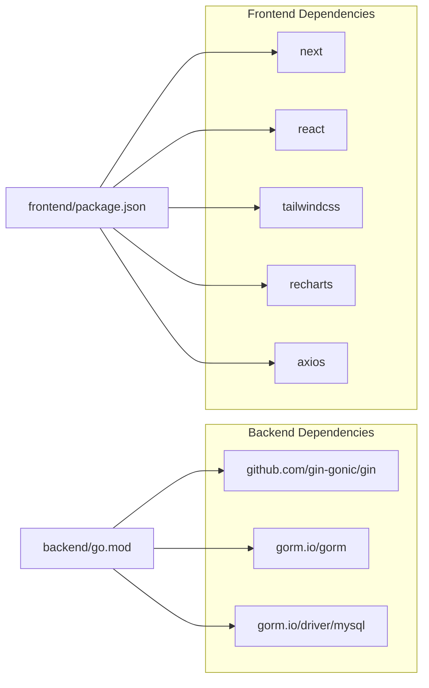

# Project Overview

<cite>
**Referenced Files in This Document**
- [main.go](file://backend/main.go)
- [routes.go](file://backend/routes/routes.go)
- [database.go](file://backend/config/database.go)
- [dashboard.go](file://backend/controllers/dashboard.go)
- [monitoringStockB.go](file://backend/controllers/monitoringStockB.go)
- [dashboard.go](file://backend/models/dashboard.go)
- [item.go](file://backend/models/item.go)
- [stockin.go](file://backend/models/stockin.go)
- [stockout.go](file://backend/models/stockout.go)
- [layout.tsx](file://frontend/src/app/layout.tsx)
- [page.tsx](file://frontend/src/app/page.tsx)
- [Dashboard.tsx](file://frontend/src/components/pages/Dashboard.tsx)
- [MonitoringStock.tsx](file://frontend/src/components/pages/MonitoringStock.tsx)
- [api.ts](file://frontend/src/lib/api.ts)
- [package.json](file://frontend/package.json)
- [go.mod](file://backend/go.mod)
</cite>

## Table of Contents
1. [Introduction](#introduction)
2. [Project Structure](#project-structure)
3. [Core Components](#core-components)
4. [Architecture Overview](#architecture-overview)
5. [Detailed Component Analysis](#detailed-component-analysis)
6. [Dependency Analysis](#dependency-analysis)
7. [Performance Considerations](#performance-considerations)
8. [Troubleshooting Guide](#troubleshooting-guide)
9. [Conclusion](#conclusion)

## Introduction
The PPA (Ampelgading Medical Centre) inventory management system is a healthcare-focused inventory solution designed to streamline stock tracking, expiration monitoring, and operational analytics for medical facilities. It targets clinical and administrative staff who manage consumables, medications, and medical supplies across departments. The system’s core value propositions include real-time visibility into stock levels, automated alerts for near-expiry and critical stock conditions, and actionable dashboards that support procurement and dispensing decisions.

## Project Structure
The system follows a full-stack architecture:
- Backend: Go microservice using Gin for HTTP routing and GORM for MySQL data access.
- Frontend: Next.js application with TypeScript, Tailwind CSS, and Recharts for visualization.
- Database: MySQL with optimized indexes and stored procedures for analytical queries.

**Diagram sources**
- [main.go:12-32](file://backend/main.go#L12-L32)
- [routes.go:9-35](file://backend/routes/routes.go#L9-L35)
- [database.go:13-77](file://backend/config/database.go#L13-L77)
- [dashboard.go:43-305](file://backend/controllers/dashboard.go#L43-L305)
- [monitoringStockB.go:83-375](file://backend/controllers/monitoringStockB.go#L83-L375)
- [layout.tsx:20-33](file://frontend/src/app/layout.tsx#L20-L33)
- [Dashboard.tsx:157-668](file://frontend/src/components/pages/Dashboard.tsx#L157-L668)
- [MonitoringStock.tsx:152-200](file://frontend/src/components/pages/MonitoringStock.tsx#L152-L200)
- [api.ts:1-19](file://frontend/src/lib/api.ts#L1-L19)

**Section sources**
- [main.go:12-32](file://backend/main.go#L12-L32)
- [routes.go:9-35](file://backend/routes/routes.go#L9-L35)
- [database.go:13-77](file://backend/config/database.go#L13-L77)
- [layout.tsx:20-33](file://frontend/src/app/layout.tsx#L20-L33)
- [page.tsx:6-12](file://frontend/src/app/page.tsx#L6-L12)

## Core Components
- Backend API server with CORS enabled and route registration for inventory, suppliers, stock movements, and monitoring.
- Database connectivity and auto-migration for barcode-related tables, plus index creation for performance.
- Controllers implementing dashboard analytics, stock monitoring, and paginated, filtered lists.
- Frontend pages for dashboard analytics and stock monitoring with charts and interactive controls.

Key capabilities:
- Real-time dashboard with KPIs, stock movement trends, and recent transactions.
- Expiration monitoring with thresholds for “expired” and “expiring soon.”
- Paginated, filterable lists for critical stock, restock needs, and expiring/expired items.
- Client-side API abstraction and responsive UI built with Next.js and Recharts.

**Section sources**
- [dashboard.go:43-305](file://backend/controllers/dashboard.go#L43-L305)
- [monitoringStockB.go:83-375](file://backend/controllers/monitoringStockB.go#L83-L375)
- [Dashboard.tsx:157-668](file://frontend/src/components/pages/Dashboard.tsx#L157-L668)
- [MonitoringStock.tsx:152-200](file://frontend/src/components/pages/MonitoringStock.tsx#L152-L200)

## Architecture Overview
The system integrates a Go backend and a Next.js frontend:
- Backend initializes database connections, sets up CORS, registers routes, and performs auto-migrations.
- Routes delegate to controllers that execute SQL queries against the SIK schema, aggregating metrics and lists.
- Frontend consumes JSON APIs via a small utility that resolves base URLs from environment variables.
- UI components render analytics and enable user-driven filtering and pagination.

**Diagram sources**
- [routes.go:9-35](file://backend/routes/routes.go#L9-L35)
- [dashboard.go:43-305](file://backend/controllers/dashboard.go#L43-L305)
- [Dashboard.tsx:173-214](file://frontend/src/components/pages/Dashboard.tsx#L173-L214)
- [api.ts:15-18](file://frontend/src/lib/api.ts#L15-L18)

## Detailed Component Analysis

### Backend API and Routing
- Entry point initializes database connection, enables CORS, registers health endpoint, and mounts routes.
- Route registry exposes endpoints for items, suppliers, master data CRUD, dashboard, monitoring stock, and stock-in/out history/search.

**Diagram sources**
- [main.go:12-32](file://backend/main.go#L12-L32)
- [routes.go:9-35](file://backend/routes/routes.go#L9-L35)

**Section sources**
- [main.go:12-32](file://backend/main.go#L12-L32)
- [routes.go:9-35](file://backend/routes/routes.go#L9-L35)

### Database Connectivity and Indexing
- Establishes a persistent connection to the SIK schema and auto-migrates barcode-related models.
- Creates indexes on frequently queried columns to optimize dashboard and monitoring queries.

**Diagram sources**
- [database.go:13-77](file://backend/config/database.go#L13-L77)

**Section sources**
- [database.go:13-77](file://backend/config/database.go#L13-L77)

### Dashboard Analytics Controller
- Implements a cache with TTL to reduce load while aggregating:
  - Summary metrics (total items, total stock, inventory value, low stock count).
  - Expiring/expired item counts.
  - Category distribution with pagination.
  - Location-wise stock totals.
  - Stock movement trends over a rolling period.
  - Recent activities with pagination.

**Diagram sources**
- [dashboard.go:43-305](file://backend/controllers/dashboard.go#L43-L305)

**Section sources**
- [dashboard.go:43-305](file://backend/controllers/dashboard.go#L43-L305)
- [dashboard.go:13-30](file://backend/controllers/dashboard.go#L13-L30)

### Monitoring Stock Controller
- Provides stock health insights with configurable observation periods (day, month, year, all).
- Computes:
  - Critical and restock thresholds.
  - Expiring/expired counts within a defined window.
  - Turnover ratios and coverage days per item.
  - Category-wise stats and values.
- Supports detailed modal views for critical, restock, expiring soon, and expired items with optional search.

**Diagram sources**
- [routes.go:23-34](file://backend/routes/routes.go#L23-L34)
- [monitoringStockB.go:83-375](file://backend/controllers/monitoringStockB.go#L83-L375)
- [MonitoringStock.tsx:189-200](file://frontend/src/components/pages/MonitoringStock.tsx#L189-L200)

**Section sources**
- [monitoringStockB.go:83-375](file://backend/controllers/monitoringStockB.go#L83-L375)
- [MonitoringStock.tsx:152-200](file://frontend/src/components/pages/MonitoringStock.tsx#L152-L200)

### Frontend Dashboard Page
- Fetches dashboard data with pagination parameters and renders:
  - KPI cards for total stock, low stock, expired, expiring soon, and inventory value.
  - Bar chart for stock movement and pie chart for category distribution.
  - Recent activities feed with pagination controls.
- Integrates notification bell with mock notifications.

**Diagram sources**
- [Dashboard.tsx:173-214](file://frontend/src/components/pages/Dashboard.tsx#L173-L214)
- [api.ts:15-18](file://frontend/src/lib/api.ts#L15-L18)

**Section sources**
- [Dashboard.tsx:157-668](file://frontend/src/components/pages/Dashboard.tsx#L157-L668)
- [page.tsx:6-12](file://frontend/src/app/page.tsx#L6-L12)
- [layout.tsx:20-33](file://frontend/src/app/layout.tsx#L20-L33)

### Data Models Overview
- Items: Core product entity with identifiers, pricing, units, categories, and expiry.
- Stock In/Out: Payloads and history models for inbound/outbound transactions.
- Dashboard response: Aggregated metrics and paginated lists for UI rendering.

**Diagram sources**
- [item.go:3-33](file://backend/models/item.go#L3-L33)
- [stockin.go:3-57](file://backend/models/stockin.go#L3-L57)
- [stockout.go:3-60](file://backend/models/stockout.go#L3-L60)
- [dashboard.go:52-60](file://backend/models/dashboard.go#L52-L60)

**Section sources**
- [item.go:3-33](file://backend/models/item.go#L3-L33)
- [stockin.go:3-57](file://backend/models/stockin.go#L3-L57)
- [stockout.go:3-60](file://backend/models/stockout.go#L3-L60)
- [dashboard.go:52-60](file://backend/models/dashboard.go#L52-L60)

## Dependency Analysis
- Backend dependencies include Gin for routing, GORM for MySQL ORM, and MySQL driver.
- Frontend dependencies include Next.js, React, Tailwind CSS, Recharts, and Axios for HTTP requests.
- Environment-driven API base URL resolution ensures portability across development and production.

**Diagram sources**
- [go.mod:5-44](file://backend/go.mod#L5-L44)
- [package.json:11-31](file://frontend/package.json#L11-L31)

**Section sources**
- [go.mod:5-44](file://backend/go.mod#L5-L44)
- [package.json:11-31](file://frontend/package.json#L11-L31)

## Performance Considerations
- Dashboard controller uses concurrent goroutines to parallelize analytics queries and caches results with a TTL to minimize repeated heavy computations.
- Database indexing on frequently filtered columns (e.g., expire, category, warehouse location) improves query performance for analytics.
- Pagination parameters on dashboard and recent activities reduce payload sizes and improve responsiveness.
- Frontend caching is disabled for monitoring detail endpoints to ensure fresh data during refresh cycles.

Recommendations:
- Monitor slow queries and consider adding composite indexes for dashboard filters.
- Tune cache TTL based on update frequency and user expectations.
- Implement server-side filtering and sorting for large datasets to further reduce payload sizes.

**Section sources**
- [dashboard.go:77-92](file://backend/controllers/dashboard.go#L77-L92)
- [dashboard.go:56-63](file://backend/controllers/dashboard.go#L56-L63)
- [database.go:79-104](file://backend/config/database.go#L79-L104)
- [MonitoringStock.tsx:189-200](file://frontend/src/components/pages/MonitoringStock.tsx#L189-L200)

## Troubleshooting Guide
Common issues and resolutions:
- Backend not reachable:
  - Verify server is listening on the expected port and CORS is enabled.
  - Confirm route registration and that the health endpoint responds.
- Database connection failures:
  - Check credentials and host/port for the SIK schema.
  - Ensure indexes are created and auto-migration runs successfully.
- Frontend API errors:
  - Confirm NEXT_PUBLIC_API_URL or hostname/port configuration.
  - Validate that the backend responds to dashboard and monitoring endpoints.
- Dashboard empty or stale data:
  - Clear browser cache or force reload.
  - Adjust pagination parameters and verify cache TTL.

**Section sources**
- [main.go:12-32](file://backend/main.go#L12-L32)
- [database.go:13-77](file://backend/config/database.go#L13-L77)
- [api.ts:3-18](file://frontend/src/lib/api.ts#L3-L18)
- [Dashboard.tsx:173-214](file://frontend/src/components/pages/Dashboard.tsx#L173-L214)

## Conclusion
The PPA inventory management system delivers a robust, real-time solution tailored for healthcare environments. Its full-stack design combines a performant Go backend with a responsive Next.js frontend, enabling accurate stock tracking, proactive expiration monitoring, and insightful analytics. By leveraging parallelized queries, intelligent caching, and optimized database indexes, the system supports efficient daily operations for medical staff and administrators alike.