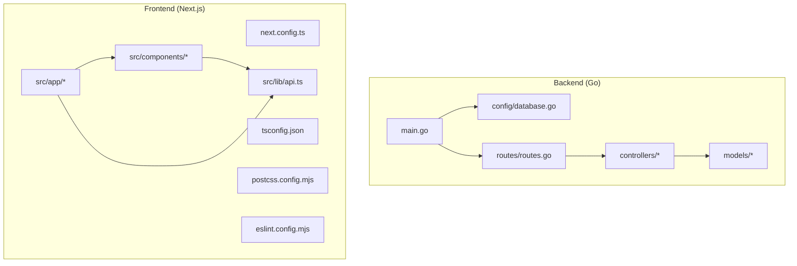
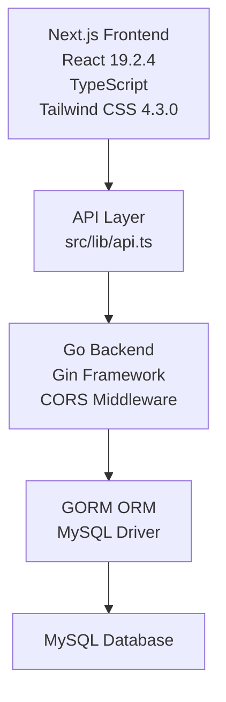
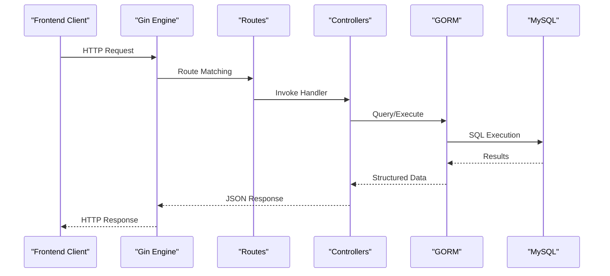
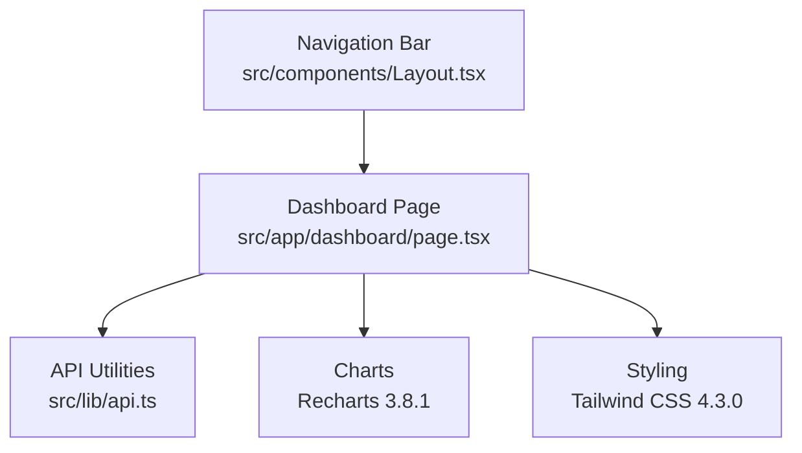
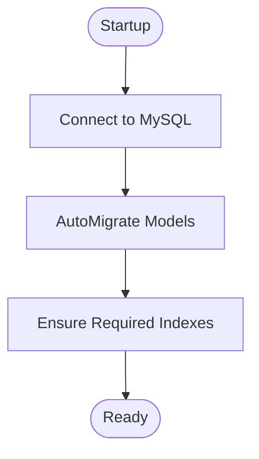
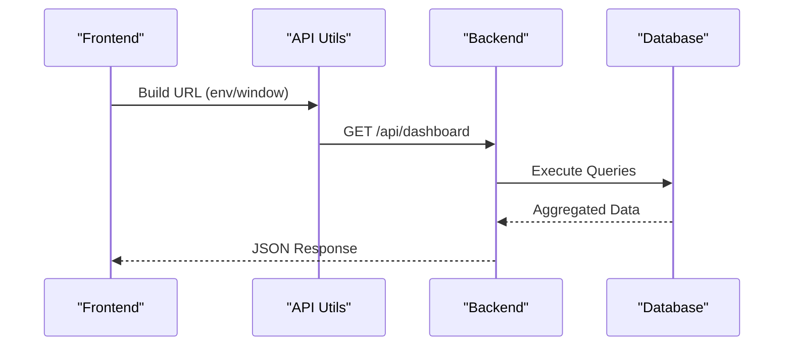
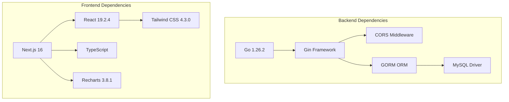

# Technology Stack & Dependencies

<cite>
**Referenced Files in This Document**
- [go.mod](file://backend/go.mod)
- [main.go](file://backend/main.go)
- [database.go](file://backend/config/database.go)
- [routes.go](file://backend/routes/routes.go)
- [dashboard.go](file://backend/controllers/dashboard.go)
- [dashboard.go](file://backend/models/dashboard.go)
- [package.json](file://frontend/package.json)
- [api.ts](file://frontend/src/lib/api.ts)
- [layout.tsx](file://frontend/src/app/layout.tsx)
- [Layout.tsx](file://frontend/src/components/Layout.tsx)
- [next.config.ts](file://frontend/next.config.ts)
- [tsconfig.json](file://frontend/tsconfig.json)
- [postcss.config.mjs](file://frontend/postcss.config.mjs)
- [eslint.config.mjs](file://frontend/eslint.config.mjs)
- [README.md](file://frontend/README.md)
- [.gitignore](file://backend/.gitignore)
- [.gitignore](file://frontend/.gitignore)
</cite>

## Table of Contents
1. [Introduction](#introduction)
2. [Project Structure](#project-structure)
3. [Core Components](#core-components)
4. [Architecture Overview](#architecture-overview)
5. [Detailed Component Analysis](#detailed-component-analysis)
6. [Dependency Analysis](#dependency-analysis)
7. [Performance Considerations](#performance-considerations)
8. [Troubleshooting Guide](#troubleshooting-guide)
9. [Conclusion](#conclusion)
10. [Appendices](#appendices)

## Introduction
This document provides comprehensive technology stack documentation for the PPA (Ampelgading Medical Centre) inventory management system. It covers backend technologies (Go 1.26.2, Gin framework, GORM ORM, MySQL driver, and CORS middleware), frontend technologies (Next.js 16, React 19.2.4, TypeScript, Tailwind CSS 4.3.0, and Recharts 3.8.1), dependency relationships, version compatibility, and rationale for technology choices. It also documents build tools, development dependencies, production deployment considerations, database integration patterns, API communication protocols, and frontend-backend data exchange mechanisms.

## Project Structure
The project follows a clear separation of concerns:
- Backend: written in Go with modular packages for configuration, models, controllers, and routing.
- Frontend: built with Next.js 16 using the App Router, TypeScript, and Tailwind CSS for styling.

**Diagram sources**
- [main.go:1-33](file://backend/main.go#L1-L33)
- [database.go:1-105](file://backend/config/database.go#L1-L105)
- [routes.go:1-36](file://backend/routes/routes.go#L1-L36)
- [dashboard.go:1-305](file://backend/controllers/dashboard.go#L1-L305)
- [dashboard.go:1-60](file://backend/models/dashboard.go#L1-L60)
- [next.config.ts:1-8](file://frontend/next.config.ts#L1-L8)
- [tsconfig.json:1-35](file://frontend/tsconfig.json#L1-L35)
- [postcss.config.mjs:1-8](file://frontend/postcss.config.mjs#L1-L8)
- [eslint.config.mjs:1-19](file://frontend/eslint.config.mjs#L1-L19)
- [layout.tsx:1-34](file://frontend/src/app/layout.tsx#L1-L34)
- [Layout.tsx:1-161](file://frontend/src/components/Layout.tsx#L1-L161)
- [api.ts:1-19](file://frontend/src/lib/api.ts#L1-L19)

**Section sources**
- [main.go:1-33](file://backend/main.go#L1-L33)
- [routes.go:1-36](file://backend/routes/routes.go#L1-L36)
- [next.config.ts:1-8](file://frontend/next.config.ts#L1-L8)
- [tsconfig.json:1-35](file://frontend/tsconfig.json#L1-L35)

## Core Components
This section outlines the primary technologies and their roles in the system.

- Backend
  - Go 1.26.2: Core runtime for building the server-side application.
  - Gin Web Framework: HTTP router and middleware for request handling.
  - GORM ORM: Database abstraction and migrations.
  - MySQL Driver: Connectivity to MySQL database.
  - CORS Middleware: Enables cross-origin requests for frontend-backend communication.

- Frontend
  - Next.js 16: Fullstack React framework with App Router and static generation capabilities.
  - React 19.2.4: UI library for building user interfaces.
  - TypeScript: Type-safe JavaScript development.
  - Tailwind CSS 4.3.0: Utility-first CSS framework for styling.
  - Recharts 3.8.1: Charting library for data visualization.

**Section sources**
- [go.mod:1-45](file://backend/go.mod#L1-L45)
- [package.json:1-33](file://frontend/package.json#L1-L33)
- [main.go:1-33](file://backend/main.go#L1-L33)

## Architecture Overview
The system employs a classic client-server architecture:
- The frontend (Next.js) serves the user interface and communicates with the backend via HTTP APIs.
- The backend (Go/Gin) exposes REST-like endpoints and interacts with the database through GORM.
- CORS middleware is enabled to support cross-origin requests during development and deployment.

**Diagram sources**
- [api.ts:1-19](file://frontend/src/lib/api.ts#L1-L19)
- [main.go:1-33](file://backend/main.go#L1-L33)
- [database.go:1-105](file://backend/config/database.go#L1-L105)
- [go.mod:1-45](file://backend/go.mod#L1-L45)

## Detailed Component Analysis

### Backend: Go, Gin, GORM, MySQL, CORS
- Go runtime and module configuration define the backend environment and dependencies.
- Gin initializes the HTTP server, applies CORS middleware, and registers routes.
- GORM handles database connections, automigrations, and raw SQL queries for dashboard analytics.
- MySQL driver enables connectivity to the database.

**Diagram sources**
- [main.go:1-33](file://backend/main.go#L1-L33)
- [routes.go:1-36](file://backend/routes/routes.go#L1-L36)
- [dashboard.go:1-305](file://backend/controllers/dashboard.go#L1-L305)
- [database.go:1-105](file://backend/config/database.go#L1-L105)

**Section sources**
- [go.mod:1-45](file://backend/go.mod#L1-L45)
- [main.go:1-33](file://backend/main.go#L1-L33)
- [database.go:1-105](file://backend/config/database.go#L1-L105)
- [routes.go:1-36](file://backend/routes/routes.go#L1-L36)
- [dashboard.go:1-305](file://backend/controllers/dashboard.go#L1-L305)

### Frontend: Next.js, React, TypeScript, Tailwind CSS, Recharts
- Next.js App Router organizes pages and layouts, enabling efficient rendering and navigation.
- React components encapsulate UI logic, while shared components provide reusable elements.
- TypeScript enforces type safety across the application.
- Tailwind CSS provides utility classes for styling; PostCSS integrates Tailwind plugins.
- Recharts renders charts for dashboard analytics.

**Diagram sources**
- [Layout.tsx:1-161](file://frontend/src/components/Layout.tsx#L1-L161)
- [layout.tsx:1-34](file://frontend/src/app/layout.tsx#L1-L34)
- [api.ts:1-19](file://frontend/src/lib/api.ts#L1-L19)

**Section sources**
- [package.json:1-33](file://frontend/package.json#L1-L33)
- [layout.tsx:1-34](file://frontend/src/app/layout.tsx#L1-L34)
- [Layout.tsx:1-161](file://frontend/src/components/Layout.tsx#L1-L161)
- [api.ts:1-19](file://frontend/src/lib/api.ts#L1-L19)
- [postcss.config.mjs:1-8](file://frontend/postcss.config.mjs#L1-L8)
- [tsconfig.json:1-35](file://frontend/tsconfig.json#L1-L35)

### Database Integration Patterns
- Centralized connection and migration logic in the configuration package.
- Index creation helpers ensure optimal query performance for dashboard analytics.
- Raw SQL queries are used for complex aggregations and paginated dashboards.

**Diagram sources**
- [database.go:1-105](file://backend/config/database.go#L1-L105)

**Section sources**
- [database.go:1-105](file://backend/config/database.go#L1-L105)

### API Communication Protocols and Data Exchange
- Frontend constructs API base URLs dynamically using environment variables and window location.
- Backend exposes REST-like endpoints under `/api/*` for items, suppliers, stock in/out, monitoring, and dashboard.
- Controllers return structured JSON responses aligned with model definitions.

**Diagram sources**
- [api.ts:1-19](file://frontend/src/lib/api.ts#L1-L19)
- [routes.go:1-36](file://backend/routes/routes.go#L1-L36)
- [dashboard.go:1-305](file://backend/controllers/dashboard.go#L1-L305)
- [dashboard.go:1-60](file://backend/models/dashboard.go#L1-L60)

**Section sources**
- [api.ts:1-19](file://frontend/src/lib/api.ts#L1-L19)
- [routes.go:1-36](file://backend/routes/routes.go#L1-L36)
- [dashboard.go:1-305](file://backend/controllers/dashboard.go#L1-L305)
- [dashboard.go:1-60](file://backend/models/dashboard.go#L1-L60)

## Dependency Analysis
This section maps the explicit dependencies and their relationships.

**Diagram sources**
- [go.mod:1-45](file://backend/go.mod#L1-L45)
- [package.json:1-33](file://frontend/package.json#L1-L33)

**Section sources**
- [go.mod:1-45](file://backend/go.mod#L1-L45)
- [package.json:1-33](file://frontend/package.json#L1-L33)

## Performance Considerations
- Backend caching: The dashboard controller implements a simple in-process cache keyed by pagination parameters to reduce repeated database workloads.
- Concurrency: Dashboard queries leverage goroutines and wait groups to parallelize multiple analytics queries.
- Database indexing: Indexes are ensured for frequently queried columns to improve dashboard performance.
- Frontend optimization: Next.js App Router improves rendering performance; Tailwind utilities enable efficient styling without heavy frameworks.

[No sources needed since this section provides general guidance]

## Troubleshooting Guide
- Environment configuration: Ensure NEXT_PUBLIC_API_URL or NEXT_PUBLIC_API_PORT is set appropriately for frontend API base URL resolution.
- CORS errors: Verify that the CORS middleware is enabled in the Gin engine.
- Database connectivity: Confirm MySQL credentials and host/port match the configured connection string.
- Build artifacts: Ignore generated folders (.next, node_modules) per .gitignore rules.

**Section sources**
- [api.ts:1-19](file://frontend/src/lib/api.ts#L1-L19)
- [main.go:1-33](file://backend/main.go#L1-L33)
- [database.go:1-105](file://backend/config/database.go#L1-L105)
- [.gitignore:1-3](file://backend/.gitignore#L1-L3)
- [.gitignore:1-47](file://frontend/.gitignore#L1-L47)

## Conclusion
The PPA system leverages a modern, scalable stack combining Go for robust backend services, Gin for concise HTTP handling, GORM for flexible database operations, and a responsive Next.js frontend with React, TypeScript, Tailwind CSS, and Recharts. The architecture supports efficient data exchange, maintainable code organization, and straightforward deployment paths.

[No sources needed since this section summarizes without analyzing specific files]

## Appendices

### Version Compatibility and Rationale
- Go 1.26.2: Stable release with excellent performance and tooling.
- Gin 1.12.0: Lightweight, fast HTTP framework suitable for microservices.
- GORM 1.31.1 + mysql driver 1.6.0: Mature ORM with strong MySQL support and migration features.
- Next.js 16.2.6: Latest App Router with optimized performance and developer experience.
- React 19.2.4: Latest React with concurrent features and improved DX.
- TypeScript ^5: Strong typing and IDE support.
- Tailwind CSS 4.3.0: Utility-first CSS framework for rapid UI iteration.
- Recharts 3.8.1: Clean, declarative charting for analytics.

**Section sources**
- [go.mod:1-45](file://backend/go.mod#L1-L45)
- [package.json:1-33](file://frontend/package.json#L1-L33)

### Build Tools and Development Dependencies
- Backend: Go modules manage dependencies and builds.
- Frontend: Next.js scripts for dev, build, and start; ESLint for linting; Tailwind CSS for styling; TypeScript for type checking.

**Section sources**
- [package.json:1-33](file://frontend/package.json#L1-L33)
- [eslint.config.mjs:1-19](file://frontend/eslint.config.mjs#L1-L19)
- [tsconfig.json:1-35](file://frontend/tsconfig.json#L1-L35)
- [postcss.config.mjs:1-8](file://frontend/postcss.config.mjs#L1-L8)

### Production Deployment Considerations
- Frontend: Next.js supports various hosting platforms; the project README indicates deployment guidance.
- Backend: Ensure environment variables for database credentials and CORS policies are configured for the target environment.
- Database: Maintain indexes and monitor query performance; consider connection pooling and health checks.

**Section sources**
- [README.md:1-37](file://frontend/README.md#L1-L37)
- [database.go:1-105](file://backend/config/database.go#L1-L105)
- [main.go:1-33](file://backend/main.go#L1-L33)