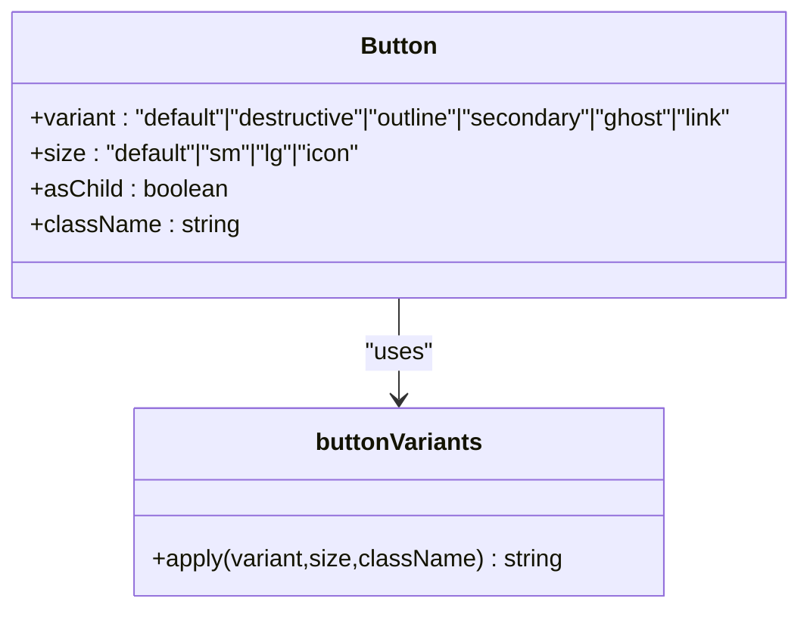
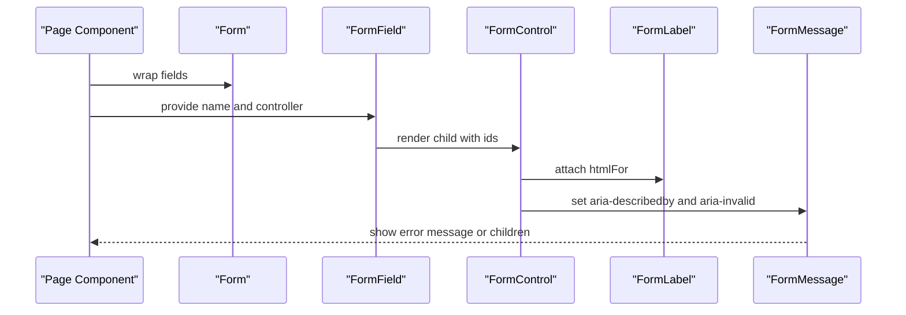
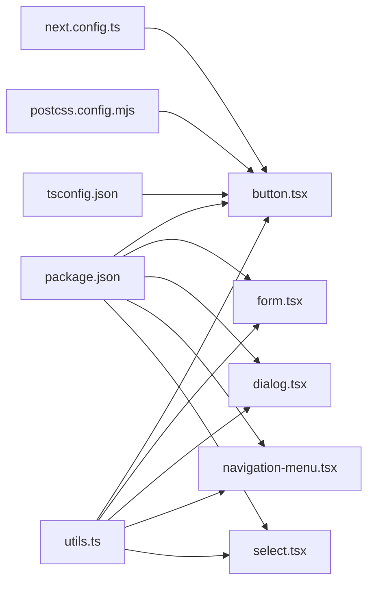

# Component Library

<cite>
**Referenced Files in This Document**
- [button.tsx](file://frontend/src/components/ui/button.tsx)
- [input.tsx](file://frontend/src/components/ui/input.tsx)
- [textarea.tsx](file://frontend/src/components/ui/textarea.tsx)
- [form.tsx](file://frontend/src/components/ui/form.tsx)
- [table.tsx](file://frontend/src/components/ui/table.tsx)
- [dialog.tsx](file://frontend/src/components/ui/dialog.tsx)
- [navigation-menu.tsx](file://frontend/src/components/ui/navigation-menu.tsx)
- [card.tsx](file://frontend/src/components/ui/card.tsx)
- [badge.tsx](file://frontend/src/components/ui/badge.tsx)
- [select.tsx](file://frontend/src/components/ui/select.tsx)
- [checkbox.tsx](file://frontend/src/components/ui/checkbox.tsx)
- [radio-group.tsx](file://frontend/src/components/ui/radio-group.tsx)
- [tabs.tsx](file://frontend/src/components/ui/tabs.tsx)
- [pagination.tsx](file://frontend/src/components/ui/pagination.tsx)
- [utils.ts](file://frontend/src/components/ui/utils.ts)
- [layout.tsx](file://frontend/src/app/layout.tsx)
- [theme.css](file://frontend/src/app/theme.css)
- [globals.css](file://frontend/src/app/globals.css)
- [package.json](file://frontend/package.json)
- [next.config.ts](file://frontend/next.config.ts)
- [postcss.config.mjs](file://frontend/postcss.config.mjs)
- [tsconfig.json](file://frontend/tsconfig.json)
</cite>

## Table of Contents
1. [Introduction](#introduction)
2. [Project Structure](#project-structure)
3. [Core Components](#core-components)
4. [Architecture Overview](#architecture-overview)
5. [Detailed Component Analysis](#detailed-component-analysis)
6. [Dependency Analysis](#dependency-analysis)
7. [Performance Considerations](#performance-considerations)
8. [Accessibility Features](#accessibility-features)
9. [Styling and Theming](#styling-and-theming)
10. [Responsive Design Implementation](#responsive-design-implementation)
11. [Component Composition Patterns](#component-composition-patterns)
12. [State Management Integration](#state-management-integration)
13. [Testing Strategies](#testing-strategies)
14. [Browser Compatibility](#browser-compatibility)
15. [Troubleshooting Guide](#troubleshooting-guide)
16. [Conclusion](#conclusion)

## Introduction
This document describes the PPA component library built with Next.js, Radix UI, Tailwind CSS, and Lucide icons. It covers reusable UI components including buttons, inputs, forms, tables, dialogs, navigation elements, cards, badges, selects, checkboxes, radio groups, tabs, pagination, and layout components. For each component, we explain the props interface, customization options, styling variants, and usage patterns. We also address composition patterns, state management integration, accessibility features, Tailwind class usage, responsive design, theming, testing strategies, performance considerations, and browser compatibility.

## Project Structure
The component library resides under frontend/src/components/ui and is consumed by pages under frontend/src/app. Styling is configured via Tailwind CSS, PostCSS, and global styles. The layout.tsx file defines the root application shell and theme integration.

```mermaid
graph TB
subgraph "Application Shell"
LAYOUT["frontend/src/app/layout.tsx"]
THEME["frontend/src/app/theme.css"]
GLOBALS["frontend/src/app/globals.css"]
end
subgraph "UI Components"
BUTTON["frontend/src/components/ui/button.tsx"]
INPUT["frontend/src/components/ui/input.tsx"]
TEXTAREA["frontend/src/components/ui/textarea.tsx"]
FORM["frontend/src/components/ui/form.tsx"]
TABLE["frontend/src/components/ui/table.tsx"]
DIALOG["frontend/src/components/ui/dialog.tsx"]
NAV["frontend/src/components/ui/navigation-menu.tsx"]
CARD["frontend/src/components/ui/card.tsx"]
BADGE["frontend/src/components/ui/badge.tsx"]
SELECT["frontend/src/components/ui/select.tsx"]
CHECKBOX["frontend/src/components/ui/checkbox.tsx"]
RADIO["frontend/src/components/ui/radio-group.tsx"]
TABS["frontend/src/components/ui/tabs.tsx"]
PAG["frontend/src/components/ui/pagination.tsx"]
UTILS["frontend/src/components/ui/utils.ts"]
end
LAYOUT --> THEME
LAYOUT --> GLOBALS
LAYOUT --> BUTTON
LAYOUT --> INPUT
LAYOUT --> TEXTAREA
LAYOUT --> FORM
LAYOUT --> TABLE
LAYOUT --> DIALOG
LAYOUT --> NAV
LAYOUT --> CARD
LAYOUT --> BADGE
LAYOUT --> SELECT
LAYOUT --> CHECKBOX
LAYOUT --> RADIO
LAYOUT --> TABS
LAYOUT --> PAG
BUTTON --> UTILS
INPUT --> UTILS
TEXTAREA --> UTILS
FORM --> UTILS
TABLE --> UTILS
DIALOG --> UTILS
NAV --> UTILS
CARD --> UTILS
BADGE --> UTILS
SELECT --> UTILS
CHECKBOX --> UTILS
RADIO --> UTILS
TABS --> UTILS
PAG --> UTILS
```

**Diagram sources**
- [layout.tsx](file://frontend/src/app/layout.tsx)
- [theme.css](file://frontend/src/app/theme.css)
- [globals.css](file://frontend/src/app/globals.css)
- [button.tsx](file://frontend/src/components/ui/button.tsx)
- [input.tsx](file://frontend/src/components/ui/input.tsx)
- [textarea.tsx](file://frontend/src/components/ui/textarea.tsx)
- [form.tsx](file://frontend/src/components/ui/form.tsx)
- [table.tsx](file://frontend/src/components/ui/table.tsx)
- [dialog.tsx](file://frontend/src/components/ui/dialog.tsx)
- [navigation-menu.tsx](file://frontend/src/components/ui/navigation-menu.tsx)
- [card.tsx](file://frontend/src/components/ui/card.tsx)
- [badge.tsx](file://frontend/src/components/ui/badge.tsx)
- [select.tsx](file://frontend/src/components/ui/select.tsx)
- [checkbox.tsx](file://frontend/src/components/ui/checkbox.tsx)
- [radio-group.tsx](file://frontend/src/components/ui/radio-group.tsx)
- [tabs.tsx](file://frontend/src/components/ui/tabs.tsx)
- [pagination.tsx](file://frontend/src/components/ui/pagination.tsx)
- [utils.ts](file://frontend/src/components/ui/utils.ts)

**Section sources**
- [layout.tsx](file://frontend/src/app/layout.tsx)
- [globals.css](file://frontend/src/app/globals.css)
- [theme.css](file://frontend/src/app/theme.css)

## Core Components
This section summarizes the primary UI components and their roles in the library.

- Buttons: Variants and sizes with focus-visible ring and disabled states.
- Inputs and Textareas: Consistent focus-visible rings, invalid state styling, and selection highlighting.
- Forms: Integration with react-hook-form via FormProvider, FormField, useFormField, and labeled controls.
- Tables: Container with horizontal scrolling, header/body/footer, rows, cells, and captions.
- Dialogs: Root, Trigger, Portal, Overlay, Content, Header/Footer, Title, Description.
- Navigation Menu: Root, List, Item, Trigger, Content, Viewport, Link, Indicator.
- Cards: Card container with header, title, description, action, content, footer.
- Badges: Variants with focus-visible ring and aria-invalid support.
- Select: Root, Trigger, Content, Item, Label, Separator, Scroll buttons.
- Checkbox/Radio Group: Primitive roots with indicators and focus-visible rings.
- Tabs: Root, List, Trigger, Content.
- Pagination: Navigation wrapper, content, links, previous/next, ellipsis.
- Utilities: Tailwind class merging helper.

**Section sources**
- [button.tsx](file://frontend/src/components/ui/button.tsx)
- [input.tsx](file://frontend/src/components/ui/input.tsx)
- [textarea.tsx](file://frontend/src/components/ui/textarea.tsx)
- [form.tsx](file://frontend/src/components/ui/form.tsx)
- [table.tsx](file://frontend/src/components/ui/table.tsx)
- [dialog.tsx](file://frontend/src/components/ui/dialog.tsx)
- [navigation-menu.tsx](file://frontend/src/components/ui/navigation-menu.tsx)
- [card.tsx](file://frontend/src/components/ui/card.tsx)
- [badge.tsx](file://frontend/src/components/ui/badge.tsx)
- [select.tsx](file://frontend/src/components/ui/select.tsx)
- [checkbox.tsx](file://frontend/src/components/ui/checkbox.tsx)
- [radio-group.tsx](file://frontend/src/components/ui/radio-group.tsx)
- [tabs.tsx](file://frontend/src/components/ui/tabs.tsx)
- [pagination.tsx](file://frontend/src/components/ui/pagination.tsx)
- [utils.ts](file://frontend/src/components/ui/utils.ts)

## Architecture Overview
The component library follows a modular pattern:
- Each component encapsulates styling and behavior.
- Shared utilities centralize Tailwind class merging.
- Radix UI primitives provide accessible base behaviors.
- Lucide icons supply visual affordances.
- react-hook-form integrates form controls with validation and accessibility attributes.

```mermaid
graph TB
UTILS["utils.ts<br/>cn()"]
RADIX["Radix UI Primitives"]
ICONS["Lucide Icons"]
THEME["Tailwind Theme"]
BUTTON["button.tsx"]
INPUT["input.tsx"]
TEXTAREA["textarea.tsx"]
FORM["form.tsx"]
TABLE["table.tsx"]
DIALOG["dialog.tsx"]
NAV["navigation-menu.tsx"]
CARD["card.tsx"]
BADGE["badge.tsx"]
SELECT["select.tsx"]
CHECKBOX["checkbox.tsx"]
RADIO["radio-group.tsx"]
TABS["tabs.tsx"]
PAG["pagination.tsx"]
BUTTON --> UTILS
INPUT --> UTILS
TEXTAREA --> UTILS
FORM --> UTILS
TABLE --> UTILS
DIALOG --> UTILS
NAV --> UTILS
CARD --> UTILS
BADGE --> UTILS
SELECT --> UTILS
CHECKBOX --> UTILS
RADIO --> UTILS
TABS --> UTILS
PAG --> UTILS
BUTTON --> RADIX
DIALOG --> RADIX
NAV --> RADIX
SELECT --> RADIX
CHECKBOX --> RADIX
RADIO --> RADIX
TABS --> RADIX
BUTTON --> ICONS
DIALOG -. uses close icon .-> ICONS
NAV -. uses chevron .-> ICONS
SELECT -. uses chevrons .-> ICONS
BUTTON --> THEME
INPUT --> THEME
TEXTAREA --> THEME
FORM --> THEME
TABLE --> THEME
DIALOG --> THEME
NAV --> THEME
CARD --> THEME
BADGE --> THEME
SELECT --> THEME
CHECKBOX --> THEME
RADIO --> THEME
TABS --> THEME
PAG --> THEME
```

**Diagram sources**
- [utils.ts](file://frontend/src/components/ui/utils.ts)
- [button.tsx](file://frontend/src/components/ui/button.tsx)
- [input.tsx](file://frontend/src/components/ui/input.tsx)
- [textarea.tsx](file://frontend/src/components/ui/textarea.tsx)
- [form.tsx](file://frontend/src/components/ui/form.tsx)
- [table.tsx](file://frontend/src/components/ui/table.tsx)
- [dialog.tsx](file://frontend/src/components/ui/dialog.tsx)
- [navigation-menu.tsx](file://frontend/src/components/ui/navigation-menu.tsx)
- [card.tsx](file://frontend/src/components/ui/card.tsx)
- [badge.tsx](file://frontend/src/components/ui/badge.tsx)
- [select.tsx](file://frontend/src/components/ui/select.tsx)
- [checkbox.tsx](file://frontend/src/components/ui/checkbox.tsx)
- [radio-group.tsx](file://frontend/src/components/ui/radio-group.tsx)
- [tabs.tsx](file://frontend/src/components/ui/tabs.tsx)
- [pagination.tsx](file://frontend/src/components/ui/pagination.tsx)

## Detailed Component Analysis

### Button
- Purpose: Primary interactive element with variants and sizes.
- Props:
  - className: Additional Tailwind classes.
  - variant: One of default, destructive, outline, secondary, ghost, link.
  - size: One of default, sm, lg, icon.
  - asChild: Render as a radix slot to compose with links or other elements.
  - Inherits button attributes (onClick, type, disabled, etc.).
- Styling variants:
  - Focus-visible ring with ring color and opacity.
  - Disabled state with reduced opacity and pointer-events disabled.
  - aria-invalid integration for invalid states.
- Accessibility:
  - Focus-visible ring and outline-none defaults.
  - aria-invalid ring for invalid states.
- Usage patterns:
  - Compose with asChild to render anchors while preserving button styles.
  - Use size="icon" for compact actions with only an icon.

**Diagram sources**
- [button.tsx](file://frontend/src/components/ui/button.tsx)

**Section sources**
- [button.tsx](file://frontend/src/components/ui/button.tsx)

### Input
- Purpose: Text input with consistent focus and invalid state styling.
- Props:
  - className: Additional Tailwind classes.
  - type: Standard input type.
  - Inherits input attributes (value, onChange, placeholder, etc.).
- Styling:
  - Focus-visible ring with ring color and opacity.
  - aria-invalid integration for invalid states.
  - Selection highlight with primary color.
- Accessibility:
  - Focus-visible ring and aria-invalid attributes.
- Usage patterns:
  - Combine with FormLabel/FormMessage for labeled form fields.

**Section sources**
- [input.tsx](file://frontend/src/components/ui/input.tsx)

### Textarea
- Purpose: Multi-line text input with resize control and focus styling.
- Props:
  - className: Additional Tailwind classes.
  - Inherits textarea attributes (value, onChange, placeholder, etc.).
- Styling:
  - Focus-visible ring with ring color and opacity.
  - aria-invalid integration for invalid states.
- Accessibility:
  - Focus-visible ring and aria-invalid attributes.

**Section sources**
- [textarea.tsx](file://frontend/src/components/ui/textarea.tsx)

### Form (FormProvider, FormField, useFormField, FormLabel, FormControl, FormDescription, FormMessage)
- Purpose: Integrates react-hook-form with accessible labels, descriptions, and messages.
- Key APIs:
  - Form: Provider wrapping form components.
  - FormField: Wraps Controller with field name context.
  - useFormField: Provides ids and error state for accessibility.
  - FormLabel: Renders Radix Label with error-aware styling.
  - FormControl: Attaches aria-describedby and aria-invalid to child.
  - FormDescription: Neutral helper text.
  - FormMessage: Error message rendering with fallback to children.
- Accessibility:
  - Proper aria-describedby linking and aria-invalid propagation.
  - Unique ids generated per field.
- Usage patterns:
  - Wrap fields inside FormField.
  - Use FormLabel/FormDescription/FormMessage for each input.

**Diagram sources**
- [form.tsx](file://frontend/src/components/ui/form.tsx)

**Section sources**
- [form.tsx](file://frontend/src/components/ui/form.tsx)

### Table
- Purpose: Semantic table with horizontal scrolling container.
- Components:
  - Table: Container with overflow-x-auto.
  - TableHeader/TableBody/TableFooter: Structural sections.
  - TableRow: Hover and selected states.
  - TableHead/TableCell: Typography and alignment.
  - TableCaption: Optional caption.
- Styling:
  - Hover and selected state transitions.
  - Responsive padding and alignment.
- Accessibility:
  - Caption for table description.
- Usage patterns:
  - Use TableContainer for wide tables.
  - Apply selected state via data-state.

**Section sources**
- [table.tsx](file://frontend/src/components/ui/table.tsx)

### Dialog
- Purpose: Modal overlay with portal rendering and focus trapping.
- Components:
  - Dialog: Root wrapper.
  - DialogTrigger/DialogClose: Open/close triggers.
  - DialogPortal/DialogOverlay: Portal and backdrop.
  - DialogContent: Centered modal with close button and sr-only label.
  - DialogHeader/DialogFooter: Layout helpers.
  - DialogTitle/DialogDescription: Semantic headings and descriptions.
- Styling:
  - Fade and zoom animations on open/close.
  - Fixed positioning with centering transforms.
- Accessibility:
  - Focus management and keyboard interactions via Radix UI.
  - Close button with screen-reader label.
- Usage patterns:
  - Place DialogTrigger inline; render DialogContent once in Portal.

**Section sources**
- [dialog.tsx](file://frontend/src/components/ui/dialog.tsx)

### Navigation Menu
- Purpose: Multi-level navigation with viewport and indicator.
- Components:
  - NavigationMenu: Root with optional viewport.
  - NavigationMenuList: Horizontal list.
  - NavigationMenuItem: Individual item.
  - NavigationMenuTrigger: Toggle with chevron.
  - NavigationMenuContent: Animated content area.
  - NavigationMenuViewport: Positioned viewport.
  - NavigationMenuLink: Styled link items.
  - NavigationMenuIndicator: Active indicator.
- Styling:
  - Motion-aware animations and focus-visible rings.
  - Conditional viewport behavior.
- Accessibility:
  - Keyboard navigation and focus management via Radix UI.
- Usage patterns:
  - Nest NavigationMenuContent with NavigationMenuLink items.
  - Disable viewport for simpler layouts.

**Section sources**
- [navigation-menu.tsx](file://frontend/src/components/ui/navigation-menu.tsx)

### Card
- Purpose: Content grouping with header, title, description, action, content, and footer.
- Components:
  - Card: Outer container.
  - CardHeader/CardTitle/CardDescription/CardAction/CardContent/CardFooter: Structured slots.
- Styling:
  - Grid-based header layout with optional action column.
  - Responsive paddings and borders.
- Accessibility:
  - Semantic structure supports assistive technologies.
- Usage patterns:
  - Use CardAction for supplementary controls in header.

**Section sources**
- [card.tsx](file://frontend/src/components/ui/card.tsx)

### Badge
- Purpose: Label or status indicator with variants.
- Props:
  - variant: One of default, secondary, destructive, outline.
  - asChild: Render as a radix slot.
  - className: Additional Tailwind classes.
- Styling:
  - Focus-visible ring and aria-invalid integration.
- Accessibility:
  - Focus-visible ring and pointer events disabled for icons.

**Section sources**
- [badge.tsx](file://frontend/src/components/ui/badge.tsx)

### Select
- Purpose: Accessible dropdown with scrollable content and selection indicators.
- Components:
  - Select: Root wrapper.
  - SelectGroup/SelectValue: Grouping and value placeholder.
  - SelectTrigger: Toggle with chevron; supports size="sm"/"default".
  - SelectContent: Portal with scroll buttons and viewport sizing.
  - SelectLabel/SelectItem/SelectSeparator: Items and separators.
  - SelectScrollUpButton/SelectScrollDownButton: Scroll helpers.
- Styling:
  - Popper vs fixed positioning based on prop.
  - Focus-visible ring and aria-invalid integration.
- Accessibility:
  - Keyboard navigation and selection via Radix UI.
- Usage patterns:
  - Use SelectTrigger size="sm" for compact layouts.

**Section sources**
- [select.tsx](file://frontend/src/components/ui/select.tsx)

### Checkbox
- Purpose: Binary selection with indicator.
- Props:
  - className: Additional Tailwind classes.
  - Inherits checkbox attributes (checked, onCheckedChange, disabled, etc.).
- Styling:
  - Focus-visible ring and checked state styling.
  - aria-invalid integration.
- Accessibility:
  - Focus-visible ring and controlled state via Radix UI.

**Section sources**
- [checkbox.tsx](file://frontend/src/components/ui/checkbox.tsx)

### Radio Group
- Purpose: Single-selection among multiple options.
- Components:
  - RadioGroup: Container for options.
  - RadioGroupItem: Individual option with inner indicator.
- Styling:
  - Focus-visible ring and checked state styling.
  - aria-invalid integration.
- Accessibility:
  - Focus-visible ring and controlled selection via Radix UI.

**Section sources**
- [radio-group.tsx](file://frontend/src/components/ui/radio-group.tsx)

### Tabs
- Purpose: Content switching with keyboard navigation.
- Components:
  - Tabs: Root container.
  - TabsList: Container for triggers.
  - TabsTrigger: Interactive trigger with active state.
  - TabsContent: Panel content.
- Styling:
  - Active state styling and focus-visible ring.
- Accessibility:
  - Keyboard navigation and ARIA attributes via Radix UI.

**Section sources**
- [tabs.tsx](file://frontend/src/components/ui/tabs.tsx)

### Pagination
- Purpose: Navigation across pages with previous/next and ellipsis.
- Components:
  - Pagination: Navigation wrapper with aria-label.
  - PaginationContent/PaginationItem: List structure.
  - PaginationLink: Uses buttonVariants for active/inactive states.
  - PaginationPrevious/PaginationNext: Previous/next with icons.
  - PaginationEllipsis: Ellipsis with sr-only label.
- Styling:
  - Inherits buttonVariants for consistent look.
- Accessibility:
  - aria-current for active page; sr-only labels for icons.

**Section sources**
- [pagination.tsx](file://frontend/src/components/ui/pagination.tsx)

### Utilities (cn)
- Purpose: Merge and deduplicate Tailwind classes.
- Functionality:
  - Accepts multiple inputs and merges them with tailwind-merge.
- Usage:
  - Used across components to combine default and custom classes.

**Section sources**
- [utils.ts](file://frontend/src/components/ui/utils.ts)

## Dependency Analysis
The component library relies on:
- Radix UI for accessible primitives.
- Lucide React for icons.
- Tailwind CSS for styling and class merging.
- react-hook-form for form integration.

**Diagram sources**
- [package.json](file://frontend/package.json)
- [next.config.ts](file://frontend/next.config.ts)
- [postcss.config.mjs](file://frontend/postcss.config.mjs)
- [tsconfig.json](file://frontend/tsconfig.json)
- [utils.ts](file://frontend/src/components/ui/utils.ts)
- [button.tsx](file://frontend/src/components/ui/button.tsx)
- [form.tsx](file://frontend/src/components/ui/form.tsx)
- [dialog.tsx](file://frontend/src/components/ui/dialog.tsx)
- [navigation-menu.tsx](file://frontend/src/components/ui/navigation-menu.tsx)
- [select.tsx](file://frontend/src/components/ui/select.tsx)

**Section sources**
- [package.json](file://frontend/package.json)
- [next.config.ts](file://frontend/next.config.ts)
- [postcss.config.mjs](file://frontend/postcss.config.mjs)
- [tsconfig.json](file://frontend/tsconfig.json)

## Performance Considerations
- Prefer composition with asChild to avoid unnecessary DOM wrappers.
- Use minimal className overrides; leverage variants and sizes to reduce custom CSS.
- Keep dialogs and navigation menus lazy-rendered off-screen when possible.
- Avoid excessive re-renders by memoizing form values and computed classes.
- Use server-side rendering and static generation for pages where feasible.

## Accessibility Features
- Focus-visible rings and outline-none defaults ensure keyboard navigation visibility.
- aria-invalid integration communicates validation errors.
- Dialogs manage focus trapping and close buttons include screen-reader labels.
- Form components link labels, descriptions, and messages via aria-describedby and aria-invalid.
- Navigation menus, tabs, and selects rely on Radix UI’s accessible keyboard handling.

## Styling and Theming
- Tailwind classes define all visual states; variants and sizes are centralized in component files.
- Dark mode support is integrated via dark: prefixes in component classes.
- Theme colors (primary, secondary, destructive, muted) are applied consistently across components.
- The application’s theme.css and globals.css provide global tokens and resets.

**Section sources**
- [theme.css](file://frontend/src/app/theme.css)
- [globals.css](file://frontend/src/app/globals.css)

## Responsive Design Implementation
- Components use responsive breakpoints (e.g., md:text-sm) to adapt typography.
- Dialogs scale with max-width and transform centering.
- Tables use overflow-x-auto for small screens.
- Pagination adjusts spacing and text visibility on smaller screens.
- Navigation menu adapts viewport behavior based on configuration.

## Component Composition Patterns
- Use asChild to compose buttons with links or other elements.
- Wrap form controls with FormField and pair FormLabel/FormMessage for accessible forms.
- Nest NavigationMenuContent with NavigationMenuLink items for hierarchical navigation.
- Use CardHeader with CardAction for contextual controls alongside titles.

## State Management Integration
- Forms integrate with react-hook-form via FormProvider and useFormField.
- Dialogs, Tabs, and Selects rely on internal state via Radix UI primitives.
- For external state (e.g., Redux/Zustand), pass values and handlers to components and reflect state in className or data-* attributes.

## Testing Strategies
- Unit tests: Verify className combinations for variants/sizes, focus-visible rings, and aria attributes.
- Integration tests: Confirm FormProvider, FormField, and useFormField wiring.
- Accessibility tests: Use axe-core or similar to check focus order, labels, and roles.
- Visual regression: Snapshot test dialogs, navigation menus, and responsive layouts.

## Browser Compatibility
- Next.js and Tailwind CSS target modern browsers; ensure polyfills if supporting legacy environments.
- Radix UI provides cross-browser accessibility; verify focus management and keyboard interactions.

## Troubleshooting Guide
- Invalid states: Ensure aria-invalid is propagated to inputs and reflected in component styling.
- Focus issues: Confirm focus-visible rings and outline-none defaults are applied.
- Form linkage: Verify FormLabel’s htmlFor matches the control id and FormMessage receives aria-describedby.
- Dialog focus: Check that DialogContent is rendered in a Portal and close button has a screen-reader label.

## Conclusion
The PPA component library offers a cohesive set of accessible, styled UI primitives designed for composability and consistency. By leveraging Radix UI, Tailwind CSS, and react-hook-form, components provide robust behavior, strong accessibility, and flexible customization. Following the patterns outlined here ensures maintainable, performant, and inclusive user interfaces across the application.