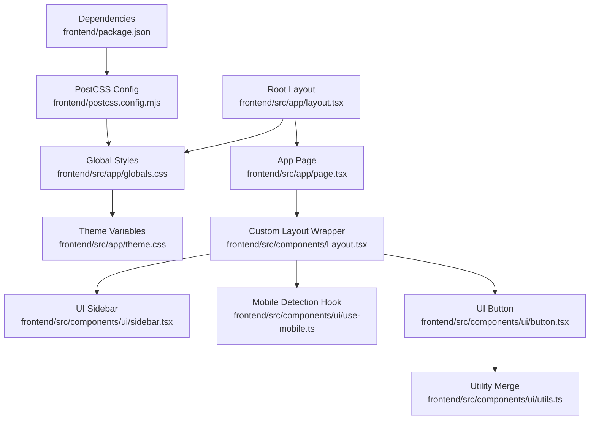
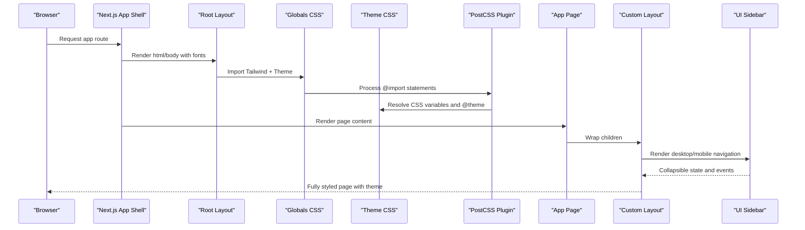
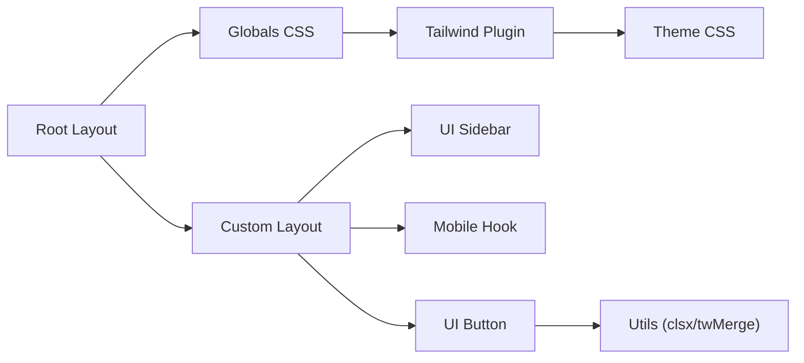

# Layout System

<cite>
**Referenced Files in This Document**
- [layout.tsx](file://frontend/src/app/layout.tsx)
- [Layout.tsx](file://frontend/src/components/Layout.tsx)
- [globals.css](file://frontend/src/app/globals.css)
- [theme.css](file://frontend/src/app/theme.css)
- [sidebar.tsx](file://frontend/src/components/ui/sidebar.tsx)
- [use-mobile.ts](file://frontend/src/components/ui/use-mobile.ts)
- [button.tsx](file://frontend/src/components/ui/button.tsx)
- [utils.ts](file://frontend/src/components/ui/utils.ts)
- [postcss.config.mjs](file://frontend/postcss.config.mjs)
- [package.json](file://frontend/package.json)
- [page.tsx](file://frontend/src/app/page.tsx)
- [Dashboard.tsx](file://frontend/src/components/pages/Dashboard.tsx)
</cite>

## Table of Contents
1. [Introduction](#introduction)
2. [Project Structure](#project-structure)
3. [Core Components](#core-components)
4. [Architecture Overview](#architecture-overview)
5. [Detailed Component Analysis](#detailed-component-analysis)
6. [Dependency Analysis](#dependency-analysis)
7. [Performance Considerations](#performance-considerations)
8. [Troubleshooting Guide](#troubleshooting-guide)
9. [Conclusion](#conclusion)

## Introduction
This document describes the PPA layout system and theming implementation. It covers the main Layout component structure, responsive design patterns, navigation behaviors, and the theme system including color schemes, typography, spacing, and component styling. It also documents CSS custom properties usage, Tailwind CSS configuration, responsive breakpoints, layout composition patterns, sidebar navigation, header components, and footer implementations. Guidance is included for dark/light theme switching, accessibility compliance, cross-browser compatibility, and practical examples for customization and responsive behavior.

## Project Structure
The layout system is implemented primarily in the Next.js app shell and a reusable Layout component. Theming is centralized via CSS custom properties and Tailwind v4 configuration. UI primitives and utilities support consistent styling and responsive behavior.

**Diagram sources**
- [layout.tsx:1-34](file://frontend/src/app/layout.tsx#L1-L34)
- [globals.css:1-2](file://frontend/src/app/globals.css#L1-L2)
- [theme.css:1-128](file://frontend/src/app/theme.css#L1-L128)
- [page.tsx:1-12](file://frontend/src/app/page.tsx#L1-L12)
- [Layout.tsx:1-161](file://frontend/src/components/Layout.tsx#L1-L161)
- [sidebar.tsx:1-727](file://frontend/src/components/ui/sidebar.tsx#L1-L727)
- [use-mobile.ts:1-22](file://frontend/src/components/ui/use-mobile.ts#L1-L22)
- [button.tsx:1-59](file://frontend/src/components/ui/button.tsx#L1-L59)
- [utils.ts:1-7](file://frontend/src/components/ui/utils.ts#L1-L7)
- [postcss.config.mjs:1-8](file://frontend/postcss.config.mjs#L1-L8)
- [package.json:1-33](file://frontend/package.json#L1-L33)

**Section sources**
- [layout.tsx:1-34](file://frontend/src/app/layout.tsx#L1-L34)
- [globals.css:1-2](file://frontend/src/app/globals.css#L1-L2)
- [theme.css:1-128](file://frontend/src/app/theme.css#L1-L128)
- [page.tsx:1-12](file://frontend/src/app/page.tsx#L1-L12)

## Core Components
- Root Layout: Sets up fonts, global styles, and wraps children in a flex column container.
- Custom Layout: Provides desktop sidebar, mobile header and drawer, and main content area with appropriate padding and margins.
- UI Sidebar: A flexible, accessible sidebar with collapsible modes, mobile off-canvas behavior, keyboard shortcuts, and cookie-persisted state.
- Mobile Detection: A hook returning a boolean based on media queries for responsive behavior.
- UI Button: A styled button primitive using Tailwind classes and variant logic.
- Utilities: A utility for merging Tailwind classes safely.

**Section sources**
- [layout.tsx:1-34](file://frontend/src/app/layout.tsx#L1-L34)
- [Layout.tsx:1-161](file://frontend/src/components/Layout.tsx#L1-L161)
- [sidebar.tsx:1-727](file://frontend/src/components/ui/sidebar.tsx#L1-L727)
- [use-mobile.ts:1-22](file://frontend/src/components/ui/use-mobile.ts#L1-L22)
- [button.tsx:1-59](file://frontend/src/components/ui/button.tsx#L1-L59)
- [utils.ts:1-7](file://frontend/src/components/ui/utils.ts#L1-L7)

## Architecture Overview
The layout architecture combines Next.js app shell configuration with a custom Layout wrapper. The theme system uses CSS custom properties with Tailwind v4 @theme and @custom-variant directives. Responsive behavior is handled via Tailwind utilities and a mobile detection hook.

**Diagram sources**
- [layout.tsx:1-34](file://frontend/src/app/layout.tsx#L1-L34)
- [globals.css:1-2](file://frontend/src/app/globals.css#L1-L2)
- [theme.css:1-128](file://frontend/src/app/theme.css#L1-L128)
- [postcss.config.mjs:1-8](file://frontend/postcss.config.mjs#L1-L8)
- [page.tsx:1-12](file://frontend/src/app/page.tsx#L1-L12)
- [Layout.tsx:1-161](file://frontend/src/components/Layout.tsx#L1-L161)
- [sidebar.tsx:1-727](file://frontend/src/components/ui/sidebar.tsx#L1-L727)

## Detailed Component Analysis

### Root Layout and App Shell
- Applies Google Fonts via Next Font and injects font variables into CSS custom properties.
- Wraps children in a flex column container suitable for page layouts.
- Ensures anti-aliasing and full-height stacking contexts.

**Section sources**
- [layout.tsx:1-34](file://frontend/src/app/layout.tsx#L1-L34)

### Custom Layout Component
Responsibilities:
- Desktop sidebar with fixed position, logo branding, and navigation items.
- Active state highlighting based on current pathname.
- Mobile header with hamburger menu and logo.
- Mobile drawer overlay with close controls and navigation.
- Main content area with left padding to accommodate desktop sidebar.

Responsive behavior:
- Desktop: Fixed sidebar with lg breakpoint.
- Mobile: Sticky header and overlay drawer triggered by a button.

Navigation:
- Uses Next.js Link for client-side navigation.
- Icons from lucide-react enhance visual affordances.

Accessibility:
- Proper contrast via theme variables.
- Focus-visible rings and hover states.

**Section sources**
- [Layout.tsx:1-161](file://frontend/src/components/Layout.tsx#L1-L161)

### Theme System and CSS Custom Properties
- Defines light and dark variants using a custom dark selector.
- Centralizes color tokens for backgrounds, foregrounds, primary/accent colors, borders, and UI surfaces.
- Exposes Tailwind-compatible tokens via @theme for consistent design tokens.
- Includes sidebar-specific tokens for consistent theming across sidebar variants.

Usage:
- Components reference theme variables (e.g., text colors, backgrounds, borders).
- Dark mode toggled by adding/removing the dark class on the root element.

**Section sources**
- [theme.css:1-128](file://frontend/src/app/theme.css#L1-L128)

### Tailwind CSS Configuration and PostCSS
- Tailwind v4 configured via PostCSS plugin.
- Imports Tailwind base and theme CSS in globals.
- No explicit tailwind.config.js indicates default behavior.

**Section sources**
- [postcss.config.mjs:1-8](file://frontend/postcss.config.mjs#L1-L8)
- [globals.css:1-2](file://frontend/src/app/globals.css#L1-L2)
- [package.json:1-33](file://frontend/package.json#L1-L33)

### UI Sidebar Component
Capabilities:
- Provider manages expanded/collapsed state, cookies, and keyboard shortcuts.
- Supports three collapsible modes: offcanvas, icon, none.
- Mobile: Sheet-based off-canvas drawer with responsive width.
- Desktop: Fixed sidebar with optional rail and inset/floating variants.
- Rich slot-based composition for header, content, footer, and menu groups.

Responsive behavior:
- Uses the mobile detection hook to switch between desktop and mobile rendering.
- Applies CSS custom properties for widths and spacing.

Accessibility:
- Tooltip provider for collapsed tooltips.
- Proper ARIA attributes and keyboard navigation.

**Section sources**
- [sidebar.tsx:1-727](file://frontend/src/components/ui/sidebar.tsx#L1-L727)
- [use-mobile.ts:1-22](file://frontend/src/components/ui/use-mobile.ts#L1-L22)

### Mobile Detection Hook
- Detects mobile viewport using a media query with a breakpoint constant.
- Returns a boolean state synchronized with window resize events.

**Section sources**
- [use-mobile.ts:1-22](file://frontend/src/components/ui/use-mobile.ts#L1-L22)

### UI Button Primitive
- Provides variants (default, destructive, outline, secondary, ghost, link) and sizes.
- Integrates with focus-visible rings and disabled states.
- Uses a slot component for semantic flexibility.

**Section sources**
- [button.tsx:1-59](file://frontend/src/components/ui/button.tsx#L1-L59)
- [utils.ts:1-7](file://frontend/src/components/ui/utils.ts#L1-L7)

### Layout Composition Patterns
- Desktop sidebar pattern: fixed left sidebar with content offset via margin/padding.
- Mobile drawer pattern: overlay drawer with backdrop blur and close button.
- Content area pattern: constrained width and padding for readability.

Responsive breakpoints:
- lg breakpoint separates desktop from mobile sidebar behavior.
- Additional breakpoints used within components (e.g., grid layouts).

**Section sources**
- [Layout.tsx:1-161](file://frontend/src/components/Layout.tsx#L1-L161)

### Navigation Patterns
- Static navigation list with icons and active state detection.
- Path-based active highlighting for both desktop and mobile menus.
- Mobile drawer reuses the same navigation structure.

**Section sources**
- [Layout.tsx:27-84](file://frontend/src/components/Layout.tsx#L27-L84)
- [Layout.tsx:105-150](file://frontend/src/components/Layout.tsx#L105-L150)

### Header Components
- Desktop: Fixed sidebar header with branding and logo.
- Mobile: Sticky header with hamburger menu and logo.

**Section sources**
- [Layout.tsx:40-55](file://frontend/src/components/Layout.tsx#L40-L55)
- [Layout.tsx:86-103](file://frontend/src/components/Layout.tsx#L86-L103)

### Footer Implementations
- Not present in the current layout implementation.
- Can be added within the main content area or as part of page-level components.

**Section sources**
- [Layout.tsx:152-158](file://frontend/src/components/Layout.tsx#L152-L158)

### Dark/Light Theme Switching
- Implemented via CSS custom properties with a dark selector.
- Apply the dark class to the root element to switch themes.
- All components consume theme variables, ensuring consistent switching.

**Section sources**
- [theme.css:1-128](file://frontend/src/app/theme.css#L1-L128)

### Accessibility Compliance
- Focus-visible rings and high-contrast colors from theme variables.
- Semantic HTML and proper ARIA attributes in UI components.
- Mobile drawer includes screen-reader-friendly headers.

**Section sources**
- [button.tsx:1-59](file://frontend/src/components/ui/button.tsx#L1-L59)
- [sidebar.tsx:188-204](file://frontend/src/components/ui/sidebar.tsx#L188-L204)

### Cross-Browser Compatibility
- Tailwind v4 and PostCSS ensure modern CSS features are supported.
- CSS custom properties are widely supported; fallbacks are implicit via Tailwind tokens.

**Section sources**
- [postcss.config.mjs:1-8](file://frontend/postcss.config.mjs#L1-L8)
- [package.json:1-33](file://frontend/package.json#L1-L33)

### Examples of Layout Customization
- Modifying sidebar width: adjust CSS custom properties in theme variables.
- Changing active state colors: update primary and foreground tokens.
- Adding a footer: insert a footer section within the main content area.
- Extending navigation: add items to the navigation array in the Layout component.

**Section sources**
- [theme.css:3-46](file://frontend/src/app/theme.css#L3-L46)
- [Layout.tsx:27-36](file://frontend/src/components/Layout.tsx#L27-L36)
- [Layout.tsx:152-158](file://frontend/src/components/Layout.tsx#L152-L158)

### Component Positioning and Spacing
- Desktop sidebar uses fixed positioning and left offset for content area.
- Mobile drawer uses absolute positioning and z-index stacking.
- Spacing scales are derived from theme variables and applied via Tailwind utilities.

**Section sources**
- [Layout.tsx:40-42](file://frontend/src/components/Layout.tsx#L40-L42)
- [Layout.tsx:153-157](file://frontend/src/components/Layout.tsx#L153-L157)
- [theme.css:37-37](file://frontend/src/app/theme.css#L37-L37)

### Responsive Behavior Across Screen Sizes
- Desktop: Full-width content with left sidebar.
- Tablet/Mobile: Content shifts to full width with mobile drawer overlay.
- Breakpoint: lg threshold separates desktop from mobile behavior.

**Section sources**
- [Layout.tsx:40-42](file://frontend/src/components/Layout.tsx#L40-L42)
- [Layout.tsx:153-157](file://frontend/src/components/Layout.tsx#L153-L157)
- [use-mobile.ts:3-3](file://frontend/src/components/ui/use-mobile.ts#L3-L3)

## Dependency Analysis
The layout system relies on:
- Next.js app shell for routing and SSR/SSG.
- Tailwind CSS v4 via PostCSS plugin for utility-first styling.
- Lucide React for icons.
- Radix UI slots and utilities for accessible UI components.
- clsx and tailwind-merge for safe class merging.

**Diagram sources**
- [layout.tsx:1-34](file://frontend/src/app/layout.tsx#L1-L34)
- [globals.css:1-2](file://frontend/src/app/globals.css#L1-L2)
- [postcss.config.mjs:1-8](file://frontend/postcss.config.mjs#L1-L8)
- [Layout.tsx:1-161](file://frontend/src/components/Layout.tsx#L1-L161)
- [sidebar.tsx:1-727](file://frontend/src/components/ui/sidebar.tsx#L1-L727)
- [use-mobile.ts:1-22](file://frontend/src/components/ui/use-mobile.ts#L1-L22)
- [button.tsx:1-59](file://frontend/src/components/ui/button.tsx#L1-L59)
- [utils.ts:1-7](file://frontend/src/components/ui/utils.ts#L1-L7)
- [theme.css:1-128](file://frontend/src/app/theme.css#L1-L128)

**Section sources**
- [package.json:1-33](file://frontend/package.json#L1-L33)
- [postcss.config.mjs:1-8](file://frontend/postcss.config.mjs#L1-L8)

## Performance Considerations
- Prefer CSS custom properties for theming to avoid runtime style recalculation.
- Use Tailwind utilities for efficient class composition.
- Keep sidebar content minimal to reduce layout thrashing on mobile.
- Lazy-load heavy charts and data tables on demand.

## Troubleshooting Guide
- Theme not applying: ensure the dark class is toggled on the root element and CSS variables are defined.
- Sidebar not collapsing: verify cookie persistence and keyboard shortcut handler.
- Mobile drawer not closing: check click-outside handlers and overlay backdrop logic.
- Typography not loading: confirm font variables are injected into the html element.

**Section sources**
- [theme.css:1-128](file://frontend/src/app/theme.css#L1-L128)
- [sidebar.tsx:76-89](file://frontend/src/components/ui/sidebar.tsx#L76-L89)
- [Layout.tsx:106-150](file://frontend/src/components/Layout.tsx#L106-L150)
- [layout.tsx:26-28](file://frontend/src/app/layout.tsx#L26-L28)

## Conclusion
The PPA layout system integrates Next.js app shell configuration with a custom Layout component and a robust theme system built on CSS custom properties and Tailwind v4. The UI sidebar provides flexible, accessible navigation across devices, while responsive patterns ensure optimal usability on desktop and mobile. The modular design allows easy customization of colors, spacing, and layout composition without compromising accessibility or cross-browser compatibility.