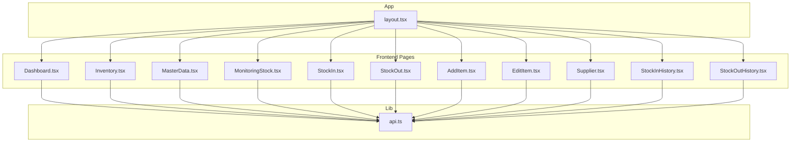
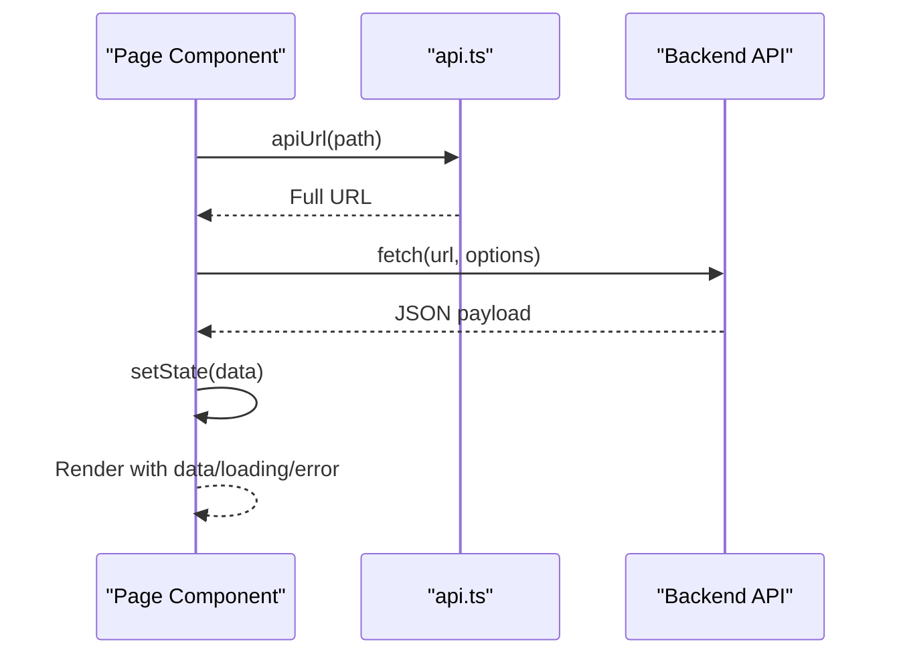
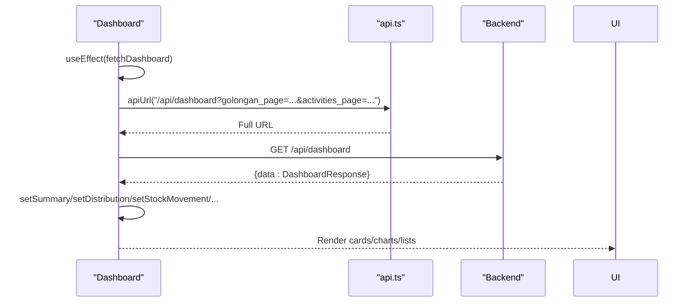
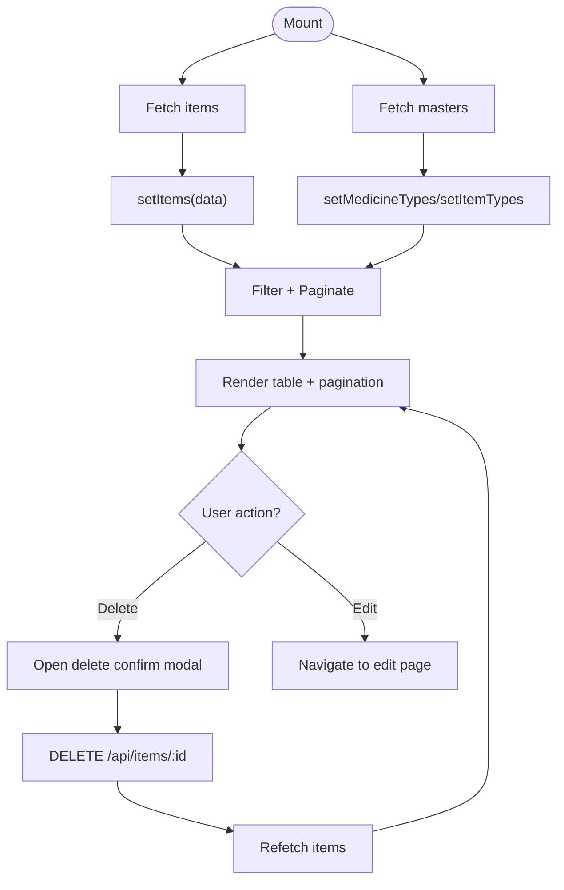
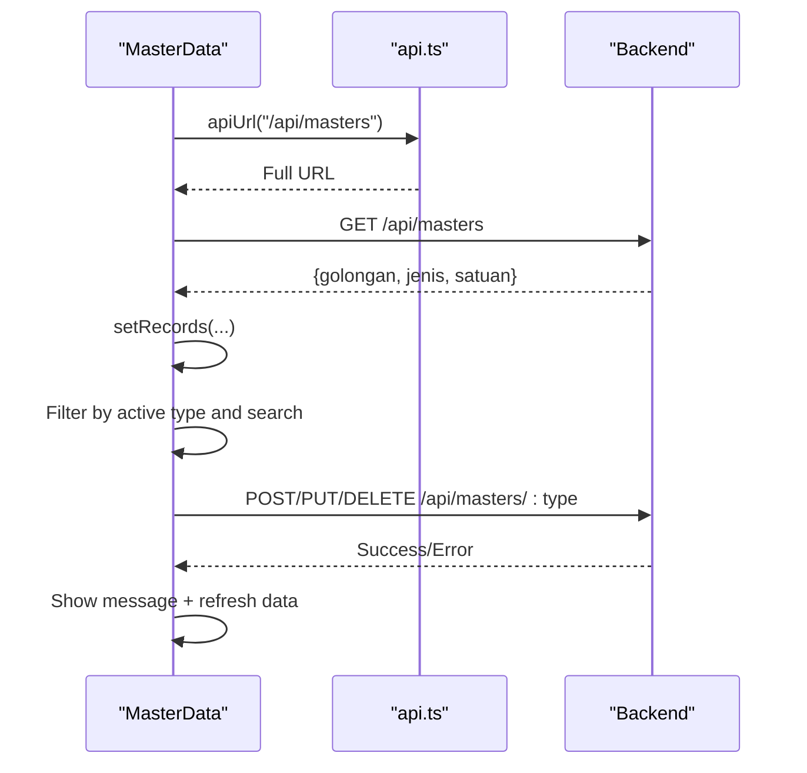
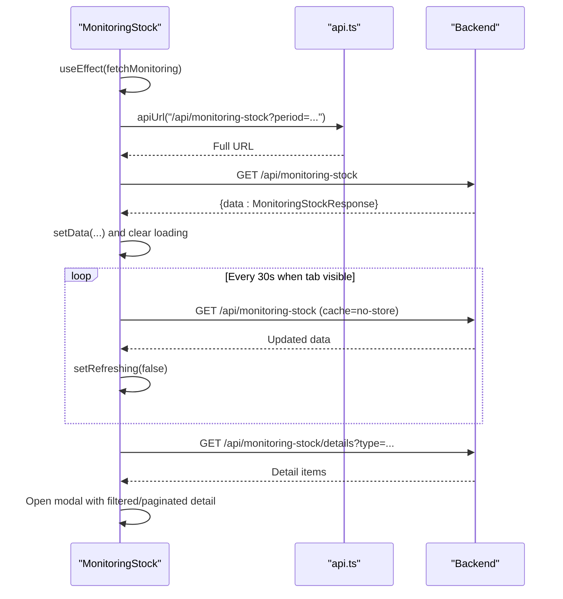
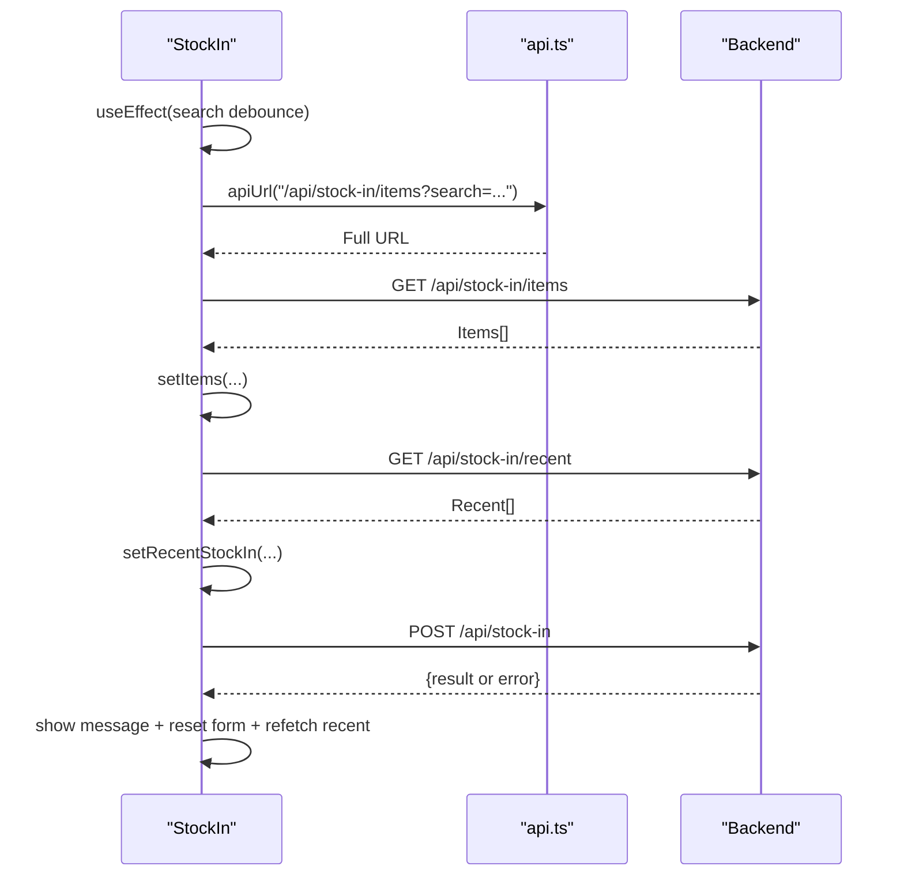
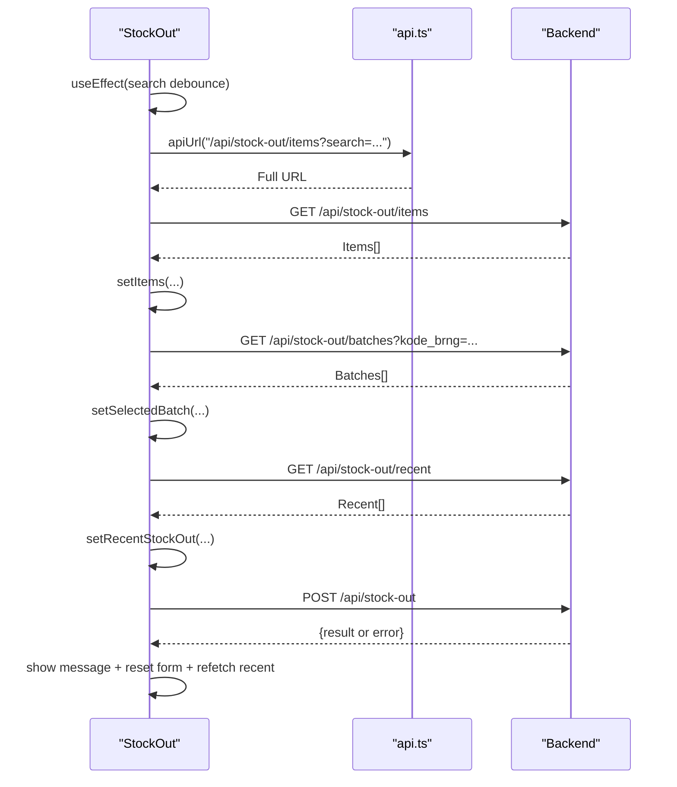
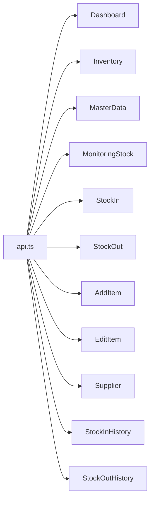

# Page Components

<cite>
**Referenced Files in This Document**
- [Dashboard.tsx](file://frontend/src/components/pages/Dashboard.tsx)
- [Inventory.tsx](file://frontend/src/components/pages/Inventory.tsx)
- [MasterData.tsx](file://frontend/src/components/pages/MasterData.tsx)
- [MonitoringStock.tsx](file://frontend/src/components/pages/MonitoringStock.tsx)
- [StockIn.tsx](file://frontend/src/components/pages/StockIn.tsx)
- [StockOut.tsx](file://frontend/src/components/pages/StockOut.tsx)
- [AddItem.tsx](file://frontend/src/components/pages/AddItem.tsx)
- [EditItem.tsx](file://frontend/src/components/pages/EditItem.tsx)
- [Supplier.tsx](file://frontend/src/components/pages/Supplier.tsx)
- [StockInHistory.tsx](file://frontend/src/components/pages/StockInHistory.tsx)
- [StockOutHistory.tsx](file://frontend/src/components/pages/StockOutHistory.tsx)
- [api.ts](file://frontend/src/lib/api.ts)
- [layout.tsx](file://frontend/src/app/layout.tsx)
</cite>

## Table of Contents
1. [Introduction](#introduction)
2. [Project Structure](#project-structure)
3. [Core Components](#core-components)
4. [Architecture Overview](#architecture-overview)
5. [Detailed Component Analysis](#detailed-component-analysis)
6. [Dependency Analysis](#dependency-analysis)
7. [Performance Considerations](#performance-considerations)
8. [Troubleshooting Guide](#troubleshooting-guide)
9. [Conclusion](#conclusion)

## Introduction
This document provides comprehensive technical and practical documentation for the page-level components of the PPA application. It covers the major pages: Dashboard, Inventory management, Stock operations (Stock In/Out), Master data management, Supplier management, and Reporting pages (Stock In/Out History). For each page, we explain component structure, data fetching patterns, state management, API integration, lifecycle management, error handling, loading states, reusable patterns, props, and integration with the overall application layout. We also include diagrams to illustrate component interactions and data flows.

## Project Structure
The frontend is a Next.js application with a pages directory under src/components/pages. Each page component encapsulates UI, state, and data fetching logic. API base URL resolution is centralized via a small utility that reads environment variables or defaults to the current host/port. The application layout sets up fonts and global styles.

**Diagram sources**
- [Dashboard.tsx](file://frontend/src/components/pages/Dashboard.tsx)
- [Inventory.tsx](file://frontend/src/components/pages/Inventory.tsx)
- [MasterData.tsx](file://frontend/src/components/pages/MasterData.tsx)
- [MonitoringStock.tsx](file://frontend/src/components/pages/MonitoringStock.tsx)
- [StockIn.tsx](file://frontend/src/components/pages/StockIn.tsx)
- [StockOut.tsx](file://frontend/src/components/pages/StockOut.tsx)
- [AddItem.tsx](file://frontend/src/components/pages/AddItem.tsx)
- [EditItem.tsx](file://frontend/src/components/pages/EditItem.tsx)
- [Supplier.tsx](file://frontend/src/components/pages/Supplier.tsx)
- [StockInHistory.tsx](file://frontend/src/components/pages/StockInHistory.tsx)
- [StockOutHistory.tsx](file://frontend/src/components/pages/StockOutHistory.tsx)
- [api.ts](file://frontend/src/lib/api.ts)
- [layout.tsx](file://frontend/src/app/layout.tsx)

**Section sources**
- [layout.tsx:20-33](file://frontend/src/app/layout.tsx#L20-L33)

## Core Components
- Dashboard: Aggregates system summaries, charts, and recent activity feeds. Implements pagination and notification panel.
- Inventory: Lists items with filtering, search, pagination, and deletion confirmation modal.
- MasterData: Manages classification data (golongan, jenis, satuan) with CRUD operations and search.
- MonitoringStock: Real-time stock monitoring with auto-refresh, detail modals, and categorized lists.
- StockIn/StockOut: Forms to record incoming/outgoing transactions with item search, batch selection, and totals.
- AddItem/EditItem: Forms to add or update items with pricing calculations and master data integration.
- Supplier: Manages supplier records with search, pagination, and modal-based CRUD.
- StockInHistory/StockOutHistory: Paginated, searchable transaction histories with filters and totals.

**Section sources**
- [Dashboard.tsx:157-667](file://frontend/src/components/pages/Dashboard.tsx#L157-L667)
- [Inventory.tsx:62-605](file://frontend/src/components/pages/Inventory.tsx#L62-L605)
- [MasterData.tsx:58-535](file://frontend/src/components/pages/MasterData.tsx#L58-L535)
- [MonitoringStock.tsx:152-800](file://frontend/src/components/pages/MonitoringStock.tsx#L152-L800)
- [StockIn.tsx:46-424](file://frontend/src/components/pages/StockIn.tsx#L46-L424)
- [StockOut.tsx:92-528](file://frontend/src/components/pages/StockOut.tsx#L92-L528)
- [AddItem.tsx:17-707](file://frontend/src/components/pages/AddItem.tsx#L17-L707)
- [EditItem.tsx:55-625](file://frontend/src/components/pages/EditItem.tsx#L55-L625)
- [Supplier.tsx:20-482](file://frontend/src/components/pages/Supplier.tsx#L20-L482)
- [StockInHistory.tsx:58-404](file://frontend/src/components/pages/StockInHistory.tsx#L58-L404)
- [StockOutHistory.tsx:57-397](file://frontend/src/components/pages/StockOutHistory.tsx#L57-L397)

## Architecture Overview
Each page component follows a consistent pattern:
- Centralized API URL resolution via apiUrl utility.
- Local state for UI and data (useState/useEffect).
- Fetching data on mount or on demand (useEffect with dependency arrays).
- Error handling with user-visible messages and fallback UI.
- Loading states with skeleton or message placeholders.
- Pagination and search implemented per page needs.
- Modals/dialogs for destructive actions and detailed views.

**Diagram sources**
- [api.ts:15-18](file://frontend/src/lib/api.ts#L15-L18)
- [Dashboard.tsx:173-214](file://frontend/src/components/pages/Dashboard.tsx#L173-L214)
- [Inventory.tsx:77-132](file://frontend/src/components/pages/Inventory.tsx#L77-L132)
- [MasterData.tsx:76-118](file://frontend/src/components/pages/MasterData.tsx#L76-L118)
- [MonitoringStock.tsx:189-221](file://frontend/src/components/pages/MonitoringStock.tsx#L189-L221)
- [StockIn.tsx:61-82](file://frontend/src/components/pages/StockIn.tsx#L61-L82)
- [StockOut.tsx:110-131](file://frontend/src/components/pages/StockOut.tsx#L110-L131)
- [AddItem.tsx:101-117](file://frontend/src/components/pages/AddItem.tsx#L101-L117)
- [EditItem.tsx:82-108](file://frontend/src/components/pages/EditItem.tsx#L82-L108)
- [Supplier.tsx:29-52](file://frontend/src/components/pages/Supplier.tsx#L29-L52)
- [StockInHistory.tsx:70-132](file://frontend/src/components/pages/StockInHistory.tsx#L70-L132)
- [StockOutHistory.tsx:69-131](file://frontend/src/components/pages/StockOutHistory.tsx#L69-L131)

## Detailed Component Analysis

### Dashboard
- Purpose: Provide system overview with KPI cards, stock movement chart, category distribution pie chart, and recent activity feed.
- Data fetching: Uses URLSearchParams for pagination and fetches aggregated dashboard data.
- State management: Tracks summary, distribution, movement, recent activities, pagination, and notifications.
- UI patterns: Responsive grid, Recharts integration, pagination controls, and notification dropdown.
- Error/loading: Dedicated error banner and loading skeleton.
- Integration: Uses apiUrl utility and recharts for visualization.

**Diagram sources**
- [Dashboard.tsx:173-214](file://frontend/src/components/pages/Dashboard.tsx#L173-L214)
- [api.ts:15-18](file://frontend/src/lib/api.ts#L15-L18)

**Section sources**
- [Dashboard.tsx:157-667](file://frontend/src/components/pages/Dashboard.tsx#L157-L667)

### Inventory
- Purpose: Manage item catalog with search, filters, pagination, and CRUD actions.
- Data fetching: Loads items and master data concurrently on mount.
- State management: Items, filters (search, category, type), pagination, and delete confirmation.
- UI patterns: Large data table with sticky header, category badges, and action buttons.
- Error/loading: Minimal; relies on network errors surfaced via message banners.
- Integration: Uses axios for item CRUD and fetch for master data.

**Diagram sources**
- [Inventory.tsx:77-132](file://frontend/src/components/pages/Inventory.tsx#L77-L132)
- [Inventory.tsx:134-173](file://frontend/src/components/pages/Inventory.tsx#L134-L173)

**Section sources**
- [Inventory.tsx:62-605](file://frontend/src/components/pages/Inventory.tsx#L62-L605)

### Master Data Management
- Purpose: Manage classification data (golongan, jenis, satuan) with search, add/edit/delete.
- Data fetching: Single fetch on mount to populate all classifications.
- State management: Active type, records, search query, modal visibility, and form state.
- UI patterns: Tabbed classification selector, searchable table, modal forms, and temporary messages.
- Error/loading: Error banner and loading indicator during initial fetch.
- Integration: Uses fetch for CRUD against /api/masters/:type endpoints.

**Diagram sources**
- [MasterData.tsx:76-118](file://frontend/src/components/pages/MasterData.tsx#L76-L118)
- [MasterData.tsx:225-281](file://frontend/src/components/pages/MasterData.tsx#L225-L281)
- [api.ts:15-18](file://frontend/src/lib/api.ts#L15-L18)

**Section sources**
- [MasterData.tsx:58-535](file://frontend/src/components/pages/MasterData.tsx#L58-L535)

### Monitoring Stock
- Purpose: Real-time monitoring of stock status with auto-refresh and detailed modals.
- Data fetching: Periodic polling with visibility change listener; detail modals fetch on open.
- State management: Period selection, summary, lists, pagination-like detail state, and modal visibility.
- UI patterns: Status cards, bar/pie charts, categorized lists, and modal with search and pagination.
- Error/loading: Dedicated error banner and spinner; detail modal has its own loader.
- Integration: Uses fetch with cache bypass for real-time updates.

**Diagram sources**
- [MonitoringStock.tsx:189-241](file://frontend/src/components/pages/MonitoringStock.tsx#L189-L241)
- [MonitoringStock.tsx:165-182](file://frontend/src/components/pages/MonitoringStock.tsx#L165-L182)
- [api.ts:15-18](file://frontend/src/lib/api.ts#L15-L18)

**Section sources**
- [MonitoringStock.tsx:152-800](file://frontend/src/components/pages/MonitoringStock.tsx#L152-L800)

### Stock Operations: Stock In
- Purpose: Record incoming stock with item search, batch details, and transaction logging.
- Data fetching: Debounced search for items; recent transactions fetched on mount.
- State management: Search term, item list, selected item, quantity, pricing, dates, notes, and message feedback.
- UI patterns: Item search dropdown, selected item preview, form inputs, totals preview, and recent transactions list.
- Error/loading: Temporary message banners and loading state during submission.
- Integration: Uses fetch for item search, recent transactions, and posting new stock-in.

**Diagram sources**
- [StockIn.tsx:84-119](file://frontend/src/components/pages/StockIn.tsx#L84-L119)
- [StockIn.tsx:147-185](file://frontend/src/components/pages/StockIn.tsx#L147-L185)
- [api.ts:15-18](file://frontend/src/lib/api.ts#L15-L18)

**Section sources**
- [StockIn.tsx:46-424](file://frontend/src/components/pages/StockIn.tsx#L46-L424)

### Stock Operations: Stock Out
- Purpose: Record outgoing stock with batch selection, destination routing, and revenue calculation.
- Data fetching: Debounced item search; batch options loaded after item selection; recent transactions fetched on mount.
- State management: Search term, items, selected item, batches, selected batch, quantity, destination, note, and message feedback.
- UI patterns: Batch selector with availability checks, real-time price computation, and recent transactions list.
- Error/loading: Temporary message banners, stock availability validation, and loading state during submission.
- Integration: Uses fetch for item search, batch details, recent transactions, and posting new stock-out.

**Diagram sources**
- [StockOut.tsx:133-189](file://frontend/src/components/pages/StockOut.tsx#L133-L189)
- [StockOut.tsx:225-266](file://frontend/src/components/pages/StockOut.tsx#L225-L266)
- [api.ts:15-18](file://frontend/src/lib/api.ts#L15-L18)

**Section sources**
- [StockOut.tsx:92-528](file://frontend/src/components/pages/StockOut.tsx#L92-L528)

### Item Management: Add Item
- Purpose: Add new items with pricing and master data integration.
- Data fetching: Fetches master data on mount; submits new item via POST.
- State management: Form state, pricing calculations, and message feedback.
- UI patterns: Toggle between medicine/non-medicine, master dropdowns, currency formatting, and margin display.
- Error/loading: Validation feedback and loading state during submission.
- Integration: Uses fetch for master data and item creation.

**Section sources**
- [AddItem.tsx:17-707](file://frontend/src/components/pages/AddItem.tsx#L17-L707)

### Item Management: Edit Item
- Purpose: Edit existing items with master data integration.
- Data fetching: Fetches master data on mount; loads item details via GET; updates via PUT.
- State management: Form state, pricing calculations, and message feedback.
- UI patterns: Toggle between medicine/non-medicine, master dropdowns, currency formatting, and margin display.
- Error/loading: Validation feedback and navigation on success.
- Integration: Uses fetch for master data, item retrieval, and update.

**Section sources**
- [EditItem.tsx:55-625](file://frontend/src/components/pages/EditItem.tsx#L55-L625)

### Supplier Management
- Purpose: Manage supplier records with search, pagination, and modal-based CRUD.
- Data fetching: Fetches suppliers on mount; handles add/edit/delete via fetch.
- State management: Suppliers list, search query, pagination, modal visibility, and form state.
- UI patterns: Stats row, searchable table, pagination controls, and modal forms.
- Error/loading: Minimal; relies on network errors surfaced via console.
- Integration: Uses fetch for supplier CRUD.

**Section sources**
- [Supplier.tsx:20-482](file://frontend/src/components/pages/Supplier.tsx#L20-L482)

### Reporting: Stock In History
- Purpose: View paginated, searchable, and filterable stock-in transaction history.
- Data fetching: Debounced search and date filter; paginated via URL params.
- State management: Search query, date filter, pagination, totals, and error state.
- UI patterns: Stats cards, filters, large data table, pagination controls, and reload button.
- Error/loading: Dedicated error banner and loading state.
- Integration: Uses fetch with abort controller for debounced search.

**Section sources**
- [StockInHistory.tsx:58-404](file://frontend/src/components/pages/StockInHistory.tsx#L58-L404)

### Reporting: Stock Out History
- Purpose: View paginated, searchable, and filterable stock-out transaction history.
- Data fetching: Debounced search and date filter; paginated via URL params.
- State management: Search query, date filter, pagination, totals, and error state.
- UI patterns: Stats cards, filters, large data table, pagination controls, and reload button.
- Error/loading: Dedicated error banner and loading state.
- Integration: Uses fetch with abort controller for debounced search.

**Section sources**
- [StockOutHistory.tsx:57-397](file://frontend/src/components/pages/StockOutHistory.tsx#L57-L397)

## Dependency Analysis
- API Utility: All page components depend on apiUrl to construct absolute URLs. This centralizes environment-driven base URL resolution.
- React Hooks: useEffect/useState are used pervasively for lifecycle and state management.
- Third-party Libraries: Recharts for charts, Lucide icons for UI, and Next.js routing for navigation.
- Backend Contracts: Components expect specific JSON shapes from backend endpoints; mismatches surface as errors or empty lists.

**Diagram sources**
- [api.ts:15-18](file://frontend/src/lib/api.ts#L15-L18)
- [Dashboard.tsx:28-28](file://frontend/src/components/pages/Dashboard.tsx#L28-L28)
- [Inventory.tsx:8-8](file://frontend/src/components/pages/Inventory.tsx#L8-L8)
- [MasterData.tsx:5-5](file://frontend/src/components/pages/MasterData.tsx#L5-L5)
- [MonitoringStock.tsx:7-7](file://frontend/src/components/pages/MonitoringStock.tsx#L7-L7)
- [StockIn.tsx:7-7](file://frontend/src/components/pages/StockIn.tsx#L7-L7)
- [StockOut.tsx:7-7](file://frontend/src/components/pages/StockOut.tsx#L7-L7)
- [AddItem.tsx:5-5](file://frontend/src/components/pages/AddItem.tsx#L5-L5)
- [EditItem.tsx:7-7](file://frontend/src/components/pages/EditItem.tsx#L7-L7)
- [Supplier.tsx:4-4](file://frontend/src/components/pages/Supplier.tsx#L4-L4)
- [StockInHistory.tsx:7-7](file://frontend/src/components/pages/StockInHistory.tsx#L7-L7)
- [StockOutHistory.tsx:7-7](file://frontend/src/components/pages/StockOutHistory.tsx#L7-L7)

**Section sources**
- [api.ts:1-18](file://frontend/src/lib/api.ts#L1-L18)

## Performance Considerations
- Debounced Search: StockIn/StockOut use a 300ms debounce with AbortController to avoid excessive requests.
- Pagination: Inventory and Supplier pages implement server-side pagination; StockInHistory/StockOutHistory use client-side pagination with large page sizes.
- Auto-refresh: MonitoringStock polls every 30 seconds and respects document visibility to minimize unnecessary work.
- Lazy Rendering: Large tables use virtualization-friendly patterns (scroll containers) to keep rendering efficient.
- Currency Formatting: Formatting is applied on render; consider memoizing heavy computations if needed.

[No sources needed since this section provides general guidance]

## Troubleshooting Guide
- API Base URL Issues: Verify NEXT_PUBLIC_API_URL or NEXT_PUBLIC_API_PORT; apiUrl resolves to window location hostname:port if env var is missing.
- Network Errors: Components display temporary messages or dedicated banners; check browser console for stack traces.
- Empty States: Some pages show empty states when no data matches filters; adjust search terms or filters.
- Visibility-based Refresh: MonitoringStock only refreshes when the tab is visible to reduce load.
- AbortController: StockInHistory/StockOutHistory cancel stale requests on rapid filter changes.

**Section sources**
- [api.ts:1-18](file://frontend/src/lib/api.ts#L1-L18)
- [StockIn.tsx:84-109](file://frontend/src/components/pages/StockIn.tsx#L84-L109)
- [StockOut.tsx:133-156](file://frontend/src/components/pages/StockOut.tsx#L133-L156)
- [MonitoringStock.tsx:223-241](file://frontend/src/components/pages/MonitoringStock.tsx#L223-L241)
- [StockInHistory.tsx:122-132](file://frontend/src/components/pages/StockInHistory.tsx#L122-L132)
- [StockOutHistory.tsx:121-131](file://frontend/src/components/pages/StockOutHistory.tsx#L121-L131)

## Conclusion
The page components are cohesive, following consistent patterns for data fetching, state management, and UI rendering. They integrate tightly with the centralized API utility and leverage Next.js routing and UI primitives. The components are modular, testable, and maintainable, with clear separation of concerns and robust error handling. Extending or modifying these pages should adhere to the established patterns to preserve consistency and reliability.