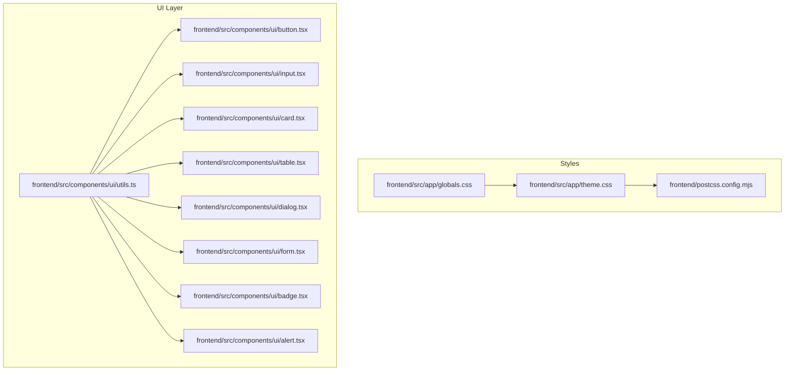
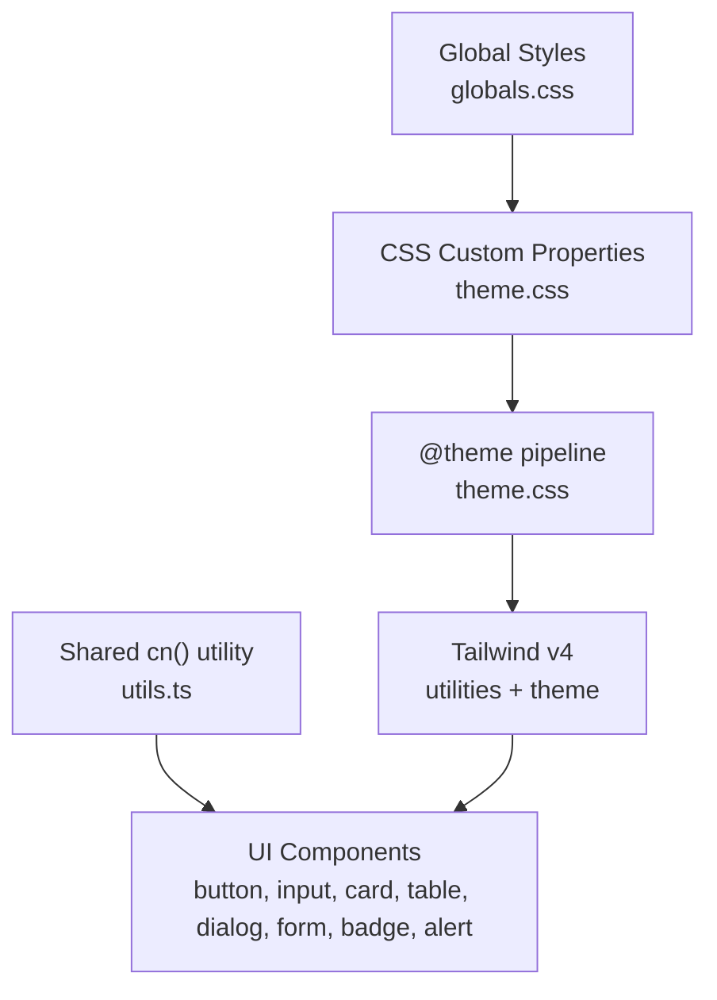
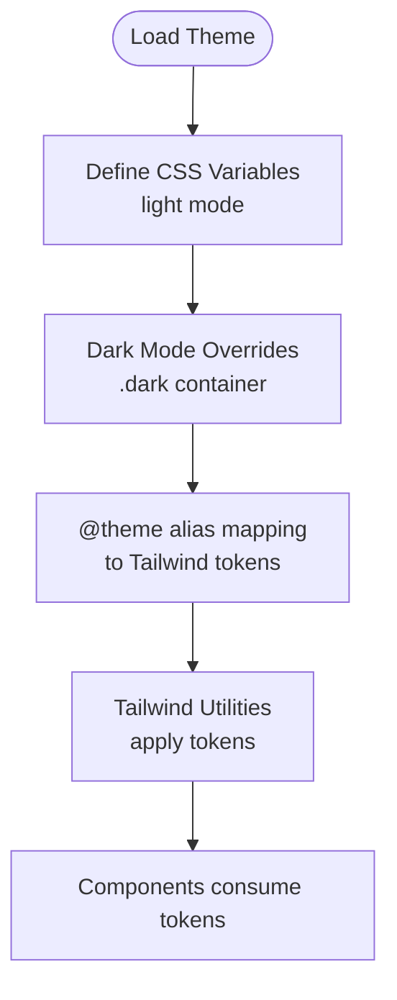
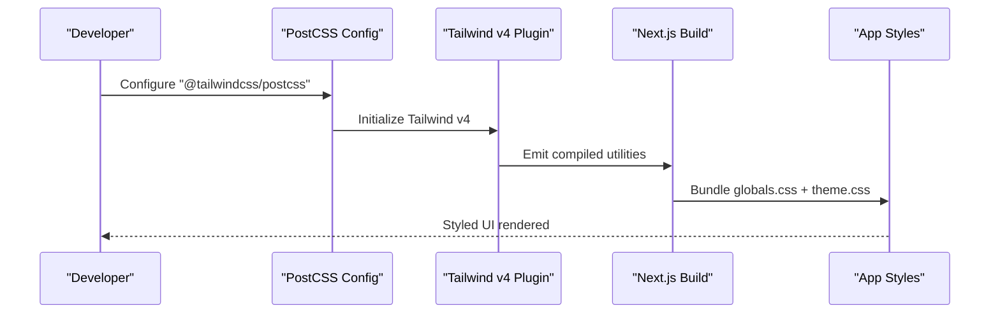
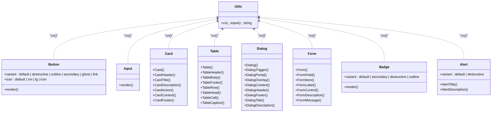
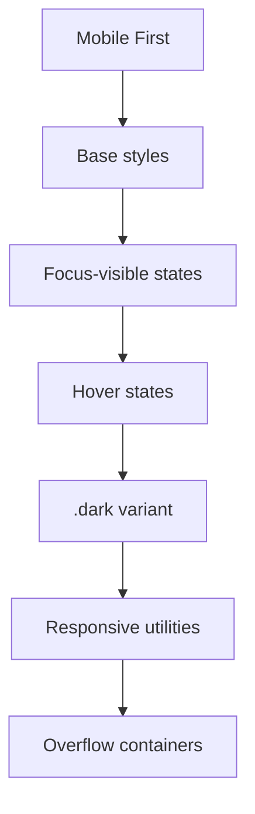
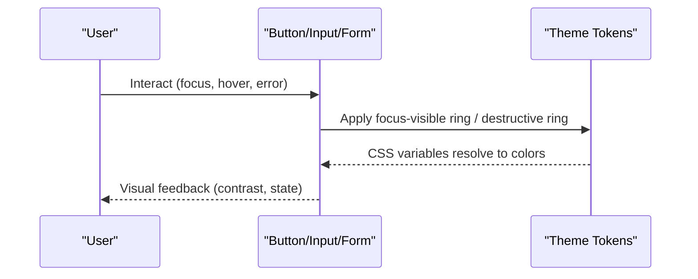
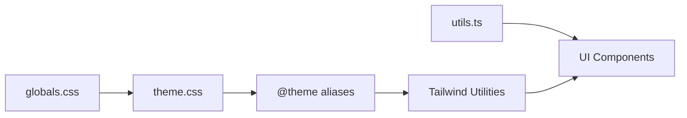

# Styling Guidelines

<cite>
**Referenced Files in This Document**
- [globals.css](file://frontend/src/app/globals.css)
- [theme.css](file://frontend/src/app/theme.css)
- [postcss.config.mjs](file://frontend/postcss.config.mjs)
- [package.json](file://frontend/package.json)
- [next.config.ts](file://frontend/next.config.ts)
- [utils.ts](file://frontend/src/components/ui/utils.ts)
- [button.tsx](file://frontend/src/components/ui/button.tsx)
- [input.tsx](file://frontend/src/components/ui/input.tsx)
- [card.tsx](file://frontend/src/components/ui/card.tsx)
- [table.tsx](file://frontend/src/components/ui/table.tsx)
- [dialog.tsx](file://frontend/src/components/ui/dialog.tsx)
- [form.tsx](file://frontend/src/components/ui/form.tsx)
- [badge.tsx](file://frontend/src/components/ui/badge.tsx)
- [alert.tsx](file://frontend/src/components/ui/alert.tsx)
</cite>

## Table of Contents
1. [Introduction](#introduction)
2. [Project Structure](#project-structure)
3. [Core Components](#core-components)
4. [Architecture Overview](#architecture-overview)
5. [Detailed Component Analysis](#detailed-component-analysis)
6. [Dependency Analysis](#dependency-analysis)
7. [Performance Considerations](#performance-considerations)
8. [Troubleshooting Guide](#troubleshooting-guide)
9. [Conclusion](#conclusion)
10. [Appendices](#appendices)

## Introduction
This document defines the styling guidelines for the PPA frontend, establishing a consistent design system and development workflow. It covers the color palette, typography scale, spacing system, and component styling patterns. It also explains the Tailwind CSS configuration, custom utility classes, and CSS custom properties, along with responsive design principles, accessibility requirements, and best practices for extending the design system.

## Project Structure
The styling system is organized around a centralized theme built with CSS custom properties and Tailwind v4. Theme tokens are defined in a single stylesheet and consumed via Tailwind’s theme pipeline. Utility classes are consolidated in a shared helper, while UI components encapsulate variant-driven styles using class-variance-authority.

**Diagram sources**
- [globals.css:1-2](file://frontend/src/app/globals.css#L1-L2)
- [theme.css:1-128](file://frontend/src/app/theme.css#L1-L128)
- [postcss.config.mjs:1-8](file://frontend/postcss.config.mjs#L1-L8)
- [utils.ts:1-7](file://frontend/src/components/ui/utils.ts#L1-L7)
- [button.tsx:1-59](file://frontend/src/components/ui/button.tsx#L1-L59)
- [input.tsx:1-22](file://frontend/src/components/ui/input.tsx#L1-L22)
- [card.tsx:1-93](file://frontend/src/components/ui/card.tsx#L1-L93)
- [table.tsx:1-117](file://frontend/src/components/ui/table.tsx#L1-L117)
- [dialog.tsx:1-136](file://frontend/src/components/ui/dialog.tsx#L1-L136)
- [form.tsx:1-169](file://frontend/src/components/ui/form.tsx#L1-L169)
- [badge.tsx:1-47](file://frontend/src/components/ui/badge.tsx#L1-L47)
- [alert.tsx:1-67](file://frontend/src/components/ui/alert.tsx#L1-L67)

**Section sources**
- [globals.css:1-2](file://frontend/src/app/globals.css#L1-L2)
- [theme.css:1-128](file://frontend/src/app/theme.css#L1-L128)
- [postcss.config.mjs:1-8](file://frontend/postcss.config.mjs#L1-L8)
- [utils.ts:1-7](file://frontend/src/components/ui/utils.ts#L1-L7)

## Core Components
- Color Palette: Defined via CSS custom properties with light and dark variants. Tokens include background, foreground, primary, secondary, muted, accent, destructive, success, warning, borders, input backgrounds, ring, and chart colors. Dark mode overrides are scoped under a dark container class.
- Typography Scale: The base font-size is set via a custom property. Headings and body text rely on semantic sizing and Tailwind utilities; no explicit typographic scale tokens are defined in the theme.
- Spacing System: The theme exposes radius tokens for corners and a base font-size variable. There are no dedicated spacing scale tokens; spacing is applied using Tailwind utilities and component-specific padding/margin classes.
- Component Styling Patterns: Variants are defined per component using class-variance-authority (cva). Shared composition is handled by a centralized cn() utility that merges and deduplicates Tailwind classes.

Key references:
- Theme tokens and dark mode: [theme.css:3-46](file://frontend/src/app/theme.css#L3-L46), [theme.css:48-83](file://frontend/src/app/theme.css#L48-L83), [theme.css:85-128](file://frontend/src/app/theme.css#L85-L128)
- Utilities: [utils.ts:4-6](file://frontend/src/components/ui/utils.ts#L4-L6)
- Variants and sizes: [button.tsx:7-35](file://frontend/src/components/ui/button.tsx#L7-L35), [badge.tsx:7-26](file://frontend/src/components/ui/badge.tsx#L7-L26)

**Section sources**
- [theme.css:3-46](file://frontend/src/app/theme.css#L3-L46)
- [theme.css:48-83](file://frontend/src/app/theme.css#L48-L83)
- [theme.css:85-128](file://frontend/src/app/theme.css#L85-L128)
- [utils.ts:4-6](file://frontend/src/components/ui/utils.ts#L4-L6)
- [button.tsx:7-35](file://frontend/src/components/ui/button.tsx#L7-L35)
- [badge.tsx:7-26](file://frontend/src/components/ui/badge.tsx#L7-L26)

## Architecture Overview
The styling architecture follows a layered approach:
- Theme layer: Centralized CSS custom properties define design tokens and dark mode overrides.
- Tailwind layer: Tailwind v4 consumes the theme tokens to power utilities and component variants.
- Component layer: UI components apply variants and sizes, composing shared utilities and Tailwind classes.
- Global layer: A global stylesheet imports Tailwind and the theme.

**Diagram sources**
- [theme.css:1-128](file://frontend/src/app/theme.css#L1-L128)
- [globals.css:1-2](file://frontend/src/app/globals.css#L1-L2)
- [utils.ts:1-7](file://frontend/src/components/ui/utils.ts#L1-L7)
- [button.tsx:1-59](file://frontend/src/components/ui/button.tsx#L1-L59)
- [input.tsx:1-22](file://frontend/src/components/ui/input.tsx#L1-L22)
- [card.tsx:1-93](file://frontend/src/components/ui/card.tsx#L1-L93)
- [table.tsx:1-117](file://frontend/src/components/ui/table.tsx#L1-L117)
- [dialog.tsx:1-136](file://frontend/src/components/ui/dialog.tsx#L1-L136)
- [form.tsx:1-169](file://frontend/src/components/ui/form.tsx#L1-L169)
- [badge.tsx:1-47](file://frontend/src/components/ui/badge.tsx#L1-L47)
- [alert.tsx:1-67](file://frontend/src/components/ui/alert.tsx#L1-L67)

## Detailed Component Analysis

### Design Token System
- Purpose: Provide a single source of truth for colors, radii, and ring styles across light and dark modes.
- Light and dark variants: Tokens update under a dark container class to support system preference or manual switching.
- Consumption: Tailwind theme aliases map CSS variables to Tailwind-scale tokens for consistent utility usage.

**Diagram sources**
- [theme.css:3-46](file://frontend/src/app/theme.css#L3-L46)
- [theme.css:48-83](file://frontend/src/app/theme.css#L48-L83)
- [theme.css:85-128](file://frontend/src/app/theme.css#L85-L128)

**Section sources**
- [theme.css:3-46](file://frontend/src/app/theme.css#L3-L46)
- [theme.css:48-83](file://frontend/src/app/theme.css#L48-L83)
- [theme.css:85-128](file://frontend/src/app/theme.css#L85-L128)

### Tailwind Configuration and Build Pipeline
- PostCSS plugin: Tailwind v4 is enabled via the official PostCSS plugin.
- Next.js integration: No custom Next.js config is required; defaults suffice.
- Global imports: Tailwind and theme are imported globally to ensure tokens and utilities are available across the app.

**Diagram sources**
- [postcss.config.mjs:1-8](file://frontend/postcss.config.mjs#L1-L8)
- [globals.css:1-2](file://frontend/src/app/globals.css#L1-L2)
- [next.config.ts:1-8](file://frontend/next.config.ts#L1-L8)

**Section sources**
- [postcss.config.mjs:1-8](file://frontend/postcss.config.mjs#L1-L8)
- [globals.css:1-2](file://frontend/src/app/globals.css#L1-L2)
- [next.config.ts:1-8](file://frontend/next.config.ts#L1-L8)

### Component Styling Patterns
- Variants and Sizes: Components define variant sets and size scales using cva. Consumers pass variant and size props to derive consistent styles.
- Composition: All components compose a shared cn() utility to merge and deduplicate classes.
- Focus and Accessibility: Components consistently apply focus-visible rings and aria-invalid states for error feedback.

**Diagram sources**
- [utils.ts:4-6](file://frontend/src/components/ui/utils.ts#L4-L6)
- [button.tsx:7-35](file://frontend/src/components/ui/button.tsx#L7-L35)
- [input.tsx:5-15](file://frontend/src/components/ui/input.tsx#L5-L15)
- [card.tsx:5-82](file://frontend/src/components/ui/card.tsx#L5-L82)
- [table.tsx:7-105](file://frontend/src/components/ui/table.tsx#L7-L105)
- [dialog.tsx:9-73](file://frontend/src/components/ui/dialog.tsx#L9-L73)
- [form.tsx:76-157](file://frontend/src/components/ui/form.tsx#L76-L157)
- [badge.tsx:7-26](file://frontend/src/components/ui/badge.tsx#L7-L26)
- [alert.tsx:6-20](file://frontend/src/components/ui/alert.tsx#L6-L20)

**Section sources**
- [button.tsx:7-35](file://frontend/src/components/ui/button.tsx#L7-L35)
- [input.tsx:5-15](file://frontend/src/components/ui/input.tsx#L5-L15)
- [card.tsx:5-82](file://frontend/src/components/ui/card.tsx#L5-L82)
- [table.tsx:7-105](file://frontend/src/components/ui/table.tsx#L7-L105)
- [dialog.tsx:9-73](file://frontend/src/components/ui/dialog.tsx#L9-L73)
- [form.tsx:76-157](file://frontend/src/components/ui/form.tsx#L76-L157)
- [badge.tsx:7-26](file://frontend/src/components/ui/badge.tsx#L7-L26)
- [alert.tsx:6-20](file://frontend/src/components/ui/alert.tsx#L6-L20)
- [utils.ts:4-6](file://frontend/src/components/ui/utils.ts#L4-L6)

### Responsive Design Principles
- Mobile-first approach: Components use responsive utilities and focus-visible states to adapt to small screens first.
- Breakpoints: Tailwind v4 utilities enable responsive variants; no custom breakpoints are defined in the theme.
- Adaptive containers: Components wrap content in responsive containers (e.g., table wrapper) to handle overflow on small screens.

**Diagram sources**
- [table.tsx:9-19](file://frontend/src/components/ui/table.tsx#L9-L19)
- [button.tsx](file://frontend/src/components/ui/button.tsx#L8)
- [input.tsx:11-13](file://frontend/src/components/ui/input.tsx#L11-L13)
- [theme.css:48-83](file://frontend/src/app/theme.css#L48-L83)

**Section sources**
- [table.tsx:9-19](file://frontend/src/components/ui/table.tsx#L9-L19)
- [button.tsx](file://frontend/src/components/ui/button.tsx#L8)
- [input.tsx:11-13](file://frontend/src/components/ui/input.tsx#L11-L13)
- [theme.css:48-83](file://frontend/src/app/theme.css#L48-L83)

### Accessibility Styling Requirements
- Focus management: Components consistently apply focus-visible rings and border highlights for keyboard navigation.
- Error states: aria-invalid is used to signal invalid states, with ring and border updates for both light and dark modes.
- Contrast and readability: The theme provides sufficient contrast via primary, secondary, and destructive tokens; maintain these tokens for new components.
- Semantic roles: Alerts use role attributes; dialogs and forms manage ARIA attributes for labels and descriptions.

**Diagram sources**
- [button.tsx](file://frontend/src/components/ui/button.tsx#L8)
- [input.tsx:11-13](file://frontend/src/components/ui/input.tsx#L11-L13)
- [form.tsx:107-123](file://frontend/src/components/ui/form.tsx#L107-L123)
- [theme.css:11-24](file://frontend/src/app/theme.css#L11-L24)
- [theme.css:48-83](file://frontend/src/app/theme.css#L48-L83)

**Section sources**
- [button.tsx](file://frontend/src/components/ui/button.tsx#L8)
- [input.tsx:11-13](file://frontend/src/components/ui/input.tsx#L11-L13)
- [form.tsx:107-123](file://frontend/src/components/ui/form.tsx#L107-L123)
- [theme.css:11-24](file://frontend/src/app/theme.css#L11-L24)
- [theme.css:48-83](file://frontend/src/app/theme.css#L48-L83)

## Dependency Analysis
- Theme-to-utility mapping: Tailwind consumes CSS variables via @theme aliases to produce utility classes.
- Component-to-utility coupling: Components depend on the shared cn() utility for class composition.
- Global-to-theme linkage: The global stylesheet imports Tailwind and the theme, ensuring tokens are available everywhere.

**Diagram sources**
- [theme.css:85-128](file://frontend/src/app/theme.css#L85-L128)
- [utils.ts:4-6](file://frontend/src/components/ui/utils.ts#L4-L6)
- [globals.css:1-2](file://frontend/src/app/globals.css#L1-L2)

**Section sources**
- [theme.css:85-128](file://frontend/src/app/theme.css#L85-L128)
- [utils.ts:4-6](file://frontend/src/components/ui/utils.ts#L4-L6)
- [globals.css:1-2](file://frontend/src/app/globals.css#L1-L2)

## Performance Considerations
- Minimize custom CSS: Prefer Tailwind utilities and theme tokens to reduce CSS bundle size.
- Use variants judiciously: Limit the number of variants and sizes per component to avoid generating excessive utility classes.
- Merge classes efficiently: The cn() utility consolidates classes; avoid passing redundant or conflicting classes.
- Keep theme minimal: Avoid defining unnecessary tokens; only expose what is used across components.

## Troubleshooting Guide
- Missing utilities after build: Ensure Tailwind plugin is configured and globals.css imports Tailwind and theme.
- Dark mode not applying: Verify the dark container class is present and theme variables are defined for dark mode.
- Conflicting styles: Use the cn() utility to deduplicate classes; check for order-sensitive Tailwind classes.
- Focus ring not visible: Confirm focus-visible ring utilities are included and tokens are set in the theme.

**Section sources**
- [postcss.config.mjs:1-8](file://frontend/postcss.config.mjs#L1-L8)
- [globals.css:1-2](file://frontend/src/app/globals.css#L1-L2)
- [theme.css:48-83](file://frontend/src/app/theme.css#L48-L83)
- [utils.ts:4-6](file://frontend/src/components/ui/utils.ts#L4-L6)

## Conclusion
The PPA frontend employs a robust, theme-driven styling architecture centered on CSS custom properties and Tailwind v4. Components adhere to variant-based patterns and shared composition utilities, ensuring consistency and maintainability. By following the guidelines herein—especially around tokens, responsive design, accessibility, and extension practices—you can reliably add new components and evolve the design system.

## Appendices

### A. Color Palette Reference
- Background and Foreground: Used for base surfaces and text.
- Primary: Brand color for primary actions and accents.
- Secondary: Subtle backgrounds and secondary actions.
- Muted and Accent: Supporting fills and interactive states.
- Destructive, Success, Warning: Status and feedback colors.
- Borders and Inputs: Structural and input-related tokens.
- Ring: Focus ring color.
- Charts: Multi-series chart palette.

**Section sources**
- [theme.css:11-36](file://frontend/src/app/theme.css#L11-L36)
- [theme.css:49-82](file://frontend/src/app/theme.css#L49-L82)

### B. Typography and Spacing Notes
- Typography: Base font-size is defined; no explicit scale tokens are present. Use semantic headings and Tailwind text utilities.
- Spacing: No dedicated spacing scale tokens; apply padding/margin via Tailwind utilities and component classes.

**Section sources**
- [theme.css](file://frontend/src/app/theme.css#L4)
- [card.tsx](file://frontend/src/components/ui/card.tsx#L10)
- [table.tsx](file://frontend/src/components/ui/table.tsx#L15)

### C. Extending the Design System
- Add tokens: Extend CSS variables in the theme and map them via @theme aliases.
- Create variants: Define new variants and sizes using cva in components.
- Compose classes: Always use the shared cn() utility for merging classes.
- Maintain accessibility: Preserve focus-visible states, aria-invalid handling, and contrast.

**Section sources**
- [theme.css:85-128](file://frontend/src/app/theme.css#L85-L128)
- [button.tsx:7-35](file://frontend/src/components/ui/button.tsx#L7-L35)
- [utils.ts:4-6](file://frontend/src/components/ui/utils.ts#L4-L6)