# UI Components & Styling

<cite>
**Referenced Files in This Document**
- [button.tsx](file://frontend/src/components/ui/button.tsx)
- [table.tsx](file://frontend/src/components/ui/table.tsx)
- [dialog.tsx](file://frontend/src/components/ui/dialog.tsx)
- [form.tsx](file://frontend/src/components/ui/form.tsx)
- [input.tsx](file://frontend/src/components/ui/input.tsx)
- [select.tsx](file://frontend/src/components/ui/select.tsx)
- [textarea.tsx](file://frontend/src/components/ui/textarea.tsx)
- [label.tsx](file://frontend/src/components/ui/label.tsx)
- [badge.tsx](file://frontend/src/components/ui/badge.tsx)
- [navigation-menu.tsx](file://frontend/src/components/ui/navigation-menu.tsx)
- [tabs.tsx](file://frontend/src/components/ui/tabs.tsx)
- [card.tsx](file://frontend/src/components/ui/card.tsx)
- [sheet.tsx](file://frontend/src/components/ui/sheet.tsx)
- [sidebar.tsx](file://frontend/src/components/ui/sidebar.tsx)
- [utils.ts](file://frontend/src/components/ui/utils.ts)
- [layout.tsx](file://frontend/src/components/Layout.tsx)
- [globals.css](file://frontend/src/app/globals.css)
- [theme.css](file://frontend/src/app/theme.css)
- [layout.tsx](file://frontend/src/app/layout.tsx)
- [page.tsx](file://frontend/src/app/page.tsx)
- [dashboard.tsx](file://frontend/src/components/pages/Dashboard.tsx)
- [inventory.tsx](file://frontend/src/components/pages/Inventory.tsx)
- [stock-in.tsx](file://frontend/src/components/pages/StockIn.tsx)
- [stock-out.tsx](file://frontend/src/components/pages/StockOut.tsx)
- [supplier.tsx](file://frontend/src/components/pages/Supplier.tsx)
- [monitoring-stock.tsx](file://frontend/src/components/pages/MonitoringStock.tsx)
- [master-data.tsx](file://frontend/src/components/pages/MasterData.tsx)
- [add-item.tsx](file://frontend/src/components/pages/AddItem.tsx)
- [edit-item.tsx](file://frontend/src/components/pages/EditItem.tsx)
- [stock-in-history.tsx](file://frontend/src/components/pages/StockInHistory.tsx)
- [stock-out-history.tsx](file://frontend/src/components/pages/StockOutHistory.tsx)
</cite>

## Table of Contents
1. [Introduction](#introduction)
2. [Project Structure](#project-structure)
3. [Core Components](#core-components)
4. [Architecture Overview](#architecture-overview)
5. [Detailed Component Analysis](#detailed-component-analysis)
6. [Dependency Analysis](#dependency-analysis)
7. [Performance Considerations](#performance-considerations)
8. [Troubleshooting Guide](#troubleshooting-guide)
9. [Conclusion](#conclusion)
10. [Appendices](#appendices)

## Introduction
This document describes the reusable UI component library used by the PPA frontend. It covers buttons, forms, tables, dialogs, navigation, and layout components. It explains props, customization via Tailwind CSS and class merging utilities, responsive behavior, accessibility attributes, composition patterns, state management, testing strategies, performance tips, and browser compatibility. Practical usage examples are provided across different application pages.

## Project Structure
The UI components live under the shared UI library and are consumed by page-level components and the global layout.

```mermaid
graph TB
subgraph "UI Library"
BTN["button.tsx"]
F["form.tsx"]
INP["input.tsx"]
TA["textarea.tsx"]
SEL["select.tsx"]
LAB["label.tsx"]
BAD["badge.tsx"]
TAB["tabs.tsx"]
NAV["navigation-menu.tsx"]
CARD["card.tsx"]
DLG["dialog.tsx"]
SH["sheet.tsx"]
SB["sidebar.tsx"]
TBL["table.tsx"]
U["utils.ts"]
end
subgraph "Pages"
DASH["Dashboard.tsx"]
INV["Inventory.tsx"]
SIN["StockIn.tsx"]
SOUT["StockOut.tsx"]
SUP["Supplier.tsx"]
MON["MonitoringStock.tsx"]
MD["MasterData.tsx"]
ADD["AddItem.tsx"]
EDIT["EditItem.tsx"]
SIH["StockInHistory.tsx"]
SOH["StockOutHistory.tsx"]
end
LAYOUT["Layout.tsx"]
GLOB["globals.css"]
THEME["theme.css"]
BTN --> DASH
BTN --> INV
BTN --> SIN
BTN --> SOUT
BTN --> SUP
BTN --> MON
BTN --> MD
BTN --> ADD
BTN --> EDIT
BTN --> SIH
BTN --> SOH
F --> ADD
F --> EDIT
INP --> ADD
INP --> EDIT
TA --> ADD
TA --> EDIT
SEL --> ADD
SEL --> EDIT
DLG --> INV
DLG --> MON
SH --> INV
SB --> DASH
TAB --> MON
NAV --> DASH
CARD --> DASH
TBL --> INV
LAB --> F
BAD --> INV
U --> BTN
U --> DLG
U --> SH
U --> SB
U --> TBL
U --> TAB
U --> NAV
U --> CARD
U --> F
U --> INP
U --> TA
U --> SEL
U --> LAB
U --> BAD
LAYOUT --> DASH
LAYOUT --> INV
LAYOUT --> SIN
LAYOUT --> SOUT
LAYOUT --> SUP
LAYOUT --> MON
LAYOUT --> MD
LAYOUT --> ADD
LAYOUT --> EDIT
LAYOUT --> SIH
LAYOUT --> SOH
GLOB --> LAYOUT
THEME --> LAYOUT
```

**Diagram sources**
- [button.tsx:1-59](file://frontend/src/components/ui/button.tsx#L1-L59)
- [form.tsx:1-169](file://frontend/src/components/ui/form.tsx#L1-L169)
- [input.tsx:1-22](file://frontend/src/components/ui/input.tsx#L1-L22)
- [textarea.tsx:1-19](file://frontend/src/components/ui/textarea.tsx#L1-L19)
- [select.tsx:1-190](file://frontend/src/components/ui/select.tsx#L1-L190)
- [label.tsx:1-25](file://frontend/src/components/ui/label.tsx#L1-L25)
- [badge.tsx:1-47](file://frontend/src/components/ui/badge.tsx#L1-L47)
- [tabs.tsx:1-67](file://frontend/src/components/ui/tabs.tsx#L1-L67)
- [navigation-menu.tsx:1-169](file://frontend/src/components/ui/navigation-menu.tsx#L1-L169)
- [card.tsx:1-93](file://frontend/src/components/ui/card.tsx#L1-L93)
- [dialog.tsx:1-136](file://frontend/src/components/ui/dialog.tsx#L1-L136)
- [sheet.tsx:1-140](file://frontend/src/components/ui/sheet.tsx#L1-L140)
- [sidebar.tsx:1-727](file://frontend/src/components/ui/sidebar.tsx#L1-L727)
- [table.tsx:1-117](file://frontend/src/components/ui/table.tsx#L1-L117)
- [utils.ts:1-7](file://frontend/src/components/ui/utils.ts#L1-L7)
- [Layout.tsx](file://frontend/src/components/Layout.tsx)
- [globals.css](file://frontend/src/app/globals.css)
- [theme.css](file://frontend/src/app/theme.css)
- [Dashboard.tsx](file://frontend/src/components/pages/Dashboard.tsx)
- [Inventory.tsx](file://frontend/src/components/pages/Inventory.tsx)
- [StockIn.tsx](file://frontend/src/components/pages/StockIn.tsx)
- [StockOut.tsx](file://frontend/src/components/pages/StockOut.tsx)
- [Supplier.tsx](file://frontend/src/components/pages/Supplier.tsx)
- [MonitoringStock.tsx](file://frontend/src/components/pages/MonitoringStock.tsx)
- [MasterData.tsx](file://frontend/src/components/pages/MasterData.tsx)
- [AddItem.tsx](file://frontend/src/components/pages/AddItem.tsx)
- [EditItem.tsx](file://frontend/src/components/pages/EditItem.tsx)
- [StockInHistory.tsx](file://frontend/src/components/pages/StockInHistory.tsx)
- [StockOutHistory.tsx](file://frontend/src/components/pages/StockOutHistory.tsx)

**Section sources**
- [button.tsx:1-59](file://frontend/src/components/ui/button.tsx#L1-L59)
- [form.tsx:1-169](file://frontend/src/components/ui/form.tsx#L1-L169)
- [input.tsx:1-22](file://frontend/src/components/ui/input.tsx#L1-L22)
- [select.tsx:1-190](file://frontend/src/components/ui/select.tsx#L1-L190)
- [dialog.tsx:1-136](file://frontend/src/components/ui/dialog.tsx#L1-L136)
- [sidebar.tsx:1-727](file://frontend/src/components/ui/sidebar.tsx#L1-L727)
- [table.tsx:1-117](file://frontend/src/components/ui/table.tsx#L1-L117)
- [Layout.tsx](file://frontend/src/components/Layout.tsx)
- [globals.css](file://frontend/src/app/globals.css)
- [theme.css](file://frontend/src/app/theme.css)

## Core Components
This section documents the reusable UI primitives and composite components that form the foundation of the application’s interface.

- Button
  - Purpose: Standard interactive element with variants and sizes.
  - Props: className, variant, size, asChild, plus native button attributes.
  - Variants: default, destructive, outline, secondary, ghost, link.
  - Sizes: default, sm, lg, icon.
  - Accessibility: Inherits focus-visible ring and aria-invalid support.
  - Composition: Uses a slot pattern to render either a button or a child component.
  - Tailwind integration: Uses a variant system and merges classes via the utility function.

- Input
  - Purpose: Text input with consistent focus states and invalid state styling.
  - Props: className, type, plus native input attributes.
  - Accessibility: Supports aria-invalid and focus-visible ring.

- Textarea
  - Purpose: Multi-line text input with consistent focus and invalid styling.
  - Props: className, plus native textarea attributes.

- Select
  - Purpose: Accessible single-select dropdown with trigger, content, items, and scrolling helpers.
  - Props: Root, Group, Value, Trigger (with size), Content (with position), Item, Label, Separator, ScrollUp/Down buttons.
  - Accessibility: Integrates with Radix UI primitives and supports keyboard navigation.

- Label
  - Purpose: Associates text with form controls.
  - Props: className, plus native label attributes.

- Badge
  - Purpose: Small status or informational indicator.
  - Props: className, variant, asChild, plus native span attributes.
  - Variants: default, secondary, destructive, outline.

- Tabs
  - Purpose: Tabbed content container with list, triggers, and content areas.
  - Props: Root, List, Trigger, Content.

- NavigationMenu
  - Purpose: Multi-level navigation with animated content and viewport.
  - Props: Root, List, Item, Trigger, Content, Viewport, Link, Indicator.

- Card
  - Purpose: Content container with header, title, description, action, content, footer.
  - Props: Card, Header, Title, Description, Action, Content, Footer.

- Dialog
  - Purpose: Modal overlay with close control and accessible semantics.
  - Props: Root, Trigger, Portal, Close, Overlay, Content, Header, Footer, Title, Description.

- Sheet
  - Purpose: Slide-out panel from a side with overlay and close control.
  - Props: Root, Trigger, Close, Portal, Overlay, Content (with side), Header, Footer, Title, Description.

- Table
  - Purpose: Responsive table wrapper with container and semantic sub-components.
  - Props: Table, TableHeader, TableBody, TableFooter, TableRow, TableHead, TableCell, TableCaption.

- Form (FormProvider, FormField, FormItem, FormLabel, FormControl, FormDescription, FormMessage)
  - Purpose: Integration with react-hook-form for validation and accessibility.
  - Props: Provider, Field, Item, Label, Control, Description, Message.
  - Accessibility: Provides ids and aria-describedby/invalid attributes.

- Utilities
  - cn: Merges clsx classes with tailwind-merge to avoid conflicts.

**Section sources**
- [button.tsx:1-59](file://frontend/src/components/ui/button.tsx#L1-L59)
- [input.tsx:1-22](file://frontend/src/components/ui/input.tsx#L1-L22)
- [textarea.tsx:1-19](file://frontend/src/components/ui/textarea.tsx#L1-L19)
- [select.tsx:1-190](file://frontend/src/components/ui/select.tsx#L1-L190)
- [label.tsx:1-25](file://frontend/src/components/ui/label.tsx#L1-L25)
- [badge.tsx:1-47](file://frontend/src/components/ui/badge.tsx#L1-L47)
- [tabs.tsx:1-67](file://frontend/src/components/ui/tabs.tsx#L1-L67)
- [navigation-menu.tsx:1-169](file://frontend/src/components/ui/navigation-menu.tsx#L1-L169)
- [card.tsx:1-93](file://frontend/src/components/ui/card.tsx#L1-L93)
- [dialog.tsx:1-136](file://frontend/src/components/ui/dialog.tsx#L1-L136)
- [sheet.tsx:1-140](file://frontend/src/components/ui/sheet.tsx#L1-L140)
- [table.tsx:1-117](file://frontend/src/components/ui/table.tsx#L1-L117)
- [form.tsx:1-169](file://frontend/src/components/ui/form.tsx#L1-L169)
- [utils.ts:1-7](file://frontend/src/components/ui/utils.ts#L1-L7)

## Architecture Overview
The UI library is built around:
- Reusable primitives with consistent styling and accessibility.
- A variant-driven design system using class-variance-authority.
- Tailwind CSS for styling with a centralized cn utility.
- Radix UI for accessible, headless interactions.
- Page components compose these primitives to build domain-specific interfaces.

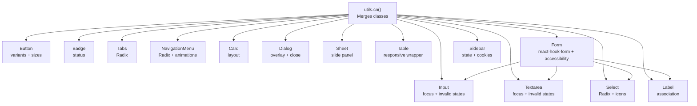

**Diagram sources**
- [utils.ts:1-7](file://frontend/src/components/ui/utils.ts#L1-L7)
- [button.tsx:1-59](file://frontend/src/components/ui/button.tsx#L1-L59)
- [input.tsx:1-22](file://frontend/src/components/ui/input.tsx#L1-L22)
- [textarea.tsx:1-19](file://frontend/src/components/ui/textarea.tsx#L1-L19)
- [select.tsx:1-190](file://frontend/src/components/ui/select.tsx#L1-L190)
- [label.tsx:1-25](file://frontend/src/components/ui/label.tsx#L1-L25)
- [badge.tsx:1-47](file://frontend/src/components/ui/badge.tsx#L1-L47)
- [tabs.tsx:1-67](file://frontend/src/components/ui/tabs.tsx#L1-L67)
- [navigation-menu.tsx:1-169](file://frontend/src/components/ui/navigation-menu.tsx#L1-L169)
- [card.tsx:1-93](file://frontend/src/components/ui/card.tsx#L1-L93)
- [dialog.tsx:1-136](file://frontend/src/components/ui/dialog.tsx#L1-L136)
- [sheet.tsx:1-140](file://frontend/src/components/ui/sheet.tsx#L1-L140)
- [table.tsx:1-117](file://frontend/src/components/ui/table.tsx#L1-L117)
- [form.tsx:1-169](file://frontend/src/components/ui/form.tsx#L1-L169)
- [sidebar.tsx:1-727](file://frontend/src/components/ui/sidebar.tsx#L1-L727)

## Detailed Component Analysis

### Button
- Design: Variant-driven with size tokens; supports asChild for composition.
- Accessibility: Focus-visible ring, aria-invalid integration.
- Styling: Tailwind classes merged via cn; variant tokens applied conditionally.
- Usage patterns:
  - Icon-only buttons using size "icon".
  - Link-like actions using variant "link".
  - Danger actions using variant "destructive".

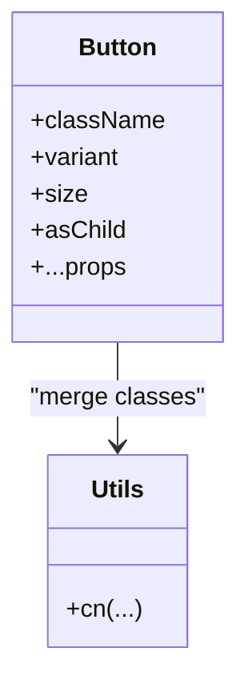

**Diagram sources**
- [button.tsx:1-59](file://frontend/src/components/ui/button.tsx#L1-L59)
- [utils.ts:1-7](file://frontend/src/components/ui/utils.ts#L1-L7)

**Section sources**
- [button.tsx:1-59](file://frontend/src/components/ui/button.tsx#L1-L59)

### Input, Textarea
- Design: Consistent focus-visible ring and aria-invalid styling.
- Accessibility: Proper invalid state and focus styles.
- Styling: Tailwind utilities for borders, backgrounds, transitions.

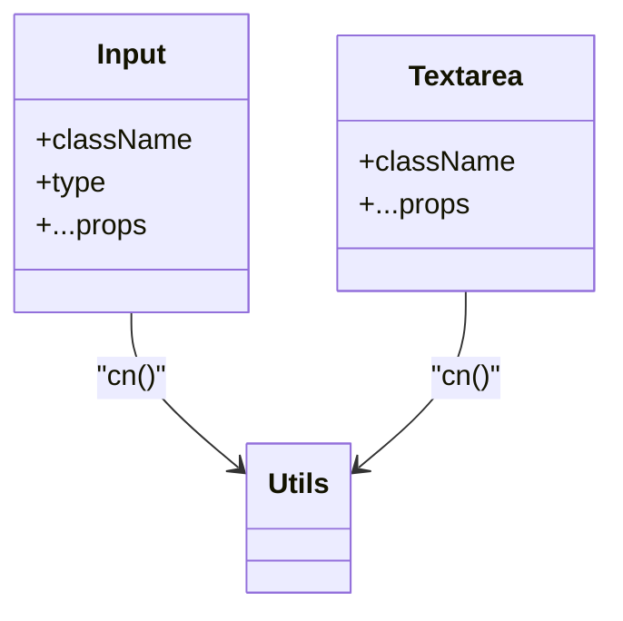

**Diagram sources**
- [input.tsx:1-22](file://frontend/src/components/ui/input.tsx#L1-L22)
- [textarea.tsx:1-19](file://frontend/src/components/ui/textarea.tsx#L1-L19)
- [utils.ts:1-7](file://frontend/src/components/ui/utils.ts#L1-L7)

**Section sources**
- [input.tsx:1-22](file://frontend/src/components/ui/input.tsx#L1-L22)
- [textarea.tsx:1-19](file://frontend/src/components/ui/textarea.tsx#L1-L19)

### Select
- Design: Trigger with chevrons, content with popper positioning, items with indicators.
- Accessibility: Integrates with Radix Select; supports keyboard navigation and scrolling.
- Styling: Uses data-* attributes for size and state; Tailwind utilities for layout and transitions.

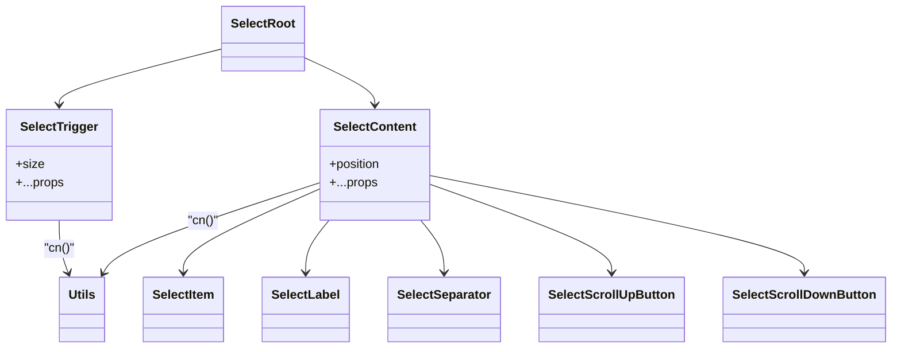

**Diagram sources**
- [select.tsx:1-190](file://frontend/src/components/ui/select.tsx#L1-L190)
- [utils.ts:1-7](file://frontend/src/components/ui/utils.ts#L1-L7)

**Section sources**
- [select.tsx:1-190](file://frontend/src/components/ui/select.tsx#L1-L190)

### Form (react-hook-form integration)
- Design: Provider, Field, Item, Label, Control, Description, Message.
- Accessibility: Generates ids and aria-describedby/invalid attributes automatically.
- Usage patterns:
  - Wrap forms with Form provider.
  - Use FormField per control.
  - Render labels and messages conditionally based on field state.

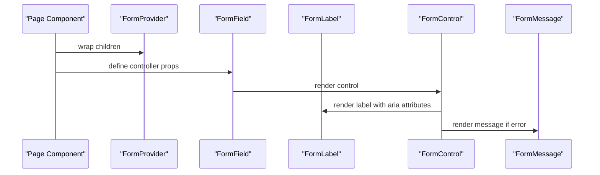

**Diagram sources**
- [form.tsx:1-169](file://frontend/src/components/ui/form.tsx#L1-L169)

**Section sources**
- [form.tsx:1-169](file://frontend/src/components/ui/form.tsx#L1-L169)

### Dialog
- Design: Root, Trigger, Portal, Overlay, Content, Header/Footer, Title/Description.
- Accessibility: Overlay animation, focus trap via portal, close button with sr-only label.
- Usage patterns:
  - Trigger opens content centered with backdrop.
  - Header/Footer aligns actions responsively.

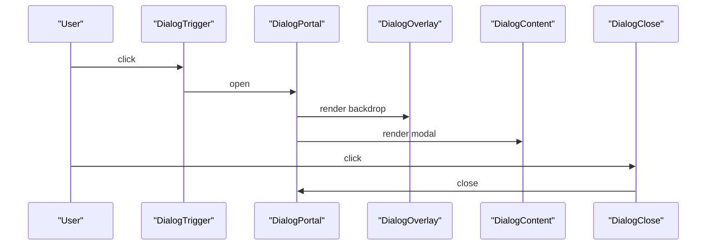

**Diagram sources**
- [dialog.tsx:1-136](file://frontend/src/components/ui/dialog.tsx#L1-L136)

**Section sources**
- [dialog.tsx:1-136](file://frontend/src/components/ui/dialog.tsx#L1-L136)

### Sheet
- Design: Side-docked panel with overlay and close control; supports sides (top/right/bottom/left).
- Accessibility: Close button with sr-only label; overlay animates in/out.
- Usage patterns:
  - Right/left drawers for filters or actions.
  - Mobile-friendly overlays.

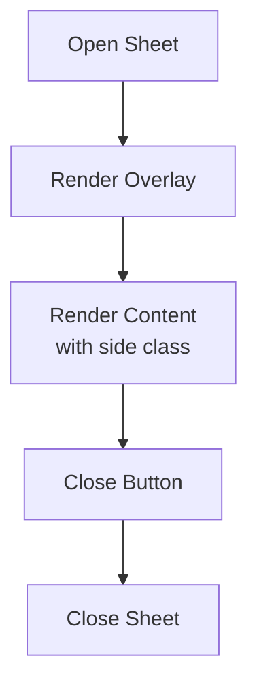

**Diagram sources**
- [sheet.tsx:1-140](file://frontend/src/components/ui/sheet.tsx#L1-L140)

**Section sources**
- [sheet.tsx:1-140](file://frontend/src/components/ui/sheet.tsx#L1-L140)

### Table
- Design: Container with horizontal scroll for responsiveness; semantic sub-components for header/body/footer/row/cell.
- Accessibility: Hover and selected states; checkbox alignment helpers.
- Usage patterns:
  - Combine Table with TableHeader/TableBody/TableFooter.
  - Use TableRow/TableCell for data rendering.

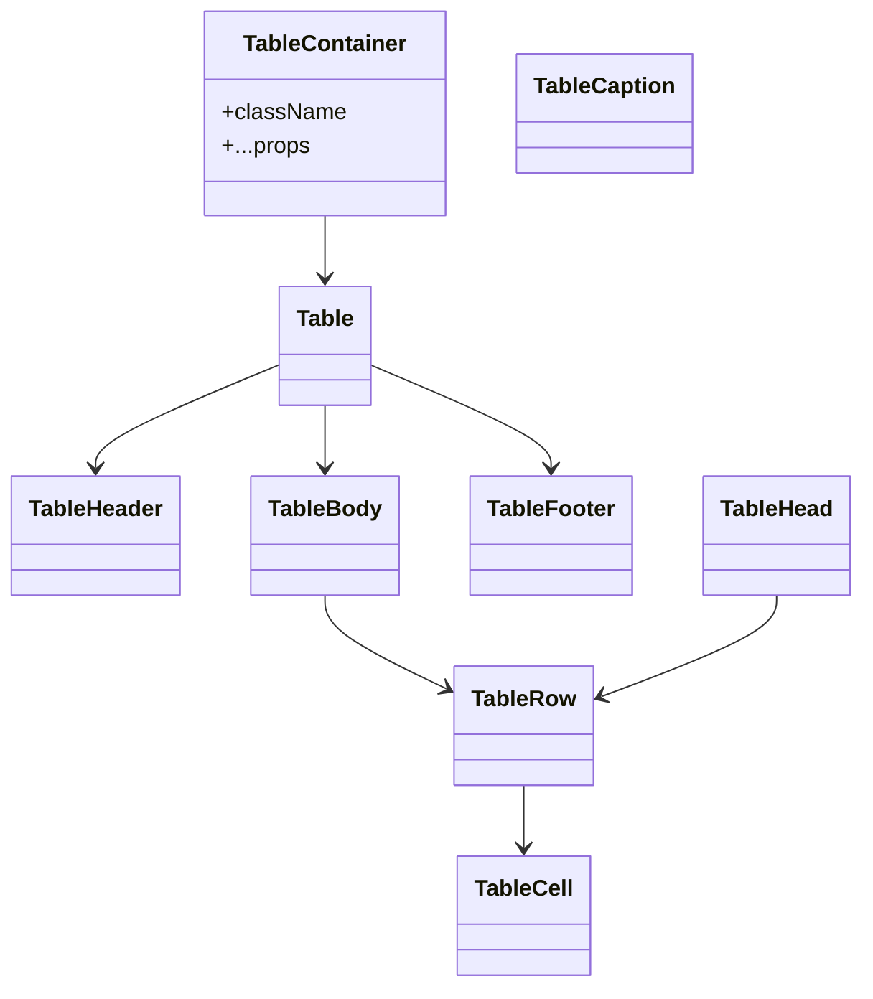

**Diagram sources**
- [table.tsx:1-117](file://frontend/src/components/ui/table.tsx#L1-L117)

**Section sources**
- [table.tsx:1-117](file://frontend/src/components/ui/table.tsx#L1-L117)

### NavigationMenu
- Design: Multi-level menu with animated content and optional viewport.
- Accessibility: Trigger rotation, indicator, and keyboard navigation.
- Usage patterns:
  - Use NavigationMenu with nested NavigationMenuContent and links.

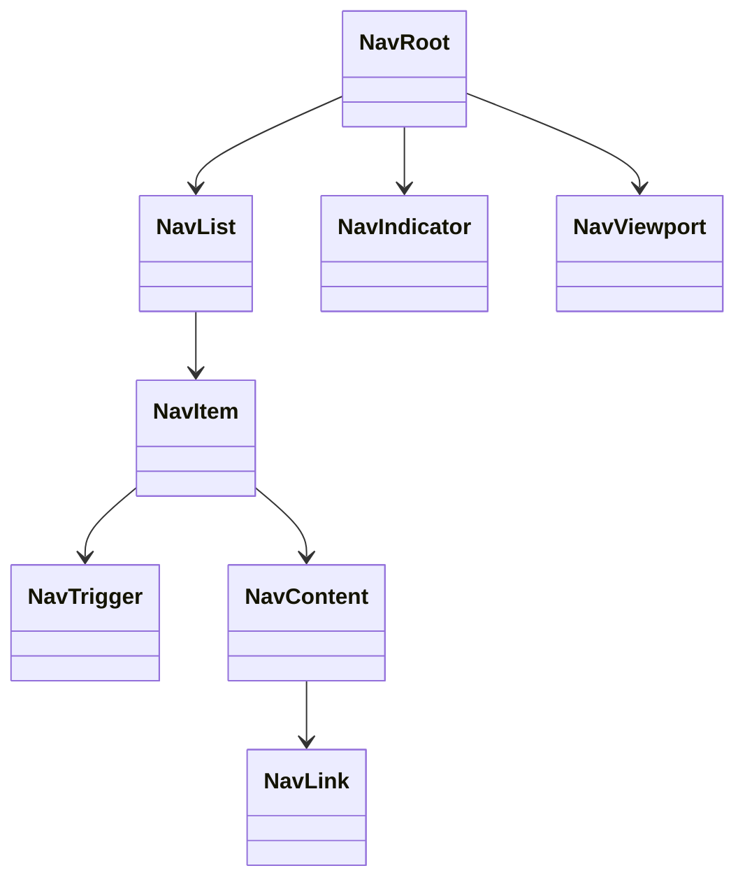

**Diagram sources**
- [navigation-menu.tsx:1-169](file://frontend/src/components/ui/navigation-menu.tsx#L1-L169)

**Section sources**
- [navigation-menu.tsx:1-169](file://frontend/src/components/ui/navigation-menu.tsx#L1-L169)

### Tabs
- Design: Controlled via Radix Tabs; styled triggers and content areas.
- Accessibility: Focus-visible rings and controlled state.
- Usage patterns:
  - TabsList with multiple TabsTrigger mapped to TabsContent.

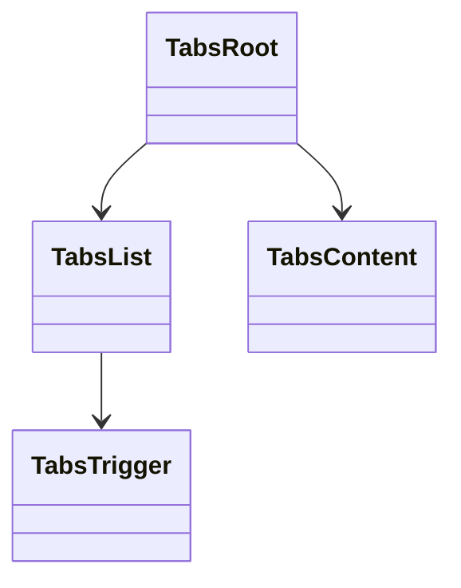

**Diagram sources**
- [tabs.tsx:1-67](file://frontend/src/components/ui/tabs.tsx#L1-L67)

**Section sources**
- [tabs.tsx:1-67](file://frontend/src/components/ui/tabs.tsx#L1-L67)

### Card
- Design: Flexible content container with header/title/description/action/content/footer slots.
- Accessibility: Semantic structure for screen readers.
- Usage patterns:
  - Use CardHeader/CardTitle/CardDescription/CardAction/CardContent/CardFooter.

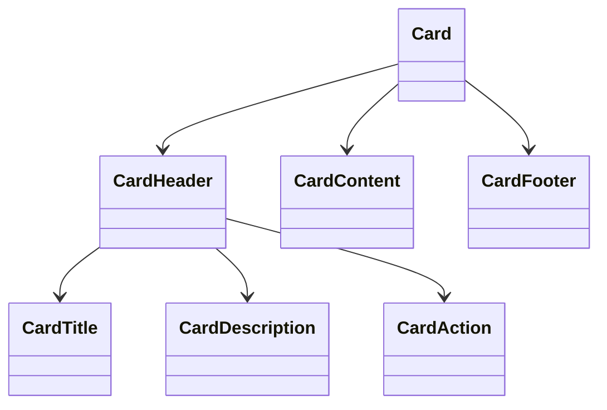

**Diagram sources**
- [card.tsx:1-93](file://frontend/src/components/ui/card.tsx#L1-L93)

**Section sources**
- [card.tsx:1-93](file://frontend/src/components/ui/card.tsx#L1-L93)

### Badge
- Design: Status or tag indicator with variants.
- Accessibility: Focus-visible ring; integrates with links.

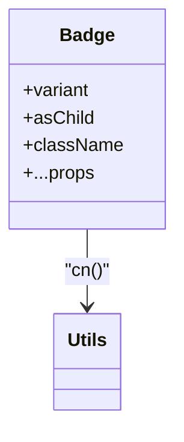

**Diagram sources**
- [badge.tsx:1-47](file://frontend/src/components/ui/badge.tsx#L1-L47)
- [utils.ts:1-7](file://frontend/src/components/ui/utils.ts#L1-L7)

**Section sources**
- [badge.tsx:1-47](file://frontend/src/components/ui/badge.tsx#L1-L47)

### Sidebar (complex layout component)
- Design: Collapsible sidebar with multiple variants (sidebar/floating/inset), collapsible modes (offcanvas/icon/none), and mobile Sheet integration.
- State management: Internal state with cookie persistence; keyboard shortcut toggling; TooltipProvider for tooltips.
- Composition: SidebarProvider supplies context; Sidebar renders desktop or mobile; SidebarTrigger toggles; SidebarMenu family composes navigation.
- Accessibility: Proper roles and labels for mobile Sheet; focus management via portals.

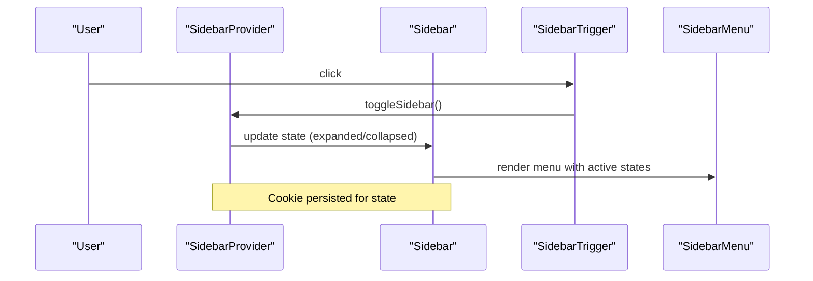

**Diagram sources**
- [sidebar.tsx:1-727](file://frontend/src/components/ui/sidebar.tsx#L1-L727)

**Section sources**
- [sidebar.tsx:1-727](file://frontend/src/components/ui/sidebar.tsx#L1-L727)

## Dependency Analysis
- Utility dependency: All components depend on cn for safe class merging.
- Primitive dependencies:
  - Button depends on Slot and cva.
  - Dialog/Sheet depend on Radix UI dialog primitives and Lucide icons.
  - Form depends on react-hook-form and Label primitive.
  - Select depends on Radix UI Select primitives and icons.
  - NavigationMenu depends on Radix UI NavigationMenu and icons.
  - Tabs depends on Radix UI Tabs.
  - Sidebar composes Button, Input, Separator, Sheet, Tooltip, and use-mobile.
- Styling dependencies: Tailwind classes and theme variables; global CSS and theme CSS apply base styles and color tokens.

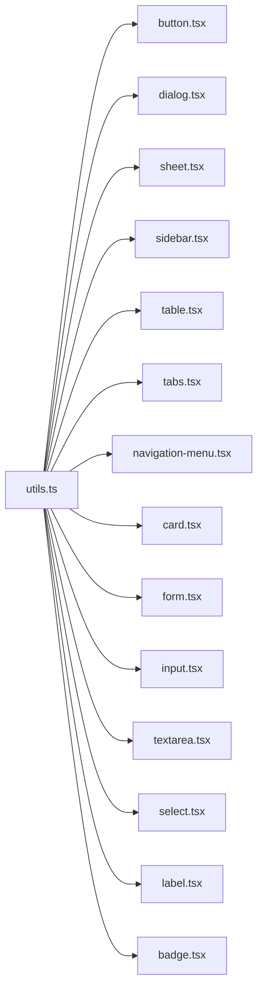

**Diagram sources**
- [utils.ts:1-7](file://frontend/src/components/ui/utils.ts#L1-L7)
- [button.tsx:1-59](file://frontend/src/components/ui/button.tsx#L1-L59)
- [dialog.tsx:1-136](file://frontend/src/components/ui/dialog.tsx#L1-L136)
- [sheet.tsx:1-140](file://frontend/src/components/ui/sheet.tsx#L1-L140)
- [sidebar.tsx:1-727](file://frontend/src/components/ui/sidebar.tsx#L1-L727)
- [table.tsx:1-117](file://frontend/src/components/ui/table.tsx#L1-L117)
- [tabs.tsx:1-67](file://frontend/src/components/ui/tabs.tsx#L1-L67)
- [navigation-menu.tsx:1-169](file://frontend/src/components/ui/navigation-menu.tsx#L1-L169)
- [card.tsx:1-93](file://frontend/src/components/ui/card.tsx#L1-L93)
- [form.tsx:1-169](file://frontend/src/components/ui/form.tsx#L1-L169)
- [input.tsx:1-22](file://frontend/src/components/ui/input.tsx#L1-L22)
- [textarea.tsx:1-19](file://frontend/src/components/ui/textarea.tsx#L1-L19)
- [select.tsx:1-190](file://frontend/src/components/ui/select.tsx#L1-L190)
- [label.tsx:1-25](file://frontend/src/components/ui/label.tsx#L1-L25)
- [badge.tsx:1-47](file://frontend/src/components/ui/badge.tsx#L1-L47)

**Section sources**
- [utils.ts:1-7](file://frontend/src/components/ui/utils.ts#L1-L7)
- [button.tsx:1-59](file://frontend/src/components/ui/button.tsx#L1-L59)
- [dialog.tsx:1-136](file://frontend/src/components/ui/dialog.tsx#L1-L136)
- [sheet.tsx:1-140](file://frontend/src/components/ui/sheet.tsx#L1-L140)
- [sidebar.tsx:1-727](file://frontend/src/components/ui/sidebar.tsx#L1-L727)
- [table.tsx:1-117](file://frontend/src/components/ui/table.tsx#L1-L117)
- [tabs.tsx:1-67](file://frontend/src/components/ui/tabs.tsx#L1-L67)
- [navigation-menu.tsx:1-169](file://frontend/src/components/ui/navigation-menu.tsx#L1-L169)
- [card.tsx:1-93](file://frontend/src/components/ui/card.tsx#L1-L93)
- [form.tsx:1-169](file://frontend/src/components/ui/form.tsx#L1-L169)
- [input.tsx:1-22](file://frontend/src/components/ui/input.tsx#L1-L22)
- [textarea.tsx:1-19](file://frontend/src/components/ui/textarea.tsx#L1-L19)
- [select.tsx:1-190](file://frontend/src/components/ui/select.tsx#L1-L190)
- [label.tsx:1-25](file://frontend/src/components/ui/label.tsx#L1-L25)
- [badge.tsx:1-47](file://frontend/src/components/ui/badge.tsx#L1-L47)

## Performance Considerations
- Prefer variant-driven components to minimize conditional rendering overhead.
- Use the cn utility to merge classes efficiently; avoid excessive re-computation of class lists.
- Defer heavy computations inside component render trees; memoize derived values.
- Limit DOM nodes in large tables; consider virtualization for very large datasets.
- Use lazy loading for images and offscreen content within sheets/dialogs.
- Keep animations minimal; leverage data-state attributes to animate only necessary elements.
- Use server-side rendering and static generation where appropriate to reduce client work.

## Troubleshooting Guide
- Focus and keyboard navigation:
  - Ensure focus-visible rings are visible and accessible.
  - Verify that Dialog/Sheet portals properly manage focus traps.
- Form validation:
  - Confirm useFormField is used within FormField.
  - Check aria-invalid and aria-describedby are set correctly.
- Styling conflicts:
  - Use cn to merge classes; avoid overriding Tailwind utilities directly.
  - Prefer variant props over inline styles.
- Responsive behavior:
  - Test mobile breakpoints for Sidebar and Sheet.
  - Validate horizontal scrolling for tables.
- Accessibility:
  - Provide labels for all form controls.
  - Ensure close buttons have meaningful aria-labels.
  - Use semantic HTML and proper roles for complex widgets.

**Section sources**
- [form.tsx:1-169](file://frontend/src/components/ui/form.tsx#L1-L169)
- [dialog.tsx:1-136](file://frontend/src/components/ui/dialog.tsx#L1-L136)
- [sheet.tsx:1-140](file://frontend/src/components/ui/sheet.tsx#L1-L140)
- [sidebar.tsx:1-727](file://frontend/src/components/ui/sidebar.tsx#L1-L727)
- [table.tsx:1-117](file://frontend/src/components/ui/table.tsx#L1-L117)

## Conclusion
The PPA UI component library emphasizes accessibility, composability, and consistent styling through Tailwind CSS and Radix UI. By leveraging variant systems, utility functions, and react-hook-form integration, developers can build reliable, responsive interfaces quickly while maintaining a cohesive design language across pages.

## Appendices

### Tailwind CSS Integration and Best Practices
- Use the cn utility to merge Tailwind classes safely.
- Prefer variant props (e.g., Button variant/size) over ad-hoc class overrides.
- Apply focus-visible rings and aria-invalid states for accessible feedback.
- Utilize data-slot attributes for targeted styling and testing.

**Section sources**
- [utils.ts:1-7](file://frontend/src/components/ui/utils.ts#L1-L7)
- [button.tsx:1-59](file://frontend/src/components/ui/button.tsx#L1-L59)
- [input.tsx:1-22](file://frontend/src/components/ui/input.tsx#L1-L22)
- [form.tsx:1-169](file://frontend/src/components/ui/form.tsx#L1-L169)

### Responsive Design Implementation
- Tables use a horizontally scrollable container for small screens.
- Sidebar adapts to mobile via Sheet and respects breakpoints.
- Dialog/Sheet adjust sizing and placement for various viewports.
- NavigationMenu toggles viewport visibility on demand.

**Section sources**
- [table.tsx:1-117](file://frontend/src/components/ui/table.tsx#L1-L117)
- [sidebar.tsx:1-727](file://frontend/src/components/ui/sidebar.tsx#L1-L727)
- [dialog.tsx:1-136](file://frontend/src/components/ui/dialog.tsx#L1-L136)
- [sheet.tsx:1-140](file://frontend/src/components/ui/sheet.tsx#L1-L140)
- [navigation-menu.tsx:1-169](file://frontend/src/components/ui/navigation-menu.tsx#L1-L169)

### Accessibility Compliance
- Components expose aria-invalid, aria-describedby, and aria-labels where applicable.
- Focus management handled by portals and Radix primitives.
- Keyboard shortcuts supported in complex components (e.g., Sidebar toggle).

**Section sources**
- [form.tsx:1-169](file://frontend/src/components/ui/form.tsx#L1-L169)
- [input.tsx:1-22](file://frontend/src/components/ui/input.tsx#L1-L22)
- [sidebar.tsx:1-727](file://frontend/src/components/ui/sidebar.tsx#L1-L727)

### Component Testing Strategies
- Unit tests for component props and variants using a renderer that supports Tailwind classes.
- Integration tests for form components validating react-hook-form behavior and accessibility attributes.
- Snapshot tests for Dialog/Sheet to ensure markup stability.
- Visual regression tests for responsive layouts (tables, sidebar, navigation).

[No sources needed since this section provides general guidance]

### Browser Compatibility
- Modern browsers with ES2020+ features and Tailwind CSS v3+.
- Polyfills may be required for older environments if needed.

[No sources needed since this section provides general guidance]

### Practical Examples Across Pages
- Dashboard
  - Compose Card, Badge, and Tabs to present summaries and analytics.
  - Use NavigationMenu for top-level navigation.
- Inventory
  - Use Table with sorting and filtering; Dialog for confirmations.
  - Badge indicates statuses; Button for actions.
- StockIn/StockOut
  - Form with Input, Textarea, Select; FormLabel/FormMessage for validation.
- Supplier/MasterData
  - Dialog for creation/editing; Sheet for filters.
- MonitoringStock
  - Tabs to switch views; Card for grouped metrics.

**Section sources**
- [dashboard.tsx](file://frontend/src/components/pages/Dashboard.tsx)
- [inventory.tsx](file://frontend/src/components/pages/Inventory.tsx)
- [stock-in.tsx](file://frontend/src/components/pages/StockIn.tsx)
- [stock-out.tsx](file://frontend/src/components/pages/StockOut.tsx)
- [supplier.tsx](file://frontend/src/components/pages/Supplier.tsx)
- [monitoring-stock.tsx](file://frontend/src/components/pages/MonitoringStock.tsx)
- [master-data.tsx](file://frontend/src/components/pages/MasterData.tsx)
- [add-item.tsx](file://frontend/src/components/pages/AddItem.tsx)
- [edit-item.tsx](file://frontend/src/components/pages/EditItem.tsx)
- [stock-in-history.tsx](file://frontend/src/components/pages/StockInHistory.tsx)
- [stock-out-history.tsx](file://frontend/src/components/pages/StockOutHistory.tsx)